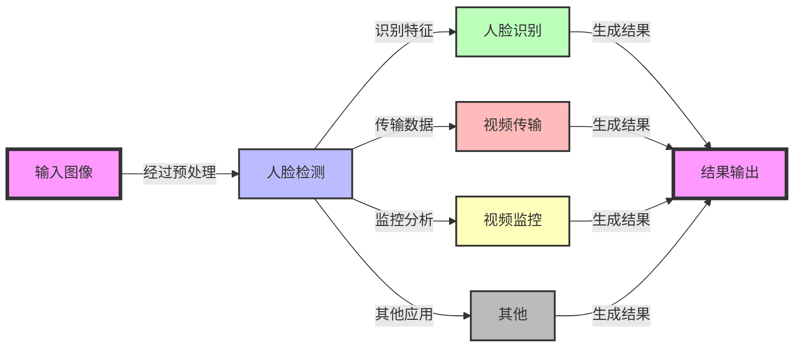

# 1. 人脸识别介绍

## 1.1 概况

人脸识别（Face Recognition）是一种依据人的面部特征（如统计或几何特征等），自动进行身份识别的生物识别技术，也称为人像识别、相貌识别、面孔识别或面部识别。通常我们所说的人脸识别是指基于光学人脸图像的身份识别与验证。

人脸识别技术利用摄像机或摄像头采集含有人脸的图像或视频流，并自动在图像中检测和跟踪人脸，然后对检测到的人脸图像进行一系列相关应用操作。

技术上，人脸识别包括图像采集、特征定位、身份确认和查找。特征定位是从照片中提取人脸中的特征，如眼睛、鼻子、嘴巴等的位置，再通过特征的对比来输出识别结果。

## 1.2 应用

1. **金融**：
   - 人脸识别技术在金融领域主要用于用户身份验证，提高交易安全性。例如，在银行业务中，客户可以通过人脸识别进行快速身份认证，简化了传统的密码或卡片验证流程。
   - 此外，人脸识别也用于防止欺诈行为，通过实时监测交易过程中的人脸信息，确保交易的合法性。

2. **安防**：
   - 在安防领域，人脸识别技术被广泛应用于监控系统中，用于实时监控和识别可疑人员，提高公共安全。
   - 人脸识别系统可以与警方数据库连接，快速识别犯罪嫌疑人或失踪人员，协助警方快速响应。

3. **医疗**：
   - 人脸识别在医疗领域的应用包括病人身份确认，确保医疗服务的准确性和安全性。
   - 此外，人脸识别技术还可以用于医疗记录管理，通过识别病人身份来快速访问其医疗档案，提高医疗服务效率。

4. **新零售**：
   - 在新零售行业，人脸识别技术可以用于个性化推荐和顾客识别，提升顾客体验。
   - 通过识别顾客的面部特征，零售商可以提供定制化的购物推荐，同时也可以用于会员管理和优惠促销活动。

## 1.3 主要流程

人脸检测是人脸识别研究的基础，其性能对整个人脸识别系统的表现具有决定性影响，因此是至关重要的一环。它的核心任务是对摄像机捕获的图像进行精确分割，将图像划分为两个部分：人脸区域和非人脸区域。接下来，系统将深入分析人脸区域，提取关键面部信息，并描述人脸的行为特征，为人脸识别的深入分析和理解奠定基础。

### 1.3.1 人脸采集

人脸图像的采集涵盖了多样化的场景，包括静态图像、动态视频、不同角度和表情的捕捉。当目标对象进入设备的拍摄视野时，采集设备将自动进行人脸图像的搜索与捕捉。

人脸采集的效果受多种因素影响，主要包括：

- **图像大小**：人脸图像的尺寸对于实现精确的人脸识别至关重要。尺寸过小可能导致识别精度下降，而过大则可能减缓处理速度。非专业人脸识别摄像头通常建议的最小识别人脸像素为60×60或100×100。在这个范围内，识别算法能够更有效地提升识别的准确率和召回率。图像大小直接关联于被摄者与摄像头的距离，是确保识别质量的关键因素。

- **图像分辨率**：

  - **普通摄像头**：分辨率对于人脸识别系统的性能至关重要。720P摄像头虽然分辨率较低，但已足够捕捉到清晰的面部特征，适合于中短距离的识别任务。然而，其在远距离识别时可能因分辨率限制而难以捕捉到足够的细节。1080P摄像头则提供更高的分辨率，能够捕捉到更细致的面部特征，适用于更远距离的识别需求。选择摄像头的分辨率应基于识别距离、光线条件、系统处理能力和预算等因素。1080P摄像头因其高分辨率通常在人脸识别系统中更为常见，提供更优的图像质量和识别性能。而720P摄像头在成本敏感或近距离识别的场景中也是一个经济有效的选择。

  - **高分辨率摄像头**：4K摄像头能够在10米内提供清晰的人脸识别，而7K摄像头的识别距离可扩展至20米，这些高分辨率摄像头在需要远距离识别的应用场景中表现出色。

- **光照环境**：光照条件直接影响人脸识别的效果。过曝或过暗的环境都可能降低识别的准确性。为了优化光照条件，可以利用摄像头的补光或滤光功能进行调整，或者通过算法模型对图像光线进行智能优化，确保在各种光照条件下都能保持识别的稳定性和准确性。

- **人脸遮挡**：遮挡是指在正面人脸图像中出现的眼镜、头发、围巾或其他配饰。过去几年的研究主要集中在可控环境下的人脸识别；然而，在不可控环境下，如光照变化、表情变化和部分遮挡等因素，对识别系统提出了新的挑战。

- **模糊程度**：在实际应用场景中，运动模糊是一个主要问题，因为人脸相对于摄像头的移动可能导致图像模糊。一些高端摄像头具备抗模糊功能，但在成本受限的情况下，可以通过算法模型来优化图像清晰度。

- **遮挡程度**：五官未被遮挡、脸部边缘清晰可见的图像是进行人脸识别的最佳选择。然而，在实际场景中，人脸常常被帽子、眼镜等遮挡物部分遮挡。对于这些情况，需要根据算法的要求决定是否将这些图像纳入训练数据集。

- **采集角度**：正脸图像是人脸识别中最理想的采集角度。但在实际应用中，获取正脸图像往往具有挑战性。因此，算法模型需要能够处理包括侧面、半侧面以及不同仰角的人脸图像。在工业应用中，摄像头的安装角度应确保人脸与摄像头之间的角度在算法的识别范围内。

### 1.3.2 人脸检测

在图像处理中，准确标定人脸的位置和大小是至关重要的一步。这不仅涉及到识别人脸区域，还需要提取其中的关键信息，例如直方图特征、颜色特征、模板特征、结构特征以及Haar特征等。这些特征随后被用来实现人脸检测的目的。此外，人脸关键点检测技术能够自动识别并估计人脸图像上脸部特征点的坐标，为进一步的分析和处理提供基础。

目前，主流的人脸检测方法包括：

1. **基于Adaboost的学习方法**：这是一种分类算法，它通过组合多个弱分类器来形成一个强分类器。Adaboost算法通过加权投票的方式，挑选出最能代表人脸的矩形特征（即弱分类器），并将这些弱分类器串联起来，形成一个高效的级联结构的层叠分类器。这种方法在提高检测速度方面表现出色。

2. **Viola-Jones框架**：这是一种经典的人脸检测算法，以其平衡的性能和合理的速度而受到青睐，特别适合在移动端和嵌入式设备上使用。

3. **DPM（Deformable Part-based Model）**：虽然DPM在性能上表现出色，但其检测速度相对较慢，可能不适合对实时性要求较高的应用场景。

4. **CNN（Convolutional Neural Networks）**：卷积神经网络在人脸检测领域展现出了卓越的性能，尤其是在处理复杂背景和不同姿态的人脸图像时。尽管CNN模型可能需要更多的计算资源，但其准确性和鲁棒性使其成为许多高端应用的首选。

---

🤔 𝑸𝒖𝒆𝒔𝒕𝒊𝒐𝒏：人脸检测和人脸识别是一回儿事儿吗？
🥳 𝑨𝒏𝒔𝒘𝒆𝒓：人脸检测是人脸识别流程中的<b>第一步</b>，它负责找出人脸在哪里；而人脸识别则是基于检测到的人脸，进一步识别出人脸的身份。两者结合使用。

🤔 𝑸𝒖𝒆𝒔𝒕𝒊𝒐𝒏：Adaboost是如何实现人脸检测的呢？
🥳 𝑨𝒏𝒔𝒘𝒆𝒓：在图像中准确标定出人脸的位置和大小，并把其中有用的信息挑出来(如直方图特征、颜色特征、模板特征、结构特征及Haar特征等)，然后利用信息来达到人脸检测的目的，常用人脸关键点检测，即自动估计人脸图片上脸部特征点的坐标。

     
Adaboost简单原理介绍

如上图所示，一张正常的人脸可以用一些简单的矩形来表示，比如人眼和鼻子，人眼是黑色的，鼻子则是白色的。对于两个人眼而言，两个眼睛都是黑色的，鼻梁是白色的。以此类推，我们可以提取出如下图所示的特征。

     
不同的弱分类器特征展示

这里面的每一个框就是一个个弱分类器，通过这些小的弱分类的级联，形成一个强的人脸分类器。

### 1.3.3 人脸图像预处理

人脸图像预处理是一个关键步骤，它在人脸检测的基础上，对图像进行细致的处理，以便于后续的特征提取工作。由于原始图像常常受到环境条件和随机因素的干扰，它们通常需要经过一系列的预处理步骤，才能被有效地用于人脸分析。

主要的预处理过程包括：

- **人脸对准**：确保图像中的人脸位置正确，方向一致，从而获得<b>标准化的人脸图像</b>。
- **光线补偿**：调整图像的光照条件，以减少光线不均对特征提取的影响。
- **灰度变换**：将彩色图像转换为灰度图像，简化处理流程，同时保留必要的视觉信息。
- **直方图均衡化**：优化图像的对比度，使得图像的灰度分布更加均匀。
- **归一化**：调整图像尺寸和灰度值，确保所有处理后的图像具有统一的格式和范围。
- **几何校正**：修正图像中的几何失真，如透视变形或倾斜。
- **中值滤波**：平滑图像，减少噪声，同时尽量保留边缘信息。
- **锐化**：增强图像的边缘，提高图像的清晰度，有助于特征的准确提取。

通过这些预处理步骤，可以显著提高人脸图像的质量，为后续的人脸识别和分析提供更加准确和可靠的数据基础。

### 1.3.4 人脸特征提取

人脸识别系统能够利用多种特征类型，这些特征通常分为视觉特征、像素统计特征、人脸图像的变换系数特征以及代数特征等。人脸特征提取，也称为人脸表征，是识别过程中的核心环节，它涉及到对人脸特征的建模和深入分析。

人脸特征提取的方法主要包括：

- **基于知识的表征方法**：这种方法包括几何特征法和模板匹配法。它依据人脸器官的形状描述以及它们之间的相对距离来提取有助于人脸分类的特征数据。特征分量通常包括特征点间的欧氏距离、曲率和角度等。

- **几何特征**：人脸由眼睛、鼻子、嘴和下巴等局部区域构成。这些局部区域及其相互之间的结构关系可以通过几何描述来捕捉，形成识别人脸的关键特征。几何特征涵盖了特征点之间的距离、眼睛和嘴巴的轮廓曲率以及面部器官的相对角度。

- **基于代数特征或统计学习的表征方法**：这种方法的基本思想是将人脸在空间域内的高维描述转化为频域或其他空间内的低维描述。它包括线性投影表征方法和非线性投影表征方法。线性投影方法主要包括主成分分析（PCA）、K-L变换、独立成分分析（ICA）和Fisher线性判别分析（FLD）。非线性特征提取方法包括基于核的特征提取技术和以流形学习为主导的特征提取技术，这些方法能够揭示数据在非线性空间中的结构特性。

### 1.3.5 特征匹配与身份识别

通过将提取的人脸特征值与数据库中存储的特征模板进行对比，我们采用设定的阈值作为判断标准。通过比较相似度与该阈值，可以有效地识别和判断人脸的身份信息。

     

## 1.4 算法评价指标

**检测率：** 检测率是衡量人脸检测系统识别能力的关键指标，它表示原始图像中正确识别出的人脸数量占实际人脸总数的比例。高检测率表明系统能够有效捕捉图像中的人脸，确保识别的准确性。

**误识率：** 误识率，亦称为误报率或误检率，衡量的是系统将非人脸区域错误识别为人脸的能力。这一指标至关重要，因为它反映了系统在区分真实人脸与干扰因素时的性能。低误识率意味着系统在排除错误识别方面具有较高的准确性。

**检测速度：** 在许多应用场景，如实时人脸识别、人脸跟踪和智能视频监控等，对检测速度有严格要求。检测速度的提升有时可能以牺牲检测率为代价。然而，在检测率和误识率达到可接受水平的情况下，检测速度的提高将为系统带来更高的效率。

**鲁棒性：** 鲁棒性是衡量检测系统在不同环境和条件下的稳定性和适应性的重要指标。在人脸检测中，漏报率（即漏检率）和误报率（误识率）之间存在一种权衡关系。如果检测系统为了降低漏报率而提高其敏感度，可能会导致误报率的增加，即系统可能会错误地将非人脸区域识别为人脸。反之，如果为了减少误报率而提高检测的严格性，可能会增加漏报率，从而错过一些实际的人脸。因此，在设计和优化人脸检测算法时，需要在漏报率和误报率之间找到适当的平衡点，以确保系统在保持高准确性的同时，也能适应不同的应用场景和环境条件。

## 1.5 常用公开数据集

### 1.5.1 FER13

数据集链接：[FER13](https://www.kaggle.com/deadskull7/fer2013)

Fer2013人脸表情数据集是一个包含35886张人脸表情图像的集合。它分为三个部分：训练集包含28708张图片，公共验证集和私有验证集各包含3589张图片。每张图像都是48x48像素的<b>灰度图像</b>。数据集中共有7种表情类别，它们分别用数字标签0至6表示，并对应以下表情及其中英文描述：

|序号|类别名称|翻译|
|:-:|:-:|:-:|
|0|Anger|愤怒|
|1|Disgust|厌恶|
|2|Fear|恐惧|
|3|Happy|开心|
|4|Sad|伤心|
|5|Surprised|惊讶|
|6|Normal|中性|

FER13数据集并没有直接给出图片，而是将其保存在一个CSV文件中，第一列表示类别，第二列表示图片数据，第三列表示用途（训练/验证）。

### 1.5.2 300 Faces in the Wild

数据集链接：[300-W](https://ibug.doc.ic.ac.uk/resources/300-W/)

300-W是一个用于定脸识别和轮廓标注的数据集，它在机器视觉领域的顶级会议——国际计算机视觉会议（ICCV）2013的人脸检测竞赛中发挥了重要作用。HELEN数据集包含2330张人脸图片，每张图片都经过了精心的标注，具有11种不同的面部属性分类。