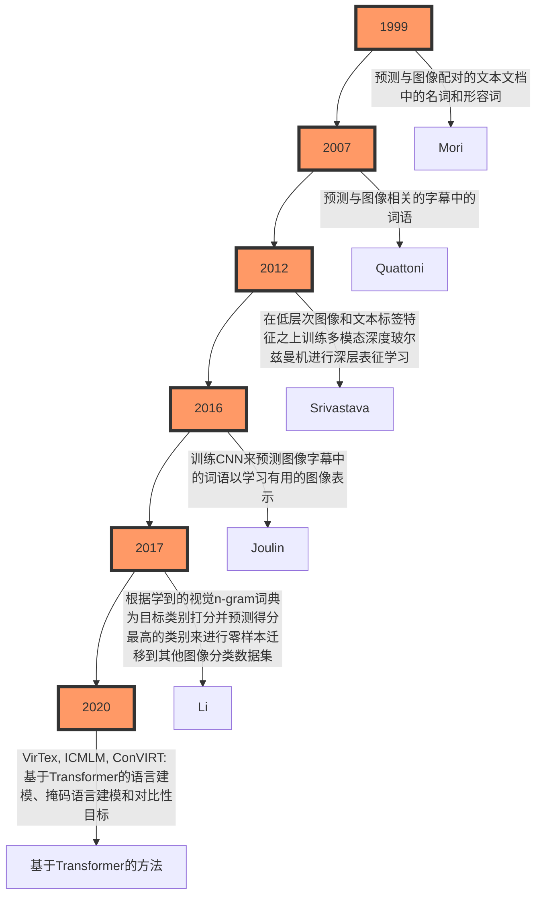

<div align=center>
    </br><center></center>
</div>

> - 论文地址：[Learning Transferable Visual Models From Natural Language Supervision](https://arxiv.org/abs/2103.00020)
> 	- https://arxiv.org/abs/2103.00020
> - 源码地址：[CLIP](https://github.com/OpenAI/CLIP)
> 	- https://github.com/OpenAI/CLIP

# 摘要（Abstract）

最先进的计算机视觉系统是被训练来预测一组固定的预定对象类别的（a fixed set of predetermined object categories）。这种受限形式的监督（restricted form of supervision）限制了它们的通用性（generality）和实用性（usability），因为需要额外的标注数据来指定任何其他视觉概念。直接从关于图像的原始文本中学习是一种很有前景的替代方案，它利用了更为广泛的监督来源。

我们展示了简单的预训练任务——即预测哪条字幕（caption）与哪个图像（images）匹配 —— 是一种有效且可扩展（scalable）的方法，可以在一个包含4亿对（图像-文本）的数据集上从零开始学习到最先进（SOTA）的图像表示。预训练之后，自然语言可以用来引用已学习的视觉概念（或描述新的概念），这使得模型能够不经过特定数据集训练就进行零样本迁移（zero-shot transfer）至下游任务（downstream tasks）。我们通过在超过30个不同的现有计算机视觉数据集上进行基准测试来研究这种方法的表现，这些数据集涵盖了诸如OCR（光学字符识别）、视频中的动作识别（actions recognition in videos）、地理定位（geo-localization）以及多种类型的细粒度物体分类（many types of fine-grained object classification）等任务。

该模型对于大多数任务都能非平凡地转移（transfers non-trivially），并且经常能在不需要任何特定数据集训练的情况下与完全监督的Baseline相竞争。例如，在ImageNet上的零样本测试中，我们在没有使用其128万训练样本的情况下达到了原始ResNet-50模型的准确率。

> 🤔 𝑸𝒖𝒆𝒔𝒕𝒊𝒐𝒏：“<u>该模型对于大多数任务都能非平凡地转移</u>”这句话应该怎么理解？
>
> 🥳 𝑨𝒏𝒔𝒘𝒆𝒓：这句话的意思是，这个模型能够将它从一个任务或数据集上学到的知识有效地应用（或迁移）到其他不同的任务上，而且这种迁移不仅仅是简单的或者基本的，而是具有一定的复杂度和有效性。这里的“非平凡”强调了迁移学习的效果并不是微不足道的；也就是说，<font color='purple'><b>模型在新任务上的表现不是仅仅依靠运气或者非常基础的能力，而是真正利用了它在预训练阶段学到的特征和知识</b></font>。
>
> 简单来说，这意味着即使面对没有见过的新任务，模型也能够基于之前的学习经验做出合理且有用的预测或决策，这表明模型具备了一定程度的泛化能力。在机器学习中，这种能力是非常宝贵的，因为它减少了为每个特定任务收集大量标记数据的需求，并且可以加速新应用场景下的模型开发过程。

> 我们常见的计算机视觉任务都是给定数据，之后对数据进行标注，然后模型根据GroundTruth计算损失值从而让模型能够在预测时接近GroundTruth，那么这样的范式限制了模型的通用性和实用性，主要的原因就是因为我们人为的给数据添加了标注。以目标检测任务为例子，它需要标注一些Bounding Box（矩形框），比如我们想要让这个模型即可以检测人，那么我在标注的时候需要对人进行画框，并且给框一个类别。最常见的方法就是只设定一个类别`person`，那么只要画面中有“人”出现，我们就需要对这个“人”进行画框。之后模型再根据我们的标注进行训练，训练完成之后模型就可以将输入图片中的“人”给框出来。这看起来是没有什么问题的，但大家想一下，我们直接将“人”用一个框给框出来这个操作是不是过于粗暴了，我们浪费掉了画面中的很多信息，比如说一个人在大街上，那么大街上的“车”、“动物”、“...”其他事物，甚至于说人身上的衣服这些信息我们好像都浪费掉了，这就限制了模型的通用性，因为我们只让模型关注人，其他别的目标都是负样本。与此同时，如果我们想让这个除了关注`person`这个类别外，还需要关注`dog`这个类别，那么我们需要重新标注一遍我们的数据集，这影响了模型的实用性。
>
> 那么解决方案是什么呢？想当然的我们就想让模型直接学习图片，不给它指定类别，但这样有点过于理想了，所以OpenAI提出了一个方案，那就是图片-文本对（pair）的形式，也就是说，我们需要用文字对一张图片进行描述，之后让模型根据文本中的内容去学习图片中的内容。这样可以提高图片的信息利用率。
>
> 很明显，文本-图像对的形式虽然看起来很美好，但模型学习来应该很困难，所以OpenAI使用了4亿对这样的数据，模型在训练完成之后模型是具有很强的语义理解能力，之后再将这个模型应用到其他下游任务。这个就相当于是你通关之后再去新手村打怪，怪真的不经打🤣—— 不是下游任务变简单了，而是模型实在太强了（《慎勇》的既视感😂）。

# 1. 引言与动机（Introduction and Motivating Work）

在过去几年中，直接从原始文本学习的预训练方法彻底改变了自然语言处理（NLP）领域。像自回归（autoregressive）和掩码语言建模（masked language modeling）这样的<font color='red'><b>与任务无关的目标函数（Task-agnostic objectives）</b></font>已经在计算能力、模型容量和数据规模上跨越了多个数量级，并且持续地提高了性能。<u>"文本到文本（text-to-text）"作为标准化输入输出接口的发展使得与任务无关的架构能够零样本（zero-shot）迁移到下游数据集，而无需专门的输出头或针对特定数据集的定制化</u>。像GPT-3这样的旗舰系统现在在许多任务上与定制模型具有竞争力，同时几乎不需要任何特定数据集的训练数据。

> 🤔 𝑸𝒖𝒆𝒔𝒕𝒊𝒐𝒏：“"文本到文本（text-to-text）"作为标准化输入输出接口的发展使得与任务无关的架构能够零样本（zero-shot）迁移到下游数据集，而无需专门的输出头或针对特定数据集的定制化”这句话应该怎么理解？
>
> 🥳 𝑨𝒏𝒔𝒘𝒆𝒓：
>
> - **无需专门的输出头**：因为这里的前提是`Text2Text`任务，所以输入是Text，输出也是Text，即便将模型迁移到下游任务中，下游任务也应该是`Text2Text`的，所以不需要修改最后的输出头。
> - **针对特定数据集的定制化**：“零样本迁移”意味着模型能够利用它在预训练阶段学到的知识去处理之前未曾见过的新任务或新数据，无需额外的针对该任务的数据来进行微调。这极大地提高了模型的应用灵活性和效率，减少了为每个新应用场景准备大量标注数据的需求（简单来说，模型之前的训练集太丰富了，这从而让模型具有非常强大的泛化能力，所以常规的下游任务也是可以搞定的）。
>
> 💡 **PS**：其实针对特定的细分领域，即便模型再好也是需要微调的😂

这些结果表明，现代预训练方法可以从网络规模的文本集合中获取的总监督超过了高质量众包标注（crowd-labeled）的NLP数据集所能提供的。然而，在计算机视觉等其他领域，仍然通常的做法是在如ImageNet这样的众包标注数据集上预训练模型。直接从网页文本学习的可扩展预训练方法是否也能在计算机视觉领域带来类似的突破？先前的工作是令人鼓舞的。

> 🤔 𝑸𝒖𝒆𝒔𝒕𝒊𝒐𝒏：众包标注（crowd-labeled）是什么？
>
> 🥳 𝑨𝒏𝒔𝒘𝒆𝒓：众包标注是一种将数据标注任务分配给大量非专业人员（通常是通过互联网招募的志愿者或有偿工作者）的方法。这些参与者被称为“众包工人”或“标注者”，他们可能来自不同的背景，并且通常不需要具备特定领域的专业知识。

超过20年前，Mori等人（1999）探讨了通过训练模型来预测与图像配对的文本文档中的名词和形容词以改进基于内容的图像检索。Quattoni等人（2007）展示了可以通过在分类器权重空间内进行流形学习来学习更高效的数据表示，这些分类器被训练来预测与图像相关的字幕中的词语。Srivastava & Salakhutdinov（2012）探索了通过在低层次图像和文本标签特征之上训练多模态深度玻尔兹曼机来进行深层表征学习。Joulin等人（2016）现代化了这一系列工作，并证明了训练CNN来预测图像字幕中的词语可以学习到有用的图像表示。他们将YFCC100M数据集（2016）中图像的标题、描述和标签元数据（Metainfo）转换成一个词袋多标签分类任务（a bag-of words multi-label classification task），并显示预先训练AlexNet（2012）来预测这些标签所学得的表示在迁移任务上的表现与基于ImageNet的预训练相似。Li等人（2017）随后将这种方法扩展到了除了单独词语之外还预测短语n-gram，并展示了他们的系统能够通过根据其学到的视觉n-gram词典为目标类别打分并预测得分最高的类别来进行零样本迁移到其他图像分类数据集。采用更新的架构和预训练方法，VirTex（2020）、ICMLM（2020）以及ConVIRT（2020）最近展示了基于Transformer的语言建模、掩码语言建模和对比性目标在从文本学习图像表示方面的潜力。



> 🤔 𝑸𝒖𝒆𝒔𝒕𝒊𝒐𝒏：简单介绍一下YFCC100M数据集。
>
> 🥳 𝑨𝒏𝒔𝒘𝒆𝒓：YFCC100M（Yahoo Flickr Creative Commons 100 Million Dataset）是一个大规模的多媒体数据集，包含大约1亿个媒体对象，其中包括9920万张图片和80万个视频（从Flickr平台上收集的）。
>
> - **特点**：
>
> 	- **规模**：数据集非常庞大，包含近1亿个媒体对象，这使得它成为研究中的一个重要资源。
>
> 	- **多样性**：数据集中的内容覆盖了广泛的主题和场景，从自然风光到城市景观，再到日常生活中的各种活动。
>
> 	- **元数据**：每个媒体对象都附带丰富的元数据，包括Flickr标识符、所有者姓名、使用的相机信息、标题、标签、地理位置等。
>
> 	- **时间跨度**：数据集包含了从2004年Flickr成立之初到2014年初期间的照片和视频（时间跨度接近10年），提供了这一时期内人们如何拍摄、描述和分享照片与视频的全面快照。
>
> 	- **开放性**：由于采用了Creative Commons许可，该数据集对于学术研究和非商业用途是完全开放的，研究人员可以在不违反版权的情况下使用这些数据进行实验。
>
>
> - 挑战：
>
> 	- **质量不一**：虽然数据集很大，但其中许多图片的描述信息不够好，例如只是文件名或相机设置，而**不是真正的描述性文字**。
>
> 	- **稀疏性和多样性**：部分图片的元数据可能缺失或质量不高，需要进行额外的数据清洗和处理。
>

> 🤔 𝑸𝒖𝒆𝒔𝒕𝒊𝒐𝒏：多模态深度玻尔兹曼机是什么？
>
> 🥳 𝑨𝒏𝒔𝒘𝒆𝒓：多模态深度玻尔兹曼机（Multimodal Deep Boltzmann Machine, MDBM）是一种深度学习模型，它能够处理和融合来自不同模态的数据，例如图像和文本。这种模型扩展了传统的深度玻尔兹曼机（Deep Boltzmann Machine, DBM），使其能够同时学习多种类型数据的联合表示。
>

尽管作为**概念验证**非常令人兴奋，使用自然语言监督来学习图像表示仍然是罕见的。这可能是因为在常见基准测试上展示的性能远低于其他方法。例如，Li等人（2017）在零样本设置下仅达到ImageNet 11.5%的准确率。这远远低于当前最先进水平的88.4%（Xie 等, 2020），甚至低于经典计算机视觉方法的50%准确率（Deng 等, 2012）。相反，更狭窄但针对性强的弱监督使用已经改善了性能。Mahajan等人（2018）表明，预测Instagram图片上的ImageNet相关标签是一种有效的预训练任务。当微调到ImageNet时，这些预训练模型的准确率提高了超过5%，并在当时提升了整体最先进的水平。Kolesnikov等人（2019）和Dosovitskiy等人（2020）也通过预训练模型来预测噪声标记的JFT-300M数据集中的类别，在一系列更广泛的迁移基准上展示了显著的提升。

这项工作代表了从有限量的监督“黄金标签”学习与从实际上无限量的原始文本学习之间的务实折衷。然而，它并非没有妥协。两项工作都精心设计并限制了它们的监督范围，分别到1000类和18291类。自然语言由于其通用性，能够表达并通过监督更多的视觉概念。这两种方法也都使用静态softmax分类器进行预测，缺乏动态输出机制。这极大地限制了它们的灵活性，并削弱了它们的“零样本”能力。

> 🤔 𝑸𝒖𝒆𝒔𝒕𝒊𝒐𝒏：“这两种方法也都使用静态softmax分类器进行预测，缺乏动态输出机制。这极大地限制了它们的灵活性，并削弱了它们的“零样本”能力”这句话应该怎么理解？
>
> 🥳 𝑨𝒏𝒔𝒘𝒆𝒓：这句话指出，提到的两种方法（指那些利用自然语言监督来学习图像表示的方法）在进行预测时都使用了静态softmax分类器。这意味着它们在输出层有一个固定的类别集合，每个类别的数量是预先定义好的。例如，在一个有1000个类别的数据集上训练的模型，其softmax层将有1000个输出节点，每个节点对应一个特定的类别。
>
> **缺乏动态输出机制** 意味着这些模型不能灵活地处理未见过的类别或者动态调整输出空间。具体来说：
>
> - **灵活性限制**：如果模型需要对新类别进行预测，而这个新类别不在原始训练时的类别集合中，那么模型将无法直接识别或分类这个新的类别。它只能从已知的固定类别中选择最接近的一个。
>   
> - **削弱零样本能力**：零样本学习是指模型能够对训练过程中未曾出现过的类别做出正确的预测。<font color='red'><b>使用静态softmax分类器的模型通常不具备这种能力，因为它们依赖于训练阶段已经定义好的类别标签</b></font>。**当遇到新的、未知的类别时，模型没有一种机制来生成相应的输出或对其进行合理的预测**。
>
> 相比之下，更先进的方法可能会采用一些技术来增强模型的零样本学习能力，比如通过文本描述来生成新的类别表示，或者利用更复杂的输出层设计，如条件生成模型等，使得模型能够在面对新类别时具备更强的泛化能力和适应性。这样可以提高模型的灵活性，使其更好地应对实际应用中的多样性。

这些弱监督模型与最近探索直接从自然语言学习图像表示的方法之间的一个关键区别在于==规模==。虽然Mahajan等人（2018）和Kolesnikov等人（2019）在数百万至数十亿张图像上训练了他们的模型多年加速时间，但VirTex、ICMLM和ConVIRT仅在一万到两万张图像上训练了几日加速时间。在这项工作中，我们缩小了这个差距，并研究了大规模自然语言监督下训练的图像分类器的行为。得益于互联网上大量公开可用的数据，我们创建了一个包含4亿对（图像、文本）的新数据集，并展示了简化版的ConVIRT从零开始训练——我们称之为CLIP，即对比语言-图像预训练（Contrastive Language-Image Pre-training）——是一种从自然语言监督中学习的有效方法。我们通过训练一系列覆盖近两个数量级计算力的八个模型来研究CLIP的可扩展性，并观察到迁移性能是计算力的一个平滑可预测的函数。我们发现，类似于GPT家族，CLIP在预训练过程中学会了执行包括OCR、地理定位、动作识别在内的多种任务。我们通过对超过30个现有数据集的零样本迁移性能进行基准测试来衡量这一点，并发现它可以与之前的特定任务监督模型相竞争。我们也通过线性探测表征学习分析确认了这些发现，并显示CLIP优于最佳公开的ImageNet模型，同时也更加计算效率高。此外，我们发现零样本CLIP模型比同等准确度的监督ImageNet模型更具鲁棒性，这表明任务无关模型的零样本评估更能代表模型的能力。

# 2. 方法（Approach）

## 2.1 自然语言监督（Natural Language Supervision）

我们方法的核心思想是从自然语言中所包含的监督信息学习感知。正如引言中所讨论的，这并不是一个全新的想法，然而用来描述这一领域工作的术语却是多样的，甚至看似矛盾，且提出的动机也是多种多样的。Zhang等人（2020）、Gomez等人（2017）、Joulin等人（2016）以及Desai和Johnson（2020）都介绍了从与图像配对的文本中学习视觉表示的方法，但分别将他们的方法描述为无监督、自监督、弱监督和监督。

我们强调，在这些工作中共同之处并不在于具体使用的方法细节，而是在于<font color='purple'><b>将自然语言视为一种训练信号的认可</b></font>。所有这些方法实际上都是从自然语言监督中学习。尽管早期工作在使用主题模型（topic model）和n-gram表示时面临着自然语言复杂性的挑战，但深度上下文表示学习的进步表明我们现在拥有了有效利用这种丰富监督来源的工具。

> 🤔 𝑸𝒖𝒆𝒔𝒕𝒊𝒐𝒏：“尽管早期工作在使用主题模型（topic model）和n-gram表示时面临着自然语言复杂性的挑战”中的topic model应该怎么理解？
>
> 🥳 𝑨𝒏𝒔𝒘𝒆𝒓：主题模型（Topic Model）是一种统计模型，用于从文档集合中发现抽象的主题（topic）。每个主题由一组词的概率分布来表示，而每个文档则可以看作是由多个主题的混合构成。主题模型的一个常见应用是自动地从大量文本数据中提取出隐藏的主题结构。这有助于理解文档集中的主要话题，并且可以用于诸如文档分类、信息检索和推荐系统等任务。
>

从自然语言中学习相比于其他训练方法有几个潜在的优势。相比传统的众包标注用于图像分类（如ImageNet这样的众包数据集），自然语言监督更容易扩展，因为它不需要注释采用经典的“机器学习兼容格式”，例如标准的1-of-N多数投票“黄金标签”。相反，处理自然语言的方法可以从互联网上大量的文本中被动地学习其中所包含的监督信息。此外，从自然语言中学习还有一个重要的优势，那就是它不仅学习到一种表示，还把这种表示与语言联系起来，从而实现灵活的零样本迁移。在接下来的小节中，我们将详细介绍我们最终确定的具体方法。

> 🤔 𝑸𝒖𝒆𝒔𝒕𝒊𝒐𝒏：标准的1-of-N多数投票“黄金标签”是什么？
>
> 🥳 𝑨𝒏𝒔𝒘𝒆𝒓：标准的1-of-N多数投票“黄金标签”是指在机器学习和数据标注中常用的一种标签确定方法。这种方法通常用于众包标注或多人标注的情境下，以确保<u>最终的标签是准确且一致的</u>。以下是这个概念的具体解释：
>
> - **1-of-N**：这意味着对于一个给定的数据点（例如一张图片），有N个可能的类别或标签选项中的一个被选为正确的标签。这种设置常见于分类任务，其中每个样本只能属于一个类别。
>
> - **多数投票**：当多个标注者对同一个数据点进行标注时，最终选择的是获得最多票数的那个标签。例如，如果有5个标注者分别为一张图片打上标签，而其中3个人选择了“狗”，2个人选择了“猫”，那么通过多数投票原则，“狗”将作为该图片的最终标签。
>
> - **“黄金标签”**：这是指经过某种方式确认后的正确答案或权威标签。在上述例子中，通过多数投票得到的标签（如“狗”）就被认为是“黄金标签”。它代表了基于现有标注者的共识所确定的最佳答案。
>
> 使用这种1-of-N多数投票机制来产生“黄金标签”的主要目的是提高标注的质量和一致性，尤其是在涉及主观判断的任务中。这种方法有助于减少个体偏差，并且可以作为一种简单有效的策略来处理不同标注者之间可能存在差异的情况。然而，它也有局限性，比如当标注者意见高度分散时，或者在某些复杂情况下简单的多数投票可能无法反映真正的最佳答案。因此，在实际应用中，可能会结合其他质量控制措施来进一步保证标注结果的准确性。

## 2.2. 创建一个足够大的数据集（Creating a Sufficiently Large Dataset）

现有工作主要使用了三个数据集：MS-COCO（2014）、Visual Genome（2017）和YFCC100M（2016）。虽然MS-COCO和Visual Genome是高质量的众包标注数据集，但按照现代标准来看，它们规模较小，每个数据集大约只有10万张训练照片。相比之下，其他计算机视觉系统是在多达35亿张Instagram照片上进行训练的（2018）。YFCC100M包含1亿张照片，是一个可能的替代方案，但每张图片的元数据稀疏且质量不一。许多图片使用自动生成的文件名，如“20160716 113957.JPG”作为“标题”，或者包含关于相机曝光设置的“描述”。在过滤后只保留具有自然语言标题和/或英文描述的图片后，数据集缩小了6倍，只剩下1500万张照片。这个数量与ImageNet大致相同。

> 🤔 𝑸𝒖𝒆𝒔𝒕𝒊𝒐𝒏：Visual Genome数据集是什么？
>
> 🥳 𝑨𝒏𝒔𝒘𝒆𝒓：Visual Genome是一个大规模的多模态数据集，旨在为视觉理解和推理提供丰富的标注信息。它包含了详细的图像注释，包括对象、属性、关系和问答对等，使研究人员能够进行更复杂的视觉任务，如场景理解、图像描述生成和视觉问答。
>
> - **特点**：
>
> 	- **规模**：包含超过108,000张（接近11万张）图片。
>
> 	- **对象**：每张图片中都标注了多个对象，并提供了边界框。
> 	- **属性**：每个对象都附带了描述其特性的属性（例如颜色、形状）。
> 	- **关系**：标注了对象之间的关系，如“在...上面”、“拿着”等。
> 	- **场景图**：通过连接对象及其关系构建了复杂的场景图，有助于理解整个图像的内容。
> 	- **区域描述**：为图像中的特定区域提供了自然语言描述。
> 	- **问答对**：包含大量的视觉问答对，用于训练和评估视觉问答系统。
>
> - **挑战**：
>
> 	- **标注质量**：由于标注量巨大，可能会存在一些噪声或不一致的情况。
>
> 	- **计算复杂性**：处理如此丰富的标注信息需要强大的计算资源和复杂的模型。
>
>
> Visual Genome数据集特别适合那些需要深入理解图像内容和上下文的任务。

利用自然语言监督的一个主要动机是互联网上公开可用的大量此类形式的数据。由于现有的数据集未能充分反映这种可能性，仅考虑这些数据集上的结果会低估这一研究方向的潜力。为了解决这个问题，我们构建了一个新的数据集，该数据集包含从互联网上各种公开来源收集的4亿对 图像-文本对。为了尽可能覆盖广泛的视觉概念，我们在构建过程中搜索包含一组50万个Query（queries）中的任意一个词的 图像-文本对。我们通过每个Query最多包含20,000个“图像-文本对”来近似地平衡结果。最终的数据集总词数与用于训练GPT-2的WebText数据集相似。我们将这个数据集称为WIT（WebImageText）。

> 好猛的OpenAI😂

## 2.3. 选择高效的预训练方法（Selecting an Efficient Pre-Training Method）

最先进的计算机视觉系统使用了大量的计算资源。Mahajan等人（2018）需要19个GPU年的计算量来训练他们的ResNeXt101-32x48d模型，而Xie等人（2020）则需要33个TPUv3核心年的计算量来训练他们的Noisy Student EfficientNet-L2模型。考虑到这两个系统都只是为了预测1000个ImageNet类别，从自然语言中学习开放集的视觉概念似乎是一项艰巨的任务。在我们的努力过程中，我们发现训练效率是成功扩展自然语言监督的关键，并基于这一指标选择了最终的预训练方法。

我们的初始方法类似于VirTex，从头开始联合训练图像CNN和文本Transformer以预测图像的标题。然而，我们在高效扩展这种方法时遇到了困难。如图2所示，一个6300万参数的Transformer语言模型，其计算量已经是其ResNet-50图像编码器的两倍，但在学习识别ImageNet类别时的速度比一个更简单的Baseline（该Baseline预测同一文本的词袋编码）慢三倍。

<div align=center>
    </br><center>图2. CLIP在零样本迁移学习方面比我们的图像描述Baseline要高效得多。尽管表现力很强，我们发现基于Transformer的语言模型在零样本ImageNet分类上相对较弱。在这里，我们可以看到它比一个预测文本词袋（BoW）编码的Baseline模型学习速度慢3倍。将预测目标替换为CLIP的对比目标后，效率进一步提高了4倍</center>
</div>

> 🤔 𝑸𝒖𝒆𝒔𝒕𝒊𝒐𝒏：这里的“处理的图片数量”指的是什么？
> 
> 🥳 𝑨𝒏𝒔𝒘𝒆𝒓：其实并不是说推理多少图，而是说在模型使用了多少数量的数据进行训练时达到的准确率。以33M即3300万数据为定点我们可以看到，baseline模型（BoW预测模型）的准确率大约在7%左右，但基于Transformer的语言模型更低，可能只有2%的准确率，但CLIP模型可以达到16%的准确率，这说明CLIP模型更加强大。


> 🤔 𝑸𝒖𝒆𝒔𝒕𝒊𝒐𝒏：VirTex是什么？
>
> 🥳 𝑨𝒏𝒔𝒘𝒆𝒓：VirTex是一种预训练方法，它利用图像和文本的配对数据来学习视觉表示。具体来说，VirTex 通过使用语义密集的字幕（captions）来训练卷积神经网络（CNN），然后将这些学到的视觉特征迁移到下游任务中，如图像分类、目标检测和实例分割。
>
> - **主要特点**：
> 	1. **多模态学习**：VirTex 利用图像-文本对进行<font color='red'><b>联合训练</b></font>，其中文本提供了丰富的语义信息。
> 	2. **无监督预训练**：VirTex 不需要标注的类别标签，而是利用自然语言字幕（captions）作为监督信号，<u>这使得它可以利用大量未标注的数据</u>。
> 	3. **迁移学习**：预训练后的模型可以迁移到各种下游任务中，提高这些任务的性能。
> 	4. **端到端训练**：从头开始训练卷积网络，并与文本编码器（通常是Transformer）联合训练，以预测图像的字幕。
>
> - **工作原理**：
> 	- **图像编码器**：通常是一个卷积神经网络（如ResNet），用于提取图像的视觉特征。
> 	- **文本编码器**：通常是一个Transformer（如BERT），用于处理和编码文本字幕。
> 	- **联合训练**：图像编码器和文本编码器被联合训练，**以使模型能够根据图像生成相应的字幕或根据字幕找到对应的图像**。
> 	- **损失函数**：使用诸如交叉熵损失等损失函数来优化模型，使其能够正确地匹配图像和文本。
>
> - **应用场景**：
> 	- **图像分类**：利用预训练的视觉特征提高图像分类的准确性。
> 	- **目标检测**：在目标检测任务中利用预训练的特征提升性能。
> 	- **实例分割**：在实例分割任务中利用预训练的特征改善分割效果。
> 	- **零样本学习**：由于模型学习了从文本到图像的映射，可以在没有见过的新类别上进行零样本学习。
>
> - **优势**：
> 	- **数据效率**：利用大量的图像-文本对进行预训练，提高了数据的利用率。
> 	- **泛化能力**：通过学习丰富的语义信息，模型在多种视觉任务上表现出更好的泛化能力。
> 	- **灵活性**：预训练模型可以灵活地迁移到不同的下游任务，减少了特定任务所需的标注数据量。
>
> VirTex 的主要贡献在于<font color='green'>展示了如何通过大规模的图像-文本数据来进行有效的视觉表示学习，并且这些表示可以成功地迁移到多种计算机视觉任务中，从而提高它们的性能。这种方法为利用自然语言监督进行视觉学习提供了一种新的思路</font>。

> 🤔 𝑸𝒖𝒆𝒔𝒕𝒊𝒐𝒏：BERT是什么？
> 
> 🥳 𝑨𝒏𝒔𝒘𝒆𝒓：BERT（Bidirectional Encoder Representations from Transformers）是一种预训练的深度学习模型，由Google在2018年提出。它主要应用于自然语言处理（NLP）任务中，能够理解文本的上下文，并生成高质量的文本表示。
>
> - **主要特点**：BERT的关键创新在于其双向训练机制，这允许模型同时考虑一个词之前和之后的上下文信息。传统的语言模型通常只能从左到右或从右到左地单向读取文本，而BERT通过一种称为Masked Language Model（MLM）的方法来实现这一点。在预训练过程中，输入序列中的某些词会被随机遮盖，模型的任务是基于未被遮盖的词预测这些被遮盖词的原始词汇。此外，BERT还使用了Next Sentence Prediction（NSP）任务来帮助模型理解句子之间的关系。
>
> - **动机**：BERT的主要动机是为了解决自然语言处理（NLP）中的一个核心问题：如何让机器更好地理解自然语言。在BERT之前，大多数的模型都是单向的，即它们要么只从左到右地考虑上下文（如传统的RNN或LSTM），要么只从右到左。这限制了模型对词语复杂上下文的理解能力。<font color='blue'><b>BERT通过引入双向训练机制，使得模型能够同时考虑一个词前后的内容，从而极大地提高了对文本语义的理解能力</b></font>。
>
> - **结构**：BERT架构基于Transformer编码器部分。Transformer是一种神经网络结构，特别适合处理序列数据，如文本。<u>与循环神经网络（RNNs）不同，Transformers不需要按顺序处理数据，因此可以并行化，大大加快了训练速度</u>。
>
> - **输入输出形式**：
>   - **输入**：BERT接受的是文本序列作为输入。这些文本序列首先被转换成一系列的tokens，每个token对应词汇表中的一个条目。为了帮助模型区分不同句子和特殊位置，输入序列中会加入特殊的标记，比如`[CLS]`（用于分类任务）、`[SEP]`（用于分隔不同的句子）等。
>   - **输出**：对于不同的下游任务，BERT可以产生不同的输出形式。例如，在句子分类任务中，`[CLS]` token对应的隐藏状态通常会被用来代表整个句子，并输入到一个全连接层以得到分类结果；而在问答任务中，模型则可能输出每个token属于答案起点或终点的概率。
>
> - **贡献**：由于BERT在多种NLP基准测试上取得了显著的成绩，它很快成为了许多后续研究的基础，并且在实际应用中被广泛采用，例如搜索、问答系统、情感分析等。随着BERT的成功，也催生了一系列基于它的改进版本，如RoBERTa, ALBERT, DistilBERT等，它们各自针对不同的方面进行了优化，比如训练效率、模型大小或者性能表现。

这两种方法有一个关键的相似之处：它们都试图预测每张图像附带文本的确切单词（exact words）。由于伴随图像出现的描述、评论和相关文本种类繁多，这是一项困难的任务（<font color='blue'><b>仔细想想也是，每一张图片都会有很多不同的东西，用一个单词去形容一张图像太难了</b></font>）。最近的研究发现，对比表示学习（contrastive representation learning）中的对比目标（contrastive objectives）可以比等效的预测目标（equivalent predictive objective）学习到更好的表示（2019）。其他研究也发现，虽然生成模型可以学习高质量的图像表示，但它们所需的计算量比具有相同性能的对比模型高出一个数量级以上（2020）。注意到这些发现，我们探索了训练一个系统来解决一个潜在更容易的代理任务（proxy task），即只预测<font color='red'><b>哪段文本</b></font>整体上与<font color='red'><b>哪个图像</b></font>匹配，而不是预测文本的确切单词。从相同的词袋编码baseline开始，我们将预测目标替换为对比目标（如图2所示），并观察到零样本转移到ImageNet的效率提高了4倍。

> 🤔 𝑸𝒖𝒆𝒔𝒕𝒊𝒐𝒏：“最近的研究发现，对比表示学习中的对比目标可以比等效的预测目标学习到更好的表示。”这句话应该怎么理解？
> 
> 🥳 𝑨𝒏𝒔𝒘𝒆𝒓：这句话的意思是，在对比表示学习（contrastive representation learning）中使用对比目标（contrastive objectives）的方法，相比直接预测特定内容（如文本中的确切单词）的方法，能够使模型学到更有效的数据表示。具体来说：
> 
> - **对比表示学习**是一种机器学习方法，它通过比较不同的样本对来学习数据的表示。在图像和文本匹配的任务中，这通常意味着让模型学会区分哪些图像是与给定文本相关的，而哪些不是。
> - **对比目标**是指在训练过程中，模型被要求区分正样本对（e.g. 一个图像和描述它的正确文本）和负样本对（e.g. 一个图像和不描述它的错误文本）。这种目标鼓励模型捕捉到使得正样本对相似而负样本对相异的特征。
> - **等效的预测目标**指的是像预测文本中的确切单词这样的任务，这是一种更为直接的目标，但可能难以捕捉到数据间的复杂关系。

> 🤔 𝑸𝒖𝒆𝒔𝒕𝒊𝒐𝒏：怎么理解“我们探索了训练一个系统来解决一个潜在更容易的代理任务（proxy task），即只预测哪段文本整体上与哪个图像匹配，而不是预测文本的确切单词”中的“代理任务”？
> 
> 🥳 𝑨𝒏𝒔𝒘𝒆𝒓：在机器学习中，代理任务（proxy task）是指一种辅助性的、较为简单的任务，**它被用来帮助模型学习到有助于解决更复杂主要任务的特征或技能**。通过首先解决一个相对容易的任务，模型可以学到一些有用的表示，这些表示之后可以应用于更加复杂的实际问题上。这种方法通常用于当直接训练模型来解决最终目标任务非常困难或者数据不足时。
> 
> 在这段话中的“代理任务”具体指的是：
> - **原始任务**：预测每张图像附带文本的确切单词。这是一个相当具有挑战性的任务，因为一张图片可能包含很多不同的物体和场景，而且描述这些内容的文字可以多种多样。
> - **代理任务**：只预测哪段文本整体上与哪个图像匹配。这意味着模型不需要精确地生成或预测文本中的每一个词，而是需要判断给定的一段文本是否适合描述某张特定的图像。
> 
> 采用这种代理任务的好处在于：
> 1. **简化了学习过程**：相比于生成或预测确切的单词，识别文本和图像之间的对应关系是一个更为简单的问题，因此更容易训练。
> 2. **提高了效率**：对比目标允许模型专注于学习图像和文本之间的重要关联，而不是陷入到具体的词汇细节中，从而提高了学习效率。
> 3. **更好的泛化能力**：通过学习图像和文本之间的高层次语义联系，模型能够更好地理解图像的内容，并且在面对新数据时有更好的泛化能力。
> 
> 总之，这里的“代理任务”是为了让模型通过一个较简单的任务来学习到有用的视觉-语言关联信息，这些信息随后可以帮助模型在更复杂的任务上表现得更好，比如零样本迁移学习到ImageNet分类任务。
> 
> 研究发现，使用对比目标可以让模型专注于学习那些对于区分不同样本至关重要的特征，从而得到更好的数据表示。这些表示往往更能捕捉到数据的本质属性，并且在迁移学习或零样本学习场景下表现更好，因为它们更加鲁棒且泛化能力更强。相比之下，直接预测具体的单词虽然也能提供一定的信息，但在处理多变性和多样性方面不如对比学习有效。

给定一批$N$个(image, text)对（图像-文本对），CLIP被训练来预测这批数据中实际发生的 $N \times N$ 个可能的“图像-文本对”中的哪一个。为此，CLIP通过联合训练图像编码器（Image Encoder）和文本编码器（Text Encoder）来学习一个多模态嵌入空间（multi-modal embedding space），最大化批次中 $N$ 个真实配对的图像和文本（real pairs）嵌入的余弦相似度，同时最小化 $N^2 − N$ 个错误配对（incorrect pairings）的嵌入的余弦相似度。我们对这些相似度分数进行对称交叉熵损失（symmetric cross entropy loss）优化。在图3中，我们包含了CLIP实现的核心伪代码。据我们所知，这种批处理构建技术和目标首先在深度度量学习领域由Sohn（2016）引入为多类N-pair损失（*multi-class N-pair loss*），后来由Oord等人（2018）推广为对比表示学习中的InfoNCE损失，并最近由Zhang等人（2020）适应于医学成像领域的对比（文本，图像）表示学习。

```python
# ------------------------------------------------------------------------------------
#     Figure 3. Numpy like pseudocode for the core of an implementation of CLIP      
#                     图3. CLIP实现核心部分的类似Numpy伪代码                       
# ------------------------------------------------------------------------------------
"""
image_encoder（图像编码器）: ResNet or Vision Transformer   -->  ResNet或视觉Transformer
text_encoder （文本编码器）: CBOW or Text Transformer       -->  CBOW或文本Transformer
I[n, h, w, c]: minibatch of aligned images                  -->  对齐图像的mini-batch
T[n, l]      : minibatch of aligned texts                   -->  对齐文本的mini-batch
W_i[d_i, d_e]: learned projection of image to embedding     -->  学习到的从图像到嵌入的投影矩阵
W_t[d_t, d_e]: learned projection of text to embedding      -->  学习到的从文本到嵌入的投影矩阵
t            : learned temperature parameter                -->  学习到的温度参数
"""

# extract feature representations of each modality  --> 提取每种模态的特征表示（图像和文本特征的提取）
I_f    = image_encoder(I)  # [n, d_i]
I_f    = text_encoder(T)   # [n, d_t]

# joint multimodal embedding [n, d_e]               --> 联合多模态嵌入（将图像和文本进行嵌入/混合）
I_e    = l2_normalize(np.dot(I_f, W_i), axis=1)
I_e    = l2_normalize(np.dot(I_f, W_t), axis=1)

# scaled pairwise cosine similarities [n, n]        --> 缩放的成对余弦相似度（计算图像和文本之间的余弦相似度）
logits = np.dot(I_e, T_e.T) * np.exp(t)  # 通过温度参数 t 进行缩放

# symmetric loss function                           --> 对称损失函数（计算对比损失 --> 在处理 正负样本对 时是对称的）
labels = np.arange(n)
loss_i = cross_entropy_loss(logits, labels, axis=0)
loss_t = cross_entropy_loss(logits, labels, axis=1)
loss   = (loss_i + loss_t) / 2
```

由于我们的预训练数据集规模庞大，过拟合不是一个主要问题（<font color='blue'><b>数据集规模完全可以满足模型拟合要求，这样就不会出现过拟合现象了</b></font>），因此CLIP的训练细节相比Zhang等人（2020）的实现有所简化。我们从头开始训练CLIP，不使用ImageNet权重初始化图像编码器，也不使用预训练权重初始化文本编码器。我们没有使用表示与对比嵌入空间之间（between the representation and the contrastive embedding space）的非线性投影，这是Bachman等人（2019）引入并在Chen等人（2020b）中流行起来的变化。相反，我们仅使用线性投影将每个编码器的表示映射到多模态嵌入空间。我们没有注意到两种版本之间的训练效率差异，并推测非线性投影可能与当前自监督表示学习方法中的图像细节共同适应。我们还移除了Zhang等人（2020）中的文本转换函数$t_u$，该函数从文本中均匀采样单个句子，因为CLIP预训练数据集中的许多“图像-文本对”只包含一个句子。我们也简化了图像转换函数$t_v$。在训练过程中，唯一使用的数据增强是从调整大小的图像中随机裁剪正方形区域。最后，控制softmax中`logits`范围的温度参数$\tau$，在训练过程中作为对数参数化的乘法标量直接优化，以避免将其作为一个超参数进行调整。

> 🤔 𝑸𝒖𝒆𝒔𝒕𝒊𝒐𝒏：非线性投影（non-linear projection）和线性投影（linear projection）是什么？二者有什么区别？
> 
> 🥳 𝑨𝒏𝒔𝒘𝒆𝒓：二者都是在机器学习和深度学习中用来将数据从一个空间映射到另一个空间的技术。这两种方法的主要区别在于它们如何处理输入数据。
> 
> - **线性投影**：
>   - **定义**：线性投影是通过线性变换来实现的，这种变换可以表示为矩阵乘法。例如，如果有一个输入向量 $x$ 和一个投影矩阵 $W$，那么线性投影的结果就是 $y = Wx$。
>   - **特点**：
>     - **简单性**：线性投影相对简单，计算效率高。
>     - **线性关系**：保持了输入数据之间的线性关系。这意味着如果输入数据中的某些模式是线性的，线性投影能够很好地保留这些模式。
>     - **可解释性**：由于其简单性，线性投影通常更容易解释。
> 
> - **非线性投影**：
>   - **定义**：非线性投影则是通过引入非线性函数（如激活函数）来实现的。例如，在神经网络中，非线性投影可以通过多层感知器（MLP）来实现，其中每一层都包含一个线性变换（矩阵乘法）和一个**非线性激活函数**（如ReLU、Sigmoid等）。
>   - **特点**：
>     - **复杂性**：非线性投影可以捕捉更复杂的特征和数据之间的关系，因为它允许模型学习输入数据之间的非线性依赖。
>     - **表达能力**：更强的表达能力使得非线性投影能够更好地拟合复杂的数据分布。
>     - **灵活性**：非线性投影提供了更大的灵活性，可以在嵌入空间中创建更丰富的结构。
> 
> - **二者之间的区别**：
>   - **处理能力**：线性投影只能处理线性关系，而非线性投影可以处理更加复杂的关系。
>   - **模型复杂度**：线性投影通常模型较为简单，参数较少；而非线性投影则可能需要更多的参数和计算资源。
>   - **适用场景**：对于简单的任务或数据集，线性投影可能已经足够有效；而对于复杂的任务或数据集，非线性投影通常能提供更好的性能。
> 
> 在CLIP的上下文中，使用线性投影意味着直接将编码器的输出通过一个线性变换映射到嵌入空间，而不经过任何非线性激活函数。这样做简化了模型结构，减少了计算开销，并且在实践中发现这样做的效果与使用非线性投影相当。这表明在当前的任务设置下，额外的非线性复杂度可能并不必要。

> 🤔 𝑸𝒖𝒆𝒔𝒕𝒊𝒐𝒏：文本转换函数$t_u$和图像转换函数$t_v$是什么？
> 
> 🥳 𝑨𝒏𝒔𝒘𝒆𝒓：$t_u$ 和图像转换函数 $t_v$ 是数据增强或预处理步骤，它们分别用于文本和图像数据。这些函数通常在训练模型之前对输入数据进行某种形式的变换，以提高模型的泛化能力和鲁棒性。

## 2.4 模型的选择与扩展（Choosing and Scaling a Model）

我们考虑了两种不同的图像编码器架构。对于第一种，我们使用ResNet-50（2016）作为图像编码器的基础架构，因为它被广泛采用并且性能已经得到验证。我们在原始版本的基础上进行了几项修改，采用了He等人（2019）的ResNet-D改进和Zhang（2019）的抗锯齿矩形模糊池化（antialiased rect-2 blur pooling）。我们还将全局平均池化层替换为注意力池化机制。注意力池化实现为一层“transformer风格”的多头QKV注意力，其中Query基于图像的全局平均池化（GAP）表示进行条件化。对于第二种架构，我们尝试了最近提出的Vision Transformer（ViT）（2020）。我们基本遵循他们的实现，仅做了微小的修改：在Transformer之前，对组合的patch和位置嵌入（position embeddings）添加了一个额外的层归一化，并使用了略有不同的初始化方案。

> 🤔 𝑸𝒖𝒆𝒔𝒕𝒊𝒐𝒏：“其中Query基于图像的全局平均池化（GAP）表示进行条件化”应该怎么理解？
> 
> 🥳 𝑨𝒏𝒔𝒘𝒆𝒓：在这句话指的是在注意力池化机制中，Query（查询）向量是根据图像的全局平均池化（Global Average Pooling, GAP）表示来生成或调整的。具体来说，这意味着：
> 
> 1. **全局平均池化（GAP）**：首先，对图像特征图进行全局平均池化操作，得到一个固定长度的向量。这个向量代表了整个图像的全局特征。
> 2. **条件化Query**：然后，这个全局平均池化的向量被用来生成或调整注意力机制中的Query向量。（在注意力机制中，Query、Key和Value是三个重要的组成部分，它们用于计算不同位置之间的相似度，并据此生成加权后的特征表示）
> 3. **基于GAP的Query**：这里的“基于GAP表示进行条件化”意味着Query向量不是随机初始化的，也不是独立于输入图像的，而是通过某种方式与图像的全局特征相关联。例如，可以将GAP向量作为初始的Query向量，或者将GAP向量与某个可学习的权重矩阵相乘来生成Query向量。
> 4. **注意力池化**：最终，这些基于GAP表示的Query向量被用于多头QKV注意力机制中，以计算图像特征图上不同位置的重要性权重，并生成最终的池化结果。
> 
> 这种做法的好处在于，它使得注意力池化不仅能够关注局部特征，还能够结合全局信息，从而更好地捕捉图像的整体结构和语义信息。这样生成的特征表示通常更加丰富和具有代表性，有助于提高模型的性能。

文本编码器是一个Transformer（2017），并采用了Radford等人（2019）描述的架构修改。作为基础大小（base size），我们使用了一个具有63M参数、12层、宽度为512的模型，配备8个注意力头。Transformer处理的是文本的小写（lower-cased）字节对编码（Byte Pair Encoding，BPE）表示，词汇量大小为$49,152$（2015）。为了计算效率，最大序列长度限制为76。文本序列以`[SOS]`和`[EOS]`标记包围，且Transformer最高层在`[EOS]`标记处的激活（activations）被视为文本的特征表示，该表示经过层归一化（Layer Normalization）后线性投影到多模态嵌入空间。尽管未来的工作将探索这一点，但文本编码器中使用了掩码自注意力（Masked Self-Attention）来保持用预训练语言模型初始化或添加语言建模作为辅助目标的能力。

> 😊 Tips：
> - SOS：Start Of Sequence：序列开始
> - EOS：End Of Sequence：序列结束

> 🤔 𝑸𝒖𝒆𝒔𝒕𝒊𝒐𝒏：这里的“基础大小（base size）”应该怎么理解？
> 
> 🥳 𝑨𝒏𝒔𝒘𝒆𝒓：在机器学习和深度学习中，特别是在NLP领域，“基础大小（base size）”通常指的是模型的基本配置或默认配置。这个配置定义了模型的规模，包括参数数量、层数、隐藏层的宽度等。这些参数的选择会影响到模型的复杂度、计算资源需求以及训练和推理的时间。

> 🤔 𝑸𝒖𝒆𝒔𝒕𝒊𝒐𝒏：字节对编码（Byte Pair Encoding，PBE）是什么？
> 
> 🥳 𝑨𝒏𝒔𝒘𝒆𝒓：BPE是一种数据压缩技术，后来被广泛应用于NLP中的词汇表示。BPE最初是为了解决数据压缩问题而设计的，但在NLP中，它被用来解决词汇表过大和未登录词（out-of-vocabulary, OOV）的问题。
> 
> - **工作原理**：
>   1. **初始化**：从一个初始词汇表开始，这个词汇表通常包含所有单个字符（包括空格）。
>   2. **统计频率**：统计训练文本中所有连续的字符对（或字节对）的频率。
>   3. **合并最频繁的字节对**：将出现频率最高的字节对合并成一个新的符号，并将其加入到词汇表中。
>   4. **重复步骤2和3**：继续统计新的字符对频率，并合并最频繁的字节对，直到达到预定的词汇表大小或满足其他停止条件。
> 
> - **优点**：
>   - **处理未登录词**：通过将常见的字符组合成新的符号，BPE可以有效地处理训练数据中未出现的词汇。例如，如果“new”和“york”是两个单独的词，但经常一起出现，BPE可能会将它们合并成一个新的符号“new_york”。
>   - **减小词汇表大小**：通过合并常见的字符序列，BPE可以显著减小词汇表的大小，从而减少模型的参数数量和内存占用。
>   - **灵活性**：BPE可以根据需要生成不同大小的词汇表，从而在性能和效率之间进行权衡。
> 
> - **在NLP中的应用**：在NLP任务中，BPE通常用于将文本转换成一系列的子词单元（subword units），这些子词单元可以是完整的词、部分词或字符。这样做的好处是：
>   - **更好地处理形态学**：BPE能够捕捉到词根和词缀等形态学信息，这对于许多语言来说非常重要。
>   - **提高泛化能力**：通过使用子词单元，模型可以在遇到未见过的词时，仍然能够利用已知的子词单元来进行合理的预测。
> 
> - **示例**：假设我们有一个简单的句子 "I love New York"，并且我们已经通过BPE构建了一个词汇表。词汇表可能包含以下符号：
>   - I
>   - love
>   - New
>   - York
>   - New_York
> 
> 在这个例子中，“New_York”是一个由BPE合并而成的新符号。当我们处理句子时，可以将句子分解为以下子词单元：
> 
>   - I
>   - love
>   - New_York
> 
> 这样，即使在训练数据中没有直接出现“New York”这个词组，模型仍然可以通过“New_York”这个符号来理解它。
> 
> - **总结**：字节对编码（BPE）是一种将文本分解成子词单元的技术，它通过合并常见的字符序列来生成一个高效的词汇表。BPE在NLP中被广泛应用，因为它能够处理未登录词，减小词汇表大小，并提高模型的泛化能力。

> 🤔 𝑸𝒖𝒆𝒔𝒕𝒊𝒐𝒏：我直接把26个英文字母作为词汇表，不就任何英文词汇我都可以表示了吗？
> 
> 🥳 𝑨𝒏𝒔𝒘𝒆𝒓：使用26个英文字母作为词汇表确实可以表示任何英文词汇，但这在实际的自然语言处理（NLP）任务中通常不是最优的选择。以下是几个原因：
> 1. **缺乏语义信息**
>       - **字符级模型**：如果仅使用26个字母作为词汇表，模型将以字符级别进行处理。这意味着每个单词都需要被分解成一系列的字符，而这些字符本身并不携带太多的语义信息。例如，单词 "cat" 和 "act" 在字符级别上是相同的字符集合，但它们的语义完全不同。
>       - **上下文理解**：字符级别的模型需要从头开始学习每个字符组合的语义，这会增加训练难度和所需的计算资源。
> 2. **长距离依赖问题**
>       - **序列长度**：以字符为单位处理文本会导致输入序列变得非常长。例如，一个句子可能包含几十个单词，每个单词又由多个字符组成，这使得整个序列长度大大增加。
>       - **长距离依赖**：在处理长序列时，模型需要捕捉更长距离的依赖关系，这对模型的设计和训练提出了更高的要求。例如，LSTM或Transformer等模型虽然能够处理长序列，但效率和效果可能会受到影响。
> 
> 3. **未登录词问题**
>       - **新词处理**：虽然使用字符级模型可以处理未登录词（OOV），但这种方式对新词的处理能力有限。例如，对于拼写错误或罕见词，字符级模型可能无法很好地捕捉其语义。
>       - **子词单元的优势**：BPE等子词编码方法通过合并常见的字符组合来生成子词单元，这些子词单元可以更好地捕捉词根、词缀等形态学信息，从而提高模型对新词的处理能力。
> 
> 4. **计算效率**
>       - **参数数量**：使用字符级模型时，模型需要更多的参数来学习字符之间的复杂关系。这不仅增加了模型的复杂度，还可能导致过拟合。
>       - **训练时间**：由于输入序列变长，训练时间也会相应增加，尤其是在大规模数据集上。
> 
> 5. **实际应用中的表现**
>       - **性能差异**：在许多NLP任务中，如机器翻译、文本分类、命名实体识别等，使用子词单元（如BPE）的模型通常比纯字符级模型表现更好。这是因为子词单元能够在一定程度上保留词汇的语义信息，同时减少序列长度。
> 
> **总结**：虽然26个英文字母可以表示任何英文词汇，但在实际的NLP任务中，使用这样的字符级模型存在诸多局限性。相比之下，BPE等子词编码方法通过生成高效的子词单元，能够在保持灵活性的同时，提供更好的语义信息和计算效率。因此，在大多数情况下，使用BPE或其他子词编码方法是更优的选择。

> 🤔 𝑸𝒖𝒆𝒔𝒕𝒊𝒐𝒏：BPE为什么叫字节对编码，和字节有什么关系呢？什么又是字节对呢？
> 
> 🥳 𝑨𝒏𝒔𝒘𝒆𝒓：字节对编码（Byte Pair Encoding, BPE）的名字可能会让人误解，因为<font color='red'><b>它的实际操作通常是基于字符而不是字节</b></font>。BPE最初确实是为了数据压缩而设计的，用于处理字节序列，但在自然语言处理（NLP）中，它被用来处理文本字符（包括字母、标点符号等），因此在NLP上下文中，“字节”实际上是指“字符”。
> 
> - **字节对（Byte Pair）**：
>   - **定义**：在BPE中，"字节对"实际上是指连续的字符对。例如，在单词 "hello" 中，"he"、"el"、"ll" 和 "lo" 都是字节对。
>   - **操作对象**：在NLP中，BPE操作的对象是字符，而不是真正的字节。因此，更准确地说，应该称之为“字符对”或“字符序列对”。 
> 
> - **BPE在NLP中的工作流程**：
>   1. **初始化词汇表**：初始词汇表包含所有单个字符（包括空格）。
>   2. **统计字符对频率**：统计训练文本中所有连续字符对的出现频率。
>   3. **合并最频繁的字符对**：选择出现频率最高的字符对，并将其合并成一个新的符号，加入到词汇表中。
>   4. **重复步骤2和3**：继续统计新的字符对频率，并合并最频繁的字符对，直到达到预定的词汇表大小或满足其他停止条件。
> 
> - **总结**：
>   - **字节对编码（BPE）** 在NLP中实际上是基于字符的操作，而不是字节。
>   - **字节对** 实际上是指连续的字符对。

> 🤔 𝑸𝒖𝒆𝒔𝒕𝒊𝒐𝒏：在NLP和LLM领域，Token是什么呢？一个单词和Token之间是什么关系？一个句子和Token之间又有什么关系呢？Token和Embedding有什么关系呢？Token和Embedding Vector又有什么关系呢？
> 
> 🥳 𝑨𝒏𝒔𝒘𝒆𝒓：在自然语言处理（NLP）和大语言模型（LLM）领域，**Token**、**Embedding** 和 **Embedding Vector** 是几个核心概念。
> 
> - **Token**：
>   - **定义**：在NLP中，Token是文本的基本处理单元。它可以是一个单词、一个子词（通过BPE、WordPiece等方法生成）、一个字符或一个标点符号。
>   - **用途**：Token用于将文本数据转换成模型可以处理的形式。每个Token通常会被映射到一个整数ID，这些ID可以作为模型的输入。
> 
> - **单词与Token的关系**：
>   - **单个单词作为Token**：在简单的NLP任务中，每个单词可以直接作为一个Token。例如，在句子 "I love New York" 中，`["I", "love", "New", "York"]` 都是Token。
>   - **子词作为Token**：为了更好地处理未登录词（OOV）和提高模型效率，现代NLP模型通常使用子词Token。这些子词Token通过诸如BPE、WordPiece或SentencePiece等方法生成。例如，罕见词 "Newyorker" 可能被分解为 `["New", "##york", "##er"]`。
> 
> - **句子与Token的关系**：
>   - **分词（Tokenization）**：一个句子会被分割成一系列的Token。这个过程称为分词。例如，句子 "Hello, world! How are you?" 经过分词后可能变成 `["Hello", ",", "world", "!", "How", "are", "you", "?"]`。
>   - **特殊Token**：在许多NLP任务中，还会引入一些特殊的Token，如 `[SOS]`（序列开始）和 `[EOS]`（序列结束），用来标记序列的开始和结束。例如，句子 "Hello, world!" 可能会被表示为 `["[SOS]", "Hello", ",", "world", "!", "[EOS]"]`。
> 
> - **Embedding**：
>   - **定义**：**Embedding** 是一种将高维稀疏的数据（如Token）映射到低维稠密向量的技术。这种向量能够捕捉到Token之间的语义和上下文信息。
>   - **用途**：Embedding 向量作为模型的输入，使得模型能够学习到Token之间的复杂关系。常见的Embedding技术包括Word2Vec、GloVe和BERT等。
> 
> - **Token 与 Embedding 的关系**：
>   - **映射关系**：每个Token通过一个嵌入层（Embedding Layer）被映射到一个固定维度的向量，即Embedding Vector。这个映射通常是通过一个可训练的矩阵完成的。
>   - **初始化**：Embedding矩阵中的每一行对应一个Token的Embedding Vector。矩阵的大小是词汇表大小（Vocabulary Size）乘以Embedding维度（Embedding Dimension）。
> 
> - **Token 与 Embedding Vector 的关系**：
>   - **一对一映射**：每个Token都有一个对应的Embedding Vector。例如，如果词汇表中有10000个Token，每个Token的Embedding维度是512，那么Embedding矩阵的大小就是10000 x 512。
>   - **语义表示**：Embedding Vector不仅表示了Token本身的信息，还包含了其在上下文中的语义信息。例如，单词 "bank" 在不同的上下文中可能会有不同的Embedding Vector，取决于它是指金融机构还是河岸。
> 
> - **总结**：
>   - **Token** 是NLP和LLM中用于表示文本的基本单元，可以是单词、子词、字符或标点符号。
>   - **单词与Token**：一个单词可以是一个Token，也可以被分解成多个子词Token。
>   - **句子与Token**：一个句子会被分割成一系列的Token，这些Token会被输入到模型中进行进一步处理。
>   - **Token与Embedding**：每个Token通过一个嵌入层被映射到一个固定的Embedding Vector，这个向量捕捉了Token的语义和上下文信息。
>   - **Token与Embedding Vector**：每个Token有一个对应的Embedding Vector，这个向量用于表示Token的语义，并作为模型的输入。
> 
> ```mermaid
> graph LR
>     文本输入 --> 分词
>     分词 -->|根据分词方法| Token
> 
>     subgraph 子图一[分词]
>         单词级别 --> Token1
>         子词级别 --> Token2
>     end
> 
>     subgraph 子图二[嵌入层Embedding Layer]
>         Token -->|嵌入Embedding| EmbeddingVector
>     end
> 
>     subgraph 子图三[模型处理]
>         EmbeddingVector -->|模型计算| 输出
>     end
> ```


虽然以前的计算机视觉研究通常通过单独增加宽度（2018）或深度（2016a）来扩展模型，但对于ResNet图像编码器，我们采用了Tan & Le（2019）的方法，他们发现将额外的计算资源分配给宽度、深度和分辨率的所有维度优于只分配给模型的一个维度。虽然Tan & Le（2019）调整了分配给EfficientNet架构每个维度的计算比例，但我们使用了一个简单的Baseline，即将额外的计算资源均匀地分配给增加模型的宽度、深度和分辨率。对于文本编码器，我们仅按比例扩展模型的宽度，使其与ResNet计算出的宽度增加成正比，而不扩展深度，因为我们发现CLIP的性能对文本编码器的容量不太敏感（<font color='blue'><b>即便增加Text Encoder的深度，CLIP的性能没有明显增加😂</b></font>）。

> 这里给我们视觉的小伙伴一个提醒：想增加一个模型的指标，我们可以从模型的深度、宽度和输入的分辨率进行入手，并且我们要把资源同时分配给这三个方面，而不是单纯地增加深度、宽度、分辨率。

## 2.5. 训练（Training）

我们训练了一系列模型，包括5个 $\text{ResNets}$ 和3个 $\text{Vision Transformers}$。对于 $\text{ResNets}$ ，我们训练了一个 $\text{ResNet-50}$、一个 $\text{ResNet-101}$，以及另外三个遵循 $\text{EfficientNet}$ 风格模型缩放的网络，它们分别使用大约4X、16X和64X于 $\text{ResNet-50}$ 的计算资源。这些模型分别表示为 $\text{RN50 × 4}$、 $\text{RN50×16}$ 和 $\text{RN50×64}$。对于 $\text{Vision Transformers}$，我们训练了一个 $\text{ViT-B/32}$ 、一个 $\text{ViT-B/16}$ 和一个 $\text{ViT-L/14}$。所有模型都训练了32个Epochs。我们使用Adam优化器，并应用解耦权重衰减正则化（2017）到所有不是增益或偏置的权重上，并使用余弦学习率衰减学习率调度器（2016）。初始超参数通过在Baseline $\text{ResNet-50}$ 模型上进行1个Epoch的训练时结合网格搜索、随机搜索和手动调整来设置。由于计算资源的限制，对于更大的模型，超参数是基于启发式方法进行调整的。可学习的温度参数 $\tau$ 被初始化为等效于 $0.07$（2018），并进行了裁剪以防止`logits`的缩放超过100，这在防止训练不稳定性方面是必要的。我们使用了一个非常大的Batch，大小为$32,768$。混合精度（2017）用于加速训练并节省内存。为了进一步节省内存，我们使用了梯度检查点（2016）、半精度Adam统计（2020）和半精度随机舍入的文本编码器权重。嵌入相似性的计算也被分片处理，每个GPU只计算其本地Batch嵌入所需的成对相似性子集。最大的 $\text{ResNet}$ 模型 $\text{RN50x64}$ 在592个V100 GPU上训练了18天，而最大的 $\text{Vision Transformers}$ 在256个V100 GPU上训练了12天。对于 $\text{ViT-L/14}$，我们还额外在一个更高的$336$像素分辨率下预训练了一个Epoch以提升性能，类似于FixRes（2019）。我们将这个模型标记为 $\text{ViT-L/14@336px}$ 。除非另有说明，本文中报告的所有“CLIP”结果都使用了这个表现最佳的模型。

# 3. 实验（Experiments）

## 3.1. 零样本迁移（Zero-Shot Transfer）

### 3.1.1. 动机（Motivation）

在计算机视觉中，零样本学习（zero-shot learning）通常指的是在图像分类中对未见对象类别的泛化研究（2009）。我们则更广泛地使用这个术语，研究对未见数据集的泛化。我们将此作为执行未见任务的代理，正如Larochelle等人（2008）在零数据学习论文中所期望的那样。尽管无监督学习领域的许多研究都集中在机器学习系统的表征学习能力上，我们却将零样本迁移（zero-shot transfer）作为衡量机器学习系统任务学习能力的一种方式。在这种观点下，数据集评估了特定分布上任务的性能。然而，许多流行的计算机视觉数据集主要是由研究社区创建的，作为指导通用图像分类方法发展的基准，而不是衡量特定任务的性能。虽然可以说SVHN数据集衡量了在Google街景照片分布上的街道数字转录任务，但不清楚CIFAR-10数据集衡量的“真实”任务是什么。然而，CIFAR-10来自哪种分布是明确的——TinyImages（2008）。在这类数据集上，零样本迁移更多是评估CLIP对分布偏移和领域泛化的鲁棒性，而不是任务泛化。请参见第3.3节，有关此方面的分析。

> 🤔 𝑸𝒖𝒆𝒔𝒕𝒊𝒐𝒏：什么是零样本迁移？它和零样本学习有什么区别和联系？
> 
> 🥳 𝑨𝒏𝒔𝒘𝒆𝒓：零样本迁移 (Zero-Shot Transfer)和零样本学习 (Zero-Shot Learning, ZSL)之间既有区别，也有紧密联系。
> - **零样本学习（Zero-Shot Learning, ZSL）**：零样本学习最早应用于图像分类领域，指的是模型在训练时只见过部分类别（即训练集中的类别），但在测试时需要对从未见过的类别进行分类。这意味着模型需要通过训练时学到的知识来泛化到未见过的类别。为了做到这一点，零样本学习通常利用类别之间的语义信息（如属性、词向量等）来帮助模型推断未见过的类别。
>   - **例子**：假设你训练了一个动物分类模型，训练集中有“猫”、“狗”、“马”这些类别，但没有“狮子”这个类别。在零样本学习中，模型通过学习“猫”、“狗”、“马”的特征以及它们与“狮子”在语义上的关系，能够在测试集遇到“狮子”时，成功将其分类为“狮子”。
> 
> - **零样本迁移（Zero-Shot Transfer）**：零样本迁移的概念更为广泛，指的是模型在未见过的任务或数据集上进行泛化的能力。与零样本学习主要关注未见过的类别不同，<font color='blue'><b>零样本迁移不仅关注类别，还可能涉及领域、任务或数据分布的变化</b></font>。零样本迁移的目标是评估模型在面对全新任务或数据分布时的适应和泛化能力，而不仅仅是对新类别的泛化。
> 
> - **两者的关系**：
>   1. **目标不同**：
>       - **零样本学习**专注于在训练时未见的类别上进行预测。
>       - **零样本迁移**则更关注模型跨数据集、任务或领域的泛化能力，评估的是模型在面对新的任务或数据分布时的表现。
>   2. **场景不同**：
>       - 零样本学习通常用于类别泛化（如图像分类中的新类别分类）。
>       - 零样本迁移则可以应用于更广泛的场景，包括不同任务的泛化、跨数据集的泛化、跨领域的泛化等。
>   3. **联系**：**零样本迁移**可以被视为**零样本学习**的扩展。在零样本学习中，模型只需要对未见类别进行泛化，而在零样本迁移中，模型需要应对更大范围的变化，如数据分布、任务需求等。因此，零样本迁移包含零样本学习的理念，但应用范围更广。

据我们所知，Visual N-Grams（2017）首次以上述方式研究了对现有图像分类数据集的零样本迁移。它也是我们所知唯一使用通用预训练模型研究标准图像分类数据集的零样本迁移的工作，为CLIP提供了最好的参考点。他们的方法学习了一个包含$142,806$个视觉n-gram（跨度为1到5-grams）的字典的参数，并使用Jelinek-Mercer平滑的差异版本来优化这些n-gram，以最大化给定图像的所有文本n-gram的概率。

> 🤔 𝑸𝒖𝒆𝒔𝒕𝒊𝒐𝒏：n-gram是什么，其主要的作用是啥？
> 
> 🥳 𝑨𝒏𝒔𝒘𝒆𝒓：n-gram是一种统计语言模型，用于预测文本中连续出现的项目（如字母、音节或单词）的概率。它基于这样的假设：一个项目的出现概率与前面 $n-1$ 个项目有关。n-gram模型通过统计和学习文本中连续 $n$ 个项目的出现频率来预测下一个项目。n-gram模型的主要作用包括：
> 1. **文本预测**：在文本生成、自动完成和拼写检查等领域，n-gram模型可以用来预测下一个最可能的单词或字符。
> 2. **语言模型评估**：在自然语言处理中，n-gram模型可以用来评估句子或文档的流畅度和自然度。
> 3. **信息检索**：在搜索引擎和推荐系统中，n-gram模型可以帮助匹配查询和文档，提高检索的准确性。
> 4. **语音识别**：在语音识别技术中，n-gram模型可以用来提高语音到文本转换的准确性。
> 5. **机器翻译**：在机器翻译中，n-gram模型可以帮助预测和生成更自然的目标语言文本。
> 
> n-gram模型的 $n$ 表示连续项目的数目，例如：
> - 当 $n=1$ 时，称为unigram模型，只考虑单个项目（如单词）。
> - 当 $n=2$ 时，称为bigram模型，考虑两个连续项目（如两个连续的单词）。
> - 当 $n=3$ 时，称为trigram模型，考虑三个连续项目。
> 
> n-gram模型的优点是简单、易于实现，但它也有缺点，比如当 $n$ 值较大时，模型需要处理大量的数据，并且对于未见过的n-gram组合，模型无法做出有效预测，这被称为“零概率”问题。此外，n-gram模型通常不考虑项目之间的语义关系，因此可能无法捕捉到文本的深层含义。尽管如此，n-gram模型在许多应用中仍然是一个有用的工具。

为了执行零样本迁移，他们首先将数据集中每个类别名称的文本转换为其n-gram表示，然后根据他们的模型计算其概率，预测得分最高的那个。我们关注将零样本迁移作为任务学习评估的研究，是受到自然语言处理领域中展示任务学习的工作的启发。据我们所知，Liu等人（2018）首次将任务学习识别为一种“意外的副作用”，当一个训练有素的语言模型生成维基百科文章时，学会了在不同语言之间可靠地音译名字。虽然GPT-1（2018）专注于预训练作为一种迁移学习方法以改善监督微调，但它也包括了一个消融研究，展示了四种启发式零样本迁移方法的性能在预训练过程中稳步提高，无需任何监督适应。这一分析为GPT-2（2019）提供了基础，后者专门研究了通过零样本迁移的语言模型的任务学习能力。

> 🤔 𝑸𝒖𝒆𝒔𝒕𝒊𝒐𝒏：启发式零样本迁移和零样本迁移有什么区别？
> 
> 🥳 𝑨𝒏𝒔𝒘𝒆𝒓：启发式零样本迁移（Heuristic Zero-Shot Transfer）和零样本迁移（Zero-Shot Transfer）这两个术语在某些情况下可能会被交替使用，但它们在具体实现和侧重点上可能有所不同。
> 
> - **启发式零样本迁移**：启发式零样本迁移侧重于使用一些预先定义的规则或启发式方法来实现零样本迁移。这些启发式方法可能是基于经验的，用于在没有直接监督的情况下，指导模型如何从已知类别迁移到未知类别。例如，如果已知类别和未知类别在某些属性上相似，启发式方法可能会建议模型利用这些相似性来预测未知类别的标签。启发式方法可能包括：
>   
>   - 利用类别之间的属性或描述信息来建立联系。
>   - 利用类别之间的语义相似性。
>   - 利用类别层次结构或类别关系。
> 
> - **区别**：
>   - **方法论**：启发式零样本迁移更侧重于使用简单的规则或启发式方法，而零样本迁移可能涉及更复杂的算法和技术。
>   - **复杂性**：启发式方法通常更简单、更直接，而零样本迁移可能需要更复杂的模型和训练过程。
>   - **泛化能力**：零样本迁移通常要求模型具有更强的泛化能力，因为它需要在没有目标类别样本的情况下进行迁移。
> - **联系**：
>   - 启发式零样本迁移可以被视为零样本迁移的一个子集，它提供了一种实现零样本迁移的简单方法。
>   - 两者都旨在解决在没有目标类别样本的情况下，如何利用已有的知识或数据来提高模型在新任务上的性能。
> 
> 总的来说，启发式零样本迁移是一种更具体、更依赖于经验规则的零样本迁移方法，而零样本迁移是一个更广泛的概念，包括了各种实现迁移的技术。

### 3.1.2. 使用CLIP进行零样本迁移（Using CLIP for Zero-Shot Transfer）

CLIP是预训练用来预测图像和文本片段<font color='red'><b>是否</b></font>在其数据集中配对的。为了执行零样本分类，我们重用（reues）了这种能力。对于每个数据集，我们使用数据集中所有类别的名称作为潜在文本配对的集合，并根据CLIP预测最可能的 图像-文本对。更详细地说，我们首先通过它们各自的编码器计算图像的特征嵌入和可能文本集的特征嵌入。然后计算这些嵌入的余弦相似度，通过一个温度参数$\tau$进行缩放，并通过softmax将其归一化为概率分布。请注意，这个预测层是一个多项式逻辑回归分类器，具有L2归一化的输入、L2归一化的权重、无偏置和温度缩放。如果这样解释，图像编码器就是计算图像特征表示的计算机视觉主干，而文本编码器是一个超网络hypernetwork（2016），它根据指定类别所代表的视觉概念的文本生成线性分类器的权重。Lei Ba等人（2015）首次引入了这种形式的零样本图像分类器，而从自然语言生成分类器的想法至少可以追溯到Elhoseiny等人（2013）。继续这种解释，CLIP预训练的每一步都可以被视为优化一个随机创建的代理的性能，该代理（Proxy）是一个包含每个类别1个样本且通过自然语言描述定义了$32,768$个总类别的计算机视觉数据集。对于零样本评估，一旦文本编码器计算出零样本分类器，我们就将其缓存，并在所有后续预测中重用（reuse）它。这允许生成它的成本在数据集中的所有预测中分摊。

> 🤔 𝑸𝒖𝒆𝒔𝒕𝒊𝒐𝒏：超网络（hypernetwork）是什么？
> 
> 🥳 𝑨𝒏𝒔𝒘𝒆𝒓：超网络是一种神经网络架构，其主要功能是生成另一个神经网络（称为目标网络）的权重。超网络本身是一个神经网络，它接受一些输入（通常是任务描述或条件信息），并输出目标网络的权重。这种设计允许目标网络在不同的任务或条件下动态地调整其参数，而无需从头开始训练。
> 
> - **CLIP中的应用**：在CLIP中，文本编码器可以被视为一种超网络。具体来说：
>   - **文本编码器**：文本编码器接受文本描述（如类别名称）作为输入，并生成相应的特征嵌入。这些特征嵌入可以被解释为线性分类器的权重。
>   - **零样本分类**：在零样本分类任务中，文本编码器生成的特征嵌入被用作分类器的权重。这些权重与图像编码器生成的图像特征嵌入进行比较，通过余弦相似度和softmax函数计算出最终的分类概率。
>   
> - **详细解释**：
>   1. **预训练过程**：CLIP在预训练过程中学习了如何将图像和文本片段映射到共同的特征空间。这使得模型能够在未见过的任务上进行零样本迁移。
>   2. **零样本分类**：
>       - 对于每个数据集，文本编码器接收所有类别的名称作为输入，并生成相应的特征嵌入。
>       - 这些特征嵌入可以被视为线性分类器的权重。
>       - 图像编码器生成图像的特征嵌入。
>       - 计算图像特征嵌入和文本特征嵌入之间的余弦相似度，并通过温度参数 $\tau$ 进行缩放。
>       - 使用softmax函数将相似度转换为概率分布，得到最终的分类结果。
>   3. **超网络的作用**：
>       - 文本编码器作为一个超网络，根据类别名称生成分类器的权重。
>       - 这种设计使得CLIP能够在没有任何额外训练的情况下，直接应用于新的分类任务，实现了零样本分类。
> 
> - **总结**：超网络是一种生成其他神经网络权重的神经网络。在CLIP中，文本编码器充当超网络的角色，根据类别名称生成线性分类器的权重，从而实现零样本分类。这种设计不仅提高了模型的灵活性和泛化能力，还使得模型能够在未见过的任务上表现出色。

### 3.1.3. 与视觉N-Gram的初步比较（Initial Comparison to Visual N-grams）

<div align=center>
    </br><center>表1. 将CLIP与之前的零样本迁移图像分类结果进行比较。CLIP在所有三个数据集上的性能都有了大幅提升。这一改进反映了自视觉N-Grams（2017年）开发以来的4年间的许多差异</center>
</div>

在表1中，我们将视觉N-Gram与CLIP进行了比较。最好的CLIP模型在ImageNet上的准确率从概念验证的11.5%提高到76.2%，并且与原始的ResNet-50性能相匹配，尽管没有使用这个数据集可用的128万个众包标注训练样本。此外，CLIP模型的Top-5准确率明显高于它们的Top-1准确率，该模型的Top-5准确率达到95%，与Inception-V4（2016年）相匹配。在零样本设置中与强大的、完全监督的Baseline Model性能相匹配的能力表明，CLIP是朝着灵活和实用的零样本计算机视觉分类器迈出的重要一步。如上所述，与视觉N-Gram的比较旨在为CLIP的性能提供上下文，不应被解释为CLIP和视觉N-Gram之间的直接方法比较，因为两个系统之间许多与性能相关的差异没有得到控制。例如，我们在一个比视觉N-Gram大10倍的数据集上进行训练，使用了一个每次预测需要近100倍计算的视觉模型，可能使用了超过1000倍的训练计算，并且使用了一个基于Transformer的模型，这个模型在视觉N-Gram发布时还不存在。作为更接近的比较，我们在视觉N-Gram训练的同一个YFCC100M数据集上训练了一个CLIP ResNet-50，并发现它在V100 GPU的一天内匹配了他们报告的ImageNet性能。这个Baseline也是从头开始训练的，而不是像视觉N-Gram那样从预训练的ImageNet权重初始化。

> 😊 有一说一，OpenAI这样写真的好，没有踩一捧一！

> 🤔 𝑸𝒖𝒆𝒔𝒕𝒊𝒐𝒏：概念验证（a proof of concept）是什么？和普通的准确率有什么区别？
> 
> 🥳 𝑨𝒏𝒔𝒘𝒆𝒓：在机器学习和计算机视觉领域，概念验证的准确率通常指的是一个初步模型在某个任务上的表现，这个模型可能还没有经过充分的训练或优化。它的目的主要是为了证明这个模型或方法在处理特定问题时是有效的，而不是为了达到该领域的最佳性能。
>
> 在上文中CLIP模型的概念验证准确率为11.5%，这意味着在初步阶段，模型在ImageNet数据集上的表现还不是很理想。然而，经过进一步的训练和优化，同一个模型的准确率提高到了76.2%，这个数字已经可以与完全监督学习的Baseline模型——原始的ResNet-50相匹配，显示了CLIP模型在零样本学习设置中的潜力和有效性。

CLIP在其他两个报告的数据集上也优于视觉N-Gram。在Yahoo上，CLIP实现了错误数量减少了95%，在SUN上，CLIP的准确率是视觉N-Gram的两倍多。为了进行更全面的分析和压力测试，我们在附录A中详细实现了一个更大的评估套件。总的来说，我们从视觉N-Gram报告的3个数据集中扩展到包括30多个数据集，并与50多个现有的计算机视觉系统进行了比较，以提供结果的上下文。

> 严谨，真是太严谨了，这特喵的才是科研！

### 3.1.4. 提示工程和集成（Prompt Engineering and Resembling）

大多数标准图像分类数据集将命名或描述类别的信息视为次要，这些信息使得基于自然语言的零样本迁移成为可能。绝大多数数据集仅用标签的数字ID来标注图像，并包含一个文件将这些ID映射回它们的英文名称。一些数据集，如Flowers102和GTSRB，似乎在它们发布的版本中根本没有包含这种映射，完全阻止了零样本迁移。对于许多数据集，我们观察到这些标签可能是随机选择的，并没有预见到与零样本迁移相关的问题，零样本迁移依赖于任务描述才能成功迁移。

一个常见问题是多义性（polysemy）。当类别的名称是提供给CLIP文本编码器的唯一信息时，由于缺乏上下文，它无法区分所指的词义。在某些情况下，同一个词的多个含义可能作为不同的类别包含在同一个数据集中！这种情况发生在ImageNet中，它既包含建筑起重机（cranes），也包含飞翔的鹤（cranes）。另一个例子是在牛津-IIIT宠物数据集中的类别，其中“boxer”这个词从上下文中看显然是指一种狗的品种，但对缺乏上下文的文本编码器来说，也可能同样指的是一种运动员类型。

我们遇到的另一个问题是，在预训练数据集中，与图像配对的文本通常是单个词的情况相对较少。通常，文本是一个以某种方式描述图像的完整句子。为了帮助弥合这种分布差距，我们发现使用提示模板 `A phone of a {label}.` 是一个不错的默认选择，有助于指定文本是关于图像内容的。这通常比仅使用标签文本的Baseline提高了性能。例如，仅使用这个提示就将ImageNet的准确率提高了1.3%。

类似于GPT-3（2020年）周围的“提示工程（Prompt Engineering）”讨论，我们也观察到通过为每个任务定制提示文本（customizing the prompt text），零样本性能可以显著提高。以下是一些非穷尽（non exhaustive）的例子。我们发现在几个细粒度图像分类数据集上，指定类别很有帮助。例如，在牛津-IIIT宠物上，使用“`A photo of a {label}, a type of pet.`”来提供上下文效果很好。同样，在Food101上指定食物类型，在FGVC Aircraft上指定飞机类型也有帮助。对于OCR数据集，我们发现在要识别的文本或数字周围**加上引号**可以提高性能。最后，我们发现在卫星图像分类数据集上，指定图像是这种形式的很有帮助，我们使用“`a satellite photo of a {label}.`”的变体。

我们还尝试了通过多个零样本分类器的集成（resembling）来提高性能。这些分类器是通过使用不同的上下文提示计算的，如“`A photo of a big {label}`”和“`A photo of a small {label}`”。我们在嵌入空间而不是概率空间上构建集成。这允许我们缓存一组平均文本嵌入，以便在许多预测中分摊时，集成的计算成本与使用单个分类器相同。我们观察到在许多生成的零样本分类器上进行集成可以可靠地提高性能，并在大多数数据集上使用它。在ImageNet上，我们集成了80个不同的上下文提示，这比上面讨论的单个默认提示提高了额外的3.5%的性能。当综合考虑时，提示工程和集成将ImageNet准确率提高了近5%。在图4中，我们可视化了提示工程和集成如何改变一组CLIP模型的性能，与直接嵌入类别名称的无上下文Baseline方法相比，如Li等人（2017）所做。

<div align=center>
    </br><center>图4. 提示工程和集成（Prompt Engeneering and Ensembling）提高了零样本性能。与使用无上下文的类名作为Baseline相比，提示工程和集成在36个数据集上平均提高了零样本分类性能近5个百分点。这种改进类似于使用Baseline零样本方法的4倍计算量所获得的提升，但如果在许多预测中分摊，则是“免费”的</center>
</div>

> 🤔 𝑸𝒖𝒆𝒔𝒕𝒊𝒐𝒏：模型集成（Model Resembleling）是什么？
> 
> 🥳 𝑨𝒏𝒔𝒘𝒆𝒓：模型集成是一种机器学习技术，它结合了多个模型的预测来提高整体性能，通常是为了提高准确性、鲁棒性或减少过拟合。集成学习通过组合多个模型来解决单一模型可能遇到的局限性。模型集成的常见类型包括：
> 
> 1. **Bagging（自举汇聚法）**：通过创建多个训练集的随机副本来训练多个模型，然后对它们的预测进行平均或多数投票。随机森林就是一种使用决策树的Bagging集成方法。
> 2. **Boosting**：通过顺序地训练模型，每个模型都尝试修正前一个模型的错误。AdaBoost和Gradient Boosting是两种流行的Boosting方法。
> 3. **Stacking（堆叠）**：训练多个不同的模型，然后将它们的预测作为输入提供给一个新的“元”模型，该模型学习如何最佳地组合这些预测。

### 3.1.5. 零样本CLIP性能分析（Analysis of Zero-Shot CLIP Performance）

#### 3.1.5.1 与完全监督的分类模型对比

由于计算机视觉中的与任务无关的零样本分类器一直未被充分研究，CLIP为我们提供了一个有希望的机会，以更好地理解这类模型。在本节中，我们对CLIP的零样本分类器的各种属性进行了研究。作为第一个问题，我们简单地看看零样本分类器的性能如何。为了提供上下文，我们将其与一个简单的现成Baseline进行比较：在规范的ResNet-50特征上拟合一个完全监督的、正则化的逻辑回归分类器。在图5中，我们展示了在27个数据集上的这一比较。有关数据集和设置的详细信息，请参见附录A。

<div align=center>
    </br><center>图5. 零样本CLIP与完全监督的Baseline Model（就是ResNet-50）具有竞争力。在27个数据集的评估套件中，零样本CLIP分类器在16个数据集上超越了基于ResNet-50特征拟合的完全监督线性分类器，包括ImageNet</center>
</div>
> 💡**注意**：这里的CLIP是零样本的，意思是上面的这些数据集是没有参与CLIP训练的

<font color='green'><b>【优点】</b></font>零样本CLIP比这个Baseline（ResNet-50）稍微更频繁地表现更好，在27个数据集中的16个上获胜。观察各个数据集揭示了一些有趣的行为。在细粒度分类任务（fine-grained classification tasks）上，我们观察到性能的广泛分布。在这两个数据集上，《StanfordCars（斯坦福汽车）》和《Food101》，零样本CLIP在ResNet-50特征上的逻辑回归上超过$20\%$，而在另外两个数据集上，《Flowers102》和《FGVCAircraft》，零样本CLIP则低$10\%$以上。在《OxfordPets（牛津宠物）》和《Birdsnap》上，性能要接近得多。我们怀疑这些差异主要是由于WIT和ImageNet之间每个任务的监督量不同所致。在“一般”目标分类数据集上，如《ImageNet》、《CIFAR10/100》、《STL10》和《PascalVOC2007》，性能相对相似，在所有情况下零样本CLIP都略占优势。在《STL10》上，CLIP达到了$99.3\%$的总体准确率，尽管没有使用任何训练样本，但似乎是一个新的最佳状态。在两个测量视频动作识别的数据集上，零样本CLIP显著优于ResNet-50。在《Kinetics700》上，CLIP比ResNet-50高出$14.5\%$。零样本CLIP在《UCF101》上也比ResNet-50的特征高出$7.7\%$。我们推测，这是因为自然语言为涉及动词的视觉概念提供了更广泛的监督，与《ImageNet》中以名词为中心的对象监督相比。

<font color='red'><b>【缺点】</b></font>在观察零样本CLIP显著表现不佳的地方时，我们发现零样本CLIP在几个专业、复杂或抽象的任务上相当薄弱，如卫星图像分类（《EuroSAT》和《RESISC45》）、淋巴结肿瘤检测（《PatchCamelyon》）、在合成场景中计数对象（《CLEVRCounts》）、与自动驾驶相关的任务，如德国交通标志识别（《GTSRB》）、识别到最近汽车的距离（《KITTI Distance》）。这些结果突出了<font color='red'><b>零样本CLIP在更复杂任务上的较差能力</b></font>。相比之下，非专家人类可以稳健地执行其中几个任务，如计数、卫星图像分类和交通标志识别，这表明还有很大的改进空间。然而，我们提醒说，目前尚不清楚，将零样本迁移与少样本迁移进行比较，对于学习者没有任何先验经验的困难任务，如对几乎所有人类（可能还有CLIP）的淋巴结肿瘤分类，是否是一个有意义的评估。

#### 3.1.5.2 与少量样本的分类模型对比

虽然将零样本性能与完全监督模型进行比较可以为CLIP的任务学习能力提供上下文，但与少样本方法进行比较是更直接的比较，因为零样本是其极限。在图6中，我们展示了零样本CLIP与许多图像模型的特征上的少样本逻辑回归如何比较，包括最好的公开可用的ImageNet模型、自监督学习方法和CLIP本身。虽然直觉上预期零样本会比one-shot表现差，但我们发现零样本CLIP与同一特征空间上的4-shot逻辑回归的性能相匹配。这可能是由于零样本和少样本方法之间的一个重要区别。首先，CLIP的零样本分类器是通过自然语言生成的，这允许视觉概念被直接指定（“传达”）。相比之下，“正常”的监督学习必须从训练样本中间接推断概念。无上下文的基于示例的学习有一个缺点，即许多不同的假设可以与数据一致，特别是在one-shot的情况下。一张单独的图像通常包含许多不同的视觉概念。尽管一个有能力的学习者能够利用视觉线索和启发式方法，如假设被演示的概念是图像中的主要对象，但没有保证。

<div align=center>
    </br><center>图6. 零样本CLIP超越了少样本线性探测器。零样本CLIP与在同一特征空间上训练的4次shot线性分类器的平均性能相匹配，并且在公开可用模型中几乎与16次shot线性分类器的最佳结果相匹配。对于BiT-M和SimCLRv2，突出显示了表现最好的模型。浅灰色线条是评估套件中的其他模型。在这次分析中使用了每个类别至少有16个样本的20个数据集。</center>
</div>

> 🤔 𝑸𝒖𝒆𝒔𝒕𝒊𝒐𝒏：one-shot和4-shot是什么？
> 
> 🥳 𝑨𝒏𝒔𝒘𝒆𝒓：在机器学习和计算机视觉中，特别是在迁移学习和少样本学习领域，"one-shot"和"4-shot"这两个术语指的是模型在进行预测时，对于某个特定类别，所见过的训练样本数量。
> 
> - **One-shot学习**：在这种设置中，模型对于它正在尝试识别的每个类别只见过一个训练样本。这意味着模型必须仅基于这个单一样本来学习如何识别新的、未见过的样本。One-shot学习是少样本学习的一个极端情况，它挑战了模型的泛化能力，因为几乎没有信息可以用于做出准确的预测。
> - **4-shot学习**：与one-shot学习类似，4-shot学习指的是模型对于每个类别见过四个训练样本。虽然样本数量仍然很少，但与one-shot学习相比，模型有更多的信息来学习类别的特征。这通常会导致比one-shot学习更好的性能，因为模型有更多的数据来形成对类别的理解和泛化。
>
> 在上文中，比较了零样本学习（zero-shot learning）与少样本学习（如one-shot和4-shot学习）的性能。研究发现，尽管零样本CLIP没有看过任何训练样本，但其性能与看过几个样本（如4-shot学习）的逻辑回归分类器相当。这表明，通过自然语言生成的零样本分类器能够直接“传达”视觉概念，而不需要从有限的训练样本中间接推断概念。

解决零样本和少样本性能差异的一个潜在解决方案是将CLIP的零样本分类器用作少样本分类器的权重先验。虽然向生成的权重添加$L2$惩罚是这个想法的直接实现，但我们发现超参数优化通常会选择这样一个大的正则化值，以至于最终的少样本分类器“只是”零样本分类器。研究更好的方法将零样本迁移的优势与少样本学习的灵活性结合起来，是未来工作的一个有希望的方向。

当我们将零样本CLIP与我们评估套件中表现最好的16-shot分类器（使用在《ImageNet-21K》上训练的BiT-M ResNet-152x2的特征）进行比较时，零样本CLIP大致匹配了我们评估套件中表现最好的16-shot分类器的性能。我们确信在《JFT-300M》上训练的BiT-L模型会表现得更好，但这些模型尚未公开发布。BiT-M ResNet-152x2在16-shot设置中表现最好有点令人惊讶，因为正如第3.2节所分析的，Noisy Student EfficientNet-L2在完全监督设置中平均比它高出5%。

#### 3.1.5.3 分类模型达到Zero-shot CLIP水平需要的样本量

除了研究零样本CLIP和少样本逻辑回归的平均性能外，我们还考察了它们在各个数据集上的表现。在图7中，我们展示了一个估计值，即在相同特征空间下，逻辑回归分类器需要每类多少个标注样本，**才能达到零样本CLIP的性能**。由于零样本CLIP本质上也是一个线性分类器，这可以估计出在该设定下零样本迁移的有效数据效率。为了避免训练成千上万个线性分类器，我们基于1-shot、2-shot、4-shot、8-shot、16-shot（如果可能）和在每个数据集上训练的完全监督线性分类器的性能，通过对数线性插值来估计有效的数据效率。我们发现，零样本迁移在不同数据集上的效率差异很大，从每类少于1个标注样本到184个不等。《Flowers102》和《EuroSAT》这两个数据集在one-shot模型下表现不佳。大约一半的数据集每类需要少于5个样本，数据集的中位数是5.4。然而，平均估计的数据效率为每类20.8个样本。这是由于在20%的数据集中，监督分类器需要大量标注样本才能达到相同的性能。在ImageNet上，零样本CLIP的性能相当于在相同特征空间下经过16-shot训练的线性分类器。

<div align=center>
    </br><center>图7. 零样本迁移的数据效率差异很大。计算在同一CLIP特征空间上的线性分类器需要多少个标记样本才能匹配零样本分类器的性能，可以为零样本迁移的有效性提供上下文。这些值是基于1、2、4、8、16次射击和完全监督结果的对数线性插值得到的估计。性能差异很大，从在两个数据集上仍然低于一次射击分类器的表现，到匹配每类估计的184个标记样本</center>
</div>

> 💡 上面这段话的意思是说，完全监督的分类模型在不同数据集上每个类别至少需要多少样本数量才可以达到零样本CLIP的水平。

#### 3.1.5.4 Zero-shot CLIP和完全监督的分类模型之间的关系

如果我们假设评估数据集足够大，以至于在它们上训练的线性分类器的参数被很好地估计，那么，因为CLIP的零样本分类器也是一个线性分类器，完全监督分类器的性能大致为零样本迁移可以实现的上限。在图8中，我们比较了CLIP的零样本性能与跨数据集的完全监督线性分类器。虚线，$y = x$ 线代表一个“最优”的零样本分类器，它匹配了其完全监督等价的性能。对于大多数数据集，zero-shot分类器的性能仍然比完全监督分类器低10%到25%，这表明仍然有很大的改进空间以提高CLIP的任务学习和零样本迁移能力。

<div align=center>
    </br><center>图8. 零样本（Zero-shot）性能与线性探测（linear probe（中间的虚线））性能相关，但仍然大多次优。在不同数据集上比较零样本和线性探测性能显示，零样本性能与线性探测性能有很强的相关性，但zero-shot性能大多低10到25个百分点。只有在5个数据集上，zero-shot性能接近线性探测性能（差异≤3个百分点）</center>
</div>
zero-shot性能和完全监督性能之间有0.82的正相关性（p值<$10^{-6}$），这表明CLIP在将底层表示和任务学习与zero-shot迁移联系起来方面相对一致。然而，zero-shot CLIP只在5个数据集上接近完全监督性能：《STL10》、《CIFAR10》、《Food101》、《OxfordPets》和《Caltech101》。在所有5个数据集上，zero-shot准确率和完全监督准确率都超过90%。这表明CLIP在底层表示质量也很高的任务中，可能更有效地进行zero-shot迁移。预测zero-shot性能作为完全监督性能函数的线性回归模型的斜率估计，对于完全监督性能的每一个百分点提高，zero-shot性能提高了1.28%。然而，95百分位的置信区间仍然包括小于1的值（0.93-1.79）。

#### 3.1.5.5 Zero-shot CLIP的计算量与准确率（错误率）间的关系

在过去的几年里，对深度学习系统的实证研究已经记录了**性能可以作为训练计算和数据集大小等重要量函数的可预测性**。到目前为止，GPT系列模型已经在训练计算增加1000倍的情况下，zero-shot性能持续改善。在图9中，我们探究了CLIP的zero-shot性能是否遵循类似的缩放模式。我们在36个不同数据集上的39次评估中绘制了5个ResNet CLIP模型的平均错误率（❗**是错误率而非准确率**），并发现类似的对数线性缩放趋势在模型计算增加44倍的情况下对CLIP成立。虽然总体趋势是平滑的，但我们发现个别评估的性能可能要嘈杂得多（💡可以看一下背景中的浅色线，波动还是非常大的）。我们不确定这是否是由于在子任务上个别训练运行之间的高方差掩盖了一个稳步改善的趋势，或者某些任务上的性能实际上是非单调的，作为计算的函数。

<div align=center>
    </br><center>图9. 零样本CLIP性能随着模型计算量的增加而平滑扩展。在36个不同数据集上的39次评估中，平均零样本误差很好地被一个对数-对数线性趋势所模拟，这个趋势跨越了5个不同CLIP模型的44倍计算范围。轻微阴影的线表示单个评估的性能，显示尽管整体趋势平滑，但性能变化要大得多</center>
</div>

## 3.2 表示学习（Representation Learning）

虽然我们在上一节通过零样本迁移广泛分析了CLIP的任务学习能力，但更常见的是研究模型的表示学习能力。评估表示质量的方法有很多，对于“理想”表示应具备哪些属性也存在分歧（2020年）：

1. 一种常见的方法是在从模型中提取的表示上拟合一个线性分类器，并测量其在各种数据集上的性能。
2. 另一种选择是测量模型端到端微调的性能。

这增加了灵活性，先前的工作令人信服地证明了微调在大多数图像分类数据集上的性能超过了线性分类。尽管微调的高性能促使我们出于实际原因对其进行研究，<font color='red'><b>但我们仍然选择基于线性分类器的评估</b></font>，原因有几个：

1. 我们的工作重点是开发一个高性能的任务和数据集不可知的预训练方法。微调因为在微调阶段将表示适应每个数据集，可以补偿并可能掩盖在预训练阶段未能学习到通用和鲁棒表示的失败。由于线性分类器的灵活性有限，它们反而突出了这些失败，并在开发过程中提供了清晰的反馈。
2. 对于CLIP来说，训练有监督的线性分类器有一个额外的好处，那就是它非常类似于用于其零样本分类器的方法，这使得在第3.1节中进行广泛的比较和分析成为可能。
3. 最后，我们的目标是在许多任务中将CLIP与一系列现有的模型进行比较。在27个不同数据集上研究66个不同模型需要调整1782个不同的评估。微调开辟了一个更大的设计和超参数空间，这使得公平评估和计算上昂贵地比较一系列技术变得困难，正如其他大规模实证研究所讨论的。相比之下，线性分类器需要最少的超参数调整，并具有标准化的实现和评估程序。有关评估的更多详细信息，请参阅附录A。

> 🤔 𝑸𝒖𝒆𝒔𝒕𝒊𝒐𝒏：拟合一个线性分类器和微调有什么区别？
>
> 🥳 𝑨𝒏𝒔𝒘𝒆𝒓：在这段论文中，拟合一个线性分类器（Fit a linear classifier）和微调（Fine-tuning）是两种不同的方法，用于评估模型的表示学习能力。
>
> - **拟合一个线性分类器**：这意味着在预训练模型的表示上添加一个线性分类器（例如，softmax 回归分类器），并训练这个分类器来预测目标任务的标签。预训练模型的权重保持不变，只是添加一个新的线性层来适应目标任务。这种方法可以评估预训练模型的表示质量，即它能否为下游任务提供有用的特征。
> - **微调**：这意味着对预训练模型的权重进行调整，以适应目标任务。微调涉及对整个模型进行重新训练，但使用目标任务的数据和损失函数。这可以让模型更好地适应目标任务，但也可能掩盖预训练模型的表示质量问题。
>
> 🪐 在CLIP官方仓库中也有添加线性分类器的代码，如下所示：
>
> ```python
> import os
> import clip
> import torch
> 
> import numpy as np
> from sklearn.linear_model import LogisticRegression
> from torch.utils.data import DataLoader
> from torchvision.datasets import CIFAR100
> from tqdm import tqdm
> 
> # ---------- 加载模型 ----------
> device = "cuda" if torch.cuda.is_available() else "cpu"
> model, preprocess = clip.load('ViT-B/32', device)
> 
> # ---------- 加载CIFAR100数据集 ----------
> root = os.path.expanduser("~/.cache")
> train = CIFAR100(root, download=True, train=True, transform=preprocess)
> test = CIFAR100(root, download=True, train=False, transform=preprocess)
> 
> 
> def get_features(dataset):
>     """使用CLIP的Vision Encoder编码器对图片进行编码，从而获取经过Vision Encoder之后的特征向量"""
>     all_features = []
>     all_labels = []
>     
>     with torch.no_grad():
>         for images, labels in tqdm(DataLoader(dataset, batch_size=100)):
>             features = model.encode_image(images.to(device))
> 
>             all_features.append(features)
>             all_labels.append(labels)
> 
>     return torch.cat(all_features).cpu().numpy(), torch.cat(all_labels).cpu().numpy()
> 
> # ---------- 获取图片经过Vision Encoder之后的特征向量 ----------
> train_features, train_labels = get_features(train)
> test_features, test_labels = get_features(test)
> 
> # ---------- 创建一个逻辑回归分类器 ----------
> classifier = LogisticRegression(random_state=0, C=0.316, max_iter=1000, verbose=1)
> 
> # ---------- 逻辑回归分类器根据特征向量和真实标签进行拟合 ----------
> classifier.fit(train_features, train_labels)
> 
> # ---------- 对拟合好的线性分类器进行准确率的评估 ----------
> predictions = classifier.predict(test_features)
> accuracy = np.mean((test_labels == predictions).astype(float)) * 100.
> print(f"Accuracy = {accuracy:.3f}")
> ```

图10总结了我们的发现。为了最小化可能引起确认或报告偏见的选拔效应，我们首先研究了Kornblith等人（2019年）的12个数据集评估套件上的性能（**左图**）。

- 尽管像ResNet-50和ResNet-101这样的小型CLIP模型在性能上超过了其他在ImageNet-1K（BiT-S和原始模型）上训练的ResNets，但它们的表现不如在ImageNet-21K（BiT-M）上训练的ResNets。这些小型CLIP模型也不如具有类似计算需求的EfficientNet家族模型。
- 然而，用CLIP训练的模型扩展性非常好，我们训练的最大模型（ResNet-50x64）在总体得分和计算效率上略微超过了表现最好的现有模型（SOTA）（一个带噪声的学生EfficientNet-L2）。
- 我们还发现，CLIP-ViT大约比CLIP-ResNets的计算效率高3倍，这使我们能够在计算预算内达到更高的总体性能。

这些结果在定性上复现了Dosovitskiy等人（2020年）的发现，该发现报告称，<font color='blue'><b>当在足够大的数据集上训练时，Vision Transformer（视觉Transformer）比卷积网络具有更高的计算效率</b></font>。我们最好的总体模型是一个在更高分辨率（336像素）上针对我们的数据集进行了额外一个周期微调的ViT-L/14模型→`L/14@336px`。这个模型在这套评估套件上平均超过了最好的现有模型2.6%。

<div align=center>
    </br><center>图10. CLIP模型与最先进的计算机视觉模型的线性探测性能比较，包括EfficientNet（2020）、MoCo（2020）、在Instagram上预训练的ResNeXt模型（2019）、BiT（2019）、ViT（2020）、SimCLRv2（2020）、BYOL（2020）以及原始的ResNet模型（2016）。（左）分数是在Kornblith等人（2019年）研究的12个数据集上的平均值。（右）分数是在包含更广泛分布的27个数据集上的平均值。虚线表示在比预训练更高分辨率的图像上微调或评估的模型。详见表10以获取各个分数，以及图20以获取每个数据集的图表</center>
</div>

> 🤔 𝑸𝒖𝒆𝒔𝒕𝒊𝒐𝒏：“当在足够大的数据集上训练时，Vision Transformer（视觉Transformer）比卷积网络具有更高的计算效率”应该怎么理解？
>
> 🥳 𝑨𝒏𝒔𝒘𝒆𝒓：这句话的意思是，当在一个足够大的数据集上训练时，ViT相比于ResNet，有更高的计算效率。这里的“计算效率”可以理解为模型在相同的计算资源（例如，GPU、内存等）下，能够达到的性能（例如，准确率、F1-score 等）。换句话说，当训练数据集足够大时，ViT能够更有效地利用计算资源，获得更好的性能，而卷积网络则需要更多的计算资源才能达到相同的性能。
>
> 简单来说，大足够大的数据集上，我们指定一个Accuracy，ViT达到这个Accuracy需要的训练资源会比ResNet要少。

正如图21定性地展示的那样，CLIP模型学习了比以往在单一计算机视觉模型中通过随机初始化端到端训练所展示的任务更广泛的任务集。这些任务包括地理定位、光学字符识别、面部情感识别和动作识别。这些任务都没有在Kornblith等人（2019年）的评估套件中被测量。这可以被认为是Kornblith等人（2019年）的研究中存在一种选择偏差，偏向于与ImageNet重叠的任务。为了解决这个问题，我们还测量了一个更广泛的27个数据集评估套件的性能。这个评估套件在附录A中有详细说明，包括代表前述任务的数据集、德国交通标志识别基准（Stallkamp等人，2011年），以及从VTAB（Zhai等人，2019年）改编的几个其他数据集。

<div align=center>
    </br><center>图21. 36个CLIP零样本分类器预测结果的可视化。所有示例均为随机选择，除了重新选择“有害表情包”以避免冒犯性内容。图中显示了前5个类别的预测概率以及用于表示类别的文本。当使用多个模板时，显示第一个模板。真实标签以绿色显示，而错误预测以橙色显示</center>
</div>

在更广泛的评估套件上（**图10的右图**），CLIP 的优势更加明显。无论规模如何，所有 CLIP 模型都在计算效率方面优于所有评估系统。与之前的系统相比，最好的模型的平均得分提高了 2.6% 到 5%。我们还发现，自监督系统在我们的更广泛的评估套件上表现得更好。例如，虽然 SimCLRv2 在 Kornblith 等人（2019 年）的 12 个数据集上仍然低于 BiT-M，但在我们的 27 个数据集评估套件上，SimCLRv2 却优于 BiT-M。这些发现表明，**继续扩大任务的多样性和覆盖范围对于更好地理解系统的“通用”性能至关重要**。我们认为，沿着 VTAB 的路线进行更多的评估工作将是有价值的。

<div align=center>
    </br><center>图10. CLIP模型与最先进的计算机视觉模型的线性探测性能比较，包括EfficientNet（2020）、MoCo（2020）、在Instagram上预训练的ResNeXt模型（2019）、BiT（2019）、ViT（2020）、SimCLRv2（2020）、BYOL（2020）以及原始的ResNet模型（2016）。（左）分数是在Kornblith等人（2019年）研究的12个数据集上的平均值。（右）分数是在包含更广泛分布的27个数据集上的平均值。虚线表示在比预训练更高分辨率的图像上微调或评估的模型。详见表10以获取各个分数，以及图20以获取每个数据集的图表</center>
</div>

除了上述的总体分析，我们还将最好的 CLIP 模型与评估套件中的最好模型在 27 个数据集上的性能差异可视化，如图 11 所示。CLIP 在 21 个数据集上优于 Noisy Student EfficientNet-L2。CLIP 在需要 OCR（SST2 和 HatefulMemes）、地理位置识别和场景识别（Country211、SUN397）以及视频活动识别（Kinetics700 和 UCF101）等任务上表现最好。此外，CLIP 在精细粒度的汽车和交通标志识别（Stanford Cars 和 GTSRB）方面也表现更好。这可能反映了 ImageNet 监督过窄的问题。例如，在 GTSRB 上的 14.7% 改进可能表明 ImageNet-1K 存在问题，**ImageNet-1K 只有一个标签用于所有交通标志和街道标志。这可能会导致监督表示在类内细节上崩溃，并降低精细粒度下游任务的准确性**。如前所述，CLIP 仍然在几个数据集上低于 EfficientNet。毫不意外，EfficientNet 相对于 CLIP 表现最好的数据集是其训练数据集：ImageNet。EfficientNet 在低分辨率数据集（如 CIFAR10 和 CIFAR100）上也略微优于 CLIP。我们认为这至少部分是由于 CLIP 缺乏基于比例的数据增强。EfficientNet 在 PatchCamelyon 和 CLEVRCounts 等数据集上也表现略好，这些数据集上两个方法的整体性能仍然较低。

<div align=center>
    </br><center>图 11。CLIP 的特征在各种数据集上优于 ImageNet 最好的模型的特征。在 27 个数据集中的 21 个数据集上，使用 CLIP 的特征拟合线性分类器的性能优于使用 Noisy Student EfficientNet-L2</center>
</div>

> 🤔 𝑸𝒖𝒆𝒔𝒕𝒊𝒐𝒏：EfficientNet不是轻量型网络吗，这么厉害？
>
> 🥳 𝑨𝒏𝒔𝒘𝒆𝒓：给大家一些常见的分类网络参数量和计算量指标：
>
> | Model                     | FLOPs (G) | Params (M) |
> | :------------------------ | :-------- | :--------- |
> | AlexNet                   | 0.7142    | 61.1008    |
> | ResNet18                  | 1.8240    | 11.6895    |
> | ResNet34                  | 3.6787    | 21.7977    |
> | ResNet50                  | 4.1337    | 25.5570    |
> | ResNet101                 | 7.8664    | 44.5492    |
> | ResNet152                 | 7.8664    | 44.5492    |
> | MobileNet-V2              | 0.3275    | 3.5049     |
> | MobileNet-V3-Small        | 0.0625    | 2.5429     |
> | MobileNet-V3-Large        | 0.2348    | 5.4830     |
> | ConNext-tiny              | 4.4641    | 28.5794    |
> | ConNext-small             | 8.6977    | 50.2071    |
> | ConNext-base              | 15.3734   | 88.5693    |
> | ConNext-large             | 34.3895   | 197.7341   |
> | EfficientNet-b0           | 0.4151    | 5.2885     |
> | EfficientNet-b1           | 0.6106    | 7.7942     |
> | EfficientNet-b2           | 0.7019    | 9.1100     |
> | EfficientNet-b3           | 1.0196    | 12.2332    |
> | EfficientNet-b4           | 1.5786    | 19.3416    |
> | EfficientNet-b5           | 2.4597    | 30.3898    |
> | EfficientNet-b6           | 3.4923    | 43.0407    |
> | EfficientNet-b7           | 5.3471    | 66.3480    |
> | EfficientNet-v2-S         | 2.9019    | 21.4585    |
> | EfficientNet-v2-M         | 5.4465    | 54.1394    |
> | EfficientNet-v2-L         | 12.3793   | 118.5153   |
> | ViT-b-16                  | 11.2863   | 58.0672    |
> | ViT-b-32                  | 2.9514    | 59.8366    |
> | ViT-h-14                  | 108.0731  | 421.8365   |
> | ViT-l-16                  | 39.8560   | 203.3623   |
> | ViT-l-32                  | 10.2315   | 205.7216   |
> | Swin-Transformer-Tiny     | 2.9781    | 19.6212    |
> | Swin-Transformer-Base     | 10.2231   | 59.7382    |
> | Swin-Transformer-Small    | 5.7599    | 33.8184    |
> | Swin-Transformer-v2-Tiny  | 2.9957    | 19.7076    |
> | Swin-Transformer-v2-Base  | 10.2706   | 59.9640    |
> | Swin-Transformer-v2-Small | 5.7968    | 33.9970    |

## 3.3 针对自然分布变化的鲁棒性

2015年，研究人员宣布深度学习模型在ImageNet测试集上的性能超过了人类（2015）。然而随后的研究反复发现，这些模型仍然会犯许多简单的错误（2018，2019），而新的基准测试通常会发现它们的性能远低于ImageNet准确率和人类准确率（2019）。是什么导致了这种差异？各种想法被提出并研究（2019，2020）。所提出的解释都有一个共同主题，就是深度学习模型非常擅长发现训练数据集中的相关性和模式（correlations and patterns），从而提高了在分布内的性能（in-distribution performance）。然而，许多这些相关性和模式实际上是虚假的，并不适用于其他分布，导致了在其他数据集上的性能大幅下降。

我们注意到，到目前为止，大多数研究都将评估限制在训练于ImageNet的模型上。回顾一下我们讨论的主题，这样做可能是一个错误，将这些初始发现推广得太远。这些失败在多大程度上可以归因于深度学习、ImageNet或两者的组合？CLIP模型通过自然语言监督在非常大的数据集上训练，并能够实现高零样本性能，提供了从不同角度研究这个问题的机会。

Taori等人（2020）有一项综合研究，旨在量化和理解ImageNet模型在自然分布变化下的行为。他们研究了ImageNet模型在7个分布变化下的性能：

| 数据集名称          | 简介                                                               | 发布年份 |
| ------------------- | ------------------------------------------------------------------ | -------- |
| ImageNet            | 大规模图像分类数据集，包含1400万张图像，1000个类别                 | 2009     |
| ImageNetV2          | ImageNet的第二版，包含新的图像和类别                               | 2019     |
| ImageNetSketch      | 简笔画图像数据集，用于测试模型识别简笔画图像的性能                 | 2019     |
| Youtube-BB          | 视频数据集，用于测试模型识别视频中的物体的性能                     | 2019     |
| ImageNet-Vid        | 视频数据集，用于测试模型识别视频中的物体的性能                     | 2019     |
| ObjectNet           | 3D物体图像数据集，用于测试模型识别3D物体的性能                     | 2019     |
| ImageNetAdversarial | 对抗性图像数据集，用于测试模型抵御对抗性攻击的性能                 | 2019     |
| ImageNetRendition   | 不同渲染风格的图像数据集，用于测试模型识别不同渲染风格的图像的性能 | 2020     |

他们将这些数据集与合成分布变化（synthetic distribution shifts）区分开来，例如ImageNet-C（2019）、StylizedImageNet（2018）或对抗攻击（2014），这些是通过各种方式扰乱现有图像创建的。他们提出这种区分，部分是因为他们发现虽然一些技术已经被证明可以提高合成分布变化下的性能，但它们通常无法在自然分布变化（natural distributions shifts）下带来一致的改善。

> 🤔 𝑸𝒖𝒆𝒔𝒕𝒊𝒐𝒏：synthetic distribution shifts是什么，应该怎么理解？
>
> 🥳 𝑨𝒏𝒔𝒘𝒆𝒓：synthetic distribution shifts是指人工合成的分布变化，也就是说，<font color='red'><b>数据分布的变化是由人为制造的，而不是自然发生的</b></font>。这种变化可以通过各种方法实现，例如：
>
> - 数据增强（Data Augmentation）：通过旋转、缩放、裁剪等操作改变原始数据的分布。
> - 对抗性攻击（Adversarial Attack）：通过添加噪声或其他干扰使得模型不能正确识别原始数据。
> - 数据生成（Data Generation）：通过生成模型创建新的数据，这些数据的分布可能与原始数据不同。
>
> synthetic distribution shifts的目的是测试模型在面对不同分布的数据时的鲁棒性和适应性。通过人工制造分布变化，可以评估模型在不同场景下的性能，并且可以指导模型的设计和优化。
>
> 🌟 在上下文中，synthetic distribution shifts与natural distribution shifts相对应，后者指的是自然发生的分布变化，例如由于环境、时间或地点的变化引起的数据分布变化。

在这些收集的数据集中，ImageNet模型的准确率远低于ImageNet验证集所设定的期望值。在下面的总结讨论中，我们报告了在所有7个自然分布变化数据集上的平均准确率和在ImageNet相应类别子集上的平均准确率，除非另有说明。此外，对于Youtube-BB和ImageNet-Vid，它们有两个不同的评估设置，我们使用pm-0和pm-10准确率的平均值。

> 🤔 𝑸𝒖𝒆𝒔𝒕𝒊𝒐𝒏：pm-0和pm-10准确率是什么，二者的平均值又意味着什么？
>
> 🥳 𝑨𝒏𝒔𝒘𝒆𝒓：在视频分类任务中，pm-0和pm-10是两个不同的评估指标，它们用于衡量模型在不同时间尺度上的性能。
>
> **OBS😊**：pm对应的英文是：`per-minute`
>
> - **pm-0**：指的是模型在单个帧（frame）上的准确率，也就是说，模型只需要预测单个帧的类别标签。
> - **pm-10**：指的是模型在10帧时间窗口（time window）上的准确率，也就是说，模型需要预测10个连续帧的类别标签。
>
> 二者的平均值意味着模型在单个帧和10帧时间窗口上的平均准确率。这可以给出模型在不同时间尺度上的综合性能。
>
> 通过计算pm-0和pm-10的平均值，可以评估模型在以下两个方面的性能：
>
> - **短期特征提取能力**：pm-0准确率可以反映模型提取单个帧特征的能力。
> - **长期时序信息提取能力**：pm-10准确率可以反映模型提取10帧时间窗口内的时序信息的能力。
>
> 因此，pm-0和pm-10的平均值可以给出模型在短期和长期特征提取方面的综合性能。
>
> **OBS😊**：因为Youtube-BB和ImageNet-Vid这两个数据集视频数据集，因此才会有pm-0和pm-10的指标。

ResNet-101在这些自然分布变化下的错误率是ImageNet验证集错误率的5倍。然而，令人鼓舞的是，Taori等人（2020）发现，分布变化下的准确率随着ImageNet准确率的增加而可预测地增加，并且被很好地建模为对数变换准确率的线性函数。他们利用这一发现提出了鲁棒性分析应该区分有效鲁棒性和相对鲁棒性（*effective and relative robustness*）。有效鲁棒性（effective robustness）衡量分布变化下的准确率提高超过预测值的程度。相对鲁棒性（relative robustness）捕捉分布变化下准确率的任何改善。因此Taori等人（2020）认为，鲁棒性技术应该旨在改善有效鲁棒性和相对鲁棒性。

>🤔 𝑸𝒖𝒆𝒔𝒕𝒊𝒐𝒏：“有效鲁棒性（effective robustness）衡量分布变化下的准确率提高超过预测值的程度。相对鲁棒性（relative robustness）捕捉分布变化下准确率的任何改善”这句话应该怎么理解？
>
>🥳 𝑨𝒏𝒔𝒘𝒆𝒓：假设我们有一个模型，它在ImageNet验证集上的准确率是80%。现在，我们把这个模型应用到一个新的分布变化下的数据集上，例如ImageNetV2。我们发现，模型在ImageNetV2上的准确率是60%。
>
>这里，我们可以定义两个概念：
>
>* **相对鲁棒性（Relative Robustness）**：指的是模型在分布变化下的准确率与其在原始数据集（ImageNet）上的准确率之间的差异。在这个例子中，模型在ImageNetV2上的准确率是60%，而在ImageNet上的准确率是80%，所以相对鲁棒性是60% - 80% = -20%。这个值表示模型在分布变化下的准确率下降了20个百分点。
>* **有效鲁棒性（Effective Robustness）**：指的是模型在分布变化下的准确率提高超过预测值的程度。假设我们预测模型在ImageNetV2上的准确率应该是50%，但是实际上是60%。那么，有效鲁棒性就是60% - 50% = 10%。这个值表示模型在分布变化下的准确率提高了10个百分点，超过了预测值。
>
>在这个例子中，模型的相对鲁棒性是-20%，表示模型在分布变化下的准确率下降了20个百分点。然而，模型的有效鲁棒性是10%，表示模型在分布变化下的准确率提高了10个百分点，超过了预测值。
>
>因此，有效鲁棒性衡量的是模型在分布变化下的准确率提高超过预测值的程度，而相对鲁棒性捕捉的是分布变化下准确率的任何改善（<font color='red'><b>无论是提高↑还是下降↓</b></font>）。

几乎所有在Taori等人（2020）中研究的模型都是在ImageNet数据集上训练或微调的。回到我们讨论的介绍部分，是训练或适应ImageNet数据集分布导致了观察到的鲁棒性差距？直观地讲，zero-shot模型不应该能够利用仅在特定分布上有效的虚假相关性或模式，因为它没有在该分布上训练。因此，<font color='blue'><b>预期zero-shot模型具有更高的有效鲁棒性</b></font>。

图13中，我们比较了zero-shotCLIP与现有ImageNet模型在自然分布变化下的性能。所有zero-shotCLIP模型都大大提高了有效鲁棒性，并且将ImageNet准确率与分布变化下准确率之间的差距减少了高达75%。

<div align=center>
    </br><center>图13：zero-shot CLIP模型在分布变化下的鲁棒性远远高于标准的ImageNet模型。（左）理想的鲁棒模型（虚线）在ImageNet分布和其他自然图像分布上的性能相同。零样本CLIP模型将这种“鲁棒性差距”缩小了高达75%。对数变换值的线性拟合显示了带有自举估计的95%置信区间。（右）可视化香蕉类别在5个自然分布变化数据集中的分布变化。最好的零样本CLIP模型ViT-L/14@336px的性能与在ImageNet验证集上具有相同性能的模型ResNet-101进行比较</center>
</div>

虽然这些结果表明zero-shot模型可以更鲁棒，<font color='red'><b>但它们并不一定意味着在ImageNet上进行监督学习会导致鲁棒性差距</b></font>。CLIP的其他细节，例如其<font color='blue'><b>大而多样的预训练数据集或使用自然语言监督，也可能导致更鲁棒的模型，无论它们是否是zero-shot或微调的</b></font>。作为初步实验，以便可能开始缩小这一点，我们还衡量了CLIP模型在适应ImageNet分布后的性能变化，通过在ImageNet训练集上使用L2正则化逻辑回归分类器来拟合CLIP特征。我们在图14中可视化了从zero-shot分类器到性能的变化。虽然适应CLIP以ImageNet分布会将其ImageNet准确率提高9.2%，达到85.4%，并且与2018年的SOTA准确率持平，但分布变化下的平均准确率却略有降低。

<div align=center>
    </br><center>图14：虽然在ImageNet上进行监督适应可以提高ImageNet准确率9.2%，但它会略微降低平均鲁棒性。（左）为每个数据集定制零样本CLIP模型可以提高鲁棒性，与使用单个静态零样本ImageNet分类器和跨类别池化预测（如Taori等人（2020）所做）相比。适应ImageNet的CLIP模型具有与以前最好的ImageNet模型相似的有效鲁棒性。（右）两个鲁棒性干预措施的每个数据集准确率变化的详细信息。适应ImageNet可以显著提高ImageNetV2的准确率，但会在其他几个分布上降低准确率。数据集特定的零样本分类器可以大幅提高准确率，但仅限于少数几个数据集，这些数据集包含不完全与ImageNet类别对齐的类别</center>
</div>

令人惊讶的是，看到9.2%的准确率提高，相当于大约3年的SOTA改进，没有转化为分布变化下的任何改善。我们还在图14中分解了zero-shot准确率与线性分类器准确率之间的差异，并且发现性能仍然在一个数据集上<font color='green'><b>显著提高↑</b></font>，即ImageNetV2。ImageNetV2紧密遵循了原始ImageNet数据集的创建过程，这表明监督适应的准确率提高主要集中在ImageNet分布周围。性能在ImageNet-R上降低了<font color='red'><b>4.7%↓</b></font>，在ObjectNet上降低了<font color='red'><b>3.8%↓</b></font>，在ImageNet Sketch上降低了<font color='red'><b>2.8%↓</b></font>，在ImageNet-A上降低了<font color='red'><b>1.9%↓</b></font>。在其他两个数据集，Youtube-BB和ImageNet Vid，准确率变化不显著。

如何能够在ImageNet数据集上提高准确率，而在分布变化下几乎没有改善？这种收益主要是由于“利用虚假相关性”吗？这种行为是CLIP、ImageNet数据集和研究的分布变化的独特组合，还是更普遍的现象？它是否适用于端到端微调以及线性分类器？我们暂时没有自信的答案。

以前的工作也在ImageNet以外的分布上预训练了模型，但通常只在它们被微调到ImageNet后才会研究和发布模型。为了了解预训练的zero-shot模型是否始终比微调模型具有更高的有效鲁棒性，我们鼓励Mahajan等人（2018）、Kolesnikov等人（2019）和Dosovitskiy等人（2020）的作者，如果可能的话，也在他们的模型上研究这些问题。

我们还研究了另一种鲁棒性干预，利用灵活的zero-shot自然语言图像分类器使其成为可能。7个转移数据集中的目标类别并不总是与ImageNet的类别完全对齐。两个数据集，Youtube-BB和ImageNet-Vid，包含ImageNet的超类别。这在尝试使用ImageNet模型的固定1000路分类器进行预测时会出现问题。Taori等人（2020）通过根据ImageNet类别层次结构对所有子类别的预测进行最大池化来处理这个问题。有时这种映射远远低于完美。例如，对于Youtube-BB中的“人”类别，预测是通过对ImageNet类别中的棒球运动员、新郎和水肺潜水员进行池化来实现的。使用CLIP，我们可以直接基于每个数据集的类别名称生成自定义的zero-shot分类器。在图14中，我们看到这提高了平均有效鲁棒性<font color='green'><b>5%↑</b></font>，但主要集中在少数几个数据集上。令人好奇的是，ObjectNet的准确率也提高了<font color='green'><b>2.3%↑</b></font>，尽管该数据集被设计为与ImageNet类别紧密重叠，但使用ObjectNet创建者提供的每个类别名称仍然略微有助于提高准确率，而不是使用ImageNet类别名称并在必要时池化预测。

虽然zero-shot CLIP提高了有效鲁棒性，但图14表明，在完全监督的设置中，这种好处几乎完全消失了。为了更好地理解这种差异，我们研究了从zero-shot到完全监督的连续性中，有效鲁棒性如何变化。在图15中，我们可视化了0样本、1样本、2样本、4样本、...、128样本和完全监督的逻辑回归分类器在最佳CLIP模型特征上的性能。我们发现，<u>虽然少样本模型也表现出更高的有效鲁棒性，但这种好处会随着更多的训练数据而减少，并且在完全监督的模型中几乎完全消失</u>。此外，zero-shot CLIP的鲁棒性明显高于具有等效ImageNet性能的少样本模型。在我们的实验中，高有效鲁棒性似乎是由于最小化模型访问的分布特定训练数据的量，但这会以降低数据集特定性能为代价。

<div align=center>
    </br><center>图15：少样本CLIP也可以提高有效鲁棒性，与现有的ImageNet模型相比，但其鲁棒性低于零样本CLIP。最小化用于适应的ImageNet训练数据量可以提高有效鲁棒性，但会降低相对鲁棒性。16样本逻辑回归CLIP在ImageNet上的性能与零样本CLIP相同，正如之前在图7中所报告的，但其鲁棒性较低</center>
</div>

总的来说，这些结果表明，最近向大规模任务和数据集无关的预训练转变，以及重新定向到zero-shot和少样本基准测试的广泛评估套件（如Yogatama等人（2019）和Linzen（2020）所倡导的），促进了更鲁棒系统的开发并提供了更准确的性能评估。我们很好奇，看看同样的结果是否适用于自然语言处理领域的zero-shot模型，如GPT家族。虽然Hendrycks等人（2020）已经报道了预训练可以提高情感分析的相对鲁棒性，但Miller等人（2020）的研究发现，类似于Taori等人（2020），迄今为止尚未找到有效鲁棒性改进的证据。

> zero-shot CLIP模型在自然分布变化下的鲁棒性优于现有的ImageNet模型，并且这种优越性在完全监督的设置中几乎完全消失。这表明预训练和zero-shot学习可以提高模型的鲁棒性，但这种好处可能会随着更多的训练数据而减少。研究结果强调了重新思考如何评估和开发机器学习模型的重要性，以确保它们在现实世界中表现良好。

# 4. 与人类表现的比较（Comparison to Human Performance）

CLIP与人类表现以及人类学习相比如何？为了更好地了解人类在类似CLIP评估设置中的表现，我们对人类在其中一个任务上的表现进行了评估。我们想要了解人类在这些任务上的零样本表现有多强，以及如果向他们展示一两个图像样本，人类的表现能提高多少。这可以帮助我们比较人类和CLIP的任务难度，并识别它们之间的相关性和差异。

我们让五名不同的人类查看《牛津IIT宠物数据集》（Parkhi等人，2012年）测试拆分中的3669张图像，并选择37种猫或狗品种中哪一个与图像最匹配（如果他们完全不确定，则选择“我不知道”）。在零样本情况下，人类没有获得品种的示例，并被要求尽其所能进行标注，而不进行互联网搜索。在单样本实验中，人类获得了每个品种的一张样本图像；在双样本实验中，他们获得了每个品种的两张样本图像。

一个可能的担忧是，人类工作者在零样本任务中动机不足。人类在《STL-10数据集》（Coates等人，2011年）上的高准确率达到94%，在注意力检查图像子集上的准确率达到97-100%，这增加了我们对人类工作者的信任。有趣的是，人类在每个类别只有一个训练样本的情况下，表现从平均54%提升到76%，而额外训练样本的边际收益很小。从零样本到单样本的准确率提升几乎完全来自于人类不确定的图像。这表明人类“知道自己不知道什么”，并且能够根据单个示例更新他们最不确定的图像的先验（priors）。鉴于此，虽然CLIP是一种有前景的零样本表现训练策略（图5），并且在自然分布偏移测试中表现良好（图13），<font color='red'><b>但人类从少数示例中学习的方式与本文中的少样本方法之间存在很大差异</b></font>。

这表明，正如Lake等人（2016年）和其他人所指出的，仍有算法改进的空间，以缩小机器和人类样本效率之间的差距。由于这些对CLIP的少样本评估没有有效利用先验知识，而人类却做到了，我们推测找到一种方法将先验知识适当地整合到少样本学习中，是改进CLIP算法的重要步骤。据我们所知，<font color='green'><b>在高质量预训练模型特征之上使用线性分类器是少样本学习的接近最先进水平的方法</b></font>（Tian等人，2020年），这表明最佳少样本机器学习方法与人类少样本学习之间存在差距。

如果我们绘制人类准确度与CLIP零样本准确度的对比图（图16），我们会看到对CLIP最难的问题对人类来说也难。在错误一致的情况下，我们的假设是这至少由两个因素造成：数据集中的噪声（包括错误标注的图像）以及分布外的图像对人类和模型来说都难。

<div align=center>
    </br><center>图16. 对CLIP来说最难的问题往往也是对人类来说最难的问题。在这里，我们根据CLIP的正确标签概率来衡量图像类别的难度，并进行排名。</center>
</div>

# 5. 数据重叠分析（Data Overlap Analysis）

在非常大的互联网数据集上进行预训练的一个担忧是无意中与下游评估数据集重叠。这很重要，因为最坏的情况下，评估数据集的完整副本可能会泄露到预训练数据集中，从而使评估作为泛化能力的有意义测试失效。防止这种情况的一个方法是，在训练模型之前识别并移除所有重复数据。虽然这保证了报告的是真实的留出集性能，但它要求事先知道模型可能被评估的所有可能数据。这有一个缺点，即限制了基准测试和分析的范围。添加新的评估将需要昂贵的重新训练，或者由于重叠而报告未量化的收益。

相反，我们记录了重叠发生的程度以及性能因这些重叠而变化的情况。为此，我们使用以下步骤：

1. 对于每个评估数据集，我们对其示例运行一个重复检测器（见附录C）。然后我们手动检查找到的最近邻，并为每个数据集设置一个阈值，以保持高精度的同时最大化召回率。使用这个阈值，我们创建了两个新的子集：`Overlap`，包含所有与训练示例相似度高于阈值的示例；`Clean`，包含所有低于这个阈值的示例。我们用All表示未更改的完整数据集，以供参考。首先，我们记录数据污染的程度，即`Overlap`中示例数量与All大小的比值。
2. 然后，我们计算CLIP RN50x64在三个拆分上的零样本准确度，并将`All - Clean`作为我们的主要指标。这是由于污染导致的准确度差异。当这个值为正时，它估计了数据集上报告的总体准确度因过度拟合重叠数据而被夸大的程度。
3. 重叠量通常很小，因此我们还运行了二项显著性测试，其中使用`Clean`上的准确度作为零假设，并计算`Overlap`子集的单尾（更大）$p$ 值。我们还在`Dirty`上计算了99.5%的`Clopper-Pearson`置信区间作为另一个检查。

<div align=center>
    </br><center>图17. 由于检测到的数据重叠，准确度几乎没有统计学上的显著改进。（左图）尽管有几个数据集在检测到的重叠示例与清洁示例上的零样本准确度存在高达±20%的明显差异，但在总共35个数据集中，只有5个数据集的99.5% Clopper-Pearson置信区间排除了0%的准确度差异。其中2个数据集在重叠数据上的表现更差。（右图）由于检测到的重叠示例的百分比几乎总是个位数，因此由于重叠导致的总体测试准确度增益要小得多，最大的估计增加仅为Birdsnap上的0.6%。同样，只有6个数据集在使用单侧二项式测试计算时，准确度改进具有统计学意义</center>
</div>

该分析的摘要呈现在图17中。在研究的35个数据集中，有9个数据集完全没有检测到重叠。这些数据集大多数是合成或专业的，不太可能作为普通图像发布在互联网上（例如MNIST、CLEVR和GTSRB），或者由于包含我们数据集创建日期之后的新数据而保证没有重叠（ObjectNet和Hateful Memes）。这表明我们的检测器具有低误报率，这很重要，因为误报会低估我们分析中污染的影响。中位重叠率为2.2%，平均重叠率为3.2%。由于这种少量的重叠，总体准确度很少移动超过0.1%，只有7个数据集超过这个阈值。其中，只有2个在Bonferroni校正后具有统计学意义。最大检测到的改进仅为Birdsnap上的0.6%，其重叠率为12.1%，位居第二。最大的重叠是Country211的21.5%。这是因为它是由YFCC100M构建的，而我们的预训练数据集包含其过滤后的子集。尽管有如此大的重叠，Country211上的准确度仅增加了0.2%。这可能是因为伴随示例的训练文本通常与下游评估测量的特定任务无关。Country211测量地理定位能力，但检查这些重复的训练文本显示，它们通常不提及图像的位置。

我们意识到我们的分析有两个潜在问题。首先，我们的检测器并不完美。虽然它在代理训练任务上达到了近100%的准确度，且手动检查+阈值调整在找到的最近邻中产生了非常高的精度和良好的召回率，但我们无法在4亿个示例中可追溯地检查其召回率。另一个潜在的混杂因素是，重叠和清洁子集之间的底层数据分布可能发生了变化。例如，在Kinetics-700上，许多“重叠”实际上是全黑的过渡帧。这解释了为什么Kinetics-700在Overlap上的准确度明显下降了20%。我们怀疑存在更多微妙的分布变化。我们在CIFAR-100上注意到的一个可能性是，由于其图像分辨率非常低，许多重复是小物体（如鸟或飞机）的误报。准确度的变化可能是由类别分布或重复难度的变化引起的。不幸的是，这些分布和难度变化也可能掩盖过度拟合的影响。

然而，这些结果与之前关于大规模预训练的类似重复分析的研究发现非常一致。Mahajan等人（2018年）和Kolesnikov等人（2019年）检测到了相似的重叠率，并发现总体性能变化很小。重要的是，Kolesnikov等人（2019年）还比较了本节引言中讨论的替代去重策略与我们最终采用的方法，并观察到两种方法之间几乎没有差异。

# 6. 局限性（Limitations）

CLIP仍然存在许多局限性。尽管其中一些已在各节的分析中讨论过，但我们在这里进行总结和汇总。

在有训练拆分的数据集上，零样本CLIP的性能平均而言与在ResNet-50特征之上使用线性分类器的简单监督基线相当。在大多数这些数据集上，这一基线的性能现在远低于整体最先进水平。仍需大量工作来改进CLIP的任务学习和迁移能力。尽管到目前为止，规模的扩大稳步提升了性能，并指出了持续改进的途径，但我们估计需要大约1000倍的算力提升，才能使零样本CLIP达到整体最先进水平。这在当前硬件条件下是不可行的。进一步研究如何提高CLIP的计算和数据效率是必要的。

第3.1节的分析发现，CLIP的零样本性能在某些类型的任务上仍然相当薄弱。与特定任务模型相比，CLIP在几种细粒度分类任务上的性能较差，例如区分汽车型号、花卉种类和飞机变体。CLIP在更抽象和系统的任务上也表现不佳，例如计算图像中物体的数量。最后，对于不太可能包含在CLIP预训练数据集中的新任务，例如分类照片中距离最近的汽车的距离，CLIP的性能可能接近随机水平。我们相信，仍然有许多任务，CLIP的零样本性能接近偶然水平。

正如第3.3节所研究的，尽管零样本CLIP在许多自然图像分布上泛化良好，但我们观察到零样本CLIP在对它而言真正分布外的数据上泛化仍然较差。一个典型的例子是附录E中报告的OCR任务。CLIP学习了一种高质量的语义OCR表示，在数字渲染文本上表现良好，这在它的预训练数据集中很常见，如在Rendered SST2上的性能所证明的。然而，CLIP在MNIST的手写数字上仅达到88%的准确率。一个简单的基于原始像素的逻辑回归基线竟然优于零样本CLIP。语义和近似重复最近邻检索证实，在我们的预训练数据集中几乎没有与MNIST数字相似的图像。这表明CLIP对深度学习模型脆弱泛化的根本问题几乎没有解决。相反，CLIP试图绕过这个问题，希望通过在如此大且多样的数据集上进行训练，所有数据都将是有效的分布内数据。这是一个天真的假设，正如MNIST所展示的，这一假设很容易被违反。

尽管CLIP可以灵活地为各种任务和数据集生成零样本分类器，但CLIP仍然局限于从给定零样本分类器中的概念中选择。这与真正灵活的图像描述方法相比是一个重大限制，后者可以生成新颖的输出。不幸的是，正如第2.3节所描述的，我们发现我们所尝试的图像描述基线的计算效率远低于CLIP。一个值得尝试的简单想法是联合训练对比性和生成性目标，希望结合CLIP的效率与描述模型的灵活性。作为另一种选择，可以在推理时对给定图像的许多自然语言解释进行搜索，类似于Andreas等人（2017年）在《Learning with Latent Language》中提出的方法。

CLIP也没有解决深度学习数据效率低下的问题。相反，CLIP通过使用可以扩展到数亿训练示例的监督来源来补偿。如果CLIP模型在训练过程中看到的每张图像以每秒一张的速度呈现，那么需要405年才能遍历在32个训练周期中看到的128亿张图像。结合CLIP与自监督（Henaff，2020年；Chen等人，2020c）和自训练（Lee；Xie等人，2020年）方法是一个有前景的方向，鉴于它们已证明能够提高标准监督学习的数据效率。

我们的方法有几个显著的局限性。尽管我们专注于零样本迁移，但我们反复查询完整验证集上的性能以指导CLIP的开发。这些验证集通常有数千个示例，这对于真正的零样本场景是不现实的。半监督学习领域（Oliver等人，2018年）也提出了类似的担忧。另一个潜在问题是我们的评估数据集选择。尽管我们已报告了Kornblith等人（2019年）的12个数据集评估套件作为标准化集合的结果，但我们的主要结果使用了一个或多或少随意组装的27个数据集集合，这无疑与CLIP的开发和能力共同适应。创建一个新的任务基准，专门设计用于评估广泛的零样本迁移能力，而不是重用现有的监督数据集，将有助于解决这些问题。

CLIP是在互联网上的图像配对文本上进行训练的。这些图像-文本对未经过滤和整理，导致CLIP模型学习了许多社会偏见。这已在图像描述模型中得到了先前证明（Bhargava & Forsyth，2019年）。我们请读者参考第7节，了解对CLIP这些行为的详细分析和量化，以及潜在缓解策略的讨论。

尽管我们在整个工作中强调，通过自然语言指定图像分类器是一个灵活且通用的接口，但它也有其自身的局限性。许多复杂的任务和视觉概念很难仅通过文本指定。实际的训练示例无疑是很有用的，但CLIP并不直接优化少样本性能。在我们的工作中，我们退回到在CLIP的特征之上拟合线性分类器。<font color='red'><b>这导致在从零样本设置过渡到少样本设置时，性能出现了反直觉的下降</b></font>。正如第4节所讨论的，这与人类表现显著不同，后者从零样本到单样本设置显示了大幅提升。<font color='blue'><b>未来的工作需要开发将CLIP强大的零样本性能与高效的少样本学习相结合的方法</b></font>。

# 7. 更广泛的影响（Broader Impacts）

由于CLIP能够执行任意的图像分类任务，因此它具有广泛的能力。人们可以给它猫和狗的图片，让它对猫进行分类，或者给它百货商店拍摄的图片，让它对扒手（shoplifters，零元购🤣）进行分类——这是一个具有重大社会影响且AI可能不适合的任务。与任何图像分类系统一样，CLIP的性能和适用性需要被评估，其更广泛的影响需要在具体情境中进行分析。CLIP还引入了一种能力，这将放大和改变这些问题：CLIP使得创建自己的分类类别（即“自定义分类器”）变得容易，而无需重新训练。这一能力引入了与大型生成模型（如GPT-3（Brown等人，2020））相似的挑战；这些模型展现出不平凡的零样本（或少样本）泛化能力，它们具有广泛的能力，许多能力只有在测试后才会变得清晰。

我们对CLIP在零样本环境下的研究表明，<font color='green'><b>该模型在图像检索或搜索等广泛应用任务中显示出巨大的潜力</b></font>。例如，它可以根据给定的文本在数据库中找到相关图像，或者根据给定的图像找到相关文本。此外，相对容易地将CLIP引导至定制应用，而无需或只需少量额外数据或训练，这可能会解锁各种新颖的应用，这些应用在今天很难为我们所设想，就像过去几年大型语言模型所发生的那样。

除了本文前面各节研究的30多个数据集之外，我们还评估了CLIP在FairFace基准上的性能，并进行了探索性的偏见探测。然后，我们在下游任务——监控中描述了模型的性能，并讨论了与其他可用系统的实用性比较。CLIP的许多能力本质上是通用的（例如，OCR可用于使扫描文档可搜索、为屏幕阅读技术提供支持或读取车牌）。从动作识别、物体分类和地理定位到面部情绪识别的许多测量能力都可以用于监控。鉴于其社会影响，我们在监控部分特别讨论了这一应用领域。

我们还试图描述模型固有的社会偏见。我们的偏见测试代表了我们最初尝试探测模型在不同场景下的响应方式，本质上范围有限。CLIP和类似模型需要根据其具体部署来分析，以了解偏见如何显现并识别潜在的干预措施。需要进一步的社区探索来开发更广泛、更具情境性和更稳健的测试方案，以便AI开发者能够更好地描述通用计算机视觉模型中的偏见。

> 🤔 𝑸𝒖𝒆𝒔𝒕𝒊𝒐𝒏：简单介绍一下FairFace数据集。
>
> 🥳 𝑨𝒏𝒔𝒘𝒆𝒓：FairFace数据集是一个用于人脸识别任务的数据集，它旨在解决传统人脸识别数据集在种族、年龄和性别等方面的偏差问题。FairFace数据集包含了来自全球多个种族、年龄和性别的人脸图像，以确保数据集的多样性和公平性。
>
> FairFace数据集的特点如下：
>
> 1. 多样性：FairFace数据集包含了来自全球多个种族的人脸图像，包括白种人、黑种人、亚洲人、印度人、中东人等。这使得FairFace数据集在种族方面具有较好的代表性。
>
> 2. 年龄分布：FairFace数据集包含了从儿童到老年人的不同年龄段的人脸图像，这使得模型在年龄识别方面具有较好的泛化能力。
>
> 3. 性别平衡：FairFace数据集在性别方面具有较好的平衡性，包含了男性、女性和性别不确定的人脸图像。
>
> 4. 标注信息：FairFace数据集为每张人脸图像提供了标注信息，包括人脸的边界框、关键点、种族、年龄和性别等。
>
> 5. 数据量：FairFace数据集包含了超过10万张人脸图像，这些图像都是从互联网上公开获取的。
>
> 由于FairFace数据集在多样性和公平性方面的优势，它被广泛应用于人脸识别、性别识别、年龄识别和种族识别等任务中。同时，FairFace数据集也成为了评估人脸识别模型在公平性方面表现的重要基准。

## 7.1. 偏见（Bias）

算法决策、训练数据以及关于如何定义和分类类别的选择（我们非正式地将其称为“类别设计”）都可能导致并放大AI系统使用过程中产生的社会偏见和不平等（Noble，2018；Bechmann & Bowker，2019；Bowker & Star，2000）。类别设计对于像CLIP这样的模型尤为重要，因为任何开发者都可以定义一个类别，模型将提供一些结果。

在本节中，我们提供了对CLIP中一些偏见的初步分析，使用受到Buolamwini & Gebru（2018）和Karkkainen & Joo（2019）概述的启发的偏见探测。我们还进行了探索性的偏见研究，旨在找到模型中偏见的具体例子，类似于Solaiman等人（2019）进行的研究。

我们从分析零样本CLIP在人脸图像数据集FairFace（Karkkainen & Joo，2019）上的性能作为初步的偏见探测开始，然后进一步探测模型以揭示额外的偏见和偏见来源，包括类别设计。

我们在FairFace数据集上评估了两个版本的CLIP：一个零样本CLIP模型（“ZS CLIP”）和一个在CLIP特征之上拟合FairFace数据集的逻辑回归分类器（“LR CLIP”）。我们发现，LR CLIP在FairFace数据集上的准确率高于ResNext-101 32x48d Instagram模型（“Linear Probe Instagram”）（Mahajan等人，2018）和FairFace自己的模型在我们运行的大多数分类测试中。ZS CLIP的性能因类别而异，对于某些类别来说比FairFace的模型差，而对于其他类别来说则更好。（见表3和表4）。

<div align=center>
    </br><center>表3. FairFace类别“白人”中图像在种族、性别和年龄分类上的百分比准确率</center>
</div>

<div align=center>
    </br><center>表4. FairFace类别“黑人”、“印度人”、“东亚人”、“东南亚人”、“中东人”和“拉丁裔”（统称为FairFace类别“非白人”）中图像在种族、性别和年龄分类上的百分比准确率</center>
</div>

此外，我们测试了LR CLIP和ZS CLIP模型在FairFace数据集中定义的交叉种族和性别类别上的性能。我们发现，模型在性别分类上的性能在所有种族类别中都高于95%。表5总结了这些结果。

<div align=center>
    </br><center>表5. FairFace种族类别中图像按性别分类的百分比准确率</center>
</div>
虽然LR CLIP在FairFace基准数据集上的性别、种族和年龄分类准确率高于线性探测Instagram模型，但正如Raji等人（2020）所展示的，基准测试上的准确率只是算法公平性的一种近似，并且通常无法作为现实世界情境中公平性的有意义度量。即使一个模型在不同子组上的性能都更高且差异更小，这也不意味着它的影响差异会更小（Scheuerman等人，2019）。例如，在代表性不足的群体上的更高性能可能会被一家公司用来证明他们使用面部识别的合理性，并以此方式部署它，从而不成比例地影响不同的群体。我们使用面部分类基准来探测偏见，并不是要暗示面部分类是一个没有问题的任务，也不是要支持在部署环境中使用种族、年龄或性别分类。

> BUFF拉满🤣

我们还使用具有高潜在代表伤害的分类术语探测了模型，特别是专注于诋毁伤害（Crawford，2017）。我们进行了一项实验，其中ZS CLIP模型需要对FairFace数据集中的10,000张图像进行分类。除了FairFace类别之外，我们还添加了以下类别：‘动物’、‘大猩猩’、‘黑猩猩’、‘猩猩’、‘小偷’、‘罪犯’和‘可疑人员’。这个实验的目的是检查诋毁伤害是否不成比例地影响某些人口统计亚组。

我们发现，4.9%（置信区间在4.6%和5.4%之间）的图像被错误地归类为我们探测中使用的非人类类别（‘动物’、‘黑猩猩’、‘大猩猩’、‘猩猩’）之一。在这些图像中，‘黑人’图像的错误分类率最高（大约14%；置信区间在[12.6%和16.4%]之间），而所有其他种族的+错误分类率都在8%以下。0-20岁的人被归类到这一类别的比例最高，为14%。

> 难绷🤣

我们还发现，与女性图像的9.8%相比，16.5%的男性图像被错误地归类到与犯罪相关的类别（‘小偷’、‘可疑人员’和‘罪犯’）。有趣的是，我们发现0-20岁的人比其他年龄段的人更容易被归类到这些与犯罪相关的类别（大约18%），而20-60岁的人大约为12%，70岁以上的人为0%。我们发现，与犯罪相关的术语在种族之间的分类存在显著差异，这在表6中有所体现。

<div align=center>
    </br><center>表6. FairFace种族类别中图像被分类为与犯罪相关和非人类类别的百分比。标签集包含男性与女性各7个FairFace种族类别（总计14个），以及3个与犯罪相关的类别和4个非人类类别</center>
</div>

> 黑人：差不多得了

鉴于我们观察到20岁以下的人最有可能被归类到与犯罪相关的类别和类人类动物类别，我们进行了分类实验，使用相同的类别，但在这个类别中添加了一个额外的类别‘儿童’。我们的目标是在这里看到这个类别是否会显著改变模型的行为，并改变诋毁伤害按年龄分布的方式。我们发现，这大大减少了20岁以下的人被归类到与犯罪相关的类别或类人类动物类别的图像数量（见表7）。这指出了类别设计如何有可能成为决定模型性能以及模型可能表现出的不受欢迎的偏见或行为的关键因素，同时也提出了关于使用面部图像自动沿这些线索对人进行分类的更广泛问题（Arcas等人，2017）。

<div align=center>
    </br><center>表7. FairFace年龄类别中图像被分类为与犯罪相关和非人类类别的百分比，显示了使用默认标签集和添加了“儿童”标签的标签集所获得的结果比较。默认标签集包含男性与女性各7个FairFace种族类别（总计14个），3个与犯罪相关的类别和4个非人类类别</center>
</div>

这些探测的结果可能会根据你选择包含的类别以及用于描述每个类别的具体语言而有所不同。<font color='red'><b>糟糕的类别设计可能导致现实世界中的性能不佳</b></font>；这个问题对于像CLIP这样的模型来说尤其相关，因为开发者可以非常容易地设计自己的类别。

我们还进行了类似于Schwemmer等人（2020）概述的实验，以测试CLIP如何使用国会成员的图像来区分对待男性和女性的图像。作为这些实验的一部分，我们研究了某些额外的设计决策（如决定标签阈值）如何影响CLIP输出的标签，以及偏见如何显现。

我们进行了三个实验：我们测试了性别分类的准确率，并测试了标签如何在两个不同的标签集中差异化分布。对于我们的第一个标签集，我们使用了300个职业的标签集，对于我们的第二个标签集，我们使用了Google Cloud Vision、Amazon Rekognition和Microsoft Azure Computer Vision为所有图像返回的组合标签集。

> Google Cloud Vision、Amazon Rekognition 和 Microsoft Azure Computer Vision 是三款由不同科技公司提供的基于云计算的图像识别和分析服务。
>
> 1. **Google Cloud Vision API**：
>    - 它是一种基于云计算的图像分析服务，利用深度学习算法对图像进行标记、分类、描述等操作，以便更好地理解和利用图像数据。
>    - 核心功能包括对象识别、场景识别、文字识别、面部检测、地标检测、徽标检测、显式内容检测以及图像属性检测。
>    - 适用于多种应用场景，如图像分类和标记、文字识别和提取、人脸检测和分析、图像内容过滤等。
>
> 2. **Amazon Rekognition**：
>    - 它是一种图像识别服务，可以检测图像中的对象、场景和面孔，提取文本，识别名人，以及标识图像中的不当内容。
>    - 提供预先训练和可定制的计算机视觉功能，可从图像和视频中提取信息和获得洞察力。
>    - 功能包括人脸活动检测、内容审核、标签、面孔比较和搜索、自定义标签和视频片段检测。
>
> 3. **Microsoft Azure Computer Vision**：
>    - 它是一种联合服务，提供创新的计算机视觉功能，包括预置的图像标记功能、采用光学字符识别(OCR)的文本提取功能以及可靠的面部识别功能。
>    - 允许应用分析图像、读取文本和检测人脸，将视觉特征合并到项目中，无需机器学习经验。
>    - 支持图像分析、空间分析和光学字符识别(OCR)，以及训练自定义计算机视觉模型。
>

我们首先简单地查看了模型在国会成员图像上的性别预测性能，以检查模型是否能够正确识别男性为男性，女性为女性，给定一个看似处于官方环境/权力位置的人的图像。我们发现模型在图像上的准确率为100%。这比模型在FairFace数据集上的性能稍好。我们假设其中一个原因是国会成员数据集中的所有图像都是高质量且清晰的，人物清晰居中，与FairFace数据集中的那些不同。

为了研究返回标签中的偏见如何依赖于设置的标签概率阈值，我们进行了一项实验，其中我们设置了`0.5%`和`4.0%`的阈值值。我们发现，较低的阈值导致了标签质量的降低。然而，即使在这个阈值下标签的不同分布也包含了偏见的信号。例如，我们发现，在0.5%的阈值下，诸如“保姆”和“管家”之类的标签开始出现在女性身上，而诸如“囚犯”和“黑帮分子”之类的标签开始出现在男性身上。这指向了类似于以前在职业中发现的性别关联。

在较高的4%阈值下，跨性别具有最高概率的标签包括“立法者”、“议员”和“国会议员”。然而，即使在这些较低概率标签中存在这些偏见，它们也指向了关于部署此类系统时“足够安全”的行为可能是什么样子的大问题。

> LGBT：赢麻了

当给定Google Cloud Vision（GCV）、Amazon Rekognition和Microsoft为所有图像返回的组合标签集时，类似于Schwemmer等人（2020）在GCV系统中发现的偏见，我们发现我们的系统也过分地将与头发和外观相关的标签附加给女性，而不是男性。例如，“棕色头发”、“金发”和“金发”等标签在女性身上出现的频率显著更高。此外，CLIP将一些描述高级职业的标签不成比例地更多地附加给男性，如“执行官”和“医生”。在仅有的四个更频繁地附加给女性的职业中，有三个是“新闻主播”、“电视主持人”和“新闻播音员”，第四个是“法官”。这再次类似于在GCV中发现的偏见，并指向历史上的性别差异（Schwemmer等人，2020）。

有趣的是，当我们将这个标签集的阈值降低到0.5%时，我们发现描述男性的标签也转向了以外观为导向的词汇，如“西装”、“领带”和“领结”（图18）。许多以职业为导向的词汇，如“军人”和“执行官”——在较高的4%阈值下不用于描述女性的图像——在较低的0.5%阈值下用于男性和女性，这可能是男性标签发生变化的原因。反之则不然。用于描述女性的描述性词汇在男性中仍然不常见。

在构建模型的每个阶段，设计决策都会影响偏见如何显现，这对于提供灵活性的CLIP来说尤其如此。除了关于训练数据和模型架构的选择之外，<font color='blue'><b>关于类别设计和阈值设置等事物的决策可以改变模型输出的标签，从而提高或降低某些类型的伤害</b></font>，如Crawford（2017）所描述的那些。

设计和开发模型和AI系统的人具有相当大的权力。关于类别设计等事物的决策不仅是模型性能的关键决定因素，也是模型偏见如何在何种情境中显现的决定因素。

这些实验并不全面。它们说明了源于类别设计和其他偏见来源的潜在问题，并旨在激发探究。

> 👏精彩精彩！

## 7.2. 监控（Surveillance）

接下来，我们试图描述模型在一个具有重大社会敏感性的下游任务中的性能：监控。我们的分析旨在更好地体现上述描述的方法，并帮助研究界关注通用计算机视觉模型潜在的未来影响，并协助制定此类系统的规范和检查。我们包含监控并不是表示对此领域的热情 - 相反，我们认为鉴于其社会影响，监控是一个重要的领域来尝试做出预测（Zuboff，2015；Browne，2015）。

我们测量了模型对来自监控摄像头（CCTV cameras）的图像进行分类和零样本名人识别的性能。我们首先测试了模型在监控摄像头捕获的低分辨率图像（例如CCTV摄像头）上的性能。我们使用了VIRAT数据集（Oh等人，2011）和Varadarajan & Odobez（2009）捕获的数据，这两个数据集都包含现实世界的户外场景和非演员。

> VIRAT数据集（Video and Image Retrieval Analysis Toolkit）是一个大规模的视频监控数据集，主要用于研究视频监控中的行为分析和事件检测。以下是VIRAT数据集的一些主要特点：
>
> 1. **真实和自然场景**：VIRAT数据集在自然场景中收集数据，展示了人们在标准上下文中执行正常动作，背景不受控制且混乱，经常有意外的移动和背景活动。大多数动作是由普通大众而非专业演员执行的。
>
> 2. **多样性**：数据在美国多个地点收集，包括不同的摄像机视点和分辨率，动作由许多不同的人执行。
>
> 3. **数量**：数据集包含了多种类型的人类动作和人与车辆的交互，每个动作类有大量的例子（超过30个）。
>
> 4. **广泛的分辨率和帧率范围**：数据集设计来捕捉不同的空间和时间分辨率，帧率从2-30Hz，人高的像素从10-200像素不等。数据集提供了原始高清视频和在空间与时间上低采样的版本。
>
> 5. **地面和空中视频**：VIRAT数据集包含了地面摄像机视频和空中视频。
>
> 6. **活动类别**：VIRAT视频数据集包含两大类活动（单对象和双对象），涉及人和车辆。每个版本包含的活动的细节和注释格式可能不同。
>

鉴于CLIP灵活的类别构建，我们测试了来自12个不同视频序列的515张监控图像，在自我构建的通用类别上进行粗略和细粒度的分类。粗略分类要求模型正确识别图像的主要主题（即确定图像是否为空停车场、学校校园等）。对于细粒度分类，模型必须在两个选项之间选择，这两个选项是为了确定模型是否能够识别图像中较小特征的存在/不存在，例如角落里的人。

对于粗略分类，我们通过亲手为图像添加标题来构建类别，描述图像的内容，并且模型总是至少有6个选项可供选择。此外，我们还进行了一个“压力测试（stress test）”，其中类别集至少包含一个对图像“接近”的描述（例如，“带有白色汽车的停车场”与“带有红色汽车的停车场”）。我们发现，模型在CCTV图像上的top-1准确率为91.8%。在第二次评估中，准确率显著下降到51.1%，模型40.7%的时间选择了“接近”的答案。

对于细粒度检测，零样本模型表现不佳，结果接近随机。请注意，这个实验仅针对检测图像序列中较小物体的存在或不存在。

我们还使用CelebA数据集测试了CLIP的零样本性能，用于“野外（in the wild）”身份识别。我们这样做是为了评估模型仅使用其预训练数据来进行身份识别的性能。虽然我们在名人数据集上测试了这一点，这些名人在互联网上有更多的图像，但我们假设随着模型变得更强大，模型将面孔与名字关联所需的预训练数据中的图像数量将不断减少（见表8），这具有重大的社会影响（Garvie，2019）。这反映了自然语言处理领域的最新发展，最近在互联网数据上训练的大型语言模型经常表现出提供与相对较小的公众人物相关信息的能力（Brown等人，2020）。

> CelebA数据集，全称CelebFaces Attributes Dataset，是一个大规模的人脸属性数据集，由香港中文大学开放提供。

<div align=center>
    </br><center>表8. CelebA零样本Top-1身份识别准确率</center>
</div>

我们发现，模型在“野外”8k名人图像的100个可能类别中，top-1准确率为59.2%。然而，当我们将类别大小增加到1k名人姓名时（从原来的100个类别增加到1000个类别），这一性能下降到43.3%。与Google的名人识别（Google）等生产级模型相比，这一性能并不具有竞争力。然而，使这些结果值得注意的原因是，这种分析是仅使用基于预训练数据推断的名称进行的零样本识别能力完成的 - 我们没有使用任何额外的特定任务数据集，因此相对较强的结果进一步表明，在部署多模态模型之前，人们需要仔细研究它们在特定环境和领域的行为。

CLIP为其零样本能力提供了显著的好处，对于那些相对数据较少的任务。然而，对于许多需求的监控任务，如面部识别，存在大型数据集和高性能的监督模型的相对吸引力较低。<font color='red'><b>此外，CLIP并不是为常见的与监控相关的任务而设计的，如目标检测和语义分割</b></font>。这意味着当存在专门为这些用途设计的模型（如Detectron2（Wu等人，2019））时，CLIP对某些监控任务的使用有限。

> 🤔 𝑸𝒖𝒆𝒔𝒕𝒊𝒐𝒏：什么是Detectron2？
>
> 🥳 𝑨𝒏𝒔𝒘𝒆𝒓：Detectron2是由Facebook AI Research (FAIR)推出的基于PyTorch的模块化物体检测库，它完全重写于maskrcnn-benchmark，并采用了PyTorch语言实现。以下是Detectron2模型的一些主要特点和架构：
>
> 1. **实现新颖**：Detectron2是从头重新设计的，它采用了PyTorch而不是原来的Caffe2，使得编程模型更加直观，提高了模型设计和实验的迭代速度。
>
> 2. **模块化和可扩展性**：Detectron2采用模块化设计，允许用户在几乎任何部分插入自定义模块，这种设计实现了模型和功能的快速集成与扩展。
>
> 3. **新功能和模型**：Detectron2整合了DensePose、Panoptic FPN等最新算法，并支持新的数据集如LVIS。它支持各种任务，包括对象检测、实例分割、语义分割和全景分割。
>
> 4. **实现质量**：通过重新设计，解决了原版Detectron中的一些实现问题，大大提高了整体性能。整个训练Pipeline已迁移至GPU，提升了训练速度且易于拓展至多GPU服务器，便于处理大规模数据集。
>
> 5. **Faster R-CNN FPN架构**：Detectron2中的一个核心架构是具有Feature Pyramid Network（FPN）的Faster R-CNN，这是一种多尺度检测器，可实现从微小物体到大物体的高精度检测。
>
> 6. **元架构**：Detectron2的元架构包括三个主要部分：骨干网络（Backbone Network）、区域提议网络（Region Proposal Network, RPN）和ROI Heads（包括Box Head和Mask Head等）。
>
> 7. **预训练模型**：Detectron2提供了大量的预训练模型，覆盖了各种不同的检测和分割任务，这些模型可以在不同的数据集上进行微调，以适应特定的应用需求。
>
> Detectron2的设计目标是提供一个灵活、高效且易于扩展的框架，以支持最新的计算机视觉研究和应用开发。

然而，CLIP确实在可用性方面提供了一定的优势，因为它消除了训练数据的需求。因此，CLIP和类似的模型可以使得定制化的、小众的监控应用场景成为可能，这些场景中可能不存在现成的、针对性强的模型或数据集，同时还能降低构建这类应用的技能要求。正如我们的实验所展示的，零样本CLIP显示出了非平凡的性能，但并不是卓越的。

## 7.3. 未来工作（Future Work）

这项初步分析旨在说明通用计算机视觉模型所带来的一些挑战，并揭示它们的偏见和影响。

我们希望这项工作能激发对未来研究的动机，即对这类模型的能力、缺陷和偏见进行特征描述，我们期待与研究社区就这些问题进行交流。我们认为，向前迈进的一个好步骤是社区探索，以进一步描述像CLIP这样的模型的能力——至关重要的是——识别它们在哪些应用领域表现出有希望的性能，以及在哪些领域可能表现不佳。这种特征描述过程可以帮助研究人员增加模型被有益使用的可能性，方法是：

- 在研究过程的早期识别模型潜在的有益下游用途，使其他研究人员能够思考应用。
- 揭示具有重大敏感性的任务和大量社会利益相关者，这可能需要政策制定者进行干预。
- 更好地描述模型中的偏见，提醒其他研究人员关注问题领域和干预措施。
- 创建一系列测试套件来评估像CLIP这样的系统，以便我们能在开发周期的早期更好地描述模型能力。
- 识别潜在的失败模式和进一步工作领域。

我们计划为这项工作做出贡献，并希望这次分析能为后续研究提供一些激励性的例子（motivating examples）。

# 8. 相关工作（Related Work）

任何将书面、口头、手势或任何其他形式的人类语言作为其训练信号一部分的模型，可以说都是在使用自然语言作为监督的来源。这是一个极其广泛的领域，涵盖了分布语义学领域的大部分工作，包括主题模型（topic models）、单词（word）、句子（sentence）和段落（paragraph）向量（2003年、2013年、2015年、2014年）以及语言模型（2003年）。它还包括更广泛的自然语言处理（NLP）领域，该领域涉及以某种方式预测或建模自然语言序列。在NLP中，有意识地利用自然语言监督的形式，如解释（explanations）、反馈（feedback）、指令（instructions）和建议（advice），用于分类等任务（与通常使用的监督表示形式不同，后者是一组任意编码的离散类别标签），已经在许多创造性和先进的方式中被探索。基于对话（dialog）的学习（2016年、2016年、2019年）开发了从对话中交互式自然语言反馈中学习的技巧。几篇论文利用了语义解析（semantic parsing）将自然语言解释转换为特征（2017年）或额外的训练标签（2018年）。最近，ExpBERT（2020年）使用由深度上下文语言模型在自然语言解释和关系描述上的条件化产生的特性表示，以提高关系提取任务的性能。

> 🤔 𝑸𝒖𝒆𝒔𝒕𝒊𝒐𝒏：什么是Topic Model？
>
> 🥳 𝑨𝒏𝒔𝒘𝒆𝒓：Topic model是一种统计模型，用于发现大量文档集合中的主题结构。它试图将文档表示为隐藏主题的混合体，每个主题则由一组与该主题相关的单词组成。这种模型特别适用于文本挖掘和信息检索领域，因为它可以揭示文档集合的内在语义结构，帮助人们理解文档内容。
>
> 以下是Topic model的一些关键特点：
>
> 1. **隐含主题**：Topic model假设文档是由一组隐含的主题生成的，这些主题在文档集合中是普遍存在的，但并不直接可见。
>
> 2. **概率分布**：每个主题被表示为一个单词的概率分布，即在该主题下，每个单词出现的概率。
>
> 3. **文档-主题分布**：每个文档被表示为一个主题的概率分布，即文档中每个主题所占的比例。
>
> 4. **无监督学习**：Topic model是一种无监督学习方法，这意味着它不依赖于预先标记的数据来学习模型参数。
>
> 5. **降维**：通过识别主题，Topic model可以减少文档集合的复杂性，使得文档处理和分析变得更加容易。
>
> 6. **应用广泛**：Topic model被广泛应用于文本分类、文档聚类、信息检索、推荐系统等领域。
>
> 最著名的Topic model算法之一是Latent Dirichlet Allocation（LDA），由Blei等人在2003年提出。LDA模型假设文档是一个主题分布的混合，每个主题都是一个单词分布的混合。通过迭代算法，LDA可以学习到文档集合中的主题结构，并将文档和单词分配给这些主题。这些主题可以用于各种下游任务，如文档分类、相似文档推荐等。

CLIP是使用自然语言作为训练信号来学习非语言领域知识的一个例子。在这个背景下，我们所知道的最早使用“自然语言监督”这个术语的工作是Ramanathan等人（2013年）的研究，该研究表明自然语言描述（natural language descriptions）可以与其他监督（supervision）来源一起使用，以提高视频事件理解任务的性能。然而，正如引言和方法部分提到的，利用自然语言描述在计算机视觉中的应用远远早于这个特定术语的使用，特别是用于图像检索（1999年）和对象分类（2009年）。其他早期工作利用了与图像相关的标签（但不是自然语言）来进行语义分割任务（2003年）。最近，He和Peng（2017年）以及Liang等人（2020年）展示了使用自然语言描述和解释来提高鸟类细粒度视觉分类的性能。其他人研究了如何利用基础语言来改善ShapeWorld数据集上的视觉表示和分类器（2017年、2017年、2019年）。

最后，将自然语言与强化学习环境相结合的技术（2015年）展示了令人兴奋的新兴行为，如系统地完成零样本任务（2019年）。

> 🤔 𝑸𝒖𝒆𝒔𝒕𝒊𝒐𝒏：简单介绍一下图像检索和对象分类这两个任务
>
> 🥳 𝑨𝒏𝒔𝒘𝒆𝒓：**图像检索（Image Retrieval）**是指从大量的图像数据库中检索出与给定查询图像相似或相关的图像的过程。这个任务的目标是找到视觉上相似或语义上相关的图像，通常基于以下几种方法：
>
> 1. **基于文本的图像检索**：使用与图像相关的文本描述（如标题、标签或注释）来检索图像。
>
> 2. **基于内容的图像检索**（Content-Based Image Retrieval, CBIR）：直接基于图像的视觉内容（如颜色、纹理、形状等特征）来检索图像。
>
> 3. **哈希技术**：使用图像特征的哈希值来快速检索相似图像，这种方法在大规模图像数据库中特别有用。
>
> 4. **深度学习方法**：利用深度学习模型（如卷积神经网络）提取图像特征，以提高检索的准确性和效率。
>
> 图像检索的应用包括搜索引擎中的图片搜索、监控视频分析、人脸识别等。
>
> ---
>
> **对象分类（Object Classification）**是指识别和分类图像中的一个或多个对象的过程。这个任务的目标是确定图像中存在哪些对象，并为每个对象分配一个类别标签。对象分类可以是二分类（如猫和狗）、多分类（如识别多种不同的动物、车辆或植物）或细粒度分类（如区分不同品种的狗）。
>
> ---
>
> 这两个任务虽然目标不同，但都依赖于从图像中提取有效特征的能力，并且随着深度学习技术的发展，它们在性能上都取得了显著的提升。

> 🤔 𝑸𝒖𝒆𝒔𝒕𝒊𝒐𝒏：简单介绍一下ShapeWorld数据集
>
> 🥳 𝑨𝒏𝒔𝒘𝒆𝒓：ShapeWorld是一个用于评估多模态深度学习模型的**形式语义泛化能力**的框架。它侧重于通过自动生成人工数据来测试模型，这些数据是根据预定义的规范生成的。这种受控的数据生成允许在评估过程中引入以前看不见的实例配置，从而要求系统以新颖的方式重新组合所学到的概念。
>
> ShapeWorld的主要动机是为视觉基础语言理解提供一个全新的测试平台和评估方法，特别是针对深度学习模型。它与标准评估数据集有两个不同之处：首先，数据是在训练和评估期间根据实验者指定的约束随机采样的；其次，它的评估重点在于形式语义学所研究的语言理解能力。在这个背景下，ShapeWorld任务可以被视为对多模态模型特定语言泛化能力的单元测试，类似于Weston等人（2015年）为纯文本理解而设计的bAbI任务。
>
> ShapeWorld框架允许用户指定用于生成抽象、视觉基础语言数据（或仅视觉数据）的生成器。数据可以作为Python模块中的NumPy数组获得，因此可以集成到基于常见框架（如TensorFlow、PyTorch或Theano）的深度学习项目中，也可以提取到单独的文件中。
>
> 总的来说，ShapeWorld提供了一个灵活的框架，用于生成和评估视觉和语言模型，特别是在形式语义学和多模态学习领域。

CLIP的预训练任务优化了文本-图像检索。这个研究领域可以追溯到90年代中期，以前提到的Mori等人（1999年）作为早期工作的代表。虽然最初的努力主要集中在预测目标上，但随着时间的推移，研究转向了学习联合多模态嵌入空间，技术如核典型相关分析和各种排名目标（2010年、2010年、2013年）。随着时间的推移，工作探索了许多训练目标、转移和更具表现力的模型的组合，并稳步提高了性能（2013年、2014年、2014年、2014年、2017年）。

其他工作利用自然语言监督用于除图像以外的领域。Stroud等人（2020年）通过训练系统将描述性文本与视频而不是图像配对，探索了大规模表示学习。几项工作探索了使用密集的口头自然语言监督用于视频（2019年、2020年）。当与CLIP一起考虑时，这些工作表明，大规模自然语言监督是学习许多领域高质量感知系统的有前途的方式。Alayrac等人（2020年）通过增加原始音频作为额外的监督源，将这项工作扩展到了额外的模态，并展示了结合所有三种监督源的好处。

作为我们对CLIP的工作的一部分，我们还构建了一个新的图像-文本对数据集。现代图像-文本检索工作依赖于一组众包句子级别的图像字幕评估数据集，如Pascal1K（2010年）、Flickr8K（2013年）和Flickr30K（2014年）。然而，这些数据集仍然相对较小，限制了可实现的性能。已有几种方法提出自动创建更大的数据集，Ordonez等人（2011年）是一个值得注意的早期例子。在深度学习时代，Mithun等人（2018年）展示了从互联网上收集的额外的（图像，文本）对可以改善检索性能，并且创建了几个新的自动构建的数据集，如Conceptual Captions（2018年）、LAIT（2020年）和OCR-CC（2020年）。然而，这些数据集仍然使用更积极的过滤，或专为特定任务如OCR设计，因此结果仍然比WIT小得多，WIT有100万到1000万个训练样本。

> 🤔 𝑸𝒖𝒆𝒔𝒕𝒊𝒐𝒏：简单介绍一下Pascal1K、Flickr8K、Flickr30K数据集
>
> 🥳 𝑨𝒏𝒔𝒘𝒆𝒓：Pascal1K、Flickr8K、Flickr30K是三个在计算机视觉和自然语言处理领域中常用的数据集，主要用于图像描述生成、图像检索等任务。
>
> 1. **Pascal1K（PASCAL VOC）**：
>    - Pascal1K是PASCAL VOC挑战赛中使用的数据集之一，它包含大约1000张图像，这些图像涵盖了20个不同的类别，如人、动物、交通工具等。
>    - 数据集被广泛用于目标检测、图像分类等任务，同时也提供了图像的标注信息，包括边界框和类别标签。
>
> 2. **Flickr8K**：
>    - Flickr8K数据集包含了8091张图片，每张图片都有五个描述其内容的标注句子。
>    - 这个数据集通常被用于训练图像字幕生成模型，目标是生成准确且有意义的图像描述。
>    - 数据集的图像来自于Flickr社交网站，涉及人或动物的某种行为的图像。
>
> 3. **Flickr30K**：
>    - Flickr30K数据集包含了30,000张图片，每张图片都标注了5句话描述。
>    - 这个数据集是Flickr8K数据集的扩展，包含了更多的图像和描述，进一步丰富了图像描述生成任务的数据资源。
>    - Flickr30K数据集不仅用于图像描述生成，还可用于图像检索等多模态学习任务。
>
> 这些数据集为研究人员提供了丰富的资源，以评估和开发自动图像描述生成模型，并推动了图像与文本交叉研究领域的发展。

> 🤔 𝑸𝒖𝒆𝒔𝒕𝒊𝒐𝒏：简单介绍一下Conceptual Captions、LAIT、OCR-CC、WIT数据集
>
> 🥳 𝑨𝒏𝒔𝒘𝒆𝒓：
>
> 1. **Conceptual Captions（CC）数据集**：
>    - Conceptual Captions是一个大规模的图像文本配对数据集，包含超过30万个图像，每个图像都有5个人工描述（和Flickr很像）。这个数据集的目的是为了促进计算机视觉和自然语言处理之间的研究交叉，可以用于图像检索、视觉问答等任务的训练和评估。数据集中的图像及其原始描述来自网络，因此代表了更广泛的风格。
>
> 2. **LAIT数据集**：
>    - LAIT（Large-scale weakly supervised image-text）数据集是ImageBERT模型中使用的一个大规模弱监督图像文本数据集（<u>由于数据是从互联网上收集的，因此包含了大量的噪声和不准确的标签，这使得数据集具有弱监督的特点</u>），用于跨模态预训练。这个数据集从Web收集而来，首先在这个数据集上预训练模型，然后使用Conceptual Captions（CC）数据集和SBU Captions数据集（<u>从Flickr网站收集而来，包含了100万对图片网址和标题</u>）进行第二阶段的预训练。
>
> 3. **OCR-CC数据集**：
>    - OCR-CC（Optical Character Recognition - Conceptual Captions）数据集是一个结合了光学字符识别和图像描述的数据集。该数据集提供了大量的图像和对应的文本描述，可以用于训练和评估OCR系统以及图像字幕生成模型。具体的数据集结构和详细描述在提供的搜索结果中没有详细说明。
>
> 4. **WIT数据集**：
>    - WIT（Wikipedia-based Image Text）数据集是一个基于维基百科的大型多模态多语言数据集，包含超过3700万个图像-文本对，涵盖108种语言。WIT数据集的独特优势包括其大规模、多语言覆盖、丰富的上下文信息以及对现实世界实体的广泛覆盖。WIT数据集提供了一个具有挑战性的测试集，所有最先进的模型在WIT上表现出的性能都明显低于传统评估集。数据集的创建过程中执行了严格的过滤环节，以确保数据质量，并提供了多种图像相关文本选择集和上下文信息。
>
> 这些数据集为多模态学习和多语言处理提供了丰富的资源，推动了相关领域的研究和应用发展。

与CLIP相关的一个想法是网络监督学习（webly supervised learning）这项工作通过查询图像搜索引擎来构建图像数据集，通过查询术语（querying for terms）并使用查询（queries）作为返回图像的标签（2005年）。在这些大型但嘈杂标记的数据集上训练的分类器可以与在较小的精心标记的数据集上训练的分类器竞争。这些图像-查询对（image-query pairs）也常用作标准数据集的额外训练数据以提高性能（Chen和Gupta，2015年）。CLIP在其数据集创建过程中也使用搜索查询。然而，CLIP只使用与图像共现的完整文本序列作为监督，而不仅仅是查询，这些查询通常只是一个单词或短`n-gram`。我们还限制了CLIP中的这一步，只对文本进行子字符串匹配的查询，而大多数网络监督工作使用标准图像搜索引擎，这些搜索引擎有自己的复杂检索和过滤pipeline，通常涉及计算机视觉系统。在这项工作中，《[Learning Everything about Anything: Webly-Supervised Visual Concept Learning](https://ieeexplore.ieee.org/document/6909814)》（2014年）与CLIP有着显著相似的雄心和目标。

> 🤔 𝑸𝒖𝒆𝒔𝒕𝒊𝒐𝒏：什么是网络监督学习（webly supervised learning）？
>
> 🥳 𝑨𝒏𝒔𝒘𝒆𝒓：Webly Supervised Learning（网络监督学习）是一种利用互联网上的大量数据来训练机器学习模型的方法。这种方法特别适用于那些难以获取大量标注数据的场景。以下是关键特点和方法：
>
> 1. **利用网络数据**：Webly Supervised Learning利用互联网上的图像数据来训练模型，这些数据通常没有经过人工精确标注，因此被称为“弱监督”数据。
> 2. **两阶段训练方法**：受到课程学习（Curriculum Learning）的启发，Webly Supervised Learning通常采用两阶段方法来训练卷积神经网络（CNN）。
> 	1. 首先，使用容易获取的、标签较为准确的图像来训练一个初始的视觉表示模型。
>
> 	2. 然后，利用这个初始模型来适应更难、更接近现实情况的图像，通过数据和类别的结构关系来改进模型。
>
> 3. **处理噪声和偏差**：互联网上的图像数据通常包含噪声，并且存在偏差。Webly Supervised Learning需要解决这些问题，以便模型能够从这些数据中学习并泛化到新的、未见过的数据上。
> 4. **无需人工标注**：Webly Supervised Learning的一个主要优势是，它可以直接从网络数据中学习视觉表示和对象检测器，而不需要人工标注边界框。
> 5. **适应大规模数据**：Webly Supervised Learning的目标是利用互联网上的大规模数据集来训练模型，从而实现从百万级图像数据集到十亿级图像数据集的跨越。
> 6. **结合零样本学习**：在一些研究中，Webly Supervised Learning与零样本学习（Zero-Shot Learning）相结合，以解决某些类别缺乏训练数据的问题。这种方法首先人工标注一部分子类，然后从网络上下载剩余子类的图片，利用类别的语义信息将知识从标注子类转移到网络子类。
>
> 总的来说，Webly Supervised Learning是一种利用互联网上的弱监督数据来训练视觉模型的方法，它通过创新的方式来处理数据噪声和偏差问题，并且能够适应大规模的数据集。这种方法在细粒度分类等任务中显示出了潜力，并为未来视觉任务的性能提升提供了新的可能性。

> 🤔 𝑸𝒖𝒆𝒔𝒕𝒊𝒐𝒏：image-query pairs和image-text pairs有什么区别？
>
> 🥳 𝑨𝒏𝒔𝒘𝒆𝒓：image-query pairs和image-text pairs是两种与图像检索和匹配相关的概念，它们的主要区别在于：
>
> 1. **image-query pairs**：通常指的是图像检索任务中的查询对，其中“query”表示用户输入的查询请求，可以是文本形式的关键词或短语，用于在图像数据库中检索与之相关的图像。这种配对强调的是用户查询和图像内容之间的关联性。
>    
> 2. **image-text pairs**：涉及到图像和与之相关的文本描述之间的匹配。在这种配对中，图像与一段描述性文本相对应，目的是衡量图像内容与文本描述之间的语义相似度。这种配对在图像描述生成、图文匹配等任务中非常常见。
>
> 总结来说，image-query pairs更侧重于基于用户查询的图像检索任务，而image-text pairs则侧重于图像与文本描述之间的语义匹配任务。

最后，CLIP与最近关于学习视觉和语言联合模型的活动激增有关。这项工作侧重于丰富地连接视觉和语言，以解决复杂的下游任务，如视觉问题回答(visual question answering)、视觉常识推理（visual commonsense reasoning）或多模态蕴含（multimodal entailment）。这些方法利用令人印象深刻的工程模型，结合了3个（或更多）预训练子系统，通常是一个图像特征模型、一个区域提议/目标检测模型（region proposal / object detection model）和一个预训练的掩蔽语言模型（pre-trained masked language model），如BERT。然后，这些系统通过各种训练目标在图像-文本对上进行联合微调，并应用于上述任务，取得了令人印象深刻的结果。CLIP则专注于通过自然语言监督从头开始学习视觉模型，并不使用联合注意力模型密集地连接这两个领域。CLIP模型中图像和文本领域之间的唯一交互是在学到的联合嵌入空间中的一个点积（dot product）。我们很高兴看到CLIP与这项工作的混合。

> 🤔 𝑸𝒖𝒆𝒔𝒕𝒊𝒐𝒏：简单介绍一下多模态蕴含（multimodal entailment）。
>
> 🥳 𝑨𝒏𝒔𝒘𝒆𝒓：多模态蕴含（multimodal entailment）是人工智能领域中一个前沿的研究课题，它涉及到从多个模态（如文本、图像、音频等）中检测和推理语义对齐的问题。当单一模态不足以完全理解内容时，多模态蕴含任务就显得尤为重要。以下是对多模态蕴含的简单介绍：
>
> 1. **定义与重要性**：多模态蕴含任务旨在识别和推理跨模态之间的语义关系，例如，确定一张图片是否能够蕴含（或推理出）一段文本信息，或者一段音频是否能够蕴含一张图片的内容。这种任务对于理解复杂内容和提高机器学习模型的语义理解能力至关重要。
>
> 2. **跨学科挑战**：多模态蕴含涉及自然语言处理（NLP）、计算机视觉、结构化数据和神经图学习等多个领域。它要求模型能够处理和整合来自不同来源和模态的信息。
>
> 3. **应用场景**：多模态蕴含在多种应用中都有其价值，如自动内容生成、跨模态检索、事实核查和假新闻检测等。这些应用需要模型对视觉和语言语义有精细的理解。
>
> 4. **研究进展**：当前的研究包括多模态学习文献的回顾，覆盖视觉、音频和语言流，并探索需要对视觉和语言语义进行细粒度理解的案例研究，例如问题回答、真实性和仇恨分类。
>
> 5. **数据集与模型**：为了推动多模态蕴含研究，研究者们引入了新的数据集，并开发了相应的模型。例如，有研究提出了一个基于Tensorflow Keras的基线模型，使用预训练的ResNet50V2和BERT-base编码器来处理多模态蕴含任务。
>
> 6. **未来研究方向**：多模态蕴含是一个活跃的研究领域，未来的研究可能会集中在提高模型的解释能力、处理更复杂的输入以及开发更高效的多模态融合技术等方面。
>

# 9. 结论（Conclusion）

我们研究了是否可能将自然语言处理（NLP）中任务无关的大规模预训练（task-agnostic web-scale pre-training）的成功转移到另一个领域。我们发现采用这种公式会导致计算机视觉领域出现类似的行为，并讨论了这一研究方向的社会影响。为了优化其训练目标，CLIP模型在预训练期间学习执行多种任务。然后，可以通过自然语言提示（natural language prompting）利用这些任务学习，实现对许多现有数据集的零样本转移。在足够大的规模下，这种方法的性能可以与特定任务的监督模型相媲美，尽管仍有很大的改进空间。

> 之前尝试过[YOLO-World模型](https://blog.csdn.net/weixin_44878336/article/details/140177504)，可以发现确实是这样的，虽然我们可以给定模型提示词从而让模型检测从未见过的类别，但是此时的置信度非常低。

# 致谢（Acknowledgements）

我们要感谢参与创建CLIP训练数据的数百万人。我们还要感谢Susan Zhang在OpenAI工作期间对图像条件语言模型的贡献，感谢Ishaan Gulrajani在伪代码中发现了一个错误，以及Irene Solaiman、Miles Brundage和Gillian Hadfield对论文中关于广泛影响部分的深思熟虑的反馈。我们还要感谢OpenAI的加速和超级计算团队在软件和硬件基础设施方面的关键工作，这些工作是本项目所使用的。最后，我们还要感谢在本项目中使用的众多软件包的开发者，包括但不限于Numpy（Harris等人，2020年）、SciPy（Virtanen等人，2020年）、ftfy（Speer，2019年）、TensorFlow（Abadi等人，2016年）、PyTorch（Paszke等人，2019年）、pandas（pandas开发团队，2020年）和scikit-learn（Pedregosa等人，2011年）。

# 附录（Appendix）

## A. 线性探测评估（Linear-probe evaluation）

我们为本文中提出的线性探测实验提供额外的细节，包括用于评估的数据集和模型列表。

> 🤔 𝑸𝒖𝒆𝒔𝒕𝒊𝒐𝒏：什么是线性探测评估（Linear-probe evaluation）？
>
> 🥳 𝑨𝒏𝒔𝒘𝒆𝒓：线性探测评估（Linear-probe evaluation）是一种用于评估预训练模型内部表示能力的方法，特别是在深度学习和自监督学习中经常使用。其核心思想是通过一个非常简单的线性分类器（例如，线性回归或逻辑回归）来评估模型在特定任务上的表现，而不对模型本身进行进一步的训练或微调。
>
> 具体而言，线性探测评估的过程通常如下：
>
> 1. **预训练模型**：首先，模型经过自监督学习或其他无监督的预训练方式，获取特征表示。例如，卷积神经网络（CNN）可以通过自监督学习训练，提取输入图像的高维特征。
>
> 2. **冻结预训练模型的权重**：在进行线性探测评估时，模型的权重保持固定，不会参与后续的训练。这意味着预训练模型的表示能力不通过微调进行调整。<font color='red'><b>相当于只微调分类头，模型backbone的权重是不变的！</b></font>
>
> 3. **提取特征**：将输入数据通过预训练的模型，提取出特定层的特征表示。这些特征通常是高维的、非线性的。
>
> 4. **训练线性分类器**：在模型提取的特征上，训练一个简单的线性分类器（如线性SVM、逻辑回归等）。由于线性分类器的能力有限，它无法学习复杂的特征，因此其性能主要依赖于预训练模型提取的特征表示的质量。
>
> 5. **评估**：通过线性分类器在特定任务（如分类任务）上的表现，评估预训练模型的特征表示能力。如果线上分类器能够在某个任务上取得较好的表现，说明预训练模型提取的特征在该任务上是有用的、结构化的。
>
> ---
>
> **线性探测评估的意义：**
>
> - **特征质量评估**：通过线性探测，可以测试预训练模型是否学习到了有用的特征，而不需要进行复杂的微调。好的特征往往能够通过简单的线性分类器实现良好的任务表现。
> - **模型解释性**：它提供了一种简单的方式来理解模型内部表示的潜力和局限性，便于研究人员分析模型在不同层次上所学到的特征。
> - **自监督学习的常用评估方式**：在自监督学习的研究中，线性探测评估是一个非常重要且常用的评估方式，因为自监督学习通常不依赖于标签，而线性探测可以评估模型是否学习到了对后续监督任务有用的特征。
>
> ---
>
> **例子：**
>
> 在图像分类任务中，假设使用一个卷积神经网络（CNN）进行自监督预训练，之后可以在不改变CNN的权重的情况下，提取某一层或者最后一层的特征表示。然后，通过这些特征来训练一个线性分类器（如逻辑回归）来做图像分类。如果线性分类器在测试数据上表现良好，说明CNN在预训练时学到了有用的特征。
>
> ---
>
> **总结：**
>
> 线性探测评估是一种简单但有效的方法，用于评估预训练模型所学习到的特征表示的质量。通过训练一个简单的线性分类器，研究者可以验证模型的特征是否足够有用，以便在下游任务中取得良好的结果。

> 🤔 𝑸𝒖𝒆𝒔𝒕𝒊𝒐𝒏：这里的自监督应该怎么操作？图片没有标签，怎么反向传播呢？
>
> 🥳 𝑨𝒏𝒔𝒘𝒆𝒓：在自监督学习中，虽然训练数据没有人工标注的标签，但模型可以通过设计一些**预定义的任务（pretext task）**，从数据本身生成伪标签来进行训练，进而学到有用的特征表示。这些任务不依赖于人工标签，而是通过数据的内部结构或某些属性来构造训练目标。通过这些伪标签，模型可以进行反向传播和优化，最终学习到有效的特征表示。
>
> 下面是一些常见的自监督学习方法，尤其是如何在图像数据上操作的示例，来说明在没有标签的情况下如何进行反向传播：
>
> **『1·图像恢复类任务』**
>
> 这种类型的任务通过损坏或修改输入图像，然后要求模型恢复或预测某个缺失的部分。通过这种方式，模型能够学习到图像中的常见结构和特征。
>
> 1.1. **图像块填补（Inpainting）**
>
> - **操作**：遮挡掉图像的一部分，让模型根据剩余可见部分来预测被遮挡的区域。
> - **反向传播**：模型的输出是预测的图像块，损失函数可以是遮挡区域的像素差异（如均方误差或L2损失）。通过计算预测和真实遮挡部分之间的差异，模型可以进行反向传播并更新权重。
> - **目标**：模型需要理解图像的全局结构和局部纹理，以便合理地填补遮挡区域。
>
> 1.2. **图像去噪（Denoising）**
>
> - **操作**：向图像中添加噪声，让模型学习去除这些噪声并恢复原始图像。
> - **反向传播**：使用损失函数计算去噪后的图像与原始图像的差异并进行反向传播。
> - **目标**：通过去噪，模型可以学习到如何识别图像中的重要特征和结构。
>
> ---
>
> **『2·图像变换预测类任务』**
>
> 这些任务通过对图像进行某种已知的变换，然后让模型预测这种变换，从而迫使模型学习图像的内部表示。
>
> 2.1. **旋转预测（Rotation Prediction）**
>
> - **操作**：对图像进行旋转（例如，0°、90°、180°、270°），然后让模型预测旋转的角度。
> - **反向传播**：模型的任务是分类旋转角度，使用交叉熵损失函数来计算预测的角度与真实角度之间的差异，并通过反向传播更新模型权重。
> - **目标**：为了正确预测旋转，模型必须学会识别图像中的关键特征和结构。
>
> 2.2. **图像拼图（Jigsaw Puzzle）**
>
> - **操作**：将图像分成若干块，打乱顺序，然后让模型预测这些图像块的正确排列顺序。
> - **反向传播**：模型可以通过分类的方式输出图像块的正确排列，使用交叉熵损失来计算预测的顺序与真实顺序之间的差异，并进行反向传播。
> - **目标**：预测拼图顺序需要模型理解图像的上下文关系和局部特征。
>
> ---
>
> **『3·对比学习（Contrastive Learning）』**
>
> 对比学习是一种非常流行的自监督学习方法，尤其在图像领域中效果显著。其核心思想是让模型学习将**相似的图像表示靠近**，将**不同的图像表示分开**。
>
> 3.1. **SimCLR**
>
> - **操作**：从一张图像中生成不同的“视角”（augmentations），比如裁剪、旋转、颜色抖动等。然后让模型学习将相同图像的不同增强版本的特征向量尽可能靠近，同时将不同图像的特征向量远离。
> - **反向传播**：通过对比损失函数（如**InfoNCE**损失）来计算相似图像对之间的距离，并进行反向传播。损失函数鼓励模型将相似图像对的表示接近，将无关图像对的表示分离。
> - **目标**：模型需要学习有效的特征表示，以便区分不同图像并将相似图像的表示聚集在一起。
>
> 3.2. **MoCo（Momentum Contrast）**
>
> MoCo 是对比学习的一种改进方法，用于缓解大规模图像数据中的计算问题。其核心思想与 SimCLR 类似，即通过学习相似图像的特征使它们在表示空间中靠近，不同图像的特征相互远离。MoCo 的关键创新在于使用了一个**动量编码器（momentum encoder）**和一个**动态负样本队列**。
>
> - **操作**：MoCo 通过为每张图像生成两个视角（augmentations），一个传递给主编码器（encoder），另一个传递给动量编码器。动量编码器的参数更新不是通过直接反向传播梯度，而是通过动量机制，使其参数缓慢跟随主编码器的参数变化。
>   
> - **负样本队列**：MoCo 维护一个包含大量负样本的队列，这个队列在训练过程中不断更新。每次训练时，新加入的样本替换掉旧样本。这样可以有效增加对比学习中的负样本数量，而不需要每次计算大量的负样本特征表示。
>   
> - **反向传播**：类似于 SimCLR，MoCo 也使用对比损失（如 InfoNCE），但通过动态队列和动量编码器的机制，更加稳定地优化正样本和负样本的距离。模型通过优化损失函数使得正样本对（来自同一图像的不同增强版本）在特征空间中接近，而负样本对（来自不同图像）距离远离。
>
> - **目标**：通过 MoCo 的动量编码器和负样本队列机制，模型能够有效学习到具有区分力的特征表示，特别是在大规模数据集上提高了效率和稳定性。
>
> 3.3. **BYOL（Bootstrap Your Own Latent）**
>
> BYOL 是另一种对比学习方法，但与 SimCLR 和 MoCo 不同，它**不依赖于显式的负样本对**。BYOL 的关键思想是通过让模型在不同视角下的图像表示尽量一致，来学习特征表示。
>
> - **操作**：BYOL 使用两个网络，一个称为**在线网络（online network）**，另一个称为**目标网络（target network）**。这两个网络结构相同，但目标网络的参数更新是通过在线网络的动量更新来实现的。模型通过输入图像的不同增强版本到这两个网络，并让它们输出表示。BYOL 不需要负样本，而是通过让在线网络的表示逼近目标网络的表示来学习有用的特征。
>
> - **反向传播**：通过计算在线网络和目标网络之间的表示差异来进行反向传播。损失函数通常是均方误差（MSE）或余弦相似度损失。动量更新确保目标网络的参数变化平滑，防止模型崩溃到某个平凡解（即所有输入映射到相同的表示）。
>
> - **目标**：BYOL 强调通过让相同图像的不同增强版本的表示保持一致，来逐步学习出好的特征表示。尽管没有显式的负样本，BYOL 依然能够很好地学习到有用的特征，并在许多任务中取得了优异的性能。
>
> ---
>
> **『4·克服标签依赖：自监督学习的优势』**
>
> 通过这些自监督学习方法，模型可以在没有人工标签的情况下学习到有效的特征表示，原因在于这些方法依赖于从数据本身构造出伪标签或有意义的目标。通过这种方式，模型能够自我监督，通过内在的特征和结构来优化特征表示。
>

### A.1. 数据集（Datasets）

我们使用了Kornblith等人（2019年）引入的经过充分研究的评估套件中的12个数据集，并增加了15个额外的数据集，以评估模型在更广泛的分布和任务上的性能。这些数据集包括MNIST、面部表情识别2013数据集（Goodfellow等人，2015年）、STL-10（Coates等人，2011年）、EuroSAT（Helber等人，2019年）、NWPU-RESISC45数据集（Cheng等人，2017年）、德国交通标志识别基准（GTSRB）数据集（Stallkamp等人，2011年）、KITTI数据集（Geiger等人，2012年）、PatchCamelyon（Veeling等人，2018年）、UCF101动作识别数据集（Soomro等人，2012年）、Kinetics 700（Carreira等人，2019年）、2500个随机样本的CLEVR数据集（Johnson等人，2017年）、有害表情包数据集（Kiela等人，2020年）和ImageNet-1k数据集（Deng等人，2012年）。对于两个视频数据集（UCF101和Kinetics700），我们使用每个视频剪辑的**中间帧**作为输入图像。STL-10和UCF101有多个预定义的训练/验证/测试分割，分别为10和3，我们报告所有分割的平均值。每个数据集和相应的评估指标的详细信息在表9中提供。

<div align=center>
    </br><center>表9. 线性探测检查的数据集。我们注意到，对于Birdsnap和Kinetics700数据集，我们使用了在撰写本文时在线可用的资源</center>
</div>

此外，我们创建了两个我们称之为Country211和Rendered SST2的数据集。Country211数据集旨在评估视觉表示的地理定位能力。我们过滤了YFCC100m数据集（Thomee等人，2016年），找到了211个至少有300张带有GPS坐标照片的国家（定义为拥有ISO-3166国家代码），并为每个国家构建了一个有211个类别的平衡数据集，通过为每个国家采样200张照片进行训练和100张照片进行测试。

Rendered SST2数据集旨在测量视觉表示的光学字符识别能力。为此，我们使用了斯坦福情感树库（Socher等人，2013年）中的句子，并将它们渲染成图像，背景为白色，黑色文字，在448×448的分辨率下。这个数据集中的两个示例图像如图19所示。

<div align=center>
    </br><center></center>
</div>

### A.2. 模型（Models）

结合上述列出的数据集，我们使用线性探测评估以下系列模型。

#### 1·LM RN50

这是一个多模态模型，使用自回归损失而不是对比损失，同时使用最小的对比模型中的ResNet-50架构。为此，CNN的输出被投影到四个标记（tokens）中，然后作为前缀输入到一个语言模型中，该模型自回归地预测文本标记。除了训练目标外，该模型与其他CLIP模型一样，在相同的数据集上训练了相同数量的周期。

#### 2·CLIP-RN

包括五个基于ResNet的对比CLIP模型。如论文中讨论的，前两个模型分别遵循ResNet-50和ResNet-101，我们对接下来的三个模型使用EfficientNet风格的缩放，同时缩放模型宽度、层数和输入分辨率，以获得大约4倍、16倍和64倍计算量的模型。

#### 3·CLIP-ViT

我们包括四个使用ViT架构作为图像编码器的CLIP模型。我们包括三个在224x224像素图像上训练的模型：ViT-B/32、ViT-B/16、ViT-L/14，以及在336x336像素输入图像上微调的ViT-L/14模型。

#### 4·EfficientNet

我们使用了原始EfficientNet论文中的九个模型（B0-B8），以及噪声学生变体（B0-B7、L2-475和L2-800）。最大的模型（L2-475和L2-800）分别接受475x475和800x800像素的输入分辨率。

#### 5·Instagram预训练ResNeXt

我们使用了Mahajan等人在2018年发布的四个模型（32x8d、32x16d、32x32d、32x48d），以及它们的两个FixRes变体，这些变体使用更高的输入分辨率。

#### 6·Big Transfer (BiT)

我们使用了BiT-S和BiT-M模型，这些模型在ImageNet-1k和ImageNet-21k数据集上进行了训练。BiT-L的模型权重没有公开提供。

#### 7·Vision Transformer (ViT)

我们还包括了四个在ImageNet-21k数据集上预训练的ViT checkpoint，即ViT-B/32、ViT-B/16、ViT-L/16和ViT-H/14。我们注意到，他们在JFT-300M数据集上训练的最佳性能模型没有公开提供。

#### 8·SimCLRv2

SimCLRv2项目在各种设置中发布了预训练和微调模型。我们使用了七个仅预训练的checkpoints，这些checkpoints使用了选择性内核。

#### 9·BYOL

我们使用了最近发布的BYOL模型权重，特别是他们的50x1和200x2 checkpoints。

#### 10·动量对比 (MoCo)

我们包括了MoCo-v1和MoCo-v2 checkpoints。

#### 11·VirTex

我们使用了VirTex的预训练模型。我们注意到，VirTex的模型设计类似于CLIP-AR，但是它在比MSCOCO的高质量标题小1000倍的数据集上进行了训练。

#### 12·ResNet

我们添加了何恺明发布的原始ResNet的checkpoints，即ResNet-50、ResNet-101和ResNet152。

### A.3. 评估（Evaluation）

我们使用从每个模型倒数第二层提取的图像特征，忽略提供的任何分类层。对于 CLIP-ViT 模型，我们使用线性投影到嵌入空间之前的特征，这对应于图 3 中的 $\mathrm{I\_f}$。我们使用 scikit-learn 的 L-BFGS 算法实现，训练一个逻辑回归分类器，最大迭代次数为 1000 次，并报告每个数据集的相应指标。我们通过在验证集上进行超参数搜索，在 $10^{-6}$ 到 $10^6$ 之间的范围内（96 个以对数间隔分布的步长）确定 L2 正则化强度 $\lambda$。为了节省超参数搜索所需的计算资源，我们执行一个参数化的二分搜索，初始搜索范围为 $\lambda = [10^{-6}, 10^{-4}, 10^{-2}, 1, 10^2, 10^4, 10^6]$，然后迭代地在峰值附近对区间进行二分，直到达到每十倍间隔 8 个步长的分辨率。超参数搜索是在每个数据集的验证集上执行的。对于那些除了测试集之外还包含验证集的数据集，我们使用提供的验证集进行超参数搜索；而对于那些没有提供验证集或没有公布测试数据标签的数据集，我们将训练集拆分来进行超参数搜索。对于最终结果，我们将验证集重新与训练集合并，并报告在未使用的测试集上的表现。

<div align=center>
    </br><center>图3. 类似于Numpy的伪代码，用于实现CLIP的核心部分</center>
</div>

```python
# image_encoder  - ResNet or Vision Transformer    「视觉编码器，这里可以是ResNet或ViT」
# text_encoder   - CBOW or Text Transformer        「文本编码器，这里可以是CBOW或Text Transformer」
# I[n, h, w, c]  - minibatch of aligned images     「对齐的图像」
# T[n, l]        - minibatch of aligned texts      「对齐的文本」
# W_i[d_i, d_e]  - learned proj of image to embed  「已经训练好的将图片映射为embeddings的线性层」
# W_i[d_t, d_e]  - learned proj of text to embed   「已经训练好的将文本映射为embeddings的线性层」
# t              - learned temperature parameter   「温度系数」

# extract featrue representations of each modality 「从各自的模态中提取特征表示」
I_f = image_encoder(I)  # [n, d_i]
T_f = text_encoder(T)  # [n, d_t]

# joint multimodal embedding [n, d_e] 「将图片和文本转换为embedding向量并进行正则化」
I_e = l2_normalize(np.dot(I_f, W_i), axis=1)
T_e = l2_normalize(np.dot(T_f, W_t), axis=1)

# scaled pairwise cosine similarities [n, n] 「计算图像和文本embedding向量之间的两两余弦相似度」
logits = np.dot(I_e, T_e.T) * np.exp(t)

# symmetric loss function 「计算对称损失函数」
# 使用对称损失是为了确保模型不仅能够识别图像对应的文本（从图像到文本的匹配），还能够识别文本对应的图像（从文本到图像的匹配）。
# 通过同时最小化这两个方向的损失，模型能够在两种模态之间进行一致的对齐。
labels = np.arange(n)  # 「图像和文本是对齐的」
loss_i = cross_entropy_loss(logits, labels, axis=0)
loss_t = cross_entropy_loss(logits, labels, axis=1)
loss = (loss_i + loss_t) / 2
```

### A.4. 结果（Results）

各个线性探测得分提供在表10中，并在图20中绘制。表现最佳的CLIP模型，使用ViT-L/14架构和336-by-336像素图像，在27个数据集中的21个中达到了最先进的水平，即被包含在每个数据集最高得分周围的Clopper-Pearson 99.5%置信区间内。对于许多数据集，CLIP的表现明显优于其他模型，展示了自然语言监督相对于基于图像分类的传统预训练方法的优势。更多关于线性探测结果的讨论，请参见第3.2节。

<div align=center>
    </br><center>表10. 不同预训练模型在27个数据集上的线性探测性能。在每个数据集最高得分的99.5% Clopper-Pearson置信区间内的得分用粗体显示</center>
</div>

<div align=center>
    </br><center>图20. 根据表10的数据，绘制了27个数据集的线性探测性能图</center>
</div>

## B. 零样本预测（Zero-shot Prediction）

为了提供CLIP零样本性能的定性总结/概览，我们在图21中可视化了36个不同的零样本CLIP分类器的随机选择预测。

<div align=center>
    </br><center>图21. 36个CLIP零样本分类器预测结果的可视化。所有示例均为随机选择，除了重新选择“有害表情包”以避免冒犯性内容。图中显示了前5个类别的预测概率以及用于表示类别的文本。当使用多个模板时，显示第一个模板。真实标签以绿色显示，而错误预测以橙色显示</center>
</div>

此外，表11和图22显示了每个数据集的单独零样本性能得分。

<div align=center>
    </br><center>表11. CLIP模型在27个数据集上的零样本性能</center>
</div>

<div align=center>
    </br><center>图22. CLIP的零样本性能与线性探测ResNet性能的比较</center>
</div>

## C. 重复项检测器（Duplicate Detector）

我们在早期尝试进行重复项检测和分析时，使用了模型学习到的嵌入空间中的最近邻。虽然使用模型自身对相似性的理解是直观的，但我们遇到了问题。我们发现模型的特征空间在语义相似性方面的权重非常重。<font color='red'><b>由于不同物体但描述相似（如足球、同一物种的花卉等）的物体具有几乎完美的相似性，导致了许多误报</b></font>。

我们还观察到模型在给某些类型的近重复项分配高相似度分数方面表现相当差。我们反复注意到，经过不同尺寸调整算法（最近邻与双线性）预处理的具有高频纹理的图像（如皮毛或条纹图案）的相似度出奇地低。这导致了许多假阴性（False Negative）。

为了解决这个问题，我们构建了自己的近重复项检测器。我们创建了一个合成数据增强流程，结合了多种常见的图像操作。该增强流程结合了<font color='blue'><b>随机裁剪（random cropping）和缩放（zooming）、宽高比失真（aspect ratio distortion）、缩小（downsizing）和放大（upscaling）到不同的分辨率、轻微旋转（minor rotations）、jpeg压缩（jpeg compression）以及HSV颜色抖动（HSV color jitter）</b></font>。该流程还为所有相关步骤随机选择不同的插值算法（interpolation algorithms）。然后我们训练了一个模型，以最大化图像与其变换变体之间的相似性，同时最小化与训练批次中所有其他图像的相似性。我们使用了与CLIP相同的n-pair/InfoNCE损失，但将温度固定在0.07。

我们选择了ResNet-50作为模型架构。我们根据（Zhang, 2019）中的抗锯齿改进（anti-alias improvements）对基础ResNet-50进行了修改，并使用权重归一化（weight norm）（Salimans & Kingma, 2016）代替批量归一化（batch norm）（Ioffe & Szegedy, 2015），以避免通过批量统计信息泄露关于重复项的信息——这个问题在（Henaff, 2020）中已有记录。我们还发现GELU激活函数（Hendrycks & Gimpel, 2016）对这项任务表现更好。我们用总批量大小（batch size）为1,712的模型训练了大约3000万个图像，这些图像是从我们的预训练数据集中抽取的。在训练结束时，它在代理训练任务（proxy training task）上的准确率几乎达到了100%。

> 🤔 𝑸𝒖𝒆𝒔𝒕𝒊𝒐𝒏：简单介绍一下proxy training task
>
> 🥳 𝑨𝒏𝒔𝒘𝒆𝒓：代理训练任务（proxy training task）是自监督学习（Self-Supervised Learning, SSL）中的一个核心概念。在自监督学习中，由于缺乏标注数据，研究者需要设计一种代理任务，使得模型可以通过解决这个代理任务来学习到对解决最终目标任务有用的特征或表示。代理任务的设计通常基于数据本身的结构和属性，目的是让模型在没有显式标签的情况下也能学习到有用的信息。
>
> 代理任务的类型多样，包括但不限于以下几种：
> 1. **基于上下文的任务**：利用数据本身的上下文信息构造任务，例如在自然语言处理中，可以通过预测句子中缺失的单词来训练模型。
> 2. **基于时序的任务**：利用数据的时间序列特性，如在视频数据中，可以通过预测帧的顺序或者相邻帧的相似性来训练模型。
> 3. **基于对比的任务**：通过比较数据的不同实例来学习，例如通过比较图像的不同部分或者不同图像之间的相似性。
>
> 代理任务的设计需要考虑几个因素，包括避免捷径（shortcuts）、确保任务的难度适中以及保证任务标签的唯一性（避免模糊性）。代理任务的目的是简化原任务的求解，避免人工标记样本，实现无监督的语义提取，因此自监督的代理任务方式也属于无监督学习的范围。通过这种方式，模型可以在没有人工标注的数据上进行训练，学习到对下游任务有用的特征表示。

## D. 在YFCC100M上的数据集消融研究（Dataset Ablation on YFCC100M）

为了研究我们自定义数据集对CLIP性能的重要性，我们在YFCC100M数据集的一个筛选子集上训练了一个模型（详见第2.2节描述），并将其性能与在同样大小的WIT子集上训练的相同模型进行了比较。每个模型都训练了32个Epochs，在这一点上，由于过拟合，迁移性能开始趋于平稳。结果如表12所示。

<div align=center>
    </br><center>表12. 当仅在YFCC100M上训练时，CLIP的性能相似。将仅在YFCC100M上训练的ResNet-50与同样大小的WIT子集进行比较，显示出在零样本和线性分类器评估中相似的平均性能和获胜次数。然而，在特定数据集上的性能存在很大差异。我们包括了YFCC在与WIT相比线性探测下表现最好和最差的3个数据集的性能，以突出这一点，以及在所有线性和零样本评估以及经典ImageNet数据集上的汇总性能</center>
</div>

在我们的整个评估套件中，YFCC和WIT在零样本和线性探测设置下的平均性能大致相似。然而，在特定的细粒度分类数据集上的性能可能会有很大差异——有时超过10%。我们推测，这些性能差异反映了每个预训练数据集中相关数据的相对密度。例如，在YFCC100M上进行预训练，可能会包含许多鸟类和花卉的照片（摄影师常见的主题），在Birdsnap和Flowers102上取得了更好的性能，而在WIT上进行预训练则得到了更好的汽车和宠物分类器（这些在我们的数据集中似乎很常见）。

总的来说，这些结果令人鼓舞，因为它们表明我们的方法可以使用任何合理的筛选过的配对（文本，图像）数据集合。这与最近的工作报告一致，后者报告了在使用相同的对比预训练目标在相对不同的医学成像领域上取得了积极的结果。它也与嘈杂的学生自训练的发现相似，后者报告在使用他们的JFT300M数据集与YFCC100M相比时，性能提升仅为轻微。我们怀疑，我们的数据集与已有的YFCC100M相比的主要优势在于其更大的规模。

最后，我们提醒注意，WIT包含了这个筛选过的YFCC100M子集。这可能会导致我们的消融研究低估了YFCC100M与WIT其余部分之间的性能差异。我们认为这种情况不太可能，因为YFCC100M只占WIT整体数据混合的3.7%，在创建WIT过程中将其添加到现有数据混合中时，并没有显著改变模型的性能。

## E. 选定任务和数据集结果（Selected Task and Dataset Results）

由于这项工作中考虑了大量数据集和实验，主体部分专注于总结和分析总体结果。在以下子节中，我们报告了特定任务组、数据集和评估设置的性能细节。

### E.1. 图像和文本检索（Image and Text Retrieval）

CLIP在我们嘈杂的网络规模数据集上预训练图像-文本检索任务（image-text retrieval）。尽管这篇论文的重点是为了转移到各种下游数据集而进行表示学习和任务学习，验证CLIP是否能够在它预训练的确切任务上实现高性能转移是一个重要的 sanity check / 概念验证。在表13中，我们检查了CLIP在Flickr30k和MSCOCO数据集上文本和图像检索的零样本转移性能。零样本CLIP在这两个数据集上匹配或超越了之前所有的零样本结果。零样本CLIP在Flickr30k上的文本检索任务上也具有与当前整体SOTA（State of the Art）相竞争的性能。在图像检索方面（image retrieval），CLIP相对于整体技术发展水平的性能明显较低。然而，零样本CLIP仍然与微调后的Unicoder-VL具有竞争力。在更大的MS-COCO数据集上，微调显著提高了性能，而零样本CLIP与最近的工作没有竞争力。对于这两个数据集，我们在每张图片的描述前添加了`“a photo of”`这个提示，我们发现这可以提高CLIP零样本R@1性能1到2个百分点。

<div align=center>
    </br><center>表13. CLIP提高了零样本检索性能，并在Flickr30k文本检索上与最佳微调结果相竞争。粗体表示整体最佳性能，而下划线表示在类别中的最佳性能（零样本或微调）。对于所有其他模型，报告了论文中的最佳结果，不考虑模型大小/变体。MSCOCO的性能是在5k测试集上报告的</center>
</div>

> 💡 **Tips**：上面的Unicoder-VL、Uniter、VILLAge、Oscar、ERNIE-ViL、Visual N-Grams、ImageBERT都是模型。

> 🤔 𝑸𝒖𝒆𝒔𝒕𝒊𝒐𝒏：sanity check和proof of concept是什么？
>
> 🥳 𝑨𝒏𝒔𝒘𝒆𝒓："Sanity check"和"proof of concept"是两个不同的术语，但它们在研究和开发领域经常被用来确保一个想法或系统的基本可行性。
>
> 1. **Sanity Check（理智检查）**：
>    - 这是一种初步测试，用来快速验证一个想法、理论或系统是否合理，是否值得进一步投入时间和资源。它通常用于在早期阶段识别明显的错误或问题，以避免在错误的方向上投入过多的努力。在软件开发中，sanity check可能是指对代码或功能的简单测试，以确保它按预期工作，没有明显的缺陷。
>
> 2. **Proof of Concept（概念验证）**：
>    - 这是一个更详细的测试或演示，用来证明一个想法、理论或技术是可行的，并且能够被实现。它通常涉及创建一个原型或最小可行性产品，以展示概念的实际应用。在研究中，proof of concept可能包括实验或数据分析，以证明一个假设是站得住脚的。在产品开发中，它可能涉及到构建一个原型来展示产品的核心功能，以此来吸引投资者或用户的兴趣。
>

> 🤔 𝑸𝒖𝒆𝒔𝒕𝒊𝒐𝒏：在Image Retrieval领域，R@1、R@5、R@10是什么指标？
>
> 🥳 𝑨𝒏𝒔𝒘𝒆𝒓：在图像检索领域，R@1、R@5、R@10是衡量检索系统性能的重要指标，它们分别代表召回率在前1、前5、前10个检索结果中的表现。具体来说：
>
> 1. **R@1（Recall at 1）**：指的是在所有查询样本中，有多少比例的样本其真实相关结果出现在检索结果的第一个位置。如果一个查询的前一个结果中包含了真实目标，则认为该查询的R@1为1，否则为0。然后对所有查询样本的R@1值求平均，得到最终的R@1指标。
>
> 2. **R@5（Recall at 5）**：指的是在所有查询样本中，有多少比例的样本其真实相关结果出现在检索结果的前五个位置中。如果一个查询的前五个结果中至少有一个是真实目标，则认为该查询的R@5为1，否则为0。对所有查询样本的R@5值求平均，得到最终的R@5指标。
>
> 3. **R@10（Recall at 10）**：指的是在所有查询样本中，有多少比例的样本其真实相关结果出现在检索结果的前十个位置中。如果一个查询的前十结果中至少有一个是真实目标，则认为该查询的R@10为1，否则为0。对所有查询样本的R@10值求平均，得到最终的R@10指标。
>
> 这些指标衡量了检索系统在不同排名限制下查找相关图像的能力，R@1关注于检索结果的精确性，而R@5和R@10则在一定程度上容忍了结果的不精确性，更注重召回率。通常来说，R@1的值会小于或等于R@5，R@5又会小于或等于R@10，因为随着考虑的检索结果范围的扩大，召回的可能性也在增加。

### E.2. 光学字符识别（Optical Character Recognition）

尽管可视化显示ImageNet模型包含对图像中文本存在的响应特征，但这些表示不足以用于光学字符识别（OCR）任务。为了补偿，模型通过添加自定义OCR引擎的输出和特征来增强，以提高在需要这种能力的任务上的性能。在CLIP开发的早期，我们注意到CLIP开始学习原始OCR能力，这似乎在整个项目过程中稳步提高。为了定性评估这种行为，我们测量了5个需要直接和间接使用OCR的数据集的性能。其中三个数据集MNIST、SVHN和IIIT5K直接检查模型执行低级字符和单词识别的能力，而Hateful Memes和SST-2检查模型使用OCR执行语义任务的能力。结果在表14中报告。

<div align=center>
    </br><center>表14. 在5个数据集上的OCR性能。除了Hateful Memes报告的是开发集上的ROC AUC外，所有指标均为测试集上的准确率。单模型SOTA报告了据我们所知的最佳性能。ES Best报告了在我们评估套件中的56个非CLIP模型中的最佳性能</center>
</div>

> 🤔 𝑸𝒖𝒆𝒔𝒕𝒊𝒐𝒏：简单介绍一下MNIST、SVHN、IIIT5K、Hateful Memes、SST-2数据集。
>
> 🥳 𝑨𝒏𝒔𝒘𝒆𝒓：
>
> 1. **MNIST**：一个广泛使用的手写数字识别数据集，包含了60,000个训练样本和10,000个测试样本，每个样本是28x28像素的手写数字图像，范围从0到9。
>    
> 2. **SVHN（Street View House Numbers）**：一个用于开发和基准测试对象识别和机器学习算法的数据集。它包含了从街景图像中提取的数字，用于识别和定位街景图像中的房屋号码，包含超过600,000张数字图像。
>    
> 3. **IIIT5K**：一个包含5,000个单词图像的数据集，这些图像是从IIIT Hyderabad校园的指示牌中收集的。它用于评估光学字符识别（OCR）系统的性能。
>    
> 4. **Hateful Memes**：用于检测和理解网络中的仇恨表情包。它包含了带有仇恨和攻击性内容的表情包，用于训练和评估能够识别和对抗网络仇恨言论的模型。
>    
> 5. **SST-2（Stanford Sentiment Treebank 2）**：一个用于情感分析的数据集，包含了电影评论的细粒度情感标签。它用于训练和评估模型在理解文本情感倾向方面的能力，数据集中的评论被标记为正面或负面。

CLIP的性能仍然高度可变，并且似乎对领域（渲染或自然图像）和要识别的文本类型（数字或单词）的某种组合敏感。CLIP的OCR性能在Hateful Memes和SST-2上最强——这些数据集中的文本是数字化渲染的，主要由单词组成。在IIIT5K上，这是自然图像中单独裁剪的单词，零样本CLIP的表现相对较好，其性能与Jaderberg et al.（2014）早期结合深度学习和结构化预测进行开放词汇表OCR的工作相似。然而，在涉及识别手写和街景数字的两个数据集上的性能明显较低。<font color='red'><b>CLIP在完整数字SVHN上的51%准确率远低于任何已发表的结果</b></font>。结果表明CLIP在处理重复字符以及SVHN的低分辨率和模糊图像方面存在困难。CLIP在零样本MNIST上的性能也很差，被监督的逻辑回归在原始像素上超越，这是最简单的可能机器学习基线之一。

SST-2是一个句子级别的NLP数据集，我们将其渲染成图像。我们包括SST-2以检查CLIP是否能够将低级OCR能力转化为更高级别的表示。在CLIP的渲染句子表示上拟合线性分类器实现了80.5%的准确率。这与使用840亿个token预训练的GloVe词向量的连续词袋基线80%的准确率相当。虽然按照今天的标准这是一个简单的NLP基线，远低于当前SOTA的97.5%，但看到CLIP能够将渲染文本的图像转化为非平凡的句子级表示是令人鼓舞的。完全监督的CLIP在Hateful Meme检测上也出奇地强大，CLIP仅比当前单一模型SOTA落后0.7个百分点，比原始论文中的最佳基线高出几个百分点。与SST-2类似，这些Hateful Memes上的其他结果使用了CLIP无法访问的真实文本。最后，我们注意到零样本CLIP在所有其他56个模型中超越了使用完全监督线性探针的最佳结果。这表明CLIP的OCR能力至少与现有的自监督和监督表示学习工作相比具有某种独特性。

### E.3. 视频中的动作识别（Action Recognition in Videos）

为了学习，自然语言可能的一个重要方面是其表达能力，因此可以监督极广泛的一系列概念。CLIP模型，因为它被训练为将半任意（semi-arbitrary）文本与图像配对，可能会受到涉及视觉概念的广泛监督，包括普通名词和专有名词（common and proper nouns）、动词（verbs）和形容词（adjectives）。相比之下，ImageNet-1K仅标记普通名词。ImageNet中缺乏更广泛监督是否会导致ImageNet模型在涉及识别非名词视觉概念的任务中的迁移能力较弱？

> 因为CLIP在训练的过程是图像-文本对，因此学习过的文本非常多。但对于分类网络而言，一般的类别名称都是名词，因此是否会导致其在识别动词时遇到问题？

为了调查这一点，我们测量并比较CLIP和ImageNet模型在几个视频动作分类数据集上的性能，这些数据集衡量模型识别动词（verbs）的能力。在表15中，我们报告了在UCF-101（Soomro等人，2012年）和Kinetics-700（Carreira等人，2019年）这两个常用数据集上的结果。不幸的是，由于训练帧的数量非常大，我们基于CPU的线性分类器在视频数据集上的评估需要不切实际的长时间。为了解决这个问题，我们对每个视频进行了激进的子采样，只选取单个中心帧，有效地将其变成了图像分类数据集。因此，我们在线性评估设置中报告的性能可能通过适度的数量低估了性能。

<div align=center>
    </br><center>表15. 在3个视频数据集上的动作识别性能。据我们所知，报告了单模型SOTA的最佳性能。请注意，线性CLIP和线性NS ENet-L2是在每个数据集的单帧子采样版本上训练和评估的，与之前的工作不直接可比。在Kinetics-700上，我们报告了ActivityNet竞赛指标，即top-1和top-5性能的平均值</center>
</div>

尽管有这种限制，CLIP特征在这项任务中的迁移能力出人意料地好。CLIP在UCF-101的线性探测评估设置中匹配了之前的最佳结果，并且在我们评估套件中的所有其他模型中也表现最好。在Kinetics-700上，CLIP也超越了原始论文中的微调I3D基线。由于它不需要训练阶段，我们在所有帧上平均预测时报告CLIP的零样本性能。CLIP在这种设置中也表现良好，在Kinetics-700上的性能接近在545000个标记视频上训练的全监督I3D基线，差距在1%以内。受到这些结果的鼓舞，我们还测量了CLIP在最近引入的RareAct数据集（Miech等人，2020a）上的性能，该数据集旨在衡量像“用锤子砸手机”和“钻鸡蛋”这样不寻常动作的零样本识别。CLIP通过10个百分点超越了之前的最佳状态，即在1亿个指导视频自动提取的字幕上训练的S3D模型。

虽然CLIP在动作识别任务上表现出令人鼓舞的强劲性能，我们注意到被比较的模型之间有很多差异，不仅仅是它们的监督形式，还包括模型架构、训练数据分布、数据集大小和计算使用。需要进一步的工作来更精确地确定哪些具体的设计决策有助于在这项任务上实现高性能。

### E.4. 地理定位（Geolocalization）

在开发CLIP的过程中，我们注意到它的另一个能力是能够识别许多地方和位置。为了量化这一点，我们创建了Country211数据集，如附录A中所述，并在整篇论文中报告了在该数据集上的结果。然而，由于它是一个新基准，为了与之前的地理定位工作进行比较，我们还在表17中报告了在Hays & Efros（2008）的IM2GPS测试集上的结果。由于IM2GPS是一个回归基准，我们使用CLIP的嵌入空间猜测一组参考图像中最接近图像的GPS坐标。这不是一个零样本结果，因为它使用了最近邻回归。尽管查询的图像数量只有100万张，远少于之前的工作，CLIP的性能与几个特定任务的模型相似。然而，**它并不具有与当前技术的最佳水平相竞争的能力**。

<div align=center>
    </br><center>表17. 在IM2GPS测试集上的地理定位性能。指标是给定半径内定位的图像百分比。模型按平均性能排序。</center>
</div>
> 🤔 𝑸𝒖𝒆𝒔𝒕𝒊𝒐𝒏：简单介绍一下地理定位（Geolocalization）任务。
>
> 🥳 𝑨𝒏𝒔𝒘𝒆𝒓：地理定位（Geolocalization）任务是指确定一张图片拍摄地点的过程。这项任务在多个领域都有应用，比如旅行规划、新闻报道、安全监控等。地理定位系统通常需要识别图像中的地标、地形、气候和其他地理特征，以推断出图像的大致或精确地理位置。
>
> 在人工智能和计算机视觉领域，地理定位任务可以通过以下几种方式实现：
>
> 1. **特征匹配**：通过将图片中的特征与已知数据库中的特征进行匹配，来确定图片的拍摄地点。
>
> 2. **机器学习模型**：使用训练有素的模型，如深度学习网络，来分析图像内容，并预测其地理位置。
>
> 3. **地理标记数据**：利用带有地理标签的图片数据集来训练模型，使其能够学习图像内容与地理位置之间的关联。
>
> 4. **多模态方法**：结合图像数据和其他模态信息（如文本描述、GPS数据等）来提高定位的准确性。
>
> 5. **回归方法**：在某些情况下，地理定位任务可以被视作一个回归问题，模型需要预测图像拍摄地点的经纬度坐标。
>
> 地理定位任务的挑战在于需要处理和分析大量的数据，并准确地从复杂的环境特征中提取出有用的地理信息。随着技术的发展，地理定位的准确性和效率都在不断提高。

### E.5. 对分布偏移的鲁棒性（Robustness to Distribution Shift）

第3.3节提供了与ImageNet相关的鲁棒性结果的高级总结和分析。我们在本附录中简要提供一些额外的数值细节。每个数据集的性能结果在表16中提供，并与Taori等人（2020年）的评估套件中报告的当前最佳结果进行比较。零样本CLIP在7个数据集中的5个上提高了最佳水平，包括ImageNet-R、ObjectNet、ImageNet-Sketch、ImageNet-Vid和YoutubeBB。CLIP在ImageNet-Vid和Youtube-BB上的改进最大，这归功于其灵活的零样本能力，以及在ImageNet-R上的改进，这可能反映了CLIP预训练分布中包含了大量的创意内容。对于Instagram预训练的ResNeXt模型，也记录了类似的行为，如Taori等人（2020年）所讨论的。

<div align=center>
    </br><center>表16. 详细的ImageNet鲁棒性性能。IN用于缩写ImageNet</center>
</div>

## F. 模型参数（Model Hyperparameters）

### F.1 通用CLIP（Common CLIP Hyperparameters）

<div align=center>
    </br><center></center>
</div>

### F.2 通用CLIP-ResNet（CLIP-ResNet Hyperparameters）

<div align=center>
    </br><center></center>
</div>

### F.3 通用CLIP-ViT（CLIP-ViT Hyperparameters）

<div align=center>
    </br><center></center>
</div>
