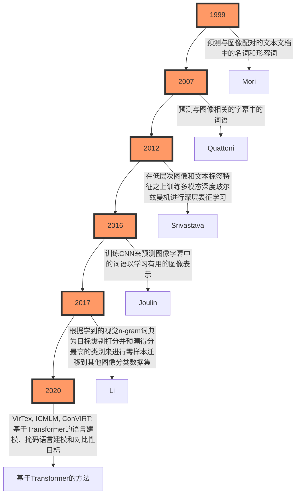

<div align=center>
    </br><center></center>
</div>

> - 论文地址：[Learning Transferable Visual Models From Natural Language Supervision](https://arxiv.org/abs/2103.00020)
> 	- https://arxiv.org/abs/2103.00020
> - 源码地址：[CLIP](https://github.com/OpenAI/CLIP)
> 	- https://github.com/OpenAI/CLIP

# 摘要（Abstract）

最先进的计算机视觉系统是被训练来预测一组固定的预定对象类别的（a fixed set of predetermined object categories）。这种受限形式的监督（restricted form of supervision）限制了它们的通用性（generality）和实用性（usability），因为需要额外的标注数据来指定任何其他视觉概念。直接从关于图像的原始文本中学习是一种很有前景的替代方案，它利用了更为广泛的监督来源。

我们展示了简单的预训练任务——即预测哪条字幕（caption）与哪个图像（images）匹配 —— 是一种有效且可扩展（scalable）的方法，可以在一个包含4亿对（图像-文本）的数据集上从零开始学习到最先进（SOTA）的图像表示。预训练之后，自然语言可以用来引用已学习的视觉概念（或描述新的概念），这使得模型能够不经过特定数据集训练就进行零样本迁移（zero-shot transfer）至下游任务（downstream tasks）。我们通过在超过30个不同的现有计算机视觉数据集上进行基准测试来研究这种方法的表现，这些数据集涵盖了诸如OCR（光学字符识别）、视频中的动作识别（actions recognition in videos）、地理定位（geo-localization）以及多种类型的细粒度物体分类（many types of fine-grained object classification）等任务。

该模型对于大多数任务都能非平凡地转移（transfers non-trivially），并且经常能在不需要任何特定数据集训练的情况下与完全监督的Baseline相竞争。例如，在ImageNet上的零样本测试中，我们在没有使用其128万训练样本的情况下达到了原始ResNet-50模型的准确率。

> 🤔 𝑸𝒖𝒆𝒔𝒕𝒊𝒐𝒏：“<u>该模型对于大多数任务都能非平凡地转移</u>”这句话应该怎么理解？
>
> 🥳 𝑨𝒏𝒔𝒘𝒆𝒓：这句话的意思是，这个模型能够将它从一个任务或数据集上学到的知识有效地应用（或迁移）到其他不同的任务上，而且这种迁移不仅仅是简单的或者基本的，而是具有一定的复杂度和有效性。这里的“非平凡”强调了迁移学习的效果并不是微不足道的；也就是说，<font color='purple'><b>模型在新任务上的表现不是仅仅依靠运气或者非常基础的能力，而是真正利用了它在预训练阶段学到的特征和知识</b></font>。
>
> 简单来说，这意味着即使面对没有见过的新任务，模型也能够基于之前的学习经验做出合理且有用的预测或决策，这表明模型具备了一定程度的泛化能力。在机器学习中，这种能力是非常宝贵的，因为它减少了为每个特定任务收集大量标记数据的需求，并且可以加速新应用场景下的模型开发过程。

> 我们常见的计算机视觉任务都是给定数据，之后对数据进行标注，然后模型根据GroundTruth计算损失值从而让模型能够在预测时接近GroundTruth，那么这样的范式限制了模型的通用性和实用性，主要的原因就是因为我们人为的给数据添加了标注。以目标检测任务为例子，它需要标注一些Bounding Box（矩形框），比如我们想要让这个模型即可以检测人，那么我在标注的时候需要对人进行画框，并且给框一个类别。最常见的方法就是只设定一个类别`person`，那么只要画面中有“人”出现，我们就需要对这个“人”进行画框。之后模型再根据我们的标注进行训练，训练完成之后模型就可以将输入图片中的“人”给框出来。这看起来是没有什么问题的，但大家想一下，我们直接将“人”用一个框给框出来这个操作是不是过于粗暴了，我们浪费掉了画面中的很多信息，比如说一个人在大街上，那么大街上的“车”、“动物”、“...”其他事物，甚至于说人身上的衣服这些信息我们好像都浪费掉了，这就限制了模型的通用性，因为我们只让模型关注人，其他别的目标都是负样本。与此同时，如果我们想让这个除了关注`person`这个类别外，还需要关注`dog`这个类别，那么我们需要重新标注一遍我们的数据集，这影响了模型的实用性。
>
> 那么解决方案是什么呢？想当然的我们就想让模型直接学习图片，不给它指定类别，但这样有点过于理想了，所以OpenAI提出了一个方案，那就是图片-文本对（pair）的形式，也就是说，我们需要用文字对一张图片进行描述，之后让模型根据文本中的内容去学习图片中的内容。这样可以提高图片的信息利用率。
>
> 很明显，文本-图像对的形式虽然看起来很美好，但模型学习来应该很困难，所以OpenAI使用了4亿对这样的数据，模型在训练完成之后模型是具有很强的语义理解能力，之后再将这个模型应用到其他下游任务。这个就相当于是你通关之后再去新手村打怪，怪真的不经打🤣—— 不是下游任务变简单了，而是模型实在太强了（《慎勇》的既视感😂）。

# 1. 引言与动机（Introduction and Motivating Work）

在过去几年中，直接从原始文本学习的预训练方法彻底改变了自然语言处理（NLP）领域。像自回归（autoregressive）和掩码语言建模（masked language modeling）这样的<font color='red'><b>与任务无关的目标函数（Task-agnostic objectives）</b></font>已经在计算能力、模型容量和数据规模上跨越了多个数量级，并且持续地提高了性能。<u>"文本到文本（text-to-text）"作为标准化输入输出接口的发展使得与任务无关的架构能够零样本（zero-shot）迁移到下游数据集，而无需专门的输出头或针对特定数据集的定制化</u>。像GPT-3这样的旗舰系统现在在许多任务上与定制模型具有竞争力，同时几乎不需要任何特定数据集的训练数据。

> 🤔 𝑸𝒖𝒆𝒔𝒕𝒊𝒐𝒏：“"文本到文本（text-to-text）"作为标准化输入输出接口的发展使得与任务无关的架构能够零样本（zero-shot）迁移到下游数据集，而无需专门的输出头或针对特定数据集的定制化”这句话应该怎么理解？
>
> 🥳 𝑨𝒏𝒔𝒘𝒆𝒓：
>
> - **无需专门的输出头**：因为这里的前提是`Text2Text`任务，所以输入是Text，输出也是Text，即便将模型迁移到下游任务中，下游任务也应该是`Text2Text`的，所以不需要修改最后的输出头。
> - **针对特定数据集的定制化**：“零样本迁移”意味着模型能够利用它在预训练阶段学到的知识去处理之前未曾见过的新任务或新数据，无需额外的针对该任务的数据来进行微调。这极大地提高了模型的应用灵活性和效率，减少了为每个新应用场景准备大量标注数据的需求（简单来说，模型之前的训练集太丰富了，这从而让模型具有非常强大的泛化能力，所以常规的下游任务也是可以搞定的）。
>
> 💡 **PS**：其实针对特定的细分领域，即便模型再好也是需要微调的😂

这些结果表明，现代预训练方法可以从网络规模的文本集合中获取的总监督超过了高质量众包标注（crowd-labeled）的NLP数据集所能提供的。然而，在计算机视觉等其他领域，仍然通常的做法是在如ImageNet这样的众包标注数据集上预训练模型。直接从网页文本学习的可扩展预训练方法是否也能在计算机视觉领域带来类似的突破？先前的工作是令人鼓舞的。

> 🤔 𝑸𝒖𝒆𝒔𝒕𝒊𝒐𝒏：众包标注（crowd-labeled）是什么？
>
> 🥳 𝑨𝒏𝒔𝒘𝒆𝒓：众包标注是一种将数据标注任务分配给大量非专业人员（通常是通过互联网招募的志愿者或有偿工作者）的方法。这些参与者被称为“众包工人”或“标注者”，他们可能来自不同的背景，并且通常不需要具备特定领域的专业知识。

超过20年前，Mori等人（1999）探讨了通过训练模型来预测与图像配对的文本文档中的名词和形容词以改进基于内容的图像检索。Quattoni等人（2007）展示了可以通过在分类器权重空间内进行流形学习来学习更高效的数据表示，这些分类器被训练来预测与图像相关的字幕中的词语。Srivastava & Salakhutdinov（2012）探索了通过在低层次图像和文本标签特征之上训练多模态深度玻尔兹曼机来进行深层表征学习。Joulin等人（2016）现代化了这一系列工作，并证明了训练CNN来预测图像字幕中的词语可以学习到有用的图像表示。他们将YFCC100M数据集（2016）中图像的标题、描述和标签元数据（Metainfo）转换成一个词袋多标签分类任务（a bag-of words multi-label classification task），并显示预先训练AlexNet（2012）来预测这些标签所学得的表示在迁移任务上的表现与基于ImageNet的预训练相似。Li等人（2017）随后将这种方法扩展到了除了单独词语之外还预测短语n-gram，并展示了他们的系统能够通过根据其学到的视觉n-gram词典为目标类别打分并预测得分最高的类别来进行零样本迁移到其他图像分类数据集。采用更新的架构和预训练方法，VirTex（2020）、ICMLM（2020）以及ConVIRT（2020）最近展示了基于Transformer的语言建模、掩码语言建模和对比性目标在从文本学习图像表示方面的潜力。



> 🤔 𝑸𝒖𝒆𝒔𝒕𝒊𝒐𝒏：简单介绍一下YFCC100M数据集。
>
> 🥳 𝑨𝒏𝒔𝒘𝒆𝒓：YFCC100M（Yahoo Flickr Creative Commons 100 Million Dataset）是一个大规模的多媒体数据集，包含大约1亿个媒体对象，其中包括9920万张图片和80万个视频（从Flickr平台上收集的）。
>
> - **特点**：
>
> 	- **规模**：数据集非常庞大，包含近1亿个媒体对象，这使得它成为研究中的一个重要资源。
>
> 	- **多样性**：数据集中的内容覆盖了广泛的主题和场景，从自然风光到城市景观，再到日常生活中的各种活动。
>
> 	- **元数据**：每个媒体对象都附带丰富的元数据，包括Flickr标识符、所有者姓名、使用的相机信息、标题、标签、地理位置等。
>
> 	- **时间跨度**：数据集包含了从2004年Flickr成立之初到2014年初期间的照片和视频（时间跨度接近10年），提供了这一时期内人们如何拍摄、描述和分享照片与视频的全面快照。
>
> 	- **开放性**：由于采用了Creative Commons许可，该数据集对于学术研究和非商业用途是完全开放的，研究人员可以在不违反版权的情况下使用这些数据进行实验。
>
>
> - 挑战：
>
> 	- **质量不一**：虽然数据集很大，但其中许多图片的描述信息不够好，例如只是文件名或相机设置，而**不是真正的描述性文字**。
>
> 	- **稀疏性和多样性**：部分图片的元数据可能缺失或质量不高，需要进行额外的数据清洗和处理。
>

> 🤔 𝑸𝒖𝒆𝒔𝒕𝒊𝒐𝒏：多模态深度玻尔兹曼机是什么？
>
> 🥳 𝑨𝒏𝒔𝒘𝒆𝒓：多模态深度玻尔兹曼机（Multimodal Deep Boltzmann Machine, MDBM）是一种深度学习模型，它能够处理和融合来自不同模态的数据，例如图像和文本。这种模型扩展了传统的深度玻尔兹曼机（Deep Boltzmann Machine, DBM），使其能够同时学习多种类型数据的联合表示。
>

尽管作为**概念验证**非常令人兴奋，使用自然语言监督来学习图像表示仍然是罕见的。这可能是因为在常见基准测试上展示的性能远低于其他方法。例如，Li等人（2017）在零样本设置下仅达到ImageNet 11.5%的准确率。这远远低于当前最先进水平的88.4%（Xie 等, 2020），甚至低于经典计算机视觉方法的50%准确率（Deng 等, 2012）。相反，更狭窄但针对性强的弱监督使用已经改善了性能。Mahajan等人（2018）表明，预测Instagram图片上的ImageNet相关标签是一种有效的预训练任务。当微调到ImageNet时，这些预训练模型的准确率提高了超过5%，并在当时提升了整体最先进的水平。Kolesnikov等人（2019）和Dosovitskiy等人（2020）也通过预训练模型来预测噪声标记的JFT-300M数据集中的类别，在一系列更广泛的迁移基准上展示了显著的提升。

这项工作代表了从有限量的监督“黄金标签”学习与从实际上无限量的原始文本学习之间的务实折衷。然而，它并非没有妥协。两项工作都精心设计并限制了它们的监督范围，分别到1000类和18291类。自然语言由于其通用性，能够表达并通过监督更多的视觉概念。这两种方法也都使用静态softmax分类器进行预测，缺乏动态输出机制。这极大地限制了它们的灵活性，并削弱了它们的“零样本”能力。

> 🤔 𝑸𝒖𝒆𝒔𝒕𝒊𝒐𝒏：“这两种方法也都使用静态softmax分类器进行预测，缺乏动态输出机制。这极大地限制了它们的灵活性，并削弱了它们的“零样本”能力”这句话应该怎么理解？
>
> 🥳 𝑨𝒏𝒔𝒘𝒆𝒓：这句话指出，提到的两种方法（指那些利用自然语言监督来学习图像表示的方法）在进行预测时都使用了静态softmax分类器。这意味着它们在输出层有一个固定的类别集合，每个类别的数量是预先定义好的。例如，在一个有1000个类别的数据集上训练的模型，其softmax层将有1000个输出节点，每个节点对应一个特定的类别。
>
> **缺乏动态输出机制** 意味着这些模型不能灵活地处理未见过的类别或者动态调整输出空间。具体来说：
>
> - **灵活性限制**：如果模型需要对新类别进行预测，而这个新类别不在原始训练时的类别集合中，那么模型将无法直接识别或分类这个新的类别。它只能从已知的固定类别中选择最接近的一个。
>   
> - **削弱零样本能力**：零样本学习是指模型能够对训练过程中未曾出现过的类别做出正确的预测。<font color='red'><b>使用静态softmax分类器的模型通常不具备这种能力，因为它们依赖于训练阶段已经定义好的类别标签</b></font>。**当遇到新的、未知的类别时，模型没有一种机制来生成相应的输出或对其进行合理的预测**。
>
> 相比之下，更先进的方法可能会采用一些技术来增强模型的零样本学习能力，比如通过文本描述来生成新的类别表示，或者利用更复杂的输出层设计，如条件生成模型等，使得模型能够在面对新类别时具备更强的泛化能力和适应性。这样可以提高模型的灵活性，使其更好地应对实际应用中的多样性。

这些弱监督模型与最近探索直接从自然语言学习图像表示的方法之间的一个关键区别在于==规模==。虽然Mahajan等人（2018）和Kolesnikov等人（2019）在数百万至数十亿张图像上训练了他们的模型多年加速时间，但VirTex、ICMLM和ConVIRT仅在一万到两万张图像上训练了几日加速时间。在这项工作中，我们缩小了这个差距，并研究了大规模自然语言监督下训练的图像分类器的行为。得益于互联网上大量公开可用的数据，我们创建了一个包含4亿对（图像、文本）的新数据集，并展示了简化版的ConVIRT从零开始训练——我们称之为CLIP，即对比语言-图像预训练（Contrastive Language-Image Pre-training）——是一种从自然语言监督中学习的有效方法。我们通过训练一系列覆盖近两个数量级计算力的八个模型来研究CLIP的可扩展性，并观察到迁移性能是计算力的一个平滑可预测的函数。我们发现，类似于GPT家族，CLIP在预训练过程中学会了执行包括OCR、地理定位、动作识别在内的多种任务。我们通过对超过30个现有数据集的零样本迁移性能进行基准测试来衡量这一点，并发现它可以与之前的特定任务监督模型相竞争。我们也通过线性探测表征学习分析确认了这些发现，并显示CLIP优于最佳公开的ImageNet模型，同时也更加计算效率高。此外，我们发现零样本CLIP模型比同等准确度的监督ImageNet模型更具鲁棒性，这表明任务无关模型的零样本评估更能代表模型的能力。

# 2. 方法（Approach）

## 2.1 自然语言监督（Natural Language Supervision）

我们方法的核心思想是从自然语言中所包含的监督信息学习感知。正如引言中所讨论的，这并不是一个全新的想法，然而用来描述这一领域工作的术语却是多样的，甚至看似矛盾，且提出的动机也是多种多样的。Zhang等人（2020）、Gomez等人（2017）、Joulin等人（2016）以及Desai和Johnson（2020）都介绍了从与图像配对的文本中学习视觉表示的方法，但分别将他们的方法描述为无监督、自监督、弱监督和监督。

我们强调，在这些工作中共同之处并不在于具体使用的方法细节，而是在于<font color='purple'><b>将自然语言视为一种训练信号的认可</b></font>。所有这些方法实际上都是从自然语言监督中学习。尽管早期工作在使用主题模型（topic model）和n-gram表示时面临着自然语言复杂性的挑战，但深度上下文表示学习的进步表明我们现在拥有了有效利用这种丰富监督来源的工具。

> 🤔 𝑸𝒖𝒆𝒔𝒕𝒊𝒐𝒏：“尽管早期工作在使用主题模型（topic model）和n-gram表示时面临着自然语言复杂性的挑战”中的topic model应该怎么理解？
>
> 🥳 𝑨𝒏𝒔𝒘𝒆𝒓：主题模型（Topic Model）是一种统计模型，用于从文档集合中发现抽象的主题（topic）。每个主题由一组词的概率分布来表示，而每个文档则可以看作是由多个主题的混合构成。主题模型的一个常见应用是自动地从大量文本数据中提取出隐藏的主题结构。这有助于理解文档集中的主要话题，并且可以用于诸如文档分类、信息检索和推荐系统等任务。
>

从自然语言中学习相比于其他训练方法有几个潜在的优势。相比传统的众包标注用于图像分类（如ImageNet这样的众包数据集），自然语言监督更容易扩展，因为它不需要注释采用经典的“机器学习兼容格式”，例如标准的1-of-N多数投票“黄金标签”。相反，处理自然语言的方法可以从互联网上大量的文本中被动地学习其中所包含的监督信息。此外，从自然语言中学习还有一个重要的优势，那就是它不仅学习到一种表示，还把这种表示与语言联系起来，从而实现灵活的零样本迁移。在接下来的小节中，我们将详细介绍我们最终确定的具体方法。

> 🤔 𝑸𝒖𝒆𝒔𝒕𝒊𝒐𝒏：标准的1-of-N多数投票“黄金标签”是什么？
>
> 🥳 𝑨𝒏𝒔𝒘𝒆𝒓：标准的1-of-N多数投票“黄金标签”是指在机器学习和数据标注中常用的一种标签确定方法。这种方法通常用于众包标注或多人标注的情境下，以确保<u>最终的标签是准确且一致的</u>。以下是这个概念的具体解释：
>
> - **1-of-N**：这意味着对于一个给定的数据点（例如一张图片），有N个可能的类别或标签选项中的一个被选为正确的标签。这种设置常见于分类任务，其中每个样本只能属于一个类别。
>
> - **多数投票**：当多个标注者对同一个数据点进行标注时，最终选择的是获得最多票数的那个标签。例如，如果有5个标注者分别为一张图片打上标签，而其中3个人选择了“狗”，2个人选择了“猫”，那么通过多数投票原则，“狗”将作为该图片的最终标签。
>
> - **“黄金标签”**：这是指经过某种方式确认后的正确答案或权威标签。在上述例子中，通过多数投票得到的标签（如“狗”）就被认为是“黄金标签”。它代表了基于现有标注者的共识所确定的最佳答案。
>
> 使用这种1-of-N多数投票机制来产生“黄金标签”的主要目的是提高标注的质量和一致性，尤其是在涉及主观判断的任务中。这种方法有助于减少个体偏差，并且可以作为一种简单有效的策略来处理不同标注者之间可能存在差异的情况。然而，它也有局限性，比如当标注者意见高度分散时，或者在某些复杂情况下简单的多数投票可能无法反映真正的最佳答案。因此，在实际应用中，可能会结合其他质量控制措施来进一步保证标注结果的准确性。

## 2.2. 创建一个足够大的数据集（Creating a Sufficiently Large Dataset）

现有工作主要使用了三个数据集：MS-COCO（2014）、Visual Genome（2017）和YFCC100M（2016）。虽然MS-COCO和Visual Genome是高质量的众包标注数据集，但按照现代标准来看，它们规模较小，每个数据集大约只有10万张训练照片。相比之下，其他计算机视觉系统是在多达35亿张Instagram照片上进行训练的（2018）。YFCC100M包含1亿张照片，是一个可能的替代方案，但每张图片的元数据稀疏且质量不一。许多图片使用自动生成的文件名，如“20160716 113957.JPG”作为“标题”，或者包含关于相机曝光设置的“描述”。在过滤后只保留具有自然语言标题和/或英文描述的图片后，数据集缩小了6倍，只剩下1500万张照片。这个数量与ImageNet大致相同。

> 🤔 𝑸𝒖𝒆𝒔𝒕𝒊𝒐𝒏：Visual Genome数据集是什么？
>
> 🥳 𝑨𝒏𝒔𝒘𝒆𝒓：Visual Genome是一个大规模的多模态数据集，旨在为视觉理解和推理提供丰富的标注信息。它包含了详细的图像注释，包括对象、属性、关系和问答对等，使研究人员能够进行更复杂的视觉任务，如场景理解、图像描述生成和视觉问答。
>
> - **特点**：
>
> 	- **规模**：包含超过108,000张（接近11万张）图片。
>
> 	- **对象**：每张图片中都标注了多个对象，并提供了边界框。
> 	- **属性**：每个对象都附带了描述其特性的属性（例如颜色、形状）。
> 	- **关系**：标注了对象之间的关系，如“在...上面”、“拿着”等。
> 	- **场景图**：通过连接对象及其关系构建了复杂的场景图，有助于理解整个图像的内容。
> 	- **区域描述**：为图像中的特定区域提供了自然语言描述。
> 	- **问答对**：包含大量的视觉问答对，用于训练和评估视觉问答系统。
>
> - **挑战**：
>
> 	- **标注质量**：由于标注量巨大，可能会存在一些噪声或不一致的情况。
>
> 	- **计算复杂性**：处理如此丰富的标注信息需要强大的计算资源和复杂的模型。
>
>
> Visual Genome数据集特别适合那些需要深入理解图像内容和上下文的任务。

利用自然语言监督的一个主要动机是互联网上公开可用的大量此类形式的数据。由于现有的数据集未能充分反映这种可能性，仅考虑这些数据集上的结果会低估这一研究方向的潜力。为了解决这个问题，我们构建了一个新的数据集，该数据集包含从互联网上各种公开来源收集的4亿对 图像-文本对。为了尽可能覆盖广泛的视觉概念，我们在构建过程中搜索包含一组50万个Query（queries）中的任意一个词的 图像-文本对。我们通过每个Query最多包含20,000个“图像-文本对”来近似地平衡结果。最终的数据集总词数与用于训练GPT-2的WebText数据集相似。我们将这个数据集称为WIT（WebImageText）。

> 好猛的OpenAI😂

## 2.3. 选择高效的预训练方法（Selecting an Efficient Pre-Training Method）

最先进的计算机视觉系统使用了大量的计算资源。Mahajan等人（2018）需要19个GPU年的计算量来训练他们的ResNeXt101-32x48d模型，而Xie等人（2020）则需要33个TPUv3核心年的计算量来训练他们的Noisy Student EfficientNet-L2模型。考虑到这两个系统都只是为了预测1000个ImageNet类别，从自然语言中学习开放集的视觉概念似乎是一项艰巨的任务。在我们的努力过程中，我们发现训练效率是成功扩展自然语言监督的关键，并基于这一指标选择了最终的预训练方法。

我们的初始方法类似于VirTex，从头开始联合训练图像CNN和文本Transformer以预测图像的标题。然而，我们在高效扩展这种方法时遇到了困难。如图2所示，一个6300万参数的Transformer语言模型，其计算量已经是其ResNet-50图像编码器的两倍，但在学习识别ImageNet类别时的速度比一个更简单的Baseline（该Baseline预测同一文本的词袋编码）慢三倍。

<div align=center>
    </br><center>图2. CLIP在零样本迁移学习方面比我们的图像描述Baseline要高效得多。尽管表现力很强，我们发现基于Transformer的语言模型在零样本ImageNet分类上相对较弱。在这里，我们可以看到它比一个预测文本词袋（BoW）编码的Baseline模型学习速度慢3倍。将预测目标替换为CLIP的对比目标后，效率进一步提高了4倍</center>
</div>

> 🤔 𝑸𝒖𝒆𝒔𝒕𝒊𝒐𝒏：这里的“处理的图片数量”指的是什么？
> 
> 🥳 𝑨𝒏𝒔𝒘𝒆𝒓：其实并不是说推理多少图，而是说在模型使用了多少数量的数据进行训练时达到的准确率。以33M即3300万数据为定点我们可以看到，baseline模型（BoW预测模型）的准确率大约在7%左右，但基于Transformer的语言模型更低，可能只有2%的准确率，但CLIP模型可以达到16%的准确率，这说明CLIP模型更加强大。


> 🤔 𝑸𝒖𝒆𝒔𝒕𝒊𝒐𝒏：VirTex是什么？
>
> 🥳 𝑨𝒏𝒔𝒘𝒆𝒓：VirTex是一种预训练方法，它利用图像和文本的配对数据来学习视觉表示。具体来说，VirTex 通过使用语义密集的字幕（captions）来训练卷积神经网络（CNN），然后将这些学到的视觉特征迁移到下游任务中，如图像分类、目标检测和实例分割。
>
> - **主要特点**：
> 	1. **多模态学习**：VirTex 利用图像-文本对进行<font color='red'><b>联合训练</b></font>，其中文本提供了丰富的语义信息。
> 	2. **无监督预训练**：VirTex 不需要标注的类别标签，而是利用自然语言字幕（captions）作为监督信号，<u>这使得它可以利用大量未标注的数据</u>。
> 	3. **迁移学习**：预训练后的模型可以迁移到各种下游任务中，提高这些任务的性能。
> 	4. **端到端训练**：从头开始训练卷积网络，并与文本编码器（通常是Transformer）联合训练，以预测图像的字幕。
>
> - **工作原理**：
> 	- **图像编码器**：通常是一个卷积神经网络（如ResNet），用于提取图像的视觉特征。
> 	- **文本编码器**：通常是一个Transformer（如BERT），用于处理和编码文本字幕。
> 	- **联合训练**：图像编码器和文本编码器被联合训练，**以使模型能够根据图像生成相应的字幕或根据字幕找到对应的图像**。
> 	- **损失函数**：使用诸如交叉熵损失等损失函数来优化模型，使其能够正确地匹配图像和文本。
>
> - **应用场景**：
> 	- **图像分类**：利用预训练的视觉特征提高图像分类的准确性。
> 	- **目标检测**：在目标检测任务中利用预训练的特征提升性能。
> 	- **实例分割**：在实例分割任务中利用预训练的特征改善分割效果。
> 	- **零样本学习**：由于模型学习了从文本到图像的映射，可以在没有见过的新类别上进行零样本学习。
>
> - **优势**：
> 	- **数据效率**：利用大量的图像-文本对进行预训练，提高了数据的利用率。
> 	- **泛化能力**：通过学习丰富的语义信息，模型在多种视觉任务上表现出更好的泛化能力。
> 	- **灵活性**：预训练模型可以灵活地迁移到不同的下游任务，减少了特定任务所需的标注数据量。
>
> VirTex 的主要贡献在于<font color='green'>展示了如何通过大规模的图像-文本数据来进行有效的视觉表示学习，并且这些表示可以成功地迁移到多种计算机视觉任务中，从而提高它们的性能。这种方法为利用自然语言监督进行视觉学习提供了一种新的思路</font>。

> 🤔 𝑸𝒖𝒆𝒔𝒕𝒊𝒐𝒏：BERT是什么？
> 
> 🥳 𝑨𝒏𝒔𝒘𝒆𝒓：BERT（Bidirectional Encoder Representations from Transformers）是一种预训练的深度学习模型，由Google在2018年提出。它主要应用于自然语言处理（NLP）任务中，能够理解文本的上下文，并生成高质量的文本表示。
>
> - **主要特点**：BERT的关键创新在于其双向训练机制，这允许模型同时考虑一个词之前和之后的上下文信息。传统的语言模型通常只能从左到右或从右到左地单向读取文本，而BERT通过一种称为Masked Language Model（MLM）的方法来实现这一点。在预训练过程中，输入序列中的某些词会被随机遮盖，模型的任务是基于未被遮盖的词预测这些被遮盖词的原始词汇。此外，BERT还使用了Next Sentence Prediction（NSP）任务来帮助模型理解句子之间的关系。
>
> - **动机**：BERT的主要动机是为了解决自然语言处理（NLP）中的一个核心问题：如何让机器更好地理解自然语言。在BERT之前，大多数的模型都是单向的，即它们要么只从左到右地考虑上下文（如传统的RNN或LSTM），要么只从右到左。这限制了模型对词语复杂上下文的理解能力。<font color='blue'><b>BERT通过引入双向训练机制，使得模型能够同时考虑一个词前后的内容，从而极大地提高了对文本语义的理解能力</b></font>。
>
> - **结构**：BERT架构基于Transformer编码器部分。Transformer是一种神经网络结构，特别适合处理序列数据，如文本。<u>与循环神经网络（RNNs）不同，Transformers不需要按顺序处理数据，因此可以并行化，大大加快了训练速度</u>。
>
> - **输入输出形式**：
>   - **输入**：BERT接受的是文本序列作为输入。这些文本序列首先被转换成一系列的tokens，每个token对应词汇表中的一个条目。为了帮助模型区分不同句子和特殊位置，输入序列中会加入特殊的标记，比如`[CLS]`（用于分类任务）、`[SEP]`（用于分隔不同的句子）等。
>   - **输出**：对于不同的下游任务，BERT可以产生不同的输出形式。例如，在句子分类任务中，`[CLS]` token对应的隐藏状态通常会被用来代表整个句子，并输入到一个全连接层以得到分类结果；而在问答任务中，模型则可能输出每个token属于答案起点或终点的概率。
>
> - **贡献**：由于BERT在多种NLP基准测试上取得了显著的成绩，它很快成为了许多后续研究的基础，并且在实际应用中被广泛采用，例如搜索、问答系统、情感分析等。随着BERT的成功，也催生了一系列基于它的改进版本，如RoBERTa, ALBERT, DistilBERT等，它们各自针对不同的方面进行了优化，比如训练效率、模型大小或者性能表现。

这两种方法有一个关键的相似之处：它们都试图预测每张图像附带文本的确切单词（exact words）。由于伴随图像出现的描述、评论和相关文本种类繁多，这是一项困难的任务（<font color='blue'><b>仔细想想也是，每一张图片都会有很多不同的东西，用一个单词去形容一张图像太难了</b></font>）。最近的研究发现，对比表示学习（contrastive representation learning）中的对比目标（contrastive objectives）可以比等效的预测目标（equivalent predictive objective）学习到更好的表示（2019）。其他研究也发现，虽然生成模型可以学习高质量的图像表示，但它们所需的计算量比具有相同性能的对比模型高出一个数量级以上（2020）。注意到这些发现，我们探索了训练一个系统来解决一个潜在更容易的代理任务（proxy task），即只预测<font color='red'><b>哪段文本</b></font>整体上与<font color='red'><b>哪个图像</b></font>匹配，而不是预测文本的确切单词。从相同的词袋编码baseline开始，我们将预测目标替换为对比目标（如图2所示），并观察到零样本转移到ImageNet的效率提高了4倍。

> 🤔 𝑸𝒖𝒆𝒔𝒕𝒊𝒐𝒏：“最近的研究发现，对比表示学习中的对比目标可以比等效的预测目标学习到更好的表示。”这句话应该怎么理解？
> 
> 🥳 𝑨𝒏𝒔𝒘𝒆𝒓：这句话的意思是，在对比表示学习（contrastive representation learning）中使用对比目标（contrastive objectives）的方法，相比直接预测特定内容（如文本中的确切单词）的方法，能够使模型学到更有效的数据表示。具体来说：
> 
> - **对比表示学习**是一种机器学习方法，它通过比较不同的样本对来学习数据的表示。在图像和文本匹配的任务中，这通常意味着让模型学会区分哪些图像是与给定文本相关的，而哪些不是。
> - **对比目标**是指在训练过程中，模型被要求区分正样本对（e.g. 一个图像和描述它的正确文本）和负样本对（e.g. 一个图像和不描述它的错误文本）。这种目标鼓励模型捕捉到使得正样本对相似而负样本对相异的特征。
> - **等效的预测目标**指的是像预测文本中的确切单词这样的任务，这是一种更为直接的目标，但可能难以捕捉到数据间的复杂关系。

> 🤔 𝑸𝒖𝒆𝒔𝒕𝒊𝒐𝒏：怎么理解“我们探索了训练一个系统来解决一个潜在更容易的代理任务（proxy task），即只预测哪段文本整体上与哪个图像匹配，而不是预测文本的确切单词”中的“代理任务”？
> 
> 🥳 𝑨𝒏𝒔𝒘𝒆𝒓：在机器学习中，代理任务（proxy task）是指一种辅助性的、较为简单的任务，**它被用来帮助模型学习到有助于解决更复杂主要任务的特征或技能**。通过首先解决一个相对容易的任务，模型可以学到一些有用的表示，这些表示之后可以应用于更加复杂的实际问题上。这种方法通常用于当直接训练模型来解决最终目标任务非常困难或者数据不足时。
> 
> 在这段话中的“代理任务”具体指的是：
> - **原始任务**：预测每张图像附带文本的确切单词。这是一个相当具有挑战性的任务，因为一张图片可能包含很多不同的物体和场景，而且描述这些内容的文字可以多种多样。
> - **代理任务**：只预测哪段文本整体上与哪个图像匹配。这意味着模型不需要精确地生成或预测文本中的每一个词，而是需要判断给定的一段文本是否适合描述某张特定的图像。
> 
> 采用这种代理任务的好处在于：
> 1. **简化了学习过程**：相比于生成或预测确切的单词，识别文本和图像之间的对应关系是一个更为简单的问题，因此更容易训练。
> 2. **提高了效率**：对比目标允许模型专注于学习图像和文本之间的重要关联，而不是陷入到具体的词汇细节中，从而提高了学习效率。
> 3. **更好的泛化能力**：通过学习图像和文本之间的高层次语义联系，模型能够更好地理解图像的内容，并且在面对新数据时有更好的泛化能力。
> 
> 总之，这里的“代理任务”是为了让模型通过一个较简单的任务来学习到有用的视觉-语言关联信息，这些信息随后可以帮助模型在更复杂的任务上表现得更好，比如零样本迁移学习到ImageNet分类任务。
> 
> 研究发现，使用对比目标可以让模型专注于学习那些对于区分不同样本至关重要的特征，从而得到更好的数据表示。这些表示往往更能捕捉到数据的本质属性，并且在迁移学习或零样本学习场景下表现更好，因为它们更加鲁棒且泛化能力更强。相比之下，直接预测具体的单词虽然也能提供一定的信息，但在处理多变性和多样性方面不如对比学习有效。

给定一批$N$个(image, text)对（图像-文本对），CLIP被训练来预测这批数据中实际发生的 $N \times N$ 个可能的“图像-文本对”中的哪一个。为此，CLIP通过联合训练图像编码器（Image Encoder）和文本编码器（Text Encoder）来学习一个多模态嵌入空间（multi-modal embedding space），最大化批次中 $N$ 个真实配对的图像和文本（real pairs）嵌入的余弦相似度，同时最小化 $N^2 − N$ 个错误配对（incorrect pairings）的嵌入的余弦相似度。我们对这些相似度分数进行对称交叉熵损失（symmetric cross entropy loss）优化。在图3中，我们包含了CLIP实现的核心伪代码。据我们所知，这种批处理构建技术和目标首先在深度度量学习领域由Sohn（2016）引入为多类N-pair损失（*multi-class N-pair loss*），后来由Oord等人（2018）推广为对比表示学习中的InfoNCE损失，并最近由Zhang等人（2020）适应于医学成像领域的对比（文本，图像）表示学习。

```python
# ------------------------------------------------------------------------------------
#     Figure 3. Numpy like pseudocode for the core of an implementation of CLIP      
#                     图3. CLIP实现核心部分的类似Numpy伪代码                       
# ------------------------------------------------------------------------------------
"""
image_encoder（图像编码器）: ResNet or Vision Transformer   -->  ResNet或视觉Transformer
text_encoder （文本编码器）: CBOW or Text Transformer       -->  CBOW或文本Transformer
I[n, h, w, c]: minibatch of aligned images                  -->  对齐图像的mini-batch
T[n, l]      : minibatch of aligned texts                   -->  对齐文本的mini-batch
W_i[d_i, d_e]: learned projection of image to embedding     -->  学习到的从图像到嵌入的投影矩阵
W_t[d_t, d_e]: learned projection of text to embedding      -->  学习到的从文本到嵌入的投影矩阵
t            : learned temperature parameter                -->  学习到的温度参数
"""

# extract feature representations of each modality  --> 提取每种模态的特征表示（图像和文本特征的提取）
I_f    = image_encoder(I)  # [n, d_i]
I_f    = text_encoder(T)   # [n, d_t]

# joint multimodal embedding [n, d_e]               --> 联合多模态嵌入（将图像和文本进行嵌入/混合）
I_e    = l2_normalize(np.dot(I_f, W_i), axis=1)
I_e    = l2_normalize(np.dot(I_f, W_t), axis=1)

# scaled pairwise cosine similarities [n, n]        --> 缩放的成对余弦相似度（计算图像和文本之间的余弦相似度）
logits = np.dot(I_e, T_e.T) * np.exp(t)  # 通过温度参数 t 进行缩放

# symmetric loss function                           --> 对称损失函数（计算对比损失 --> 在处理 正负样本对 时是对称的）
labels = np.arange(n)
loss_i = cross_entropy_loss(logits, labels, axis=0)
loss_t = cross_entropy_loss(logits, labels, axis=1)
loss   = (loss_i + loss_t) / 2
```

由于我们的预训练数据集规模庞大，过拟合不是一个主要问题（<font color='blue'><b>数据集规模完全可以满足模型拟合要求，这样就不会出现过拟合现象了</b></font>），因此CLIP的训练细节相比Zhang等人（2020）的实现有所简化。我们从头开始训练CLIP，不使用ImageNet权重初始化图像编码器，也不使用预训练权重初始化文本编码器。我们没有使用表示与对比嵌入空间之间（between the representation and the contrastive embedding space）的非线性投影，这是Bachman等人（2019）引入并在Chen等人（2020b）中流行起来的变化。相反，我们仅使用线性投影将每个编码器的表示映射到多模态嵌入空间。我们没有注意到两种版本之间的训练效率差异，并推测非线性投影可能与当前自监督表示学习方法中的图像细节共同适应。我们还移除了Zhang等人（2020）中的文本转换函数$t_u$，该函数从文本中均匀采样单个句子，因为CLIP预训练数据集中的许多“图像-文本对”只包含一个句子。我们也简化了图像转换函数$t_v$。在训练过程中，唯一使用的数据增强是从调整大小的图像中随机裁剪正方形区域。最后，控制softmax中`logits`范围的温度参数$\tau$，在训练过程中作为对数参数化的乘法标量直接优化，以避免将其作为一个超参数进行调整。

> 🤔 𝑸𝒖𝒆𝒔𝒕𝒊𝒐𝒏：非线性投影（non-linear projection）和线性投影（linear projection）是什么？二者有什么区别？
> 
> 🥳 𝑨𝒏𝒔𝒘𝒆𝒓：二者都是在机器学习和深度学习中用来将数据从一个空间映射到另一个空间的技术。这两种方法的主要区别在于它们如何处理输入数据。
> 
> - **线性投影**：
>   - **定义**：线性投影是通过线性变换来实现的，这种变换可以表示为矩阵乘法。例如，如果有一个输入向量 $x$ 和一个投影矩阵 $W$，那么线性投影的结果就是 $y = Wx$。
>   - **特点**：
>     - **简单性**：线性投影相对简单，计算效率高。
>     - **线性关系**：保持了输入数据之间的线性关系。这意味着如果输入数据中的某些模式是线性的，线性投影能够很好地保留这些模式。
>     - **可解释性**：由于其简单性，线性投影通常更容易解释。
> 
> - **非线性投影**：
>   - **定义**：非线性投影则是通过引入非线性函数（如激活函数）来实现的。例如，在神经网络中，非线性投影可以通过多层感知器（MLP）来实现，其中每一层都包含一个线性变换（矩阵乘法）和一个**非线性激活函数**（如ReLU、Sigmoid等）。
>   - **特点**：
>     - **复杂性**：非线性投影可以捕捉更复杂的特征和数据之间的关系，因为它允许模型学习输入数据之间的非线性依赖。
>     - **表达能力**：更强的表达能力使得非线性投影能够更好地拟合复杂的数据分布。
>     - **灵活性**：非线性投影提供了更大的灵活性，可以在嵌入空间中创建更丰富的结构。
> 
> - **二者之间的区别**：
>   - **处理能力**：线性投影只能处理线性关系，而非线性投影可以处理更加复杂的关系。
>   - **模型复杂度**：线性投影通常模型较为简单，参数较少；而非线性投影则可能需要更多的参数和计算资源。
>   - **适用场景**：对于简单的任务或数据集，线性投影可能已经足够有效；而对于复杂的任务或数据集，非线性投影通常能提供更好的性能。
> 
> 在CLIP的上下文中，使用线性投影意味着直接将编码器的输出通过一个线性变换映射到嵌入空间，而不经过任何非线性激活函数。这样做简化了模型结构，减少了计算开销，并且在实践中发现这样做的效果与使用非线性投影相当。这表明在当前的任务设置下，额外的非线性复杂度可能并不必要。

> 🤔 𝑸𝒖𝒆𝒔𝒕𝒊𝒐𝒏：文本转换函数$t_u$和图像转换函数$t_v$是什么？
> 
> 🥳 𝑨𝒏𝒔𝒘𝒆𝒓：$t_u$ 和图像转换函数 $t_v$ 是数据增强或预处理步骤，它们分别用于文本和图像数据。这些函数通常在训练模型之前对输入数据进行某种形式的变换，以提高模型的泛化能力和鲁棒性。

## 2.4 模型的选择与扩展（Choosing and Scaling a Model）

我们考虑了两种不同的图像编码器架构。对于第一种，我们使用ResNet-50（2016）作为图像编码器的基础架构，因为它被广泛采用并且性能已经得到验证。我们在原始版本的基础上进行了几项修改，采用了He等人（2019）的ResNet-D改进和Zhang（2019）的抗锯齿矩形模糊池化（antialiased rect-2 blur pooling）。我们还将全局平均池化层替换为注意力池化机制。注意力池化实现为一层“transformer风格”的多头QKV注意力，其中Query基于图像的全局平均池化（GAP）表示进行条件化。对于第二种架构，我们尝试了最近提出的Vision Transformer（ViT）（2020）。我们基本遵循他们的实现，仅做了微小的修改：在Transformer之前，对组合的patch和位置嵌入（position embeddings）添加了一个额外的层归一化，并使用了略有不同的初始化方案。

> 🤔 𝑸𝒖𝒆𝒔𝒕𝒊𝒐𝒏：“其中Query基于图像的全局平均池化（GAP）表示进行条件化”应该怎么理解？
> 
> 🥳 𝑨𝒏𝒔𝒘𝒆𝒓：在这句话指的是在注意力池化机制中，Query（查询）向量是根据图像的全局平均池化（Global Average Pooling, GAP）表示来生成或调整的。具体来说，这意味着：
> 
> 1. **全局平均池化（GAP）**：首先，对图像特征图进行全局平均池化操作，得到一个固定长度的向量。这个向量代表了整个图像的全局特征。
> 2. **条件化Query**：然后，这个全局平均池化的向量被用来生成或调整注意力机制中的Query向量。（在注意力机制中，Query、Key和Value是三个重要的组成部分，它们用于计算不同位置之间的相似度，并据此生成加权后的特征表示）
> 3. **基于GAP的Query**：这里的“基于GAP表示进行条件化”意味着Query向量不是随机初始化的，也不是独立于输入图像的，而是通过某种方式与图像的全局特征相关联。例如，可以将GAP向量作为初始的Query向量，或者将GAP向量与某个可学习的权重矩阵相乘来生成Query向量。
> 4. **注意力池化**：最终，这些基于GAP表示的Query向量被用于多头QKV注意力机制中，以计算图像特征图上不同位置的重要性权重，并生成最终的池化结果。
> 
> 这种做法的好处在于，它使得注意力池化不仅能够关注局部特征，还能够结合全局信息，从而更好地捕捉图像的整体结构和语义信息。这样生成的特征表示通常更加丰富和具有代表性，有助于提高模型的性能。

文本编码器是一个Transformer（2017），并采用了Radford等人（2019）描述的架构修改。作为基础大小（base size），我们使用了一个具有63M参数、12层、宽度为512的模型，配备8个注意力头。Transformer处理的是文本的小写（lower-cased）字节对编码（Byte Pair Encoding，BPE）表示，词汇量大小为$49,152$（2015）。为了计算效率，最大序列长度限制为76。文本序列以`[SOS]`和`[EOS]`标记包围，且Transformer最高层在`[EOS]`标记处的激活（activations）被视为文本的特征表示，该表示经过层归一化（Layer Normalization）后线性投影到多模态嵌入空间。尽管未来的工作将探索这一点，但文本编码器中使用了掩码自注意力（Masked Self-Attention）来保持用预训练语言模型初始化或添加语言建模作为辅助目标的能力。

> 😊 Tips：
> - SOS：Start Of Sequence：序列开始
> - EOS：End Of Sequence：序列结束

> 🤔 𝑸𝒖𝒆𝒔𝒕𝒊𝒐𝒏：这里的“基础大小（base size）”应该怎么理解？
> 
> 🥳 𝑨𝒏𝒔𝒘𝒆𝒓：在机器学习和深度学习中，特别是在NLP领域，“基础大小（base size）”通常指的是模型的基本配置或默认配置。这个配置定义了模型的规模，包括参数数量、层数、隐藏层的宽度等。这些参数的选择会影响到模型的复杂度、计算资源需求以及训练和推理的时间。

> 🤔 𝑸𝒖𝒆𝒔𝒕𝒊𝒐𝒏：字节对编码（Byte Pair Encoding，PBE）是什么？
> 
> 🥳 𝑨𝒏𝒔𝒘𝒆𝒓：BPE是一种数据压缩技术，后来被广泛应用于NLP中的词汇表示。BPE最初是为了解决数据压缩问题而设计的，但在NLP中，它被用来解决词汇表过大和未登录词（out-of-vocabulary, OOV）的问题。
> 
> - **工作原理**：
>   1. **初始化**：从一个初始词汇表开始，这个词汇表通常包含所有单个字符（包括空格）。
>   2. **统计频率**：统计训练文本中所有连续的字符对（或字节对）的频率。
>   3. **合并最频繁的字节对**：将出现频率最高的字节对合并成一个新的符号，并将其加入到词汇表中。
>   4. **重复步骤2和3**：继续统计新的字符对频率，并合并最频繁的字节对，直到达到预定的词汇表大小或满足其他停止条件。
> 
> - **优点**：
>   - **处理未登录词**：通过将常见的字符组合成新的符号，BPE可以有效地处理训练数据中未出现的词汇。例如，如果“new”和“york”是两个单独的词，但经常一起出现，BPE可能会将它们合并成一个新的符号“new_york”。
>   - **减小词汇表大小**：通过合并常见的字符序列，BPE可以显著减小词汇表的大小，从而减少模型的参数数量和内存占用。
>   - **灵活性**：BPE可以根据需要生成不同大小的词汇表，从而在性能和效率之间进行权衡。
> 
> - **在NLP中的应用**：在NLP任务中，BPE通常用于将文本转换成一系列的子词单元（subword units），这些子词单元可以是完整的词、部分词或字符。这样做的好处是：
>   - **更好地处理形态学**：BPE能够捕捉到词根和词缀等形态学信息，这对于许多语言来说非常重要。
>   - **提高泛化能力**：通过使用子词单元，模型可以在遇到未见过的词时，仍然能够利用已知的子词单元来进行合理的预测。
> 
> - **示例**：假设我们有一个简单的句子 "I love New York"，并且我们已经通过BPE构建了一个词汇表。词汇表可能包含以下符号：
>   - I
>   - love
>   - New
>   - York
>   - New_York
> 
> 在这个例子中，“New_York”是一个由BPE合并而成的新符号。当我们处理句子时，可以将句子分解为以下子词单元：
> 
>   - I
>   - love
>   - New_York
> 
> 这样，即使在训练数据中没有直接出现“New York”这个词组，模型仍然可以通过“New_York”这个符号来理解它。
> 
> - **总结**：字节对编码（BPE）是一种将文本分解成子词单元的技术，它通过合并常见的字符序列来生成一个高效的词汇表。BPE在NLP中被广泛应用，因为它能够处理未登录词，减小词汇表大小，并提高模型的泛化能力。

> 🤔 𝑸𝒖𝒆𝒔𝒕𝒊𝒐𝒏：我直接把26个英文字母作为词汇表，不就任何英文词汇我都可以表示了吗？
> 
> 🥳 𝑨𝒏𝒔𝒘𝒆𝒓：使用26个英文字母作为词汇表确实可以表示任何英文词汇，但这在实际的自然语言处理（NLP）任务中通常不是最优的选择。以下是几个原因：
> 1. **缺乏语义信息**
>       - **字符级模型**：如果仅使用26个字母作为词汇表，模型将以字符级别进行处理。这意味着每个单词都需要被分解成一系列的字符，而这些字符本身并不携带太多的语义信息。例如，单词 "cat" 和 "act" 在字符级别上是相同的字符集合，但它们的语义完全不同。
>       - **上下文理解**：字符级别的模型需要从头开始学习每个字符组合的语义，这会增加训练难度和所需的计算资源。
> 2. **长距离依赖问题**
>       - **序列长度**：以字符为单位处理文本会导致输入序列变得非常长。例如，一个句子可能包含几十个单词，每个单词又由多个字符组成，这使得整个序列长度大大增加。
>       - **长距离依赖**：在处理长序列时，模型需要捕捉更长距离的依赖关系，这对模型的设计和训练提出了更高的要求。例如，LSTM或Transformer等模型虽然能够处理长序列，但效率和效果可能会受到影响。
> 
> 3. **未登录词问题**
>       - **新词处理**：虽然使用字符级模型可以处理未登录词（OOV），但这种方式对新词的处理能力有限。例如，对于拼写错误或罕见词，字符级模型可能无法很好地捕捉其语义。
>       - **子词单元的优势**：BPE等子词编码方法通过合并常见的字符组合来生成子词单元，这些子词单元可以更好地捕捉词根、词缀等形态学信息，从而提高模型对新词的处理能力。
> 
> 4. **计算效率**
>       - **参数数量**：使用字符级模型时，模型需要更多的参数来学习字符之间的复杂关系。这不仅增加了模型的复杂度，还可能导致过拟合。
>       - **训练时间**：由于输入序列变长，训练时间也会相应增加，尤其是在大规模数据集上。
> 
> 5. **实际应用中的表现**
>       - **性能差异**：在许多NLP任务中，如机器翻译、文本分类、命名实体识别等，使用子词单元（如BPE）的模型通常比纯字符级模型表现更好。这是因为子词单元能够在一定程度上保留词汇的语义信息，同时减少序列长度。
> 
> **总结**：虽然26个英文字母可以表示任何英文词汇，但在实际的NLP任务中，使用这样的字符级模型存在诸多局限性。相比之下，BPE等子词编码方法通过生成高效的子词单元，能够在保持灵活性的同时，提供更好的语义信息和计算效率。因此，在大多数情况下，使用BPE或其他子词编码方法是更优的选择。

> 🤔 𝑸𝒖𝒆𝒔𝒕𝒊𝒐𝒏：BPE为什么叫字节对编码，和字节有什么关系呢？什么又是字节对呢？
> 
> 🥳 𝑨𝒏𝒔𝒘𝒆𝒓：字节对编码（Byte Pair Encoding, BPE）的名字可能会让人误解，因为<font color='red'><b>它的实际操作通常是基于字符而不是字节</b></font>。BPE最初确实是为了数据压缩而设计的，用于处理字节序列，但在自然语言处理（NLP）中，它被用来处理文本字符（包括字母、标点符号等），因此在NLP上下文中，“字节”实际上是指“字符”。
> 
> - **字节对（Byte Pair）**：
>   - **定义**：在BPE中，"字节对"实际上是指连续的字符对。例如，在单词 "hello" 中，"he"、"el"、"ll" 和 "lo" 都是字节对。
>   - **操作对象**：在NLP中，BPE操作的对象是字符，而不是真正的字节。因此，更准确地说，应该称之为“字符对”或“字符序列对”。 
> 
> - **BPE在NLP中的工作流程**：
>   1. **初始化词汇表**：初始词汇表包含所有单个字符（包括空格）。
>   2. **统计字符对频率**：统计训练文本中所有连续字符对的出现频率。
>   3. **合并最频繁的字符对**：选择出现频率最高的字符对，并将其合并成一个新的符号，加入到词汇表中。
>   4. **重复步骤2和3**：继续统计新的字符对频率，并合并最频繁的字符对，直到达到预定的词汇表大小或满足其他停止条件。
> 
> - **总结**：
>   - **字节对编码（BPE）** 在NLP中实际上是基于字符的操作，而不是字节。
>   - **字节对** 实际上是指连续的字符对。

> 🤔 𝑸𝒖𝒆𝒔𝒕𝒊𝒐𝒏：在NLP和LLM领域，Token是什么呢？一个单词和Token之间是什么关系？一个句子和Token之间又有什么关系呢？Token和Embedding有什么关系呢？Token和Embedding Vector又有什么关系呢？
> 
> 🥳 𝑨𝒏𝒔𝒘𝒆𝒓：在自然语言处理（NLP）和大语言模型（LLM）领域，**Token**、**Embedding** 和 **Embedding Vector** 是几个核心概念。
> 
> - **Token**：
>   - **定义**：在NLP中，Token是文本的基本处理单元。它可以是一个单词、一个子词（通过BPE、WordPiece等方法生成）、一个字符或一个标点符号。
>   - **用途**：Token用于将文本数据转换成模型可以处理的形式。每个Token通常会被映射到一个整数ID，这些ID可以作为模型的输入。
> 
> - **单词与Token的关系**：
>   - **单个单词作为Token**：在简单的NLP任务中，每个单词可以直接作为一个Token。例如，在句子 "I love New York" 中，`["I", "love", "New", "York"]` 都是Token。
>   - **子词作为Token**：为了更好地处理未登录词（OOV）和提高模型效率，现代NLP模型通常使用子词Token。这些子词Token通过诸如BPE、WordPiece或SentencePiece等方法生成。例如，罕见词 "Newyorker" 可能被分解为 `["New", "##york", "##er"]`。
> 
> - **句子与Token的关系**：
>   - **分词（Tokenization）**：一个句子会被分割成一系列的Token。这个过程称为分词。例如，句子 "Hello, world! How are you?" 经过分词后可能变成 `["Hello", ",", "world", "!", "How", "are", "you", "?"]`。
>   - **特殊Token**：在许多NLP任务中，还会引入一些特殊的Token，如 `[SOS]`（序列开始）和 `[EOS]`（序列结束），用来标记序列的开始和结束。例如，句子 "Hello, world!" 可能会被表示为 `["[SOS]", "Hello", ",", "world", "!", "[EOS]"]`。
> 
> - **Embedding**：
>   - **定义**：**Embedding** 是一种将高维稀疏的数据（如Token）映射到低维稠密向量的技术。这种向量能够捕捉到Token之间的语义和上下文信息。
>   - **用途**：Embedding 向量作为模型的输入，使得模型能够学习到Token之间的复杂关系。常见的Embedding技术包括Word2Vec、GloVe和BERT等。
> 
> - **Token 与 Embedding 的关系**：
>   - **映射关系**：每个Token通过一个嵌入层（Embedding Layer）被映射到一个固定维度的向量，即Embedding Vector。这个映射通常是通过一个可训练的矩阵完成的。
>   - **初始化**：Embedding矩阵中的每一行对应一个Token的Embedding Vector。矩阵的大小是词汇表大小（Vocabulary Size）乘以Embedding维度（Embedding Dimension）。
> 
> - **Token 与 Embedding Vector 的关系**：
>   - **一对一映射**：每个Token都有一个对应的Embedding Vector。例如，如果词汇表中有10000个Token，每个Token的Embedding维度是512，那么Embedding矩阵的大小就是10000 x 512。
>   - **语义表示**：Embedding Vector不仅表示了Token本身的信息，还包含了其在上下文中的语义信息。例如，单词 "bank" 在不同的上下文中可能会有不同的Embedding Vector，取决于它是指金融机构还是河岸。
> 
> - **总结**：
>   - **Token** 是NLP和LLM中用于表示文本的基本单元，可以是单词、子词、字符或标点符号。
>   - **单词与Token**：一个单词可以是一个Token，也可以被分解成多个子词Token。
>   - **句子与Token**：一个句子会被分割成一系列的Token，这些Token会被输入到模型中进行进一步处理。
>   - **Token与Embedding**：每个Token通过一个嵌入层被映射到一个固定的Embedding Vector，这个向量捕捉了Token的语义和上下文信息。
>   - **Token与Embedding Vector**：每个Token有一个对应的Embedding Vector，这个向量用于表示Token的语义，并作为模型的输入。
> 
> ```mermaid
> graph LR
>     文本输入 --> 分词
>     分词 -->|根据分词方法| Token
> 
>     subgraph 子图一[分词]
>         单词级别 --> Token1
>         子词级别 --> Token2
>     end
> 
>     subgraph 子图二[嵌入层Embedding Layer]
>         Token -->|嵌入Embedding| EmbeddingVector
>     end
> 
>     subgraph 子图三[模型处理]
>         EmbeddingVector -->|模型计算| 输出
>     end
> ```


虽然以前的计算机视觉研究通常通过单独增加宽度（2018）或深度（2016a）来扩展模型，但对于ResNet图像编码器，我们采用了Tan & Le（2019）的方法，他们发现将额外的计算资源分配给宽度、深度和分辨率的所有维度优于只分配给模型的一个维度。虽然Tan & Le（2019）调整了分配给EfficientNet架构每个维度的计算比例，但我们使用了一个简单的Baseline，即将额外的计算资源均匀地分配给增加模型的宽度、深度和分辨率。对于文本编码器，我们仅按比例扩展模型的宽度，使其与ResNet计算出的宽度增加成正比，而不扩展深度，因为我们发现CLIP的性能对文本编码器的容量不太敏感（<font color='blue'><b>即便增加Text Encoder的深度，CLIP的性能没有明显增加😂</b></font>）。

> 这里给我们视觉的小伙伴一个提醒：想增加一个模型的指标，我们可以从模型的深度、宽度和输入的分辨率进行入手，并且我们要把资源同时分配给这三个方面，而不是单纯地增加深度、宽度、分辨率。

## 2.5. 训练（Training）

我们训练了一系列模型，包括5个 $\text{ResNets}$ 和3个 $\text{Vision Transformers}$。对于 $\text{ResNets}$ ，我们训练了一个 $\text{ResNet-50}$、一个 $\text{ResNet-101}$，以及另外三个遵循 $\text{EfficientNet}$ 风格模型缩放的网络，它们分别使用大约4X、16X和64X于 $\text{ResNet-50}$ 的计算资源。这些模型分别表示为 $\text{RN50 × 4}$、 $\text{RN50×16}$ 和 $\text{RN50×64}$。对于 $\text{Vision Transformers}$，我们训练了一个 $\text{ViT-B/32}$ 、一个 $\text{ViT-B/16}$ 和一个 $\text{ViT-L/14}$。所有模型都训练了32个Epochs。我们使用Adam优化器，并应用解耦权重衰减正则化（2017）到所有不是增益或偏置的权重上，并使用余弦学习率衰减学习率调度器（2016）。初始超参数通过在Baseline $\text{ResNet-50}$ 模型上进行1个Epoch的训练时结合网格搜索、随机搜索和手动调整来设置。由于计算资源的限制，对于更大的模型，超参数是基于启发式方法进行调整的。可学习的温度参数 $\tau$ 被初始化为等效于 $0.07$（2018），并进行了裁剪以防止`logits`的缩放超过100，这在防止训练不稳定性方面是必要的。我们使用了一个非常大的Batch，大小为$32,768$。混合精度（2017）用于加速训练并节省内存。为了进一步节省内存，我们使用了梯度检查点（2016）、半精度Adam统计（2020）和半精度随机舍入的文本编码器权重。嵌入相似性的计算也被分片处理，每个GPU只计算其本地Batch嵌入所需的成对相似性子集。最大的 $\text{ResNet}$ 模型 $\text{RN50x64}$ 在592个V100 GPU上训练了18天，而最大的 $\text{Vision Transformers}$ 在256个V100 GPU上训练了12天。对于 $\text{ViT-L/14}$，我们还额外在一个更高的$336$像素分辨率下预训练了一个Epoch以提升性能，类似于FixRes（2019）。我们将这个模型标记为 $\text{ViT-L/14@336px}$ 。除非另有说明，本文中报告的所有“CLIP”结果都使用了这个表现最佳的模型。

# 3. 实验（Experiments）

## 3.1. 零样本迁移（Zero-Shot Transfer）

### 3.1.1. 动机（Motivation）

在计算机视觉中，零样本学习（zero-shot learning）通常指的是在图像分类中对未见对象类别的泛化研究（2009）。我们则更广泛地使用这个术语，研究对未见数据集的泛化。我们将此作为执行未见任务的代理，正如Larochelle等人（2008）在零数据学习论文中所期望的那样。尽管无监督学习领域的许多研究都集中在机器学习系统的表征学习能力上，我们却将零样本迁移（zero-shot transfer）作为衡量机器学习系统任务学习能力的一种方式。在这种观点下，数据集评估了特定分布上任务的性能。然而，许多流行的计算机视觉数据集主要是由研究社区创建的，作为指导通用图像分类方法发展的基准，而不是衡量特定任务的性能。虽然可以说SVHN数据集衡量了在Google街景照片分布上的街道数字转录任务，但不清楚CIFAR-10数据集衡量的“真实”任务是什么。然而，CIFAR-10来自哪种分布是明确的——TinyImages（2008）。在这类数据集上，零样本迁移更多是评估CLIP对分布偏移和领域泛化的鲁棒性，而不是任务泛化。请参见第3.3节，有关此方面的分析。

> 🤔 𝑸𝒖𝒆𝒔𝒕𝒊𝒐𝒏：什么是零样本迁移？它和零样本学习有什么区别和联系？
> 
> 🥳 𝑨𝒏𝒔𝒘𝒆𝒓：零样本迁移 (Zero-Shot Transfer)和零样本学习 (Zero-Shot Learning, ZSL)之间既有区别，也有紧密联系。
> - **零样本学习（Zero-Shot Learning, ZSL）**：零样本学习最早应用于图像分类领域，指的是模型在训练时只见过部分类别（即训练集中的类别），但在测试时需要对从未见过的类别进行分类。这意味着模型需要通过训练时学到的知识来泛化到未见过的类别。为了做到这一点，零样本学习通常利用类别之间的语义信息（如属性、词向量等）来帮助模型推断未见过的类别。
>   - **例子**：假设你训练了一个动物分类模型，训练集中有“猫”、“狗”、“马”这些类别，但没有“狮子”这个类别。在零样本学习中，模型通过学习“猫”、“狗”、“马”的特征以及它们与“狮子”在语义上的关系，能够在测试集遇到“狮子”时，成功将其分类为“狮子”。
> 
> - **零样本迁移（Zero-Shot Transfer）**：零样本迁移的概念更为广泛，指的是模型在未见过的任务或数据集上进行泛化的能力。与零样本学习主要关注未见过的类别不同，<font color='blue'><b>零样本迁移不仅关注类别，还可能涉及领域、任务或数据分布的变化</b></font>。零样本迁移的目标是评估模型在面对全新任务或数据分布时的适应和泛化能力，而不仅仅是对新类别的泛化。
> 
> - **两者的关系**：
>   1. **目标不同**：
>       - **零样本学习**专注于在训练时未见的类别上进行预测。
>       - **零样本迁移**则更关注模型跨数据集、任务或领域的泛化能力，评估的是模型在面对新的任务或数据分布时的表现。
>   2. **场景不同**：
>       - 零样本学习通常用于类别泛化（如图像分类中的新类别分类）。
>       - 零样本迁移则可以应用于更广泛的场景，包括不同任务的泛化、跨数据集的泛化、跨领域的泛化等。
>   3. **联系**：**零样本迁移**可以被视为**零样本学习**的扩展。在零样本学习中，模型只需要对未见类别进行泛化，而在零样本迁移中，模型需要应对更大范围的变化，如数据分布、任务需求等。因此，零样本迁移包含零样本学习的理念，但应用范围更广。

据我们所知，Visual N-Grams（2017）首次以上述方式研究了对现有图像分类数据集的零样本迁移。它也是我们所知唯一使用通用预训练模型研究标准图像分类数据集的零样本迁移的工作，为CLIP提供了最好的参考点。他们的方法学习了一个包含$142,806$个视觉n-gram（跨度为1到5-grams）的字典的参数，并使用Jelinek-Mercer平滑的差异版本来优化这些n-gram，以最大化给定图像的所有文本n-gram的概率。

> 🤔 𝑸𝒖𝒆𝒔𝒕𝒊𝒐𝒏：n-gram是什么，其主要的作用是啥？
> 
> 🥳 𝑨𝒏𝒔𝒘𝒆𝒓：n-gram是一种统计语言模型，用于预测文本中连续出现的项目（如字母、音节或单词）的概率。它基于这样的假设：一个项目的出现概率与前面 $n-1$ 个项目有关。n-gram模型通过统计和学习文本中连续 $n$ 个项目的出现频率来预测下一个项目。n-gram模型的主要作用包括：
> 1. **文本预测**：在文本生成、自动完成和拼写检查等领域，n-gram模型可以用来预测下一个最可能的单词或字符。
> 2. **语言模型评估**：在自然语言处理中，n-gram模型可以用来评估句子或文档的流畅度和自然度。
> 3. **信息检索**：在搜索引擎和推荐系统中，n-gram模型可以帮助匹配查询和文档，提高检索的准确性。
> 4. **语音识别**：在语音识别技术中，n-gram模型可以用来提高语音到文本转换的准确性。
> 5. **机器翻译**：在机器翻译中，n-gram模型可以帮助预测和生成更自然的目标语言文本。
> 
> n-gram模型的 $n$ 表示连续项目的数目，例如：
> - 当 $n=1$ 时，称为unigram模型，只考虑单个项目（如单词）。
> - 当 $n=2$ 时，称为bigram模型，考虑两个连续项目（如两个连续的单词）。
> - 当 $n=3$ 时，称为trigram模型，考虑三个连续项目。
> 
> n-gram模型的优点是简单、易于实现，但它也有缺点，比如当 $n$ 值较大时，模型需要处理大量的数据，并且对于未见过的n-gram组合，模型无法做出有效预测，这被称为“零概率”问题。此外，n-gram模型通常不考虑项目之间的语义关系，因此可能无法捕捉到文本的深层含义。尽管如此，n-gram模型在许多应用中仍然是一个有用的工具。

为了执行零样本迁移，他们首先将数据集中每个类别名称的文本转换为其n-gram表示，然后根据他们的模型计算其概率，预测得分最高的那个。我们关注将零样本迁移作为任务学习评估的研究，是受到自然语言处理领域中展示任务学习的工作的启发。据我们所知，Liu等人（2018）首次将任务学习识别为一种“意外的副作用”，当一个训练有素的语言模型生成维基百科文章时，学会了在不同语言之间可靠地音译名字。虽然GPT-1（2018）专注于预训练作为一种迁移学习方法以改善监督微调，但它也包括了一个消融研究，展示了四种启发式零样本迁移方法的性能在预训练过程中稳步提高，无需任何监督适应。这一分析为GPT-2（2019）提供了基础，后者专门研究了通过零样本迁移的语言模型的任务学习能力。

> 🤔 𝑸𝒖𝒆𝒔𝒕𝒊𝒐𝒏：启发式零样本迁移和零样本迁移有什么区别？
> 
> 🥳 𝑨𝒏𝒔𝒘𝒆𝒓：启发式零样本迁移（Heuristic Zero-Shot Transfer）和零样本迁移（Zero-Shot Transfer）这两个术语在某些情况下可能会被交替使用，但它们在具体实现和侧重点上可能有所不同。
> 
> - **启发式零样本迁移**：启发式零样本迁移侧重于使用一些预先定义的规则或启发式方法来实现零样本迁移。这些启发式方法可能是基于经验的，用于在没有直接监督的情况下，指导模型如何从已知类别迁移到未知类别。例如，如果已知类别和未知类别在某些属性上相似，启发式方法可能会建议模型利用这些相似性来预测未知类别的标签。启发式方法可能包括：
>   
>   - 利用类别之间的属性或描述信息来建立联系。
>   - 利用类别之间的语义相似性。
>   - 利用类别层次结构或类别关系。
> 
> - **区别**：
>   - **方法论**：启发式零样本迁移更侧重于使用简单的规则或启发式方法，而零样本迁移可能涉及更复杂的算法和技术。
>   - **复杂性**：启发式方法通常更简单、更直接，而零样本迁移可能需要更复杂的模型和训练过程。
>   - **泛化能力**：零样本迁移通常要求模型具有更强的泛化能力，因为它需要在没有目标类别样本的情况下进行迁移。
> - **联系**：
>   - 启发式零样本迁移可以被视为零样本迁移的一个子集，它提供了一种实现零样本迁移的简单方法。
>   - 两者都旨在解决在没有目标类别样本的情况下，如何利用已有的知识或数据来提高模型在新任务上的性能。
> 
> 总的来说，启发式零样本迁移是一种更具体、更依赖于经验规则的零样本迁移方法，而零样本迁移是一个更广泛的概念，包括了各种实现迁移的技术。

### 3.1.2. 使用CLIP进行零样本迁移（Using CLIP for Zero-Shot Transfer）

CLIP是预训练用来预测图像和文本片段<font color='red'><b>是否</b></font>在其数据集中配对的。为了执行零样本分类，我们重用（reues）了这种能力。对于每个数据集，我们使用数据集中所有类别的名称作为潜在文本配对的集合，并根据CLIP预测最可能的 图像-文本对。更详细地说，我们首先通过它们各自的编码器计算图像的特征嵌入和可能文本集的特征嵌入。然后计算这些嵌入的余弦相似度，通过一个温度参数$\tau$进行缩放，并通过softmax将其归一化为概率分布。请注意，这个预测层是一个多项式逻辑回归分类器，具有L2归一化的输入、L2归一化的权重、无偏置和温度缩放。如果这样解释，图像编码器就是计算图像特征表示的计算机视觉主干，而文本编码器是一个超网络hypernetwork（2016），它根据指定类别所代表的视觉概念的文本生成线性分类器的权重。Lei Ba等人（2015）首次引入了这种形式的零样本图像分类器，而从自然语言生成分类器的想法至少可以追溯到Elhoseiny等人（2013）。继续这种解释，CLIP预训练的每一步都可以被视为优化一个随机创建的代理的性能，该代理（Proxy）是一个包含每个类别1个样本且通过自然语言描述定义了$32,768$个总类别的计算机视觉数据集。对于零样本评估，一旦文本编码器计算出零样本分类器，我们就将其缓存，并在所有后续预测中重用（reuse）它。这允许生成它的成本在数据集中的所有预测中分摊。

> 🤔 𝑸𝒖𝒆𝒔𝒕𝒊𝒐𝒏：超网络（hypernetwork）是什么？
> 
> 🥳 𝑨𝒏𝒔𝒘𝒆𝒓：超网络是一种神经网络架构，其主要功能是生成另一个神经网络（称为目标网络）的权重。超网络本身是一个神经网络，它接受一些输入（通常是任务描述或条件信息），并输出目标网络的权重。这种设计允许目标网络在不同的任务或条件下动态地调整其参数，而无需从头开始训练。
> 
> - **CLIP中的应用**：在CLIP中，文本编码器可以被视为一种超网络。具体来说：
>   - **文本编码器**：文本编码器接受文本描述（如类别名称）作为输入，并生成相应的特征嵌入。这些特征嵌入可以被解释为线性分类器的权重。
>   - **零样本分类**：在零样本分类任务中，文本编码器生成的特征嵌入被用作分类器的权重。这些权重与图像编码器生成的图像特征嵌入进行比较，通过余弦相似度和softmax函数计算出最终的分类概率。
>   
> - **详细解释**：
>   1. **预训练过程**：CLIP在预训练过程中学习了如何将图像和文本片段映射到共同的特征空间。这使得模型能够在未见过的任务上进行零样本迁移。
>   2. **零样本分类**：
>       - 对于每个数据集，文本编码器接收所有类别的名称作为输入，并生成相应的特征嵌入。
>       - 这些特征嵌入可以被视为线性分类器的权重。
>       - 图像编码器生成图像的特征嵌入。
>       - 计算图像特征嵌入和文本特征嵌入之间的余弦相似度，并通过温度参数 $\tau$ 进行缩放。
>       - 使用softmax函数将相似度转换为概率分布，得到最终的分类结果。
>   3. **超网络的作用**：
>       - 文本编码器作为一个超网络，根据类别名称生成分类器的权重。
>       - 这种设计使得CLIP能够在没有任何额外训练的情况下，直接应用于新的分类任务，实现了零样本分类。
> 
> - **总结**：超网络是一种生成其他神经网络权重的神经网络。在CLIP中，文本编码器充当超网络的角色，根据类别名称生成线性分类器的权重，从而实现零样本分类。这种设计不仅提高了模型的灵活性和泛化能力，还使得模型能够在未见过的任务上表现出色。

### 3.1.3. 与视觉N-Gram的初步比较（Initial Comparison to Visual N-grams）

<div align=center>
    </br><center>表1. 将CLIP与之前的零样本迁移图像分类结果进行比较。CLIP在所有三个数据集上的性能都有了大幅提升。这一改进反映了自视觉N-Grams（2017年）开发以来的4年间的许多差异</center>
</div>

在表1中，我们将视觉N-Gram与CLIP进行了比较。最好的CLIP模型在ImageNet上的准确率从概念验证的11.5%提高到76.2%，并且与原始的ResNet-50性能相匹配，尽管没有使用这个数据集可用的128万个众包标注训练样本。此外，CLIP模型的Top-5准确率明显高于它们的Top-1准确率，该模型的Top-5准确率达到95%，与Inception-V4（2016年）相匹配。在零样本设置中与强大的、完全监督的Baseline Model性能相匹配的能力表明，CLIP是朝着灵活和实用的零样本计算机视觉分类器迈出的重要一步。如上所述，与视觉N-Gram的比较旨在为CLIP的性能提供上下文，不应被解释为CLIP和视觉N-Gram之间的直接方法比较，因为两个系统之间许多与性能相关的差异没有得到控制。例如，我们在一个比视觉N-Gram大10倍的数据集上进行训练，使用了一个每次预测需要近100倍计算的视觉模型，可能使用了超过1000倍的训练计算，并且使用了一个基于Transformer的模型，这个模型在视觉N-Gram发布时还不存在。作为更接近的比较，我们在视觉N-Gram训练的同一个YFCC100M数据集上训练了一个CLIP ResNet-50，并发现它在V100 GPU的一天内匹配了他们报告的ImageNet性能。这个Baseline也是从头开始训练的，而不是像视觉N-Gram那样从预训练的ImageNet权重初始化。

> 😊 有一说一，OpenAI这样写真的好，没有踩一捧一！

> 🤔 𝑸𝒖𝒆𝒔𝒕𝒊𝒐𝒏：概念验证（a proof of concept）是什么？和普通的准确率有什么区别？
> 
> 🥳 𝑨𝒏𝒔𝒘𝒆𝒓：在机器学习和计算机视觉领域，概念验证的准确率通常指的是一个初步模型在某个任务上的表现，这个模型可能还没有经过充分的训练或优化。它的目的主要是为了证明这个模型或方法在处理特定问题时是有效的，而不是为了达到该领域的最佳性能。
>
> 在上文中CLIP模型的概念验证准确率为11.5%，这意味着在初步阶段，模型在ImageNet数据集上的表现还不是很理想。然而，经过进一步的训练和优化，同一个模型的准确率提高到了76.2%，这个数字已经可以与完全监督学习的Baseline模型——原始的ResNet-50相匹配，显示了CLIP模型在零样本学习设置中的潜力和有效性。

CLIP在其他两个报告的数据集上也优于视觉N-Gram。在Yahoo上，CLIP实现了错误数量减少了95%，在SUN上，CLIP的准确率是视觉N-Gram的两倍多。为了进行更全面的分析和压力测试，我们在附录A中详细实现了一个更大的评估套件。总的来说，我们从视觉N-Gram报告的3个数据集中扩展到包括30多个数据集，并与50多个现有的计算机视觉系统进行了比较，以提供结果的上下文。

> 严谨，真是太严谨了，这特喵的才是科研！

### 3.1.4. 提示工程和集成（Prompt Engineering and Resembling）

大多数标准图像分类数据集将命名或描述类别的信息视为次要，这些信息使得基于自然语言的零样本迁移成为可能。绝大多数数据集仅用标签的数字ID来标注图像，并包含一个文件将这些ID映射回它们的英文名称。一些数据集，如Flowers102和GTSRB，似乎在它们发布的版本中根本没有包含这种映射，完全阻止了零样本迁移。对于许多数据集，我们观察到这些标签可能是随机选择的，并没有预见到与零样本迁移相关的问题，零样本迁移依赖于任务描述才能成功迁移。

一个常见问题是多义性（polysemy）。当类别的名称是提供给CLIP文本编码器的唯一信息时，由于缺乏上下文，它无法区分所指的词义。在某些情况下，同一个词的多个含义可能作为不同的类别包含在同一个数据集中！这种情况发生在ImageNet中，它既包含建筑起重机（cranes），也包含飞翔的鹤（cranes）。另一个例子是在牛津-IIIT宠物数据集中的类别，其中“boxer”这个词从上下文中看显然是指一种狗的品种，但对缺乏上下文的文本编码器来说，也可能同样指的是一种运动员类型。

我们遇到的另一个问题是，在预训练数据集中，与图像配对的文本通常是单个词的情况相对较少。通常，文本是一个以某种方式描述图像的完整句子。为了帮助弥合这种分布差距，我们发现使用提示模板 `A phone of a {label}.` 是一个不错的默认选择，有助于指定文本是关于图像内容的。这通常比仅使用标签文本的Baseline提高了性能。例如，仅使用这个提示就将ImageNet的准确率提高了1.3%。

类似于GPT-3（2020年）周围的“提示工程（Prompt Engineering）”讨论，我们也观察到通过为每个任务定制提示文本（customizing the prompt text），零样本性能可以显著提高。以下是一些非穷尽（non exhaustive）的例子。我们发现在几个细粒度图像分类数据集上，指定类别很有帮助。例如，在牛津-IIIT宠物上，使用“`A photo of a {label}, a type of pet.`”来提供上下文效果很好。同样，在Food101上指定食物类型，在FGVC Aircraft上指定飞机类型也有帮助。对于OCR数据集，我们发现在要识别的文本或数字周围**加上引号**可以提高性能。最后，我们发现在卫星图像分类数据集上，指定图像是这种形式的很有帮助，我们使用“`a satellite photo of a {label}.`”的变体。

我们还尝试了通过多个零样本分类器的集成（resembling）来提高性能。这些分类器是通过使用不同的上下文提示计算的，如“`A photo of a big {label}`”和“`A photo of a small {label}`”。我们在嵌入空间而不是概率空间上构建集成。这允许我们缓存一组平均文本嵌入，以便在许多预测中分摊时，集成的计算成本与使用单个分类器相同。我们观察到在许多生成的零样本分类器上进行集成可以可靠地提高性能，并在大多数数据集上使用它。在ImageNet上，我们集成了80个不同的上下文提示，这比上面讨论的单个默认提示提高了额外的3.5%的性能。当综合考虑时，提示工程和集成将ImageNet准确率提高了近5%。在图4中，我们可视化了提示工程和集成如何改变一组CLIP模型的性能，与直接嵌入类别名称的无上下文Baseline方法相比，如Li等人（2017）所做。

<div align=center>
    </br><center>图4. 提示工程和集成（Prompt Engeneering and Ensembling）提高了零样本性能。与使用无上下文的类名作为Baseline相比，提示工程和集成在36个数据集上平均提高了零样本分类性能近5个百分点。这种改进类似于使用Baseline零样本方法的4倍计算量所获得的提升，但如果在许多预测中分摊，则是“免费”的</center>
</div>

> 🤔 𝑸𝒖𝒆𝒔𝒕𝒊𝒐𝒏：模型集成（Model Resembleling）是什么？
> 
> 🥳 𝑨𝒏𝒔𝒘𝒆𝒓：模型集成是一种机器学习技术，它结合了多个模型的预测来提高整体性能，通常是为了提高准确性、鲁棒性或减少过拟合。集成学习通过组合多个模型来解决单一模型可能遇到的局限性。模型集成的常见类型包括：
> 
> 1. **Bagging（自举汇聚法）**：通过创建多个训练集的随机副本来训练多个模型，然后对它们的预测进行平均或多数投票。随机森林就是一种使用决策树的Bagging集成方法。
> 2. **Boosting**：通过顺序地训练模型，每个模型都尝试修正前一个模型的错误。AdaBoost和Gradient Boosting是两种流行的Boosting方法。
> 3. **Stacking（堆叠）**：训练多个不同的模型，然后将它们的预测作为输入提供给一个新的“元”模型，该模型学习如何最佳地组合这些预测。

### 3.1.5. 零样本CLIP性能分析（Analysis of Zero-Shot CLIP Performance）

#### 3.1.5.1 与完全监督的分类模型对比

由于计算机视觉中的与任务无关的零样本分类器一直未被充分研究，CLIP为我们提供了一个有希望的机会，以更好地理解这类模型。在本节中，我们对CLIP的零样本分类器的各种属性进行了研究。作为第一个问题，我们简单地看看零样本分类器的性能如何。为了提供上下文，我们将其与一个简单的现成Baseline进行比较：在规范的ResNet-50特征上拟合一个完全监督的、正则化的逻辑回归分类器。在图5中，我们展示了在27个数据集上的这一比较。有关数据集和设置的详细信息，请参见附录A。

<div align=center>
    </br><center>图5. 零样本CLIP与完全监督的Baseline Model（就是ResNet-50）具有竞争力。在27个数据集的评估套件中，零样本CLIP分类器在16个数据集上超越了基于ResNet-50特征拟合的完全监督线性分类器，包括ImageNet</center>
</div>
> 💡**注意**：这里的CLIP是零样本的，意思是上面的这些数据集是没有参与CLIP训练的

<font color='green'><b>【优点】</b></font>零样本CLIP比这个Baseline（ResNet-50）稍微更频繁地表现更好，在27个数据集中的16个上获胜。观察各个数据集揭示了一些有趣的行为。在细粒度分类任务（fine-grained classification tasks）上，我们观察到性能的广泛分布。在这两个数据集上，《StanfordCars（斯坦福汽车）》和《Food101》，零样本CLIP在ResNet-50特征上的逻辑回归上超过$20\%$，而在另外两个数据集上，《Flowers102》和《FGVCAircraft》，零样本CLIP则低$10\%$以上。在《OxfordPets（牛津宠物）》和《Birdsnap》上，性能要接近得多。我们怀疑这些差异主要是由于WIT和ImageNet之间每个任务的监督量不同所致。在“一般”目标分类数据集上，如《ImageNet》、《CIFAR10/100》、《STL10》和《PascalVOC2007》，性能相对相似，在所有情况下零样本CLIP都略占优势。在《STL10》上，CLIP达到了$99.3\%$的总体准确率，尽管没有使用任何训练样本，但似乎是一个新的最佳状态。在两个测量视频动作识别的数据集上，零样本CLIP显著优于ResNet-50。在《Kinetics700》上，CLIP比ResNet-50高出$14.5\%$。零样本CLIP在《UCF101》上也比ResNet-50的特征高出$7.7\%$。我们推测，这是因为自然语言为涉及动词的视觉概念提供了更广泛的监督，与《ImageNet》中以名词为中心的对象监督相比。

<font color='red'><b>【缺点】</b></font>在观察零样本CLIP显著表现不佳的地方时，我们发现零样本CLIP在几个专业、复杂或抽象的任务上相当薄弱，如卫星图像分类（《EuroSAT》和《RESISC45》）、淋巴结肿瘤检测（《PatchCamelyon》）、在合成场景中计数对象（《CLEVRCounts》）、与自动驾驶相关的任务，如德国交通标志识别（《GTSRB》）、识别到最近汽车的距离（《KITTI Distance》）。这些结果突出了<font color='red'><b>零样本CLIP在更复杂任务上的较差能力</b></font>。相比之下，非专家人类可以稳健地执行其中几个任务，如计数、卫星图像分类和交通标志识别，这表明还有很大的改进空间。然而，我们提醒说，目前尚不清楚，将零样本迁移与少样本迁移进行比较，对于学习者没有任何先验经验的困难任务，如对几乎所有人类（可能还有CLIP）的淋巴结肿瘤分类，是否是一个有意义的评估。

#### 3.1.5.2 与少量样本的分类模型对比

虽然将零样本性能与完全监督模型进行比较可以为CLIP的任务学习能力提供上下文，但与少样本方法进行比较是更直接的比较，因为零样本是其极限。在图6中，我们展示了零样本CLIP与许多图像模型的特征上的少样本逻辑回归如何比较，包括最好的公开可用的ImageNet模型、自监督学习方法和CLIP本身。虽然直觉上预期零样本会比one-shot表现差，但我们发现零样本CLIP与同一特征空间上的4-shot逻辑回归的性能相匹配。这可能是由于零样本和少样本方法之间的一个重要区别。首先，CLIP的零样本分类器是通过自然语言生成的，这允许视觉概念被直接指定（“传达”）。相比之下，“正常”的监督学习必须从训练样本中间接推断概念。无上下文的基于示例的学习有一个缺点，即许多不同的假设可以与数据一致，特别是在one-shot的情况下。一张单独的图像通常包含许多不同的视觉概念。尽管一个有能力的学习者能够利用视觉线索和启发式方法，如假设被演示的概念是图像中的主要对象，但没有保证。

<div align=center>
    </br><center>图6. 零样本CLIP超越了少样本线性探测器。零样本CLIP与在同一特征空间上训练的4次shot线性分类器的平均性能相匹配，并且在公开可用模型中几乎与16次shot线性分类器的最佳结果相匹配。对于BiT-M和SimCLRv2，突出显示了表现最好的模型。浅灰色线条是评估套件中的其他模型。在这次分析中使用了每个类别至少有16个样本的20个数据集。</center>
</div>

> 🤔 𝑸𝒖𝒆𝒔𝒕𝒊𝒐𝒏：one-shot和4-shot是什么？
> 
> 🥳 𝑨𝒏𝒔𝒘𝒆𝒓：在机器学习和计算机视觉中，特别是在迁移学习和少样本学习领域，"one-shot"和"4-shot"这两个术语指的是模型在进行预测时，对于某个特定类别，所见过的训练样本数量。
> 
> - **One-shot学习**：在这种设置中，模型对于它正在尝试识别的每个类别只见过一个训练样本。这意味着模型必须仅基于这个单一样本来学习如何识别新的、未见过的样本。One-shot学习是少样本学习的一个极端情况，它挑战了模型的泛化能力，因为几乎没有信息可以用于做出准确的预测。
> - **4-shot学习**：与one-shot学习类似，4-shot学习指的是模型对于每个类别见过四个训练样本。虽然样本数量仍然很少，但与one-shot学习相比，模型有更多的信息来学习类别的特征。这通常会导致比one-shot学习更好的性能，因为模型有更多的数据来形成对类别的理解和泛化。
>
> 在上文中，比较了零样本学习（zero-shot learning）与少样本学习（如one-shot和4-shot学习）的性能。研究发现，尽管零样本CLIP没有看过任何训练样本，但其性能与看过几个样本（如4-shot学习）的逻辑回归分类器相当。这表明，通过自然语言生成的零样本分类器能够直接“传达”视觉概念，而不需要从有限的训练样本中间接推断概念。

解决零样本和少样本性能差异的一个潜在解决方案是将CLIP的零样本分类器用作少样本分类器的权重先验。虽然向生成的权重添加$L2$惩罚是这个想法的直接实现，但我们发现超参数优化通常会选择这样一个大的正则化值，以至于最终的少样本分类器“只是”零样本分类器。研究更好的方法将零样本迁移的优势与少样本学习的灵活性结合起来，是未来工作的一个有希望的方向。

当我们将零样本CLIP与我们评估套件中表现最好的16-shot分类器（使用在《ImageNet-21K》上训练的BiT-M ResNet-152x2的特征）进行比较时，零样本CLIP大致匹配了我们评估套件中表现最好的16-shot分类器的性能。我们确信在《JFT-300M》上训练的BiT-L模型会表现得更好，但这些模型尚未公开发布。BiT-M ResNet-152x2在16-shot设置中表现最好有点令人惊讶，因为正如第3.2节所分析的，Noisy Student EfficientNet-L2在完全监督设置中平均比它高出5%。

#### 3.1.5.3 分类模型达到Zero-shot CLIP水平需要的样本量

除了研究零样本CLIP和少样本逻辑回归的平均性能外，我们还考察了它们在各个数据集上的表现。在图7中，我们展示了一个估计值，即在相同特征空间下，逻辑回归分类器需要每类多少个标注样本，**才能达到零样本CLIP的性能**。由于零样本CLIP本质上也是一个线性分类器，这可以估计出在该设定下零样本迁移的有效数据效率。为了避免训练成千上万个线性分类器，我们基于1-shot、2-shot、4-shot、8-shot、16-shot（如果可能）和在每个数据集上训练的完全监督线性分类器的性能，通过对数线性插值来估计有效的数据效率。我们发现，零样本迁移在不同数据集上的效率差异很大，从每类少于1个标注样本到184个不等。《Flowers102》和《EuroSAT》这两个数据集在one-shot模型下表现不佳。大约一半的数据集每类需要少于5个样本，数据集的中位数是5.4。然而，平均估计的数据效率为每类20.8个样本。这是由于在20%的数据集中，监督分类器需要大量标注样本才能达到相同的性能。在ImageNet上，零样本CLIP的性能相当于在相同特征空间下经过16-shot训练的线性分类器。

<div align=center>
    </br><center>图7. 零样本迁移的数据效率差异很大。计算在同一CLIP特征空间上的线性分类器需要多少个标记样本才能匹配零样本分类器的性能，可以为零样本迁移的有效性提供上下文。这些值是基于1、2、4、8、16次射击和完全监督结果的对数线性插值得到的估计。性能差异很大，从在两个数据集上仍然低于一次射击分类器的表现，到匹配每类估计的184个标记样本</center>
</div>

> 💡 上面这段话的意思是说，完全监督的分类模型在不同数据集上每个类别至少需要多少样本数量才可以达到零样本CLIP的水平。

#### 3.1.5.4 Zero-shot CLIP和完全监督的分类模型之间的关系

如果我们假设评估数据集足够大，以至于在它们上训练的线性分类器的参数被很好地估计，那么，因为CLIP的零样本分类器也是一个线性分类器，完全监督分类器的性能大致为零样本迁移可以实现的上限。在图8中，我们比较了CLIP的零样本性能与跨数据集的完全监督线性分类器。虚线，$y = x$ 线代表一个“最优”的零样本分类器，它匹配了其完全监督等价的性能。对于大多数数据集，zero-shot分类器的性能仍然比完全监督分类器低10%到25%，这表明仍然有很大的改进空间以提高CLIP的任务学习和零样本迁移能力。

<div align=center>
    </br><center>图8. 零样本（Zero-shot）性能与线性探测（linear probe（中间的虚线））性能相关，但仍然大多次优。在不同数据集上比较零样本和线性探测性能显示，零样本性能与线性探测性能有很强的相关性，但zero-shot性能大多低10到25个百分点。只有在5个数据集上，zero-shot性能接近线性探测性能（差异≤3个百分点）</center>
</div>
zero-shot性能和完全监督性能之间有0.82的正相关性（p值<$10^{-6}$），这表明CLIP在将底层表示和任务学习与zero-shot迁移联系起来方面相对一致。然而，zero-shot CLIP只在5个数据集上接近完全监督性能：《STL10》、《CIFAR10》、《Food101》、《OxfordPets》和《Caltech101》。在所有5个数据集上，zero-shot准确率和完全监督准确率都超过90%。这表明CLIP在底层表示质量也很高的任务中，可能更有效地进行zero-shot迁移。预测zero-shot性能作为完全监督性能函数的线性回归模型的斜率估计，对于完全监督性能的每一个百分点提高，zero-shot性能提高了1.28%。然而，95百分位的置信区间仍然包括小于1的值（0.93-1.79）。

#### 3.1.5.5 Zero-shot CLIP的计算量与准确率（错误率）间的关系

在过去的几年里，对深度学习系统的实证研究已经记录了**性能可以作为训练计算和数据集大小等重要量函数的可预测性**。到目前为止，GPT系列模型已经在训练计算增加1000倍的情况下，zero-shot性能持续改善。在图9中，我们探究了CLIP的zero-shot性能是否遵循类似的缩放模式。我们在36个不同数据集上的39次评估中绘制了5个ResNet CLIP模型的平均错误率（❗**是错误率而非准确率**），并发现类似的对数线性缩放趋势在模型计算增加44倍的情况下对CLIP成立。虽然总体趋势是平滑的，但我们发现个别评估的性能可能要嘈杂得多（💡可以看一下背景中的浅色线，波动还是非常大的）。我们不确定这是否是由于在子任务上个别训练运行之间的高方差掩盖了一个稳步改善的趋势，或者某些任务上的性能实际上是非单调的，作为计算的函数。

<div align=center>
    </br><center>图9. 零样本CLIP性能随着模型计算量的增加而平滑扩展。在36个不同数据集上的39次评估中，平均零样本误差很好地被一个对数-对数线性趋势所模拟，这个趋势跨越了5个不同CLIP模型的44倍计算范围。轻微阴影的线表示单个评估的性能，显示尽管整体趋势平滑，但性能变化要大得多</center>
</div>

## 3.2 表示学习（Representation Learning）

虽然我们在上一节通过零样本迁移广泛分析了CLIP的任务学习能力，但更常见的是研究模型的表示学习能力。评估表示质量的方法有很多，对于“理想”表示应具备哪些属性也存在分歧（2020年）。一种常见的方法是在从模型中提取的表示上拟合一个线性分类器，并测量其在各种数据集上的性能。另一种选择是测量模型端到端微调的性能。这增加了灵活性，先前的工作令人信服地证明了微调在大多数图像分类数据集上的性能超过了线性分类。尽管微调的高性能促使我们出于实际原因对其进行研究，但我们仍然选择基于线性分类器的评估，原因有几个。我们的工作重点是开发一个高性能的任务和数据集不可知的预训练方法。微调因为在微调阶段将表示适应每个数据集，可以补偿并可能掩盖在预训练阶段未能学习到通用和鲁棒表示的失败。由于线性分类器的灵活性有限，它们反而突出了这些失败，并在开发过程中提供了清晰的反馈。对于CLIP来说，训练有监督的线性分类器有一个额外的好处，那就是它非常类似于用于其零样本分类器的方法，这使得在第3.1节中进行广泛的比较和分析成为可能。最后，我们的目标是在许多任务中将CLIP与一系列现有的模型进行比较。在27个不同数据集上研究66个不同模型需要调整1782个不同的评估。微调开辟了一个更大的设计和超参数空间，这使得公平评估和计算上昂贵地比较一系列技术变得困难，正如其他大规模实证研究所讨论的。相比之下，线性分类器需要最少的超参数调整，并具有标准化的实现和评估程序。有关评估的更多详细信息，请参阅附录A。

图10总结了我们的发现。为了最小化可能引起确认或报告偏见的选拔效应，我们首先研究了Kornblith等人（2019年）的12个数据集评估套件上的性能。尽管像ResNet-50和ResNet-101这样的小型CLIP模型在性能上超过了其他在ImageNet-1K（BiT-S和原始模型）上训练的ResNets，但它们的表现不如在ImageNet-21K（BiT-M）上训练的ResNets。这些小型CLIP模型也不如具有类似计算需求的EfficientNet家族模型。然而，用CLIP训练的模型扩展性非常好，我们训练的最大模型（ResNet-50x64）在总体得分和计算效率上略微超过了表现最好的现有模型（一个带噪声的学生EfficientNet-L2）。我们还发现，CLIP-ViT大约比CLIP-ResNets的计算效率高3倍，这使我们能够在计算预算内达到更高的总体性能。这些结果在定性上复制了Dosovitskiy等人（2020年）的发现，该发现报告称，<font color='blue'><b>当在足够大的数据集上训练时，Vision Transformer（视觉Transformer）比卷积网络具有更高的计算效率</b></font>。我们最好的总体模型是一个在更高分辨率（336像素）上针对我们的数据集进行了额外一个周期微调的ViT-L/14模型。这个模型在这套评估套件上平均超过了最好的现有模型2.6%。

<div align=center>
    </br><center>图10. CLIP模型与最先进的计算机视觉模型的线性探测性能比较，包括EfficientNet（2020）、MoCo（2020）、在Instagram上预训练的ResNeXt模型（2019）、BiT（2019）、ViT（2020）、SimCLRv2（2020）、BYOL（2020）以及原始的ResNet模型（2016）。（左）分数是在Kornblith等人（2019年）研究的12个数据集上的平均值。（右）分数是在包含更广泛分布的27个数据集上的平均值。虚线表示在比预训练更高分辨率的图像上微调或评估的模型。详见表10以获取各个分数，以及图20以获取每个数据集的图表</center>
</div>

正如图21定性地展示的那样，CLIP模型学习了比以往在单一计算机视觉模型中通过随机初始化端到端训练所展示的任务更广泛的任务集。这些任务包括地理定位、光学字符识别、面部情感识别和动作识别。这些任务都没有在Kornblith等人（2019年）的评估套件中被测量。这可以被认为是Kornblith等人（2019年）的研究中存在一种选择偏差，偏向于与ImageNet重叠的任务。为了解决这个问题，我们还测量了一个更广泛的27个数据集评估套件的性能。这个评估套件在附录A中有详细说明，包括代表前述任务的数据集、德国交通标志识别基准（Stallkamp等人，2011年），以及从VTAB（Zhai等人，2019年）改编的几个其他数据集。

<div align=center>
    </br><center></center>
</div>