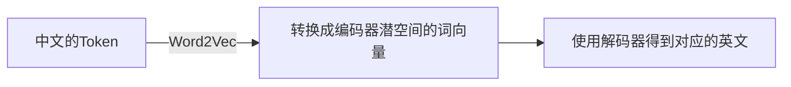
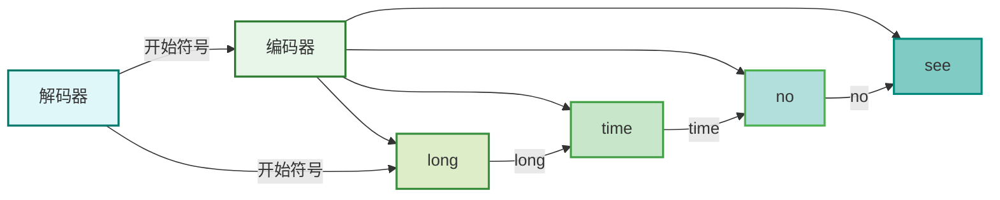

> 本文中的知识来源为B站up主[王木头学科学](https://space.bilibili.com/504715181)的视频[从编解码和词嵌入开始，一步一步理解Transformer，注意力机制(Attention)的本质是卷积神经网络(CNN)](https://www.bilibili.com/video/BV1XH4y1T76e)。

# 1. 编解码

## 1.1 前言

在Transformer中，注意力机制虽然特别，但理解Transformer的关键是编码（Encoder）和解码（Decoder）结构。编解码和注意力机制的关系可以类比于计算机中的冯诺依曼架构和显卡：

- **编解码（Encoder-Decoder）**：Transformer能够运行的基本原理。
- **注意力机制（Attention）**：显卡→在冯诺依曼这个大框架中，为了满足某种特定的任务而做出针对性优化的结构。

## 1.2 大模型路径

     
大模型进化图

上图的大模型进化图中有三条路线：

|       路线        |     代表大模型     | 特点                              | 强项                 |
| :---------------: | :----------------: | :-------------------------------- | :------------------- |
|  `Encoder-Only`   |       `BERT`       | 只保留了Transformer中编码器部分   | 学习和理解语言的内容 |
| `Encoder-Decoder` |       `UL2`        | 保留了Transformer中编码器和解码器 | 实际应用价值不高     |
|  `Decoder-Only`   | `ChatGPT`、`Llama` | 只保留了Transformer中解码器部分   | 生成内容             |

🤔 𝑸𝒖𝒆𝒔𝒕𝒊𝒐𝒏：为什么会有这三种路线呢？
🥳 𝑨𝒏𝒔𝒘𝒆𝒓：要想搞明白这个问题，我们需要搞清楚一件事情，所谓的编解码中的`码`到底是什么。

## 1.3 编码

### 1.3.1 前言

假设我们想要让LLM实现一个<u>英译汉</u>和<u>汉译英</u>的功能，那么按理来说“需要翻译的一个词”在两种语言的上下文关系是类似的。就比如说『香蕉』这个词，不管是在中文语境还是在英文语境中，它的上下文里面应该总是和『猴子』『黄色』『甜』『水果』这样的词有着更加紧密的联系。前面说的编解码中的『码』就是指<b>把各种语言中的〔符号〕、〔发音〕等形式上的不同剥离掉之后，剩下来的单纯语义关系</b>。

🤔 𝑸𝒖𝒆𝒔𝒕𝒊𝒐𝒏：那么这个表示单纯语义信息的『码』应该怎么设计呢？
🥳 𝑨𝒏𝒔𝒘𝒆𝒓：第一，由于LLM训练是在计算机中的，所以肯定要进行数字化。第二，因为这个『码』需要表示语义之间的相互关系，所以这个『码』数字化之后的数值理应可以体现出语义之间的关系才可以（否则我们数字化就没有意义了:joy:）。

那么应该如何设计这个『码』呢？在机器学习（ML）中有两个经典的环节可以启发我们：

1. `tokenizer`：分词器、标记器
2. `one-hot`：独热编码

上面的两个模块都可以对文本中最基础的语义单元进行数字化。

🤔 𝑸𝒖𝒆𝒔𝒕𝒊𝒐𝒏：最基础的语义单元是什么？
🥳 𝑨𝒏𝒔𝒘𝒆𝒓：分词器（Tokenizer）是一种策略和方法，用于将文本分割成更小的、有意义的单元。Tokenizer是存在多种不同的分词器实现形式，它们根据特定的语言特性、任务需求或算法设计而有所不同。那么常见的基础语义单元有：

1. 字母
2. 单词
3. 介于字母和单词之间的词根
4. 对应中文来说：
   1. 字
   2. 词

> <b>这里的『最基础的语义单元』其实就是TOKEN</b>。

那么我们就知道了，`tokenizer`和`one-hot`分别在利用不同的策略对文本实施数字化，将其转换为Token。

既然`tokenizer`和`one-hot`都可以对文本进行数字化，那么我们要使用哪种呢？我们先看一下这两种方式是如何对文本进行数字化的：

- `tokenizer`对文本实施数字化的方法比较简单，就是给每一个文本分配一个独立的ID。那么`tokenizer`会把所有的文本都投射到一根一维的数轴上。
- `one-hot`会把二进制中的每一位对应一个文本。如果有『苹果』『香蕉』『梨』这三个文本，那么会生成：
  - `001`代表『苹果』
  - `010`代表『香蕉』
  - `100`代表『梨』

     
tokenizer和one-hot对文本数字化的示意图

`tokenizer`和`one-hot`代表了对文本进行数字化的两种极端：

- `tokenizer`是把所有文本投射到了一个一维空间（不管文本有多少个）
- `one-hot`则是为每一个文本都分配了一个单独的维度，最终就会生成一个『有多少文本就有多少维度的高维空间』

我们可以看到，不管是`tokenizer`还是`one-hot`都可以很好地对文本进行数字化，但是我们在前面也提到了，数字化之后的数值可以体现出语义之间的关系才行。那么`tokenizer`和`one-hot`都可以满足这个要求吗？

### 1.3.2 tokenizer的问题

`tokenizer`把所有的文本都投射到了一个一维空间上，这就导致这个空间的信息**过于密集**，<b>从而很难表达出一些复杂的语义</b>。举个例子：

- `1`表示『苹果』
- `2`表示『香蕉』
- `3`表示『梨』

这三个Token都是水果，那么它们对应的数值比较接近，看起来`tokenizer`是比较合理的，但是如果『苹果』这个文本表示的不是水果而是手机呢？那么『苹果』放在这里就不合适了，很难体现出相邻数值之间关联性较高的要求。再者，对于『苹果和香蕉』这样一个组合起来的语义，按照直觉，应该是两种语义加起来，即`1+2`，但是`3`这个数值已经被『梨』占用了，这就会发生冲突。

### 1.3.3 one-hot的问题

与`tokenizer`的问题相反，`one-hot`因为要给每一个文本都分配一个单独的维度，因此如果文本太多，那么生成的空间维度太高了，这就导致信息密度**过于稀疏**。但是`one-hot`也有好处，就是<b>它可以很容易的表示出『苹果和香蕉』这样的组合语义</b>。

- `001`代表『苹果』
- `010`代表『香蕉』
- `100`代表『梨』

那么『苹果和香蕉』的`one-hot`编码就是`011`。虽然但是，`one-hot`最大的问题还是<b>维度空间太大了</b>，而且所有的Token相互正交且模长都是1，这就会导致所有向量之间的内积永远是0，<b>很难体现出Token之间的语义联系</b>。而且由于模长都是1，所有Token之间语义关系全部都是靠维度之间的关系去体现的，并没有充分把空间的长度利用起来。

### 1.3.3 tokenizer和one-hot缺点总结

- `tokenizer`：把所有的语义信息都变成了长度问题，完全没有利用维度关系去表示语义信息。
- `one-hot`：①维度空间太大了；②所有Token之间语义关系全部都是靠维度之间的关系去体现的，并没有充分把空间的长度利用起来。

### 1.3.4 改进方式

既然`tokenizer`和`one-hot`是两个极端，那么为了解决二者存在的问题，我们可以找一个维度高，但比`one-hot`要低的空间，去协助完成编码和解码的工作。这个空间一般称之为『潜空间』。那么我们怎么才能找到这个『潜空间』呢？一般有两个大的方向：

1. 基于`tokenizer`分词后的Token的id去升维
2. 基于`one-hot`编码后的Token去降维

因为这两个方向各有优劣，所以我们从直觉上出发，<b>把一个东西降维是比升维要简单的</b>。

> “把一个东西降维是比升维要简单的”可以这么理解：降维是把原数据进行压缩，而升维是把压缩后的数据还原。
> 怎么想也是压缩数据相对容易一些。

🤔 𝑸𝒖𝒆𝒔𝒕𝒊𝒐𝒏：`tokenizer`对一个文本进行分词后会得到一些id，这些id就是Token吗？
🥳 𝑨𝒏𝒔𝒘𝒆𝒓：是的，Tokenizer对文本进行分词后得到的ID可以被视为Token的表示。具体过程如下：
1.**分词（Tokenization）**：`tokenizer`将原始文本分割成一个个基本的语义单元（Token），这些单元可以是单词、字符、词语等。
2.**映射到ID**：每个Token通常会被映射到一个唯一的ID，这个ID通常来自一个预定义的词汇表（Vocabulary）。词汇表中包含了所有可能的Token及其对应的ID。
3.**Token表示**：这些ID就是Token的数字表示，便于后续的机器学习模型进行处理。

因此，经过Tokenization后得到的ID是Token的一种数字化表示，通常用于后续的文本处理和分析。

# 2. 矩阵和空间变换基础

## 2.1 向量和矩阵乘法

提到降维，这里有一种新颖的东西：在线性代数中，向量和一个矩阵相乘就可以理解为是一种空间变换。

     
向量和矩阵的乘法

上图中展示了『向量和矩阵的乘法』，这张图我们应该都熟悉，即向量里的每一个元素都会和矩阵中每一列相乘、相加，最后得到一个数值（新向量的一个值）。这种理解方式是从『代数』的角度出发的，那么我们是否可以使用『几何』的角度来<b>直观地</b>理解这个运算呢？

## 2.2 空间变换（线性）

### 2.2.1 第一种情况

     
向量与矩阵乘法的代数理解示意图：向量

假设$T$向量就是与矩阵相乘的向量，$\vec{T}$向量中的每一个数值就是这个向量在对应坐标系下的坐标值。在图中，也就是$\vec{T}$向量在$\vec{e_1}$和$\vec{e_2}$这个标准正交基上的分量，分量值分别是$a\vec{e_1}$和$b\vec{e_2}$。那么这个向量和矩阵相乘之后，它变成了如下图所示的样子：

     
向量与矩阵乘法的代数理解示意图：结果

我们可以看到，向量$\vec{T}$变成了一个新的坐标系下表示的向量。在新的坐标系下，它的坐标轴从原来的$\vec{e_1}$和$\vec{e_2}$这个标准正交基上的分量变成了$\vec{e'_1}$和$\vec{e'_2}$。现在我们要看的是，怎么把向量$\vec{T}$在之前红色的坐标系下变成绿色的坐标系。

我们可以想一下，向量$\vec{T}$其实在坐标系变换过程中并不重要，重要的是坐标系互相之间的关系，那么这种关系本质上就是坐标轴互相之间的关系，而坐标轴可以看成是一个**单位向量**。

如下图左边所示，假设$\vec{e_1}$在新坐标系（绿色的）下，三个坐标轴的分量分别是$w_{1,1}$、$w_{1,2}$、$w_{1,3}$，那么向量$\vec{T}$在旧坐标系（蓝色的）下可以用$a\vec{e_1}=(aw_{1,1}, aw_{1,2}, aw_{1,3})$来表示。原来的$\vec{T}$在红色坐标系下是有两个分量的，在新坐标系下我们也不能忘了它另外一个分量，如下图的右图所示，第二个分量的坐标轴从原来的$(1, 1, 1)$变成了$(w_{2,1}, w_{2,2}, w_{2,3})$，那么具体的分量可以在新坐标系下表示为：$b\vec{e_2}=(bw_{2,1}, bw_{2,2}, bw_{2,3})$。

因此我们可以知道，向量$\vec{T}$在旧坐标系下的数值为：

$$
\vec{T} = a\vec{e_1} + b\vec{e_2}
$$

     

有了这个两个表达之后，我们就可以看一下$\vec{T}$在新坐标系中的表示了。

首先需要明确的一点是，新坐标系相比旧坐标系，多了一个分量，而对于任意一个向量来说，应该都是有分量的，所以$\vec{T}$在新坐标系中的表达如下（确切来说任意一个向量都可以用下面的形式来表示）：

$$
\vec{T} = x\vec{e'_1} + y\vec{e'_2} + z\vec{e'_3}
$$

重点在于这三个分量$x, y, z$等于多少呢？刚才我们也说了，$\vec{T}=a\vec{e_1} + b\vec{e_2}$，那么因此可以推出分量的大小：

$$
\begin{cases}
    x & = aw_{1,1} + bw_{2,1} \\ 
    y & = aw_{1,2} + bw_{2,2} \\ 
    z & = aw_{1,3} + bw_{2,3}
\end{cases}
$$

那么这里的$w$系数就代表了旧坐标轴和新坐标轴的变换关系。$a$和$b$体现的是原来向量的信息。上面的计算如何用向量和矩阵相乘的形式写的话，可以写成如下形式：

$$
\begin{aligned}
    \vec{T} &= x\vec{e'_1} + y\vec{e'_2} + z\vec{e'_3} \\
    &= \begin{bmatrix}
        a \\
        b
    \end{bmatrix} \cdot \begin{bmatrix}
        w_{1, 1} & w_{1, 2} & w_{1,3} \\
        w_{2, 1} & w_{2, 2} & w_{2,3} 
    \end{bmatrix}
\end{aligned}
$$

从这个角度来看待，矩阵代表的就是<b>旧坐标系和新坐标系之间的关系</b>，其中：
- <b>矩阵的『行』代表旧坐标系有多少个维度（分量的多少）</b>
- <b>矩阵的『列』代表新坐标系有多少个维度（分量的多少）</b>

### 2.2.2 第二种情况

有了上面直观的理解之后，我们可以把这个问题再扩散一下，因为上面这个例子给人的感觉是$\vec{T}$向量本身没有什么变化，变化的是坐标系。我们再看下面这个例子：

     

我们可以看到，从$\vec{T}$向量变为$\vec{T'}$看起来并不是坐标系发生了变换，而是向量本身发生了变化，其实这个过程是相对的，我们**既可以理解为是向量本身发生了变化，也可以理解为坐标系发生了变化**。

上面两个例子中：

- 第一个例子看起来是向量没变，变的是坐标系
- 第二个例子看起来是坐标系没变，变的是向量

### 2.2.3 第三种情况

那我们将这两个特殊情况结合起来就形成了第三种情况：

     

上面这个例子看起来**坐标系和向量同时发生了变化**。

> 需要注意的是，上面的三个例子中，我们都只考虑向量和矩阵的乘法，不会考虑加法（只会有『旋转』『拉伸』『缩放』）。因为只有乘法，所以这是它们都是一个线性计算，这也就意味着：<b>在原来坐标系上的一个点与新坐标系上一个点唯一对应</b>。

如果我们想要让一条直线经过矩阵操作后变为一个曲线，那么向量和矩阵的乘法就无法实现了，这需要“二次型的表达”，即：

$$
P(x) = x^T A x
$$

简单来说就是，数据$x$在矩阵的两边同时存在，这种操作也可以看作是：

$$
f(x) = ax^2
$$

我们看这个二次函数就知道它不是线性的，但由于矩阵乘法的限制，我们想要让数据$x$变为平方，需要在变换矩阵$A$的左右加上$x$。变换示例如下图所示：

     

 
### 2.2.4 小结

我们总结一下，之前提到的向量和矩阵直接相乘可以看成下图所示的关系：

     

即通过一个矩阵，<b>空间A</b>变成了<b>空间B</b>，原来在空间A中的向量都可以与空间B中的向量一一对应 —— 这就是一个线性关系。

那如果是多个向量（多个数据）同时经过一个相同的向量呢，其实也是一样的，如下图所示：

     

从上图可以看到，向量从1个变成了3个，经过矩阵之后还是3个向量（我们可以理解为变换的是它们的坐标系，即维度）。如果把这三个向量看成一起，那就是一个矩阵，即一个矩阵和另外一个矩阵相乘，用公式表示：

$$
A \cdot B = C
$$

其中：

- $A$是数据（多个向量的集合）
- $B$是空间变换的规则
- $C$是转换后的数据集合

明确了$A, B, C$的意义之后<b>我们就可以理解为什么矩阵的乘法没有交换律了，因为意义根本不同</b>。

---

根据上面的例子，我们对矩阵和空间变换之间有了一定的熟悉了，那我们应该怎么理解空间变换呢？简单来说，空间变换就是空间里的某个对象会根据一个或一组函数关系映射到另外一个空间中。如果一个或一组函数都是一次函数，那么这个空间变换就是线性变换。

如果从几何的角度去看待，那么线性变换代表的是原空间里点和点之间的相对关系被投射到新空间后会有某些特性是保持不变的。这里的特性有：

- 原空间中两个不同的点在新空间里也一定是两个不同的点
- 原空间中两个点是共线的，那么在新空间也依然是共线的
- 原空间中两个向量是平行的，那么在新空间仍然是平行的
- 两个向量在线性变换时二者的绝对长度是可能变化的，但二者的比值不会变化
- ...

为了方便表示线性变换，就把那一组变换的线性代数的系数拿出来写成矩阵的形式，那么空间变换这个操作也就变成了矩阵乘法。

> 💡 矩阵这个概念不单单是多个变量在形式上的简化，有了矩阵很多事情理解起来也就会变得更加直观。比如说通过矩阵的行数和列数很快可以确定变换前后的空间维度。

## 2.3 行列式

讲到这里我们就可以专门去讲解一下行列式了。行列式是专门针对『方阵』而言的，即行数和列数相等的矩阵。那么既然行数和列数相等，那么也就意味着<b>如果这个方阵作为变换矩阵，数据变换前后的空间维度是不变的</b>。举个例子：变换前的数据是一个平面，变换后仍然是一个平面。但是变换后平面的面积是变大了还是变小了，这个事情由变换矩阵决定的。具体来说，是由变换矩阵的行列式的值决定的。

方阵的行列式的值是其一个特征，**从几何上代表着变换前后面积的拉伸比例**。如果是三维空间，那么就代表着体积的拉伸比例，更高维也是类似的。这个性质和数据无关，只和变换矩阵本身有关。

🤔 𝑸𝒖𝒆𝒔𝒕𝒊𝒐𝒏：为什么在数学上我们要学习那么有关矩阵的性质？
🥳 𝑨𝒏𝒔𝒘𝒆𝒓：因为每多一条受到约束的性质，对应到空间变换中就多了一个从原空间到新空间需要保持不变的特性。举个例子：从代数角度看，矩阵如果是对称的，就要求沿着对角线划分，两边的数据必须是相同的。如果我们从几何的角度看，矩阵如果是对称的就代表着两个向量变换前后的内积是保持不变的。我们之前在学校的时候经常会对矩阵进行特征分析，就其实就是在提取矩阵的代数特征，而这些代数特征也会体现这个矩阵在作为变换矩阵时拥有的特性。

我们把矩阵理解为空间变换只是一种理解方式，但并不是唯一的理解方式。前面我们把矩阵看成是一组向量，这是另外一种理解方式。如果我们把矩阵看成是一组向量，那么矩阵的一些性质（如对称性）就不重要了，『秩（Rank）』反而是重要的，因为秩表示：<b>要描述一行一行的向量需要几个线性无关的向量个数，即如果要把这个矩阵描述出来，至少需要一个多少维的空间</b>。

# 3. 词嵌入

编码就是把文本分割成Token，然后将每个Token编码为one-hot形式的向量。之后，通过Embedding将这些高维稀疏的one-hot向量转换为低维密集的向量，这个过程就是将输入的一句话根据语义投射到一个潜在的向量空间（潜空间）中，把高维空间中的对象投射到一个低维空间。Embedding能够捕捉Token之间的语义关系，使得语义上相似的Token在向量空间中也相近。

Embedding的数据不一定是单词，但在NLP领域，主要针对单词或Token，所以这个过程也被称为词嵌入。由于Embedding是使用矩阵乘法实现的，所以使用的变换矩阵被称为嵌入矩阵（Embedding Matrix）。

> 💡 <b>经过Embedding之后的one-hot向量就是词向量</b>！

前面我们提到过，潜空间其实就是一个没有符号、发音这些形式上差别的非常纯粹的语义空间。那基于这个非常纯粹的语义空间（潜在的向量空间，潜空间）再去实现对不同语言的翻译是非常合理的。举个例子：『中译英』和『英译中』完全可以用两套不一样的词汇表分别嵌入到两个独立的潜空间中，之后再通过某些算法将两个潜空间融合起来，这就实现了翻译。当然，也可以不使用两套词汇表，而是把中文和英文都放在一个大的词汇表中，统一训练后得到一个统一的潜空间。

不论是先嵌入再统一，还是先统一再嵌入，我们的目的都是得到两个语言共通的潜空间。之后我们可以用这个共通的潜空间为中介，实现『中译英』或『英译中』：

- **中译英**：先把中文编码为潜空间中的对象，之后再把这个对象解码为英文。
- **英译中**：先把英文编码为潜空间中的对象，之后再把这个对象解码为中文。

通过上面这种方式就可以保证两种语言的语义是一致的。

翻译只是NLP的一个应用，但是只要把文本编码到潜空间中，那么在潜空间中如何进行操作都是纯粹的数学计算。换句话说，编解码其实就是赛博版的曹冲称象：大象（句子）不好操作，那我们就把它等价地变成石头（潜空间对象），操作石头就很方便了，会有很多工具。

🤔 𝑸𝒖𝒆𝒔𝒕𝒊𝒐𝒏：编解码中的『码』是什么？潜空间代表什么？
🥳 𝑨𝒏𝒔𝒘𝒆𝒓：『码』就是Token。潜空间就是一个纯粹的语义空间。一个Token被Embedding之后就变成了一个多维向量，它的每一个维度都代表了一个独立的基础语义。拿“苹果”这个词举例子，假如它在潜空间中的向量为$[10.0, 0.4, 8, 2.3, ...]$，那么它的每一个维度都是一个独立的基础语义，如下图所示：

     

“苹果”这个Token经过Embedding后第一个维度代表的基础语义是“水果”，第二个维度代表的基础语义是“物理学”，第三个维度代表的基础语义是“手机”，第四个维度代表的基础语义是“甜味”等等。

这个Token具体的语义是什么需要看它在各个维度上分配的值，也就是权重。

> 这里只是为了方便理解举的例子，实际上算法生成的不同维度对应的语义人是很难理解的。
>
> 在NLP中，不同维度代表的是不同的基础语义，而在图片中每个维度相当于是一个个通道。

词向量和矩阵相乘可以升维和降维，那么在CNN中，升维和降维一般是通过1×1卷积实现的：一个1×1卷积核可以把图像中所有通道合成一个通道，那么有多少个1×1卷积核，那么结果就会有多少个通道（维度），这就是升维/降维的过程。

虽然潜空间和翻译手册都是基于语义去构建的，但是翻译手册只是一个单纯的对应关系。与翻译手册相比，<b>潜空间是一个连续的空间</b>，但翻译手册不是。那么通过训练得到的潜空间即便遇到了之前学习没有遇到的情况，仍然有对应的对象，也可以解码出相应的结果来。但翻译手册不行，我们可以把翻译手册理解为一个字典，是`key-value`结果，没有找到`key`，自然也没有对应的`value`，又因为翻译手册不是无穷的，所以没办法解决超出手册范围的问题。

> 即便翻译手册这种`key-value`结构是无穷大的，但它是可数级的，它的是$\aleph 0$，和自然数是等式的。但实数是$\aleph 1$。
>
> 简单来说，自然数是非负整数的集合，通常包括0、1、2、3等。而实数是包括有理数和无理数的数的集合，它们可以表示为小数（有限小数或无限不循环小数）。

<u>由于潜空间是连续的，所以在一定程度上可以证明编码模式可以理解语言</u>。因为只有理解了语言，才能在超越经验的情况下生成出合理的内容。

# 4. Word2Vec

那我们应该如何找到把真实语言中的Token投射到潜空间呢？换句话说，我们怎么才能找到实现降维的Embedding矩阵呢？

> 💡 <b>经过Embedding之后的one-hot向量就是词向量</b>！

一般而言，Embedding矩阵使用机器学习的方法来求解。在2013年，Google提出了[Word2Vec](https://arxiv.org/abs/1301.3781)就是一个经典的方法。这个方法与我们平时了解的机器学习的模型目标不一样。通常我们了解的机器学习模型的目标是：在模型训练好了之后，希望这个模型可以完成某个任务的。但Word2Vec模型的目标希望得到是嵌入矩阵（Embedding Matrix），所以**它的目标不是模型的输出，而是模型的参数**。这个目的的不同带来的最直接的差别是：Word2Vec不需要激活函数，计算起来更加简单。

> 💡**编解码的原理**是：输入一个Token，经过一个矩阵编码成了词向量，词向量也可以解码回去变成Token。正常情况下，解码回去的Token和输入的Token是一样的。

🤔 𝑸𝒖𝒆𝒔𝒕𝒊𝒐𝒏：那么我们使用这个思路去训练模型可以吗？
🥳 𝑨𝒏𝒔𝒘𝒆𝒓：看起来是可以的，但实际上不行。因为训练一定是要经过模型计算出来一个结果，这个结果和正确答案会计算损失，从而反向传播更新模型参数。既然解码回去的Token和输入的Token是一样的，那么模型的参数就不能动，那就不能训练！

为了解决这个问题，Google提出了两种思路：

1. CBOW
2. Skip-gram

## 4.1 CBOW

     

在CBOW中，输入不再是一个Token，而是一组奇数个的Token（这里假设为5个Token），那么我们把中间的Token拿掉，剩下的4个Token分别与同一个Embedding矩阵相乘，把它们变成潜空间里的词向量之后，再把这四个向量相加合成一个向量。之后再对这个合成向量进行解码。那么损失函数会定量的看和向量解码后得到的Token和中间挖掉的向量的Token是否一致，如果不一样则是会更新参数。

这里看起来怪怪的，为什么和向量解码之后的Token应该和中间挖掉的向量一致呢？这里可以想一下高中力学。我们这样想，如果只能从文本中理解一个Token的语义，那么能且只能根据上下文信息去判断、去理解。反过来，有了上下文也应该可以推断出缺失了的Token的语义。那么我们把这个问题放到潜空间中，每一个Token都是一个向量，那么我们就可以把已知的词向量看作是分力，中间缺失的Token所对应的词向量看作是已知力的合力。

     

🤔 𝑸𝒖𝒆𝒔𝒕𝒊𝒐𝒏：这里是不是会有问题，比如说：『这是一个\_\_\_苹果』。那么\_\_\_应该填什么？可以是红、绿、甜、便宜，填这些内容都是可以的。
🥳 𝑨𝒏𝒔𝒘𝒆𝒓：出现这个问题是因为上下文的范围不够大、训练的数据不够多。而且<b>这里训练的目的不是为了让模型具备完形填空的预测能力，而是让模型可以训练出体现语义的Embedding矩阵</b>。即便在训练过程中，训练数据同时有『这是一个红苹果』和『这是一个绿苹果』，所以模型不会具备给出100%正确答案的能力。而且需要注意的是，给出正确答案根本不是我们训练这个模型的目的，我们的目的是，模型在经过训练之后，在模型的潜空间中，『红』『绿』『甜』这几个Token的语义一定是一种比较接近的关系（至少从我们的角度看，它们都是形容词）。我们在前面比喻过，Word2Vec更像是编词典，那词典中的一个词有好几个解释这件事情是非常正常的，这跟该问题是一样的道理。

我们要明白，Word2Vec只是提供了一个对语义的最初的理解，它训练完成之后体现的是单个Token之间的联系（其实真的是一个词典的作用）。词典会用其他词去解释目标词，那么Word2Vec生成的潜空间就是在用其他词向量去合成（解释）目标词向量。那么Word2Vec这种形式训练出来的潜空间中词向量对应的词义是不依赖于作者主观意图的，它是一种客观的表达，这里的客观性是和整个语言环境绑定在一起的。而一个作者根据自己的主观意图，把许多词汇组合在一起，此时才具有了主观性，才能体现出不同人想要表达的不同内容。而这个主观性就体现在作者选择了不同的词、按照不同的顺序进行了排列组合。我们可以看到，是不同的词和不同的顺序在体现主观性。而要想让模型理解这部分体现作者主观性的语义，就不是Word2Vec的责任了（这其实是后面要将的注意力机制要做的事情了）。

## 4.2 skip-gram

上面我们已经知道了CBOW的原理，skip-gram其实就是把CBOW的原理反过来用。已知一个Token，根据它的词向量去求出上下文对应的Token的分量，之后看看是不是和训练数据一致。

> 其实CBOW和skip-gram都是可以自监督学习的，不需要人为的去打标签。只要给一个文本就可以用程序自己挖掉一些空，自己去训练。

上面介绍的CBOW和skip-gram都是原理内容，具体实现还是和原理有一些不同的。在介绍原理的时候我们用的是矩阵和向量，但在真正建立模型的时候，其实就是具有一层的隐藏层实现的（只不过没有bias和激活函数）。

     

如果单纯的从上面的原理上来说，这里的左右矩阵（$W$和$W'$）似乎只需要训练一个。因为$W$会把one-hot码投射到潜空间中，$W'$其实就是把潜空间里面的词向量还原成one-hot码。所以我们从上图可以看到，隐藏层的两边其实是一个逆过程，也就是说$W$和$W'$相乘之后应该会得到一个单位矩阵（上图就是一个降维和升维的过程），也就是说$W$和$W'$是一个伪逆的关系，⚠️但他们不是一个标准的逆矩阵。简单来说，$W$和$W'$只要知道一个，另一个是可以通过解析解求出来的，这也就意味着$W$和$W'$只需要训练一个就行，另外一个是不需要进行训练的。但在实际操作中，$W$和$W'$就是两个独立的矩阵，都会进行学习和训练。

🤔 𝑸𝒖𝒆𝒔𝒕𝒊𝒐𝒏：$W$和$W'$既然知道一个，另外一个就可以求出来，为什么在实际的代码都要进行训练呢？
🥳 𝑨𝒏𝒔𝒘𝒆𝒓：这是因为求矩阵的逆这个操作的复杂度比反向传播要高。反向传播的时间复杂度为$O(n)$，但如果对一个矩阵求逆，那么它的复杂度为$O(n^3)$。

此外还需要注意的是，隐藏层和输出层是没有激活函数的，因为根据我们上边的解释，Word2Vec就是一个典型的向量求和和向量分解，因此Word2Vec没有非线性的需求（变换前后空间是相同的），所以这里不使用激活函数。

Word2Vec这种方法重点是训练出一本词典，这里训练出来的嵌入矩阵$W$只是针对单个词的语义进行的。如果想要把一个一个的词组合成一句有准确含义的话，那Word2Vec就不行了。

# 5. 自注意力（Self-Attention）

     

上图中，左边的是编码部分，右边是解码部分。我们在前面也说了，现在的各大模型都是对这个结构进行一些变化和优化而得来的（只保留编码部分、只保留解码部分）。为了更好的理解上面这张图，我们先理解注意力，看下图。

     

在这张图中，输入是一组词向量，然后经过三个矩阵相乘之后分别得到$Q, K, V$三个矩阵，之后$Q, K, V$再进行一系列运算，最后输出一组词向量。值得注意的是，在注意力机制中，如果每次只是输入一个词，这样理论上是可以的，但就无法体现注意力机制的价值了。前面说了，<b>词嵌入已经解决了单个词、单个Token的语义问题，而注意力机制是要解决需要许多词、Token组合在一起后整体的语义</b>。所以我们需要把一句话中的多个词同时输入到模型中，那么注意力的价值才能体现出来。所以我们接下来在讲解输入部分时，就**不考虑只输入一个词的情况**了，而是考虑输入一组词的情况。

因为输入是一组词向量，所以它们就组成了一个数据矩阵。上图中输入的是一个$T$行的矩阵，那么从图中可以看到，输出也是一个$T$行的矩阵。至于输出的列数，它代表一个词向量的维度个数。

我们把Token变成词向量（<b>经过Embedding Matrix就可以变成词向量</b>），就像是把大象变成了石头，目的是方便后面的各种操作。对于石头来说，比较方便的操作就是切割、搬运、称重。<b>词向量方便的操作是和空间变换有关的各种矩阵、向量运算</b>。所以说，经过注意力之后，把原来的词向量进行一些升维和降维这些操作是非常正常的。

按照注意力机制的要求，输入的词向量矩阵必须要和$W_q, W_k, W_v$这三个矩阵进行相乘之后，才会得到$Q, K, V$。先不管$W_q, W_k, W_v$这三个矩阵的具体功能是什么，我们起码可以知道它们至少会进行空间变换的作用。输入矩阵是$T$行，$D_{in}$列，$W_q, W_k, W_v$这三个矩阵都是$D_{in}$行，$D_{out}$列。这里的$D_{out}$就决定了输出的词向量是多少列，也就是有多少个维度。<b>具体$D_{in}$和$D_{out}$谁大谁小，这需要根据具体的情况而定，在模型中不做具体的要求</b>。

输入的词向量矩阵和$W_q, W_k, W_v$相乘后得到$Q, K, V$并不是很重要，在注意力机制中，最重要的其实是得到$Q, K, V$之后的后续操作。这里先说一下计算规则，然后再解释其中的含义：

得到$Q, K, V$之后，先把$K$进行转置，然后让$Q$和$K$的转置相乘（这部分也可以是$Q^T$和$K$相乘，**这里谁进行转置没有本质的区别**）。乘完了之后就会得到一个$T$行$T$列的矩阵$A$。<b>这个$A$也被称之为注意力得分</b>。得到$A$之后还要对$A$里的每一项进行缩放，缩放规则是：除以$\sqrt{D_{out}}$（即$\frac{A}{\sqrt{D_{out}}}$），之后<b>按行</b>进行Softmax。这里除以$\sqrt{D_{out}}$是为了之后进行Softmax时数值可以尽量分散一些，而不是集中在$0$和$1$这样的饱和区。

🤔 𝑸𝒖𝒆𝒔𝒕𝒊𝒐𝒏：缩放为什么要除以$\sqrt{D_{out}}$？
🥳 𝑨𝒏𝒔𝒘𝒆𝒓：这里可以从概率分布的角度来看待这个问题，我们看一下下面这张图。

     

如果我们把$Q$的第一行看成是一个$X$向量，把$K^T$的第二列看成是$Y^T$向量的话，那么$A$的右上角等于$X$和$Y^T$相乘相加。因为我们要从概率的角度去看，所以我们需要假设：

$$
X = [X_1 \ X_2 \ ...] \sim N(0, I) \qquad X_i \sim N(0, 1) \\
Y^T = \begin{bmatrix}
    Y_1 \\
    Y_2 \\
    ...
\end{bmatrix} \sim N(0, I) \qquad Y_j \sim N(0, 1)
$$

即，$\vec{X}$这个向量是一个多元正态分布，即$\vec{X}$的每一项都遵循标准正态分布（期望是0，方差是1）且互相独立（协方差是0）。$\vec{Y^T}$向量也是一样的。

那么$\vec{X}$和$\vec{Y^T}$相乘再相加就可以写成如下的形式：

$$
\vec{X} \cdot \vec{Y^T} = \sum_{i=1}^{D_{out}}{X_i Y_i}
$$

其中，$X_i$和$Y_i$都是一个标准的正态分布，且互相独立。那么二者相乘之后期望是0，但它们的方差不是0，它们的方差如下：

> 设随机变量 $X_i$ 和 $Y_i$ 都是标准正态分布，即 $X_i \sim N(0,1)$ 和 $Y_i \sim N(0,1)$。它们的期望值 $E[X_i] = 0$ 和 $E[Y_i] = 0$，方差 $\text{Var}(X_i) = 1$ 和 $\text{Var}(Y_i) = 1$。
>
> 对于两个独立的随机变量 $X$ 和 $Y$，它们的乘积的期望值 $E[XY]$ 可以通过以下公式计算：
>
> $$E[XY] = E[X]E[Y] + \text{Cov}(X,Y)$$
>
> 其中 $\text{Cov}(X,Y)$ 是 $X$ 和 $Y$ 的协方差。由于 $X_i$ 和 $Y_i$ 是独立的，它们的协方差为 0：
> $$\text{Cov}(X_i, Y_i) = E[X_iY_i] - E[X_i]E[Y_i] = E[X_iY_i] - 0 \times 0 = E[X_iY_i]$$
>
> 对于标准正态分布的随机变量，它们的乘积 $X_iY_i$ 遵循一个中心卡方分布（Central Chi-distribution），具体来说是一个自由度为 2 的卡方分布除以 2。中心卡方分布的期望值是其自由度，因此 $E[X_iY_i]$ 的期望值是 1。
>
> 将这些值代入上面的公式：
> $$E[XY] = 0 \times 0 + 0 = 0$$
>
> 因此，两个独立标准正态分布随机变量的乘积的期望值是 0。

$$
\begin{aligned}
    & Var(X_i Y_i) \\
    & = E(X_i^2 Y_i^2) - E(X_i Y_i)^2 \\
    & = E(X_i^2)E(Y_i^2) - E(X_i)^2 E(Y_i)^2 \\
    & = (Var(X_i) + E(X_i)^2)(Var(Y_i) + E(Y_i)^2) - E(X_i)^2 E(Y_i)^2 \\
    & = (1+0)(1+0) - 0 \\
    & = 1
\end{aligned}
$$

这只是$Q$和$K^T$中两个向量的方差，那我们要求的是所有的方差，即：

$$
\begin{aligned}
    Var(X \cdot Y^T) & = \sum_{i=1}^{D_{out}}{1} \\
    & = D_{out}
\end{aligned}
$$

即：$X \cdot Y \sim N(0, D_{out} \cdot I)$。那么$X \cdot Y$依然是一个多元的高斯分布，它的期望仍然是0，但它的方差变成为$D_{out}$。那如果此时我们给每一项都除以$\sqrt{D_{out}}$，那么$X \cdot Y$的方差又变回了1，即$A$的期望为0，方差为1，还是服从标准的正态分布的。

---

上面我们解释了$A$为什么要除以$\sqrt{D_{out}}$，那么之后再**逐行**进行Softmax也是把问题放到概率框架下进行的，本质上是把数据根据它们的相对关系进行归一化。

> ⚠️ 这里的Softmax并不是按所有元素进行的，而是逐行进行的。

在经过逐行的Softmax运算之后，可以得到注意力得到$A'$，之后再将其与$V$矩阵进行矩阵相乘运算。

🤔 𝑸𝒖𝒆𝒔𝒕𝒊𝒐𝒏：上面这些计算有什么意义呢？
🥳 𝑨𝒏𝒔𝒘𝒆𝒓：要想搞明白这一点，我们需要再一次明确我们的目标：注意力机制的输入是一组词向量，而词向量本身已经具备一些基础语义信息的（但这个语义是相对的，是字典对它的解释，是客观的词义）。我们可以通过对词向量进行不同的排布从而使其具有主观性，那么这个主观性应该谁来做？很明显是注意力机制来做的。我们希望注意力机制可以根据上下文关联，从而对词典中原本客观的语义进行调整和改变的<b>幅度</b>。这个时候我们再去看$Q, K, V$，我们就可以理解为什么要进行这样的计算了。尤其是$A'$和$V$进行相乘，其中$V$就是表示从词典中查出来的Token的客观语义，而$A'$就是注意力机制根据上下文关联而产生的修改系数。

🤔 𝑸𝒖𝒆𝒔𝒕𝒊𝒐𝒏：为什么$A'$可以表达上下文关联的修改系数呢？
🥳 𝑨𝒏𝒔𝒘𝒆𝒓：这里的关键是$Q$和$K$的转置相乘的过程。前面我们提出了两种对句子的理解方式：①空间线性变化的规则（也就是上图中的$W$矩阵）；②一个矩阵代表一组向量（一行就是一个向量）。接下来我们就有第三种理解方式了：

注意力分数矩阵$A$的计算为：$A=Q\cdot K^T$。如果我们把$Q$和$K$看成是一组一组的向量，那么这个计算过程就可以看成是$Q$和$K$的向量两两之间在做内积。而<b>内积就是在表示一个向量在另外一个向量上的投影</b>，这个投影某种程度上就是在体现两个向量之间的相关关系。

还是这张图，我们看一下：

     

那么这个计算的某一个点积计算如下图所示：

     

其中，$:$表示所有行或所有列，即：

- $Q_{1,:}$表示$Q$矩阵的第一行和所有列
- $K^T_{:,2}$表示$K^T$矩阵的所有行和第二列

由第二行公式可以看到，$a_{1,2}$的大小可以在某种程度上体现出$\vec{q_1}$和$\vec{k_2}$两个向量之间的关系。如果这两个向量是正交的，那么 $\theta$ 应该为90°，那么 $\cos{\theta}=0$，即$\vec{q_1}$和$\vec{k_2}$是共线的，也就代表着$a_{1,2}$取得是最大值。那么存在矩阵$A$中的数值就代表了这两组向量它们之间互相关系的大小。

> 💡 $Q$的一行和$K^T$的一列代表着一个词向量。

因为Transformer用的是自注意力机制，所以$Q$和$K^T$是同源的，因为要计算矩阵$A$，所以对于每一组词向量都要和包括自己在内的所有其他词向量进行内积运算，得到的结果就是它们互相之间的关系。

- 如果两个词向量之间是正数，那么它们就是正相关
- 如果两个词向量之间是负数，那么它们就是负相关
- 如果两个词向量之间是0（垂直的），那么它们就是无关

所以注意力得分矩阵$A$得到的是一个表，这个表的每一行代表一个词向量，每一列也代表一个词向量。

     

- $A_{1,1}$：$Q$中第一个词向量和自己的关系
- $A_{1,2}$：$Q$中第一个词向量和$K^T$中第二个词向量之间的关系
- $A_{2,1}$：$Q$中第二个词向量和$K^T$中第一个词向量之间的关系
- $A_{2,2}$：$Q$中第二个词向量和$K^T$中第二个词向量之间的关系

为了让这些数值可以更加易用，对其逐行进行了Softmax，使其数值都在$[0, 1]$之间。之后再对矩阵$V$进行加权，加权过程如下图所示：

     

那么此时$V$中的词向量除了拥有客观语义外，还会有上下文的关系。

# 6. 理解Q和V

🤔 𝑸𝒖𝒆𝒔𝒕𝒊𝒐𝒏：因为$A=Q\cdot K^T$，先训练出$Q$和$K$，那么为什么不能直接训练矩阵$A$呢？如果不能，那么这两种方式的区别是什么？
🥳 𝑨𝒏𝒔𝒘𝒆𝒓：我们看下面两种情况的公式：
$$
A = X \cdot W_A \\
$$

$$
\begin{aligned}
    A & = X \cdot W_q \cdot [X \cdot W_k]^T \\
      & =  \cdot [W_q \cdot W_k^T] \cdot X^T \\
      & = X \cdot W_A \cdot X^T
\end{aligned}
$$

我们可以看到，如果只是一个矩阵相乘的话，输入的数据$X$到输出$A$就是一个线性变化，因此也只能表示线性关系。而如果是两个矩阵相乘的话，那么就可以看成是一个二次型，是更高维度的，因此可以表示非线性关系，因此第二种方式具有更强的表达能力。

🤔 𝑸𝒖𝒆𝒔𝒕𝒊𝒐𝒏：即便是用$Q$和$K$这样的二次型来算$A$，那么为什么不能只用一个$W$矩阵呢？自己和自己的转置相乘不也可以吗？
🥳 𝑨𝒏𝒔𝒘𝒆𝒓：一段话中的语义可以分为两个部分：①客观语义和②主观语义。如果对主观语义进行细分，那么主观语义可以被分为㉑设定语义和㉒表达语义。二者的区别如下：

- 设定语义：为后面的表达进行语境设定的语义。
- 表达语义：在已经设定好语境下进行观点表达的语义。

在这样的假设前提下，注意力机制中的$Q$和$K$正好可以在逻辑上充当设定语义和表达语义（这只是逻辑上的划分，真实情况是$Q$和$K$谁是设定语义，谁是表达语义并不明确）。经过这样的划分，我们可以在逻辑上将两种不同功能的主观语义进行区分，这样易于我们理解注意力机制中的$Q$和$K$。

🤔 𝑸𝒖𝒆𝒔𝒕𝒊𝒐𝒏：如果训练的数据很多（不同领域、不同形式、不同观点），那么每个数据都会对模型的参数产生影响。在模型训练完成之后，按理来说训练好的模型中保存的信息应该是所有数据语义表达的一个交集。面对这种情况，如果这个模型只能区分出客观语义和主观语义，而不能对设定语义和表达语义进行区分（意思是只有一个$W_q$，而不是$W_q$和$W_k$）。那么在这种情况下，“所有数据语义表达的一个交集”只能是基于同一个客观语义框架下的表达，这也就导致只能有一个统一的世界观和价值观。对于物理模型而言，这种方式可能是合适的，但对于我们日常使用来说，就远远不够了。“检验一流智力的标准是头脑中同时存在两种截然相反的思想，却能并行不悖”。那么我们如何让模型也可以做到这一点呢？
🥳 𝑨𝒏𝒔𝒘𝒆𝒓：那么就只能把主观语义再进行细分，分为设定语义和表达语义。“并存不同的思想”其实就是在不同的设定语义下，最后得到的观点可能不同（甚至截然相反），但它们又可以基于同一套客观的语义表达出来（客观语义是就是类似词典的潜空间）。简而言之，表达的观点可以不同，但这一定是在不同的设定语义之下的；如果在相同的设定语义之下还得到了不同的观点，那说明出现问题了。

> 上面的理解角度仅供参考

# 7. 交叉注意力（Cross-Attention）

     

自注意力和交叉注意力的核心仍然是$Q, K, V$这三个矩阵。不过在自注意力中，生成$Q, K, V$的数据$D_{in}$是相关的数据，而在交叉注意力中，$Q$和$K, V$使用的数据是不一样的。做一个比喻，自注意力机制相当于是闷头自学，自己所有的想法和经验都是自己从原有的材料中总结出来的。这就需要先理解材料中的设定语义，然后再根据设定语义去理解表达语义。而交叉注意力机制则像是手边有一个参考资料，省掉了理解设定语义的过程（这部分已经有参考资料提供了）。但是交叉注意力机制这种方式在训练学习时比较被动，因为这导致模型只能在表达语义这种很浅的层次上学习新知识，虽然可以记住答案，但是换一些题目/语境，模型就不会举一反三了（甚至遇到了和模型设想不一样的答案，模型反而会坚信不是自己的问题，错的是题目🤣）。当然如果这个模型用于翻译，那么就不会有什么问题。因为在翻译过程中，交叉注意力反而是一种校准。

> <b>其实说白了，交叉注意力和自注意力的区别在于：自注意力的输入只有一个，而交叉注意力的输入有两个（『Q』和『K，V』是独立的）</b>。

# 8. Transformer的编解码

有了上面的前置知识，我们再去看Transformer编码和解码不同的部分就比较容易理解了。

     

我们可以看到，解码器（Decoder）中的注意力机制中是多了一块的，即在经过注意力机制之后还会经过一个交叉注意力。上图为了方便展示，编码器（Encoder）只画了一层结构，旁边的$N\times$表明这部分是可以叠加许多层的。如果把多层结构都画出来，这个结构大概如下图所示。

     

也就是说，解码器（Decoder）中的每一层都会拿着编码器（Encoder）的结果作为参考，然后去比较相互之间的差异，即每做一次注意力计算都需要校准一次。

🤔 𝑸𝒖𝒆𝒔𝒕𝒊𝒐𝒏：Transformer训练和推理的流程是否有差异？
🥳 𝑨𝒏𝒔𝒘𝒆𝒓：是存在差异的。

     

Transformer在训练过程中，编码和解码部分可以并行训练。如上图所示，我们想让Transformer进行中英文的翻译，编码器输入是『好久不见』，其对应的英文翻译『long time no see』作为解码器的输入。之后会按照Transformer的流程**逐上**进行计算。在交叉注意力部分，编码器得到的潜空间的词向量，会参考解码器的潜空间词向量进行匹配，这样可以进行损失的计算。之后通过反向传播更新Transformer的参数。这样经过不断的训练，编码器和解码器在潜空间里词向量所表示的词义是能对应起来的。

那么Transformer推理的过程是不是应该如下图所示的样子：

     

流程应该是：

上面这种方式只适用于输入是一个单词或者中文和英文Token的长度是相同的，因为编解码器都是矩阵运算，是一个线性变化，所以数据个数是不会变化的，但我们知道**翻译这件事情输入和输出的长度大概率是不相同的，这也就是seq2seq问题**。所以上面的方式就不行了。

对于seq2seq问题，一般使用RNN来解决，这里Transformer也利用了RNN的思想，所以<b>Transformer在推理的时候并不是并行地生成词，而是一个一个的生成</b>。具体思路如下：

     

在编码器部分，还是先把『要翻译的话』转换为潜空间中的词向量，但在**解码器部分仍然是需要输入**一个东西的，这不过这里输入的是一个特殊的符号，这个符号代表“开始”。意思是说，无论编码器的输入是什么，在解码器中第一个输入的是“开始”符号。在将“开始”符号输入给解码器后，解码器会将该符号转换为潜空间中的词向量，之后再进行交叉注意力机制，得到一个结果，这个结果在经过升维和Softmax计算后，会将词汇表中所有Token都计算一个概率，最后拿出概率最大的Token作为结果。

🤔 𝑸𝒖𝒆𝒔𝒕𝒊𝒐𝒏：那么这个结果代表什么呢？
🥳 𝑨𝒏𝒔𝒘𝒆𝒓：代表解码器下一个输入的Token是什么。如下图所示：

     

这里“开始”符号得到的Token对应的是“long”，那么我们会将“long”符号送入解码器（编码器不变），经过同样的计算得到“time”；得到“time”后再进行计算，以此类推，这样我们就可以得到“开始”、“long”、“time”、“no”、“see”。在得到“see”后还会进行计算，得到一个“结束”符号，此时模型停止推理。具体流程如下图所示：

从上面的流程我们可以看到，这样进行推理因为是循环的，所以输出的长度是不受限制的，这样就可以解决seq2seq的问题。

🤔 𝑸𝒖𝒆𝒔𝒕𝒊𝒐𝒏：为什么很多LLM可以只用编码器（Encoder），也可以只用解码器（Decoder），而不是二者都必备？
🥳 𝑨𝒏𝒔𝒘𝒆𝒓：通过上面对推理流程的解析我们可以发现，Transformer的解码器（Decoder）并不是我们理解的解码器（只起到一个还原作用），而是会把输入的Token转换为潜空间中的词向量，所以Transformer的解码器也是具有编码功能的。像Chat-GPT那样的模型，它只有右边解码器的部分，它是这样做的：

- Openai不是让模型从0开始去生成，而是把我们的prompt先输入到模型中，这样模型会把我们的prompt看成是它已经生成过的内容，所以它只需要继续生成后续的内容即可。

🤔 𝑸𝒖𝒆𝒔𝒕𝒊𝒐𝒏：假设我们只输入一段文章，什么其他指令都不说，那么模型怎么能知道我们是想让它概况内容还是要续写或翻译呢？
🥳 𝑨𝒏𝒔𝒘𝒆𝒓：这个则是要看模型当初是怎么训练的了。

🤔 𝑸𝒖𝒆𝒔𝒕𝒊𝒐𝒏：Chat-GPT在没有编码器的情况下是如何进行翻译的呢？
🥳 𝑨𝒏𝒔𝒘𝒆𝒓：最简单的方法是把中文、英文、德文等等语言的所有的Token都放在一个大表中进行训练，只有模型足够大、训练的材料足够多，最终所有的语言都可以被统一到模型中了。

# 8. 位置编码

     

在输入输出的数据进行Transformer之前，需要先进行位置编码。那么需要位置编码的原因也很简单：<b>如果没有位置编码，那么Transformer会把所有的Token一起放到模型里面并行计算，这样会导致词语的前后顺序及其所携带的信息就无法体现了</b>。众所周知，顺序对于语言而言是非常重要的，“我打你”和“你打我”这两句话用的字是一样的，但意思截然相反，所以Transformer需要保证输入的一组词向量在并行计算的同时还能体现出它们的先后顺序（毕竟这个先后顺序在矩阵乘法中是体现不出来的）。所以关于词向量的先后顺序就需要引入额外的操作才可以保证了。

这个时候其实面临两种选择，一个是通过权重（也就是乘法）给模型里面增加位置信息；一个是通过偏置系数（也就是加法）进行区分，给模型增加位置信息，两种方式如下图所示：

     

- 其中$\odot$是阿达玛乘积，代表两个矩阵的元素是逐项相乘的。

原版的Transformer使用的是加法，这么做的原因是：**如果选择乘法，那么位置对词向量的影响就太大了，就相当于是给模型增加了额外一层结构。但如果是加法，那么就相当于只添加了一个固定的偏置系数。从几何的角度讲，这就相当于是给不同次数的向量进行了不一样的平移操作**。

## 8.1 绝对位置编码

大家可以回忆一下，刚才讲的注意力机制中都是没有涉及到偏置系数bias的，如果我们把位置编码就是看成是一个偏置系数的话，那么用加法实现位置编码也不是很过分，毕竟神经网络每一层都会有偏置嘛（也可以取消偏置）。虽然但是，这也不能代表只能使用加法来进行位置编码，就比如说Llama模型用到的是旋转位置编码，本质上是用乘法实现的位置编码。

既然要用加法实现位置编码，那我们需要考虑一个问题：就是$P_w$矩阵中的元素应该取什么样的值？这个不是拍脑门决定的，起码里面的数值可以体现出词向量的相互顺序才对，那么应该怎么体现呢？

使用加法实现的位置编码的方式称之为『绝对位置编码』，它就是把位置下标（也就是一个一维的自然数集合）投射到了与词向量维度相同的连续空间中，这样词向量矩阵就可以和位置编码矩阵直接相加了。

简单来说，**绝对位置编码是针对数据进行修饰的，直接让数据携带了位置信息**。

## 8.2 相对位置编码

与绝对位置编码不同，相对位置编码会更多的考虑一个词向量和另一个词向量之间的相对位置。那么一个词向量和另外一个词向量进行对比是在哪里发生的 —— 是在注意力机制里面发生的，也就是$Q$和$K^T$相乘的过程。所以说，<b>绝对位置编码是对数据进行修饰，那么相对位置编码就是对注意力得分的$A$矩阵再进行修饰，让它具备相对位置的信息</b>。

当我们没有加绝对位置编码时，注意力机制的得分$A$矩阵的计算方式如下：

$$
A = XW_{q} W^T_k X^T
$$

当我们给数据提前加了绝对位置编码之后，注意力机制的得分$A$矩阵的计算方式如下：

$$
\begin{aligned}
    A & = (X + P)W_q W^T_k (X+P)^T \\
    & = \underset{只和数据有关}{\underline{XW_qW^T_kX^T}} + \underset{都依赖于位置编码P矩阵}{\underline{XW_qW_k^TP^T + PW_qW_k^T + PW_qW^T_kP^T}}
\end{aligned}
$$

     

🪐**总结**：绝对位置编码因为只考虑绝对信息，所以它可以只对数据进行修饰，而相对位置编码需要比较两个词向量，因此只能对注意力得分矩阵$A$进行修饰。至于修饰的方式既可以用加法，也可以用乘法（乘法本质上就是旋转角度的方法）。

# 9.  多头注意力

<b>多头注意力机制本质上就是能力更强的CNN</b>，其中词向量的维度就是CNN里面的通道数，多头注意力的多头对应的就是卷积核。

     

输入数据$X$是两个词向量组成的矩阵，之前我们在介绍注意力机制的时候，输入数据只经过一个注意力机制，计算出一个得分矩阵$A$，而在多头注意力机制中，输入数据会经过多个注意力机制（这里是3个，<b>且三个注意力机制中的参数是独立的</b>），得到3个得分矩阵$A$；之后把三个结果拼接在一起形成一个大矩阵，这个大矩阵的行数和输入的词向量个数相同，列数是单个注意力输出的维度×头的个数。得到大矩阵之后还会和一个$W$矩阵相乘，最后得到输出的词向量。

🤔 𝑸𝒖𝒆𝒔𝒕𝒊𝒐𝒏：多头注意力的形式看起来比较简单，但这么做有什么意义呢？为什么要分别计算再拼接在一起，而不是直接就使用一个9维的矩阵进行训练呢？
🥳 𝑨𝒏𝒔𝒘𝒆𝒓：我们先看一下最后的计算，如下图所示：

     

我们对计算过程进行了分组（绿、红、蓝），这里的分组其实是按照词向量的维度进行分组的，前面我们说过，词向量的维度某种程度上可以理解为是通道（图片的RGB通道是类似的）。现在因为有3个头，所以每个头计算出来的结果都会有3个维度。对于三个结果的第一个维度，如果定性的去想，那么它们在语义上应该是比较接近的，那么把语义解决的维度组成一组是比较合理的想法。那么一旦组成一组后，我们就可以理解为这个维度是在多头的情况下的一个比较综合的语义。其它维度也是类似的，因为输入的词向量有三个维度，所以3个头最后综合起来的三个维度就可以理解为图片里的RGB三个通道。那么这三个通道经过一个系数相乘后在相加就会得到一个具体的值。如果对应到CNN中的话，通道之间相乘、相加就相当于是1×1卷积核，那么1×1卷积核的主要作用是用来打通通道的（说白了就是升维或降维）。

既然组合组之间的相乘、相加是1×1卷积，那么组里面的元素相乘、相加就可以对应到CNN中的卷积操作，如下图所示：

     

🤔 𝑸𝒖𝒆𝒔𝒕𝒊𝒐𝒏：多头注意力机制和卷积核它们的差别是什么？
🥳 𝑨𝒏𝒔𝒘𝒆𝒓：卷积核在计算的时候基本上只能是基于中心的几圈，但多头注意力机制就不再局限于一个中心的周围了，而是可以跨越无穷远的地方。

🤔 𝑸𝒖𝒆𝒔𝒕𝒊𝒐𝒏：自注意力、交叉注意力、多头注意力有什么区别？
🥳 𝑨𝒏𝒔𝒘𝒆𝒓：

- 自注意力：输入是一个$X$，这个$X$会生成$Q, K, V$三个矩阵，最终再生成注意力得分矩阵$A$，之后注意力得分矩阵$A$再和$V$进行矩阵乘法得到加权后的输出
- 交叉注意力：输入是两个$X_1$和$X_2$，其中$X_1$负责生成$Q$矩阵，$X_2$负责生成$K, V$矩阵，最终再生成注意力得分矩阵$A$，之后注意力得分矩阵$A$再和$V$进行矩阵乘法得到加权后的输出
- 多头注意力：就是多个自注意力，得到的结果会进行拼接和矩阵运算，最终得到多头注意力的得分矩阵$A$，之后注意力得分矩阵$A$再和$W$进行矩阵乘法得到加权后的输出

# 10.  掩码

在解码器（Decoder）中会有一个Masked Multi-Head Attention（带有掩码的多头注意力机制），为什么要给多头注意力机制添加掩码呢？这是因为在推理的时候，解码器部分是一个词一个词生成的，这也就说明，当模型生成到某个词的时候，这个词按理来说只应该受到之前词的影响，不应该被未来生成的词所影响。

我们前面也说过，注意力机制生成的得分矩阵$A$是可以表示一个词和所有上下文之间的关系的，这个上下文针对模型生成的词而言，既包含了之前的词，也包含了之后的词，但是我们不想让生成的词被未来会生成的词所影响，所以需要添加一个掩码，即给注意力得分$A$中的某些部分屏蔽掉，如下图所示：

     

屏蔽的方法就是在特定的位置上分别加上一个无穷小，这样在进行逐行的Softmax计算时，这些被屏蔽的地方的分数为0。

## 11. Add & Norm（残差和归一化）

     

这部分的功能有两个：

1. 实现残差网络的功能
2. 对上一层数据进行归一化运算

这里做一个类比：没有做残差就相当于蒙着眼开车，我们只能通过控制手的不来回晃动让车尽量走直线，理论上这样是可以实现的，但对操作的要求非常高。但如果做了残差，就相当于是我们可以看到路上的标线了，我们控制的是车子和标线的偏差，就算手再抖，这个偏差也不会特别大，我们还是能调整回来的。

至于Norm，也就是Normalization，不同的模型用到的方法是不一样的。Transformer中用到的是LayerNorm。简单来说，我们给模型输入一段话，一段话会有不同的句子，每一个句子都是一个矩阵，且因为句子的长短不一样，所以矩阵的行数也是不一样的。LayerNorm要做的是：一个句子中，不管句子的行数是多少，它会把说中句子中的元素都放在一起之后在进行归一化。

## 12. Feed Forward（前馈神经网络）

Transformer中的前馈神经网络其实就是一个MLP，由两个线性变换（全连接层）和一个非线性激活函数组成。这三个部分依次进行，其中两个线性变换之间通常会插入激活函数。 

## 13. Linear

这里其实就是对词向量的维度进行调整：

- 在训练的时候，我们需要把维度变换成可以计算损失值的形式
- 在推理的时候我们需要把词向量变成one-hot编码，去判断哪个Token的概率最大。

# 知识来源

1. [从编解码和词嵌入开始，一步一步理解Transformer，注意力机制(Attention)的本质是卷积神经网络(CNN)](https://www.bilibili.com/video/BV1XH4y1T76e)