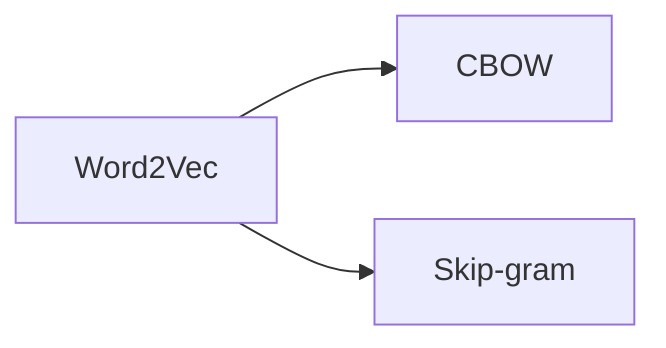

# 1. 自然语言处理NLP基础：引言

## 1.1 NLP介绍

自然语言处理（NLP）的核心目标是使计算机能够理解人类语言。这不仅包括解读书面文本，也涉及生成自然语言的对话。NLP致力于让计算机不仅能够阅读和理解人类撰写的文字，还能像人类一样进行交互和对话，从而生成流畅的自然语言。

自然语言的重要性不言而喻。一方面，人类语言被视为智能的重要体现；另一方面，它也是人工智能领域中图灵测试的基础。图灵测试是由计算机科学先驱阿兰·图灵提出的，用于评估机器智能的一种方法。在图灵测试中，测试者通过对话来评估机器是否具备智能，而无需看到对方。测试者提出问题，机器则需要理解这些问题并给出恰当的回应。这种对话形式是图灵测试的核心。

为了让机器通过图灵测试，使其在对话中让测试者无法区分是人类还是计算机，机器必须能够深刻理解人类语言，并提供合理的回答。这表明NLP是人工智能通过图灵测试的重要基础工具。最初，图灵并没有将这种测试命名为“图灵测试”，而是称之为“模仿游戏”（imitation game），意在探索机器是否能模仿人类行为。如果机器的表现与人类无异，那么它就被认为是具备了人类智能。

这类似于“鸭子定律”：如果一个动物看起来像鸭子、叫声像鸭子、走路也像鸭子，那么它就是鸭子。对于人工智能来说，也是如此。图灵采用了行为主义的方法，通过观察机器是否能模仿人类行为，来设定一个判断其是否具备人类智能水平的标准。这种以行为和交互能力为依据的测试，至今仍是评估人工智能智能水平的重要方法。

## 1.2 NLP的影响

在人工智能的发展史上，自然语言处理（NLP）占据了举足轻重的地位，许多具有里程碑意义的成就都与NLP紧密相关。例如，2011年，IBM推出了一款名为`Watson DeepQA system`的产品，并在一档著名的电视问答节目中亮相。在这个节目中，主持人向参赛者提出各种问题，考验谁能够更快、更准确地回答。`Watson DeepQA system`在比赛中战胜了所有人类对手，赢得了第一名。这一成就被视为继1997年人工智能在国际象棋领域战胜世界冠军之后的又一个重要里程碑。到了2016年，Google的`DeepMind`团队开发的`AlphaGo`在围棋领域战胜了人类顶尖选手，再次证明了人工智能的惊人进步。

自2010年以来，人工智能在多个领域取得了显著的发展。全球范围内，从事NLP研究的机构遍布各地，无论是在美国、欧洲还是亚洲，都有众多研究机构致力于NLP领域的研究。同时，许多互联网公司也推出了与NLP相关的产品，显示了这一技术在实际应用中的广泛影响力。

接下来，我们将通过一系列实例来探讨NLP的具体应用。对于想要深入了解NLP的读者，我推荐阅读2015年发表在《Science》杂志上的综述文章《Advances in Natural Language Processing》。这篇文章全面介绍了NLP过去几十年的发展历程，由两位NLP和语音领域的权威学者撰写，非常适合作为了解NLP基础知识的入门读物。现在，让我们继续探讨NLP中的一些基本任务和应用。

## 1.3 NLP的基本任务和应用

### 1.3.1 NLP的基本任务

     

在自然语言处理（NLP）领域，一些基础任务构成了理解自然语言的基石。这些任务包括：

1. **词性标注（Part of Speech Tagging）**：这一任务涉及识别句子中每个单词的词性，如名词、动词、形容词等。词性标注是实现自然语言理解的基础工作，它为进一步的语言分析提供了必要的信息。

2. **命名实体识别（Named Entity Recognition）**：此任务旨在识别文本中提及的具体实体。这包括：
   - **人名（PERSON）**：如“李白”、“贝多芬”。
   - **地点（LOCATION）**：如“北京”、“纽约”。
   - **组织（ORGANIZATION）**：如“苹果公司”、“联合国”。
   - **日期（DATE）**：如“2024年9月27日”。
   - **时间（TIME）**：如“下午3点”。
   - **数量（QUANTITY）**：如“100公斤”、“20米”。
   - **货币（MONEY）**：如“100美元”。
   - **百分比（PERCENT）**：如“50%”。

3. **共指消解（Coreference Resolution）**：在自然语言中，先前提及的实体可能会通过代词进行省略。共指消解任务的目标是识别这些代词所指代的具体实体，这对于全面理解句子意义至关重要。

4. **基础依存关系分析（Basic Dependency Parsing）**：在语言学中，分析句子中单词之间的句法关系是一个重要课题。这包括确定句子的主语、谓语、宾语及其修饰关系。依存句法理论专注于这些成分之间的依存关系，并将其标注出来，以便更深入地理解句子结构。

这些基础任务是NLP领域的基石，为构建更复杂的语言处理系统提供了必要的基础。随着技术的发展，这些任务的精确度和效率不断提高，为实现更高级的语言理解和生成任务奠定了坚实的基础。

在自然语言处理（NLP）的广阔领域中，除了上述基础任务之外，还有一系列与语言本身特性密切相关的高级任务。以中文和英文的处理为例，两者之间存在一个显著的差异：中文的词与词之间通常没有空格分隔。这一特点给计算机的理解和处理带来了额外的挑战。

为了解决这一问题，中文NLP领域发展出了一项专门的任务——自动分词。自动分词的目标是将中文句子中的词汇正确地分隔开来，即在词与词之间插入空格，以明确区分各个词汇。这项任务对于中文文本的进一步处理和分析至关重要，因为它为后续的词性标注、命名实体识别等任务提供了基础。

自动分词不仅涉及到简单的空格插入，还需要考虑到中文的语法、语义和语境等因素，以确保分词的准确性和合理性。随着NLP技术的发展，自动分词的算法和模型也在不断优化，以适应日益复杂的语言现象和应用场景。

通过自动分词，我们能够更好地理解和处理中文文本，为中文NLP领域的研究和应用提供了坚实的基础。这项任务的成功实施，不仅推动了中文NLP技术的进步，也为跨语言的NLP研究提供了宝贵的经验和启示。

### 1.3.2 应用：搜索引擎与广告（Search Engine and Ads）

在完成了一系列基础任务之后，我们来探讨自然语言处理（NLP）在搜索引擎领域的关键应用。搜索引擎的两大核心技术之一是<b>理解并匹配用户的查询（query）与海量文档之间的相关性</b>。这一过程正是NLP技术大显身手的地方：如何精准地匹配用户的查询与相关文档，并计算它们之间的语义相似度，从而评估文档满足查询需求的程度。

此外，搜索引擎的另一大盈利渠道是通过广告投放。当用户输入查询后，搜索引擎不仅能返回相关文档，还能展示用户可能感兴趣的广告。一旦用户点击这些广告，广告商便需要向搜索引擎支付费用。这种盈利模式在互联网领域，尤其是搜索引擎和个性化推荐应用（如字节跳动旗下的抖音）中占据着举足轻重的地位。无论是搜索引擎还是广告投放系统，它们都将用户与所需信息的精准匹配视为核心技术点，这也是NLP技术发挥重要作用的领域，可以称之为文本匹配问题。

在搜索引擎中，还有另一个关键因素需要考虑：评估网站或网页的质量。这就涉及到了所谓的`PageRank`算法，它利用互联网链接信息来评估网页的重要性。这一领域是数据挖掘和信息检索的重点关注问题，即如何分析网络结构并判断哪些节点更为重要。这是一个值得深入探讨的话题，但今天我们不在这里详细展开。

> PageRank 是由 Larry Page 和 Sergey Brin 在斯坦福大学开发的一种链接分析算法，它构成了 Google 搜索引擎早期成功的关键部分。PageRank 的目的是衡量网页的重要性，并据此对搜索结果进行排序。这个算法的基本思想是：一个网页如果被很多其他网页链接到，那么这个网页就很重要；而且，如果这些链接来自本身也很重要的网页，那么该网页的重要性就会更高。
> 
> PageRank 通过迭代计算每个网页的得分来实现这一点。每个网页都有一定的“投票权”，即它可以将其重要性的一部分传递给它所链接的其他网页。具体来说，如果网页 A 链接到网页 B，那么 A 就会将它的一部分 PageRank 值传递给 B。传递的数量取决于 A 的总 PageRank 值以及 A 链接到多少个其他网页（A 的出链数）。
>
> 需要注意的是，虽然 PageRank 曾经是 Google 排序算法中非常重要的组成部分，但随着时间的推移，Google 已经引入了更多的因素来决定搜索结果的顺序，PageRank 的影响力已经不如从前。此外，Google 不再公开显示具体的 PageRank 值。

### 1.3.3 应用：知识图谱（Knowledge Graph）

     

实际上，自然语言处理（NLP）与人类结构化知识之间存在着紧密的联系。以现实世界中的一个例子来说，我们知道威廉·莎士比亚是《罗密欧与朱丽叶》的作者。这个事实可以用三元组的形式来表示，即两个实体——莎士比亚和《罗密欧与朱丽叶》，以及它们之间的关系。这些反映现实世界的知识往往隐藏在文本之中。

> 三元组是一种表示知识的基本结构，它由三个部分组成：主体（Subject）、谓语（Predicate）和客体（Object）。这种形式可以用来描述两个实体之间的关系。在自然语言处理和知识图谱中，三元组是构建结构化数据的一种常见方式。
> 
> 例如，在上面提到的例子中，“威廉·莎士比亚”是主体，“是作者”是谓语，《罗密欧与朱丽叶》是客体。这可以用三元组的形式表达为：
> 
> - 主体（Subject）: 威廉·莎士比亚
> - 谓语（Predicate）: 是作者
> - 客体（Object）: 《罗密欧与朱丽叶》
> 
> 或者更形式化地表示为 (威廉·莎士比亚, 是作者, 《罗密欧与朱丽叶》)。
> 
> 这样的三元组可以帮助计算机理解和处理文本中的信息，并用于创建知识图谱、进行信息检索以及其他自然语言处理任务。

我们关注的是如何充分利用这些知识来更深入地理解文本，或者反过来，如何从文本中提取这些知识，以便更好地获取相关信息。这涉及到从文本中识别和提取实体、关系以及它们之间的相互作用，从而构建出结构化的知识图谱。这些知识图谱不仅能够帮助我们更好地理解文本内容，还能在信息检索、推荐系统和问答系统等多种应用中发挥关键作用。通过这种方式，NLP技术能够将文本中隐含的丰富知识转化为可操作的结构化信息，极大地增强了我们处理和利用文本数据的能力。

知识图谱是一个将全球范围内与现实世界相关的实体及其关系编织成的巨大网络。当用户进行查询时，搜索引擎能够迅速匹配并展示这些实体的结构化信息。这项技术起源于2012年，由谷歌公司推出。自谷歌推出知识图谱以来，众多搜索引擎纷纷投入到这一领域的建设中。如今，知识图谱已成为我们获取信息的另一个重要来源。

在知识图谱的构建过程中，涉及到许多自然语言处理（NLP）的问题。例如，如何根据用户的查询匹配或寻找最相关的实体及其相关知识，就是一个典型的NLP挑战。此外，如何构建这样一个庞大的知识图谱，以及如何从海量文本中自动提取三元组形式的结构化知识，也是NLP技术需要解决的问题。

一旦知识图谱构建完成，它就能够支持搜索引擎执行更复杂的任务。例如，它能够回答一些具体的问题，如“中国有多大？”在理解这类问题的基础上，搜索引擎可以调用知识图谱中的相关信息来提供准确的答案。这种能力不仅提升了搜索引擎的效率，也极大地丰富了用户的查询体验，使得搜索引擎变得更加智能和有用。

### 1.3.4 应用：机器阅读（Machine Reading）

正如我们之前所讨论的，知识图谱并非凭空产生，它需要从大规模文本中自动挖掘信息。这一过程涉及到一个至关重要的技术——机器阅读（Machine Reading）。机器阅读是指利用自然语言处理（NLP）技术让计算机自动阅读和理解文本内容，从而提取出结构化知识。

通过机器阅读，我们可以处理原始的自然语言文本，这些文本本身没有任何结构。<b>机器阅读的目标是理解文本中实体之间的关系，并将这些关系转化为三元组形式的结构化信息</b>，进而丰富我们的知识图谱库。例如，通过分析文本，机器阅读技术能够识别出实体间的特定关系，并将这些信息提取出来，形成知识图谱中的三元组。

机器阅读完成的工作不仅仅是简单的文本解析，而是<b>深入理解文本的语义内容，识别实体和关系，并将这些信息转化为可操作的结构化数据</b>。这一过程对于构建和维护知识图谱至关重要，因为它能够自动化地从海量文本中提取有价值的知识，为搜索引擎、推荐系统和其他智能应用提供支持。通过机器阅读，我们能够将非结构化的自然语言文本转化为结构化的、可查询的知识，极大地扩展了我们处理和利用文本数据的能力。

### 1.3.5 应用：个人助手（Personal Assistant）

自然语言处理（NLP）的应用范围远不止于此。我们之前提到了图灵测试，这是一种评估机器是否具备人类智能的经典方法。图灵测试的核心在于人机对话，其初衷是为了验证机器智能，但我们也可以将其应用于更广泛的领域，以更好地服务于人类。

在国内市场，智能音箱已经成为许多家庭的常客。百度、小米、华为等知名品牌都推出了自家的智能音箱产品。同样，我们的智能手机上也配备了各种虚拟助手，比如Windows操作系统中的Cortana，它们都是我们日常生活中的得力助手。

以亚马逊的智能音箱Alexa为例，它不仅是一个简单的音响设备，更是一个人工智能的代表。Alexa能够与人类进行流畅的交流，帮助我们完成各种任务。在这个过程中，NLP技术发挥了至关重要的作用。它使得人工智能能够理解用户的语音指令，并在完成任务后提供恰当的反馈。这种交互方式是NLP技术应用的一个缩影，也是人工智能与人类沟通的重要桥梁。

通过这些智能设备，NLP技术的应用变得更加广泛和深入。它不仅提升了用户体验，还推动了人工智能技术的发展，使得机器能够更加自然地与人类沟通，理解我们的需求，并提供帮助。这些智能音箱和虚拟助手的成功，展示了NLP在实际应用中的巨大潜力，也为我们未来的人机交互提供了无限可能。

### 1.3.6 应用：机器翻译（Machine Translation）

除了我们已经讨论过的智能音箱和虚拟助手，自然语言处理（NLP）还涵盖了一系列其他关键任务，其中机器翻译尤为引人注目。机器翻译的核心目标是将一种语言中的句子精准地转换成另一种语言中的句子。这一任务不仅是NLP领域的经典挑战，而且其研究历史已经跨越了几十年。

机器翻译的终极愿景是打破语言壁垒，实现全球不同语言使用者之间的无缝交流。为了达成这一目标，研究者们一直在探索如何让机器不仅能够理解源语言的语法和词汇，还能捕捉到语言背后的文化细微差别和语境含义。

随着技术的不断进步，机器翻译的准确性和流畅性已经有了显著的提升。如今，机器翻译已经成为促进国际合作、文化交流、教育普及以及旅游业发展的重要工具。它不仅帮助人们跨越语言障碍，更在全球化的浪潮中扮演着桥梁的角色，让不同文化背景的人们能够更紧密地联系在一起，共享知识与智慧。随着NLP技术的持续发展，机器翻译的潜力和应用范围将更加广泛，为构建一个更加紧密相连的世界贡献力量。

### 1.3.7 应用：情感分析与意见挖掘（Sentiment Analysis and Opinion Mining）

     

那么此外的话，我们也可以用NLP，然后这种技术，然后来去理解一句话里面人所表达出来的情感，譬是说我到底是知道他的这个情绪是怎么样的。我我是想知道他是高兴，还是说一般还是说愤怒。那么甚至我可能会有更多力度的这么一个情感的这么一个一个区分。我甚至可能还需要知道这个观点或者是情感到底是谁发出的，然后他是对谁来发出的。那么所有的。这些技术我们会把它称为叫做sentment analysis，叫情感分类和这个Opinio Mining意见挖掘。那么这个技术有非常广泛的这个应用。

     

几年前，有一个应用项目引起了广泛关注，它的目的是分析美国不同州居民在一天24小时内情绪的变化。这项研究揭示了一些非常有趣的现象：例如，人们在晚上和早晨的情绪往往比较正面，倾向于蓝色或绿色调；而到了中午和下午，情绪则普遍变得较差，不那么愉快。

这个项目被命名为“国家脉搏”（Pulse of the Nation），它利用了自然语言处理中的情感分析技术。通过分析Twitter上不同州用户在不同时间段发布的推文，研究者们能够挖掘出这些推文中所蕴含的情绪色彩，并据此进行分析。这项工作是早期情感分类领域的一个重要且有趣的案例，它展示了NLP技术在理解人类情绪动态方面的潜力。

通过这种情感分析，我们不仅能够洞察个体的情绪变化，还能够在更宏观的层面上理解社会情绪的波动。这种分析技术的应用不仅限于社交媒体，还可以扩展到市场研究、公共健康监测、甚至政治竞选策略等多个领域，为决策者提供了宝贵的数据支持。随着NLP技术的不断进步，情感分析在理解人类行为和情感方面的应用将变得更加广泛和深入。

### 1.3.8 应用：计算社会科学（Computational Social Science）

     

自然语言处理（NLP）技术的潜力远远超出了我们日常的应用场景。它实际上可以与计算社会科学交叉，利用语言作为分析工具，深入探索人类心理的奥秘。例如，哈佛大学的一个项目，名为Culturomics，旨在发现人类文化的“基因”。这个项目创造性地将“omics”（组学）与“cultural”结合，形成了一个新的词汇。Culturomics项目通过分析Google Books扫描的大约500万本书——这些书籍涵盖了从1800年到2000年的200年历史——来观察关键词随时间的变化趋势，从而分析人类文化的演进。

这项工作取得了显著的成就，包括揭示了语言演化的过程和人类文化的变迁。相关研究成果不仅在《自然》（Nature）杂志上发表了封面文章，还出版了一本畅销书。这些资料可以在Google Books `N-gram`s网站上获取，该工具也可供研究者进行社会学研究。Culturomics为社会科学提供了一种全新的定量研究范式，产生了深远的影响。它展示了NLP基础技术——关键词计数——在文本分析中的应用潜力。

想象一下，如果我们将NLP技术更深入地应用于这些文本，我们就能为人类社会的研究提供更深刻的见解。NLP技术的应用不仅限于计算关键词的频率，它还能帮助我们理解语言的复杂性和文化的多样性，从而支持更深层次的社会科学研究。

> 网站链接：[books.google.com/`N-gram`s](https://books.google.com/`N-gram`s/)

     

实际上，我们完全可以通过语言这一独特的视角来深入分析人类的心理状态。在这一领域，James Pennebaker的研究工作尤为著名。他发现，人们在使用代词等语言风格上的偏好，实际上能够反映出他们心理上的不同状态。这一发现对心理学和语言学的研究产生了深远的影响。

Pennebaker的研究表明，通过分析个体的语言使用模式，我们可以洞察他们的情感状态、个性特征甚至健康状况。这种语言分析方法为理解人类行为提供了新的维度，也为心理健康评估和干预提供了新的工具。

对于对这一领域感兴趣的读者，我强烈推荐阅读James Pennebaker的著作。他的研究不仅为我们打开了一扇了解人类心理的新窗口，也为NLP技术在心理学领域的应用提供了宝贵的启示。通过这些研究，我们可以看到，语言不仅是沟通的工具，更是揭示人类内心世界的钥匙。

# 2. 自然语言处理NLP基础：词表示（Word Representation）

## 2.1 词表示（Word Representation）

继介绍了自然语言处理（NLP）的基础任务及其在多个领域的广泛应用之后，我们可以看到语言不仅是人类智能的一个集中体现，而且在许多方面都有深远的影响。现在，让我们深入探讨NLP中的一个核心问题——词的表示问题。

词的表示是NLP的基石，它涉及到如何将词汇转换成计算机可以处理的格式。通过介绍这一问题，我们将引出深度学习和大型模型在NLP中的重要技术基础。这些技术的发展极大地推动了NLP的进步，使得机器能够更准确地理解和生成自然语言。

在接下来的讨论中，我们将详细探讨如何利用深度学习技术来改善词的表示，以及这些表示如何为构建更复杂的NLP系统提供支持。这将包括对当前最前沿的模型和方法的分析，以及它们如何帮助我们更好地捕捉语言的丰富性和复杂性。通过这些技术的介绍，我们希望能够为读者提供一个清晰的视角，了解NLP领域的最新发展和未来趋势。

     

那么，究竟什么是词表示呢？词表示是自然语言处理中的一个基本概念，它涉及到将自然语言中的基本单位——词，转换成机器能够理解的形式。简而言之，词表示的目标是让机器能够捕捉到每个词的内在含义。

     

## 2.2 词表示的目标（Goal of Word Representation）

要实现词的有效表示，我们必须明确我们的目标。如果让计算机来处理，它的主要目标有两个：

1. **计算词与词的相似度**：我们希望基于词的表示来计算词与词之间的相似度。这意味着一旦计算机理解了一个词的含义，它就应该能够准确地计算出任意两个词之间的相似度。例如，"star" 和 "sun" 在某种程度上可能相似，"motel" 和 "hotel" 也应该相关。词相似度的计算是词表示的一个重要目标。

2. **推理词与词的关系**：另一个目标是发现词与词之间的语义关系。例如，我们知道"China" 和 "Beijing" 之间是国家和首都的关系，这与 "Japan" 和 "Tokyo" 之间的关系相似。同样，"Man" 和 "King"，以及 "Woman" 和 "Queen" 之间也存在相似的关系。因此，我们可以推断出 "Woman" 减去 "Queen" 大致应该等于 "Man" 减去 "King"。通过等价替换，我们可以得出 "Man" 的表示大致应该等于 "King" 减去 "Queen"，再加上 "Woman"。此外，像 "Swimming" 和 "Swim" 的关系，大致应该等于 "Walking" 和 "Walk" 的关系。因此，我们可以认为 "Swimming" 的表示应该大致等于 "Walking" 减去 "Walk"，再加上 "Swim"。

我们希望建立的词表示能够满足这两种计算能力。这样的词表示不仅能够捕捉词的内在含义，还能够揭示词之间的复杂关系，为各种NLP任务提供强大的支持。通过这种方式，我们可以更深入地理解语言，开发出更加智能和准确的NLP应用。

## 2.3 同位词和上位词（Synonym and Hypernym）

     

在探讨词义表示的历史方法时，我们通常会采用一种直观而简洁的策略。这种方法的核心在于利用与目标词汇相关的一组词汇来描绘其含义。以“Good”这个词为例，我们可以通过收集与“Good”相关的近义词和反义词来构建其词义的框架。这样，我们就能够通过这些相关词汇的集合来反映“Good”的内在含义。

进一步地，如果我们将视角转向自然语言处理（NLP）这一领域，我们可以采用类似的策略。NLP可以被视为信息科学（information science）的一个分支，而信息科学又隶属于更广泛的科学（science）范畴，最终归属于知识领域（knowledge domain）。通过这种方式，我们实际上是在用与NLP紧密相关的词汇来定义和描述这一领域。

这种表示方法的优势在于其直观性，它允许我们通过与目标词汇相关的其他词汇来理解和传达其含义。这种方法不仅适用于单个词汇，也同样适用于更复杂的概念和领域，为我们提供了一种强有力的工具，以理解和表达语言的丰富性和多样性。

## 2.4 同位词和上位词用来词表示的问题（Problems of Synonym / Hypernym Representation）

     

在采用近义词和上位词来表示词义的方法中，我们面临着一些挑战。首先，这种方法可能无法捕捉到词语之间微妙的语义差异。例如，一些词在不同语境下可能有着细微的差别，而这些差别通过传统的同义词或上位词关系难以准确表达。

其次，同义词、上位词等词间关系通常需要人工标注，这在处理新出现的词汇时显得尤为困难。以“Apple”为例，它原本指代一种水果，但现在更多地指代苹果公司。同样，“Amazon”曾经主要指代南美洲的雨林，而现在也常用来指代一家电子商务公司。这些新的含义很难通过传统的词典提供的近义词或上位词来准确捕捉。

此外，这种表示方法还存在着主观性问题，因为它受限于词典的标注质量。同时，我们还面临着数据稀疏性问题，即对于任何一个词的表示，其相关词汇的数量与整个词表相比总是相对较少。这限制了我们能够捕捉到的语义信息的丰富度。

最后，构建和维护这样的词典需要大量的人工工作，这不仅增加了成本，也限制了这种方法的可操作性。因此，尽管利用近义词和上位词来表示词义是一种直观的方法，但在处理现代语言的复杂性和动态性时，它显示出了明显的局限性。这促使我们在自然语言处理领域寻求更先进的技术和方法。

## 2.5 独热码表示（One-Hot Representation）

     

在计算机科学中，一种广泛采用的词汇表示方法是将每个词视为一个独立的符号。这种方法通常被称为One-Hot Representation。在这种表示中，每个词都被映射到一个与词汇表长度相同的向量中的一个维度上。对于特定的词，其对应的维度值设为1，而所有其他维度的值则设为0。这样，每个词都可以通过一个独特的向量来表示，其维度与词汇表的大小相匹配。

One-Hot Representation在文档表示中尤其有效。例如，如果一个文档包含数百个不同的词，那么在表示这个文档时，我们可以在对应这些词的维度上标记为非零值，而在其他维度上标记为0。这种方法使得计算两个文档之间的相似度变得相对简单。

     

然而，One-Hot Representation在表示词义时存在一些局限性。它假设不同词的向量是正交的，这意味着任意两个词之间的相似度计算结果为0。这种假设忽略了词语之间可能存在的语义联系，因此并不符合我们对词义相似度的直观理解。在自然语言处理的许多应用中，我们希望模型能够捕捉到词与词之间的细微语义差异，而One-Hot Representation由于其正交性的假设，无法满足这一需求。因此，尽管One-Hot Representation在某些场景下非常有用，但在需要捕捉词义丰富性和复杂性的任务中，它就显得力不从心了。

## 2.6 基于上下文词表示（Represent Word by Context）

     

为了解决One-Hot Representation在捕捉词义丰富性方面的局限，自然语言处理领域提出了一种更为先进的表示方法，即Contextual Representation。这种方法的核心观点是：<b>一个词的词义与其出现的上下文环境密切相关</b>。正如名言“You shall know a word by the company it keeps”所言，一个词的“同伴”——即它经常伴随出现的上下文词汇——能够揭示其真正的词义。这种思想在自然语言处理中具有重要意义。

Contextual Representation通过分析目标词的上下文词汇来表示该词。例如，假设我们有大量包含单词"stars"的句子。为了准确表示"stars"的词义，我们不仅关注这个词本身，还关注其上下文中频繁出现的词汇，如"sunny"、"cold"、"night"等。这些上下文词汇为我们提供了"stars"在不同语境下的具体含义，从而使得我们的表示更加丰富和准确。

通过Contextual Representation，我们能够捕捉到词语在不同上下文中的微妙变化，从而更准确地理解和表示词义。这种方法不仅提高了模型对语言的理解能力，还为各种自然语言处理任务（如文本分类、情感分析等）提供了更为强大的基础。因此，Contextual Representation已成为现代自然语言处理中不可或缺的一项核心技术。

## 2.7 共现频次（Co-Occurrence Counts）

     

采用Contextual Representation的方法，我们能够以一种全新的方式将词汇表示为向量。与One-Hot Representation不同，这种向量的长度与词汇表（Vocabulary）的大小相同，但每个维度现在表示的是该词在上下文中出现的频率或重要性。这样的表示方法允许我们捕捉到每个词的上下文信息，从而为每个词生成一个稠密的向量表示。

通过这种方式，我们不仅能够为每个词创建一个独特的向量，而且这些向量能够反映出词汇在实际使用中的复杂性和细微差别。这些稠密的向量使得我们能够在一个高维空间中计算两个词之间的相似度，从而更准确地衡量它们在语义上的接近程度。

## 2.8 基于频次/计数表示的问题（Problems of Count-Based Representation）

     

这种方法虽然在很多方面表现出色，能够利用上下文信息来丰富词汇的表示，但它也面临着一些挑战。首先，随着词汇表的不断扩大，所需的存储空间也会显著增加。这是因为每个词的表示现在依赖于其在大量上下文中的统计数据，这需要更多的内存来存储。

其次，对于那些出现频率较低的词，由于它们在文本中出现的次数有限，我们能够收集到的上下文信息也会相应减少。这导致这些词的上下文向量变得非常稀疏，从而影响了它们在语义空间中的表示质量。稀疏性问题可能会削弱模型捕捉这些词真实语义的能力，因为模型依赖的是有限且可能不具代表性的数据。

## 2.9 词嵌入（Word Embedding）

     

针对上述挑战，深度学习和大型模型提出了一种创新的解决方案，即所谓的Word Embedding技术。Word Embedding的核心思想是分布式表示（Distributed Representation），它旨在构建一个低维且稠密的向量空间，每个词通过这个空间中的唯一位置来表示，即一个向量。

在Word Embedding的框架下，我们试图将每个词映射到这个低维空间中的一个点，用该点的向量来表示该词。这种方法的一个显著优势是，它能够自动学习并捕捉词与词之间可能存在的稳定关系。例如，国家和它们首都之间的相对位置关系，可以在向量空间中得到自然体现。

通过Word Embedding，我们能够利用这些低维向量来计算词与词之间的相似度和相关性，而无需依赖于人工标注的上下文统计数据。这些向量可以通过大规模数据自动学习得到，极大地提高了表示的效率和准确性。

在Word Embedding领域，一个具有里程碑意义的工作是Word2Vec。Word2Vec是一个由Google开发的模型，它通过神经网络技术学习词的向量表示，这些表示能够捕捉丰富的语义和句法信息。Word2Vec的出现标志着自然语言处理领域的一个重要进步，它为后续的许多研究和应用奠定了基础。

总的来说，Word Embedding技术通过深度学习和大模型的力量，为我们提供了一种高效且强大的词汇表示方法。这种方法不仅能够自动学习词的低维向量表示，还能够捕捉词与词之间的复杂关系，为自然语言处理的未来发展开辟了新的道路。

# 3. 自然语言处理NLP基础：语言建模（Language Modeling）

     

探索语言模型的奥秘，我们首先需要了解它们的主要职责。语言模型的核心功能是预测文本序列中下一个词的出现概率。这种能力对于任何精通语言的人来说都是基本的，它几乎是我们与生俱来的技能。回想一下在学校的日子，尤其是在初高中时期，我们常常在老师还没说完话之前就抢先回答，这种能力正是语言模型试图模拟的。

语言模型的目标是赋予计算机预测文本中下一个词的能力。这不仅仅是一个技术挑战，它还涉及到计算机如何理解和处理自然语言的深层次问题。通过训练，计算机可以学习词汇之间的统计关系，并据此预测下一个最可能出现的词。

一旦计算机掌握了这种预测能力，它就能更准确地理解句子的含义，更有效地生成回应，甚至在复杂的对话系统中发挥作用。这些应用都依赖于语言模型的强大能力，它们使得机器能够处理和生成自然语言，从而在各种场景下提供帮助。

     

语言模型的核心任务可以概括为两个关键功能：

1. 它们需要计算一个词序列构成合法句子的概率。
   - 换句话说，给定一串中文词，我们如何判断这个序列是否能够被理解为一句合法的中文？这涉及到词序列的联合概率，即评估一个已生成的词序列构成合法句子的可能性。
2. 语言模型需要根据已有的文本预测下一个最可能的词。
   - 这是通过条件概率实现的，即在给定前文的情况下，预测下一个词是什么。

这两个能力——联合概率（joint probability）和条件概率（conditional probability）——构成了语言模型的基础。它们不仅让计算机能够评估和生成自然语言，还使得机器能够理解和预测语言的流动，这是自然语言处理领域的一个关键挑战。

     

要实现语言模型的功能，我们依赖于一个基本的假设，这是构建语言模型的基石。这个假设是：<b>一个词的出现概率仅受其前面词的影响</b>。这意味着，给定一系列前面的词，我们可以预测下一个词的概率。

基于这个假设，我们可以将整个句子的联合概率分解为一系列条件概率的乘积。以句子 "Never too late to learn" 为例，我们可以将其概率表示为：

$$
\begin{aligned}
   P(\text{Never, too, late, to, learn}) & = P(\text{Never}) \times P(\text{too} | \text{Never}) \times P(\text{late} | \text{Never, too}) \times \\
   & P(\text{to} | \text{Never, too, late}) \times P(\text{learn} | \text{Never, too, late, to})
\end{aligned}
$$

这个公式展示了联合概率和条件概率之间的关系。因此，语言模型可以表示为一个句子的联合概率等于句子中每个词基于其前面所有词的条件概率的乘积：

$$
P(w_1, w_2, \ldots, w_n) = \prod_{i=1}^{n} P(w_i | w_1, w_2, \ldots, w_{i-1})
$$

这种表示方法使得我们能够通过计算每个词的条件概率来构建整个句子的概率模型，这是自然语言处理中的一项基本技术。

## 3.2 N-gram模型（N-gram Model）

     

构建语言模型的核心问题在于如何准确地预测词序列中下一个词的概率。在深度学习技术兴起之前，一种非常流行的方法叫做N-gram模型。N-gram模型的基本思想是统计在给定前$N-1$个词的条件下，第$N$个词出现的概率。

具体来说，N-gram模型通过统计文本中连续出现的词序列的频率来估计词的概率。例如，如果我们使用4-gram模型，我们就会关注前三个词的出现频率，并用它来预测第四个词的概率。这种方法只考虑了紧邻的词，而忽略了更远距离的词之间的依赖关系。如公式所示，4-gram模型只考虑包含预测词在内的四个连续词，而不考虑更远的词的影响，如在"Never too late to"中会忽略"Never"。

如果我们使用bigram模型，也就是2-gram模型，我们则只考虑连续出现的两个词，并用前面的一个词来预测下一个词。这种方法简化了模型，使其只依赖于紧邻的词。

N-gram模型通过在大规模语料库中统计连续词序列的频率，为我们提供了一种估计词序列概率的方法。这种方法在深度学习技术出现之前，是自然语言处理领域的一项重要技术，拥有几十年的研究历史。

     

我们可以看到，N-gram模型的背后实际上是基于Markov假设的。这个假设的核心思想是，一个词的出现概率只依赖于它前面的有限数量的词。这意味着，当我们计算一个词的联合概率时，我们只考虑它前面的几个词，而不是整个句子的历史。

这种假设简化了我们的模型，使我们能够专注于有限的历史信息来预测当前词。例如，如果我们使用bi-gram（2-gram）模型，我们只考虑前一个词来预测当前词。这种模型的参数数量较少，计算效率较高，但可能无法捕捉到更远距离的词之间的依赖关系。

N-gram模型的这种具体实现方式，就是利用Markov假设，只考虑有限的历史长度。这个历史长度是可调的，你可以选择使用bi-gram、tri-gram（3-gram）或其他N-gram模型，根据你的具体需求来调整。

## 3.3 N-gram模型的问题（Problems of N-gram）

     

`N-gram`模型在自然语言处理领域扮演着重要角色，但其也存在一些局限性。`N-gram`模型的核心思想是将文本分割成连续的$n$个词的序列，并通过统计这些序列的出现频率来预测下一个词的概率。这种模型基于一个关键的假设——Markov假设，即一个词的出现概率仅依赖于它前面的有限数量的词。这个假设简化了模型，使其专注于有限的历史信息来预测当前词。

然而，`N-gram`模型也面临着一些挑战。首先，随着模型考虑的历史长度增加，比如使用4-gram或5-gram，虽然能够捕捉更长的上下文信息，但这些长序列在大规模语料库中出现的次数会显著减少，导致统计结果变得稀疏。这种数据稀疏性问题会严重影响模型的准确性和泛化能力。

其次，`N-gram`模型通常采用One-Hot Representation，这种表示方式假设所有词都是相互独立的，无法捕捉词与词之间的相似性。例如，"the cat is walking in the bedroom"和"a dog was running in a room"在使用`N-gram`模型分析时，会被认为是完全不同的，尽管它们在语义上有相似之处。

此外，随着$N$值的增加，模型需要存储的参数量也会显著增加，这不仅增加了计算负担，也可能加剧数据稀疏性问题。因此，在实际应用中，`N-gram`模型的N值通常选择为2或3，以平衡模型的复杂度和数据稀疏性问题。

总的来说，尽管`N-gram`模型在处理自然语言时存在局限性，但它的简单性和有效性使其在许多NLP任务中仍然是一个有用的工具。随着深度学习等先进技术的发展，我们有望看到更先进的模型来解决`N-gram`模型的现有问题。

## 3.4 神经语言模型（Neural Language Model）

     

随着深度学习的兴起，Neural Language Models（神经语言模型）成为了自然语言处理领域的一个热点。这些模型利用分布式表示（distributed representations），也就是将词汇映射到低维空间中的向量，来构建预测当前词的条件概率模型。

     

> 论文链接：[A Neural Probabilistic Language Model](https://www.jmlr.org/papers/volume3/bengio03a/bengio03a.pdf)

具体来说，如上图所示，当我们试图预测一个词$w_t$时，我们需要考虑它的上下文$context$。这个上下文通常由前面的几个词组成，例如 $w_{t-n+1}$、$w_{t-2}$、$w_{t-1}$。这些词的数量可以更多，但在这个例子中，我们只考虑三个。这些词首先被转换为低维向量，即 $C(W_{t-n+1})$、$C(w_{t-2})$、$C(w_{t-1})$，这些向量代表了我们之前提到的分布式表示。然后，这些向量被拼接在一起，形成一个更高维度的上下文向量。这个向量随后经过一个非线性转换（例如使用$\tanh$函数），用于预测下一个词$w_t$。

所有的预测工作都是基于上下文的表示来完成的。由于每个词的向量表示以及整个匹配和预测过程都是基于神经网络的可调参数，我们可以通过大规模数据自动学习这些词的向量，以及上下文向量和当前词之间的神经网络权重。这就是Neural Language Model的核心工作。与传统的N-gram模型不同，Neural Language Model中的每个词都表示为一个低维向量，相似的词会有相似的向量表示，因此在语境中可能发挥相似的作用。

值得注意的是，神经语言模型的概念最早由图灵奖得主在2003年提出，并在当年发表了相关论文。然而，从趋势图中我们可以看到，在深度学习真正流行起来之前，这一概念并没有受到太多关注。直到深度学习技术成熟并广泛应用后，神经语言模型才得到了广泛的关注和引用。这表明深度学习的发展是经过了长时间的积累和沉淀，最终才取得了今天的成功。

# 4. 大模型基础：引言

     

在前面的章节中，我们深入探讨了自然语言处理（NLP）的基础知识，包括向量表示和语言模型等核心概念。自2013年以来，随着深度学习技术的飞速发展，NLP领域也经历了翻天覆地的变化。从2013年的Word2Vec，到2014年的循环神经网络（RNN），再到2018年的ELMo，以及近年来广泛采用的预训练语言模型，这些技术的发展都是深度学习进步的直接结果。

在接下来的内容中，我们将重点介绍预训练语言模型的机制、细节，以及它们为何能在当前NLP的发展浪潮中占据如此重要的地位。这节课，我们尤其希望帮助大家深入理解预训练语言模型的具体工作原理，以及它们如何推动了自然语言处理技术的革新。

预训练语言模型的出现，标志着NLP领域的一个重要转折点。它们不仅提高了模型的性能，还简化了模型的训练过程，使得开发者能够更高效地构建和部署NLP应用。这些模型通过在大规模数据集上进行预训练，学习到了丰富的语言表示，从而在各种下游任务中展现出卓越的性能。

随着深度学习技术的不断进步，预训练语言模型也在不断进化，为NLP领域带来了前所未有的机遇。在本课程中，我们将深入探讨这些模型的内部机制，以及它们如何助力我们解决复杂的语言理解问题。通过这些内容的学习，相信大家会对预训练语言模型有更深入的认识，并能够更好地将它们应用到实际项目中。

## 4.1 为什么大模型很重要（Why are Big Models Important）

     

> 数据来源：[gluebenchmark.com](https://gluebenchmark.com)

首先，让我们探讨大规模预训练模型在自然语言处理（NLP）中的重要性。从性能的角度来看，2018年之前与之后的情况形成了鲜明对比。自从预训练语言模型被引入NLP领域，模型的性能实现了质的飞跃。

     

为了量化这一进步，我们采用了一个名为GLUE的基准测试，它是衡量语言理解能力的重要指标。通过GLUE测试，我们可以看到，预训练模型的应用带来了显著的性能提升，与以往的模型相比，性能差距显著。在某些情况下，预训练模型的表现甚至超越了人类，这在以往的技术中是难以想象的。

     

在自然语言处理（NLP）的领域，预训练语言模型不仅在语言理解方面取得了显著成就，同样在语言生成，尤其是对话系统的应用中，也展现出了卓越的性能。自2018年起，研究者们开始聚焦于如何开发更优秀的预训练模型，以及如何将这些模型应用于更广泛的任务中。

     

总体来看，自2018年以来，预训练语言模型的发展呈现出三个主要趋势：首先是模型参数的不断增加，其次是分布式计算能力的优化，最后是模型训练所需数据量的扩大。研究者们发现，随着参数量的增加和数据量的扩大，预训练语言模型的性能得到了显著提升，能够大幅提高各种任务的执行效率。

从2020年开始，模型参数的增长速度极为迅猛，平均每年以十倍的速度增长。例如，从BERT和GPT这样的模型，其参数量大约在1亿（100M）左右，发展到现在的GPT-3，拥有1750亿（175B）参数，以及参数量更大的Swin-Transformer模型。随着模型参数量的增加，所需的数据规模和计算量也在同步增长。为了应对这一挑战，研究者们采用了更多的并行计算策略来加速模型的训练和推理过程。这就是大模型它的一个整个发展趋势。

     

在深入探索GPT-3模型的过程中，我们惊讶地发现它积累了丰富的知识储备，这些知识甚至触及了我们之前认为与人类智能紧密相关的领域。例如，在GPT-3中，我们可以看到它不仅具备对世界常识的理解，还能进行逻辑推理。以下是一些实际案例，展示了直接向GPT-3提出问题时，它如何能够生成与问题紧密相关的、符合世界知识和常识的答案。这些答案不仅准确，还体现了模型在多维度逻辑推理上的能力。

这一现象揭示了一个重要的事实：当预训练语言模型在海量数据上进行训练，使用大量的参数学习时，文本中蕴含的知识会被有效地捕捉并存储在模型的参数中。因此，将这些模型应用于多样化的自然语言处理（NLP）任务时，我们有理由期待它们能够带来卓越的效果。

这也是为什么自2018年预训练语言模型问世以来，研究者们逐渐将其视为解决NLP问题的基础工具，并投入大量精力进行相关研究。预训练语言模型的出现，不仅推动了NLP领域的进步，也为未来的技术创新奠定了坚实的基础。

     

## 4.2 大模型与小模型之间的区别（Difference of Big Models and Traditional Models）

在探讨大型模型的另一个引人入胜的方面时，我们不得不提及其在小样本或少样本学习中展现出的显著能力。传统上，深度学习被认为是一种“数据饥渴（Data Hungry）”的范式，它依赖于大量的标注数据来训练模型，以期达到优异的性能。这种模式要求我们投入海量的标注数据作为支撑。

然而，GPT-3向我们展示了一种不同的学习方式。在大规模的无标注数据上进行预训练后，模型能够积累丰富的知识储备。在解决具体任务时，我们不再需要大量的样本，而是可以通过少量的样本来指导模型，激活其相关知识，从而高效地解决问题。例如，在机器翻译领域，传统的方法是依赖大量的平行语料。但GPT-3通过少量的翻译样本，就能够执行相当高质量的翻译任务。这正是大型模型在知识积累上的量变，所带来的质的飞跃。

     

自2018年以来，我们可以明显观察到，预训练语言模型的出现，使得研究者和实践者对这一领域的关注程度呈指数级增长。这种“爆炸性”的关注增长，不仅反映了预训练语言模型的重要性，也预示着NLP领域未来的发展方向。从线性增长到指数增长的转变，标志着预训练语言模型已经成为NLP研究和应用的新基石。

# 5. 大模型基础：大模型背后的范式（Paradigms Behind Big Models）

在上文中，我们探讨了大型模型与传统NLP方法之间的显著差异，以及它们卓越的性能和日益增长的关注程度。现在，让我们深入探讨这些大型模型背后的核心机制，以及它们为何能够Work。

     

对于预训练语言模型，其核心优势在于能够从无标注数据中学习。通过自监督任务进行预训练，模型能够吸收并积累丰富的知识。在实际应用中，我们会引入与特定任务相关的数据来微调模型。这个过程相当于在预训练的基础上，通过任务相关数据来适配模型，使其能够更好地解决具体问题。

在预训练阶段，模型获取的是广泛的通用知识，这些知识可能适用于多种问题。然而，并非所有知识都与特定任务直接相关。因此，我们需要结合任务特定的数据对模型参数进行微调，保留与任务相关的知识，同时摒弃那些不相关的信息。这样，我们最终得到的模型将专门针对特定任务，能够在下游任务中表现出色。

通过提供具体的下游数据，模型可以进行部署，并实现实际应用的扩展。这就是预训练语言模型的使用范式，它不仅提高了模型的适应性和灵活性，也为NLP领域带来了革命性的进步。

     

那么，这种预训练与微调相结合的范式为何如此有效呢？从原理上讲，它实际上可以追溯到迁移学习（Transfer Learning）的概念。迁移学习是什么？我们都知道人类具有一种能力，即能够利用过去学到的知识来解决各种问题，或者帮助理解各种文本。当我们遇到一个新问题或新任务时，人类能够联想到过去的知识，并基于这些知识来学习解决新问题。这个过程非常高效。

在研究迁移学习能力的早期，研究人员思考的是如何让机器也能像人类一样，将之前学到的知识在新任务上进行适配，从而使得新任务的学习变得更加快速和高效。这正是迁移学习能力的背景。

     

在某种程度上，预训练模型实际上就是在执行这种迁移学习能力。我们从无监督数据中学习，积累了大量知识。在微调阶段，我们引入与任务相关的数据，帮助调整模型，确保与任务相关的知识被保留下来，以解决特定任务。最终，我们得到的模型将用于最终的测试、推理和部署。

# 6. 大模型技术与交叉应用：词向量（Word2Vec）

     

在这篇文章中，我将与大家分享一个关于神经网络的有趣案例——Word2Vec。这个例子使用了一种非常基础的神经网络模型，通过训练过程，我们能够获得词向量，也就是词语在低维空间中的表示形式。

首先，让我们探讨Word2Vec能够产生什么样的效果，以及它生成的词向量有何特点。Word2Vec的一个显著优势在于，它所生成的词向量能够反映出语言中的一些基本规律。为何这么说呢？请看上图中的三个示例。

在第一个示例中，我们观察到“king”与“queen”之间的向量关系。如果我们从“queen”的向量中减去“king”的向量，得到的结果向量与“man”指向“woman”的向量几乎平行。这意味着我们可以推断出“queen”的向量大约等于“king”的向量减去“man”的向量再加上“woman”的向量。

接下来的两个示例也展示了类似的规律。我们可以看到，对于不同时态的动词，“walking”与“walked”之间，以及“swimming”与“swam”之间的关系，在向量空间中也呈现出近似平行的模式。同样地，国家与首都之间的关系也表现出这种向量间的平行性。

这些示例共同证明了Word2Vec能够学习到词汇丰富的语义信息，并捕捉到语言学中的一些基本规律。通过这种方法，我们不仅能够理解词语之间的关系，还能够洞察语言的深层结构。这种技术的应用前景广阔，无论是在自然语言处理还是机器学习领域，都具有重要的价值。

     

Word2Vec的实现依赖于一种非常基础的神经网络结构，但它却能有效地完成词向量的生成。Word2Vec包含两种主要的模型架构：

1. Continuous Bag of Words（CBOW）
2. Continuous Skip-gram

     

Word2Vec利用了一个称为滑动窗口（Sliding Window）的技术来构建训练数据集。滑动窗口指的是在一段文本中连续出现的一系列单词。在这个窗口中，位于中心位置的单词被定义为`target`（目标词），而窗口中的其他单词则被称作`context`（上下文词汇）。这两种模型的主要区别在于它们处理目标词和上下文词汇的方式。CBOW模型的目标是根据上下文词汇来预测目标词，而Skip-gram模型则是根据目标词来预测上下文词汇。

在上图的左侧，我们可以看到CBOW模型的示例，右侧则是Skip-gram模型。在这个示例中，$W_{-2}, W_{-1}, W_1, W_2$ 代表上下文词汇，而$W_0$ 代表目标词。

     

让我们通过一个直观的例子来深入理解Word2Vec中的滑动窗口机制。在这个例子中，我们将窗口大小设定为5，并且以蓝色的单词作为目标词（target）。在这个窗口中，其他单词，如“The”、“quick”、“fox”和“jumps”，构成了上下文（context）。需要注意的是，当滑动窗口到达句子的边缘时，比如最左端，窗口可能不会完整。例如，如果目标词位于句子的最左侧，那么它的左侧就没有足够的上下文词汇。Word2Vec的这种处理方式展现了其在处理文本数据时的灵活性和适应性。

     

## 6.1 CBOW

现在，让我们从CBOW模型开始，深入了解Word2Vec的网络结构。CBOW模型的目标是根据上下文词汇来预测中间的目标词。假设我们的窗口大小为5，而我们的句子是“never too late to learn”，那么模型可能会利用“never”、“too”、“to”和“learn”这四个词来预测中间的“late”。这里有一个重要的假设，即“bag of words”，意味着我们不考虑上下文词汇的顺序。无论我们如何随机选择两个上下文词的位置，模型执行的预测任务和输入都是相同的。

     

接下来，我们来看CBOW模型的网络结构。在这个例子中，我们有两个输入的上下文词：“never”和“too”，我们需要预测中间的词“late”。虽然这里只展示了两个词，但实际输入的词的数量是由窗口大小决定的。我们将“never”和“too”这两个词表示为上一节提到的One-Hot向量，这种向量除了表示特定词的维度是1之外，其他元素都是0。通过One-Hot向量，我们在词向量矩阵中找到“never”和“too”对应的词向量。这两个词向量就是我们这次训练的目标。我们将这两个词向量相加并求平均，得到一个新的向量，其大小与词向量的维度相同。

为了让模型预测出“late”这个词，我们将这个问题设计为一个$N$分类问题，其中$N$代表词表的大小。我们希望对所有词进行分类，每个词代表自己的类别。因此，我们需要设计网络的输出层，使其具有与词表大小相等的维度，并应用softmax函数。这样，我们可以得到一个概率分布。我们需要通过一个线性变换，将词向量维度的向量转换为词表大小的向量，然后应用softmax层。最终，我们得到一个词表大小的概率分布向量，其中每个维度的值加起来等于1。在这个例子中，模型在训练过程中预测“late”的概率是$0.4$。这种概率分布向我们展示了模型对目标词的预测置信度。

     

在探讨Word2Vec的Skip-gram模型时，我们会发现它与CBOW模型有着本质的不同。Skip-gram模型的核心在于利用目标词（target）来预测其上下文词汇（context）。假设我们的窗口大小设定为5，并且我们依然以“Never too late to learn”这句话为例。如果“Never”是目标词，那么模型的任务就是预测“too”和“late”这两个上下文词汇。同样，如果“too”是目标词，模型则需要预测出“Never”、“late”和“to”作为其上下文。

对于神经网络而言，同时预测多个输出是一项挑战。因此，我们采取分而治之的策略，让模型分别学习如何输出每一个上下文词。例如，如果“Never”是目标词，我们首先让模型学习如何输出“too”，然后再学习如何预测“late”。同理，如果“too”是目标词，我们会让模型依次学习预测“Never”、“late”和“to”。

## 6.2 Skip-gram

     

具体到Skip-gram模型的结构，它与CBOW模型非常相似。在这个模型中，我们的输入只有一个词，即目标词“too”。我们采用与CBOW相同的方法找到这个词的词向量。找到词向量后，我们将其转换成与词表大小相匹配的维度，然后应用softmax函数，使其能够预测上下文词汇。

## 6.3 对整个词表进行Softmax的问题（Problems of Full Softmax）

     

在讨论CBOW和Skip-gram这两种Word2Vec模型时，我们通常假设会对整个词汇表执行softmax操作，随后使用交叉熵损失（CrossEntropy Loss）来指导模型的训练。然而，这种做法可能会引发一个显著的问题：在实际应用中，词汇表的大小可能非常庞大，比如达到数万甚至更多。在这种情况下，如果我们对整个词汇表进行softmax计算，然后再进行反向传播和梯度下降，所需的计算资源将非常巨大。为此我们需要探索一些策略来提升计算效率。

## 6.4 提高计算效率（Improving Computational Efficiency）

     

为了提升计算效率，我们需要在计算过程中做出一些明智的权衡。具体来说，有两种方法可以显著提高计算效率：负采样（Negative Sampling）和分层softmax（Hierarchical Softmax）。本文将主要介绍第一种方法——负采样。

## 6.5 负采样（Negative Sampling）

     

     

负采样的核心思想是，我们不必对整个词汇表进行softmax操作。在训练过程中，如果我们将非目标预测词称为负例，那么实际上我们并不需要将整个词汇表作为负例，而是只从中采样一小部分作为负例。Word2Vec在进行负例采样时，是根据词的频率来进行的。词频越高，被采样为负例的概率也就越大。此外，为了平衡高频词和低频词的采样概率，Word2Vec还会对词频进行一个四次方根的调整，这是一种经验性的做法，旨在提高低频词被采样的机会。

     

以Skip-gram模型为例，我们来看一个使用负采样的例子。在不使用负采样的情况下，我们需要对整个词汇表进行softmax操作，最终得到的概率分布包含了词汇表中的每一个词。而当我们应用负采样技术时，在进行softmax之前，我们只采样几个不是我们想要预测的上下文词作为负例。例如，我们可能会采样4个与“never”不同的词作为负例，然后与正例“never”一起，总共5个词进行softmax操作。这样，最终形成的概率分布只涉及这5个词，而其他词则不参与计算过程。

     

通过这种方式，我们可以将计算量降低到一个非常低的水平，使得Word2Vec的训练变得可行。例如，在最后的矩阵映射步骤中，原本需要对一个300×10000的矩阵进行softmax操作和梯度计算，这涉及到大量的计算。但使用负采样后，假设我们只采样了4个负例，那么最终softmax操作只涉及5个值，反向传播时也只需对一个300×5的子矩阵求梯度，计算量大大减少，仅为原来的0.05%。实践证明，这种方法能够有效地训练出我们所需的词向量，同时显著提高了训练效率。

## 6.6 训练词嵌入的其他技巧（Other Tips for Learning Word Embeddings）

在深入探讨Word2Vec的高效训练技巧时，除了负采样和分层softmax之外，还有几种方法也值得一提。接下来，我将简要介绍这些技巧，以帮助我们更好地平衡模型训练中的常见词和罕见词，以及如何更有效地利用上下文信息。

### 6.6.1 Sub-Sampling

     

Sub-Sampling是一种用于平衡训练集中常见词和罕见词出现概率的技术。罕见词虽然出现频率低，但往往蕴含丰富的语义信息；而常见词如“的”等，其出现频率虽高，但携带的语义信息相对较少。为了解决这一问题，Sub-Sampling通过以下公式计算去除某些词的概率：

$$
1 - \sqrt{\frac{t}{f(w)}}
$$

在这个公式中，$f(w)$代表词频，而$t$是一个可调参数。如果一个词的频次$f$很高，那么它在训练过程中被去除的概率也就越高。这种方法有助于减少高频词对模型训练的影响，从而让模型更多地关注那些携带重要语义信息的低频词。

### 6.6.1 Soft sliding window

     

在之前的讨论中，我们提到Word2Vec通常基于一个固定的滑动窗口来构建训练数据。这意味着窗口内的所有上下文词都被赋予相同的重要性。然而，实际上，离目标词更近的上下文词与目标词的相关性可能更高。为了捕捉这种细微的相关性，Word2Vec可以实现一个非固定大小的滑动窗口。窗口大小是通过以下方法采样得到的：设定一个最大窗口值$S_{max}$，在生成训练数据时，从$[1, S_{max}]$范围内随机采样一个值，作为本次训练的滑动窗口大小。通过这种方式，离目标词更近的词有更高的概率被选为上下文词，从而参与到模型的训练中。

这些技巧的引入，不仅提高了Word2Vec模型的训练效率，还增强了模型对文本数据的语义理解能力。通过精心设计的Sub-Sampling和非固定滑动窗口，Word2Vec能够更准确地捕捉词汇间的复杂关系，为我们提供了一种强大的文本分析工具。

# 7. 循环神经网络（Recurrent Neural Networks，RNNs）

     

接下来主要介绍两个比较常见的这个神经网络模型，分别是这个循环神经网络RNN和这个卷积神经网络CNN。首先我们来看这个循环神经网络，它简称为RNN。它的一个关键点呢就在于它处理这个序列数据的期间会进一个顺序的记忆。那什么是这个序列数据呢？我们一般可以在这里一般举个例子，就是当我们说一句话，或者我们听到一个一段音频，我们都可以把它理解为是这个序列数据。那什么是这个顺序记忆呢，对于我们人来说，我们大家可以看看这个例子，当我们在脑海中来读取这个字母表的时候。因为我们之间有很大的一个经验，所以我们在看那个字母表的时候，是非常的容易，也没有卡顿的。但是当我们把这个字母表的这个顺序倒一下呢，这个时候读起来，相信大家可能就会有一点的有一定的难度。所以它这个顺序记忆呢就是一种可能会使我们的大脑更容易识别这些序列模式的这个数据的一个机制。而RNN呢可以很好的利用这个机制来递归的进行更新我们记忆，依次来对我们这些序列数据进行一个很好的一个建模。

     

我们可以来看看这张图，它是一个比较典型的1个RNN的一个神经网络结构，里面有这个输入层、隐藏层和输出层。我们可以看这些$x_1, x_2, x_3$，它就是我们输入层的一个数据。它通常呢是一个不定长的一个序列数据。例如我们可能会说的一句话。当我们把这个数据输入到我们这个隐藏层之后呢，而隐藏层的这些$h_0, h_1, h_2, h_3$表示是一个不同时间步下的一个状态变量。它储存着可能过去的一些以及当前我们输入的一些信息。在这里呢，这个不同时间步呢，这个时间步它不一定是我们寻常意义上的一个时间。可能大家可以理解为表示一个具有前后顺序的一个变量。而$y_1, y_2, y_3$呢表示对应每一个输入的一个输出。我们也可以看这个数据的一个走向。我们可以在这里以这个$h_1$为例，它分别是接受了这个输入变量$x_1$和我们上一个隐藏状态变量$h_0$进行计算的结果。那当我们弄懂了这个数据的它整体的一个走向，那它是怎么计算的呢？

     

我们可以看上面一张图，这张图呢是上一张RNN结构的一个简化，相当于它就是1个RNN那个单元。同时大家也可以理解为就上一页的那个图，相当于就是这个RNN单元结构的一个不断的复制。我们可以看由边这个公式：

$$
h_i = \tanh{W_x x_i + W_h h_{i-1} + b} \\
y_i = F(h_i)
$$

它是计算这个隐藏状态变量$h_i$和这个输出的$y_i$。我们可以看到这个$h_i$主要是有这个上一个时间步的这个$h_{i-1}$和当前这个输入计算得到的。其中这个$W_x$呢是我们计算输入这方面的这一个矩阵。而$W_h$呢是我们计算我们上一个隐藏状态$h_{i-1}$像这个$h_i$进行转移的时候，我们计算一个一个矩阵。而这个输出这个$y_i$呢也是由我们当前计算这个$h_i$计算之后，然后得到这个当前这个输出。大家可以结合着左右的图和这个式子，我们就可以理解到我们这RNN为什么会是一个这个顺序的记忆。因为它每一个时间步下这个隐藏状态变量计算呢，都包含了我们过去的一个时间，相当于我们都是会有包含都是由过去的这个隐藏状态变量来进行得到的。它就是一个一个计算啊，按照顺序来。

     

我们可以再看一个例子。这个例子呢就是通过我们输入一句话的前面几个词，我们来预测我们下一个词是什么。首先我们也可以看到我们第一个词是"never"。我们首先我们可以获取到它这个One-Hot向量。然后经过我们这个预处理呢，我们前面也介绍了，我们需要先获得它这个词向量，就是转化成这个语义更丰富的一个向量。然后按照我们之前计算这个方式呢，我们在我们得到这个$x_i$之后呢，我们需要计算这个$h_{i-1}$。再类就是 $h_1$ ，而且这个$h_1$呢会有这个上一个时间步的这个$h_0$，以及我们当前那个$x_1$这个输入来组成。在这里呢大家需要注意一下，我们一般这个$h_0$呢都是我们进行随机进行初始化的。因为它之前是没有没有这个之前这个状态的，所以我们第一个词"never"的计算方式是这样，而我们后面这些词的计算方式也是如例如用这个"too"。同时还有我们这下面这两个词"later"和这个"to"。接下来呢我们就需要预测我们这个"too"后面我们需要跟什么词。这个时候我们会需要计算这个$h_4$。。因为这个$h_4$呢是包含了前面四个词它所有的信息，所以可能可以对我们整个句子的这个语义有一个很好的把握。然后当我们获取到这个$h_4$的这个向量的时候，我们一般会经过一个线性，然后通过一个softmax进行处理，然后输出词表上每个词的概率。然后我们选择概率最大的词呢来做预测词。这里呢可能是这个"code"或者是"read"。所以整句话连起来就是"never too late to code"或者"never too late to read"。

然后不知道大家有没有发现在这有一个情况，就是我们这里面这个$W_x$以这个$W_x$这个矩阵都是一样的。因为在这里呢就是每1个RNN的单元，我们也可以了解到整个这个RNN的结构，其实都都是每1个RNN单元的一个不断的一个复制。所以在这里呢每个RNN单元呢，它的功能呢都是一样的，可以很好的实现这个参数共享。这样呢不仅可能会有助于我们模型能够泛化到不同长度这个样本。而且也有助于我们学习更好的进个学习，同时呢也会节省这个参数量。因为这个参数量和我们这个序列数据它是没有关系的。而我们的这个RNN的场景呢就应用场景也是比较多的。首先就这个sex就是序列标注。举个例子，就是当我们给定一句话的时候，我们可能会要求给出每个词的这个磁性。还有这个s prediction序列预测。例如给定一周7天的温度，我们来预测每一天的天气情况如何。还有这个propho description图片描述，我们给定一张图片会要求生成一句话来描述这个图片的内容。还有这个test class文本分类。我们给定一个句子呢，我们会要求区别这句话，它的情感极象是一个正正面的还是一个负面的。然后综上呢就是我们这个R安可能会有以下这几个优点。首先呢就是他可以处理这个变上的数据。而且呢这个模型的这个大小呢，它不会随着这个输入的增加而增大。因为我们这里面的权重基本上都共享的，是有一个很好的这个参数共享。而我们而且我们而且我们也可以通过前面这个这个机制，我们可以了解到，就是我们后面这些信息计算的时候呢，是在理论上也可以使用到我们之前这个信息的。当然就是有优点同时也会有一定的缺点。就因为我们在这里是一个顺序的计算呢，就是我们需要计算前一个单元的这个信息结果我们才能得到后面这个结果，所以我们这个时间上可能会比较慢。而且我们在实际场景的应用中呢，会发现，就是随着我们这个。时间步的不停的往后进行那个推移。我们后面的一些单元来进行计算呢，可能就很难会获取到我们之前那些信息单元的一个计算。比较出名的呢就是有一个梯度问题里面是这个梯度消失或者梯度爆炸。我们可以看这个是子。当我们计算这个$h_i$的时候，我们也知道除了会有这个当前这个输入，而且我们还会啊包含之前这个时间步对个状态状态变$h_{i-1}$这个$h_i$减一呢同时也会包含更之前的就$h_i$减2一直往后推。は.我们随着个这个层数的增多呢，我们借也会越来越多。所以当我们在进行这个反向传播的时候，大家可以看这个公式。由于这个链式法则呢，它就是在计算这个反向传梯度传播的时候，就是一层会一层会套着一层，然后从后往前推，我们可以以这个偏HN减1跟着这个偏HN我们为例。如果当我们计算这个梯度会大一的时候呢，就随着这个层数的增加。它的个梯度呢会呈一个指数指数型的一个增长。其实就。就是我们所说的这个梯次爆炸。而当我们这个小AE的时候呢，它会呈现一个指数型的一个衰减。就是。也是成一个梯图型的，而且它这个根本的目的呢就是我们所说的这个它会有一个太多的这个链式的链式这个梯度计算。我们一般情况下呢就这个梯的爆炸很少会出现，反而出现的比较多，就这个梯度这个消失。所以针对那这个问题我们该怎么解决呢？就是接下来我们将介绍几个R几个变体。我们可能有前端介绍呢，我们可以了解到就RNN的模型呢一般都是由一个单元组成，所以它的核心也是在这个单元上。因此，我们需要对这个单元进行进行一的优化。我们来找一个更好更复杂的一个单元计算。其中呢这个RNN的比较有名的这个变体呢，代表呢我们可以有在里这里面介绍了两个，一个是GRU和这个RSTM它的核心呢就是在核心呢就是在计算的时候，保存我们当前周围这些基进行个数据处理呃，以捕捉到我们长距离就是这个依赖性。