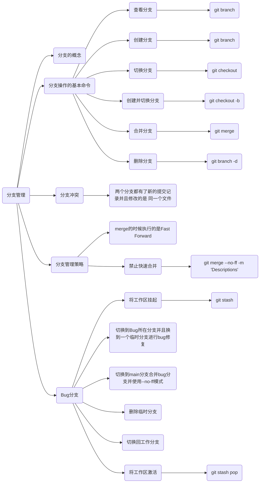

# 6. 分支管理

## 6.1 分支的介绍

分支就像是科幻电影中的平行宇宙一样。当我们专注于在电脑前努力学习 Git 的同时，另一个版本的我们则努力学习着 Deep Learning，仿佛存在于另一个平行宇宙中。这两个平行宇宙互不干扰，对我们当前的现实生活也没有什么实质性影响。然而，在某个时间点，这两个平行宇宙合并了，结果是我们既学会了 Git，又学会了 Deep Learning！

那么在实际应用中，分支有什么作用呢？假设我们计划开发一个新的功能，但需要花费两周的时间来完成。在第一周，我们完成了 50% 的代码编写工作。如果立即将这些代码提交，由于代码尚未完整，其他人将无法继续工作。然而，如果等到所有代码都完成后再进行一次性提交，这样做可能会面临丢失每天进展的巨大风险。

现在有了分支，我们就不必担心了。我们可以创建一个属于自己的分支，其他人看不到，而他们可以继续在原有的分支上进行正常工作。而我们则可以在自己的分支上进行开发，按照进度自由提交代码。直到开发完毕后，再将我们的分支一次性合并到原有分支中。这样既保证了安全性，又不会影响其他人的工作进程。


## 6.2 创建和融合分支

Git 将我们以前每次提交的版本串联成一条时间线，这条时间线就是一个分支。目前，我们只有一条时间线，在 Git 中称为主分支，即 main 分支。严格来说，HEAD 并不指向提交本身，而是指向 main 分支，而 main 分支才是指向提交的。因此，<font color='blue'><b>HEAD 指向的是当前的分支</b></font>。

> main 分支等价于 master 分支

一开始的时候，main 分支是一条线，**Git 用 main 指向最新的提交，再用 HEAD 指向 main**，就能确定当前分支，以及当前分支的提交点：

<a></a>
<div align=center>
    
    <center></center>
</div></br>

每次提交，main 分支都会向前移动一步，这样，随着我们不断提交，main 分支的线也越来越长。

当我们创建新的分支，例如 `dev` 时，Git 新建了一个指针叫 `dev`，**指向 main 相同的提交，再把 HEAD 指向 dev**，就表示当前分支在 dev 上：

<a></a>
<div align=center>
    
    <center></center>
</div></br>

Git 创建一个分支很快，因为除了增加一个 dev 指针，改变 HEAD 的指向，工作区的文件都没有任何变化。

> dev: develop，开发

不过从现在开始，对工作区的修改和提交就是针对 dev 分支了，比如新提交一次后，dev 指针往前移动一步，**而 main 指针不变**：

<a></a>
<div align=center>
    
    <center></center>
</div></br>

假如我们在 `dev` 上的工作完成了，就可以把 dev 合并到 main 上。Git怎么合并呢？最简单的方法就是：直接把 main 指向 dev 的当前提交，就完成了合并：

<a></a>
<div align=center>
    
    <center></center>
</div></br>

Git 合并分支也很快，就改改指针，工作区内容也不变。

合并完分支后，**甚至可以删除 dev 分支**。删除 dev 分支就是把 dev 指针给删掉，删掉后，我们就剩下了一条 main 分支：

<a></a>
<div align=center>
    
    <center></center>
</div></br>

## 6.3 例子

执行如下命令可以查看当前有几个分支并且看到在哪个分支下工作。

```bash
git branch
```

<a></a>
<div align=center>
    
    <center></center>
</div></br>


下面创建一个 dev 分支并切换到其上进行工作。

```bash
git checkout -b dev
```

> 其中，`-b` 表示创建分支。

<a></a>
<div align=center>
    
    <center></center>
</div></br>

<a></a>
<div align=center>
    
    <center></center>
</div></br>

---

<kbd><b>Question</b></kbd>：介绍一下 Git 中的 checkout。

<kbd><b>Answer</b></kbd>：在 Git 中，`checkout` 用于切换到不同的分支或恢复文件的状态。它有几个常见的用途：

 - 切换分支：使用 `git checkout <branch>` 可以切换到指定的分支，将HEAD指向该分支，并更新工作目录中的文件以反映该分支的内容。
 - 恢复文件：使用 `git checkout -- <file>` 可以将指定文件恢复到最近一次提交的状态，丢弃在工作目录中对文件的修改。
 - 创建分支：使用 `git checkout -b <new-branch>` 可以创建一个新分支并切换到该分支。

总结来说，`checkout` 用于切换分支、恢复文件或创建分支，而 `commit` 用于将更改保存为提交。

---

下面我们修改 `code.py` 内容，在里面添加一行，并进行提交。

<a></a>
<div align=center>
    
    <center></center>
</div></br>

<a></a>
<div align=center>
    
    <center></center>
</div></br>

dev 分支的工作完成，我们就可以切换回 main 分支：

```bash
git checkout main
```

> ⚠️  注意：不要加 `-b`，因为 `-b` 表示创建分支，我们的 main 分支是存在的。如果添加了 `-b`，那么会发生语法错误。

<a></a>
<div align=center>
    
    <center></center>
</div></br>

<a></a>
<div align=center>
    
    <center></center>
</div></br>

查看 `code.py`，发现**添加的内容没有了**。因为那个提交是在 dev 分支上，而 main 分支此刻的提交点并没有变：

<a></a>
<div align=center>
    
    <center></center>
</div></br>

现在，我们把 dev 分支的工作成果合并到 main 分支上：

```bash
git merge dev
```

<a></a>
<div align=center>
    
    <center></center>
</div></br>

`git merge` 命令用于**合并指定分支到当前分支**。合并后，再查看 `code.py` 的内容，就可以看到，main 分支和 dev 分支的最新提交是完全一样的。

<a></a>
<div align=center>
    
    <center></center>
</div></br>

注意到上面的 `Fast-forward` 信息，Git 告诉我们，这次合并是“快进模式”，也就是直接把 `main` 指向 `dev` 的当前提交，所以合并速度非常快。

<a></a>
<div align=center>
    
    <center></center>
</div></br>

<a></a>
<div align=center>
    
    <center></center>
</div></br>

合并完成后，就可以放心地删除 dev 分支了，删除后查看 branch，就只剩下 main 分支了。

```bash
git branch -d dev
```

> `-d`: delete

<a></a>
<div align=center>
    
    <center></center>
</div></br>

<a></a>
<div align=center>
    
    <center></center>
</div></br>

<font color='blue'><b>总结</b></font>:

| 命令 | 作用 |
|:- |:- |
| `git branch` | 查看分支 |
| `git branch <name>` | 创建分支 |
| `git checkout <name>` | 切换分支 |
| `git checkout -b <name>` | 创建+切换分支 |
| `git merge <name>` | 合并某分支到当前分支 |
| `git branch -d <name>` | 删除某分支 |

## 6.4 解决冲突

合并分支往往也不是一帆风顺的。我们举个例子：

1. 创建一个新分支 dev。
2. 修改 `code.py` 内容，并进行提交。
3. 切换回 main 分支
4. 在 main 的 `code.py` 添加一行内容并进行提交。

<a></a>
<div align=center>
    
    <center></center>
</div></br>

现在，main 分支和 dev 分支各自都分别有新的提交，变成了这样：

<a></a>
<div align=center>
    
    <center></center>
</div></br>

这种情况下，Git 无法执行“快速合并”，只能试图把各自的修改合并起来，但这种**合并就可能会有冲突**。

执行如下命令尝试将 dev 分支合并到 main 分支上来。

<a></a>
<div align=center>
    
    <center></center>
</div></br>

Git 告诉我们，`code.py` 文件存在冲突，必须手动解决冲突后再提交。

使用 `git status` 命令也可以告诉我们冲突的文件：

<a></a>
<div align=center>
    
    <center></center>
</div></br>

查看 `code.py` 的内容:

<a></a>
<div align=center>
    
    <center></center>
</div></br>


Git用 `<<<<<<<`、`=======`、`>>>>>>>` 标记出不同分支的内容，我们修改如下后保存：

<a></a>
<div align=center>
    
    <center></center>
</div></br>

我们再次提交：

<a></a>
<div align=center>
    
    <center></center>
</div></br>

现在，main 分支和 dev 分支变成了下图所示：

<a></a>
<div align=center>
    
    <center></center>
</div></br>


用带参数的 `git log` 也可以看到分支的合并情况：

<a></a>
<div align=center>
    
    <center></center>
</div></br>

最后工作完成，可以删除 dev 分支。

<a></a>
<div align=center>
    
    <center></center>
</div></br>

<font color='blue'><b>总结</b></font>:

+ 出现冲突的原因：在两个分支上都有了提交且都编辑了同一个文件

## 6.5 管理分支的策略

通常，在合并分支时，如果可能的话，Git 会使用快进（fast-forward）模式。但有时快进合并无法成功，尽管合并过程中没有冲突。在这种情况下，Git 将执行一次新的提交来完成合并。然而，需要注意的是，在这种模式下，**删除分支后将丢失分支的信息**。

1. 创建切换到 dev 分支下。

```bash
git checkout -b dev
```

2. 新建一个文件 `code3.py` 编辑内容如下，并提交一个commit。

```bash
# 创建文件
touch code3.py

# 使用 gedit 编辑文件
gedit code3.py

# 查看文件内容
cat code3.py

# add
git add code3.py

# commit
git commit -m "dev create & modifies code.py"
```

<a></a>
<div align=center>
    
    <center></center>
</div></br>

3. 切换回 main 分支，编辑 `code.py` 并进行一个提交。

```bash
# 切换分支（不要加 -b）
git checkout main

# 编辑文件
gedit code.py

# add
git add code.py

# commit
git commit -m "main add a new line in code.py"
```

<a></a>
<div align=center>
    
    <center></center>
</div></br>

3. 合并 dev 分支的内容到 main 分支。

```bash
git merge dev
```
	
出现如下提示，这是因为这次**不能进行快速合并(虽然没有冲突)**，所以 Git 提示输入合并说明信息，输入之后合并内容之后 Git 会自动创建一次新的提交。

<a></a>
<div align=center>
    
    <center></center>
</div></br>

此时，写入说明信息后就完成合并了。

<a></a>
<div align=center>
    
    <center></center>
</div></br>

我们使用分支命令查看分支信息。

```bash
git log --pretty=oneline
```

<a></a>
<div align=center>
    
    <center></center>
</div></br>

当合并完毕后，我们可以删除 dev 分支：

```bash
git branch -d dev
```

<a></a>
<div align=center>
    
    <center></center>
</div></br>

> 💡  删除 dev 分支并不是必须的！

### 6.5.1 禁用快速合并

如果要强制禁用 `fast forward` 模式，Git 就会在 merge 时生成一个新的 commit，这样从分支历史上就可以看出分支信息。具体操作如下：

1. 创建并切换到 dev 分支。

```bash
git checkout -b dev
```

> 💡  OBS：因为我们刚刚删掉了 dev 分支，所以这里要加参数 `-b`，如果我们刚才没有删除 dev 分支，那么就不用加 `-b` 参数了。

2. 修改 `code.py` 内容，并提交一个 commit。

```bash
# 编辑文件
gedit code.py

# add
git add code.py

# commit
git commit -m "dev add a new line again"
```

<a></a>
<div align=center>
    
    <center></center>
</div></br>

3. 切换回 main 分支

```bash
checkout main
```

3. 准备合并 dev 分支：

```bash
git merge dev --no-ff -m "ban Fast-Forward and merge dev into main"
```

<a></a>
<div align=center>
    
    <center></center>
</div></br>

💡  OBS：
1. `--no-ff` 参数表示禁用 `Fast forward`
2. 因为本次合并要创建一个新的 commit，所以加上 `-m` 参数，把 commit 描述写进去。

4. 合并后，我们可以用 `git log` 查看分支历史：

```bash
git log --graph --pretty=oneline
```

<a></a>
<div align=center>
    
    <center></center>
</div></br>

可以看到，不使用 Fast forward 模式，merge 后就像这样：

<a></a>
<div align=center>
    
    <center></center>
</div></br>


## 6.6 Bug 分支（Bug Branch）

软件开发中，bug 就像家常便饭一样，有了 bug 就需要修复。在 Git 中，由于管理不同的分支非常方便，因此<font color='blue'><b>每个 bug 都可以通过一个新的临时分支来修复，修复后，合并分支，然后将临时分支删除</b></font>。我们举个例子：

当我们接到一个修复一个代号 001 的 bug 的任务时，很自然地，我们想创建一个分支 bug-001 来修复它，但是，我们一般是在工作的情况下接到这些任务，所以当前正在 dev 上进行的工作还没有提交 (ಥ﹏ಥ)。并不是我们不想提交，而是工作只进行到一半，还没法提交，预计完成还需 1 天时间。但是，必须在两个小时内修复该 bug，怎么办？

考虑到这种情况，Git 还提供了一个 `stash` 功能，可以把当前工作现场“储藏”起来，等以后恢复现场后继续工作。

> stash 英`[stæʃ]`美`[stæʃ]` vt.藏匿;隐藏;存放;贮藏; n. 一批贮藏物;

<a></a>
<div align=center>
    
    <center></center>
</div></br>

首先确定要在哪个分支上修复 bug，假定需要在 main 分支上修复，就从 main 创建临时分支：

```bash
git checkout -b bug-001
```

<a></a>
<div align=center>
    
    <center></center>
</div></br>

现在修复 bug，把 `the new line` 删掉，然后提交。

```bash
# 修改文件
gedit code.py

# add
git add colde.py

# commit
git commit -m "bug-001 has been fixed"
```

<a></a>
<div align=center>
    
    <center></center>
</div></br>

修复完成后，切换到 main 分支，并完成合并（为了保存修复 bug 的合并记录，我们禁止 ff），最后删除 bug-001 分支。

```bash
# 切换分支
git checkout main

# 融合分支
git merge bug-001 --no-ff -m "fix bug-001"
```

<a></a>
<div align=center>
    
    <center></center>
</div></br>

```bash
# 删除 bug-001 分支
git branch -d bug-001

# 查看 log
git log --pretty=oneline --graph
```

<a></a>
<div align=center>
    
    <center></center>
</div></br>

现在 bug-001 修复完成，是时候接着回到 dev 分支干活了！

```bash
# 切换分支
git checkout dev

# 查看分支的状态
git status
```

<a></a>
<div align=center>
    
    <center></center>
</div></br>

我们发现，dev 分支的工作区是干净的，刚才的工作现场存到哪去了？用 `git stash list` 命令看看：

```bash
git stash list
```

<a></a>
<div align=center>
    
    <center></center>
</div></br>

我们发现，工作现场还在，Git 把 stash 内容存在某个地方了，但是需要恢复一下。

```bash
git stash pop
```

<a></a>
<div align=center>
    
    <center></center>
</div></br>

继续完成我们刚才 stash 的工作。

<a></a>
<div align=center>
    
    <center></center>
</div></br>

<font color='blue'><b>总结</b></font>:

1. 修复 bug 时，我们会通过创建新的 bug 分支进行修复，然后合并，最后删除。
2. 当手头工作没有完成时，先把工作现场 `git stash` 一下，然后去修复 bug，修复后，再 `git stash pop`，恢复工作现场。

# 7. 小结



