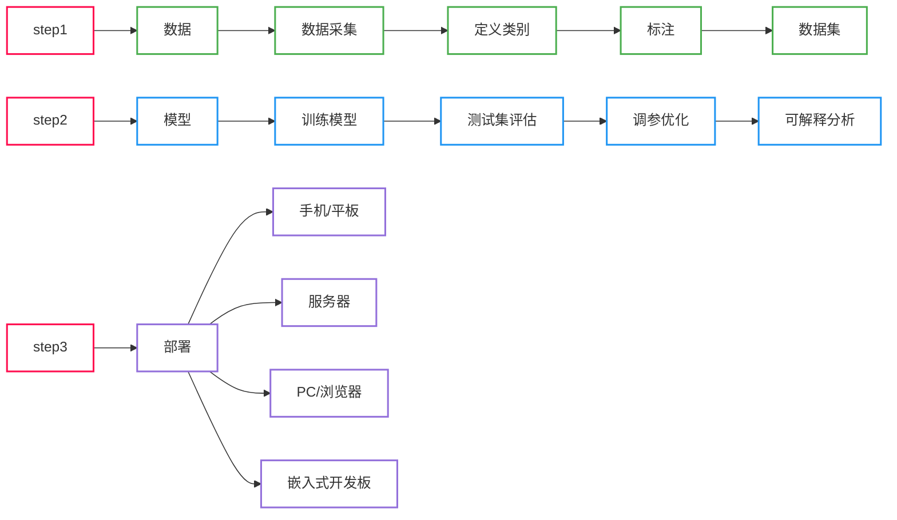
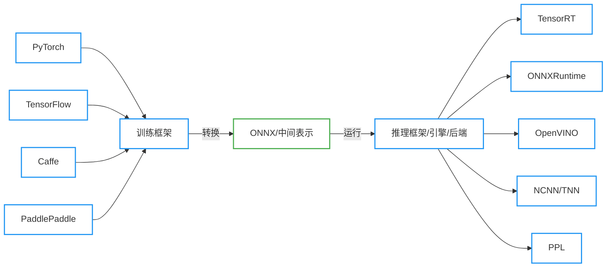

# 1. 图像分类模型部署: PyTorch -> ONNX

## 1.1 模型部署介绍

### 1.1.1 人工智能开发部署全流程



### 1.1.2 模型部署平台和芯片介绍

- **设备**：PC、浏览器、APP、小程序、服务器、嵌入式开发板、无人车、无人机、Jetson Nano、树莓派、机械臂、物联网设备
- **厂商**：
  - 英特尔（Intel）：主要生产 CPU（中央处理器）和一些 FPGA（现场可编程门阵列）芯片。代表作品包括 Intel Core 系列 CPU 和 Xeon 系列服务器 CPU，以及 FPGA 产品如 Intel Stratix 系列。
  - 英伟达（NVIDIA）：以 GPU（图形处理器）为主打产品，广泛应用于图形渲染、深度学习等领域。代表作品包括 NVIDIA GeForce 系列用于游戏图形处理，NVIDIA Tesla 和 NVIDIA A100 用于深度学习加速。
  - AMD：主要生产 CPU 和 GPU。代表作品包括 AMD Ryzen 系列 CPU 和 AMD EPYC 系列服务器 CPU，以及 AMD Radeon 系列 GPU 用于游戏和专业图形处理。
  - 苹果（Apple）：生产自家设计的芯片，主要包括苹果 M 系列芯片。代表作品有 M1 芯片，广泛应用于苹果的 Mac 电脑、iPad 和一些其他设备。
  - 高通（Qualcomm）：主要生产移动平台芯片，包括移动处理器和调制解调器。代表作品包括 Snapdragon 系列芯片，用于智能手机和移动设备。
  - 昇腾（Ascend）：由华为生产，主要生产 NPU（神经网络处理器），用于深度学习任务。代表作品包括昇腾 910 和昇腾 310。
  - 麒麟（Kirin）：同样由华为生产，主要生产手机芯片，包括 CPU 和 GPU。代表作品包括麒麟 9000 系列，用于华为旗舰手机。
  - 瑞芯微（Rockchip）：主要生产 VPU（视觉处理器）和一些移动平台芯片。代表作品包括 RK3288 和 RK3399，广泛应用于智能显示、机器人等领域。

|芯片名|英文名|中文名|厂商|主要任务|是否训练|是否推理|算力|速度|
|:-|:-|:-|:-|:-|:-|:-|:-|:-|
|CPU|Central Processing Unit(CPU)|中央处理器|各大厂商|通用计算|是|是|高|中等|
|GPU|Graphics Processing Unit(GPU)|图形处理器|NVIDIA、AMD等|图形渲染、深度学习加速|是|是|高|高|
|TPU|Tensor Processing Unit(TPU)|张量处理器|谷歌|机器学习中的张量运算|是|是|高|高|
|NPU|Neural Processing Unit(NPU)|神经网络处理器|华为、联发科等|深度学习模型的性能提升|是|是|高|中等|
|VPU|Vision Processing Unit(VPU)|视觉处理器|英特尔、博通等|图像和视频处理|否|是|中等|中等|
|DSP|Digital Signal Processor(DSP)|数字信号处理器|德州仪器、高通等|数字信号处理、音频信号处理|否|是|中等|中等|
|FPGA|Field-Programmable Gate Array(FPGA)|现场可编程门阵列|英特尔、赛灵思等|可编程硬件加速器|是|是|高|中等|

### 1.1.3 模型部署的通用流程



## 1.2 使用 ONNX 的意义

<div align=center>
    
</div>

<div align=center>
    
</div>

从这两张图可以很明显的看到，当有了中间表示 ONNX 后，从原来的 $M \times N$ 变为了 $M + N$，让模型部署的流程变得简单。

## 1.3 ONNX 的介绍

开源机器学习<font color='blue'>通用中间格式</font>，由微软、Facebook（Meta）、亚马逊、IBM 共同发起的。<font color='green'>它可以兼容各种深度学习框架，也可以兼容各种推理引擎和终端硬件、操作系统</font>。

## 1.4 ONNX 环境安装

```bash
pip install onnx -i https://pypi.tuna.tsinghua.edu.cn/simple
pip install onnxruntime -i https://pypi.tuna.tsinghua.edu.cn/simple
```

## 1.5 将一个分类模型转换为 ONNX

```python
import torch
from torchvision import models


device = torch.device('cuda:0' if torch.cuda.is_available() else 'cpu')
print(f"正在使用的设备: {device}")

# 创建一个训练好的模型
model = models.resnet18(pretrained=True)  # ImageNet 预训练权重
model = model.eval().to(device)

# 构建一个输入
dummy_input = torch.randn(size=[1, 3, 256, 256]).to(device)  # [N, B, H, W]

# 让模型推理
output = model(dummy_input)
print(f"output.shape: {output.shape}")

# 使用 PyTorch 自带的函数将模型转换为 ONNX 格式
onnx_save_path = 'ONNX/saves/resnet18_imagenet.onnx'  # 导出的ONNX模型路径 
with torch.no_grad():
    torch.onnx.export(
        model=model,                            # 要转换的模型
        args=dummy_input,                       # 模型的输入
        f=onnx_save_path,                       # 导出的ONNX模型路径 
        input_names=['input'],                  # ONNX模型输入的名字(自定义)
        output_names=['output'],                # ONNX模型输出的名字(自定义)
        opset_version=11,                       # Opset算子集合的版本（默认为17）
    )
    
print(f"ONNX 模型导出成功，路径为：{onnx_save_path}")
```

```
正在使用的设备: cpu
/home/leovin/anaconda3/envs/wsl/lib/python3.8/site-packages/torchvision/models/_utils.py:208: UserWarning: The parameter 'pretrained' is deprecated since 0.13 and may be removed in the future, please use 'weights' instead.
  warnings.warn(
/home/leovin/anaconda3/envs/wsl/lib/python3.8/site-packages/torchvision/models/_utils.py:223: UserWarning: Arguments other than a weight enum or `None` for 'weights' are deprecated since 0.13 and may be removed in the future. The current behavior is equivalent to passing `weights=ResNet18_Weights.IMAGENET1K_V1`. You can also use `weights=ResNet18_Weights.DEFAULT` to get the most up-to-date weights.
  warnings.warn(msg)
Downloading: "https://download.pytorch.org/models/resnet18-f37072fd.pth" to /home/leovin/.cache/torch/hub/checkpoints/resnet18-f37072fd.pth
100%|█████████████████████████████████████████████████████████████████████████████████████████████████████| 44.7M/44.7M [00:03<00:00, 13.9MB/s]
output.shape: torch.Size([1, 1000])
ONNX 模型导出成功，路径为：ONNX/saves/resnet18_imagenet.onnx
```

💡 <kbd>Tips</kbd>:
1. opset 算子集不同版本区别: [Operators.md](https://github.com/onnx/onnx/blob/main/docs/Operators.md)
2. 虽然说 PyTorch 在提醒 `pretrained=True` 将会被弃用，可以使用 `weights=weights=ResNet18_Weights.DEFAULT` 或 `weights=ResNet18_Weights.IMAGENET1K_V1` 来代替。但很明显前者比较方便，后者还需要查看对应的版本号，比较麻烦 :joy:

接下来我们使用 Netron 查看一下这个模型：

<div align=center>
    
</div>

> 1. 原图链接为：[resnet18_imagenet.png](https://github.com/Le0v1n/Learning-Notebook-Codes/blob/main/ONNX/imgs_markdown/resnet18_imagenet.png)
> 2. ImageNet 数据集有 1000 个类别

## 1.6 检查一个模型导出是否正确

```python
import onnx


# 读取导出的模型
onnx_path = 'ONNX/saves/resnet18_imagenet.onnx'  # 导出的ONNX模型路径
onnx_model = onnx.load(onnx_path)

# 检查模型是否正常
onnx.checker.check_model(onnx_model)

print(f"模型导出正常!")
```

```
模型导出正常!
```

> 我们在《onnx基础》中已经讲过 `check_model()` 这个函数，它可以检查 ONNX 模型，如果该函数发现模型错误，则会抛出异常，

## 1.7 修改动态维度

前面我们导出的 ONNX 模型中，输入的维度是固定的：`[1, 3, 256, 256]`，那么此时这个 ONNX 的输入就被限制了：
- 如果我们想要多 Batch 的输入 → 不行
- 如果我们输入的图片是灰度图 → 不行
- 如果我们输入的图片尺寸不是 256×256 → 不行

而 `torch.onnx.export()` 这个函数也帮我解决了这个问题，它有一个名为 `dynamic_axis` 的参数，我们看一下官网对该参数的描述：

> dynamic_axes (*dict[string, dict[int, string]] or dict[string, list(int)], default empty dict*) –
> 
> By default the exported model will have the shapes of all input and output tensors set to exactly match those given in `args`. To specify axes of tensors as dynamic (i.e. known only at run-time), set `dynamic_axes` to a dict with schema:
> - **KEY (str)**: an input or output name. Each name must also be provided in input_names or output_names.
> - **VALUE (dict or list)**: If a dict, keys are axis indices and values are axis names. If a list, each element is an axis index.

> dynamic_axes（*dict[string, dict[int, string]]或dict[string, list(int)]，默认为空字典*）–
> 
> 默认情况下，导出的模型将使所有输入和输出张量的形状完全匹配`args`中给定的形状。要将张量的轴指定为动态（<font color='green'>即仅在运行时知道</font>），请将`dynamic_axes`设置为一个具有以下结构的字典：
> - **KEY（str）**：输入或输出的名称。每个名称还必须在 `input_names` 或 `output_names` 中提供。
> - **VALUE（dict或list）**：如果是字典，则键是轴索引，值是轴名称。如果是列表，则每个元素是轴索引。

下面我们用一下这个参数：

```python
import torch
from torchvision import models
import onnx


device = torch.device('cuda:0' if torch.cuda.is_available() else 'cpu')
print(f"正在使用的设备: {device}")

# 创建一个训练好的模型
model = models.resnet18(pretrained=True)  # ImageNet 预训练权重
model = model.eval().to(device)

# 构建一个输入
dummy_input = torch.randn(size=[1, 3, 256, 256]).to(device)  # [N, B, H, W]

# 让模型推理
output = model(dummy_input)
print(f"output.shape: {output.shape}\n")

# ------ 使用 PyTorch 自带的函数将模型转换为 ONNX 格式
onnx_save_path = 'ONNX/saves/resnet18_imagenet-with_dynamic_axis.onnx'  # 导出的ONNX模型路径 
with torch.no_grad():
    torch.onnx.export(
        model=model,                            # 要转换的模型
        args=dummy_input,                       # 模型的输入
        f=onnx_save_path,                       # 导出的ONNX模型路径 
        input_names=['input'],                  # ONNX模型输入的名字(自定义)
        output_names=['output'],                # ONNX模型输出的名字(自定义)
        opset_version=11,                       # Opset算子集合的版本（默认为17）
        dynamic_axes={                          # 修改某一个维度为动态
            'input': {0: 'B', 2: 'H', 3: 'W'}   # 将原本的 [1, 3, 256, 256] 修改为 [B, 3, H, W]
        }
    )
    
print(f"ONNX 模型导出成功，路径为：{onnx_save_path}\n")

# ------ 验证导出的模型是否正确
# 读取导出的模型
onnx_model = onnx.load(onnx_save_path)

# 检查模型是否正常
onnx.checker.check_model(onnx_model)

print(f"模型导出正常!")
```

```
正在使用的设备: cpu
output.shape: torch.Size([1, 1000])

ONNX 模型导出成功，路径为：ONNX/saves/resnet18_imagenet-with_dynamic_axis.onnx

模型导出正常!
```

此时我们再用 Netron 看一下这个模型：

<div align=center>
    
</div>

可以看到，输入的 Batch、Height、Width 均变为了动态维度，<font color='green'>即只有当模型运行的时候才知道输入的这三个维度具体的值</font>。

## 1.8 ONNX Runtime 部署：推理单张图片

```python
import os
import random
import numpy as np
from PIL import Image
import onnxruntime
from torchvision import transforms
import torch
import torch.nn.functional as F
import pandas as pd


# ==================================== 加载 ONNX 模型，创建推理会话 ==================================== 
ort_session = onnxruntime.InferenceSession(path_or_bytes='ONNX/saves/resnet18_imagenet-fix_axis.onnx')  # ort -> onnxruntime

# ==================================== 模型冷启动 ==================================== 
dummy_input = np.random.randn(1, 3, 256, 256).astype(np.float32)
ort_inputs = {'input': dummy_input}
ort_output = ort_session.run(output_names=['output'], input_feed=ort_inputs)[0]  # 输出被[]包围了，所以需要取出来
print(f"模型冷启动完毕! 其推理结果的shape为: {ort_output.shape}")

# ==================================== 加载真正的图像 ==================================== 
images_folder = 'Datasets/Web/images'
images_list = [os.path.join(images_folder, img) for img in os.listdir(images_folder) if img.lower().endswith(('.jpg', '.png', '.webp'))]

img_path = images_list[random.randint(0, len(images_list)-1)]
img = Image.open(fp=img_path)

# ==================================== 图像预处理 ==================================== 
# 定义预处理函数
img_transform = transforms.Compose([
    transforms.Resize(256),
    transforms.CenterCrop(256),
    transforms.ToTensor(),
    transforms.Normalize(
        mean=[0.485, 0.456, 0.406],  # imagenet专用
        std=[0.229, 0.224, 0.225]),  # imagenet专用
])

# 对图片进行预处理
input_img = img_transform(img)
print(f"input_img.type: {type(input_img)}")
print(f"input_img.shape: {input_img.shape}")

# 为图片添加batch维度
input_img = torch.unsqueeze(input_img, dim=0)

# ==================================== ONNX模型推理 ==================================== 
# 因为ONNXRuntime需要的是numpy而非torch的tensor, 所以将其转换为numpy
input_img = input_img.numpy()
print(f"input_img.type: {type(input_img)}")
print(f"input_img.shape: {input_img.shape}")

# 模型推理图片
ort_inputs = {'input': input_img, }
ort_results = ort_session.run(output_names=['output'], input_feed=ort_inputs)[0]  # 得到 1000 个类别的分数
print(f"模型推理完毕! 此时结果的shape为：{ort_results.shape}")

# ==================================== 后处理 ==================================== 
# 使用 softmax 函数将分数转换为概率
ort_results_softmax = F.softmax(input=torch.from_numpy(ort_results), dim=1)
print(f"经过softmax后的输出的shape为：{ort_results_softmax.shape}")

# 取概率最大的前 n 个结果
n = 3
top_n = torch.topk(input=ort_results_softmax, k=n)

probs = top_n.values.numpy()[0]
indices = top_n.indices.numpy()[0]

print(f"置信度最高的前{n}个结果为：\t{probs}\n"
      f"对应的类别索引为：\t\t{indices}")

# ==================================== 显示类别 ==================================== 
df = pd.read_csv('Datasets/imagenet_classes_indices.csv')

idx2labels = {}
for idx, row in df.iterrows():
    # idx2labels[row['ID']] = row['class']  # 英文标签
    idx2labels[row['ID']] = row['Chinese']  # 中文标签

print(f"=============== 推理结果 ===============\n"
      f"图片路径: {img_path}")
for i, (class_prob, idx) in enumerate(zip(probs, indices)):
    class_name = idx2labels[idx]
    text = f"\tNo.{i}: {class_name:<30} --> {class_prob:>.4f}"
    print(text)
```

```
模型冷启动完毕! 其推理结果的shape为: (1, 1000)
input_img.type: <class 'torch.Tensor'>
input_img.shape: torch.Size([3, 256, 256])
input_img.type: <class 'numpy.ndarray'>
input_img.shape: (1, 3, 256, 256)
模型推理完毕! 此时结果的shape为：(1, 1000)
经过softmax后的输出的shape为：torch.Size([1, 1000])
置信度最高的前3个结果为：       [9.9472505e-01 7.4335985e-04 5.2123831e-04]
对应的类别索引为：              [673 662 487]
=============== 推理结果 ===============
图片路径: Datasets/Web/images/mouse.jpg
        No.0: 鼠标,电脑鼠标                        --> 0.9947
        No.1: 调制解调器                          --> 0.0007
        No.2: 移动电话,手机                        --> 0.0005
```

> 💡 图片链接：[Web/images](https://github.com/Le0v1n/Learning-Notebook-Codes/tree/main/Datasets/Web/images)
> 💡 ImageNet 类别文件链接：[imagenet_classes_indices.csv](https://github.com/Le0v1n/Learning-Notebook-Codes/tree/main/Datasets/imagenet_classes_indices.csv)

## 1.9 ONNX Runtime 和 PyTorch 速度对比

1. 不同尺度下单张图片推理 --> [对比代码链接]()
2. 不同尺度下多张图片推理 --> [对比代码链接]()

**实验环境**：
- CPU：Intel i7-7700 @ 3.60GHz
- Memory: 8 x 2 = 16GB
- Disk: SSD
- OS: Windows 10 (WSL)
- Device: CPU
- 模型推理次数: 50

**实验结果**

|Input Shape|ONNX(固定维度)|ONNX(固定维度+简化)|ONNX(动态维度)|ONNX(动态维度+简化)|PyTorch|
|:-|:-|:-|:-|:-|:-|
|[1, 3, 32, 32]      |0.0658s|0.0679s|0.0669s|0.0667s|0.0740s |
|[1, 3, 64, 64]      |0.0683s|0.0701s|0.0684s|0.0694s|0.0734s |
|[1, 3, 128, 128]    |0.0747s|0.0728s|0.0732s|0.0755s|0.0784s |
|[1, 3, 256, 256]    |0.0893s|0.0901s|0.0883s|0.0901s|0.1070s |
|[1, 3, 512, 512]    |0.1484s|0.1486s|0.1544s|0.1485s|0.1906s |
|[1, 3, 640, 640]    |0.1983s|0.1947s|0.1946s|0.1935s|0.2561s |
|[1, 3, 768, 768]    |0.2529s|0.2488s|0.2535s|0.2555s|0.3303s |
|[1, 3, 1024, 1024]  |0.3888s|0.3959s|0.4008s|0.3996s|0.5216s |
|[18, 3, 32, 32]     |0.3252s|0.3255s|0.3268s|0.3262s|0.3357s |
|[18, 3, 64, 64]     |0.3468s|0.3509s|0.3504s|0.3554s|0.3653s |
|[18, 3, 128, 128]   |0.4244s|0.4295s|0.4297s|0.4269s|0.4806s |
|[18, 3, 256, 256]   |0.6910s|0.6859s|0.7005s|0.7020s|0.8770s |
|[18, 3, 512, 512]   |1.7164s|1.7125s|1.7420s|1.7531s|3.6240s |
|[18, 3, 640, 640]   |2.4357s|2.4594s|2.4750s|2.5205s|4.3787s |
|[18, 3, 768, 768]   |3.5806s|3.5368s|3.6693s|3.6110s|10.3582s|
|[18, 3, 1024, 1024] |6.0836s|6.1163s|6.2694s|6.3470s|OOM     |

**画图结果**

> ⚠️ 在 `[18, 3, 1024, 1024]` 时，PyTorch 因为内存不足导致无法完成，这里用的是 `[18, 3, 768, 768]` 的数据

<div align=center>
    
</div>

<div align=center>
    
</div>

<div align=center>
    
</div>

可以看到：
- 静态维度和动态维度相差不大
- 在使用 CPU 进行推理时，PyTorch 比 ONNX 要慢（即便当图片尺寸比较小的时候）
- 因为 PyTorch 没有完成 `[18, 3, 1024, 1024]` 的结果，可以说明 PyTorch 在推理时需要的资源比 ONNX 要多


# 知识来源

1. [图像分类模型部署-Pytorch转ONNX](https://www.bilibili.com/video/BV1cM4y187Xc)