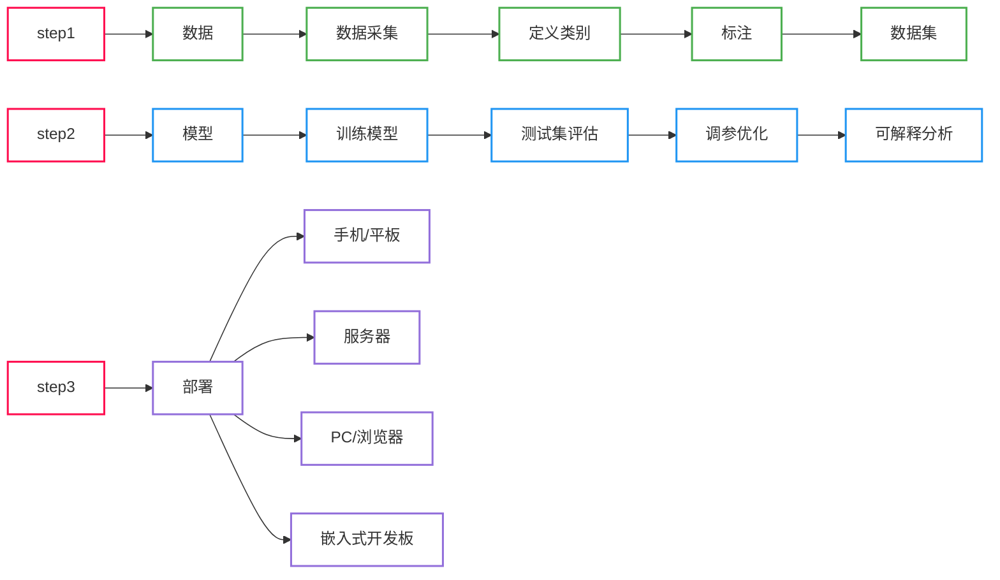
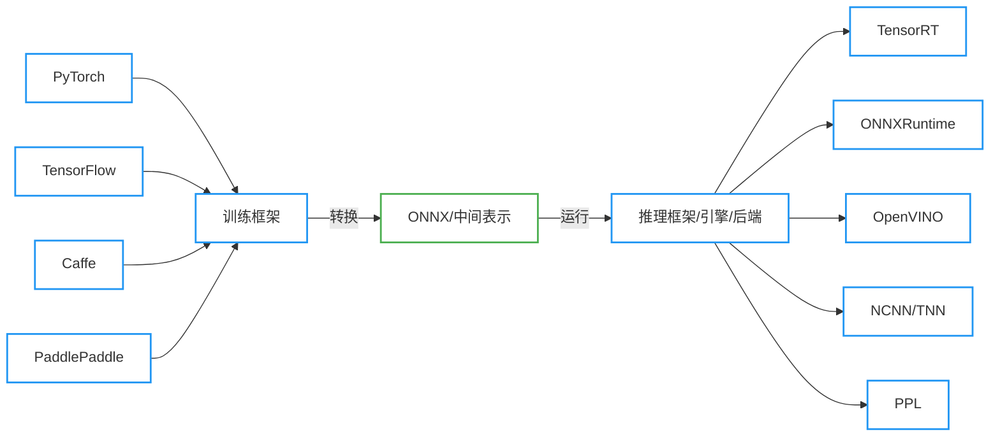

<center><b><font size=12>图像分类模型部署: PyTorch -> ONNX</font></b></center>

# 1. 模型部署介绍

## 1.1 人工智能开发部署全流程

<div align=center>



</div>

## 1.2 模型部署平台和芯片介绍

- **设备**：PC、浏览器、APP、小程序、服务器、嵌入式开发板、无人车、无人机、Jetson Nano、树莓派、机械臂、物联网设备
- **厂商**：
  - 英特尔（Intel）：主要生产 CPU（中央处理器）和一些 FPGA（现场可编程门阵列）芯片。代表作品包括 Intel Core 系列 CPU 和 Xeon 系列服务器 CPU，以及 FPGA 产品如 Intel Stratix 系列。
  - 英伟达（NVIDIA）：以 GPU（图形处理器）为主打产品，广泛应用于图形渲染、深度学习等领域。代表作品包括 NVIDIA GeForce 系列用于游戏图形处理，NVIDIA Tesla 和 NVIDIA A100 用于深度学习加速。
  - AMD：主要生产 CPU 和 GPU。代表作品包括 AMD Ryzen 系列 CPU 和 AMD EPYC 系列服务器 CPU，以及 AMD Radeon 系列 GPU 用于游戏和专业图形处理。
  - 苹果（Apple）：生产自家设计的芯片，主要包括苹果 M 系列芯片。代表作品有 M1 芯片，广泛应用于苹果的 Mac 电脑、iPad 和一些其他设备。
  - 高通（Qualcomm）：主要生产移动平台芯片，包括移动处理器和调制解调器。代表作品包括 Snapdragon 系列芯片，用于智能手机和移动设备。
  - 昇腾（Ascend）：由华为生产，主要生产 NPU（神经网络处理器），用于深度学习任务。代表作品包括昇腾 910 和昇腾 310。
  - 麒麟（Kirin）：同样由华为生产，主要生产手机芯片，包括 CPU 和 GPU。代表作品包括麒麟 9000 系列，用于华为旗舰手机。
  - 瑞芯微（Rockchip）：主要生产 VPU（视觉处理器）和一些移动平台芯片。代表作品包括 RK3288 和 RK3399，广泛应用于智能显示、机器人等领域。

<div align=center>

|芯片名|英文名|中文名|厂商|主要任务|是否训练|是否推理|算力|速度|
|:-|:-|:-|:-|:-|:-|:-|:-|:-|
|CPU|Central Processing Unit(CPU)|中央处理器|各大厂商|通用计算|是|是|高|中等|
|GPU|Graphics Processing Unit(GPU)|图形处理器|NVIDIA、AMD等|图形渲染、深度学习加速|是|是|高|高|
|TPU|Tensor Processing Unit(TPU)|张量处理器|谷歌|机器学习中的张量运算|是|是|高|高|
|NPU|Neural Processing Unit(NPU)|神经网络处理器|华为、联发科等|深度学习模型的性能提升|是|是|高|中等|
|VPU|Vision Processing Unit(VPU)|视觉处理器|英特尔、博通等|图像和视频处理|否|是|中等|中等|
|DSP|Digital Signal Processor(DSP)|数字信号处理器|德州仪器、高通等|数字信号处理、音频信号处理|否|是|中等|中等|
|FPGA|Field-Programmable Gate Array(FPGA)|现场可编程门阵列|英特尔、赛灵思等|可编程硬件加速器|是|是|高|中等|

</div>

## 1.3 模型部署的通用流程

<div align=center>



</div>

# 2. 使用 ONNX 的意义

<div align=center>
    
</div>

<div align=center>
    
</div>

从这两张图可以很明显的看到，当有了中间表示 ONNX 后，从原来的 $M \times N$ 变为了 $M + N$，让模型部署的流程变得简单。

# 3. ONNX 的介绍

开源机器学习<font color='blue'>通用中间格式</font>，由微软、Facebook（Meta）、亚马逊、IBM 共同发起的。<font color='green'>它可以兼容各种深度学习框架，也可以兼容各种推理引擎和终端硬件、操作系统</font>。

# 4. ONNX 环境安装

```bash
pip install onnx -i https://pypi.tuna.tsinghua.edu.cn/simple
pip install onnxruntime -i https://pypi.tuna.tsinghua.edu.cn/simple
```

# 5. PyTorch → ONNX
## 5.1 将一个分类模型转换为 ONNX

```python
import torch
from torchvision import models


device = torch.device('cuda:0' if torch.cuda.is_available() else 'cpu')
print(f"正在使用的设备: {device}")

# 创建一个训练好的模型
model = models.resnet18(pretrained=True)  # ImageNet 预训练权重
model = model.eval().to(device)

# 构建一个输入
dummy_input = torch.randn(size=[1, 3, 256, 256]).to(device)  # [N, B, H, W]

# 让模型推理
output = model(dummy_input)
print(f"output.shape: {output.shape}")

# 使用 PyTorch 自带的函数将模型转换为 ONNX 格式
onnx_save_path = 'ONNX/saves/resnet18_imagenet.onnx'  # 导出的ONNX模型路径 
with torch.no_grad():
    torch.onnx.export(
        model=model,                            # 要转换的模型
        args=dummy_input,                       # 模型的输入
        f=onnx_save_path,                       # 导出的ONNX模型路径 
        input_names=['input'],                  # ONNX模型输入的名字(自定义)
        output_names=['output'],                # ONNX模型输出的名字(自定义)
        opset_version=11,                       # Opset算子集合的版本（默认为17）
    )
    
print(f"ONNX 模型导出成功，路径为：{onnx_save_path}")
```

```
正在使用的设备: cpu
/home/leovin/anaconda3/envs/wsl/lib/python3.8/site-packages/torchvision/models/_utils.py:208: UserWarning: The parameter 'pretrained' is deprecated since 0.13 and may be removed in the future, please use 'weights' instead.
  warnings.warn(
/home/leovin/anaconda3/envs/wsl/lib/python3.8/site-packages/torchvision/models/_utils.py:223: UserWarning: Arguments other than a weight enum or `None` for 'weights' are deprecated since 0.13 and may be removed in the future. The current behavior is equivalent to passing `weights=ResNet18_Weights.IMAGENET1K_V1`. You can also use `weights=ResNet18_Weights.DEFAULT` to get the most up-to-date weights.
  warnings.warn(msg)
Downloading: "https://download.pytorch.org/models/resnet18-f37072fd.pth" to /home/leovin/.cache/torch/hub/checkpoints/resnet18-f37072fd.pth
100%|█████████████████████████████████████████████████████████████████████████████████████████████████████| 44.7M/44.7M [00:03<00:00, 13.9MB/s]
output.shape: torch.Size([1, 1000])
ONNX 模型导出成功，路径为：ONNX/saves/resnet18_imagenet.onnx
```

💡 <kbd>Tips</kbd>:
1. opset 算子集不同版本区别: [Operators.md](https://github.com/onnx/onnx/blob/main/docs/Operators.md)
2. 虽然说 PyTorch 在提醒 `pretrained=True` 将会被弃用，可以使用 `weights=weights=ResNet18_Weights.DEFAULT` 或 `weights=ResNet18_Weights.IMAGENET1K_V1` 来代替。但很明显前者比较方便，后者还需要查看对应的版本号，比较麻烦 :joy:

接下来我们使用 Netron 查看一下这个模型：

<div align=center>
    
</div>

> 1. 原图链接为：[resnet18_imagenet.png](https://github.com/Le0v1n/Learning-Notebook-Codes/blob/main/ONNX/imgs_markdown/resnet18_imagenet.png)
> 
> 2. ImageNet 数据集有 1000 个类别

## 5.2 检查一个模型导出是否正确

```python
import onnx


# 读取导出的模型
onnx_path = 'ONNX/saves/resnet18_imagenet.onnx'  # 导出的ONNX模型路径
onnx_model = onnx.load(onnx_path)

# 检查模型是否正常
onnx.checker.check_model(onnx_model)

print(f"模型导出正常!")
```

```
模型导出正常!
```

> 我们在《[onnx基础](https://blog.csdn.net/weixin_44878336/article/details/135820896)》中已经讲过 `check_model()` 这个函数，它可以检查 ONNX 模型，如果该函数发现模型错误，则会抛出异常，

## 5.3 修改动态维度

前面我们导出的 ONNX 模型中，输入的维度是固定的：`[1, 3, 256, 256]`，那么此时这个 ONNX 的输入就被限制了：
- 如果我们想要多 Batch 的输入 → 不行
- 如果我们输入的图片是灰度图 → 不行
- 如果我们输入的图片尺寸不是 256×256 → 不行

而 `torch.onnx.export()` 这个函数也帮我解决了这个问题，它有一个名为 `dynamic_axis` 的参数，我们看一下官网对该参数的描述：

> dynamic_axes (*dict[string, dict[int, string]] or dict[string, list(int)], default empty dict*) –
> 
> By default the exported model will have the shapes of all input and output tensors set to exactly match those given in `args`. To specify axes of tensors as dynamic (i.e. known only at run-time), set `dynamic_axes` to a dict with schema:
> - **KEY (str)**: an input or output name. Each name must also be provided in input_names or output_names.
> - **VALUE (dict or list)**: If a dict, keys are axis indices and values are axis names. If a list, each element is an axis index.

> dynamic_axes（*dict[string, dict[int, string]]或dict[string, list(int)]，默认为空字典*）–
> 
> 默认情况下，导出的模型将使所有输入和输出张量的形状完全匹配`args`中给定的形状。要将张量的轴指定为动态（<font color='green'>即仅在运行时知道</font>），请将`dynamic_axes`设置为一个具有以下结构的字典：
> - **KEY（str）**：输入或输出的名称。每个名称还必须在 `input_names` 或 `output_names` 中提供。
> - **VALUE（dict或list）**：如果是字典，则键是轴索引，值是轴名称。如果是列表，则每个元素是轴索引。

下面我们用一下这个参数：

```python
import torch
from torchvision import models
import onnx


device = torch.device('cuda:0' if torch.cuda.is_available() else 'cpu')
print(f"正在使用的设备: {device}")

# 创建一个训练好的模型
model = models.resnet18(pretrained=True)  # ImageNet 预训练权重
model = model.eval().to(device)

# 构建一个输入
dummy_input = torch.randn(size=[1, 3, 256, 256]).to(device)  # [N, B, H, W]

# 让模型推理
output = model(dummy_input)
print(f"output.shape: {output.shape}\n")

# ------ 使用 PyTorch 自带的函数将模型转换为 ONNX 格式
onnx_save_path = 'ONNX/saves/resnet18_imagenet-with_dynamic_axis.onnx'  # 导出的ONNX模型路径 
with torch.no_grad():
    torch.onnx.export(
        model=model,                            # 要转换的模型
        args=dummy_input,                       # 模型的输入
        f=onnx_save_path,                       # 导出的ONNX模型路径 
        input_names=['input'],                  # ONNX模型输入的名字(自定义)
        output_names=['output'],                # ONNX模型输出的名字(自定义)
        opset_version=11,                       # Opset算子集合的版本（默认为17）
        dynamic_axes={                          # 修改某一个维度为动态
            'input': {0: 'B', 2: 'H', 3: 'W'}   # 将原本的 [1, 3, 256, 256] 修改为 [B, 3, H, W]
        }
    )
    
print(f"ONNX 模型导出成功，路径为：{onnx_save_path}\n")

# ------ 验证导出的模型是否正确
# 读取导出的模型
onnx_model = onnx.load(onnx_save_path)

# 检查模型是否正常
onnx.checker.check_model(onnx_model)

print(f"模型导出正常!")
```

```
正在使用的设备: cpu
output.shape: torch.Size([1, 1000])

ONNX 模型导出成功，路径为：ONNX/saves/resnet18_imagenet-with_dynamic_axis.onnx

模型导出正常!
```

此时我们再用 Netron 看一下这个模型：

<div align=center>
    
</div>

可以看到，输入的 Batch、Height、Width 均变为了动态维度，<font color='green'>即只有当模型运行的时候才知道输入的这三个维度具体的值</font>。

# 6. ONNX Runtime 部署：推理单张图片

```python
import os
import random
import numpy as np
from PIL import Image
import onnxruntime
from torchvision import transforms
import torch
import torch.nn.functional as F
import pandas as pd


# ==================================== 加载 ONNX 模型，创建推理会话 ==================================== 
ort_session = onnxruntime.InferenceSession(path_or_bytes='ONNX/saves/resnet18_imagenet-fix_axis.onnx')  # ort -> onnxruntime

# ==================================== 模型冷启动 ==================================== 
dummy_input = np.random.randn(1, 3, 256, 256).astype(np.float32)
ort_inputs = {'input': dummy_input}
ort_output = ort_session.run(output_names=['output'], input_feed=ort_inputs)[0]  # 输出被[]包围了，所以需要取出来
print(f"模型冷启动完毕! 其推理结果的shape为: {ort_output.shape}")

# ==================================== 加载真正的图像 ==================================== 
images_folder = 'Datasets/Web/images'
images_list = [os.path.join(images_folder, img) for img in os.listdir(images_folder) if img.lower().endswith(('.jpg', '.png', '.webp'))]

img_path = images_list[random.randint(0, len(images_list)-1)]
img = Image.open(fp=img_path)

# ==================================== 图像预处理 ==================================== 
# 定义预处理函数
img_transform = transforms.Compose([
    transforms.Resize(256),
    transforms.CenterCrop(256),
    transforms.ToTensor(),
    transforms.Normalize(
        mean=[0.485, 0.456, 0.406],  # imagenet专用
        std=[0.229, 0.224, 0.225]),  # imagenet专用
])

# 对图片进行预处理
input_img = img_transform(img)
print(f"input_img.type: {type(input_img)}")
print(f"input_img.shape: {input_img.shape}")

# 为图片添加batch维度
input_img = torch.unsqueeze(input_img, dim=0)

# ==================================== ONNX模型推理 ==================================== 
# 因为ONNXRuntime需要的是numpy而非torch的tensor, 所以将其转换为numpy
input_img = input_img.numpy()
print(f"input_img.type: {type(input_img)}")
print(f"input_img.shape: {input_img.shape}")

# 模型推理图片
ort_inputs = {'input': input_img, }
ort_results = ort_session.run(output_names=['output'], input_feed=ort_inputs)[0]  # 得到 1000 个类别的分数
print(f"模型推理完毕! 此时结果的shape为：{ort_results.shape}")

# ==================================== 后处理 ==================================== 
# 使用 softmax 函数将分数转换为概率
ort_results_softmax = F.softmax(input=torch.from_numpy(ort_results), dim=1)
print(f"经过softmax后的输出的shape为：{ort_results_softmax.shape}")

# 取概率最大的前 n 个结果
n = 3
top_n = torch.topk(input=ort_results_softmax, k=n)

probs = top_n.values.numpy()[0]
indices = top_n.indices.numpy()[0]

print(f"置信度最高的前{n}个结果为：\t{probs}\n"
      f"对应的类别索引为：\t\t{indices}")

# ==================================== 显示类别 ==================================== 
df = pd.read_csv('Datasets/imagenet_classes_indices.csv')

idx2labels = {}
for idx, row in df.iterrows():
    # idx2labels[row['ID']] = row['class']  # 英文标签
    idx2labels[row['ID']] = row['Chinese']  # 中文标签

print(f"=============== 推理结果 ===============\n"
      f"图片路径: {img_path}")
for i, (class_prob, idx) in enumerate(zip(probs, indices)):
    class_name = idx2labels[idx]
    text = f"\tNo.{i}: {class_name:<30} --> {class_prob:>.4f}"
    print(text)
```

```
模型冷启动完毕! 其推理结果的shape为: (1, 1000)
input_img.type: <class 'torch.Tensor'>
input_img.shape: torch.Size([3, 256, 256])
input_img.type: <class 'numpy.ndarray'>
input_img.shape: (1, 3, 256, 256)
模型推理完毕! 此时结果的shape为：(1, 1000)
经过softmax后的输出的shape为：torch.Size([1, 1000])
置信度最高的前3个结果为：       [9.9472505e-01 7.4335985e-04 5.2123831e-04]
对应的类别索引为：              [673 662 487]
=============== 推理结果 ===============
图片路径: Datasets/Web/images/mouse.jpg
        No.0: 鼠标,电脑鼠标                        --> 0.9947
        No.1: 调制解调器                          --> 0.0007
        No.2: 移动电话,手机                        --> 0.0005
```

> 💡 图片链接：[Web/images](https://github.com/Le0v1n/Learning-Notebook-Codes/tree/main/Datasets/Web/images)
> 
> 💡 ImageNet 类别文件链接：[imagenet_classes_indices.csv](https://github.com/Le0v1n/Learning-Notebook-Codes/tree/main/Datasets/imagenet_classes_indices.csv)

# 7. ONNX Runtime 和 PyTorch 速度对比

1. 不同尺度下单张图片推理 --> [对比代码链接](https://github.com/Le0v1n/Learning-Notebook-Codes/tree/main/ONNX/codes/onnx%E5%AE%9E%E6%93%8D/%E9%80%9F%E5%BA%A6%E5%AF%B9%E6%AF%94/No1-%E4%B8%8D%E5%90%8C%E5%B0%BA%E5%BA%A6%E4%B8%8B%E5%8D%95%E5%BC%A0%E5%9B%BE%E7%89%87%E6%8E%A8%E7%90%86)
2. 不同尺度下多张图片推理 --> [对比代码链接](https://github.com/Le0v1n/Learning-Notebook-Codes/tree/main/ONNX/codes/onnx%E5%AE%9E%E6%93%8D/%E9%80%9F%E5%BA%A6%E5%AF%B9%E6%AF%94/No2-%E4%B8%8D%E5%90%8C%E5%B0%BA%E5%BA%A6%E4%B8%8B%E5%A4%9A%E5%BC%A0%E5%9B%BE%E7%89%87%E6%8E%A8%E7%90%86)

**实验环境**：
- CPU：Intel i5-10400F @ 2.90   GHz
- Memory: 8 x 2 = 16GB
- Disk: SSD
- GPU: RTX 3070 O8G
- OS: Windows 10 (WSL)
- Device: CPU
- 模型推理次数: 50

## 7.1 ResNet-18

**实验结果**

<div align=center>

|Input Shape|ONNX(fix)|ONNX(fix+sim)|ONNX(dyn)|ONNX(dyn+sim)|PyTorch(CPU)|PyTorch(GPU)| 
|:-|:-:|:-:|:-:|:-:|:-:|:-:|
|[1, 3, 32, 32]      |0.0577s|0.0597s|0.0592s|0.0585s|0.0688s|0.0787s|
|[1, 3, 64, 64]      |0.0605s|0.0593s|0.0588s|0.0621s|0.0700s|0.0723s|
|[1, 3, 128, 128]    |0.0705s|0.0686s|0.0699s|0.0694s|0.0762s|0.0760s|
|[1, 3, 256, 256]    |0.0784s|0.0811s|0.0797s|0.0789s|0.0949s|0.0813s|
|[1, 3, 512, 512]    |0.1249s|0.1241s|0.1251s|0.1256s|0.1686s|0.0996s|
|[1, 3, 640, 640]    |0.1569s|0.1525s|0.1572s|0.1579s|0.2242s|0.0863s|
|[1, 3, 768, 768]    |0.1986s|0.1946s|0.1985s|0.2038s|0.2933s|0.0956s|
|[1, 3, 1024, 1024]  |0.2954s|0.2957s|0.3094s|0.3045s|0.4871s|0.1047s|
|[16, 3, 32, 32]     |0.2540s|0.2545s|0.2558s|0.2498s|0.2570s|0.2473s|
|[16, 3, 64, 64]     |0.2811s|0.2745s|0.2696s|0.2655s|0.2824s|0.2553s|
|[16, 3, 128, 128]   |0.3595s|0.3181s|0.3143s|0.3544s|0.3817s|0.3518s|
|[16, 3, 256, 256]   |0.7315s|0.7112s|0.6767s|0.6122s|0.7169s|0.3469s|
|[16, 3, 512, 512]   |1.3042s|1.2586s|1.1813s|1.1949s|1.6609s|0.4270s|
|[16, 3, 640, 640]   |1.6340s|1.6429s|1.6659s|1.6693s|2.3923s|0.5292s|
|[16, 3, 768, 768]   |2.2843s|2.2830s|2.3325s|2.3303s|3.9278s|1.7851s|
|[16, 3, 1024, 1024] |3.9132s|3.9742s|3.9668s|3.9104s|6.7532s|3.6507s|

</div>

**画图结果**

> ⚠️ 在 `[18, 3, 768, 768]`、 时，PyTorch(CPU) 因为内存不足导致只能推理 1 次而非 50 次
> 
> ⚠️ 在 `[18, 3, 1024, 1024]`、 时，PyTorch(CPU) 和 PyTorch(GPU) 因为内存不足导致只能推理 1 次而非 50 次

<div align=center>
    
</div>

<div align=center>
    
</div>

<div align=center>
    
</div>

<div align=center>
    
</div>

<kbd>结论</kbd>：
- 〔<font color='green'><b>单 Batch</b></font>〕
    - 静态维度和动态维度相差不大
    - 当图片尺寸在 [32, 32] ~ [256, 256] 之间时，ONNX 速度比 PyTorch-GPU 速度要快；当图片尺寸大于 [256, 256] 时，PyTorch-GPU 拥有绝对的优势
    - 当图片尺寸小于 [64, 64] 时，PyTorch-CPU 速度快于 PyTorch-GPU；当图片尺寸大于 [64, 64] 时，PyTorch-GPU 速度快于 PyTorch-CPU
    - 无论在什么时候，ONNX 速度均快于 PyTorch-CPU
- 〔<font color='blue'><b>多 Batch</b></font>〕
    - 静态维度和动态维度相差不大
    - 当图片尺寸小于 [128, 128] 时，ONNX、PyTorch-CPU、PyTorch-GPU 三者很难有区别（实际上 PyTorch-GPU 速度要慢一些，因为要将模型和输入放到 GPU 中，这部分会划分几秒钟的时间）
    - 当图片尺寸大于 [128, 128] 时，GPU 逐渐扩大优势（由于 OOM 的原因，[18, 3, 1024, 1024] 下 PyTorch-GPU 只推理了一次，因此速度被拉平了很多。在显存足够充裕的情况下，PyTorch-GPU 的速度是碾压其他方法的）
    - 当图片尺寸大于 [256, 256] 时，PyTorch-CPU 的速度远远慢于 ONNX
- 〔<font color='purple'><b>Sim 前后</b></font>〕
    - 可以发现，在使用 `python -m onnxsim` 前后差距不大
- 〔<font color='red'><b>总结</b></font>〕
    - 在使用 CPU 进行推理时，建议使用 ONNX 进行，因为不光速度有优势，而且对内存的占用也比 PyTorch-CPU 要小的多
    - 在进行多 Batch 推理时，如果有 GPU 还是使用 PyTorch-GPU，这样会缩减大量的时间（⚠️ GPU 在加载模型和输入时可能会比较耗时）
    - ⚠️ 在使用 `python -m onnxsim` 前后差距不大

## 7.2 MobileNetV3-Small

接下来我们在 MobileNetV3-Small 上也进行相同的实验。

> ⚠️ 因为 `opset=11` 不支持 `hardsigmoid` 算子，在官网上查询后，我们使用 `opset=17`
> 
> ⚠️ 在使用 `opset=17` 时可能会报错，报错原因一般是当前 PyTorch 版本低导致的，可以创建一个新的环境，使用最新的 PyTorch（也可以不实验，直接看我得结论就行 :joy:）

<div align=center>

|Input Shape|ONNX(fix)|ONNX(dyn)|PyTorch(CPU)|PyTorch(GPU)|
|:-|:-:|:-:|:-:|:-:|
|[1, 3, 32, 32]     |0.0575s|0.0619s|0.0636s|0.0731s|
|[1, 3, 64, 64]     |0.0585s|0.0591s|0.0643s|0.0701s|
|[1, 3, 128, 128]   |0.0611s|0.0597s|0.0629s|0.0700s|
|[1, 3, 256, 256]   |0.0627s|0.0622s|0.0690s|0.0731s|
|[1, 3, 512, 512]   |0.0714s|0.0703s|0.0841s|0.0765s|
|[1, 3, 640, 640]   |0.0776s|0.0785s|0.0975s|0.0823s|
|[1, 3, 768, 768]   |0.0867s|0.0861s|0.1138s|0.0851s|
|[1, 3, 1024, 1024] |0.1103s|0.1126s|0.1630s|0.0958s|
|[16, 3, 32, 32]    |0.2410s|0.2295s|0.2538s|0.2446s|
|[16, 3, 64, 64]    |0.2443s|0.2421s|0.2576s|0.2481s|
|[16, 3, 128, 128]  |0.2618s|0.2576s|0.2804s|0.2727s|
|[16, 3, 256, 256]  |0.3097s|0.3131s|0.3502s|0.3043s|
|[16, 3, 512, 512]  |0.5556s|0.5873s|0.7655s|0.3970s|
|[16, 3, 640, 640]  |0.7191s|0.7130s|0.8988s|0.4877s|
|[16, 3, 768, 768]  |0.9293s|0.9285s|1.5091s|0.5754s|
|[16, 3, 1024, 1024]|1.4768s|1.4945s|3.3530s|1.1316s|

</div>

**画图结果**

> ⚠️ 在 `[18, 3, 1024, 1024]`、 时，PyTorch(CPU) 因为内存不足导致只能推理 1 次而非 50 次

<div align=center>
    
</div>

<div align=center>
    
</div>

<div align=center>
    
</div>

其实可以发现，与 ResNet18 的结论是一致的。

## 7.3 为什么 `python -m onnxsim` 没有效果

我们看一下这个过程：

<font color='green'> <b> -------------- ResNet-18 -------------- </b></font>

```bash
python -m onnxsim ONNX/saves/resnet18-dynamic_dims.onnx ONNX/saves/resnet18-dynamic_dims-sim.onnx
```

```
Simplifying...
Finish! Here is the difference:
┏━━━━━━━━━━━━━━━━━━━┳━━━━━━━━━━━━━━━━┳━━━━━━━━━━━━━━━━━━┓
┃                   ┃ Original Model ┃ Simplified Model ┃
┡━━━━━━━━━━━━━━━━━━━╇━━━━━━━━━━━━━━━━╇━━━━━━━━━━━━━━━━━━┩
│ Add               │ 8              │ 8                │
│ Constant          │ 42             │ 42               │
│ Conv              │ 20             │ 20               │
│ Flatten           │ 1              │ 1                │
│ Gemm              │ 1              │ 1                │
│ GlobalAveragePool │ 1              │ 1                │
│ MaxPool           │ 1              │ 1                │
│ Relu              │ 17             │ 17               │
│ Model Size        │ 44.6MiB        │ 44.6MiB          │
└───────────────────┴────────────────┴──────────────────┘
```

<font color='green'> <b> -------------- MobileNetV3-Small -------------- </b></font>

```bash
python -m onnxsim ONNX/saves/mobilenetv3small-dynamic_dims.onnx ONNX/saves/mobilenetv3small-dynamic_dims-sim.onnx
```

```
Simplifying...
Finish! Here is the difference:
┏━━━━━━━━━━━━━━━━━━━┳━━━━━━━━━━━━━━━━┳━━━━━━━━━━━━━━━━━━┓
┃                   ┃ Original Model ┃ Simplified Model ┃
┡━━━━━━━━━━━━━━━━━━━╇━━━━━━━━━━━━━━━━╇━━━━━━━━━━━━━━━━━━┩
│ Add               │ 6              │ 6                │
│ Constant          │ 108            │ 108              │
│ Conv              │ 52             │ 52               │
│ Flatten           │ 1              │ 1                │
│ Gemm              │ 2              │ 2                │
│ GlobalAveragePool │ 10             │ 10               │
│ HardSigmoid       │ 9              │ 9                │
│ HardSwish         │ 19             │ 19               │
│ Mul               │ 9              │ 9                │
│ Relu              │ 14             │ 14               │
│ Model Size        │ 9.7MiB         │ 9.7MiB           │
└───────────────────┴────────────────┴──────────────────┘
```

可以看到，其实根本没有变化，所以速度也没有提升。

> ⚠️ ONNX 文件变大了可能是因为 `onnxsim` 放了一些东西在模型中，但对模型性能没有影响。

# 8. ONNX 与 PyTorch 精度对比

我们现在有如下的模型：

- `weights.pth`: PyTorch 权重
- `weights.onnx`: ONNX 权重
- `weights-sim.onnx`: ONNX 精简后的权重

模型的关系如下：


现在我们想要搞清楚，这样转换后的模型精度是怎么样的？

```python
import os
import argparse
import numpy as np
import pandas as pd
from PIL import Image
import onnxruntime
import torch
import torch.nn.functional as F
from torchvision import transforms, models
from rich.progress import track


# ==================================== 参数 ==================================== 
parser = argparse.ArgumentParser()
parser.add_argument('--image_folder_path', type=str, default='Datasets/Web/images', help='图片路径')
parser.add_argument('--input-shape', type=int, nargs=2, default=[256, 256])
parser.add_argument('--verbose', action='store_true', help='')
args = parser.parse_args()  # 解析命令行参数

onnx_weights = 'ONNX/saves/model-dynamic_dims.onnx'
onnx_weights_sim = 'ONNX/saves/model-dynamic_dims-sim.onnx'
# ==============================================================================

# 定义模型
onnx_model = onnxruntime.InferenceSession(path_or_bytes=onnx_weights)
onnx_model_sim = onnxruntime.InferenceSession(path_or_bytes=onnx_weights_sim)
pytorch_model = models.resnet18(weights=models.ResNet18_Weights.IMAGENET1K_V1).eval()  # ⚠️ 一定要 .eval
# pytorch_model = models.resnet18(weights=models.ResNet18_Weights.IMAGENET1K_V1)

# 定义预处理函数
img_transform = transforms.Compose([
    transforms.Resize(args.input_shape[-1]),
    transforms.CenterCrop(args.input_shape[-1]),
    transforms.ToTensor(),
    transforms.Normalize(
        mean=[0.485, 0.456, 0.406],  # imagenet专用
        std=[0.229, 0.224, 0.225]),  # imagenet专用
])

image_list = [os.path.join(args.image_folder_path, img) for img in os.listdir(args.image_folder_path) \
               if img.lower().endswith(('.jpg', '.jpeg', '.png', '.webp'))]

for img_idx, image_path in track(enumerate(image_list), description='Precision Comparison'):
    # 读取图片
    img = Image.open(fp=image_path)  # 读取图片
    input_img = img_transform(img)
    input_img = input_img.unsqueeze(0)
    print(f"inputs.type: {type(input_img)}") if args.verbose else ...
    print(f"inputs.shape: {input_img.shape}") if args.verbose else ...

    model_ls = ['pt', 'onnx', 'onnx-sim']
    for model_name in model_ls:
        if model_name != 'pt':
            if not isinstance(input_img, np.ndarray):
                input_img = input_img.numpy()
            model_input = {'input': input_img, }
            model_result = onnx_model.run(output_names=['output'], input_feed=model_input)[0]
        else:
            model_result = pytorch_model(input_img)
        
        if not isinstance(model_result, torch.Tensor):
            model_result = torch.from_numpy(model_result)
        
        model_result_softmax = F.softmax(input=model_result, dim=1)  # [1, 1000]

        # 取概率最大的前 n 个结果
        n = 3
        top_n = torch.topk(input=model_result_softmax, k=n, dim=1)

        probs = top_n.values.detach().numpy()[0]  # torch.Size([18, 3])
        indices = top_n.indices.detach().numpy()[0]  # torch.Size([18, 3])
        print(f"probs: {probs}") if args.verbose else ...
        print(f"indices: {indices}") if args.verbose else ...

        df = pd.read_csv('Datasets/imagenet_classes_indices.csv')

        idx2labels = {}
        for _, row in df.iterrows():
            idx2labels[row['ID']] = row['Chinese']  # 中文标签

        print(f"============================== 推理结果-{model_name} ==============================")  if args.verbose else ...
        
        _results = []
        for i, (prob, idx) in enumerate(zip(probs, indices)):
            class_name = idx2labels[idx]
            text = f"No.{i}: {class_name:<30} --> {prob:>.5f}"  if args.verbose else ...
            _results.append(prob)
            print(text)
        print(f"=====================================================================")  if args.verbose else ...

        with open("ONNX/saves/Precision-comparison.txt", 'a') as f:
            if model_name == 'pt':
                f.write(f"|[{img_idx+1}] {os.path.basename(image_path)}"
                        f"|{_results[0]:>.5f}</br>{_results[1]:>.5f}</br>{_results[2]:>.5f}")
            elif model_name == 'onnx':
                f.write(f"|{_results[0]:>.5f}</br>{_results[1]:>.5f}</br>{_results[2]:>.5f}")
            else:
                f.write(f"|{_results[0]:>.5f}</br>{_results[1]:>.5f}</br>{_results[2]:>.5f}|\n")
```

**实验结果**：

<div align=center>

|图片名称|PyTorch|ONNX|ONNX-sim|
|:-|:-:|:-:|:-:|
|[1] book.jpg|0.73973</br>0.05049</br>0.02358|0.73973</br>0.05049</br>0.02358|0.73973</br>0.05049</br>0.02358|
|[2] butterfly.jpg|0.89704</br>0.04772</br>0.01542|0.89704</br>0.04772</br>0.01542|0.89704</br>0.04772</br>0.01542|
|[3] camera.jpg|0.27658</br>0.17709</br>0.10925|0.27658</br>0.17709</br>0.10925|0.27658</br>0.17709</br>0.10925|
|[4] cat.jpg|0.27773</br>0.18393</br>0.17254|0.27773</br>0.18393</br>0.17254|0.27773</br>0.18393</br>0.17254|
|[5] dog.jpg|0.51787</br>0.25384</br>0.05929|0.51787</br>0.25384</br>0.05929|0.51787</br>0.25384</br>0.05929|
|[6] dogs_orange.jpg|0.35289</br>0.30114</br>0.07791|0.35289</br>0.30114</br>0.07791|0.35289</br>0.30114</br>0.07791|
|[7] female.jpg|0.15600</br>0.08031</br>0.04808|0.15600</br>0.08031</br>0.04808|0.15600</br>0.08031</br>0.04808|
|[8] free-images.jpg|0.45595</br>0.17626</br>0.08414|0.45595</br>0.17626</br>0.08414|0.45595</br>0.17626</br>0.08414|
|[9] gull.jpg|0.64711</br>0.23324</br>0.04430|0.64711</br>0.23324</br>0.04430|0.64711</br>0.23324</br>0.04430|
|[10] laptop-phone.jpg|0.49379</br>0.35405</br>0.06063|0.49379</br>0.35405</br>0.06063|0.49379</br>0.35405</br>0.06063|
|[11] monitor.jpg|0.51678</br>0.44193</br>0.02232|0.51678</br>0.44193</br>0.02232|0.51678</br>0.44193</br>0.02232|
|[12] motorcycle.jpg|0.31712</br>0.22435</br>0.15631|0.31712</br>0.22435</br>0.15631|0.31712</br>0.22435</br>0.15631|
|[13] mouse.jpg|0.99473</br>0.00074</br>0.00052|0.99473</br>0.00074</br>0.00052|0.99473</br>0.00074</br>0.00052|
|[14] panda.jpg|0.94559</br>0.03199</br>0.00561|0.94559</br>0.03199</br>0.00561|0.94559</br>0.03199</br>0.00561|
|[15] share_flower_fullsize.jpg|0.78806</br>0.05691</br>0.02483|0.78806</br>0.05691</br>0.02483|0.78806</br>0.05691</br>0.02483|
|[16] tiger.jpeg|0.61749</br>0.38001</br>0.00052|0.61749</br>0.38001</br>0.00052|0.61749</br>0.38001</br>0.00052|

</div>

可以看到，转换前后模型并没有精度的丢失。

# 9. 〔拓展知识〕为什么 `.pt` 模型在推理时一定要 `.eval()`？

在PyTorch中，`.eval()` 是一个用于将模型切换到评估（inference）模式的方法。在评估模式下，模型的行为会有所变化，主要体现在两个方面：**Dropout** 和 **Batch Normalization**。

1. **Dropout：**
   - 在训练阶段，为了防止过拟合，通常会使用 dropout 策略，即在每个训练步骤中，以一定的概率随机丢弃某些神经元的输出。
   - 在推理阶段，我们希望获得模型的确定性输出，而不是在每次推理时都丢弃不同的神经元。因此，在推理时应该关闭 dropout。通过调用 `.eval()`，PyTorch 会将所有 dropout 层设置为评估模式，即不进行随机丢弃。

2. **Batch Normalization：**
   - Batch Normalization（批标准化）在训练时通过对每个 mini-batch 进行标准化来加速训练，但在推理时，我们通常不是基于 mini-batch 进行预测，因此需要使用整个数据集的统计信息进行标准化。
   - 在 `.eval()` 模式下，Batch Normalization 会使用训练时计算的移动平均和方差，而不是使用当前 mini-batch 的统计信息。

因此，为了确保在推理时得到一致和可靠的结果，需要在推理之前调用 `.eval()` 方法，以确保模型处于评估模式，关闭了 dropout，并使用适当的 Batch Normalization 统计信息。

---

举个例子，对于一张猫咪图片而言，如果我们的 `.pt` 模型没有开启 `.eval()` 就进行推理，那么得到的结果如下：

```
============================== 推理结果-pt ==========================
No.0: 桶                                --> 0.00780
No.1: 手压皮碗泵                        --> 0.00680
No.2: 钩爪                              --> 0.00601
====================================================================
probs: [0.27773306 0.18392678 0.17254312]
indices: [281 285 287]
============================== 推理结果-onnx ========================
No.0: 虎斑猫                            --> 0.27773
No.1: 埃及猫                            --> 0.18393
No.2: 猞猁,山猫                         --> 0.17254
====================================================================
probs: [0.27773306 0.18392678 0.17254312]
indices: [281 285 287]
============================== 推理结果-onnx-sim ====================
No.0: 虎斑猫                            --> 0.27773
No.1: 埃及猫                            --> 0.18393
No.2: 猞猁,山猫                         --> 0.17254
====================================================================
```

可以看到，对于 ONNX 模型而言，推理相对来说是比较正确的。但对于 PyTorch 模型，推理与猫无关了，所以 ⚠️ 在推理时开启 `.eval()` 是非常重要的！

# 参考

1. [图像分类模型部署-Pytorch转ONNX](https://www.bilibili.com/video/BV1cM4y187Xc)
2. [Pytorch图像分类模型部署-ONNX Runtime本地终端推理](https://www.bilibili.com/video/BV1AM4y187yR)