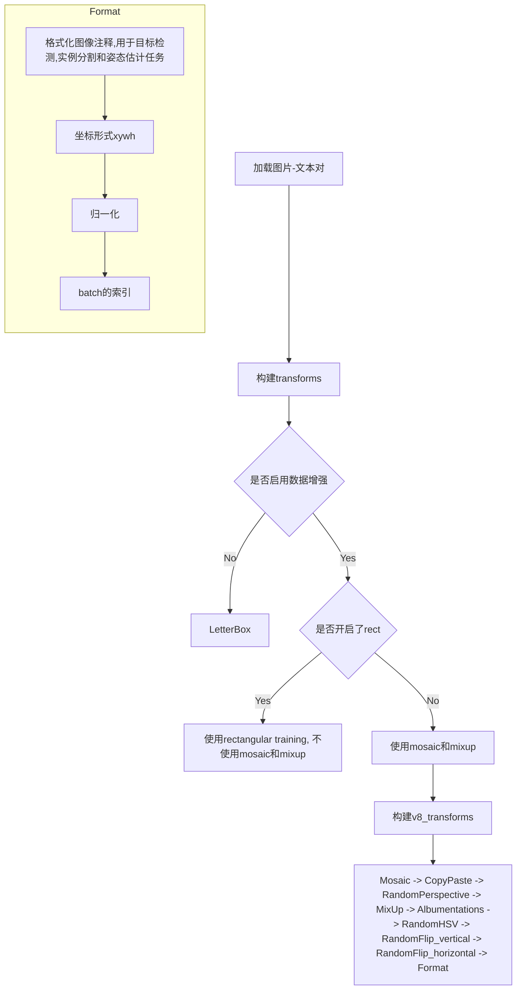

# 1. YOLO相关

## 1.1. 超参数（hyp）default.yaml

>  [Ultralytics官方文档关于Configuration的介绍](https://docs.ultralytics.com/usage/cfg/#augmentation-settings)

> ⚠️这是Ultralytics关于「训练」「验证」「推理」「可视化」「导出」「其他超参数」的唯一配置文件，如果我们需要自己写一个配置文件，直接将自定义的配置文件路径放到`cfg`字段后面就可以。

### 1.1.1. 训练train相关配置

| 配置项          | 类型                             |  默认值  | 描述                                                         |
| :-------------- | -------------------------------- | :------: | ------------------------------------------------------------ |
| `task`          | `str`                            | `detect` | YOLO 任务类型，如 detect、segment、classify、pose、obb       |
| `mode`          | `str`                            | `train`  | YOLO 模式，如 train、val、predict、export、track、benchmark  |
| `model`         | `str`（可选）                    |          | 模型文件路径，如 yolov8n.pt、yolov8n.yaml                    |
| `data`          | `str`（可选）                    |          | 数据文件路径，如 coco8.yaml                                  |
| `epochs`        | `int`                            |  `100`   | 训练轮数                                                     |
| `time`          | `float`（可选）                  |          | 训练小时数，若提供则覆盖 epochs                              |
| `patience`      | `int`                            |  `100`   | 无明显改进时的早停Epoch数                                    |
| `batch`         | `int`                            |   `16`   | 每批图像数量（-1 为自动批处理）                              |
| `imgsz`         | `int` 或 `list`                  |  `640`   | 训练和验证模式下的输入图像尺寸，或预测和导出模式下的 [高, 宽] |
| `save`          | `bool`                           |  `True`  | 是否保存训练检查点和预测结果                                 |
| `save_period`   | `int`                            |   `-1`   | 每 x 轮保存检查点（小于 1 时禁用）                           |
| `cache`         | `bool`                           | `False`  | 是否使用缓存加载数据（True/ram、disk 或 False）              |
| `device`        | `int` 或 `str` 或 `list`（可选） |          | 运行设备，如 cuda device=0 或 device=0,1,2,3 或 device=cpu   |
| `workers`       | `int`                            |   `8`    | 数据加载的线程数（DDP 每 RANK）                              |
| `project`       | `str`（可选）                    |          | 项目名称                                                     |
| `name`          | `str`（可选）                    |          | 实验名称，结果保存至 'project/name' 目录                     |
| `exist_ok`      | `bool`                           | `False`  | 是否覆盖现有实验                                             |
| `pretrained`    | `bool` 或 `str`                  |  `True`  | 是否使用预训练模型（bool）或加载权重的模型（str）            |
| `optimizer`     | `str`                            |  `auto`  | 优化器选择，如 SGD、Adam、Adamax 等                          |
| `verbose`       | `bool`                           |  `True`  | 是否打印详细输出                                             |
| `seed`          | `int`                            |   `0`    | 随机种子，用于可复现性                                       |
| `deterministic` | `bool`                           |  `True`  | 是否启用确定性模式                                           |
| `single_cls`    | `bool`                           | `False`  | 是否将多类别数据作为单类别训练                               |
| `rect`          | `bool`                           | `False`  | 是否进行矩形训练（`mode='train'`）或矩形验证（`mode='val'`） |
| `cos_lr`        | `bool`                           | `False`  | 是否使用余弦学习率调度器                                     |
| 🌟`close_mosaic` | `int`                            |   `10`   | 最后几轮禁用马赛克增强（0 为禁用）                           |
| `resume`        | `bool`                           | `False`  | 是否从最后一个检查点恢复训练                                 |
| `amp`           | `bool`                           |  `True`  | 是否使用自动混合精度（AMP）训练                              |
| `fraction`      | `float`                          |  `1.0`   | 训练数据集的比例（默认 `1.0`，即全部训练集图像）             |
| `profile`       | `bool`                           | `False`  | （性能测试）是否在训练期间记录 ONNX 和 TensorRT 速度         |
| `freeze`        | `int` 或 `list`（可选）          |  `None`  | 冻结前 `n` 层，或冻结层索引列表                              |
| `multi_scale`   | `bool`                           | `False`  | 训练时是否使用多尺度（在训练期间增加/减少`imgsz`最多`0.5`倍来实现多尺度训练。在推理过程中使用多个`imgsz`训练模型更加准确。） |
| `overlap_mask`  | `bool`                           |  `True`  | 训练时掩码是否重叠（仅分割训练）                             |
| `mask_ratio`    | `int`                            |   `4`    | 掩码下采样比例（仅分割训练，影响训练期间使用的掩模的分辨率） |
| `dropout`       | `float`                          |  `0.0`   | 是否使用 dropout 正则化（仅分类训练）                        |

### 1.1.2. 验证val相关配置

| 配置项        | 类型            | 默认值  | 描述                                                    |
| :------------ | --------------- | :-----: | ------------------------------------------------------- |
| `val`         | `bool`          | `True`  | 训练期间是否进行验证/测试                               |
| `split`       | `str`           |  `val`  | 验证使用的数据集分割，如 `'val'`、`'test'` 或 `'train'` |
| `save_json`   | `bool`          | `False` | 是否将结果保存为 JSON 文件                              |
| `save_hybrid` | `bool`          | `False` | 是否保存标签的混合版本（标签 + 额外预测）               |
| `conf`        | `float`（可选） |         | 检测的对象置信度阈值（默认预测 `0.25`，验证 `0.001`）   |
| `iou`         | `float`         |  `0.7`  | NMS 的交并比（IoU）阈值                                 |
| `max_det`     | `int`           |  `300`  | 每张图像的最大检测数                                    |
| `half`        | `bool`          | `False` | 是否使用半精度（FP16）                                  |
| `dnn`         | `bool`          | `False` | 是否使用 OpenCV DNN 进行 ONNX 推理                      |
| `plots`       | `bool`          | `True`  | 是否在训练/验证期间保存图表和图像                       |

### 1.1.3. 预测predict相关配置

| 配置项          | 类型                         | 默认值  | 描述                                                |
| :-------------- | ---------------------------- | :-----: | --------------------------------------------------- |
| `source`        | `str`（可选）                |         | 图像或视频的源目录                                  |
| `vid_stride`    | `int`                        |   `1`   | 视频帧率步长                                        |
| `stream_buffer` | `bool`                       | `False` | 是否缓冲所有流帧（True）或返回最新帧（False）       |
| `visualize`     | `bool`                       | `False` | 是否可视化模型特征                                  |
| `augment`       | `bool`                       | `False` | 是否对预测源应用图像增强                            |
| 🌟`agnostic_nms` | `bool`                       | `False` | 是否使用类别无关的 NMS                              |
| `classes`       | `int` 或 `list[int]`（可选） |         | 按类别过滤结果，如 `classes=0 `或 `classes=[0,2,3]` |
| `retina_masks`  | `bool`                       | `False` | 是否使用高分辨率分割掩码                            |
| `embed`         | `list[int]`（可选）          |         | 从给定层返回特征向量/嵌入                           |

#### 1.1.3.1. agnostic_nms

`agnostic_nms` 是指类别无关的非最大抑制（Non-Maximum Suppression，NMS）。在目标检测任务中，NMS 是一种用于去除冗余重叠边界框的算法，以保留最佳的检测结果。

- **常规NMS**：它是按类别进行操作的，即在每个类别内部独立地进行 NMS，目的是在每个类别内去除置信度较低且与高置信度检测框重叠较大的检测框，从而保留每个类别中置信度最高的检测框。
- **Agnostic NMS**：与常规 NMS 不同，它不考虑类别信息，而是将所有类别的检测框放在一起进行 NMS 操作。

🤔 𝑸𝒖𝒆𝒔𝒕𝒊𝒐𝒏：假如模型预测出来3个坐标一样的预测框（但是类别不同），那么使用了`agnostic_nms`之后，这三个框都会保留吗？

🥳 𝑨𝒏𝒔𝒘𝒆𝒓：在使用了`agnostic_nms`算法不会考虑预测框的类别信息，只关注预测框之间的重叠情况。因此，如果三个预测框的坐标完全相同，即使它们的类别不同，`agnostic_nms`也会将它们视为重叠的框，并根据置信度分数来决定保留哪个框。因此，使用了`agnostic_nms`之后，这三个坐标相同的预测框不会全部保留，<font color='red'><b>只会保留置信度最高的一个</b></font>。

### 1.1.4. 可视化visualize相关配置

| 配置项        | 类型          | 默认值  | 描述                                        |
| :------------ | ------------- | :-----: | ------------------------------------------- |
| `show`        | `bool`        | `False` | 如果环境允许，是否显示预测的图像和视频      |
| `save_frames` | `bool`        | `False` | 是否保存预测的单个视频帧                    |
| `save_txt`    | `bool`        | `False` | 是否将结果保存为 .txt 文件                  |
| `save_conf`   | `bool`        | `False` | 是否保存带置信度的结果                      |
| `save_crop`   | `bool`        | `False` | 是否保存带结果的裁剪图像                    |
| `show_labels` | `bool`        | `True`  | 是否显示预测标签，如 `'person'`             |
| `show_conf`   | `bool`        | `True`  | 是否显示预测置信度，如 `'0.99'`             |
| `show_boxes`  | `bool`        | `True`  | 是否显示预测框                              |
| `line_width`  | `int`（可选） |         | 边界框的线宽。如果为 None，则按图像尺寸缩放 |

### 1.1.5. 导出export相关配置

| 配置项      | 类型          |    默认值     | 描述                                                                                   |
| :---------- | ------------- | :-----------: | -------------------------------------------------------------------------------------- |
| `format`    | `str`         | `torchscript` | 导出格式，选择见 [导出格式](https://docs.ultralytics.com/modes/export/#export-formats) |
| `keras`     | `bool`        |    `False`    | 是否使用 Keras                                                                         |
| `optimize`  | `bool`        |    `False`    | TorchScript：是否为移动设备优化                                                        |
| `int8`      | `bool`        |    `False`    | CoreML/TF INT8 量化                                                                    |
| `dynamic`   | `bool`        |    `False`    | ONNX/TF/TensorRT：是否使用动态轴                                                       |
| `simplify`  | `bool`        |    `True`     | ONNX：是否使用 `onnxslim` 简化模型                                                     |
| `opset`     | `int`（可选） |               | ONNX：opset 版本                                                                       |
| `workspace` | `int`         |      `4`      | TensorRT：工作空间大小（GB）                                                           |
| `nms`       | `bool`        |    `False`    | CoreML：是否添加 NMS                                                                   |

### 1.1.6. 超参数hyper-parameter相关配置

| 配置项            | 类型    |    默认值     | 描述                                                            |
| :---------------- | ------- | :-----------: | --------------------------------------------------------------- |
| `lr0`             | `float` |    `0.01`     | 初始学习率（如 SGD=1E-2，Adam=1E-3）                            |
| `lrf`             | `float` |    `0.01`     | 最终学习率（lr0 * lrf）                                         |
| `momentum`        | `float` |    `0.937`    | SGD 动量/Adam beta1                                             |
| `weight_decay`    | `float` |   `0.0005`    | 优化器权重衰减 5e-4                                             |
| `warmup_epochs`   | `float` |     `3.0`     | 预热轮数（可为分数）                                            |
| `warmup_momentum` | `float` |     `0.8`     | 预热初始动量                                                    |
| `warmup_bias_lr`  | `float` |     `0.1`     | 预热初始偏置学习率                                              |
| `box`             | `float` |     `7.5`     | 框损失增益                                                      |
| `cls`             | `float` |     `0.5`     | 类别损失增益（按像素缩放）                                      |
| `dfl`             | `float` |     `1.5`     | dfl 损失增益                                                    |
| `pose`            | `float` |    `12.0`     | 姿态损失增益                                                    |
| `kobj`            | `float` |     `1.0`     | 关键点对象损失增益                                              |
| `label_smoothing` | `float` |     `0.0`     | 标签平滑（分数）                                                |
| `nbs`             | `int`   |     `64`      | 名义批量大小                                                    |
| `hsv_h`           | `float` |    `0.015`    | 图像 HSV-Hue 增强（分数）                                       |
| `hsv_s`           | `float` |     `0.7`     | 图像 HSV-Saturation 增强（分数）                                |
| `hsv_v`           | `float` |     `0.4`     | 图像 HSV-Value 增强（分数）                                     |
| `degrees`         | `float` |     `0.0`     | 图像旋转（+/- 度）                                              |
| `translate`       | `float` |     `0.1`     | 图像平移（+/- 分数）                                            |
| `scale`           | `float` |     `0.5`     | 图像缩放（+/- 增益）                                            |
| `shear`           | `float` |     `0.0`     | 图像剪切（+/- 度）                                              |
| `perspective`     | `float` |     `0.0`     | 图像透视（+/- 分数），范围 0-0.001                              |
| `flipud`          | `float` |     `0.0`     | 图像上下翻转（概率）                                            |
| `fliplr`          | `float` |     `0.5`     | 图像左右翻转（概率）                                            |
| `bgr`             | `float` |     `0.0`     | 图像通道 BGR（概率）                                            |
| `mosaic`          | `float` |     `1.0`     | 图像马赛克（概率）                                              |
| `mixup`           | `float` |     `0.0`     | 图像混合（概率）                                                |
| `copy_paste`      | `float` |     `0.0`     | 分割复制粘贴（概率）                                            |
| `copy_paste_mode` | `str`   |   `"flip"`    | 复制粘贴增强方法（flip、mixup）                                 |
| `auto_augment`    | `str`   | `randaugment` | 分类的自动增强策略（randaugment、autoaugment、augmix）          |
| `erasing`         | `float` |     `0.4`     | 分类训练期间随机擦除的概率（0-0.9），0 表示无擦除，必须小于 1.0 |
| `crop_fraction`   | `float` |     `1.0`     | 分类的图像裁剪比例（0.1-1），1.0 表示无裁剪，必须大于 0         |

### 1.1.7. 自定义config

| 配置项 | 类型          | 默认值 | 描述                            |
| :----- | ------------- | :----: | ------------------------------- |
| `cfg`  | `str`（可选） |        | 用于覆盖 `defaults.yaml `的配置 |

### 1.1.8. Tracker设置

| 配置项    | 类型  |     默认值     | 描述                                                  |
| :-------- | ----- | :------------: | ----------------------------------------------------- |
| `tracker` | `str` | `botsort.yaml` | 跟踪器类型，选择有 [`botsort.yaml`、`bytetrack.yaml`] |


## 1.2. 读取数据（图片-标签对）

使用多线程来读取图片，使用的是线程池的`imap函数`，该函数会调用`verify_image_label`函数对图片进行检查。

### 1.2.1. 检查图片

1. 使用PIL库检查图片是否损坏

2. 对于JPEG图片，获取EXIF修正后图片尺寸

3. `assert`检查图片的H或W是否都≥10

4. `assert`检查图片是否支持（`{"bmp", "dng", "jpeg", "jpg", "mpo", "png", "tif", "tiff", "webp", "pfm"}`）

5. 如果图片是JPEG格式，那么会进行额外的检查：

	```python
	if im.format.lower() in {"jpg", "jpeg"}:
	    # 以二进制的形式打开图片
	    with open(im_file, "rb") as f:
	        # 将文件指针移动到文件末尾前2个字节的位置
	        f.seek(-2, 2)
	        # 读取文件末尾的2个字节并判断是否为JPEG图像的结束标志位
	        if f.read() != b"\xff\xd9":  # 不是JPEG的结束标志位，说明图片有问题（corrupt JPEG）
	            # 修复并保存图像
	            ImageOps.exif_transpose(Image.open(im_file)).save(im_file, "JPEG", subsampling=0, quality=100)
	            msg = f"{prefix}WARNING ⚠️ {im_file}: corrupt JPEG restored and saved"
	```

> ⚠️图片不会去重，一个`.txt`中的行可以去重

### 1.2.2. 检查标签

1. 判断标签是不是一个文件
	- `True`：正常读取
		- 判断标签的类别：是不是segment任务
		- 检查行数：判断是否为负样本
		- 检查类别数是否超过了最大的类别数
		- 按照行进行去重
		- 生成一个`ndarray`
	- `False`：认为不是一个文件或者不存在，那么就认为是一个负样本，生成一个空的`ndarray`

### 1.2.3. try...except

在验证了图片和标签之后，如果有异常被抛出，`number corrupt += 1`，并且会打印一条消息：

```python
except Exception as e:
    nc = 1
    msg = f"{prefix}WARNING ⚠️ {im_file}: ignoring corrupt image/label: {e}"
    return [None, None, None, None, None, nm, nf, ne, nc, msg]
```

### 1.2.4. 读取.cache

> ⚠️注意缓存cache和缓冲buffer的区别

1. 展示已存在`.cache`文件信息

2. 取出标签（`ndarray`格式）

  ```python
  if not labels:
      LOGGER.warning(f"WARNING ⚠️ No images found in {cache_path}, training may not work correctly. {HELP_URL}")
  ```

3. 更新图片的filepath（因为有些标签是不行的，所以需要更新）

  ```python
  self.im_files = [lb["im_file"] for lb in labels]  # update im_files
  ```

4. 检查标签：

  1. 检查标签的数量（有一个标签就+1），如果没有标签则发出WARNING

```python
if not labels:
    LOGGER.warning(f"WARNING ⚠️ No images found in {cache_path}, training may not work correctly. {HELP_URL}")
```

  2. 检查标签中的`box`和`segment`数量是否一致（因为如果开启了`copy_paste`，那么`segment`会辅助`box`训练）

  	1. `True`：...

  	2. `False`：只保留`box`标签，`segment`标签就直接丢弃了（发出WARNING）

```python
if len_segments and len_boxes != len_segments:
    LOGGER.warning(
    f"WARNING ⚠️ Box and segment counts should be equal, but got len(segments) = {len_segments}, "
    f"len(boxes) = {len_boxes}. To resolve this only boxes will be used and all segments will be removed. "
    "To avoid this please supply either a detect or segment dataset, not a detect-segment mixed dataset."
    )
    for lb in labels:
   	 lb["segments"] = []
```

  3. 检查标签中统计的类别len，如果为0则发出WARNING

```python
if len_cls == 0:
    LOGGER.warning(f"WARNING ⚠️ No labels found in {cache_path}, training may not work correctly. {HELP_URL}")
```

5. 根据`classes`和`single_cls`更新标签，调用`update_labels(self, include_class: Optional[list])`函数。

6. 看一下是否开启了`rect==True`：

	- 如果开启了，则需要对数据集中的batch按照宽高比进行排序，从而加速后面的处理过程

### 1.2.5. 缓冲buffer

1. 先检查是否需要数据增强

  - 不需要数据增强那么就不需要buffer了

2. 判断`cache`的类型

  > 💡`cache=True`等价于`cache='ram'`

  - `cache==None`：不对数据集图片进行保存处理

  - `cache=='ram'`：将数据集图片保存在RAM中

    - 检查当前机器的内存使用情况，看看是否有足够的RAM空间，如果没有则`cache=False`
    - 加载图片
    	- 如果`rect==True`，加载后在保持aspect ratio不变的情况下将长边`cv2.resize`为640
    	- 如果图片本身是一张正方形图片：直接将其`cv2.resize`为640\*640
    	- 如果上面两个条件都没有满足，那么加载图片后不会对图片进行`cv2.resize`处理

    - 判断是否有数据增强：
    	- `self.augment==True`：将读取到图片的`index`添加到`self.buffer`这个list中
    	- `self.augment==False`：`self.buffer`一直是空的`[]`

> ⚠️注意事项：
>
> 1. 如果开启了`deterministic`，那么会发生WARNING，建议使用`cache='disk'`
> 2. `cv2.resize`用的是线性插值`cv2.INTER_LINEAR`

- `cache='disk'`：

- 检查当前机器的硬盘使用情况，看看是否有足够的硬盘空间，如果没有则`cache=False`

	```python
	def cache_images_to_disk(self, i):
	    """Saves an image as an *.npy file for faster loading.
	            将图像保存为 *.npy 文件以加快加载速度。
	        """
	    f = self.npy_files[i]
	    if not f.exists():
	        np.save(f.as_posix(), cv2.imread(self.im_files[i]), allow_pickle=False)
	```

- 将数据集图片保存在硬盘中（以`.npy`的格式）

  > - 这一步不会像`cache='ram'`那样会对图片进行`cv2.resize`，就是单纯的直接读直接写为`.npy`文件
  >
  > - 生成的`.npy`和图片路径是一样的，由于是`ndarray`数组，因此文件大小会变大
  >
  > 	```
  > 	64K     coco128_VOC_style/VOC2007/images/000000000009.jpg
  > 	904K    coco128_VOC_style/VOC2007/images/000000000009.npya
  > 	```

## 1.3. 数据增强

### 1.3.1. 流程图



### 1.3.2. 标签格式

```python
labels = {
    "img": image,  # 输入图像
    "cls": np.array([0, 1]),  # 类别标签
    "instances": Instances(...),  # 边界框、分割和关键点的标签对象实例
    "mosaic_border": Tuple[int, int]  # [可选项] 马赛克增强的边框大小
}
```

经过数据增强后：

```python
labels = {
    "img": np.ndarray,  # 变换后的图像
    "cls": np.ndarray,  # 更新后的类别标签
    "instances": Instances,  # 更新后的对象实例（边界框、分割和关键点的标签对象实例）
    "resized_shape": Tuple[int, int]  # 变换后的新图像形状
}
```

标签常用3种坐标表示方式：

- `xyxy` means left top and right bottom
- `xywh` means center x, center y and width, height(YOLO format)
- `ltwh` means left top and width, height(COCO format)

### 1.3.3. num_workers

- 如果是train模式，`workers`没有变化
- 如果是val模式，`workers = workers * 2`

### 1.3.4. Shuffle

- 如果`mode='train'`，`dataloader`开启`shuffle`，`val`和`predict`都不会开启`shuffle`。
- 即便`mode='train'`，但如果开启了`rect`，那么`dataloader`也不会开启`shuffle`。

### 1.3.5. Rect

在Ultralytics的目标检测项目（如YOLO系列）中，矩阵训练指的是**通过批量加载和处理数据以优化训练效率的机制**。矩阵训练的核心是让模型在训练时能够更高效地处理不同尺寸的输入图像，同时适应目标检测任务中的多样性。Ultralytics项目通过矩阵训练优化数据加载和增强过程，以加速训练并提升模型性能。

矩形训练是一种训练策略，在这种策略下，**输入图像会根据原始宽高比进行调整**，而不是将所有图像统一调整为一个固定的正方形尺寸（如640×640）。

> 💡在开启了mosaic数据增强之后，拼接好的图片尺寸为640×640

具体来说：
- 不同的图像会被调整为具有相同的图像面积（如640×640），但保留其原始的宽高比。

	> 简单理解为就是直接对单张图片应用了`letterbox`，一般生成的图片尺寸为640\*480

- 通过这种方式，<font color='red'><b>图像的长宽比例可以尽可能接近真实比例，从而减少失真问题，特别是在长宽比差异较大的数据集中</b></font>。

#### 1.3.5.1. mosaic和rectangular training的直观对比

下面是mosaic数据增强和矩阵训练的对比图：

<div align=center>
    </br><center>mosaic数据增强</center>
</div>

<div align=center>
    </br><center>rectangular training数据增强</center>
</div>
#### 1.3.5.2. 矩形训练的优势

1. **减少图像失真**：保留原始宽高比，避免目标形状被拉伸或压缩。
2. **更高的训练效率**：减少填充（padding）的空白区域，从而提高有效像素的利用率。
3. **适合特定数据集**：对包含很多长宽比差异较大的数据集尤其有用。

---

#### 1.3.5.3. 矩形训练和Mosaic、MixUp的冲突

- 当`rect=True`时：

	- 与mosaic不兼容

	- 与Mixup不兼容

	- 与`shuffle=True`不兼容

Mosaic是将4张图像拼接成一张图像的增强方法，通过随机裁剪和拼接，生成一个新的训练样本。因为Mosaic会随机裁剪和拼接图像，<font color='red'><b>生成的拼接图像通常不是原始的宽高比</b></font>。而如果使用矩形训练，图像的宽高比需要保持一致，但Mosaic 成的拼接图像可能包含多个不同宽高比的区域，导致无法直接对其进行矩形调整。

MixUp 数据增强是将两张图像按一定比例进行线性混合（像素和标签都混合），从而生成一个新的训练样本。同样会改变原始图像的宽高比，并且生成的图像可能不符合矩形训练的要求（导致宽高比的不确定性）。

### 1.3.6. Letterbox

#### 1.3.6.1. 图片

#### 1.3.6.2. 标签

1. 将标签转换为xyxy格式
2. 取消归一化
3. 取消缩放
4. 增加padding的范围

### 1.3.7. Mosaic

- 概率`p`必须在$[0, 1]$之间

- 马赛克的grid size必须是4或9
  - 4=2*2
  - 9=3*3

- 在组装完毕后会进行标签坐标裁剪，防止标签越界

	> ⚠️这里没有对bbox的area进行判断，后面在`box_candidates`中才会限制面积：
	>
	> - 有分割标签：最小为`0.01`
	> - 没有分割标签：最小为`0.10`

### 1.3.8. Mixup

- 论文地址：[mixup: Beyond Empirical Risk Minimization](https://arxiv.org/abs/1710.09412)

- mixup和mosaic都用的`ultralytics/data/augment.py/BaseMixTransform`这个父类实现的。

- mixup的代码非常简单，如下所示：

	```python
	def _mix_transform(self, labels):
	    """
	        Applies MixUp augmentation to the input labels.
	
	        将 MixUp 数据增强应用于输入标签。
	
	        This method implements the MixUp augmentation technique as described in the paper
	        "mixup: Beyond Empirical Risk Minimization" (https://arxiv.org/abs/1710.09412).
	
	        Args:
	            labels (Dict): A dictionary containing the original image and label information.
	
	            labels (Dict): 包含原始图像和标签信息的字典。
	
	        Returns:
	            (Dict): A dictionary containing the mixed-up image and combined label information.
	
	             (Dict): 包含混合后的图像和组合标签信息的字典。
	
	        Examples:
	            >>> mixer = MixUp(dataset)
	            >>> mixed_labels = mixer._mix_transform(labels)
	        """
	    # 混合系数
	    r = np.random.beta(32.0, 32.0)  # mixup ratio, alpha=beta=32.0
	    labels2 = labels["mix_labels"][0]  # 被混合的图片本体和标签（在x=0.5时达到最大）
	
	    # 图片mixup
	    labels["img"] = (labels["img"] * r + labels2["img"] * (1 - r)).astype(np.uint8)
	
	    # 坐标mixup
	    labels["instances"] = Instances.concatenate([labels["instances"], labels2["instances"]], axis=0)
	
	    # 类别mixup
	    labels["cls"] = np.concatenate([labels["cls"], labels2["cls"]], 0)
	    return labels
	```

	其中混合系数`r`的分布如下图所示：
	
    <div align=center>
        </br><center></center>
    </div>

### 1.3.9. CopyPaste

CopyPaste 类，用于对图像数据集应用复制粘贴增强。此类实现了论文《[Simple Copy-Paste is a Strong Data Augmentation Method for Instance Segmentation](https://arxiv.org/abs/2012.07177)》中描述的复制粘贴增强技术。它可以结合来自不同图像的对象以创建新的训练样本。

> ⚠️ 使用此增强方式的数据集必须要有分割的标签，否则不会执行
> ⚠️ CopyPaste有两种方式：
>
> 1. flip
> 2. mixup

### 1.3.10. 注意事项

#### 1.3.10.1. 语义分割segment中的位图掩码

因为Ultralytics在进行数据增强的时候，`cls`信息是单独存放的，因此不像传统的语义分割那样，`GT`是一张灰度图，而是针对每一个类别的位图掩码，即：

```
# 位图掩码
0 0 0
0 1 0
0 0 0

# 灰度图
0 0 2
0 2 1
1 1 2
```

## 1.4. dataloader

- 只使用主线程构建dataloader对象
- 🚨在进行`val`时，`rect=True`


## 1.5. 自动计算batch

- `batch=-1`：自动计算60%GPU显存占用的batch size
- `batch=0.8`：自动计算80%GPU显存占用的batch size

> 🚨上面两种情况只适用于单卡的情况，对于多卡的情况Ultralytics代码暂不支持！
> 🚨如果开启了`torch.backends.cudnn.benchmark=True`，那么也是不支持的！
> 🚨自动计算的batch范围为：$[1, 1024]$，超出则使用默认的16作为batch

该功能的核心函数为：`ultralytics/utils/autobatch.py/autobatch()`

## 1.6. best.pt计算方式

在 `ultralytics/utils/metrics.py` 文件中的 `Metric` 类的 `fitness()` 方法中：

```python
def fitness(self):
    """Model fitness as a weighted combination of metrics.
        将模型拟合度视为各项指标的加权组合。
    """
    # 权重分别对应 [Precision, Recall, mAP@0.5, mAP@0.5:0.95]
    # 默认权重 [0.0, 0.0, 0.1, 0.9]，可以根据需求调整
    w = [0.25, 0.25, 0.25, 0.25]  # 修改后的权重
    return (np.array(self.mean_results()) * w).sum()
```

默认情况下，`fitness score` 的计算公式为：

$$
\text{fitness score} = 0 \times \text{Precision} + 0 \times \text{Recall} + 0.1 \times \text{mAP@0.5} + 0.9 \times \text{mAP@0.5:0.95}
$$

其中：
- **`mAP@0.5`**：衡量 IoU ≥ 0.5 时的平均精度，代表较宽松条件下的模型性能。
- **`mAP@0.5:0.95`**：综合了多个 IoU 阈值（从 0.5 到 0.95，步长为 0.05），提供了更严格和全面的性能评估。

在训练和验证阶段，IoU 阈值的主要作用包括：
1. **计算定位损失**：衡量预测框与真实框的重叠程度，优化模型的定位能力。
2. **划分正负样本**：根据 IoU 阈值，将预测框划分为正样本（IoU > 0.5）、忽略样本（0.3 ≤ IoU ≤ 0.5）和负样本（IoU < 0.3），从而影响分类损失和定位损失的计算。

Ultralytics 默认权重设置为 10% 的 `mAP@0.5` 和 90% 的 `mAP@0.5:0.95`，分别对应 VOC 和 COCO 数据集的评估指标。但在实际业务场景中，可以根据需求调整权重：

- 如果关注 **漏检**（Recall），应适当增加 Recall 的权重。
- 如果关注 **误检**（Precision），应适当增加 Precision 的权重。

## 1.7. imgsz

- `train`和`val`模式的`imgsz`必须是一个整数，如`640`，之后程序会将其转换为`[640, 640]`
- `predict`和`export`模式的`imgsz`可以是一个整数，如`640`，也可以是一个列表，如`[640, 480]`

```bash
yolo train imgsz=640        # ✅
yolo train imgsz=640,480    # ❌

yolo val imgsz=640          # ✅
yolo val imgsz=640,480      # ❌

yolo predict imgsz=640      # ✅
yolo predict imgsz=640,480  # ✅

yolo export imgsz=640       # ✅
yolo export imgsz=640,480   # ✅
```

## 1.8. grid cell

grid cell的最小值为32，依据如下：

`ultralytics/engine/trainer.py/BaseTrainer/_setup_train`

```python
# Check imgsz（grid cell的大小最小是32*32）
gs = max(int(self.model.stride.max() if hasattr(self.model, "stride") else 32), 32)  # grid size (max stride)
```

## 1.9. AMP

1. 在`.train()`方法中开启了`amp=True`（默认开启）
2. 在主线程中先备份回调函数防止在测试AMP时对其改动
3. 使用`check_amp(model)`的函数来进行测试，该函数返回一个bool
   1. 先将图片（`ultralytics/assets/bus.jpg`）复制8遍形成一个batch
   2. 因为是验证是否可用，因此imgsz的最大值被限制为256
   3. 先试用FP32的模型对结果进行推理，得到结果`a`
   4. 之后使用`with autocast(enable=True)`上下文管理器中再次使用模型进行推理，得到结果`b`
   5. 先判断`a`和`b`的shape是否相等
   6. 之后再使用`torch.allclose(a, b.float(), atol=0.5)`判断二者的绝对容忍度是否在0.5的范围内
   7. `True` -> 可以开启AMP
   8. `False` -> 不开启AMP（根据异常原因进行不同的告警）
      1. `except ConnectionError`：网络连接异常，直接跳过检查了（返回值依然是False）
      2. `except (AttributeError, ModuleNotFoundError)`：原项目被修改导致模型无法被正常加载
      3. `except AssertionError`：未知的原因导致`a`和`b`的shape不相等或二者的绝对容忍度不在0.5的范围内

> 🔔不管AMP是否为True都会创建`torch.amp.GradScaler`，只不过`enabled=self.amp`

## 1.10. 初始化策略

```python
def initialize_weights(model):
    """Initialize model weights to random values."""
    for m in model.modules():
        t = type(m)
        if t is nn.Conv2d:
            pass
        elif t is nn.BatchNorm2d:
            m.eps = 1e-3
            m.momentum = 0.03
        elif t in {nn.Hardswish, nn.LeakyReLU, nn.ReLU, nn.ReLU6, nn.SiLU}:
            m.inplace = True
```

> Issue链接：[Initialization of yolov8 #12677](https://github.com/ultralytics/ultralytics/issues/12677)

### 1.10.1. Conv2d

glenn-jocher说是不使用kaiming初始化了，因此直接设置为`pass`，但是根据PyTorch官方代码，`nn.Conv2d`在创建时自动就应用了kaiming初始化方式，代码如下：

```python
class _ConvNd(Module):
	...
	
    def __init__(...) -> None:
        super(_ConvNd, self).__init__()
		
		...
		
        self.reset_parameters()  # 🚨 Here!

    def reset_parameters(self) -> None:
        init.kaiming_uniform_(self.weight, a=math.sqrt(5))  # 🚨 Here!
        if self.bias is not None:
            fan_in, _ = init._calculate_fan_in_and_fan_out(self.weight)
            bound = 1 / math.sqrt(fan_in)
            init.uniform_(self.bias, -bound, bound)
```

### 1.10.2. BatchNorm2d

Ultralytics团队将其设置为：

- `eps = 1e-3`
- `momentum = 0.03`

根据glenn-jocher的说法，这是一个经验值。

# 2. 编程相关

## 2.1. 🌟PyTorch

### 2.1.1. torch.Generator()

`torch.Generator` 是 PyTorch 中的一个类，用于创建一个随机数生成器，可以控制随机数生成的种子和状态。这在需要可重复的随机操作时非常有用，例如在实验中确保结果的可复现性。

- **主要功能**：
	1. **设置种子**：通过设置种子，可以确保每次生成的随机数序列相同。
	2. **生成随机数**：可以用于生成各种类型的随机数，包括均匀分布、正态分布等。
	3. **保存和加载状态**：可以保存当前生成器的状态，并在需要时加载，以恢复之前的随机数生成状态。

- **常用方法**：
	- **`manual_seed(seed)`**：设置生成器的种子。
	- **`seed()`**：返回当前生成器的种子。
	- **`get_state()`**：返回生成器的当前状态。
	- **`set_state(new_state)`**：设置生成器的状态。
	- **`initial_seed()`**：返回生成器初始化时的种子。

- **示例**：

	- **设置种子**：

		```python
		import torch
		
		# 创建一个随机数生成器
		gen = torch.Generator()
		
		# 设置种子
		gen.manual_seed(42)
		
		# 生成随机数
		random_tensor = torch.randn(3, 3, generator=gen)
		print(random_tensor)
		```

	- **保存和加载状态**

		```python
		import torch
		
		# 创建一个随机数生成器
		gen = torch.Generator()
		
		# 设置种子
		gen.manual_seed(42)
		
		# 生成随机数
		random_tensor1 = torch.randn(3, 3, generator=gen)
		print("First random tensor:")
		print(random_tensor1)
		
		# 保存当前状态
		state = gen.get_state()
		
		# 生成更多随机数
		random_tensor2 = torch.randn(3, 3, generator=gen)
		print("Second random tensor:")
		print(random_tensor2)
		
		# 恢复之前的状态
		gen.set_state(state)
		
		# 重新生成随机数，结果应与 random_tensor2 相同
		random_tensor3 = torch.randn(3, 3, generator=gen)
		print("Third random tensor (should be the same as the second):")
		print(random_tensor3)
		```

- **应用场景**：
	- **实验可复现性**：在进行机器学习实验时，确保每次运行的结果相同。
	- **数据增强**：在数据增强中，确保每次生成的随机变换相同。
	- **多线程/多进程**：在多线程或多进程环境中，确保每个线程或进程使用独立的随机数生成器，避免随机数生成的冲突。

`torch.Generator` 是一个非常有用的工具，可以帮助我们在需要控制随机性的情况下，确保结果的可复现性和一致性。

### 2.1.2. torch.Generate()

`torch.Generator` 是 PyTorch 中用于**生成随机数**的类。它负责管理生成伪随机数的算法状态，并在许多就地（in_place）随机抽样函数中作为关键字参数使用。这个类的主要功能包括：

1. **设备指定**：`torch.Generator` 可以被指定在特定的设备上创建，如 CPU 或 GPU，这通过构造函数中的 `device` 参数实现。

2. **种子设置**：可以通过 `manual_seed(seed)` 方法设置用于生成随机数的种子，确保结果的可重复性。

3. **状态管理**：`get_state()` 方法以 `torch.ByteTensor` 的形式返回生成器的状态，而 `set_state(new_state)` 方法则用于设置生成器的状态。

4. **初始种子获取**：`initial_seed()` 方法返回用于生成随机数的初始种子。

5. **随机数生成**：`seed()` 方法从 `std::random_device` 或当前时间获取一个非确定性的随机数，并用它来设置生成器的种子。

`torch.Generator` 提供了可预测性和可复现性，这对于调试和复现实验结果非常有用。同时，它是线程安全的，支持在多线程环境中使用，并且支持多种随机数分布。在实际应用中，`torch.Generator` 广泛用于机器学习和深度学习中的随机数生成需求，如初始化模型权重、随机打乱训练数据等。

### 2.1.3. with torch_distributed_zero_first(rank)

`with torch_distributed_zero_first(rank)` 是 PyTorch 分布式训练中的一个上下文管理器，用于确保在分布式训练中，只有 rank（即进程的序号）为 0 的进程（主进程）首先执行某些操作，而其他进程则等待主进程完成这些操作后再继续执行。这个上下文管理器的作用是同步不同进程间的操作，以避免数据不一致或者资源竞争的问题。

具体来说，`torch_distributed_zero_first` 函数的工作原理如下：

1. 如果当前进程的 `local_rank` 不是 `-1` 或 `0`（即不是主进程），那么它将调用 `torch.distributed.barrier()` 函数，这会导致进程阻塞，直到所有进程都到达这个 barrier。

2. 然后，上下文管理器会执行 `yield`，这意味着它会暂停执行，允许 `with` 代码块内的代码运行。只有当 `local_rank` 为 `0` 时，这部分代码才会执行。
   > 🚨`yield`会抛出后面跟着的值（如果有）并且等待下次next

3. 在 `with` 代码块执行完毕后，如果 `local_rank` 是 `0`（即主进程），那么会再次调用 `torch.distributed.barrier()`，这样所有等待在第一个 barrier 的进程现在可以继续执行。

这种机制确保了在分布式训练中，一些只需要在一个进程中执行一次的操作（比如加载数据集、下载预训练模型等）不会在每个进程中重复执行，同时也保证了这些操作的结果能够被其他进程所使用。通过这种方式，可以提高分布式训练的效率和一致性。

### 2.1.4. torch.cuda.empty_cache()

`torch.cuda.empty_cache()` 是 PyTorch 提供的一个函数，用于释放当前 PyTorch CUDA 分配器中的未被引用的缓存内存。这个函数的作用包括：

1. **释放未占用内存**：它会释放那些不再被任何张量引用的内存块，这些内存块可能由于之前的操作而被分配但未被释放。

2. **减少内存碎片**：在进行大量的内存分配和释放操作时，可能会产生内存碎片。调用 `empty_cache()` 可以帮助减少这种碎片，从而提高内存使用效率。

3. **提高内存可用性**：释放的内存可以被操作系统回收，或者被其他 CUDA 应用程序使用。这有助于在多 GPU 应用或者需要大量内存的应用中保持内存的可用性。

4. **影响性能**：虽然 `empty_cache()` 可以释放内存，但是频繁调用它可能会导致性能下降，因为它会打断 PyTorch 的内存分配策略，使得后续的内存分配可能需要更多的时间来找到合适的内存块。

5. **nvidia-smi 可见性**：释放的内存将变得对 `nvidia-smi` 可见，这意味着我们可以在使用 `nvidia-smi` 命令时看到更多的可用 GPU 内存。

需要注意的是，`empty_cache()` 并不释放那些仍然被张量引用的内存。如果张量仍然存在并且被引用，那么它们所占用的内存不会被释放。此外，`empty_cache()` 并不影响 CPU 内存，它只影响 GPU 内存。

在实际使用中，通常不需要手动调用 `empty_cache()`，因为 PyTorch 的内存管理器会自动处理内存的分配和释放。但在某些特定的应用场景下，比如在长时间的训练过程中，或者在内存非常紧张的情况下，合理地使用 `empty_cache()` 可以帮助优化内存使用。


### 2.1.5. torch.beckends.cudnn.benchmark

`torch.backends.cudnn.benchmark=True` 是 PyTorch 中的一个设置，用于优化卷积神经网络（CNN）的性能。具体来说，这个设置的作用如下：

1. **自动调优**：当设置为 `True` 时，PyTorch 会使用 cuDNN 库（NVIDIA 提供的一个用于深度学习的 GPU 加速库）来自动寻找最佳的卷积算法。这意味着在执行卷积操作之前，cuDNN 会尝试不同的卷积算法，并选择在当前硬件和输入尺寸下最快的那个。

2. **性能提升**：这可以显著提高卷积神经网络的性能，特别是在使用 GPU 进行训练或推理时。自动选择最优算法可以减少计算时间，提高吞吐量。

3. **额外的计算开销**：需要注意的是，自动调优过程本身会有一定的计算开销，因为它需要尝试不同的算法。
   > ⚠️如果我们的模型或数据集非常小，或者我们的训练循环迭代非常快，这种额外的开销可能会抵消性能提升，甚至导致总体性能下降。

4. **适用场景**：这个设置在模型结构固定，且输入尺寸变化不大的情况下效果最好，因为这样 cuDNN 可以更好地预测和选择最优算法。

5. **默认值**：在 PyTorch 中，`torch.backends.cudnn.benchmark` 的默认值是 `False`，这意味着不会自动进行算法选择，而是使用默认的算法。

在使用这个设置时，我们应该根据我们的具体情况（模型大小、输入尺寸、训练速度等）来决定是否启用它。如果我们发现启用后性能没有提升，或者出现了其他问题，可以尝试将其设置回 `False`。

### 2.1.6. torch.cuda.device_count()

`torch.cuda.device_count()` 是 PyTorch 中的一个函数，用于返回当前系统中可用的 CUDA 设备（即 NVIDIA GPU）的数量。这个函数可以帮助我们确定我们的机器上有多少个 GPU 可以用于加速计算。

当我们在一个装有多个 GPU 的机器上运行 PyTorch 程序时，`torch.cuda.device_count()` 会返回这些 GPU 的总数。这允许我们的程序动态地适应不同的硬件配置，例如，我们可以根据可用的 GPU 数量来决定是否使用数据并行处理。

下面是如何使用这个函数的一个简单示例：

```python
import torch

# 检查是否有可用的 CUDA 设备
if torch.cuda.is_available():
    # 获取 CUDA 设备的数量
    num_gpus = torch.cuda.device_count()
    print(f'Number of CUDA devices available: {num_gpus}')
else:
    print('No CUDA devices are available.')
```

这段代码首先检查 CUDA 是否可用（即是否有支持 CUDA 的 GPU 和正确安装的驱动），然后使用 `torch.cuda.device_count()` 来获取并打印可用的 GPU 数量。如果没有可用的 CUDA 设备，它会打印相应的消息。

🚨==计算得到的GPU设备会因为环境变量而改变==，如下所示：

```python
import torch

print(f"{torch.cuda.device_count() = }")
```

```bash
# 不添加环境变量，得到结果是8
python temp.py

# 添加环境变量后，得到的结果是2
CUDA_VISIBLE_DEVICES=0,1 python temp.py
```

## 2.2. 🌟Python

### 2.2.1. os.access()

`os.access()` 是 Python 标准库 `os` 模块中的一个方法，用于检查调用进程是否可以访问指定路径的文件或目录。这个方法提供了多种访问模式，可以用来检查文件是否存在、是否可读、可写或可执行。

- **语法**：

	```python
	os.access(path, mode)
	```

	- **path**：要检查的文件或目录的路径。

	- **mode**：访问模式，可以是以下值的组合：
	  - `os.F_OK`：检查路径是否存在。
	  - `os.R_OK`：检查路径是否可读。
	  - `os.W_OK`：检查路径是否可写。
	  - `os.X_OK`：检查路径是否可执行。


- **返回值**：

	- 返回 `True` 表示指定的访问权限被允许。

	- 返回 `False` 表示指定的访问权限被拒绝。


- **注意事项**：
	1. **权限问题**：`os.access()` 方法的结果可能受到进程权限的影响。例如，即使文件存在，如果调用进程没有足够的权限，`os.access()` 也可能返回 `False`。
	1. **符号链接**：`os.access()` 会跟随符号链接，检查最终目标文件的权限。
	1. **平台差异**：在不同的操作系统上，文件权限的处理方式可能有所不同。特别是在 Windows 和 Unix 系统上，文件权限的模型和行为可能有显著差异。


- **用途**：

	- **文件存在性检查**：在尝试打开或操作文件之前，先检查文件是否存在。

	- **权限检查**：在进行文件读写操作之前，先检查文件是否具有相应的权限，以避免权限错误。

	- **预处理**：在执行复杂操作之前，先检查文件的访问权限，确保操作可以顺利进行。


### 2.2.2. psutil.virtual_memory()

`psutil.virtual_memory()` 方法用于获取系统内存的使用情况。它返回一个命名元组（`svmem`），其中包含多个属性，每个属性都提供了关于系统内存状态的不同信息。以下是 `psutil.virtual_memory()` 方法返回的各个属性的详细说明：

| 属性        | 描述                                                                 | 单位   |
| ----------- | -------------------------------------------------------------------- | ------ |
| `total`     | 总内存，系统安装的总物理内存                                         | 字节   |
| `available` | 可用内存，系统可以用来分配给新进程的内存量                           | 字节   |
| `percent`   | 已使用的内存百分比                                                   | 百分比 |
| `used`      | 已使用的内存量                                                       | 字节   |
| `free`      | 完全未使用的内存量                                                   | 字节   |
| `active`    | 最近使用的内存量，这些内存页在内存中处于活动状态，未被交换出去       | 字节   |
| `inactive`  | 最近未使用的内存量，这些内存页在内存中处于非活动状态，可以被交换出去 | 字节   |
| `buffers`   | 用于缓冲的内存量                                                     | 字节   |
| `cached`    | 用于缓存的内存量                                                     | 字节   |
| `shared`    | 共享内存的内存量                                                     | 字节   |
| `slab`      | 内核 slab 分配器使用的内存量                                         | 字节   |

以下是一个使用 `psutil.virtual_memory()` 方法的示例代码，展示了如何获取和打印内存使用情况：

```python
import psutil

# 获取内存使用情况
mem = psutil.virtual_memory()

# 打印内存使用情况
print(f"总内存: {mem.total / (1024 ** 3):.2f} GB")
print(f"可用内存: {mem.available / (1024 ** 3):.2f} GB")
print(f"已用内存: {mem.used / (1024 ** 3):.2f} GB")
print(f"空闲内存: {mem.free / (1024 ** 3):.2f} GB")
print(f"内存使用率: {mem.percent}%")
print(f"活动内存: {mem.active / (1024 ** 3):.2f} GB")
print(f"非活动内存: {mem.inactive / (1024 ** 3):.2f} GB")
print(f"缓冲内存: {mem.buffers / (1024 ** 3):.2f} GB")
print(f"缓存内存: {mem.cached / (1024 ** 3):.2f} GB")
print(f"共享内存: {mem.shared / (1024 ** 3):.2f} GB")
print(f"slab内存: {mem.slab / (1024 ** 3):.2f} GB")
```

```
总内存: 503.37 GB
可用内存: 483.60 GB
已用内存: 17.39 GB
空闲内存: 73.64 GB
内存使用率: 3.9%
活动内存: 207.63 GB
非活动内存: 197.21 GB
缓冲内存: 29.96 GB
缓存内存: 382.38 GB
共享内存: 1.04 GB
slab内存: 19.05 GB
```

| 属性       | 描述                                                         | 单位   |
| ---------- | ------------------------------------------------------------ | ------ |
| 总内存     | 系统安装的总物理内存                                         | 字节   |
| 可用内存   | 系统可以用来分配给新进程的内存量，通常等于 `free + buffers + cached` | 字节   |
| 已用内存   | 系统已经使用的内存量                                         | 字节   |
| 空闲内存   | 完全未使用的内存量                                           | 字节   |
| 内存使用率 | 已使用的内存占总内存的百分比                                 | 百分比 |
| 活动内存   | 最近使用的内存量，这些内存页在内存中处于活动状态             | 字节   |
| 非活动内存 | 最近未使用的内存量，这些内存页在内存中处于非活动状态         | 字节   |
| 缓冲内存   | 用于缓冲的内存量，通常用于文件系统缓存                       | 字节   |
| 缓存内存   | 用于缓存的内存量，通常用于文件系统缓存                       | 字节   |
| 共享内存   | 共享内存的内存量，多个进程可以共享这部分内存                 | 字节   |
| slab内存   | 内核 slab 分配器使用的内存量，用于管理内核对象               | 字节   |

> 🤔 𝑸𝒖𝒆𝒔𝒕𝒊𝒐𝒏：缓冲内存和缓存内存有什么区别？
>
> 🥳 𝑨𝒏𝒔𝒘𝒆𝒓：在计算机系统中，"缓冲内存"（buffers）和"缓存内存"（cached）是两个相关但不同的概念，它们在内存管理中扮演着不同的角色。以下是对这两个概念的详细解释：
>
> - **缓冲内存（Buffers）**：
>
> 	- **定义**：缓冲内存主要用于暂时存储磁盘I/O操作的数据。当系统从磁盘读取数据时，这些数据首先被放入缓冲区，以便快速访问。同样，当系统写入数据到磁盘时，数据也会先放入缓冲区，然后批量写入磁盘。
>
> 	- **用途**：主要用于提高磁盘I/O操作的效率。通过减少磁盘的读写次数，缓冲内存可以显著提高系统的性能。
>
> 	- **示例**：当我们从磁盘读取一个文件时，文件的内容会被放入缓冲区。如果再次访问同一文件，系统可以直接从缓冲区读取，而不需要再次从磁盘读取，从而加快访问速度。
>
>
> - **缓存内存（Cached）**：
>
> 	- **定义**：缓存内存用于存储最近访问过的文件和目录信息。这些数据在内存中保留，以便快速访问。缓存内存通常包括文件的内容、文件的元数据（如文件大小、修改时间等）。
>
> 	- **用途**：主要用于提高文件系统的访问速度。通过缓存最近访问过的文件和目录信息，系统可以更快地响应文件访问请求。
>
> 	- **示例**：当我们打开一个文件时，文件的内容和元数据会被放入缓存。如果再次访问同一文件，系统可以直接从缓存中读取，而不需要再次从磁盘读取，从而加快访问速度。
>
>
> - **区别**：
>
> 	- **数据类型**：
> 	  
> 	  - **缓冲内存**：主要存储磁盘I/O操作的数据，通常是文件的一部分或磁盘块。
> 	  - **缓存内存**：主要存储文件的内容和元数据，包括文件的完整内容或部分内容。
> 	  
> 	  - **用途**：
> 	    - **缓冲内存**：主要用于提高磁盘读写操作的效率，减少磁盘的物理读写次数。
> 	    - **缓存内存**：主要用于提高文件系统的访问速度，快速响应文件访问请求。
> 	  
>
> 	- **生命周期**：
> 	  - **缓冲内存**：数据在缓冲区中的生命周期较短，通常在数据被处理后不久就会被释放或写入磁盘。
> 	  - **缓存内存**：数据在缓存中的生命周期较长，只要内存空间允许，缓存的数据会保留较长时间，以便多次快速访问。
>
>
> - **总结**：
>
> 	- **缓冲内存**：用于暂时存储磁盘I/O操作的数据，提高磁盘读写效率。
>
> 	- **缓存内存**：用于存储最近访问过的文件和目录信息，提高文件系统访问速度。
>

### 2.2.3. shutil.disk_usage()

`shutil.disk_usage()` 方法是 Python 标准库 `shutil` 模块中的一个方法，用于获取给定路径的磁盘使用情况统计信息。此方法返回一个命名元组，包含三个属性：`total`、`used` 和 `free`，分别表示总空间、已使用空间和可用空间，单位为字节。

- **语法**：

	```python
	shutil.disk_usage(path)
	```

	- **path**：表示文件系统路径的类路径对象。类路径对象是表示路径的字符串或字节对象。

	- **返回类型**：此方法返回一个命名元组，其属性为 `total`、`used` 和 `free`。


- **返回值属性**：

	- **total**：总空间量，单位为字节。

	- **used**：已使用空间量，单位为字节。

	- **free**：可用空间量，单位为字节。


- **注意事项**：在 Windows 上，给定的路径必须代表一个目录，但在 Unix 系统上，它可以是一个文件或目录。

- **示例代码**：以下是一个使用 `shutil.disk_usage()` 方法的示例代码，展示了如何获取并打印指定路径的磁盘使用情况：

```python
import shutil

# 指定路径
path = "/home/"

# 获取磁盘使用统计信息
stat = shutil.disk_usage(path)

# 打印磁盘使用统计信息
print("磁盘使用统计信息:")
print(f"总空间: {stat.total / (1024 ** 3):.2f} GB")
print(f"已使用: {stat.used / (1024 ** 3):.2f} GB")
print(f"可用空间: {stat.free / (1024 ** 3):.2f} GB")
print(f"使用百分比: {stat.used / stat.total * 100:.2f}%")
```

```
磁盘使用统计信息:
总空间: 17811.06 GB
已使用: 5894.72 GB
可用空间: 11022.21 GB
使用百分比: 33.10%
```

### 2.2.4. .pop()方法

`.pop()` 方法是Python中一个常用方法，用于移除一个元素，并返回该元素的值。

| 数据结构                | `.pop()` 方法的语法             | 返回值           | 异常情况                                    | 备注                                                         |
| ----------------------- | ------------------------------- | ---------------- | ------------------------------------------- | ------------------------------------------------------------ |
| 列表（list）            | `list.pop(index)`               | 被移除元素的值   | 如果索引超出范围，引发 `IndexError`         | 不指定索引时，<font color='red'><b>默认移除最后一个元素</b></font> |
| 字典（dict）            | `dict.pop(key, default)`        | 被移除键对应的值 | 如果键不存在且未提供默认值，引发 `KeyError` | 可以提供默认值避免异常                                       |
| 集合（set）             | `set.pop()`                     | 被移除的任意元素 | 如果集合为空，引发 `KeyError`               | 无序，无法指定移除特定元素                                   |
| 双端队列（deque）       | `deque.pop()`                   | 被移除的右侧元素 | 如果队列为空，引发 `IndexError`             | 无序，移除右侧（末尾）元素                                   |
| 有序字典（OrderedDict） | `OrderedDict.pop(key, default)` | 被移除键对应的值 | 如果键不存在且未提供默认值，引发 `KeyError` | 保持插入顺序，可以提供默认值避免异常                         |
| 默认字典（defaultdict） | `defaultdict.pop(key, default)` | 被移除键对应的值 | 如果键不存在且未提供默认值，引发 `KeyError` | 自动创建默认值，可以提供默认值避免异常                       |

### 2.2.5. ThreadPool（imap）

`from multiprocessing.pool import ThreadPool` 这行代码的作用是从`multiprocessing.pool`模块中导入`ThreadPool`类。这个类是用于创建一个线程池，它提供了一种方便的方式来并发地执行多个任务。以下是关于`ThreadPool`类的详细解释：

> 🤔 𝑸𝒖𝒆𝒔𝒕𝒊𝒐𝒏：multiprocessing不是多进程吗，为什么有线程池？
>
> 🥳 𝑨𝒏𝒔𝒘𝒆𝒓：确实，`multiprocessing`模块主要用于多进程编程，但它也提供了线程池的功能，这主要是为了提供一个统一的接口和更灵活的并发编程选择。`multiprocessing`模块的设计目标之一是提供一个统一的接口来处理并发编程，无论是多进程还是多线程。`ProcessPoolExecutor`和`ThreadPool`都继承自`concurrent.futures.Executor`类，这意味着它们有相似的API，可以方便地在多进程和多线程之间切换。

#### 2.2.5.1. 线程池的作用

线程池的主要目的是减少线程创建和销毁的开销，提高程序的性能。当程序需要执行多个并发任务时，每次创建和销毁线程都会消耗系统资源。线程池预先创建了一组线程，这些线程可以被重复使用来执行任务。当一个任务完成时，线程不会被销毁，而是返回到线程池中，等待下一个任务。

#### 2.2.5.2. `ThreadPool`类的主要方法

1. **`__init__(self, processes=None, initializer=None, initargs=())`**
   - **`processes`**：指定线程池中的线程数量。如果为`None`，则默认值为`os.cpu_count()`，即CPU核心数。这是因为线程池通常用于I/O密集型任务，而不是CPU密集型任务，所以线程数量通常可以设置得比CPU核心数多。
   - **`initializer`**：一个可调用对象，用于在每个线程启动时执行初始化操作。
   - **`initargs`**：传递给`initializer`的参数。

2. **`apply(func, args=(), kwds={})`**
   - 执行函数`func`，并传递参数`args`和关键字参数`kwds`。这个方法是阻塞的，直到任务完成才会返回结果。

3. **`apply_async(func, args=(), kwds={}, callback=None, error_callback=None)`**
   - 异步执行函数`func`，并传递参数`args`和关键字参数`kwds`。这个方法是非阻塞的，会立即返回一个`AsyncResult`对象。
   - **`callback`**：任务完成时调用的回调函数，回调函数的参数是任务的返回值。
   - **`error_callback`**：任务出错时调用的回调函数，回调函数的参数是异常对象。

4. **`map(func, iterable, chunksize=1)`**
   - 对可迭代对象`iterable`中的每个元素应用函数`func`，并返回一个迭代器，该迭代器会生成函数的返回值。
   - **`chunksize`**：指定每个任务块的大小。较大的`chunksize`可以减少通信开销，但可能会导致负载不均衡。

5. **`imap(func, iterable, chunksize=1)`**
   - 与`map`类似，但返回一个迭代器，每次生成一个结果。<font color='red'><b>这个方法是惰性的，只有在需要结果时才会执行任务</b></font>。

6. **`imap_unordered(func, iterable, chunksize=1)`**
   - 与`imap`类似，但结果的顺序是任意的，即任务完成的顺序。

7. **`close()`**
   - 关闭线程池，不再接受新的任务。已经提交的任务会继续执行。

8. **`join()`**
   - 等待所有任务完成。这个方法必须在`close()`方法调用后使用。

#### 2.2.5.3. 示例

以下是一个使用`ThreadPool`类的示例，展示了如何创建线程池、提交任务、获取结果并关闭线程池：

```python
from multiprocessing.pool import ThreadPool
import time
import threading

def task(n):
    print(f"任务{n}开始执行，线程ID：{threading.current_thread().ident}")
    time.sleep(2)  # 模拟耗时的I/O操作
    print(f"任务{n}执行完成，线程ID：{threading.current_thread().ident}")
    return n * n


if __name__ == "__main__":

    # 使用with语句创建线程池
    with ThreadPool(processes=5) as pool:
        # 使用imap方法处理可迭代对象
        results = pool.imap(task, range(10))

        # 获取并打印结果
        for result in results:
            print(f"任务结果：{result}")

    # 线程池在with块结束时自动关闭
```

#### 2.2.5.4. 总结

`ThreadPool`类提供了一种方便的方式来并发地执行多个任务，适用于I/O密集型任务。通过预先创建一组线程，可以减少线程创建和销毁的开销，提高程序的性能。

### 2.2.6. monkey patches

猴子补丁（Monkey Patching）是一种在运行时动态修改代码的技术，通常用于添加功能或修复缺陷。它允许开发者在不修改源代码的情况下，通过替换或修改模块、类、函数或对象的属性来改变程序的行为。猴子补丁通常用于以下场景：

1. **测试和调试**：在测试过程中，可以用来模拟或替换某些难以测试的部分。
2. **修复第三方库的bug**：当第三方库存在bug时，可以在运行时修改相关类或方法来修复问题。
3. **提升性能**：例如，将性能较低的库或模块替换为性能更高的替代品。

然而，猴子补丁也存在一些潜在风险，如破坏封装、导致代码难以理解和维护等。因此，开发者在使用猴子补丁时需要谨慎权衡其利弊。

下面是Ultralytics项目在`ultralytics/utils/__init__.py`代码中的示例：

```python
# Apply monkey patches
from ultralytics.utils.patches import imread, imshow, imwrite, torch_load, torch_save

torch.load = torch_load
torch.save = torch_save
if WINDOWS:
    # Apply cv2 patches for non-ASCII and non-UTF characters in image paths
    cv2.imread, cv2.imwrite, cv2.imshow = imread, imwrite, imshow
```


### 2.2.7. warnings.filterwarnings()

`warnings.filterwarnings()` 是 Python 标准库 `warnings` 模块中的一个函数，用于控制哪些类别的警告应该被显示，哪些应该被忽略。这个函数允许开发者在运行时动态地控制警告信息的过滤，而不是在代码中静态地定义。

### 2.2.8. 函数原型

```python
warnings.filterwarnings(
    action,  # 如何处理警告
    category=None,  # 指定警告的类别
    message='',  # 指定警告消息的字符串（🚨需要匹配后前面的action才会生效）
    module='',  # 指定模块名的字符串
    lineno=0,  # 指定行号的整数
    append=False  # 是否将过滤规则追加到当前的警告过滤列表中
)
```

### 2.2.9. 参数说明

- `action`：指定如何处理警告。常用的值包括：
  - `'ignore'`：忽略警告，不显示也不记录。
  - `'default'`：使用默认行为（显示警告）。
  - `'always'`：总是显示警告。
  - `'module'`：显示警告，但只有当警告发生在触发者的模块级别时。
  - `'once'`：只显示一次警告，之后忽略。
  - `'error'`：将警告当作错误处理。
- `category`：指定警告的类别，默认为 `Warning`。可以指定为：
	- `Warning`：这是最基本的警告类别，用于指示一般性的警告信息，没有特定的类别时会使用这个。
	- `DeprecationWarning`：当使用的功能已经被官方标记为弃用，未来版本中可能会移除时，会触发此类警告。
	- `PendingDeprecationWarning`：与 DeprecationWarning 类似，但是用于那些即将在未来版本中被弃用的功能。
	- `SyntaxWarning`：当 Python 代码中存在可能的语法问题时，会触发此类警告。例如，当使用了一个保留字作为变量名，或者代码中存在语法上不推荐的做法时。
	- `RuntimeWarning`：这类警告通常与程序运行时可能发生的问题相关，比如除以零、无效的数组索引等。
	- `FutureWarning`：当代码使用了在未来版本中可能改变或不再支持的特性时，会触发此类警告。
	- `ImportWarning`：当模块导入过程中存在潜在问题时，会触发此类警告，比如重复导入模块或者导入了不存在的模块。
	- `UnicodeWarning`：当处理 Unicode 字符串时存在潜在问题，比如编码或解码问题，或者在比较不同编码的字符串时，会触发此类警告。
	- ...

- `message`：指定警告消息的字符串。如果提供了此参数，只有当警告消息匹配时，`action` 才会被应用。
- `module`：指定模块名的字符串。如果提供了此参数，只有当警告来自指定模块时，`action` 才会被应用。
- `lineno`：指定行号的整数。如果提供了此参数，只有当警告来自指定行号时，`action` 才会被应用。
- `append`：布尔值，指定是否将过滤规则追加到当前的警告过滤列表中。默认为 `False`，即替换当前的过滤规则。

### 2.2.10. 使用示例

```python
import warnings

# 忽略所有 DeprecationWarning 警告
warnings.filterwarnings('ignore', category=DeprecationWarning)

# 将特定消息的警告当作错误处理
warnings.filterwarnings('error', message='invalid')

# 只显示一次特定模块的特定类别警告
warnings.filterwarnings('once', category=RuntimeWarning, module='mymodule')
```

使用 `warnings.filterwarnings()` 可以帮助开发者在开发过程中管理警告信息，避免被过多的警告干扰，同时也能够在需要时捕捉到重要的警告信息。

### 2.2.11. \# noqa

在Python代码中，`# noqa` 是一个注释标记，用于告诉代码静态分析工具或者linter（例如Pylint、Flake8等）忽略当前行或特定行的警告或错误。这个标记通常用在代码中那些故意违反了某些编码规则，但又不希望因此产生linter警告的地方。

例如，假设有一个代码片段违反了某个linter的规则，但我们确定这是正确的做法，或者暂时不想处理这个警告，我们可以在该行代码后面添加`# noqa`来忽略警告：

```python
# 这是一个可能违反linter规则的代码行
some_variable = 10  # noqa: F401
```

在这个例子中，`# noqa: F401` 告诉linter忽略这一行的“未引用的导入”（F401）警告。

`# noqa` 可以单独使用，也可以指定忽略特定的警告代码：

- `# noqa`：忽略当前行的所有警告。
- `# noqa: <代码>`：忽略特定代码的警告，其中 `<代码>` 是linter的警告代码。

使用`# noqa`是一种快速抑制警告的方法，但它应该谨慎使用，因为它可能会掩盖潜在的问题。最佳实践是尽量修正代码以符合linter的规则，而不是简单地忽略警告。

### 2.2.12. def \_\_setitem\_\_()

`__setitem__` 方法是 Python 中的一个特殊方法（也称为魔术方法），它被用来实现对象的项赋值功能。当我们使用类似 `obj[1] = xxx` 这样的语法对对象的某个项进行赋值时，实际上会调用该对象的 `__setitem__` 方法。

具体来说，`__setitem__` 方法接受两个参数：第一个参数是用于指定项位置的索引（可以是整数、切片或者任何可哈希的对象），第二个参数是我们要赋给该项的值。

下面是 `__setitem__` 方法的一个简单示例：

```python
class MyList:
    def __init__(self):
        self.data = []
        
    def __setitem__(self, index, value):
        self.data[index] = value

# 创建 MyList 的实例
my_list = MyList()

# 使用 __setitem__ 方法赋值
my_list[0] = 'Hello'  # 这会调用 MyList 的 __setitem__ 方法
print(my_list.data)  # 输出: ['Hello']
```

在这个例子中，`MyList` 类有一个 `data` 属性，它是一个普通的 Python 列表。`__setitem__` 方法被定义为将值赋给 `data` 列表在 `index` 索引处的位置。当我们对 `my_list` 实例使用 `my_list[0] = 'Hello'` 这样的赋值语句时，实际上是在调用 `MyList` 类的 `__setitem__` 方法。

### 2.2.13. random.choice(seq)

`random.choice()` 方法是 Python 标准库中 `random` 模块提供的一个函数，它用于从给定的序列（如列表、元组等）中随机选择一个元素并返回。

### 2.2.14. random.uniform(a, b)

`random.uniform(a, b)` 函数是 Python 中 random 模块提供的一个函数，它用于生成一个指定范围内的随机浮点数。

> 🔔范围是闭区间，包含`a`和`b`

### 2.2.15. os.cpu_count()

`os.cpu_count()` 是 Python 标准库 `os` 模块中的一个函数，用于返回当前机器上可用的 CPU 核心数。这个函数返回的值包括物理核心和逻辑核心（如果操作系统支持超线程技术，如 Intel 的 Hyper-Threading）。逻辑核心是现代多核处理器上的一个特性，它们允许单个物理核心同时处理多个线程。

这个函数可以帮助我们了解机器的并发处理能力，从而在需要时进行资源分配和并行计算的优化。例如，当我们需要决定如何分配任务到多个线程或者进程时，可以使用 `os.cpu_count()` 来获取机器的 CPU 核心数。

以下是如何使用 `os.cpu_count()` 的一个简单示例：

```python
import os

# 获取当前机器的 CPU 核心数
cpu_cores = os.cpu_count()
print(f'Number of CPU cores available: {cpu_cores}')
```

这段代码会打印出当前机器上可用的 CPU 核心数。如果 `os.cpu_count()` 返回 `None`，则表示无法确定 CPU 核心数。这种情况比较少见，通常发生在某些非本地操作系统环境或者特定的虚拟化环境中。

---

我的CPU信息为：

```
Intel(R) Core(TM) i7-14700HX

基准速度:	2.10 GHz
插槽:	1
内核:	20
逻辑处理器:	28
虚拟化:	已启用
L1 缓存:	1.8 MB
L2 缓存:	28.0 MB
L3 缓存:	33.0 MB

利用率	10%
速度	2.58 GHz
正常运行时间	0:08:54:57
进程	401
线程	8664
句柄	197712
```

运行之后得到的结果为：

```
os.cpu_count() = 28
```

### 2.2.16. yield

在编程中，`yield` 是一个关键字，它用于定义一个生成器（generator）函数。生成器是一种特殊类型的迭代器，它允许我们逐个产生值，而不是一次性计算并返回所有值。这使得生成器在处理大量数据时非常有用，因为它们可以帮助节省内存。

以下是 `yield` 的一些关键点：

1. **生成器函数**：包含 `yield` 的函数被称为生成器函数。当函数执行到 `yield` 语句时，它会生成一个值并暂停执行，保留当前函数的状态，包括所有变量的值和调用堆栈。

2. **逐个产生值**：每次对生成器函数的下一次迭代请求时，函数会从上次 `yield` 暂停的地方继续执行，直到遇到下一个 `yield` 或者函数结束。

3. **惰性计算**：`yield` 允许惰性计算，即只有在需要时才计算下一个值，这可以提高效率，尤其是在处理大型数据集时。

4. **控制流**：`yield` 可以用来控制函数的执行流程，允许函数在不同的点暂停和恢复。

5. **与 `return` 的区别**：`return` 关键字用于结束函数的执行并返回一个值，而 `yield` 用于生成值但并不结束函数的执行。

下面是一个简单的 Python 示例，展示了如何使用 `yield`：

```python
def simple_generator():
    print("Start of function")
    yield 1  # 🚨抛出后等待下次next
    yield 2  # 🚨抛出后等待下次next
    print("End of function")

# 创建生成器对象
gen = simple_generator()

# 获取生成器的值
print(next(gen))  # 输出: Start of function, 然后输出: 1
print(next(gen))  # 输出: 2
print(next(gen))  # 输出: End of function, 然后引发 StopIteration 异常
```

在这个例子中，`simple_generator` 函数是一个生成器，它在每次迭代时产生一个值。当所有 `yield` 语句都被执行完毕后，函数执行结束，并抛出 `StopIteration` 异常，表示生成器已经没有更多的值可以产生了。

再举一个例子：

```python
def countdown(n):
    print("Counting down from", n)
    while n > 0:
        yield n
        n -= 1
    print("Countdown complete")

# 创建生成器对象
count_gen = countdown(5)

# 迭代生成器对象
for number in count_gen:  # 🚨因为是直接遍历的，所以不会越界，也就不会抛出StopIteration异常
    print(number)
    time.sleep(1)
```

在这个例子中，`countdown` 函数是一个生成器，它从参数 `n` 开始倒数，每次迭代产生一个递减的值，直到 `n` 减到 0。每次调用 `next(count_gen)` 或者在 `for` 循环中迭代 `count_gen` 时，生成器都会执行到下一个 `yield` 语句，并产生下一个值。

输出结果将是：

```
Counting down from 5
5
4
3
2
1
Countdown complete
```

每次迭代都会打印当前的倒数值，直到倒数结束，然后打印 "Countdown complete"。这个生成器函数可以用于任何需要逐个处理序列值的场景，例如文件逐行读取、数据处理流水线等。

### 2.2.17. \_\_name\_\_

在Python中，`.__name__` 是一个特殊的属性，用于获取一个模块、类、函数或方法的名称。这个属性是内置的，不需要我们手动设置。

- 对于模块来说，`__name__` 包含了模块的名字。如果模块是直接运行的，那么 `__name__` 将会是 `'__main__'`。
- 对于类来说，`__name__` 包含了类的名字。
- 对于函数和方法来说，`__name__` 包含了函数或方法的名字。

这里有几个例子来说明 `.__name__` 的使用：

1. **模块名称**：
```python
# 假设有一个名为 mymodule.py 的文件
print(__name__)  # 如果直接运行 mymodule.py，输出将会是 '__main__'
```

2. **类名称**：
```python
class MyClass:
    pass

print(MyClass.__name__)  # 输出：MyClass
```

3. **函数名称**：
```python
def my_function():
    pass

print(my_function.__name__)  # 输出：my_function
```

4. **数据类型**

```python
a = 'Hello'

print(f"{type(a) = }")  # <class 'str'>
print(f"{type(a).__name__ = }")  # 'str'
```

`.__name__` 属性在很多情况下都很有用，比如在创建钩子（hooks）或者插件（plugins）时，我们可能会根据函数或类的名称来执行不同的操作。此外，它也是模块导入机制中的一个重要部分，特别是在包（packages）和子模块（submodules）中。

## 2.3. OpenCV

### 2.3.1. cv2.copyMakeBorder()

`cv2.copyMakeBorder()` 是 OpenCV 库中的一个函数，用于在图像周围添加边界（边框）。这个函数在图像处理中非常有用，特别是在需要对图像进行填充以满足特定尺寸要求或进行卷积操作时。

- **语法**：

	```python
	cv2.copyMakeBorder(
	    src,  # 输入图像
	    top,  # 顶部边界宽度
	    bottom,  # 底部边界宽度
	    left,  # 左侧边界宽度
	    right,  # 右侧边界宽度
	    borderType,  # 边界类型
	    value=None # 边界颜色
	)
	```

- **src**：输入图像。
- **top**：顶部边界宽度。
- **bottom**：底部边界宽度。
- **left**：左侧边界宽度。
- **right**：右侧边界宽度。
- **borderType**：边界类型，可以是以下值之一：
  - `cv2.BORDER_CONSTANT`：添加有颜色的常数值边界，可以通过 `value` 参数指定颜色。
  - `cv2.BORDER_REPLICATE`：复制边缘像素。
  - `cv2.BORDER_REFLECT`：边界元素是围绕最后一个元素反射的。
  - `cv2.BORDER_WRAP`：边界元素是围绕最后一个元素的。
- **value**（可选）：当 `borderType` 为 `cv2.BORDER_CONSTANT` 时，指定边界颜色。默认值为 `[0, 0, 0]`（黑色）。

### 2.3.2. 返回值

返回添加了边界的图像。

### 2.3.3. 示例

以下是一个使用 `cv2.copyMakeBorder()` 函数的示例代码，展示了如何为图像添加不同类型的边界：

```python
import cv2
import numpy as np

# 读取图像
image = cv2.imread('path/to/your/image.jpg')

# 添加常数值边界（黑色）
border_image = cv2.copyMakeBorder(image, 10, 10, 10, 10, cv2.BORDER_CONSTANT, value=[0, 0, 0])
cv2.imshow('Constant Border', border_image)
cv2.waitKey(0)
cv2.destroyAllWindows()

# 添加复制边缘像素的边界
border_image = cv2.copyMakeBorder(image, 10, 10, 10, 10, cv2.BORDER_REPLICATE)
cv2.imshow('Replicate Border', border_image)
cv2.waitKey(0)
cv2.destroyAllWindows()

# 添加反射边界
border_image = cv2.copyMakeBorder(image, 10, 10, 10, 10, cv2.BORDER_REFLECT)
cv2.imshow('Reflect Border', border_image)
cv2.waitKey(0)
cv2.destroyAllWindows()

# 添加环绕边界
border_image = cv2.copyMakeBorder(image, 10, 10, 10, 10, cv2.BORDER_WRAP)
cv2.imshow('Wrap Border', border_image)
cv2.waitKey(0)
cv2.destroyAllWindows()
```

### 2.3.4. 用途

- **图像填充**：在图像周围添加边界，以满足特定尺寸要求。
- **卷积操作**：在进行卷积操作时，添加边界可以避免边缘效应，使卷积核在边缘处也能完整应用。
- **视觉效果**：为图像添加装饰性边框，增强视觉效果。

通过 `cv2.copyMakeBorder()` 函数，我们可以轻松地为图像添加各种类型的边界，满足不同的图像处理需求。

### 2.3.5. 仿射变换和透视变换

`cv2.warpPerspective` 和 `cv2.warpAffine` 都是 OpenCV 库中用于图像变换的函数，但它们在变换的复杂性和应用场景上有所不同。

- `cv2.warpPerspective`
  - **透视变换**：`cv2.warpPerspective` 实现的是透视变换，这是一种更复杂的变换，可以模拟相机视角的变化，包括旋转、缩放、平移以及视角扭曲。
  - **变换矩阵**：它需要一个3x3的变换矩阵，这个矩阵可以包含旋转、缩放、平移和透视效果。
  - **应用场景**：适用于需要模拟相机视角变化的场景，比如3D效果的模拟、图像校正等。

- `cv2.warpAffine`
  - **仿射变换**：`cv2.warpAffine` 实现的是仿射变换，这是一种线性变换，可以包含旋转、缩放、平移和剪切。
  - **变换矩阵**：它需要一个2x3的变换矩阵，这个矩阵只能包含旋转、缩放、平移和剪切效果，不能包含透视效果。
  - **应用场景**：适用于大多数需要线性变换的场景，比如图像的旋转、缩放、平移等。

- **联系**
  - **基础变换**：仿射变换可以看作是透视变换的一个特例，当透视变换矩阵的第三行是[0, 0, 1]时，透视变换就退化成了仿射变换。
  - **参数**：两者都需要指定输出图像的大小（`dsize`），并且都可以指定边界外像素的值（`borderValue`）。
  - **用途**：两者都广泛用于图像处理和计算机视觉中，用于图像的预处理、增强和特征提取。

- **区别**
  - **变换能力**：透视变换比仿射变换能模拟更多的视角效果，因为它包含了仿射变换的所有能力，并且还包括了视角扭曲的效果。
  - **性能**：由于透视变换的计算复杂度高于仿射变换，所以在处理速度上，仿射变换通常更快。
  - **参数数量**：透视变换需要更多的参数（一个3x3矩阵），而仿射变换只需要一个2x3矩阵。

在选择使用哪个函数时，需要根据具体的应用场景和所需的变换效果来决定。如果需要简单的旋转、缩放或平移，可以使用`cv2.warpAffine`；如果需要更复杂的视角变化，比如模拟相机视角或图像校正，则使用`cv2.warpPerspective`。

## 2.4. numpy

### 2.4.1. np.random.beta()

`np.random.beta()` 是 NumPy 库中的一个函数，用于生成服从 Beta 分布的随机数。Beta 分布是一种连续概率分布，通常用于建模随机变量在 [0, 1] 区间内的分布，广泛应用于贝叶斯统计和机器学习中。

<div align=center>
    </br><center></center>
</div>

```python
numpy.random.beta(
    a,  # Beta 分布的第一个形状参数，必须大于 0
    b,  # Beta 分布的第二个形状参数，必须大于 0
    size=None  # 输出数组的形状。如果给定，生成的随机数将填充一个数组。如果未给定或为 `None`，则返回一个标量
)
```

**应用场景**：`np.random.beta()` 常用于需要生成 [0, 1] 区间内特定形状分布的随机数的场景，例如：

- **贝叶斯统计**：在贝叶斯推断中，Beta 分布常用作先验分布，特别是在处理二项分布参数时。
- **机器学习**：在混合模型、变分推断等算法中，Beta 分布可以用于生成权重或概率参数。
- **数据增强**：在图像处理中，可以用来生成随机的混合系数，如在 MixUp 数据增强中。

### 2.4.2. np.random.uniform()

`np.random.uniform()` 是 NumPy 库中的一个函数，用于生成指定范围内的均匀分布的随机数。具体来说，它可以从一个给定的区间 `[low, high)` 内生成随机数，该区间包括 `low` 但不包括 `high`。

> 🔔生成的随机数是`float`

**应用场景**：`np.random.uniform()` 常用于需要生成均匀分布随机数的场景，例如：

- 数据增强：在图像处理中，可以用来随机调整图像的亮度、对比度等参数。
- 机器学习：在初始化模型参数时，可以用来生成均匀分布的初始值。
- 模拟：在模拟物理过程或随机事件时，可以用来生成随机输入。

### 2.4.3. ndarray.argsort()

`ndarray.argsort()`方法是NumPy库中数组对象的一个方法，它返回数组中元素的排序索引。具体来说，对于一个给定的数组，`argsort()`方法会返回一个新数组，其中包含原数组中每个元素的索引，这些索引是按照原数组中元素的值从小到大排序的。

例如，假设我们有一个数组`arr = np.array([3, 1, 2])`，那么调用`arr.argsort()`会返回`array([1, 2, 0])`。这是因为原数组中最小的元素是1，它的索引是1；第二小的元素是2，它的索引是2；最大的元素是3，它的索引是0。

这个方法在处理数据排序和选择时非常有用，因为它允许我们根据数组中元素的值来获取它们的索引，而不是直接对数组进行排序。这样，我们就可以保持原数组不变，同时根据需要对元素的索引进行操作。

下面是一个具体的例子：

```python
import numpy as np

arr = np.array([3, 1, 2])
sorted_indices = arr.argsort()
print(sorted_indices)  # 输出: [1 2 0]
```

在这个例子中，`sorted_indices`数组包含了原数组`arr`中元素的排序索引。我们可以使用这些索引从原数组中选择元素，或者对其他与原数组相关的数据进行排序。

### 2.4.4. ndarray.view(1, -1)和ndarray.shape

`ndarray.view(1, -1)` 实际上是一个 NumPy 中的操作，通常用于调整数组的形状或创建新的视图（view）。不过，这里需要明确的是，`view` 和 `reshape` 是两种不同的操作，可能有一定的混淆。

在 NumPy 中，`view` 是一个用于创建数组的**新视图**（即共享相同数据内存）的方法，`reshape` 是用于改变数组形状的。而 `view` 的语法并不直接支持 `(1, -1)` 的形式。我们可能混淆了 `view()` 和 `reshape()` 的用法。

接下来分开解释这两者的用法：

#### 2.4.4.1. ndarray.view()
`view` 方法是用来创建一个**新视图**，这个视图共享原数组的内存，但可以改变数据的解释方式。它通常用来改变数据类型。

**语法**:
```python
ndarray.view(dtype=None)
```

- `dtype`：指定新的数据类型，改变数组的解释方式。
- 返回值：一个新的数组视图，它与原数组共享相同的数据内存。

**示例**：

```python
import numpy as np

# 创建一个数组
arr = np.array([1, 2, 3, 4], dtype=np.int32)

# 创建一个新视图，修改数据类型为 uint8
new_view = arr.view(np.uint8)

print("原始数组：", arr)
print("视图数组：", new_view)
```

**输出**：
```
原始数组： [1 2 3 4]
视图数组： [1 0 0 0 2 0 0 0 3 0 0 0 4 0 0 0]
```

在这个例子中，`arr` 是以 `int32` 类型存储，每个数字占 4 字节。而 `new_view` 将同样的内存解释为 `uint8`，因此每个字节被单独提取出来。

#### 2.4.4.2. ndarray.reshape()

如果我们想改变数组的形状，比如 `(1, -1)`，我们应该使用 `reshape()` 方法，而不是 `view()`。

- `(1, -1)` 的含义是将数组变为 2D，其中第一维固定为 1，第二维自动计算（保持数据总量不变）。

**语法**：
```python
ndarray.reshape(new_shape)
```

**示例**：

```python
import numpy as np

# 创建一个一维数组
arr = np.array([1, 2, 3, 4])

# 调整形状为 (1, -1)
reshaped = arr.reshape(1, -1)

print("原始数组：", arr)
print("调整形状后的数组：", reshaped)
```

**输出**：
```
原始数组： [1 2 3 4]
调整形状后的数组： [[1 2 3 4]]
```

这里 `(1, -1)` 将数组调整为一个 2D 数组，第一维为 1，第二维由 NumPy 自动计算。

**总结**：

- **`view()`** 是用来创建一个共享数据内存的新视图，可以改变数据类型。
- **`reshape()`** 是用来调整数组形状的，如果我们想用 `(1, -1)` 的形式，那应该使用 `reshape()` 而不是 `view()`。

如果我们打算调整数组形状，请改用 `reshape`！

### 2.4.5. ndarray[None:]

在NumPy中，`[None:]`用于数组的索引，表示在指定的轴上增加一个维度，并从该维度的起始位置到结束位置选择所有元素。

具体来说，[None:]可以分解为两部分：

1. `None`：在NumPy中，`None`通常用于表示一个新维度的开始。当在索引中使用`None`时，它会增加一个维度，使得数组的形状发生变化。
2. `:`：表示从当前维度的起始位置到结束位置选择所有元素。

### 2.4.6. ndarray[..., [0, 2]]

在 NumPy 中，`ndarray[..., [0, 2]]` 的 `[0, 2]` 表示选择数组中所有元素的第 0 个和第 2 个索引对应的值。

具体来说，`ndarray[..., [0, 2]]` 可以分解为两部分：

1. `...`：表示省略号，用于选择数组中所有元素。在 NumPy 中，省略号可以用于多维数组的索引，表示选择所有维度上的所有元素。
2. `[0, 2]`：表示选择数组中每个元素的第 0 个和第 2 个索引对应的值。在 NumPy 中，这称为 fancy indexing，即使用一个整数数组来选择元素。

举个例子，假设我们有一个二维 NumPy 数组 `arr`：

```python
import numpy as np

arr = np.array(  # shape = (2, 3)
    [
        [1, 2, 3], 
        [4, 5, 6]
    ]
)
```

如果我们使用 `arr[..., [0, 2]]` 进行索引：

```python
arr[..., [0, 2]]
```

这将选择数组中每个元素的第 0 个和第 2 个索引对应的值。结果是一个二维数组，形状为 `(2, 2)`：

```
[[1 3]
 [4 6]]
```

在这个例子中，`[0, 2]` 表示选择每个子数组的第 0 个和第 2 个元素。

同样地，如果有一个三维数组 `arr3`：

```python
arr3 = np.array([[[1, 2, 3], [4, 5, 6]], [[7, 8, 9], [10, 11, 12]]])  # shape = (2, 2, 3)
```

使用 `arr3[..., [0, 2]]` 进行索引：

```python
arr3[..., [0, 2]]
```

这将选择数组中每个元素的第 0 个和第 2 个索引对应的值。结果是一个三维数组，形状为 `(2, 2, 2)`：

```
[[[ 1  3]
  [ 4  6]]

 [[ 7  9]
  [10 12]]]
```

在这个例子中，`[0, 2]` 表示选择每个子数组的第 0 个和第 2 个元素。

总结来说，`ndarray[..., [0, 2]]` 的 `[0, 2]` 表示选择数组中所有元素的第 0 个和第 2 个索引对应的值。这在处理多维数组时非常有用，可以方便地选择特定的元素。

## 2.5. Albumentations

### 2.5.1. Albumentations 库介绍

**Albumentations** 是一个用于图像增强的 Python 库，广泛应用于机器学习和计算机视觉任务中。它由 Kaggle Grandmaster Alexander Buslaev 及其团队创建，专门设计用于图像数据增强。

> 💡<font color='red'><b>介绍网站</b></font>：[Spatial-level transforms](https://albumentations.ai/docs/getting_started/transforms_and_targets/#spatial-level-transforms)

#### 2.5.1.1. 丰富的增强功能集

Albumentations 提供了一套全面的增强技术，包括：
- **几何变换**：旋转、缩放、移动和剪切图像。
- **颜色增强**：调整亮度、对比度、饱和度和色调。
- **模糊和噪声**：应用高斯模糊、运动模糊或添加不同类型的噪声。
- **随机擦除**：模拟遮挡和缺失信息。
- **弹性变换**：扭曲图像以适应局部变化的鲁棒性。

#### 2.5.1.2. 易于集成
Albumentations 可以轻松地集成到我们的机器学习工作流程中。它与流行的深度学习框架（如 PyTorch、TensorFlow 和 Keras）兼容，使得将增强技术无缝地纳入数据加载过程变得非常简单。

#### 2.5.1.3. 可定制

Albumentations 允许对增强参数进行精细的控制。我们可以定义每个增强应用的概率，并设置它们的强度以匹配我们的特定数据集和要求。

#### 2.5.1.4. 用于各种任务的数据增强
Albumentations 具有多功能性，可用于各种计算机视觉任务，包括**目标检测、图像分割和图像分类**。这种多功能性使其成为满足我们增强需求的一站式解决方案。

#### 2.5.1.5. 性能优化

Albumentations 是可用的最快图像增强库之一。它的速度是通过优化算法和并行处理的结合实现的。

#### 2.5.1.6. 支持多种数据类型

Albumentations 支持对 RGB 图像、灰度图、多光谱图像以及对应的 mask、边界框和关键点进行同时变换。这使得它在处理复杂数据时非常方便。

#### 2.5.1.7. 三级增强
Albumentations 支持三种级别的增强：
- **像素级变换**：只影响输入图像，不会改变遮罩、边界框或关键点。
- **空间级变换**：图像及其元素（如遮罩和边界框）都会通过空间级变换进行转换。
- **混合级变换**：将多个图像合并为一个图像，是一种独特的数据增强方式。

#### 2.5.1.8. 基准测试结果
在基准测试中，Albumentations 始终优于其他库，尤其是在处理大型数据集时。

### 2.5.2. 如何使用 Albumentations

#### 2.5.2.1. 安装
要开始使用 Albumentations，可以使用 pip 安装该库：
```bash
pip install albumentations
```

#### 2.5.2.2. 示例代码
以下是一个使用 Albumentations 的示例代码，展示了如何对图像进行多种增强操作：

```python
import cv2
import numpy as np
import matplotlib.pyplot as plt
import albumentations as A

# 读取图像
image = cv2.imread('test.jpg')
image = cv2.cvtColor(image, cv2.COLOR_BGR2RGB)

# 定义增强操作
transform = A.Compose([
    A.HorizontalFlip(p=0.5),
    A.RandomRotate90(p=0.5),
    A.Blur(blur_limit=3, p=0.5),
    A.GaussNoise(p=0.5),
    A.RandomBrightnessContrast(p=0.5),
    A.CLAHE(p=0.5),
    A.HueSaturationValue(p=0.5),
    A.RandomGamma(p=0.5),
    A.RandomCrop(256, 256, p=0.5),
    A.Resize(512, 512, p=1.0)
])

# 应用增强操作
augmented_image = transform(image=image)['image']

# 显示原始图像和增强后的图像
plt.figure(figsize=(12, 6))
plt.subplot(1, 2, 1)
plt.imshow(image)
plt.title('Original Image')
plt.axis('off')

plt.subplot(1, 2, 2)
plt.imshow(augmented_image)
plt.title('Augmented Image')
plt.axis('off')

plt.show()
```

### 2.5.3. 为什么使用 Albumentations

- **增加训练数据集大小**：通过生成新的训练样本，增加数据的多样性。
- **提升模型泛化性能**：帮助模型更好地适应不同的输入条件，防止过拟合。
- **高性能优化**：快速处理大型数据集，提高数据准备效率。
- **简单统一的 API**：易于使用和集成，支持多种数据类型和任务。

Albumentations 是一个功能强大、性能卓越的图像增强库，适用于各种计算机视觉任务，是数据增强的绝佳选择。

# 3. Tricks

## 3.1. num_workers的计算方式

```python
import os
import torch

nd = torch.cuda.device_count()  # number of CUDA devices
nw = min(os.cpu_count() // max(nd, 1), workers)
```

