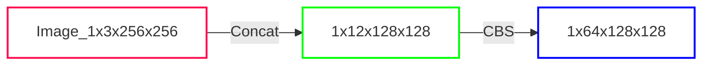
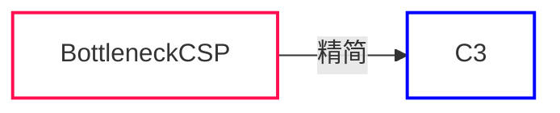

# 1. 前置知识

## 1.1 YOLO 算法的基本思想

<div align=center>
    
</div>

首先通过特征提取网络对输入图像提取特征，得到一定大小的特征图，比如 13x13（相当于416x416 图片大小），然后将输入图像分成 13x13 个 grid cells：
- YOLOv3/v4：如果 GT 中某个目标的<font color='red'>中心</font>坐标落在哪个 grid cell 中，那么就由该 grid cell 来预测该目标。每个 grid cell 都会预测 3 个不同尺度的边界框。
- YOLOv5：不同于 YOLOv3/v4，其 GT <font color='blue'>可以跨层预测</font>，即有些 bbox（anchors）在多个预测层都算正样本，匹配数的正样本范围可以是 3-9 个。

预测得到的输出特征图有两个维度是提取到的特征的维度，比如 13x13，还有一个维度（深度）是 Bx(5+C)，其中：
 - B 表示每个 grid cell 预测的边界框的数量（YOLOv3/v4中是 3 个）
 - C 表示边界框的类别数（没有背景类，所以对于 VOC 数据集是 20）
 - 5 表示 4 个坐标信息和一个目标性得分（objectness score）

## 1.2 损失函数

1. **Classification Loss**：
    - 用于衡量模型对目标的分类准确性。
    - 计算方式通常使用交叉熵损失函数，该函数衡量模型的分类输出与实际类别之间的差异。
    - 对于 YOLOv5，每个目标都有一个对应的类别，分类损失量化了模型对每个目标类别的分类准确性。
2. **Localization Loss：定位损失（预测边界框与 GT 之间的误差）**
    - 用于衡量模型对目标位置的预测准确性。
    - YOLOv5 中采用的是均方差（Mean Squared Error，MSE）损失函数，衡量模型对目标边界框坐标的回归预测与实际边界框之间的差异。
    - 定位损失关注模型对目标位置的精确度，希望模型能够准确地定位目标的边界框。
3. **Confidence Loss：置信度损失（框的目标性 <=> Objectness of the box）**
    - 用于衡量模型对目标存在与否的预测准确性。
    - YOLOv5 中采用的是二元交叉熵损失函数，该函数衡量模型对目标存在概率的预测与实际目标存在的二元标签之间的差异。
    - 置信度损失考虑了模型对每个边界框的目标置信度以及是否包含目标的预测。该损失鼓励模型提高对包含目标的边界框的预测概率，同时减小对不包含目标的边界框的预测概率。

总的损失函数：

$$
\rm Loss = \alpha \times Classification Loss + \beta \times Localization Loss + \gamma \times Confidence Loss
$$

## 1.3 PyTorch2ONNX

Netron 对 `.pt` 格式的兼容性不好，直接打卡无法显示整个网络。因此我们可以使用 YOLOv5 中的 `models/export.py` 脚本将 `.pt` 权重转换为 `.onnx` 格式，再使用 Netron 打开就可以完整地查看 YOLOv5 的整体架构了。

```bash
python export.py \
    --weights weights/yolov5s.pt \
    --imgsz 640 \
    --batch-size 1 \
    --device cpu \
    --simplify \
    --include onnx
```

> 💡 详细可选参数见 `export.py` 文件

## 1.4 YOLOv5 模型结构图

<div align=center>
    
</div>

> 图片来源：霹雳吧啦Wz

# 2. 配置文件

在 `models` 中的 `.yaml` 文件是模型的配置文件

```
models
├── __init__.py
├── tf.py
├── yolo.py
├── yolov5l.yaml
├── yolov5m.yaml
├── yolov5n.yaml
├── yolov5s.yaml
└── yolov5x.yaml
```

我们以 `yolov5s.yaml` 为例展开讲解。

## 2.1 模型深度系数 depth_multiple 和宽度系数 width_multiple

```yaml
# Parameters
nc: 80 # number of classes | 类别数
depth_multiple: 0.33 # model depth multiple | 模型深度: 控制 BottleneckCSP 数
width_multiple: 0.50 # layer channel multiple | 模型宽度: 控制 Conv 通道个数（卷积核数量）
```

- `depth_multiple` 表示 BottleneckCSP、C3 等层缩放因子，将所有的 BottleneckCSP、C3等 模块的 Bottleneck 子模块 乘上该参数得到最终的 Bottleneck 子模块个数
- `width_multiple` 表示卷积通道的缩放因子，就是将配置里的 `backbone` 和 `head` 部分（<font color='red'>其实就是所有的</font>）有关 `Conv` 的通道都需要乘上该系数

通过 `depth_multiple` 和 `width_multiple` 参数可以实现不同复杂度的模型设计：yolov5x、yolov5s、yolov5n、yolov5m、yolov5l。

<details><summary>BottleneckCSP 和 C3 的结构示意图</summary>

<div align=center>
    
    <center>BotteleneckCSP 结构</center>
</div>

> BotteleneckCSP 图片来源: [深入浅出Yolo系列之Yolov5核心基础知识完整讲解](https://zhuanlan.zhihu.com/p/172121380?utm_oi=551376804724793344)

<div align=center>
    
</div>

<div align=center>
    
    <center>C3 结构</center>
</div>

</details>

## 2.2 anchors | 先验框大小

```yaml
anchors:
  - [10, 13, 16, 30, 33, 23] # P3/8
  - [30, 61, 62, 45, 59, 119] # P4/16
  - [116, 90, 156, 198, 373, 326] # P5/32
```

上面就定义了三种尺寸的先验框的大小，其中：

- `P3/8`：`P3` 是层的名称，`8` 表示此时特征图经过的下采样大小 → P3 特征图此时已经过了 8 倍下采样
- `P4/16`：P4 特征图此时已经过了 16 倍下采样
- `P5/32`：P5 特征图此时已经过了 32 倍下采样

> 在 YOLOv5 中，P3 代表 Feature Pyramid Network (FPN) 的第三个级别。FPN 是一种用于目标检测的特征提取网络结构，它通过在不同层级的特征图上应用卷积和上采样操作，以获取具有不同尺度和语义信息的特征图。这些特征图可以用于检测不同大小的目标。
> 
> 在这个模型配置文件中，P3/8 表示 P3 层在输入图像上的缩放因子为 8。缩放因子指的是在输入图像上的每个像素点在 P3 层特征图上所对应的尺寸。通过这种缩放，可以使得 P3 层特征图的尺寸相对于输入图像缩小 8 倍。这种缩放操作帮助模型捕获不同尺度的目标信息。

## 2.3 backbone

```yaml
# YOLOv5 v6.0 backbone
backbone:
  # [from, number, module, args]
  [
    [-1, 1, Conv, [64, 6, 2, 2]], # 0-P1/2
    [-1, 1, Conv, [128, 3, 2]], # 1-P2/4
    [-1, 3, C3, [128]],
    [-1, 1, Conv, [256, 3, 2]], # 3-P3/8
    [-1, 6, C3, [256]],
    [-1, 1, Conv, [512, 3, 2]], # 5-P4/16
    [-1, 9, C3, [512]],
    [-1, 1, Conv, [1024, 3, 2]], # 7-P5/32
    [-1, 3, C3, [1024]],
    [-1, 1, SPPF, [1024, 5]], # 9
  ]
```

首先第一行的备注信息已经告诉我们了，这个 backbone 是 YOLOv5 和 YOLOv6 的 backbone。第二行中有对每一列的说明，其中：
- `from`：表示输入的来源。-1 表示前一层的输出作为输入。
- `number`：表示重复使用该模块的次数。
- `module`：表示使用的特征提取模块类型。
- `args`：表示模块的参数：
  - Conv 层：输出通道数、卷积核大小、步幅和填充
  - C3 层：输出通道数
  - SPPF 层：表示输出通道数和池化的 `kernel_size`。

> 💡 注意：
> - 在之前的版本（v4.0）中，backbone 的第一层是一个 Focus 层，但现在是一个卷积层。
> - 对于 C3 层而言，如果重复了 3 次，且 `stride=2`，那么<font color='red'>只有第一个 C3 模块会进行两倍下采样</font>，<font color='green'>剩下的两个 C3 模块不会进行下采样操作</font>

---

<font color='blue'><b>〔与模型深度系数 depth_multiple 和宽度系数 width_multiple 的联系〕</b></font>

前面说过了 `depth_multiple` 和 `width_multiple` 这两个参数的作用，对于 YOLOv5-s 的 `C3` 层而言，此时的 `depth_multiple=0.33`，那么第二列的 `C3` 层个数并不是实际上的数量，实际上的数量还得乘上 `depth_multiple`：

```yaml
# YOLOv5 v6.0 backbone
backbone:
  # [from, number, module, args]
  [
    [-1, 1, Conv, [64, 6, 2, 2]], # 0-P1/2
    [-1, 1, Conv, [128, 3, 2]], # 1-P2/4
    [-1, 3, C3, [128]],  # 3*0.33=0.99 ---------> 实际使用1个C3
    [-1, 1, Conv, [256, 3, 2]], # 3-P3/8
    [-1, 6, C3, [256]],  # 6*0.33=1.98 ---------> 实际使用2个C3
    [-1, 1, Conv, [512, 3, 2]], # 5-P4/16
    [-1, 9, C3, [512]],  # 9*0.33=2.97 ---------> 实际使用3个C3
    [-1, 1, Conv, [1024, 3, 2]], # 7-P5/32
    [-1, 3, C3, [1024]],  # 3*0.33=0.99 ---------> 实际使用1个C3
    [-1, 1, SPPF, [1024, 5]], # 9
  ]
```

<kbd><b>Q</b>uestion</kbd>：这个计算是怎么进行的？
<kbd><b>A</b>nswer</kbd>：在 `models/yolo.py` 的 `parse_model()` 函数中有写：

```python
# 对 backbone 和 head 中的所有层进行遍历
for i, (f, n, m, args) in enumerate(d["backbone"] + d["head"]):  
    # f <-> from：表示输入的来源。-1 表示前一层的输出作为输入。
    # n <-> number：表示重复使用该模块的次数。
    # m <-> module：表示使用的特征提取模块类型。
    # args：表示模块的参数：

    # 将字符串转换为对应的代码名称（不懂的看一下 eval 函数）
    m = eval(m) if isinstance(m, str) else m  

    # 遍历每一层的参数args
    for j, a in enumerate(args):
        # j: 参数的索引
        # a: 具体的参数
        with contextlib.suppress(NameError):
            # 将数字或字符长转换为代码
            args[j] = eval(a) if isinstance(a, str) else a  # eval strings

    # 先将所有的 number 乘上 深度系数
    n = n_ = max(round(n * gd), 1) if n > 1 else n  # depth gain
```

这个根据向上取整的操作，并确保结果至少为 1

那么对于 `width_multiple` 系数而言，也是一样的（在 YOLOv5s 中, `width_multiple=0.50`）：

```yaml
# YOLOv5 v6.0 backbone
backbone:
  # [from, number, module, args]
  [
    [-1, 1, Conv, [64, 6, 2, 2]], # 0-P1/2  ----------> 64  * 0.5 = 32
    [-1, 1, Conv, [128, 3, 2]], # 1-P2/4    ----------> 128 * 0.5 = 64
    [-1, 3, C3, [128]],  #                  ----------> 128 * 0.5 = 64
    [-1, 1, Conv, [256, 3, 2]], # 3-P3/8    ----------> 256 * 0.5 = 128
    [-1, 6, C3, [256]],  #                  ----------> 256 * 0.5 = 128
    [-1, 1, Conv, [512, 3, 2]], # 5-P4/16   ----------> 512 * 0.5 = 256
    [-1, 9, C3, [512]],  #                  ----------> 512 * 0.5 = 256
    [-1, 1, Conv, [1024, 3, 2]], # 7-P5/32  ----------> 1024* 0.5 = 512
    [-1, 3, C3, [1024]],  #                 ----------> 1024* 0.5 = 512
    [-1, 1, SPPF, [1024, 5]], # 9           ----------> 1024* 0.5 = 512
  ]
```

意思就是说，将所有的卷积层都乘上 `width_multiple`，那我们看一下代码细节（还是在 `models/yolo.py -> parse_model()` 中）：

```python
# 对 backbone 和 head 中的所有层进行遍历
for i, (f, n, m, args) in enumerate(d["backbone"] + d["head"]):  
    # f <-> from：表示输入的来源。-1 表示前一层的输出作为输入。
    # n <-> number：表示重复使用该模块的次数。
    # m <-> module：表示使用的特征提取模块类型。
    # args：表示模块的参数：

    # 将字符串转换为对应的代码名称（不懂的看一下 eval 函数）
    m = eval(m) if isinstance(m, str) else m  

    # 遍历每一层的参数args
    for j, a in enumerate(args):
        # j: 参数的索引
        # a: 具体的参数
        with contextlib.suppress(NameError):
            # 将数字或字符长转换为代码
            args[j] = eval(a) if isinstance(a, str) else a  # eval strings

    # 先将所有的 number 乘上 深度系数
    n = n_ = max(round(n * gd), 1) if n > 1 else n  # depth gain

    # 判断当前模块是否在这个字典中
    if m in {
        Conv,  # Conv + BN + SiLU
        GhostConv,  # 华为在 GhostNet 中提出的Ghost卷积
        Bottleneck,  # ResNet同款
        GhostBottleneck,  # 将其中的3x3卷积替换为GhostConv
        SPP,  # Spatial Pyramid Pooling
        SPPF,  # SPP + Conv
        DWConv,  # 深度卷积
        MixConv2d,  # 一种多尺度卷积层，可以在不同尺度上进行卷积操作。它使用多个不同大小的卷积核对输入特征图进行卷积，并将结果进行融合
        Focus,  # 一种特征聚焦层，用于减少计算量并增加感受野。它通过将输入特征图进行通道重排和降采样操作，以获取更稠密和更大感受野的特征图
        CrossConv,  # 一种交叉卷积层，用于增加特征图的多样性。它使用不同大小的卷积核对输入特征图进行卷积，并将结果进行融合
        BottleneckCSP,  # 一种基于残差结构的卷积块，由连续的Bottleneck模块和CSP（Cross Stage Partial）结构组成，用于构建深层网络，提高特征提取能力
        C3,  # 一种卷积块，由三个连续的卷积层组成。它用于提取特征，并增加网络的非线性能力
        C3TR,  # C3TR是C3的变体，它在C3的基础上添加了Transpose卷积操作。Transpose卷积用于将特征图的尺寸进行上采样
        C3SPP,  # C3SPP是C3的变体，它在C3的基础上添加了SPP操作。这样可以在不同尺度上对特征图进行池化，并增加网络的感受野
        C3Ghost,  # C3Ghost是一种基于C3模块的变体，它使用GhostConv代替传统的卷积操作
        nn.ConvTranspose2d,  # 转置卷积
        DWConvTranspose2d,  # DWConvTranspose2d是深度可分离的转置卷积层，用于进行上采样操作。它使用逐点卷积进行特征图的通道之间的信息整合，以减少计算量
        C3x,  # C3x是一种改进的C3模块，它在C3的基础上添加了额外的操作，如注意力机制或其他模块。这样可以进一步提高网络的性能
    }:
        c1, c2 = ch[f], args[0]  # c1: 卷积的输入通道数, c2: 卷积的输出通道数 | ch[f] 上一次的输出通道数（即本层的输入通道数），args[0]：配置文件中想要的输出通道数
        if c2 != no:  # if not output
            c2 = make_divisible(c2 * gw, ch_mul)  # 让输出通道数*width_multiple

        args = [c1, c2, *args[1:]]  # 此时的c2已经是修改后的c2乘上width_multiple的c2了 | *args[1:]将其他非输出通道数的参数解包

        # 如果当前层是 BottleneckCSP, C3, C3TR, C3Ghost, C3x 中的一种（这些结构都有 Bottleneck 结构）
        if m in {BottleneckCSP, C3, C3TR, C3Ghost, C3x}:
            args.insert(2, n)  # number of repeats | 需要让Bottleneck重复n次
            n = 1  # 重置n（其他层没有 Bottleneck 的模块不需要重复）
    # 如果是BN层
    elif m is nn.BatchNorm2d:
        args = [ch[f]]  # 确定输出通道数
    
    # 如果是 Concat 层
    elif m is Concat:
        c2 = sum(ch[x] for x in f)  # Concat是按着通道维度进行的，所以通道会增加
```

## 2.4 head

```yaml
# YOLOv5 v6.0 head
head: [
    [-1, 1, Conv, [512, 1, 1]],
    [-1, 1, nn.Upsample, [None, 2, "nearest"]],
    [[-1, 6], 1, Concat, [1]], # cat backbone P4
    [-1, 3, C3, [512, False]], # 13

    [-1, 1, Conv, [256, 1, 1]],
    [-1, 1, nn.Upsample, [None, 2, "nearest"]],
    [[-1, 4], 1, Concat, [1]], # cat backbone P3
    [-1, 3, C3, [256, False]], # 17 (P3/8-small)

    [-1, 1, Conv, [256, 3, 2]],
    [[-1, 14], 1, Concat, [1]], # cat head P4
    [-1, 3, C3, [512, False]], # 20 (P4/16-medium)

    [-1, 1, Conv, [512, 3, 2]],
    [[-1, 10], 1, Concat, [1]], # cat head P5
    [-1, 3, C3, [1024, False]], # 23 (P5/32-large)

    [[17, 20, 23], 1, Detect, [nc, anchors]], # Detect(P3, P4, P5)
  ]
```

💡 **Tips**：

- 列的定义和 backbone 是一样的
- 不像 YOLOv3 那样，作者区分了 Neck 和 Head。YOLOv5 的作者没有做出区分，只有 Head，所以在 Head 部分中包含了 PANet 和 Detect 部分。

<kbd><b>Q</b>uestion</kbd>：`Concat` 怎么理解？
<kbd><b>A</b>nswer</kbd>：我们看下面的图。

<div align=center>
    
</div>

这里的 Concat 就是把浅层的特征图与当前特征图进行拼接（沿通道维度），我们看一下源码（在 `models/common.py -> Concat` 中）：

```python
class Concat(nn.Module):
    # Concatenate a list of tensors along dimension
    def __init__(self, dimension=1):
        super().__init__()
        self.d = dimension

    def forward(self, x):
        # 这里的 x 是一个 list，所以可以有多个 Tensor 进行拼接
        return torch.cat(x, self.d)
```

这里需要注意的其实就是 `from`，即谁和谁拼接？下面是解释：

```yaml
# YOLOv5 v6.0 backbone
backbone:
  # [from, number, module, args]
  [
    [-1, 1, Conv, [64, 6, 2, 2]],                # 0-P1/2
    [-1, 1, Conv, [128, 3, 2]],                  # 1-P2/4
    [-1, 3, C3, [128]],                          # 2
    [-1, 1, Conv, [256, 3, 2]],                  # 3-P3/8
    [-1, 6, C3, [256]],                          # 4
    [-1, 1, Conv, [512, 3, 2]],                  # 5-P4/16
    [-1, 9, C3, [512]],                          # 6
    [-1, 1, Conv, [1024, 3, 2]],                 # 7-P5/32
    [-1, 3, C3, [1024]],                         # 8
    [-1, 1, SPPF, [1024, 5]],                    # 9
  ]

# YOLOv5 v6.0 head
head: [
    [-1, 1, Conv, [512, 1, 1]],                   # 10
    [-1, 1, nn.Upsample, [None, 2, "nearest"]],   # 11
    [[-1, 6], 1, Concat, [1]], # cat backbone P4  # 12
    [-1, 3, C3, [512, False]],                    # 13

    [-1, 1, Conv, [256, 1, 1]],                   # 14
    [-1, 1, nn.Upsample, [None, 2, "nearest"]],   # 15
    [[-1, 4], 1, Concat, [1]], # cat backbone P3  # 16
    [-1, 3, C3, [256, False]],                    # 17 (P3/8-small)

    [-1, 1, Conv, [256, 3, 2]],                   # 18
    [[-1, 14], 1, Concat, [1]], # cat head P4     # 19
    [-1, 3, C3, [512, False]],                    # 20 (P4/16-medium)

    [-1, 1, Conv, [512, 3, 2]],                   # 21
    [[-1, 10], 1, Concat, [1]], # cat head P5     # 22
    [-1, 3, C3, [1024, False]],                   # 23 (P5/32-large)

    [[17, 20, 23], 1, Detect, [nc, anchors]], # Detect(P3, P4, P5)  # 24
  ]
```

我们看第一个 Concat：`[[-1, 6], 1, Concat, [1]]`：
- `-1` 表示上一层（即 Concat 的前一层）
- `6` 表示第 6 层，即 backbone 中的 `[-1, 9, C3, [512]]`。

剩下的以此类推。

> ⚠️ <font color='red'>这里的索引是从 0 开始的</font>

在 Head 中，`P` 其实对应的是检测头对应的输出层。比如说 `P3` 就是 8 倍下采样的输出层。我们常用的是 `P3+P4+P5`。为了捕获更小的目标，我们可以使用 `models/hub/yolov5-p2.yaml` 这个模型：

<div align=center>
    
    <center>YOLOv5 模型架构图</center>
</div>

## 2.5 不同规格模型配置

|Model| size<br><sup>(pixels) | mAP<sup>val<br>50-95 | mAP<sup>val<br>50 | Speed<br><sup>CPU b1<br>(ms) | Speed<br><sup>V100 b1<br>(ms) | Speed<br><sup>V100 b32<br>(ms) | params<br><sup>(M) | FLOPs<br><sup>@640 (B) |
|:-|:-:|:-:|:-:|:-:|:-:|:-:|:-:|:-:|
| YOLOv5n| 640| 28.0| 45.7| **45**| **6.3**| **0.6**| **1.9**            | **4.5**|
| YOLOv5s| 640| 37.4| 56.8| 98| 6.4| 0.9| 7.2| 16.5|
| YOLOv5m| 640| 45.4| 64.1| 224| 8.2| 1.7| 21.2| 49.0|
| YOLOv5l| 640| 49.0| 67.3| 430| 10.1| 2.7| 46.5| 109.1|
| YOLOv5x| 640| 50.7| 68.9| 766| 12.1| 4.8| 86.7| 205.7|
||||||||||
| YOLOv5n6| <font color='blue'>1280| 36.0| 54.4| 153| 8.1| 2.1| 3.2| 4.6|
| YOLOv5s6| <font color='blue'>1280| 44.8| 63.7| 385| 8.2| 3.6| 12.6| 16.8|
| YOLOv5m6| <font color='blue'>1280| 51.3| 69.3| 887| 11.1| 6.8| 35.7| 50.0|
| YOLOv5l6| <font color='blue'>1280| 53.7| 71.3| 1784| 15.8| 10.5| 76.8| 111.4|
| YOLOv5x6<br>+ [TTA] | <font color='blue'>1280<br><font color='red'><b>1536| 55.0<br>**55.8**| 72.7<br>**72.7**| 3136<br>-| 26.2<br>-| 19.4<br>-| 140.7<br>-| 209.8<br>-|

<kbd><b>Q</b>uestion</kbd>：YOLOv5s 和 YOLOv5s6 有什么区别？
<kbd><b>A</b>nswer</kbd>：在YOLOv5中，"x6"表示YOLOv5的最大版本，并且具有更深和更宽的网络结构。可见 issue -> [What is the difference between YOLOv5s and YOLOv5s6? #12499](https://github.com/ultralytics/yolov5/issues/12499)

<kbd><b>Q</b>uestion</kbd>：[TTA] 是什么？
<kbd><b>A</b>nswer</kbd>：TTA（Test Time Augmentation）是一种在测试时应用数据增强的技术。在目标检测任务中，通常会在训练时应用数据增强（如随机裁剪、旋转、缩放等）来增加训练样本的多样性，从而提高模型的鲁棒性和泛化能力。而在测试时，为了进一步提高模型的性能，可以应用一些额外的数据增强操作。TTA通过对输入图像进行多种增强操作，生成多个预测结果，并对这些结果进行综合，以提高目标检测模型的性能。可见官方介绍文档 -> [测试时间增强（TTA）](https://docs.ultralytics.com/zh/yolov5/tutorials/test_time_augmentation/)

# 3. 网络架构

## 3.1 〔已废弃〕Focus

Focus 模块是 YOLOv5 中的一种卷积块，主要用于减少计算量和参数数量，并且能够保持较好的感受野。它通过将输入张量进行切分和重排来实现这一目标。目前最新的 YOLOv5 已不再使用该模块，而是使用一个 `kernel=6, stride=2, padding=2` 的 CBS 模块进行了替代。Focus 模块示意图如下所示。

> CBS: `Conv -> BN -> SiLU`

<div align=center>
    
    <center>Focus 模块示意图</center>
</div>

左边是原始输入，Focus 模块会把数据切分为 4 份，每份数据相当于是经过 2 倍下采样得到的，然后再在 Channel 维度进行拼接，最后再进行卷积操作。

我们看一下 Focus 模块的源码：

```python
class Focus(nn.Module):
    # Focus wh information into c-space | 将宽高信息聚焦到通道维度中
    def __init__(self, c1, c2, k=1, s=1, p=None, g=1, act=True):  # ch_in, ch_out, kernel, stride, padding, groups
        super().__init__()
        self.conv = Conv(c1 * 4, c2, k, s, p, g, act=act)
        # self.contract = Contract(gain=2)

    def forward(self, x):  # x(b,c,w,h) -> y(b,4c,w/2,h/2)
        return self.conv(torch.cat((x[..., ::2, ::2], x[..., 1::2, ::2], x[..., ::2, 1::2], x[..., 1::2, 1::2]), 1))
        # return self.conv(self.contract(x))
```

其中的 `Conv` 模块如下：

```python
class Conv(nn.Module):
    # Standard convolution with args(ch_in, ch_out, kernel, stride, padding, groups, dilation, activation)
    default_act = nn.SiLU()  # default activation

    def __init__(self, c1, c2, k=1, s=1, p=None, g=1, d=1, act=True):
        super().__init__()
        self.conv = nn.Conv2d(c1, c2, k, s, autopad(k, p, d), groups=g, dilation=d, bias=False)
        self.bn = nn.BatchNorm2d(c2)
        self.act = self.default_act if act is True else act if isinstance(act, nn.Module) else nn.Identity()

    def forward(self, x):
        return self.act(self.bn(self.conv(x)))

    def forward_fuse(self, x):  # 正常调用不会使用这个函数
        return self.act(self.conv(x))
```

⚠️ Note: `Conv` 模块使用的激活函数是 SiLU 而非 ReLU。

那我们使用 Focus 模块试一试。

```python
import torch
import torch.nn as nn
import os
import sys
import platform
from pathlib import Path
FILE = Path(__file__).resolve()
ROOT = FILE.parents[1]  # YOLOv5 root directory
if str(ROOT) not in sys.path:
    sys.path.append(str(ROOT))  # add ROOT to PATH
if platform.system() != "Windows":
    ROOT = Path(os.path.relpath(ROOT, Path.cwd()))  # relative


from common import Conv


class Focus(nn.Module):
    # Focus wh information into c-space
    def __init__(self, c1, c2, k=1, s=1, p=None, g=1, act=True):  # ch_in, ch_out, kernel, stride, padding, groups
        super().__init__()
        self.conv = Conv(c1 * 4, c2, k, s, p, g, act=act)
        # self.contract = Contract(gain=2)

    def forward(self, x):  # x(b,c,w,h) -> y(b,4c,w/2,h/2)
        _concat = torch.cat((x[..., ::2, ::2], x[..., 1::2, ::2], x[..., ::2, 1::2], x[..., 1::2, 1::2]), 1)
        _conv = self.conv(_concat)
        print(f"{_concat = }")
        print(f"{_concat.shape = }")
        print(f"{_concat.dtype = }\n")
        # print(f"{_conv = }")
        print(f"{_conv.shape = }")
        print(f"{_conv.dtype = }\n")
        return _conv
        # return self.conv(self.contract(x))
    
    
if __name__ == "__main__":
    # 创建tensor
    input_tensor = torch.tensor(data=[[[
        [11, 12, 13, 14],
        [21, 22, 23, 24],
        [31, 32, 33, 34],
        [41, 42, 43, 44]]]], dtype=torch.float32)
    print(f"{input_tensor = }")
    print(f"{input_tensor.shape = }")
    print(f"{input_tensor.dtype = }\n")
    
    # 创建Focus子模块模型对象
    Sub_module = Focus(1, 64).eval()

    # 前向推理
    output = Sub_module(input_tensor)
```

我们看一下输出：

```
input_tensor = tensor([[[[11., 12., 13., 14.],
                         [21., 22., 23., 24.],
                         [31., 32., 33., 34.],
                         [41., 42., 43., 44.]]]])
input_tensor.shape = torch.Size([1, 1, 4, 4])
input_tensor.dtype = torch.float32

_concat = tensor([[[[11., 13.],
                    [31., 33.]],

                   [[21., 23.],
                    [41., 43.]],
           
                   [[12., 14.],
                    [32., 34.]],
           
                   [[22., 24.],
                    [42., 44.]]]])
_concat.shape = torch.Size([1, 4, 2, 2])
_concat.dtype = torch.float32

_conv.shape = torch.Size([1, 64, 2, 2])
_conv.dtype = torch.float32
```

〔分析〕假设我们的输入如下：

```
input_tensor = tensor([[[[11., 12., 13., 14.],
                         [21., 22., 23., 24.],
                         [31., 32., 33., 34.],
                         [41., 42., 43., 44.]]]])
input_tensor.shape = torch.Size([1, 1, 4, 4])
input_tensor.dtype = torch.float32
```

那么经过 `torch.cat((x[..., ::2, ::2], x[..., 1::2, ::2], x[..., ::2, 1::2], x[..., 1::2, 1::2]), 1)` 之后变为：

```
_concat = tensor([[[[11., 13.],
                    [31., 33.]],

                   [[21., 23.],
                    [41., 43.]],
           
                   [[12., 14.],
                    [32., 34.]],
           
                   [[22., 24.],
                    [42., 44.]]]])
_concat.shape = torch.Size([1, 4, 2, 2])
_concat.dtype = torch.float32
```

之后再经过一个卷积（`self.conv(_concat)`）得到：

```
_conv.shape = torch.Size([1, 64, 2, 2])
_conv.dtype = torch.float32
```

可以看到，我们的输入从原来的 `[1, 1, 4, 4]` 变为了 `[1, 4, 2, 2]`，之后再通过一个 CBS 卷积得到 Focus 的最终输入 `[1, 64, 2, 2]`。

那假设我们的输入是 [1, 3, 256, 256]，那么是怎么变化的呢，结果如下：

```
input_tensor.shape = torch.Size([1, 3, 256, 256])
_concat.shape      = torch.Size([1, 12, 128, 128])
_conv.shape        = torch.Size([1, 64, 128, 128])
```

<div align=center>



</div>

💡 总结：
1. Focus 会对输入图片进行切片操作：`[N, C, H, W] -> [N, C*4, H//2, W//2]`
2. 之后通过一个卷积，变成我们想要的 channel：`[N, C*4, H//2, W//2] -> [N, C_out, H//2, W//2]`

---

可能有同学比较好奇，这个 Focus 模块出自哪篇论文，其实并没有论文，这是 YOLOv5 作者自己提出来的，下面是他的解释 [@YOLOv5 Focus() Layer #3181](https://github.com/ultralytics/yolov5/discussions/3181)

> 我收到了很多关于 YOLOv5 🚀 Focus 层的兴趣，因此我在这里写了一个简短的文档。在将 YOLOv3 架构演进为 YOLOv5 时，我自己创建了 Focus 层，并没有采用其他来源的方法。Focus 层的主要目的是**减少层的数量、减少参数、减少 FLOPS、减少 CUDA 内存，同时最小程度地影响 mAP，提高前向和后向推理速度**。
>
> YOLOv5 的 Focus 层用单一层替换了 YOLOv3 的前 3 层：
> <div align=center>
>          width=100%>
>     <center></center>
> </div>
>
> 在大量尝试和分析了替代 YOLOv3 输入层的不同设计后，我最终选择了当前的 Focus 层设计。这些尝试包括对前向/后向/内存进行实时分析以及对完整的 300 个 Epoch 的 COCO 训练进行比较，以确定其对 mAP 的影响。您可以使用 YOLOv5 的 `profile()` 函数很容易地对比 Focus 层和替代的 YOLOv3 原始层进行分析：
>
> ```python
> # Profile
> import torch.nn as nn
> from models.common import Focus, Conv, Bottleneck
> from utils.torch_utils import profile 
> 
> m1 = Focus(3, 64, 3)  # YOLOv5 Focus layer
> m2 = nn.Sequential(Conv(3, 32, 3, 1), Conv(32, 64, 3, 2), Bottleneck(64, 64))  # YOLOv3 first 3 layers
> 
> results = profile(input=torch.randn(16, 3, 640, 640), ops=[m1, m2], n=10, device=0)  # profile both 10 times at batch-size 16
> ```
> 在 YOLOv5 Google Colab 笔记本中，我得到了以下结果：
>
> ```
> YOLOv5 🚀 v5.0-405-gfad57c2 torch 1.9.0+cu102 CUDA:0 (Tesla T4, 15109.75MB)
> 
>       Params      GFLOPs  GPU_mem (GB)  forward (ms) backward (ms)                   input                  output
>         7040       23.07         2.259         16.65          54.1       (16, 3, 640, 640)      (16, 64, 320, 320)  # Focus
>        40160       140.7         7.522         77.86         331.9       (16, 3, 640, 640)      (16, 64, 320, 320)
> 
>       Params      GFLOPs  GPU_mem (GB)  forward (ms) backward (ms)                   input                  output
>         7040       23.07         0.000         882.1          2029       (16, 3, 640, 640)      (16, 64, 320, 320)  # Focus
>        40160       140.7         0.000          4513          8565       (16, 3, 640, 640)      (16, 64, 320, 320)
> ```

## 3.2 CSPNet（Cross Stage Partial Network）

CSPNet（Cross Stage Partial Network，跨阶段局部网络）旨在提高模型的性能，其的核心思想是在网络中引入 Cross Stage 信息传递，以促进不同阶段之间的信息流动，从而提高网络的感知能力。

<div align=center>
    
    <center>将 CSPNet 应用于其他架构。CSPNet 也可以应用于 ResNet 和 ResNeXt，这些架构如图 5 所示。由于只有一半的特征通道经过 Res(X)Blocks，因此不再需要引入瓶颈层。这使得在浮点操作（FLOPs）固定时，内存访问成本（MAC）的理论下限更低。</center>
</div>

在 ResNet 中，特征图会经过一系列的 Bottleneck 模块；而在 CSPNet 中，特征图会走两条支路，Part 1 中会直接短路，而 Part 2 中会经过 Bottleneck 模块，之后在 Partial Transition 中进行融合。

> 根据论文 [CSPNet: A New Backbone that can Enhance Learning Capability of CNN](https://openaccess.thecvf.com/content_CVPRW_2020/papers/w28/Wang_CSPNet_A_New_Backbone_That_Can_Enhance_Learning_Capability_of_CVPRW_2020_paper.pdf)，输入应该分为两个部分，分别通过两个独立的分支进行处理。但是在你的实现中，两个分支都使用相同的输入，且没有进行任何分割。

YOLOv5 的作者也对其进行了回答：

> @abhiagwl4262 是的，输入并没有分割，它们在这里用于两个地方，我认为这与实际的 CSPNet 实现是一致的。

我们看一下 BottleneckCSP 的源码：

```python
class BottleneckCSP(nn.Module):
    # CSP Bottleneck https://github.com/WongKinYiu/CrossStagePartialNetworks
    def __init__(self, c1, c2, n=1, shortcut=True, g=1, e=0.5):  # ch_in, ch_out, number, shortcut, groups, expansion
        super().__init__()
        c_ = int(c2 * e)  # hidden channels
        self.cv1 = Conv(c1, c_, 1, 1)  # CBS
        self.cv2 = nn.Conv2d(c1, c_, 1, 1, bias=False)  # 普通卷积
        self.cv3 = nn.Conv2d(c_, c_, 1, 1, bias=False)  # 普通卷积
        self.cv4 = Conv(2 * c_, c2, 1, 1)  # CBS
        self.bn = nn.BatchNorm2d(2 * c_)  # applied to cat(cv2, cv3)
        self.act = nn.SiLU()
        self.m = nn.Sequential(*(Bottleneck(c_, c_, shortcut, g, e=1.0) for _ in range(n)))

    def forward(self, x):
        _conv1 = self.cv1(x)  # 经过 1x1 卷积（CBS）提升维度
        _m = self.m(_conv1)  # 经过一系列 Bottleneck 模块
        y1 = self.cv3(_m)  # 〔右边经过Bottleneck的分支〕再经过一个 1x1 普通卷积，没有升维也没有降维: c_
        y2 = self.cv2(x)  # 〔左边不经过Bottleneck的分支〕对原始的输入用 1x1 普通卷积降为: c_

        _concat = torch.cat((y1, y2), 1)  # 沿channel维度进行拼接: 2*c_
        _bn = self.bn(_concat)  # 经过BN层
        _act = self.act(_bn)  # 经过SiLU层
        _conv4 = self.cv4(_act)  # 使用 1x1 卷积（CBS）对融合后的特征图进行降维: c2 <=> c_out
        return _conv4
```

可以看到，`y1` 就是一个特征图经过普通的 Bottleneck 得到的；`y2` 则只经过一个 1x1 卷积进行了通道维度对齐。

其实看了 BottleneckCSP 代码后我有一个疑问：

```python
y1 = self.cv3(_m)  # 〔右边经过Bottleneck的分支〕再经过一个 1x1 卷积，没有升维也没有降维: c_
```

这行代码有什么意义呢？因为 1x1 卷积本身的参数量就非常少，更何况 `in_channel == out_channel`，且 `kernel_size=1`，`stride=1`，这好像并没有做什么。让我们看一下 GPT 的回答：

> `self.cv3` 是一个具有 `c_` 输入通道和 `c_` 输出通道的 1x1 卷积层。这个操作应用于特征 `_m`，并且不改变通道数。这一层的目的是引入非线性，并允许网络从经过转换的特征中学习复杂的模式。
> 
> 结果 `y1` 是网络右侧分支的输出，经历了 bottleneck 模块的转换和额外的 1x1 卷积（`self.cv3`）。这个分支以一种捕捉复杂模式和经过 bottleneck 模块学到的相互作用的方式处理特征。
> 
> 总之，`y1 = self.cv3(_m)` 的目的在于引入非线性，并捕捉经过右侧分支 bottleneck 模块转换的特征中的复杂模式。两个分支的组合有助于提供丰富的信息，以便进行后续处理。

这个回答看似有一定的道理，但我感觉可能意义不大 :joy:。

## 3.3 C3（CSP Bottleneck with 3 convolutions）

现在的 YOLOv5 默认使用的 Bottleneck 模块并不是 BottleneckCSP 模块而是 C3 模块了，下面是 C3 模块的源码：

```python
class C3(nn.Module):
    # CSP Bottleneck with 3 convolutions
    def __init__(self, c1, c2, n=1, shortcut=True, g=1, e=0.5):  # ch_in, ch_out, number, shortcut, groups, expansion
        super().__init__()
        c_ = int(c2 * e)  # hidden channels
        self.cv1 = Conv(c1, c_, 1, 1)  # CBS
        self.cv2 = Conv(c1, c_, 1, 1)  # CBS
        self.cv3 = Conv(2 * c_, c2, 1)  # CBS, optional act=FReLU(c2)
        self.m = nn.Sequential(*(Bottleneck(c_, c_, shortcut, g, e=1.0) for _ in range(n)))

    def forward(self, x):
        _conv1 = self.cv1(x)  # 输入fmap进行1x1卷积（CBS）降维: c1 -> c_
        _m = self.m(_conv1)  # 降维的fmap经过bottleneck: c_
        _conv2 = self.cv2(x)  # 输入fmap进行1x1卷积（CBS）降维: c1 -> c_
        _concat = torch.cat((_m, _conv2), 1)  # 沿channel维度进行拼接: 2*c_
        _conv3 = self.cv3(_concat)  # 将融合的fmap经过1x1卷积（CBS）升维: 2*c_ -> c2
        return _conv3
```

可以看到：
1. C3 模块中所有的卷积均为 CBS（Conv -> BN -> SiLU），不像 BottleneckCSP 中除了 CBS 外还会使用普通卷积。
2. 还需要注意的是，在 BottleneckCSP 中，1x1 卷积用的是普通卷积，而在 C3 模块中，1x1 卷积用的是 CBS。
3. 去掉了令我感到疑惑的 1x1 卷积 :joy:

除了上述 3 点外，剩下的与 BottleneckCSP 是一致的。可以这么说，C3 就是 BottleneckCSP 的高效版。

<div align=center>



</div>

我们再看一篇论文：[Model Compression Methods for YOLOv5: A Review](https://arxiv.org/pdf/2307.11904.pdf)，里面有这样一张图：

<div align=center>
    
    <center></center>
</div>

> 图 3：C3 和 BottleNeckCSP 模块的结构。使用 CSP 策略使 C3 模块通过残差块和稠密块加强信息流，同时解决冗余梯度的问题。BottleNeck 块在 C3 和 BottleNeckCSP 中被使用，并被标记为紫色，它可以有两种配置；$S/\overline{S}$。这里，$S$ 表示激活的快捷连接，而 $\overline{S}$ 表示没有任何跳跃连接的简单 BottleNeck。Backbone 中的 C3 块使用带有快捷连接的 BottleNecks，而 Neck 中的 C3 块则不使用。

从上面的图片我们可以看到，我们的说法遗漏了一个点：

- 在 BottleneckCSP 中，`concat` 之后会先经过一个 `BN -> SiLU` 的结构，最后再降维，而在 C3 中，没有这个 `BN -> SiLU` 结构。

我们再看一篇论文 [MC-YOLOv5: A Multi-Class Small Object Detection Algorithm](https://www.researchgate.net/figure/a-The-structure-of-C3-whose-input-is-H-W-C-The-C3-module-contained-three-basic_fig3_372876505)：

<div align=center>
    
    <center></center>
</div>

> (a) C3 的结构，其输入为 H × W × C。C3 模块包含三个基本卷积层（CBS）和 n 个 Bottleneck 模块（n 由配置文件和网络深度确定），基本卷积的激活函数从 LeakyReLU 变为 SiLU。
> 
> (b) bottleneck-CSP 的结构，其输入为 H × W × C。它由普通卷积、CBL 和 ResUnit 结构组成。

和我们的说法没有冲突，那么我们可以再次总结我们的结论 —— <font color='red'>C3 与 BottleneckCSP 的区别</font>：

1. C3 模块中所有的卷积均为 CBS（包括 1x1 卷积）
2. 删除了 Bottleneck 后的 1x1 卷积
3. C3 删除了 `concat` 结构后的 `BN -> SiLU`

---

<kbd><b>Q</b>uestion</kbd>：C3 模块为什么叫做 C3？
<kbd><b>A</b>nswer</kbd>：因为它的全称是：CSP Bottleneck with 3 convolutions。

## 3.4 SPP（Spatial Pyramid Pooling）

在 YOLOv5 中，SPP（Spatial Pyramid Pooling）是一种用于提取多尺度特征的技术，它有助于网络对不同尺度的目标进行检测。SPP 通过在不同大小的网格上进行池化操作，从而在不引入额外参数的情况下，捕捉输入特征图的不同尺度上的语义信息。

