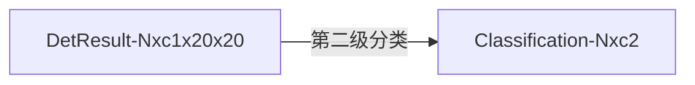

# 6. YOLOv5 项目目录结构

```j
./                           # 📂YOLOv5项目的根目录
├── CITATION.cff                # (Citation File Format): 这是一个用于描述如何引用该软件项目的文件。它通常包含了软件的作者、版本号、发布年份、DOI（数字对象标识符）等信息。这有助于学术研究者在撰写论文时正确引用该软件，确保软件开发者的贡献得到认可。
├── CONTRIBUTING.md             # 这是一个指导文件，为潜在的贡献者提供了如何为项目贡献代码、文档或其他资源的指南。它可能包括项目的编码标准、提交准则、代码审查流程等。
├── LICENSE                     # 这是软件项目的许可证文件，规定了软件的使用、复制、修改和分发等权利和义务。开源项目的许可证通常遵循OSI（开放源代码倡议）认证的许可证，例如GPL、MIT、Apache等。
├── Le0v1n                      # 📂自己使用的测试代码
│   ├── plots-scheduler.py          # 绘制scheduler用的脚本
│   ├── results                     # 📂存放绘制结果的文件夹
│   ├── test-SPP.py                 # 测试SPP模块 
│   ├── test-SPP_SPPF-2.py          # 测试SPP模块
│   ├── test-SPP_SPPF.py            # 测试SPP模块
│   ├── test-focus-1.py             # 测试focus模块
│   └── test-focus-2.py             # 测试focus模块
├── README.md                   # 说明文件
├── README.zh-CN.md             # 说明文件（中文版）
├── __pycache__                 # 📂__pycache__目录和其中的.pyc文件是Python字节码的缓存。当Python源代码文件（.py）被解释器执行时，它会自动生成与源文件相对应的字节码文件（.pyc）。这些字节码文件可以被Python解释器更快地加载和执行，因为它们省去了每次运行时都需要将源代码转换为字节码的过程。
│   └── val.cpython-38.pyc          # 字节码缓存
├── benchmarks.py               # 给定模型（默认为YOLOv5s），该脚本会自动运行所有支持的格式（如onnx、openvino...），在coco128数据集上进行测试
├── classify                    # 📂将YOLOv5用于分类任务（Classification）
│   ├── predict.py                  # 预测脚本（images, videos, directories, globs, YouTube, webcam, streams, etc.）
│   ├── train.py                    # 训练基于YOLOv5的分类模型
│   ├── tutorial.ipynb              # 相关教程
│   └── val.py                      # 验证脚本
├── data                        # 📂存放不同数据集的配置文件
│   ├── Argoverse.yaml              # 一个用于自动驾驶的大规模、高多样性的数据集，包含了高清地图、传感器数据和交通代理的标注。它旨在支持自动驾驶系统的研究和开发，特别是那些依赖于高度详细的地图数据和精确的动态环境理解的系统。
│   ├── GlobalWheat2020.yaml        # 一个用于小麦叶锈病检测的数据集。它包含了大量的图像，旨在支持机器学习模型的发展，以便自动检测和识别这种作物病害
│   ├── ImageNet.yaml               # 一个大型的视觉数据库，用于视觉对象识别软件研究。它包含数百万个标注过的图像，涵盖了成千上万的类别。ImageNet挑战赛促进了深度学习在图像识别领域的快速发展
│   ├── ImageNet10.yaml             # ImageNet的子集，包含了20张图像（train和val各10张）。通常用于教育和研究目的，以便于在有限的资源和时间内进行实验。
│   ├── ImageNet100.yaml            # ImageNet的子集，包含了200张图像（train和val各100张）。通常用于教育和研究目的，以便于在有限的资源和时间内进行实验。
│   ├── ImageNet1000.yaml           # ImageNet的子集，包含了2000张图像（train和val各1000张）。通常用于教育和研究目的，以便于在有限的资源和时间内进行实验。
│   ├── Objects365.yaml             # 一个大规模的对象检测数据集，包含了365个类别的物体。它旨在推动计算机视觉领域的研究，特别是在对象检测和识别方面
│   ├── SKU-110K.yaml               # 一个大规模的商品识别数据集，包含了超过110,000个SKU（库存单位）的图像。它用于训练和评估机器学习模型，以便在零售环境中自动识别商品
│   ├── VOC.yaml                    # 一组用于视觉对象分类和检测的图像。它由PASCAL网络组织创建，并用于PASCAL VOC挑战赛，这是一个年度的计算机视觉竞赛
│   ├── VisDrone.yaml               # 一个大规模的无人机视角图像和视频数据集，用于视觉对象检测和跟踪。它涵盖了多种场景和对象类别，旨在支持无人机在智能监控和交通监控等领域的应用
│   ├── coco.yaml                   # 一个大型的图像数据集，用于对象检测、分割和字幕生成。它包含了超过30万张图像，涵盖了80个类别，并提供了精细的分割掩码和图像描述
│   ├── coco128-seg.yaml            # COCO128-seg是COCO数据集的子集，包含了80个类别的128张图像和相应的分割标注。通常用于原型设计和benchmark的测试。
│   ├── coco128.yaml                # COCO128是COCO数据集的子集，包含了80个类别的128张图像。通常用于原型设计和benchmark的测试。
│   ├── hyps                        # 📂存放超参数配置文件
│   │   ├── hyp.Objects365.yaml         # 用于Objects365数据集的超参数配置
│   │   ├── hyp.VOC.yaml                # 用于VOC数据集的超参数配置
│   │   ├── hyp.no-augmentation.yaml    # 不使用任何数据增强的超参数配置
│   │   ├── hyp.scratch-high.yaml       # 用于COCO数据集的“从头开始训练的”的超参数配置（拥有比较强的数据增强效果）
│   │   ├── hyp.scratch-low.yaml        # 用于COCO数据集的“从头开始训练的”的超参数配置（拥有比较弱的数据增强效果）
│   │   └── hyp.scratch-med.yaml        # 用于COCO数据集的“从头开始训练的”的超参数配置（拥有中间水平的数据增强效果）
│   ├── images                      # 📂存放用于测试的图片
│   │   ├── bus.jpg                    # 测试图片1
│   │   └── zidane.jpg                 # 测试图片2：“zidane.jpg” 是一张著名的图片，它展示了法国足球运动员齐内丁·齐达内（Zinedine Zidane）在2006年世界杯决赛中头顶意大利后卫马尔坎达利（Marco Materazzi）的场景。这张图片因其捕捉到了一个极具争议和情感高涨的体育时刻而闻名。
│   ├── scripts                     # 📂存放一些下载数据集、模型权重的shell脚本文件
│   │   ├── download_weights.sh         # 下载YOLOv5预训练权重的shell脚本
│   │   ├── get_coco.sh                 # 下载coco数据集（全量）的shell脚本
│   │   ├── get_coco128.sh              # 下载coco128数据集（coco128+coco128-seg）的shell脚本
│   │   ├── get_imagenet.sh             # 下载imagenet数据集（全量）的shell脚本
│   │   ├── get_imagenet10.sh           # 下载imagenet10数据集（20张图片的子集）的shell脚本
│   │   ├── get_imagenet100.sh          # 下载imagenet100数据集（200张图片的子集）的shell脚本
│   │   └── get_imagenet1000.sh         # 下载imagenet1000数据集（200张图片的子集）的shell脚本
│   └── xView.yaml                  # 一个用于目标检测的大规模遥感图像数据集，主要用于推动在空间图像上的计算机视觉研究和应用。这个数据集专注于针对自然灾害和人为事件的图像进行目标检测，如洪水、火灾、风暴等
├── detect.py                   # YOLOv5检测任务的预测脚本（images, videos, directories, globs, YouTube, webcam, streams, etc.）
├── dir_tree.txt                # 存放该项目下所有文件的说明文件（metadata）
├── export.py                   # 将YOLOv5模型导出为其他格式的模型（包含分类模型、检测模型、分割模型），支持众多格式：PyTorch、TorchScript、ONNX、OpenVINO、TensorRT、CoreML、TensorFlow SavedModel、TensorFlow GraphDef、TensorFlow Lite、TensorFlow Edge TPU、TensorFlow.js、PaddlePaddle
├── export2onnx.sh              # 自己编写的一个shell脚本，目的是方便复用
├── hubconf.py                  # 下载ultralytics提供的YOLOv5模型用的脚本（可以返回一个model变量供我们使用）
├── models                      # 📂存放YOLOv5的模型文件
│   ├── __init__.py                 # 用于将目录标识为包含Python模块的包
│   ├── common.py                   # 模型共用的模块存放文件，包括：SPPF、Conv、focus等等
│   ├── experimental.py             # 一些实验性的模块和函数
│   ├── hub                         # 📂存放YOLOv5的【目标检测】模型定义文件
│   │   ├── anchors.yaml                # 存放一些默认的Anchors尺寸模板
│   │   ├── yolov3-spp.yaml             # 使用SPP和YOLOv3模型定义文件
│   │   ├── yolov3-tiny.yaml            # YOLOv3-tiny的模型定义文件
│   │   ├── yolov3.yaml                 # YOLOv3的模型定义文件
│   │   ├── yolov5-bifpn.yaml           # 使用bi-FPN的YOLOv5模型定义文件
│   │   ├── yolov5-fpn.yaml             # 使用FPN的YOLOv5模型定义文件
│   │   ├── yolov5-p2.yaml              # 添加p2检测头的YOLOv5模型定义文件（4个检测头，默认为YOLOv5l）--> 小目标
│   │   ├── yolov5-p34.yaml             # 只使用p3和p4检测头的YOLOv5模型定义文件（默认使用的是p3、p4、p5）（2个检测头，默认为YOLOv5l）
│   │   ├── yolov5-p6.yaml              # 添加p6检测头的YOLOv5模型定义文件（4个检测头，默认为YOLOv5l）--> 大目标
│   │   ├── yolov5-p7.yaml              # 添加p6和p7检测头的YOLOv5模型定义文件（5个检测头，默认为YOLOv5l）--> 大大目标
│   │   ├── yolov5-panet.yaml           # 添加PaNet结构的模型定义文件
│   │   ├── yolov5l6.yaml               # 添加p6检测头的YOLOv5l模型定义文件（4个检测头）--> 大目标
│   │   ├── yolov5m6.yaml               # 添加p6检测头的YOLOv5m模型定义文件（4个检测头）--> 大目标
│   │   ├── yolov5n6.yaml               # 添加p6检测头的YOLOv5n模型定义文件（4个检测头）--> 大目标
│   │   ├── yolov5s-LeakyReLU.yaml      # 使用LeakyReLU的YOLOv5s模型定义文件
│   │   ├── yolov5s-ghost.yaml          # 使用Ghost模块替换普通卷积的的YOLOv5s模型定义文件
│   │   ├── yolov5s-transformer.yaml    # 使用Transform模块（C3TR）替换Backbone中最后一个C3模块的YOLOv5s模型定义文件
│   │   ├── yolov5s6.yaml               # 添加p6检测头的YOLOv5s模型定义文件（4个检测头）--> 大目标
│   │   └── yolov5x6.yaml               # 添加p6检测头的YOLOv5x模型定义文件（4个检测头）--> 大目标
│   ├── segment                     # 📂存放YOLOv5的【语义分割】模型定义文件
│   │   ├── yolov5l-seg.yaml            # 基于YOLOv5l的分割模型
│   │   ├── yolov5m-seg.yaml            # 基于YOLOv5m的分割模型
│   │   ├── yolov5n-seg.yaml            # 基于YOLOv5n的分割模型
│   │   ├── yolov5s-seg.yaml            # 基于YOLOv5s的分割模型
│   │   └── yolov5x-seg.yaml            # 基于YOLOv5x的分割模型
│   ├── tf.py                       # TensorFlow、Keras、TFLite版本的YOLOv5
│   ├── yolo.py                     # return model的脚本（包含了Classification、Det、Seg）
│   ├── yolo.sh                     # 对应的shell脚本，方便复用
│   ├── yolov5l.yaml                # YOLOv5l的目标检测模型定义
│   ├── yolov5m.yaml                # YOLOv5m的目标检测模型定义
│   ├── yolov5n.yaml                # YOLOv5n的目标检测模型定义
│   ├── yolov5s.yaml                # YOLOv5s的目标检测模型定义
│   └── yolov5x.yaml                # YOLOv5x的目标检测模型定义
├── pyproject.toml              # Python 项目的核心配置文件，它用于定义项目的元数据、依赖关系、构建系统和其它相关的配置信息。这个文件遵循 TOML（Tom’s Obvious, Minimal Language）格式，这是一种旨在作为小型的配置文件的人性化数据序列化格式。
├── requirements.txt            # 运行YOLOv5项目所需的第三方依赖库，可以通过 pip install -r requirements.txt 进行自动安装
├── runs                        # 📂YOLOv5运行产生的结果
│   └── train                       # 📂训练产生的结果的存放文件夹
│       ├── exp                         # 📂实验名称
│           ├── events.out.tfevents.1706866890.DESKTOP-PTPE509.23412.0  # TensorBoard的日志文件
│           ├── hyp.yaml                    # 模型训练使用的超参数
│           ├── labels.jpg                  # 训练集中所有标签（类别）的分布
│           ├── labels_correlogram.jpg      # 展示不同标签之间的相关性
│           ├── opt.yaml                    # 模型训练使用的配置
│           ├── train_batch0.jpg            # 训练过程中的几个批次（batch）的可视化结果
│           ├── train_batch1.jpg            # 训练过程中的几个批次（batch）的可视化结果
│           ├── train_batch2.jpg            # 训练过程中的几个批次（batch）的可视化结果
│           └── weights                     # 存放模型权重
├── segment                     # 📂分割任务使用的脚本
│   ├── predict.py                  # 分割任务的预测脚本
│   ├── train.py                    # 分割任务的训练脚本
│   ├── tutorial.ipynb              # 分割任务的教程
│   └── val.py                      # 分割任务的验证脚本
├── train.py                    # 目标检测任务的训练脚本
├── train.sh                    # 目标检测任务的训练脚本的shell文件，便于复用
├── tutorial.ipynb              # 目标检测任务的教程
├── utils                       # 📂常用工具（提高代码复用率）
│   ├── __init__.py
│   ├── __pycache__
│   ├── activations.py              # 存放常见的激活函数
│   ├── augmentations.py            # 存放常见的数据增强方法
│   ├── autoanchor.py               # 自动计算anchor大小的脚本
│   ├── autobatch.py                # 自动计算batch大小的脚本
│   ├── aws                         # 📂便于亚马逊aws服务的工具
│   │   ├── __init__.py
│   │   ├── mime.sh
│   │   ├── resume.py
│   │   └── userdata.sh
│   ├── callbacks.py                # 存放常用的回调函数
│   ├── dataloaders.py              # 存放常见的数据加载器
│   ├── docker                      # 📂用于构建Docker镜像的指令集
│   │   ├── Dockerfile                  # 定义如何构建应用程序的默认Docker镜像
│   │   ├── Dockerfile-arm64            # 类似于Dockerfile，但是它是专门为arm64架构（也称为aarch64）构建的
│   │   └── Dockerfile-cpu              # 仅使用CPU资源的场景构建的Docker镜像
│   ├── downloads.py                # 常用的下载工具
│   ├── flask_rest_api              # 📂轻量级的Web应用框架所用的api
│   │   ├── README.md                   # 说明文件
│   │   ├── example_request.py          # request的示例代码
│   │   └── restapi.py                  # Flask应用程序的主要入口点，其中定义了API的路由、视图函数以及可能的数据模型
│   ├── general.py                  # 更加通用的工具集合
│   ├── google_app_engine           # 📂Google App Engine相关文件
│   │   ├── Dockerfile                  # 定义如何构建Docker镜像
│   │   ├── additional_requirements.txt # 列出了项目所需的额外Python库
│   │   └── app.yaml                    # Google App Engine的配置文件，它告诉App Engine如何运行你的应用程序
│   ├── loggers                     # 📂存放日志相关文件
│   │   ├── __init__.py
│   │   ├── clearml                     # 📂用于机器学习实验跟踪、管理和自动化的平台
│   │   │   ├── README.md
│   │   │   ├── __init__.py
│   │   │   ├── clearml_utils.py
│   │   │   └── hpo.py
│   │   ├── comet                       # 📂用于机器学习实验跟踪的平台
│   │   │   ├── README.md
│   │   │   ├── __init__.py
│   │   │   ├── comet_utils.py
│   │   │   ├── hpo.py
│   │   │   └── optimizer_config.json
│   │   └── wandb                       # 📂用于机器学习实验跟踪的平台
│   │       ├── __init__.py
│   │       └── wandb_utils.py
│   ├── loss.py                     # 常用的损失函数
│   ├── metrics.py                  # 常用的指标评测方法
│   ├── plots.py                    # 常用的画图方法
│   ├── segment                     # 📂与分割任务相关的工具
│   │   ├── __init__.py
│   │   ├── augmentations.py            # 分割任务的数据增强方式
│   │   ├── dataloaders.py              # 分割任务的数据加载器
│   │   ├── general.py                  # 分割任务的更加通用的工具
│   │   ├── loss.py                     # 分割任务的损失函数
│   │   ├── metrics.py                  # 分割任务的评测指标
│   │   └── plots.py                    # 分割任务的画图方法
│   ├── torch_utils.py                  # 与PyTorch相关的工具
│   └── triton.py                       # NVIDIA的开源推理服务平台相关工具
├── val.py                      # 目标检测任务的验证脚本
└── weights                     # 📂存放预训练权重的文件夹
    ├── yolov5s-sim.onnx            # yolov5s的simplify版本的onnx模型
    ├── yolov5s.onnx                # yolov5s的onnx模型
    └── yolov5s.pt                  # yolov5s的pt模型

39 directories, 190 files
```

# 7. 激活函数：非线性处理单元（Activation Functions）

> 之前也写过相关的博客：[深度学习中常用激活函数分析](https://blog.csdn.net/weixin_44878336/article/details/125119242)

<div align=center>
    
    <center></center>
</div>

> Mish 激活函数论文链接：[Mish: A Self Regularized Non-Monotonic Neural Activation Function](https://arxiv.org/vc/arxiv/papers/1908/1908.08681v1.pdf)

<div align=center>
    
    <center></center>
</div>

> 💡 SiLU（Sigmoid-weighted Linear Unit）激活函数和Swish激活函数实际上是相同的。Swish激活函数是由Google的研究人员在2017年提出的，其定义为 $ f(x) = x \cdot \sigma(x) $，其中 $ \sigma(x) $ 是Sigmoid函数。Swish函数因其简单性和在深度学习模型中的有效性而受到关注。
> 
> 后来，为了简化名称并避免潜在的商标问题，Swish激活函数有时被称为SiLU。因此，当SiLU和Swish被提及时，它们实际上是指同一个激活函数。

<div align=center>
    
    <center></center>
</div>

<div align=center>
    
    <center></center>
</div>

⚠️ 目前 YOLOv5 主要用的激活函数是 SiLU 激活函数

# 8. 常用的模型组件

## 8.1 autopad

```python
def autopad(k, p=None, d=1):  # kernel, padding, dilation
    """autopad 的💡函数💡，其目的是为了在深度学习中的卷积操作中自动计算填充（padding）
    的数量，以确保输出的特征图（feature map）具有与输入相同的宽度和高度，
    这通常被称为 “same” 卷积

    Args:
        k (int): 卷积核大小
        p (_type_, optional): padding大小. Defaults to None.
        d (int, optional): 膨胀率. Defaults to 1.

    Returns:
        int: 一个使得特征图大小不变的padding_size
    """
    # Pad to 'same' shape outputs
    if d > 1:  # 如果涉及到膨胀卷积
        k = d * (k - 1) + 1 if isinstance(k, int) else [d * (x - 1) + 1 for x in k]  # actual kernel-size
    if p is None:  # 如果没有padding_size
        p = k // 2 if isinstance(k, int) else [x // 2 for x in k]  # auto-pad
    return p
```

1. 如果膨胀率 `d` 大于 1，则首先计算实际的有效卷积核大小。这是通过将原始核大小 `k` 乘以膨胀率 `d` 并相应地调整来完成的。如果 `k` 是一个整数，这个操作会直接应用于 `k`；如果 `k` 是一个列表或元组，则对每个维度分别进行计算。
2. 如果用户没有指定填充 `p`（即 `p` 是 `None`），则函数会自动计算填充。这是通过将卷积核大小 `k`（或其膨胀后的对应值）除以 2 来完成的。如果 `k` 是一个整数，这个操作会直接应用于 `k`；如果 `k` 是一个列表或元组，则对每个维度分别进行计算。
3. 最后，函数返回计算出的填充大小 `p`。

这个函数在实现卷积神经网络时非常有用，因为它确保了卷积操作后特征图的尺寸与输入图像的尺寸相同，这对于需要保持空间维度的任务（例如图像分割、目标检测等）是非常重要的。

## 8.2 Conv（标准卷积）

```python
class Conv(nn.Module):
    """YOLOv5中的标准卷积

    Args:
        c1 (_type_): 输入通道大小
        c2 (_type_): 输出通道大小
        k (int, optional): 卷积核大小. Defaults to 1.
        s (int, optional): 步长大小. Defaults to 1.
        p (_type_, optional): padding大小. Defaults to None.
        g (int, optional): 分组数. Defaults to 1.
        d (int, optional): 膨胀率. Defaults to 1.
        act (bool, optional): 是否使用激活函数. Defaults to True.
    """
    # Standard convolution with args(ch_in, ch_out, kernel, stride, padding, groups, dilation, activation)
    default_act = nn.SiLU()  # default activation

    def __init__(self, c1, c2, k=1, s=1, p=None, g=1, d=1, act=True):
        super().__init__()
        self.conv = nn.Conv2d(c1, c2, k, s, autopad(k, p, d), groups=g, dilation=d, bias=False)
        self.bn = nn.BatchNorm2d(c2)
        self.act = self.default_act if act is True else act if isinstance(act, nn.Module) else nn.Identity()

    def forward(self, x):
        return self.act(self.bn(self.conv(x)))

    def forward_fuse(self, x):
        return self.act(self.conv(x))
```

`Conv` 封装了一个标准的卷积层，包括批量归一化（Batch Normalization）和激活函数。这个类的设计目的是为了方便地构建卷积神经网络中的卷积层。总的来说，这个类是一个方便的包装器，它将卷积、批量归一化和激活函数结合在一起，使得在构建卷积神经网络时可以更加简洁和模块化。

## 8.3 DWConv

```python
class DWConv(Conv):
    # 深度可分离卷积
    def __init__(self, c1, c2, k=1, s=1, d=1, act=True):  # ch_in, ch_out, kernel, stride, dilation, activation
        super().__init__(c1, c2, k, s, g=math.gcd(c1, c2), d=d, act=act)
```

> 💡 `math.gcd()`：求最大公约数

简单来说，深度可分离卷积虽然分为PWConv和DWConv，但其实就是修改Conv的参数即可实现。

## 8.4 TransformerLayer（Transformer层）

> 之前写过的博客：[ViT (Visual Transformer)](https://blog.csdn.net/weixin_44878336/article/details/124450647)

```python
class TransformerLayer(nn.Module):
    # Transformer layer https://arxiv.org/abs/2010.11929 (LayerNorm layers removed for better performance)
    """Transformer层

    Args:
        c (_type_): 输入和输出的特征维度
        num_heads (_type_): 多头注意力机制中的头数
    """
    def __init__(self, c, num_heads):
        super().__init__()
        self.q = nn.Linear(c, c, bias=False)
        self.k = nn.Linear(c, c, bias=False)
        self.v = nn.Linear(c, c, bias=False)
        self.ma = nn.MultiheadAttention(embed_dim=c, num_heads=num_heads)
        self.fc1 = nn.Linear(c, c, bias=False)
        self.fc2 = nn.Linear(c, c, bias=False)

    def forward(self, x):
        # ma: multi-head attention
        x = self.ma(self.q(x), self.k(x), self.v(x))[0] + x
        x = self.fc2(self.fc1(x)) + x
        return x
```

`TransformerLayer` 类实现了一个 Transformer 层的结构。以下是 它的各个部分和它们的作用：

1. **初始化方法 `__init__`**：
   - `c`：输入和输出的特征维度。
   - `num_heads`：多头注意力机制中的头数。
   - `self.q`、`self.k`、`self.v`：这三个 `nn.Linear` 实例分别用于查询（query）、键（key）和值（value）的线性变换。它们将输入特征映射到 `c` 维度。
   - `self.ma`：这个 `nn.MultiheadAttention` 实例用于实现多头注意力机制，它接受输入特征的维度 `c`，并将其分割为 `num_heads` 个头，每个头都有自己的权重。
   - `self.fc1` 和 `self.fc2`：这两个 `nn.Linear` 实例用于前馈神经网络，它们在多头注意力机制之后应用。
2. **前向传播方法 `forward`**：
   - 首先，多头注意力机制计算查询、键和值的注意力权重，并将它们组合起来。
   - 然后，将注意力输出与输入 `x` 相加，这被称为残差连接，它是 Transformer 中的一个关键组成部分，有助于信息流动和训练稳定性。
   - 接下来，前馈神经网络由两个线性层组成，第一个线性层后接一个 ReLU 激活函数，第二个线性层不使用激活函数。
   - 最后，将前馈神经网络的输出与输入 `x` 再次相加，并进行残差连接。
需要注意的是，这个 `TransformerLayer` 类省略了 LayerNorm 层，根据注释，这是为了获得更好的性能。LayerNorm 是一种正则化技术，用于标准化每个特征，但有时在某些 Transformer 架构中省略它。
总的来说，`TransformerLayer` 类定义了一个标准的 Transformer 层，它包括多头注意力机制和前馈神经网络，这些都是构建 Transformer 模型所需的基本组件。

## 8.5 Bottleneck、BottleneckCSP、C3 模块

关于 Bottleneck、BottleneckCSP、C3 模块的介绍请见：[〔Part1〕YOLOv5：原理+源码分析（配置文件、网络模块、损失函数、跨网格匹配策略）](https://blog.csdn.net/weixin_44878336/article/details/136025658)。

```python
class Bottleneck(nn.Module):
    # Standard bottleneck
    def __init__(self, c1, c2, shortcut=True, g=1, e=0.5):  # ch_in, ch_out, shortcut, groups, expansion
        super().__init__()
        c_ = int(c2 * e)  # hidden channels
        self.cv1 = Conv(c1, c_, 1, 1)
        self.cv2 = Conv(c_, c2, 3, 1, g=g)
        self.add = shortcut and c1 == c2

    def forward(self, x):
        if self.add:
            return x + self.cv2(self.cv1(x)) 
        else:
            return self.cv2(self.cv1(x))


class BottleneckCSP(nn.Module):
    # CSP Bottleneck https://github.com/WongKinYiu/CrossStagePartialNetworks
    def __init__(self, c1, c2, n=1, shortcut=True, g=1, e=0.5):  # ch_in, ch_out, number, shortcut, groups, expansion
        super().__init__()
        c_ = int(c2 * e)  # hidden channels
        self.cv1 = Conv(c1, c_, 1, 1)  # CBS
        self.cv2 = nn.Conv2d(c1, c_, 1, 1, bias=False)  # 普通卷积
        self.cv3 = nn.Conv2d(c_, c_, 1, 1, bias=False)  # 普通卷积
        self.cv4 = Conv(2 * c_, c2, 1, 1)  # CBS
        self.bn = nn.BatchNorm2d(2 * c_)  # applied to cat(cv2, cv3)
        self.act = nn.SiLU()
        self.m = nn.Sequential(*(Bottleneck(c_, c_, shortcut, g, e=1.0) for _ in range(n)))

    def forward(self, x):
        _conv1 = self.cv1(x)  # 经过 1x1 卷积（CBS）提升维度
        _m = self.m(_conv1)  # 经过一系列 Bottleneck 模块
        y1 = self.cv3(_m)  # 〔右边经过Bottleneck的分支〕再经过一个 1x1 普通卷积，没有升维也没有降维: c_
        y2 = self.cv2(x)  # 〔左边不经过Bottleneck的分支〕对原始的输入用 1x1 普通卷积降为: c_

        _concat = torch.cat((y1, y2), 1)  # 沿channel维度进行拼接: 2*c_
        _bn = self.bn(_concat)  # 经过BN层
        _act = self.act(_bn)  # 经过SiLU层
        _conv4 = self.cv4(_act)  # 使用 1x1 卷积（CBS）对融合后的特征图进行降维: c2 <=> c_out
        return _conv4


class C3(nn.Module):
    # CSP Bottleneck with 3 convolutions
    def __init__(self, c1, c2, n=1, shortcut=True, g=1, e=0.5):  # ch_in, ch_out, number, shortcut, groups, expansion
        super().__init__()
        c_ = int(c2 * e)  # hidden channels
        self.cv1 = Conv(c1, c_, 1, 1)  # CBS
        self.cv2 = Conv(c1, c_, 1, 1)  # CBS
        self.cv3 = Conv(2 * c_, c2, 1)  # CBS, optional act=FReLU(c2)
        self.m = nn.Sequential(*(Bottleneck(c_, c_, shortcut, g, e=1.0) for _ in range(n)))

    def forward(self, x):
        _conv1 = self.cv1(x)  # 输入fmap进行1x1卷积（CBS）降维: c1 -> c_
        _m = self.m(_conv1)  # 降维的fmap经过bottleneck: c_
        _conv2 = self.cv2(x)  # 输入fmap进行1x1卷积（CBS）降维: c1 -> c_
        _concat = torch.cat((_m, _conv2), 1)  # 沿channel维度进行拼接: 2*c_
        _conv3 = self.cv3(_concat)  # 将融合的fmap经过1x1卷积（CBS）升维: 2*c_ -> c2
        return _conv3
```

总结来说如下图所示：

<div align=center>
    
    <center></center>
</div>

## 8.6 TransformerBlock（基于TransformerLayer的Block结构）

```python
class TransformerBlock(nn.Module):
    # Vision Transformer https://arxiv.org/abs/2010.11929
    """基于TransformerLayer实现的一个block结构

    Args:
        c1 (_type_): 输入特征的通道数
        c2 (_type_): 输出特征的通道数
        num_heads (_type_): 多头注意力机制中的头数
        num_layers (_type_): TransformerLayer 的数量
    """
    def __init__(self, c1, c2, num_heads, num_layers):
        super().__init__()
        self.conv = None
        if c1 != c2:
            self.conv = Conv(c1, c2)
        self.linear = nn.Linear(c2, c2)  # learnable position embedding
        # tr: transformer
        self.tr = nn.Sequential(*(TransformerLayer(c2, num_heads) for _ in range(num_layers)))
        self.c2 = c2

    def forward(self, x):
        if self.conv is not None:  # conv存在（说明c1≠c2）
            x = self.conv(x)  # Channel对齐

        b, _, w, h = x.shape  # 获取shape

        p = x.flatten(2).permute(2, 0, 1)
        return self.tr(p + self.linear(p)).permute(1, 2, 0).reshape(b, self.c2, w, h)
```

`TransformerBlock` 类实现了一个 Vision Transformer（ViT）模型的 Block 结构。以下是它的各个部分和它们的作用：

1. **初始化方法 `__init__`**：
   - `c1`：输入特征的通道数。
   - `c2`：输出特征的通道数。
   - `num_heads`：多头注意力机制中的头数。
   - `num_layers`：Transformer 层（在这里是指 `TransformerLayer` 实例）的数量。
   - `self.conv`：如果输入和输出通道数 `c1` 和 `c2` 不相等，则使用 `Conv` 类创建一个卷积层，用于特征转换。
   - `self.linear`：一个 `nn.Linear` 实例，用于学习位置嵌入，这是 Transformer 中的一个关键组成部分，用于编码输入特征的位置信息。
   - `self.tr`：一个由 `TransformerLayer` 实例组成的序列，用于构建多层 Transformer 层。
   - `self.c2`：保存输出通道数 `c2`，用于后续的 reshape 操作。
2. **前向传播方法 `forward`**：
   - 如果存在 `self.conv`，则首先将输入 `x` 通过卷积层。
   - 然后，将输入展平为二维张量，并重排其维度，以便在多头注意力机制中使用。
   - 通过 `TransformerLayer` 序列处理展平的输入，每个 `TransformerLayer` 都会添加位置嵌入。
   - 最后，将输出的张量重排回原始的三维形状，并返回。

⚠️ `TransformerBlock` 类中的 `TransformerLayer` 实例没有包含 LayerNorm 层，目的是为了获得更好的性能

## 8.7 CrossConv

```python
class CrossConv(nn.Module):
    # Cross Convolution Downsample
    """_summary_

    Args:
        c1 (_type_): 输入特征的通道数
        c2 (_type_): 输出特征的通道数
        k (int, optional): 卷积核的大小. Defaults to 3.
        s (int, optional): 卷积的步长. Defaults to 1.
        g (int, optional): 分组卷积的组数. Defaults to 1.
        e (float, optional): 扩展因子，用于调整输出通道数. Defaults to 1.0.
        shortcut (bool, optional): 是否使用捷径连接. Defaults to False.
    """
    def __init__(self, c1, c2, k=3, s=1, g=1, e=1.0, shortcut=False):
        # ch_in, ch_out, kernel, stride, groups, expansion, shortcut
        super().__init__()
        c_ = int(c2 * e)  # hidden channels
        self.cv1 = Conv(c1, c_, (1, k), (1, s))
        self.cv2 = Conv(c_, c2, (k, 1), (s, 1), g=g)
        self.add = shortcut and c1 == c2

    def forward(self, x):
        if self.add:
            return x + self.cv2(self.cv1(x))  
        else:
            return self.cv2(self.cv1(x))
```

`CrossConv` 类实现了一种特殊的卷积操作，通常**用于深度学习中的下采样阶段**。这个类的设计目的是为了在保持性能的同时，通过使用不同大小的卷积核和步长来实现特征图的尺寸变化。
以下是它各个部分和作用：

1. **初始化方法 `__init__`**：
   - `c1`：输入特征的通道数。
   - `c2`：输出特征的通道数。
   - `k`：卷积核的大小，默认值为 3。
   - `s`：卷积的步长，默认值为 1。
   - `g`：分组卷积的组数，默认值为 1。
   - `e`：扩展因子，用于调整输出通道数，默认值为 1.0。
   - `shortcut`：布尔值，表示是否使用捷径连接（shortcut connection），默认值为 False。
   - `c_`：计算出的隐藏通道数，它是 `c2` 通道数与扩展因子 `e` 的乘积。
   - `self.cv1`：第一个卷积层，它使用 1x`k` 的卷积核，步长为 1x`s`。
   - `self.cv2`：第二个卷积层，它使用 `k`x1 的卷积核，步长为 `s`x1，并且可能使用分组卷积。
   - `self.add`：一个布尔值，如果 `shortcut` 为 True 并且输入和输出通道数相等（`c1 == c2`），则设置为 True，表示将卷积输出与输入相加。
2. **前向传播方法 `forward`**：
   - 如果 `shortcut` 为 True 并且输入和输出通道数相等，则将卷积输出与输入相加。
   - 否则，只使用卷积输出。

<div align=center>
    
    <center></center>
</div>

总的来说，`CrossConv` 类定义了一个特殊的卷积模块，它**通过使用不同大小的卷积核和步长来实现下采样**，同时可以选择性地使用捷径连接，这有助于保持特征的连贯性和模型的性能。这种结构在构建轻量级网络或移动设备上的模型时非常有用。

## 8.8 C3x（使用了CrossConv的C3模块）

```python
class C3x(C3):
    # C3 module with cross-convolutions
    def __init__(self, c1, c2, n=1, shortcut=True, g=1, e=0.5):
        super().__init__(c1, c2, n, shortcut, g, e)
        c_ = int(c2 * e)
        self.m = nn.Sequential(*(CrossConv(c_, c_, 3, 1, g, 1.0, shortcut) for _ in range(n)))
```

可以看到，C3x 模块继承自 C3 模块，`forward` 也是继承，没有修改，仅仅把 `self.m` 进行了修改。

## 8.9 C3TR （使用TransformerBlock替换Bottleneck）

```python
class C3TR(C3):
    # C3 module with TransformerBlock()
    def __init__(self, c1, c2, n=1, shortcut=True, g=1, e=0.5):
        super().__init__(c1, c2, n, shortcut, g, e)
        c_ = int(c2 * e)
        self.m = TransformerBlock(c_, c_, 4, n)
```

与 `C3x` 模块类似，`C3TR` 模块也是继承自 `C3`，但原来的Bottleneck结构被替换为`TransformerBlock`模块。

## 8.10 SPP 和 SPPF

<div align=center>
    
    <center>YOLOv5-SPP v.s. YOLOv5-SPPF</center>
</div>

```python
class SPP(nn.Module):
    # Spatial Pyramid Pooling (SPP) layer https://arxiv.org/abs/1406.4729
    def __init__(self, c1, c2, k=(5, 9, 13)):
        super().__init__()
        c_ = c1 // 2  # hidden channels
        self.cv1 = Conv(c1, c_, 1, 1)
        self.cv2 = Conv(c_ * (len(k) + 1), c2, 1, 1)  # 根据MaxPooling的个数自动调整，假设有3个MaxPooling则3+1=4
        self.m = nn.ModuleList([nn.MaxPool2d(kernel_size=x, stride=1, padding=x // 2) for x in k])

    def forward(self, x):
        x = self.cv1(x)  # 先经过一个 1x1 卷积调整通道数
        _maxpools = [m(x) for m in self.m]  # 经过一些列MaxPooling
        _concat = torch.cat([x] + _maxpools, 1)  # 将x与MaxPooling沿着通道维度拼接
        _conv2 = self.cv2(_concat)  # 最后经过一个1x1卷积调整通道数
            return _conv2


class SPPF(nn.Module):
    # Spatial Pyramid Pooling - Fast (SPPF) layer for YOLOv5 by Glenn Jocher
    def __init__(self, c1, c2, k=5):  # equivalent to SPP(k=(5, 9, 13))
        super().__init__()
        c_ = c1 // 2  # hidden channels
        self.cv1 = Conv(c1, c_, 1, 1)
        self.cv2 = Conv(c_ * 4, c2, 1, 1)  # 这里不再是按照MaxPooling的个数进行的，而是固定为4
        self.m = nn.MaxPool2d(kernel_size=k, stride=1, padding=k // 2)  # 这里的模块不再是一系列，而是一个，且kernel_size被固定了！

    def forward(self, x):
        x = self.cv1(x)  # 先经过一个 1x1 卷积
        y1 = self.m(x)  # 经过一个 5x5 的MaxPooling
        y2 = self.m(y1)  # 再经过一个 5x5 的MaxPooling
        _m = self.m(y2)  # 再再经过一个 5x5 的MaxPooling
        _concat = torch.cat((x, y1, y2, _m), 1)  # 将3个经过 MaxPooling 的和没有经过的沿着通道维度拼接
        _conv2 = self.cv2(_concat)  # 最后经过一个 1x1 卷积调整通道数
        return _conv2
```

## 8.11 Concat 类

> 💡 这里把 `torch.cat()` 这个函数弄成一个类，目的是为了让其可以在配置文件中使用。

```python
class Concat(nn.Module):
    # Concatenate a list of tensors along dimension
    def __init__(self, dimension=1):
        super().__init__()
        self.d = dimension

    def forward(self, x):
        # 这里的 x 是一个 list，所以可以有多个 Tensor 进行拼接
        return torch.cat(x, self.d)
```

## 8.12 Classify（用于第二级分类）

```python
class Classify(nn.Module):
    # YOLOv5 classification head, i.e. x(b,c1,20,20) to x(b,c2)
    def __init__(
        self, c1, c2, k=1, s=1, p=None, g=1, dropout_p=0.0
    ):  # ch_in, ch_out, kernel, stride, padding, groups, dropout probability
        super().__init__()
        c_ = 1280  # efficientnet_b0 size
        self.conv = Conv(c1, c_, k, s, autopad(k, p), g)
        self.pool = nn.AdaptiveAvgPool2d(1)  # to x(b,c_,1,1)
        self.drop = nn.Dropout(p=dropout_p, inplace=True)
        self.linear = nn.Linear(c_, c2)  # to x(b,c2)

    def forward(self, x):
        if isinstance(x, list):
            x = torch.cat(x, 1)
        return self.linear(self.drop(self.pool(self.conv(x)).flatten(1)))
```

`Classify` 类的作用是将输入特征图转换为最终的分类输出。总的来说，它定义了一个分类头部模块，它将 YOLOv5 模型中的特征图转换为最终的分类结果，适用于目标检测任务。



# 9. Detect组件

```python
class Detect(nn.Module):
    # YOLOv5 Detect head for detection models
    stride = None  # strides computed during build
    dynamic = False  # force grid reconstruction
    export = False  # export mode

    def __init__(self, nc=80, anchors=(), ch=(), inplace=True):  # detection layer
        super().__init__()
        self.nc = nc  # number of classes
        self.no = nc + 5  # number of outputs per anchor
        self.nl = len(anchors)  # number of detection layers
        self.na = len(anchors[0]) // 2  # number of anchors
        self.grid = [torch.empty(0) for _ in range(self.nl)]  # init grid
        self.anchor_grid = [torch.empty(0) for _ in range(self.nl)]  # init anchor grid
        self.register_buffer("anchors", torch.tensor(anchors).float().view(self.nl, -1, 2))  # shape(nl,na,2)
        self.m = nn.ModuleList(nn.Conv2d(x, self.no * self.na, 1) for x in ch)  # output conv
        self.inplace = inplace  # use inplace ops (e.g. slice assignment)

    def forward(self, x):
        z = []  # inference output
        for i in range(self.nl):
            x[i] = self.m[i](x[i])  # conv
            bs, _, ny, nx = x[i].shape  # x(bs,255,20,20) to x(bs,3,20,20,85)
            x[i] = x[i].view(bs, self.na, self.no, ny, nx).permute(0, 1, 3, 4, 2).contiguous()

            if not self.training:  # inference
                if self.dynamic or self.grid[i].shape[2:4] != x[i].shape[2:4]:
                    self.grid[i], self.anchor_grid[i] = self._make_grid(nx, ny, i)

                if isinstance(self, Segment):  # (boxes + masks)
                    xy, wh, conf, mask = x[i].split((2, 2, self.nc + 1, self.no - self.nc - 5), 4)
                    xy = (xy.sigmoid() * 2 + self.grid[i]) * self.stride[i]  # xy
                    wh = (wh.sigmoid() * 2) ** 2 * self.anchor_grid[i]  # wh
                    y = torch.cat((xy, wh, conf.sigmoid(), mask), 4)
                else:  # Detect (boxes only)
                    xy, wh, conf = x[i].sigmoid().split((2, 2, self.nc + 1), 4)
                    xy = (xy * 2 + self.grid[i]) * self.stride[i]  # xy
                    wh = (wh * 2) ** 2 * self.anchor_grid[i]  # wh
                    y = torch.cat((xy, wh, conf), 4)
                z.append(y.view(bs, self.na * nx * ny, self.no))

        return x if self.training else (torch.cat(z, 1),) if self.export else (torch.cat(z, 1), x)

    def _make_grid(self, nx=20, ny=20, i=0, torch_1_10=check_version(torch.__version__, "1.10.0")):
        d = self.anchors[i].device
        t = self.anchors[i].dtype
        shape = 1, self.na, ny, nx, 2  # grid shape
        y, x = torch.arange(ny, device=d, dtype=t), torch.arange(nx, device=d, dtype=t)
        yv, xv = torch.meshgrid(y, x, indexing="ij") if torch_1_10 else torch.meshgrid(y, x)  # torch>=0.7 compatibility
        grid = torch.stack((xv, yv), 2).expand(shape) - 0.5  # add grid offset, i.e. y = 2.0 * x - 0.5
        anchor_grid = (self.anchors[i] * self.stride[i]).view((1, self.na, 1, 1, 2)).expand(shape)
        return grid, anchor_grid
```


# 参考

1. 〔视频教程〕[YOLOv5入门到精通！不愧是公认的讲的最好的【目标检测全套教程】同济大佬12小时带我们从入门到进阶（YOLO/目标检测/环境部署+项目实战/Python/）](https://www.bilibili.com/video/BV1YG411876u?p=14)