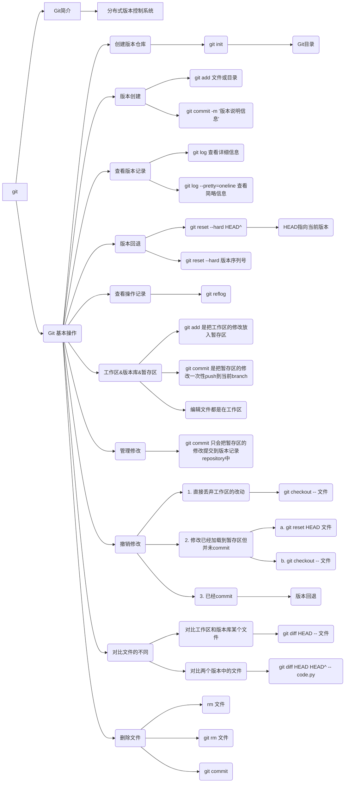

# 1. GIT 的介绍

## 1.1 历史

Git 是目前全球范围内极为先进的分布式版本控制系统。1991年，Linus 创立了开源的 Linux，随后，Linux 系统持续发展壮大，现已成为全球最大的服务器系统软件。尽管 Linus 创造了 Linux，但其成长壮大离不开全球志愿者的热情参与。

那么，面对全球范围内的志愿者为 Linux 编写代码，Linux 的代码管理又该如何进行呢？实际上，在 2002 年之前，全球志愿者通过发送 diff 文件的方式向 Linus 提交源代码，然后由 Linus 亲自手工合并代码。

或许我们会好奇，为什么 Linus 不将 Linux 代码放入版本控制系统呢？毕竟，像 CVS、SVN 这样的免费版本控制系统已经存在。原因在于，Linus 坚决反对 CVS 和 SVN，这些集中式版本控制系统不仅速度慢，而且必须联网才能使用。尽管有一些商用的版本控制系统性能更优，但它们与 Linux 的开源精神背道而驰。然而到了 2002 年，Linux 系统已发展十年，代码库庞大到 Linus 难以继续手工管理，社区成员对此也表达了强烈不满。

因此 Linus 选择了一个商业版本控制系统 BitKeeper，BitKeeper 的母公司 BitMover 出于人道主义精神，授权 Linux 社区免费使用。然而，这段和谐的局面在 2005 年被打破，因为 Linux 社区聚集了许多杰出人才，其中一些人试图破解 BitKeeper 协议，结果被 BitMover 公司发现，于是该公司决定收回 Linux 社区的免费使用权。

后来，Linus 仅用两周时间，利用 C 语言编写了一个分布式版本控制系统，即 Git。短短一个月内，Linux 系统的源码已由 Git 管理。Git 迅速成为最流行的分布式版本控制系统，尤其是 2008 年 GitHub 网站上线，为开源项目提供免费的 Git 存储，无数开源项目纷纷迁移至 GitHub，如 jQuery、PHP、Ruby 等。

## 1.2 Git 的两个特点

1. **版本控制功能**：Git 有效地解决了多人协作开发时的代码同步问题，并提供了便捷的历史代码追溯能力。
2. **分布式架构**：Git 作为一个分布式版本控制系统，允许同一仓库被部署到多台计算机上。首先，选择一台电脑作为中央服务器，它需要全天候运行。其他用户可以从这台中央服务器克隆仓库到自己的设备上，并推送自己的提交到服务器仓库，同时也可以从服务器仓库拉取其他用户的提交。我们可以选择自行搭建这台服务器，也可以利用 GitHub 等在线服务。

# 2. 在 Ubuntu 中安装 Git

参考: [https://git-scm.com/download/linux](https://git-scm.com/download/linux)

```bash
sudo apt-get install git
```

我们可以为外部参数添加一个 `-y`，以保持 `Yes` 的状态。

在安装 git 时，我们可以通过 `git` 来查看它。

```bash
git
```

## 2.1 设置 Git

```bash
# 设置账号名
git config --global user.name "Leovin"

# 设置 e-mail
git config --global user.email "Xxx@xxx.com"
```

## 2.2 查看 Git 的配置文件

```bash
# 方法1
cat .gitconfig

# 方法2
git config --list
```

## 2.3 查看 Git 的版本

```bash
git --version
```

# 3. 创建一个本地仓库（Local Repository）

1. 在本地的硬盘中创建一个本地仓库

```bash
cd
mkdir git-repository
cd git-repository
```

2. 新建一个文件夹 `repository`，在 `repository` 文件夹下创建一个版本库 (Repository)，命令如下：

```bash
git init
ls -al
```

可以看到在 `repository` 文件夹下创建了一个 `.git` 的隐藏文件夹，这就是版本库目录，如下图所示。

<a></a>
<div align=center>
    
    <center></center>
</div></br>

# 4. 创建与回滚版本

## 4.1 用法

1. 在 `git-repository` 文件夹下创建一个文件 `code.py`，编辑内容如下：

```bash
# 创建文件
touch code.py

# 写入内容
echo "print(f'This is a test file.')" >> code.py

# 查看文件
cat code.py
```

2. 使用如下两条命令可以创建一个版本：

```bash
# 将文件置于暂存状态
git add code.py  

# 将文件推送到当前分支
git commit -m "This is version 1.0"  
```

3. 使用如下命令可以查看版本记录：

```bash
git log
```

4. 继续编辑 `code.py`，在里面增加一行， 并查看版本记录

```bash
# 查看文件
cat code.py

# 将所有改动的文件置于暂存状态
git add .

# 将本次改动推送到当前分支
git commit -m "version 2"

# 查看改动记录
git log
```

<a></a>
<div align=center>
    
    <center></center>
</div></br>

5. 现在若想回到某一个版本，可以使用如下命令：

```bash
git reset --hard HEAD^
```

其中，`HEAD` 表示当前最新版本，`HEAD^` 表示当前版本的前一个版本，`HEAD^^` 表示当前版本的 `前前个版本`，也可以使用 `HEAD~1` 表示当前版本的 `前一个版本`，`HEAD~100` 表示当前版本的 `前100版本`。

<a></a>
<div align=center>
    
    <center></center>
</div></br>

---

<kbd><b>Question</b></kbd>：假如我们现在又想回到`版本 2`，这个时候怎么办？

<kbd><b>Answer</b></kbd>：

```bash
git reset --hard 版本号
```

从上面可以看到版本 2 的版本号为：

<a></a>
<div align=center>
    
    <center></center>
</div></br>

执行命令后：

<a></a>
<div align=center>
    
    <center></center>
</div></br>

---

<kbd><b>Question</b></kbd>： 假如说上面的终端已经关了改怎么回退版本?

<kbd><b>Answer</b></kbd>：我们执行如下命令将版本回退到版本 1。

<a></a>
<div align=center>
    
    <center></center>
</div></br>

下面把终端关了，然后再打开终端，发现之前版本 2 的版本号看不到了。那么怎么再回到版本2呢？`git reflog` 命令可以查看我们的操作记录。

```bash
git reflog
```

<a></a>
<div align=center>
    
    <center></center>
</div></br>

可以看到版本 2 的版本号，我们再使用如下命令进行版本回退，版本重新回到了版本 2。

<a></a>
<div align=center>
    
    <center></center>
</div></br>

当然，其实我们使用 `HEAD~1` 和 `HEAD~2` 也可以，但并不能保证在多人协同时的准确性。

```bash
git reset --head HEAD~1
```

<a></a>
<div align=center>
    
    <center></center>
</div></br>

## 4.2 工作目录（Working Directory）和仓库（Repository）

### 4.2.1 Working Directory（Working Directory）

电脑中的目录，比如我们的 `git-repository`，就是一个工作目录，也称之为工作区。

### 4.2.2 Repository（版本库）

工作目录有一个隐藏目录 `.git`，这个不是工作区，而是 `git` 的仓库，也称之为版本库。

### 4.2.3 Stage / Index（暂存区）

Git 的版本库 (Repository) 里存了很多东西，其中最重要的就是称为 `stage` (或者叫 `index`) 的暂存区，还有**Git为我们自动创建的第一个分支 `master`**，以及**指向 `master` 的一个指针叫 `HEAD`**。

> 💡  现在 Git 自动创建的第一个分支不叫 `master` 了，而是 `main` 分支，其实二者含义是差不多的。

因为我们创建 Git 版本库时，Git 自动为我们创建了 唯一的 main 分支，所以，`git commit` **默认**就是往 main 分支上提交更改。

我们可以简单理解为：<font color='red'><b>需要提交的'文件修改'通通放到'暂存区'，然后，一次性提交'暂存区'的所有修改</b></font>。

<a></a>
<div align=center>
    
    <center></center>
</div></br>

> 👀  OBS：这里的 master 分支等价于 main 分支。


前面讲了我们把文件往 Git 版本库 (Repository) 里添加代码修改时是**分两步执行**的：

1. 第一步是用 `git add` 把文件添加进去，实际上就是把文件修改添加到暂存区 (State)。
2. 第二步是用 `git commit` 提交更改，实际上就是**把暂存区 (State) 的所有内容提交到当前分支 (branch)**。

下面我们在 `📂 git_test` 下再创建一个文件 `code2.py`，然后编辑内容如下：

<a></a>
<div align=center>
    
    <center></center>
</div></br>

然后再次编辑 `code.py` 内容，在其中加入一行，编辑后内容如下：

<a></a>
<div align=center>
    
    <center></center>
</div></br>

使用如下命令查看当前工作树的状态：

```bash
git status
```

<a></a>
<div align=center>
    
    <center></center>
</div></br>


上面提示我们 `code.py` 被修改，而 `code2.py` 没有被跟踪。

> 💡  OBS：未跟踪的意思是，如果我们不使用 `git add code2.py` 这个命令的话，那么 Git 是不能知道这个文件发生修改了没有。

我们使用如下命令把 `code.py` 和 `code2.py` 加入到暂存区，然后再执行 `git status` 命令，结果如下：

<a></a>
<div align=center>
    
    <center></center>
</div></br>

> 使用 `git add` 命令是把所有提交的修改存放到暂存区。

然后，执行 `git commit` 就可以一次性把暂存区 (Stage) 的所有修改提交到分支 (Branch) 创建一个版本。

<a></a>
<div align=center>
    
    <center></center>
</div></br>

一旦提交后，如果我们没有对工作区做任何修改，那么工作区就是“干净”的。执行如下命令可以发现：

<a></a>
<div align=center>
    
    <center></center>
</div></br>

现在我们的版本库变成了这样：

<a></a>
<div align=center>
    
    <center></center>
</div></br>

## 4.3 管理修改

Git 管理文件的修改，<font color='red'><b>它只会提交暂存区的修改来创建版本</b></font>。所以当我们修改了文件后一定要 `git add`，不然我们 `git commit` 也不会提交最新的版本。

## 4.4 撤销修改

当我们修改了文件但没有 `git add` 就进行了 `git commit`，此时 Git 会提示我们可以使用  `git checkout -- <文件>` 来丢弃工作区的改动。执行 `git checkout -- code.py` 命令，发现工作区干净了，第二次的改动内容也没了。

<a></a>
<div align=center>
    
    <center></center>
</div></br>

`git checkout -- file` 的作用是将指定文件恢复到最近一次提交的状态。

具体来说，`git checkout -- file` 命令用于撤销对工作目录中某个文件的修改。当我们对某个文件进行了修改但尚未提交时，如果我们希望撤销这些修改并恢复文件到最近一次提交的状态，可以使用该命令。

执行 `git checkout -- file` 后，Git 会从最近一次提交的版本中复制文件的内容，覆盖当前工作目录中的相应文件，从而丢弃了在暂存区或工作目录中对文件所做的修改。

> ⚠️  需要注意的是：执行该命令会丢失对文件的未提交修改，因此在使用之前请确保我们不再需要这些修改。

当我们 `git add` 了，但是我们不想提交了，怎么恢复呢？

有两种常见的用法可以实现这个目的：

1. 首先我们先将其从 Stage 拿出来，`git reset HEAD code.py`
2. 对其进行恢复: `git checkout -- code.py`

<a></a>
<div align=center>
    
    <center></center>
</div></br>

<font color='blue'><b>总结</b></font>:
+ **场景1**：当我们改乱了工作区某个文件的内容，想直接丢弃工作区的修改时，用命令 `git checkout -- file`。
+ **场景2**：当我们不但改乱了工作区某个文件的内容，还添加到了暂存区时，想丢弃修改，分两步，第一步用命令 `git reset HEAD file`，就回到了场景 1，第二步按场景 1 操作。
+ **场景3**：已经提交了不合适的修改到版本库时，想要撤销本次提交，参考版本回退一节 -> `git reset --hard HEAD^`

## 4.5 查看文件差异

### 4.5.1 对比工作区 (Working Directory) 和某个版本中文件的不同

1. 继续编辑文件 `code.py`，在其中添加一行内容 -> `print(f"This the fifth line")`。
2. 现在要对比工作区中 `code.py` 和 `HEAD版本` 中 `code.py` 的不同。使用如下命令：

```bash
git diff HEAD -- code.py
```

<a></a>
<div align=center>
    
    <center></center>
</div></br>

- `-` 代表HEAD版本中 `code.py` 的内容
- `+` 代表工作区中 `code.py` 的内容
- 白色表示一样，`+print(f"This the fifth line)"` 其中的 `+` 表示工作区比HEAD版本多了一行

### 4.5.2 对比两个版本间文件的不同

现在要对比 `HEAD` 和 `HEAD^` 版本中 `code.py` 的不同，使用如下命令：

```bash
git diff HEAD HEAD^ -- code.py
```

<a></a>
<div align=center>
    
    <center></center>
</div></br>

- `-` 表示 `HEAD`
- `+` 表示 `HEAD^`
- `-print(f"This the forth line")` 表示 `HEAD` 版本中的 `code.py` 比 `HEAD^` 版本中的 `code.py` 多出来的一行

我们将二者反过来看看

```bash
git diff HEAD^ HEAD -- code.py
```

<a></a>
<div align=center>
    
    <center></center>
</div></br>

## 删除文件

我们把目录中的 `code2.py` 删除。

```bash
git rm code2.py
git status
```

<a></a>
<div align=center>
    
    <center></center>
</div></br>

这个时候，Git 知道删除了文件，因此工作区和版本库就不一致了，`git status` 命令会立刻提示哪些文件被删除了。现在我们有两个选择：

1. 确实要从版本库 (Repository) 中删除该文件，那就用命令 `git rm` 删掉，并且 `git commit`：

```bash
git rm code2.py  # 等同于git add code2.py
git commit -m "Delete code2.py"
```

<a></a>
<div align=center>
    
    <center></center>
</div></br>

2. 另一种情况是删错了，可以直接使用 `git checkout – code2.txt`,这样文件 `code2.txt` 又回来了。

```bash
rm code2.py
git checkout -- code2.py
```

<a></a>
<div align=center>
    
    <center></center>
</div></br>

<font color='blue'><b>总结</b></font>:

+ 命令 `git rm` 用于删除一个文件。如果一个文件已经被提交到版本库 (repository)，那么我们永远不用担心误删，但是要小心，<font color='red'><b>我们只能恢复文件到最新版本，我们会丢失最近一次提交后我们修改的内容</b></font>。

我们将删除的 `code2.py` 恢复一下：

```bash
git reset --hard HEAD^
git status
ls
```

<a></a>
<div align=center>
    
    <center></center>
</div></br>

> `--hard` 是一个选项，它指定了重置模式。在这种模式下，`git reset` 会强制更新 `HEAD` 指针和工作目录，使它们与指定的提交一致。

# 5. 小结

