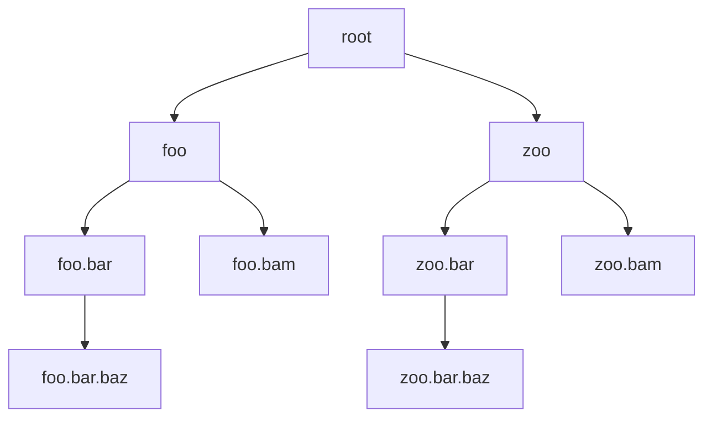
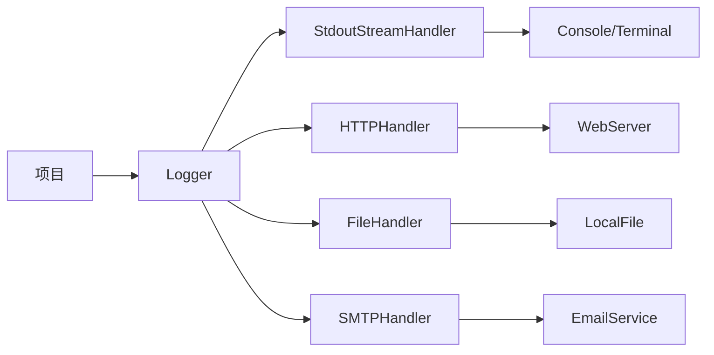


# 1. 前言

`logging` 是 Python 标准库中用于记录日志的模块。它提供了一种灵活且可配置的方式来在应用程序中记录各种信息，包括调试信息、警告和错误消息。无论是写框架代码还是业务代码，都离不开日志的记录，它能给我们定位问题带来极大的帮助。

记录日志最简单的方法就是在我们想要记录的地方加上一句 print。在简单的代码中或者小型项目中这么干一点问题都没有。就比如说我之前经常这样写日志：

```python
outputs = model(inputs)
print(f"outputs.shape: {outputs.shape}")
```

这样记录日志当然是可以的，但当我们正式运行模型的时候，随着 for 循环的进行，一味的 print 会占用我们 console 的界面，所以我们会将这句 print 删除 ——我们好像做了一件事儿，但之后还要删了它，怪可惜的:joy:。

所以我在训练模型的时候也会使用 `.txt` 文件，如下所示：

```python
with open(f'{args.save_path}/logging.txt', 'a') as file:
    file.write(f"Epoch [{epoch}/{args.epochs}]"
               f"Train Loss: {train_loss:.4f}\t"
               f"Train Acc: {train_accuracy:.4f}"
               f"Val   Loss: {val_loss:.4f}\t"
               f"Val   Acc: {val_accuracy:.4f}\t\t"
               f"Best  Acc: {best_acc:.4f} ({np.argmax(val_accuracy_lst) + 1  if epoch != 1 else epoch})\n")
```

```
Epoch [1/50]	Train Loss: 1.2728	Train Acc: 0.7058	Val Loss: 1.1853	Val Acc: 0.7708		Best Acc: 0.7708 (1)
Epoch [2/50]	Train Loss: 1.1682	Train Acc: 0.7653	Val Loss: 1.1126	Val Acc: 0.7826		Best Acc: 0.7826 (2)
Epoch [3/50]	Train Loss: 1.1011	Train Acc: 0.7853	Val Loss: 1.0564	Val Acc: 0.7968		Best Acc: 0.7968 (3)
Epoch [4/50]	Train Loss: 1.0322	Train Acc: 0.8071	Val Loss: 0.9993	Val Acc: 0.8181		Best Acc: 0.8181 (4)
```

这样不占用 console 的空间，也非常干净利落，唯一的缺点就是我们需要保证 `.txt` 文件所在文件夹是存在的，如果不存在就会报错。

后来我接到一个项目，需要对数据进行处理，这个过程中我需要不断查看 `tensor/array` 的 shape，所以需要不断 `print`（这个时候用 `.txt` 文件明显是不合适的），但是当我们处理好整个文件，就不需要 `print` 了。可是万一以后出现了 bug，或者数据有变化，那么我还需要继续 `print`，那我就陷入了纠结之中：
1. 保留 `print` → 项目在运行的时候 console 被占用，有点烦
2. 不保留 `print` → 不利于以后的 debug

所以我是这样做的：

```python
def parse_args():
    parser = argparse.ArgumentParser(description="示例")
    parser.add_argument("--seed", default=42, type=int, help="Random seed")
    parser.add_argument("--device", default="cuda", help="training device")
    parser.add_argument("--batch_size", default=64, type=int, help='batch的大小')
    parser.add_argument("--epochs", default=200, type=int, metavar="N", help="总的epoch数量")
    parser.add_argument("--verbose", action='store_true', help="在数据处理中是否print一些东西")
    args = parser.parse_args()
    return args

if __name__ == "__main__":
    args = parse_args()

    print(f"input.shape: {input.shape}") if args.verbose else ...
```

这样我可以通过设置 `--verbose`，从而确定是否要 `print`。这样的确可以解决我的问题👍，但是这样也不太规范，因为如果我想将 `print` 的内容保存到本地的 `.txt` 文件中，那么代码就很麻烦了。

所以说，`print` 可以解决很多问题，但是在一些稍大一点的项目，有时候定位一个问题，需要查看历史日志定位问题，用 `print` 就不合时宜了。而且 `print`` 打印出来的日志没有时间，不知道日志记录的位置，也没有可读的日志格式，还不能把日志输出到指定文件。。。。除非这些我们都全部自己重复造一遍轮子。

最佳的做法是使用内置的 `logging` 模块，因为 `logging` 模块给开发者提供了非常丰富的功能。

到这里我们可以总结一下，使用 logging 相比于 print 有以下几个优点：

1. **级别和过滤**：logging 允许我们设置不同的日志级别，如 DEBUG、INFO、WARNING、ERROR 和 CRITICAL。这使得我们可以更精细地控制哪些信息被记录，以及在不同情况下打印不同级别的信息。

2. **输出多样性**：logging 支持多种输出方式，包括将日志信息写入文件、发送到网络服务、通过电子邮件通知等。这种多样性有助于在不同情况下有效地处理日志信息。

3. **格式化**：logging 允许我们自定义日志消息的格式，包括时间戳、日志级别和自定义消息。这使得日志信息更易于阅读和分析。

4. **异常处理**：logging 可以捕获和记录异常信息，帮助我们更容易地跟踪和调试问题。

5. **线程安全**：logging 是线程安全的，这意味着我们可以在多线程或多进程应用程序中安全地记录日志，而不必担心竞态条件。

总之，使用 logging 比简单的 print 语句更适合在生产环境中记录和管理日志信息，特别是在大型应用程序中。通过设置不同的级别、输出方式和格式，我们可以更好地控制日志的生成和处理。

# 2. logging 的初级使用方法

## 2.1 基本使用

那么 `logging` 怎么用呢，来看个例子:

```python
import logging


logging.debug("这是一条[debug]日志!")
logging.info("这是一条[info]日志!")
logging.warning("这是一条[warning]日志!")
logging.error("这是一条[error]日志!")
logging.critical("这是一条[critical]日志!")
```

运行之后的结果为：

```
WARNING:root:这是一条[warning]日志!
ERROR:root:这是一条[error]日志!
CRITICAL:root:这是一条[critical]日志!
```

但是我们发现，我明明写了 5 条语句，为什么结果只有三条？这是因为 logging 的日志是有级别的，级别低的日志不会显示在 console 中，下面我们看一下具体的日志级别规则。

## 2.2 日志的级别

<div align=center>

|级别|级别数值|使用时机|
|:-:|:-:|:-|
|DEBUG|10|详细信息，常用于调试|
|INFO|20|程序正常运行过程中产生的一些信息|
|WARNING<br><font color='red'>default</font>|30|警告用户，虽然程序还在正常工作，但有可能发生错误|
|ERROR|40|由于更严重的问题，程序已经不能执行一些功能了|
|CRITICAL|50|严重错误，程序已经不能继续运行|

</div>

> 日志的默认级别是 WARNING

从 `DEBUG` 到 `CRITICAL`，日志的级别越来越高，且 `logging` 默认显示的最低级别为 `WARNING`，低于 WARING 的日志信息都不会输出。

## 2.3 修改日志级别

logging 提供日志级别可以很好的应对不同的使用场景，那么问题来了，如果我就是在 debug，我想让 debug 级别的日志显示出来，该怎么办呢？我们可以修改日志的级别。即在开始记录日志前可以使用 `logging.basicConfig` 方法来设定日志级别：

```python
import logging


# 修改默认的日志显示级别
logging.basicConfig(level=logging.DEBUG)  # DEBUG及以上的日志信息都会显示

logging.debug("这是一条[debug]日志!")
logging.info("这是一条[info]日志!")
logging.warning("这是一条[warning]日志!")
logging.error("这是一条[error]日志!")
logging.critical("这是一条[critical]日志!")
```

```
DEBUG:root:这是一条[debug]日志!
INFO:root:这是一条[info]日志!
WARNING:root:这是一条[warning]日志!
ERROR:root:这是一条[error]日志!
CRITICAL:root:这是一条[critical]日志!
```

现在，我们所以级别的日志都会显示了。

## 2.4 将日志输出为文件

前面的日志默认会把日志输出到标准输出流，就是只在命令行窗口（console/terminal）中输出，程序重启后历史日志没地方找（可以使用`history`查找，但那样太麻烦了），所以把日志内容永久记录是一个很常见的需求。同样通过配置函数 `logging.basicConfig` 可以指定日志输出到什么地方。

```python
import logging


# 修改默认的日志显示级别
logging.basicConfig(filename="test.log",  # 将日志保存到filename文件中 
                    level=logging.DEBUG)  # DEBUG及以上的日志信息都会显示

logging.debug("这是一条[debug]日志!")
logging.info("这是一条[info]日志!")
logging.warning("这是一条[warning]日志!")
logging.error("这是一条[error]日志!")
logging.critical("这是一条[critical]日志!")
```

此时，console 中不再显示日志内容了，但在本地会生成一个名为 `test.log` 的文件：

<div align=center>
   
</div>

---

**Q**：如果我们再运行一次，会怎样呢？
**A**：

<div align=center>
   
</div>

我们发现追加内容了，仔细的同学会发现，`logging.basicConfig` 有一个参数 `filemode=`，就和我们将内容写到 `.txt` 文件一样，这里的 `filemode` 决定了我们是如何写的，详情如下：

<div align=center>

| `filemode` 值 | 名称|含义 |
|:-:|:-:|:-|
| `'w'`| 写入（write）|如果文件存在，将其截断为零长度；如果文件不存在，则创建一个新文件并打开以进行写入。 |
| `'x'`|排他性（exclusive） |如果文件存在，则打开操作失败（抛出错误）。如果文件不存在，则创建一个新文件并打开以进行写入。 |
| `'a'`|追加（append） |如果文件存在，将数据附加到文件末尾，而不是覆盖现有内容。如果文件不存在，则创建一个新文件并打开以进行写入。 |
| `'b'`|二进制（binary） |以二进制模式打开文件，可与上述任何模式组合使用（例如，`'wb'`、`'xb'`、`'ab'`）。 |

</div>

使用 `filemode` 参数，我们可以根据需要配置 `basicConfig()` 函数以控制日志文件的创建和写入方式。

如果我们使用 `filemode='w'`，看一下效果：

```python
import logging


# 修改默认的日志显示级别
logging.basicConfig(filename="test.log",  # 将日志保存到filename文件中 
                    filemode='w',  # 写入的模式
                    level=logging.DEBUG)  # DEBUG及以上的日志信息都会显示

logging.debug("这是一条[debug]日志!")
logging.info("这是一条[info]日志!")
logging.warning("这是一条[warning]日志!")
logging.error("这是一条[error]日志!")
logging.critical("这是一条[critical]日志!")
```

<div align=center>
   
</div>

## 2.5 日志的格式

### 2.5.1 示例

默认输出的格式包含三部分：
1. 日志级别
2. 日志记录器的名字
3. 日志内容

这三部分可以用 `|` 连接。如果我们想改变日志格式，例如想加入日期时间、显示日志器名字，我们是可以指定 `forma`t 参数来设置日志的格式：

```python
import logging


# 修改默认的日志显示级别
logging.basicConfig(filename="test.log",  # 将日志保存到filename文件中 
                    filemode='w',  # 写入的模式
                    format="%(asctime)s | %(levelname)s | %(name)s | %(message)s",
                    level=logging.DEBUG)  # DEBUG及以上的日志信息都会显示

logging.debug("这是一条[debug]日志!")
logging.info("这是一条[info]日志!")
logging.warning("这是一条[warning]日志!")
logging.error("这是一条[error]日志!")
logging.critical("这是一条[critical]日志!")
```

<div align=center>
   
</div>


### 2.5.2 格式化参数

日志格式化输出提供了非常多的参数，除了时间、日志级别、日志消息内容、日志记录器的名字个外，还可以指定线程名，进程名等等，下面是一个总结：

<div align=center>

| 关键字       | 含义                                                         |
|:-|:-|
| `%(asctime)s` | 记录的时间（包括日期和时间）。                                |
| `%(levelname)s` | 日志级别（例如，DEBUG、INFO、WARNING、ERROR、CRITICAL）。    |
| `%(message)s` | 日志消息文本。                                               |
| `%(name)s`    | 记录器的名称。                                               |
| `%(module)s`  | 记录日志的模块的名称。                                       |
| `%(filename)s` | 记录日志的文件的名称（包括路径）。                           |
| `%(funcName)s` | 记录日志的函数或方法的名称。                                 |
| `%(lineno)d`  | 记录日志的代码行号。                                         |
| `%(process)d` | 进程 ID。                                                    |
| `%(thread)d`  | 线程 ID。                                                    |

</div>

在这个配置中，日志消息格式包括时间戳、记录器名称、日志级别和消息文本。我们可以根据实际需求灵活使用这些关键字来定制日志格式。

---

**Q**：为什么有些关键字的结尾是 s，有些是 d？
**A**：关键字的结尾是 `s` 或 `d` 取决于该关键字的数据类型和用途。具体来说：

- 结尾为 `s` 的关键字表示字符串类型，通常用于表示文本信息，如 `%asctime` 和 `%levelname`。例如，`%(asctime)s` 代表一个时间戳的字符串。

- 结尾为 `d` 的关键字表示整数类型，通常用于表示数字信息，如 `%lineno`、`%(process)d` 和 `%(thread)d`。例如，`%(lineno)d` 代表代码行号的整数值。

这种命名约定有助于在日志消息格式中正确解释和处理不同类型的数据。例如，当我们使用 `%asctime` 时，日志系统知道它应该将时间戳转换为字符串并将其包含在日志消息中，而使用 `%lineno` 时，它知道应该将代码行号作为整数包含在消息中。这样可以确保日志消息格式正确地处理各种类型的数据。

---

到这里为止，日志模块的基本用法就这些了，也能满足大部分应用场景，更高级的方法接着往下看，可以帮助我们更好的处理日志。

# 3. logging 的高级使用方法

## 3.1 记录器（Logger）

### 3.1.1 Logger 的介绍

前面介绍的日志记录，其实都是通过一个叫做日志记录器（`Logger`）的实例对象创建的，每个记录器都有一个名称，直接使用 `logging` 来记录日志时，系统会默认创建名为 `root` 的记录器，这个记录器是根记录器。记录器支持层级结构，子记录器通常不需要单独设置日志级别以及 `Handler`（后面会介绍），如果子记录器没有单独设置，则它的行为会委托给父级。

### 3.1.2 Logger 的继承关系

记录器名称可以是任意名称，不过最佳实践是直接用模块的名称当作记录器的名字。命名如下：

```python
# 实例化 Logger 对象
logger = logging.getLogger(name=__name__)
```

其中 `__name__` 是当前运行的文件名。

```python
print(__name__)  # __main__
```

默认情况下，记录器采用层级结构，上句点作为分隔符排列在命名空间的层次结构中。层次结构列表中位于下方的记录器是列表中较高位置的记录器的子级。例如，有个名叫 foo 的记录器，而名字是 foo.bar，foo.bar.baz，和 foo.bam 的记录器都是 foo 的子级。

```
C:.
│  main.py
│
│
├─foo
│  │  bam.py
│  │  __init__.py
│  │
│  └─bar
│          baz.py
│          __init__.py
│
│
└─zoo
    │  bam.py
    │  __init__.py
    │
    └─bar
            baz.py
            __init__.py
```

<div align=center>



</div>

---

**Q**：foo, foo.bar, foo.bar.baz, foo.bam 是什么？
**A**："foo" 是计算机编程中常用的一个占位符或变量名，用于表示一个通用的、不特定的、或者临时的名称。它通常用于示例代码、教学材料或者临时测试中，以代表任何具体的名称或值。它没有固定的全称，因为它本身就是一个抽象的概念。

在编程中，"foo" 和类似的占位符如 "bar"、"baz" 经常被用来表示一些变量或数据，而不涉及具体的业务逻辑。这些名称通常用于帮助程序员理解代码的结构，而不是具体的内容。

---

1. 先在根目录下新建名为 `main.py` 的文件，内容如下：

    ```python
    import foo
    from foo import bar
    from foo import bam
    from foo.bar import baz

    import zoo
    from zoo import bar
    from zoo import bam
    from zoo.bar import baz

    if __name__ == '__main__':
        pass
    ```

2. 新建名为 `foo` 的文件夹，并在里面新建 `__init__.py`、`bam.py`文件 以及 `bar` 文件夹，内容分别为：
   ```python
    # __init__.py: 空的
    # bam.py: 
        import logging

        logger = logging.getLogger(__name__)
        logger.info("this is bam")
    # bar 文件夹
        # 新建 __init__.py 文件（空的）
        # 新建 baz.py 文件，内容如下：
            logger = logging.getLogger(__name__)
            logger.info("this is baz")
   ```
3. 新建名为 `zoo` 的文件夹，并在里面新建 `__init__.py`、`bam.py`文件 以及 `bar` 文件夹，内容和 step.2 一样。

4. 运行 `main.py` 文件。


结果如下：

```
INFO:foo:this is foo
INFO:foo.bar:this is bar
INFO:foo.bam:this is bam
INFO:foo.bar.baz:this is baz
INFO:zoo:this is zoo
INFO:zoo.bar:this is bar
INFO:zoo.bam:this is bam
INFO:zoo.bar.baz:this is baz
```

这里我们设置 foo 和 zoo 两个记录器的级别均为INFO。如果我们设置 foo 的级别为 INFO，而 zoo 记录器的级别为 WARNING，那么结果如下：

```
INFO:foo:this is foo
INFO:foo.bar:this is bar
INFO:foo.bam:this is bam
INFO:foo.bar.baz:this is baz
```

**需要注意的是**：`foo.bar` 这个记录器没有设置日志级别，就会向上找到已经设置了日日志级别的祖先，这里刚好找到父记录器 `foo` 的级别为 INFO，如果 `foo` 也没设置，就会找到根记录器 `root`，`root` 默认的级别为 WARNING。

### 3.1.3 Logger 的操作

`Logger` 对象是 Python 中 `logging` 模块中的关键组件之一，它允许我们记录日志消息以便于调试和追踪程序的运行。以下是一些常见的 `Logger` 对象支持的操作：

1. **记录日志消息：** 通过调用 `Logger` 对象的方法，如 `debug()`, `info()`, `warning()`, `error()`, `exception()`, 和 `critical()`，我们可以记录不同级别的日志消息。

   ```python
   # 实例化 Logger 对象
   logger = logging.getLogger()

   logger.debug("这是一个调试消息")
   logger.info("这是一个信息消息")
   logger.warning("这是一个警告消息")
   logger.error("这是一个错误消息")
   logger.critical("这是一个严重消息")
   ```

2. **设置日志级别：** 我们可以使用 `setLevel()` 方法来设置记录器的日志级别，只有达到或超过此级别的日志消息才会被记录。

   ```python
   logger.setLevel(logging.DEBUG)
   ```

3. **添加处理程序：** 我们可以使用 `addHandler()` 方法将处理程序（例如文件处理程序、控制台处理程序）添加到记录器，以指定如何处理记录的日志消息。

   ```python
   file_handler = logging.FileHandler("my_log.log")
   logger.addHandler(file_handler)
   ```

4. **设置格式化：** 我们可以使用 `setFormatter()` 方法为处理程序设置自定义的日志消息格式。

   ```python
   formatter = logging.Formatter('%(asctime)s - %(name)s - %(levelname)s - %(message)s')
   file_handler.setFormatter(formatter)
   ```

5. **获取记录器名称：** 使用 `name` 属性，我们可以获取记录器的名称。

   ```python
   logger_name = logger.name
   ```

6. **记录异常：** 使用 `exception()` 方法，我们可以记录异常信息。

   ```python
   try:
       # 一些可能引发异常的代码
   except Exception as e:
       logger.exception("发生异常: %s", str(e))
   ```

这些是一些常见的 `Logger` 操作，帮助我们在应用程序中有效地记录和管理日志。通过设置不同的处理程序、级别和格式化，我们可以定制日志记录以满足应用程序的需求。

## 3.2 处理器（Handler）

### 3.2.1 Handler 的介绍

记录器（Logger）负责日志的记录，但是日志最终记录在哪里，记录器（Logger）并不关心，而是交给了另一个家伙--处理器（Handler）去处理。

### 3.2.2 Handler 的简单应用示例

例如一个 Flask 项目，我们可能会将 INFO 级别的日志记录到文件，将 ERROR 级别的日志记录到标准输出，将某些关键日志（例如有订单或者严重错误）发送到某个邮件地址通知老板。这时候我们的记录器添加多个不同的处理器（Handler）来处理不同的消息日志，以此根据消息的重要性发送的特定的位置。

<div align=center>




</div>

### 3.2.3 Handler 的类别

Python 内置了很多实用的处理器，以下是常用的几种 Handler（处理器）：

<div align=center>

| Handler 名称 | 作用 |
|:-|:-|
|:star: StreamHandler | 将日志消息发送到标准输出流（通常是终端屏幕）。|
|:star: FileHandler | 将日志消息写入文件。|
|:star: BaseRotatingHandler | 一个基类，用于处理日志轮换的处理程序。|
|:star: TimedRotatingFileHandler | 基于时间的轮换文件处理程序，根据时间创建新的日志文件。|
| SocketHandler | 将日志消息发送到网络套接字，用于远程日志记录。|
| DatagramHandler | 将日志消息作为数据报发送到网络，通常用于 UDP 日志记录。|
| SMTPHandler | 通过电子邮件将日志消息发送到指定的电子邮件地址。|
| SysLogHandler | 将日志消息发送到 Syslog 服务器，通常用于 UNIX 和 Linux 系统。|
| NTEventLogHandler | 将日志消息发送到 Windows 事件日志。|
| HTTPHandler | 将日志消息通过 HTTP POST 请求发送到指定的 HTTP 服务器。|
| WatchedFileHandler | 类似于 FileHandler，但会监视日志文件的变化并自动回滚日志文件。|
| QueueHandler | 将日志消息排队，以便另一个进程或线程可以处理它们。|
| NullHandler | 一个虚拟处理程序，将所有接收到的日志消息丢弃，用于关闭日志记录。|

</div>

这些处理程序可帮助我们控制如何处理和记录 Python 应用程序中的日志消息。

### 3.2.4 Handler 的操作

`Handler` 是 Python 中 `logging` 模块中的另一个重要组件，用于定义如何处理记录的日志消息。和 Logger 一样，也有很多操作，以下是一些常见的 `Handler` 对象支持的操作：

1. **设置日志级别：** 我们可以使用 `setLevel()` 方法来设置处理程序的日志级别，只有达到或超过此级别的日志消息才会被处理。

   ```python
   handler.setLevel(logging.DEBUG)
   ```

2. **设置格式化：** 使用 `setFormatter()` 方法，我们可以为处理程序设置自定义的日志消息格式。

   ```python
   formatter = logging.Formatter('%(asctime)s - %(name)s - %(levelname)s - %(message)s')
   handler.setFormatter(formatter)
   ```

3. **添加到记录器：** 使用 `addHandler()` 方法，我们可以将处理程序添加到记录器，以指定如何处理记录的日志消息。

   ```python
   logger.addHandler(handler)
   ```

4. **移除处理程序：** 使用 `removeHandler()` 方法，我们可以从记录器中移除一个已添加的处理程序。

   ```python
   logger.removeHandler(handler)
   ```

5. **处理日志消息：** 处理程序的主要功能是处理日志消息，我们无需手动调用它，`Logger` 会在调用记录器的日志方法时自动触发处理程序。

6. **关闭处理程序：** 使用 `close()` 方法，我们可以关闭处理程序，通常在应用程序退出时进行清理操作。

   ```python
   handler.close()
   ```

7. **刷新处理程序：** 一些处理程序，如文件处理程序，可能需要手动刷新以确保日志消息被写入文件。可以使用 `flush()` 方法来刷新处理程序。

   ```python
   handler.flush()
   ```

这些是一些常见的 `Handler` 操作，它们允许我们定义如何处理和记录日志消息。通过设置不同的级别、格式化和将处理程序与记录器关联，我们可以定制日志处理以满足应用程序的需求。

### 3.2.5 不同 Handler 的代码示例

```python
import logging


# 1. Logger
## 1.1 实例化 Logger 对象
logger = logging.getLogger(name=__name__)

## 1.2 设置 Logger 对象的日志级别
logger.setLevel(level=logging.DEBUG)

# 2. Handler
## 2.1 创建 Handler 对象
stream_handler = logging.StreamHandler()
file_handler = logging.FileHandler(filename="advanced_usage_test.log", mode='a')

## 2.2 设置Handler级别
stream_handler.setLevel(logging.WARNING)
file_handler.setLevel(logging.INFO)

## 2.3 将 Handler 添加到 Logger 中
logger.addHandler(hdlr=stream_handler)
logger.addHandler(hdlr=file_handler)

# 3. Logger 记录信息
logger.debug("这是一条[debug]日志!")
logger.info("这是一条[info]日志!")
logger.warning("这是一条[warning]日志!")
logger.error("这是一条[error]日志!")
logger.critical("这是一条[critical]日志!")
```

console 的结果为：

```
这是一条[warning]日志!
这是一条[error]日志!
这是一条[critical]日志!
```

`advanced_usage_test.log` 的内容为：

<div align=center>
   
</div>

## 3.3 日志等级规则

在 `logging` 模块中，Logger 和 Handler 的日志等级之间存在一种层次结构，具体的输出哪些等级的日志消息是由它们之间的关系决定的。以下是日志消息输出的规则：

1. Logger 的日志级别：Logger 有一个单独的日志级别，通过 `logger.setLevel()` 方法来设置。<font color='red'>此级别表示 Logger 对象本身能够处理的最低级别的日志消息</font>。

2. Handler 的日志级别：Handler 也有自己的日志级别，通过 `handler.setLevel()` 方法来设置。<font color='red'>此级别表示 Handler 能够处理的最低级别的日志消息</font>。

> 最低级别的日志消息指的是该日志级别及以上的消息。在 Python 的 logging 模块中，日志级别之间存在一种层次结构，较低级别的消息会包括较高级别的消息。不同日志级别的层次结构（从低到高）：
> <div align=center>
> 
> ```mermaid
> graph LR
> 
> DEBUG --> INFO --> WARNING --> ERROR --> CRITICAL
> ```
> </div>

现在，根据这两者的关系，决定日志消息的输出规则如下：

- 如果 Logger 对象的日志级别（通过 `logger.setLevel()` 设置）比 Handler 的日志级别高，那么 Logger 会过滤掉低于其级别的日志消息，不传递给 Handler 处理。

- 如果 Logger 对象的日志级别比 Handler 的日志级别低或相等，那么 Logger 会将所有符合其级别的日志消息传递给 Handler 处理。

- 如果多个 Handler 关联到同一个 Logger，并且它们的日志级别不同，那么 Logger 会根据每个 Handler 的级别来决定哪个 Handler 处理哪个日志消息。

以下是一个示例来说明这个规则：

```python
import logging


logger = logging.getLogger("example_logger")
logger.setLevel(logging.DEBUG)

file_handler = logging.FileHandler("example.log")
file_handler.setLevel(logging.ERROR)

console_handler = logging.StreamHandler()
console_handler.setLevel(logging.INFO)

logger.addHandler(file_handler)
logger.addHandler(console_handler)

logger.debug("这条日志消息不会被记录到文件和控制台")
logger.info("这条日志消息会被记录到控制台，但不会被记录到文件")
logger.error("这条日志消息会被记录到文件和控制台")
```

console 的结果：

```
这条日志消息会被记录到控制台，但不会被记录到文件
这条日志消息会被记录到文件和控制台
```

`example.log` 的结果：

<div align=center>
   
</div>


根据上面的示例，`logger.debug()` 的消息不会被记录到文件和控制台，因为它的级别比文件处理程序的级别高。`logger.info()` 的消息会被记录到控制台，但不会被记录到文件，因为它的级别低于文件处理程序的级别。`logger.error()` 的消息会被记录到文件和控制台，因为它的级别符合所有处理程序的级别。

---

根据上面的例子，我们就知道我们之前写的代码是怎么回事了，具体分析如下所示。

1. 我们首先创建了一个名为 `logger` 的日志记录器对象，然后通过 `logger.setLevel()` 设置了日志级别为 `DEBUG`，这意味着**它会记录所有级别的日志消息**。

2. 我们创建了两个处理程序，一个是 `stream_handler`，另一个是 `file_handler`，并分别设置了它们的日志级别。
   - `stream_handler` 的日志级别设置为 `WARNING`，这意味着它将只处理 `WARNING`、`ERROR` 和 `CRITICAL` 级别的日志消息。
   - `file_handler` 的日志级别设置为 `INFO`，这意味着它将处理所有级别的日志消息，包括 `INFO`、`WARNING`、`ERROR` 和 `CRITICAL`（但不包括 `DEBUG`）。

3. 接下来，我们使用不同级别的日志消息记录了一些示例消息，包括 `DEBUG`、`INFO`、`WARNING`、`ERROR` 和 `CRITICAL`。

根据上述配置，不同级别的日志消息将由不同的处理程序处理：
- `DEBUG` 消息会被记录到 `file_handler` 中，因为根记录器的日志级别是 `DEBUG`，而 `file_handler` 的级别也是 `INFO`，满足了处理条件。
- `INFO` 消息也会被记录到 `file_handler` 中，因为它的级别是 `INFO`。
- `WARNING`、`ERROR` 和 `CRITICAL` 消息会被 `stream_handler` 处理，因为 `stream_handler` 的级别是 `WARNING`。

这样，<font color='blue'>我们可以根据不同的处理程序和其级别设置来控制哪些级别的日志消息会被记录到不同的输出位置。这对于在应用程序中**灵活地管理日志非常有用**</font>。

> 简单来说，尽管我们将 logger 的级别设置为了 DEBUG，但是 debug 记录的消息并没有输出，因为我们给两个 Handler 设置的级别都比 DEBUG 要高，所以这条消息被过滤掉了。

## 3.4 格式器（Formatter）

格式器（Formatter）在文章的前面部分其实已经有所介绍，不过那是通过 `logging.basicConfig` 来指定的，其实格式器还可以以对象的形式来设置在 `Handler` 上。格式器可以指定日志的输出格式，要不要展示时间，时间格式什么，要不要展示日志的级别，要不要展示记录器的名字等等，都可以通过一个格式器对消息进行格式化输出。


下面是 `logging` 库中 `Formatter` 的常见属性和它们的作用：

- `fmt`: 格式字符串，用于指定日志消息的输出格式。格式字符串可以包含占位符，例如 `%(levelname)s`（日志级别的名称）或 `%(message)s`（日志消息的内容）。

- `datefmt`: 日期时间格式字符串，用于指定时间戳的输出格式。如果日志消息包含时间戳，`datefmt` 将定义如何呈现时间戳。

- `style`: 格式化风格，可以是 `'%'`（传统风格）或 `'{'`（新式风格）。传统风格使用 `%` 占位符，而新式风格使用 `{}` 占位符。

### 3.4.1 Formatter 的代码示例

```python
import logging


# 1. Logger
## 1.1 实例化 Logger 对象
logger = logging.getLogger(name=__name__)

## 1.2 设置 Logger 对象的日志级别
logger.setLevel(level=logging.DEBUG)

# 2. Handler
## 2.1 创建 Handler 对象
stream_handler = logging.StreamHandler()
file_handler = logging.FileHandler(filename="advanced_usage_test.log", mode='a')

## 2.2 设置Handler级别
stream_handler.setLevel(logging.WARNING)
file_handler.setLevel(logging.INFO)

## 2.3 将 Handler 添加到 Logger 中
logger.addHandler(hdlr=stream_handler)
logger.addHandler(hdlr=file_handler)

# 3. Formatter
## 3.1 创建格式器
formatter_full = logging.Formatter(fmt="%(asctime)s - %(name)s - %(levelname)s - [%(lineno)d] %(message)s", 
                                   datefmt="%Y-%m-%d %H:%M:%S")  # 复杂的格式
formatter_simple = logging.Formatter(fmt="%(asctime)s - %(levelname)s - %(message)s")  # 简单的格式

## 3.2 应用Formatter(我们一般只给Handler添加Formatter, Logger 就不设置了)
stream_handler.setFormatter(formatter_simple)
file_handler.setFormatter(formatter_full)

# 4. Logger 记录信息
logger.debug("这是一条[debug]日志!")
logger.info("这是一条[info]日志!")
logger.warning("这是一条[warning]日志!")
logger.error("这是一条[error]日志!")
logger.critical("这是一条[critical]日志!")
```

console 结果：

```
2023-10-16 20:02:19,238 - WARNING - 这是一条[warning]日志!
2023-10-16 20:02:19,238 - ERROR - 这是一条[error]日志!      
2023-10-16 20:02:19,238 - CRITICAL - 这是一条[critical]日志!
```

`advanced_usage_test.log` 的结果：

<div align=center>
   
</div>

**注意**：
+ 格式器（Formatter）只能作用在处理器（Handler）上，通过处理器（Handler）的 `setFromatter` 方法设置格式器（Formatter）
+ 一个 Handler 只能设置一个格式器（Formatter），<font color='green'>是一对一的关系</font>；
+ <font color='red'>logger 与 handler 是一对多的关系，一个 logger 可以添加多个 handler</font>
+ handler 和 logger 都可以设置日志的等级，先是 logger 对日志等级进行过滤，之后再是 Handler 对日志等级进行过滤


### 3.4.2 Formatter 格式汇总

<div align=center>

| 属性        | 全拼（翻译）        | 格式         | 描述                  | 属性         | 全拼（翻译）| 格式        | 描述                 |
| :-:          | :-:                | :-:           | :-:                    | :-:           | :-:              | :-:          | :-:                   |
| asctime     | ascent time<br>（时间升高） | `%(asctime)s` | 获取时间的字符串表示 | msecs     | milliseconds<br>（毫秒） | `%(msecs)d` | 获取毫秒数的字符串表示 |
| create      | creation time<br>（创建时间） | `%(create)s`  | 获取日志记录的创建时间 | message   | message<br>（消息）       | `%(message)s` | 获取日志消息的字符串表示 |
| filename    | file name<br>（文件名）      | `%(filename)s` | 记录日志的源文件名称 | name      | logger name<br>（记录器名称） | `%(name)s` | 获取记录器名称的字符串表示 |
| funcName    | function name<br>（函数名）  | `%(funcName)s` | 记录调用的函数名称 | pathname  | file path<br>（文件路径）   | `%(pathname)s` | 获取文件路径的字符串表示 |
| levelname   | level name<br>（级别名称）   | `%(levelname)s` | 记录的日志级别名称 | process   | process ID<br>（进程ID）    | `%(process)d` | 获取进程ID的字符串表示 |
| levelno     | level number<br>（级别编号） | `%(levelno)s`  | 记录的日志级别编号 | processName | process name<br>（进程名称） | `%(processName)s` | 获取进程名称的字符串表示 |
| lineno      | line number<br>（行号）     | `%(lineno)d`    | 记录的源代码行号 | thread    | thread ID<br>（线程ID）    | `%(thread)d` | 获取线程ID的字符串表示 |
| module      | module name<br>（模块名） | `%(module)s`   | 记录的源文件模块名称 | threadName | thread name<br>（线程名称） | `%(threadName)s` | 获取线程名称的字符串表示 |

</div>

## 3.5 logging.basicConfig

回到最开始的地方，`logging.basicConfig()` 方法为我们干了什么，现在大概能猜出来了。来看 Python 源码中是怎么说的：

> Do basic configuration for the logging system.
> 
> This function does nothing if the root logger already has handlers configured. It is a convenience method intended for use by simple scripts to do one-shot configuration of the logging package.
> 
> The default behaviour is to create a StreamHandler which writes to sys.stderr, set a formatter using the BASIC_FORMAT format string, and add the handler to the root logger.
A number of optional keyword arguments may be specified, which can alter the default behaviour.

> 进行日志系统的基本配置。
> 
> 如果根记录器（root logger）已经配置了处理程序，此函数将不起作用。这是一个方便的方法，旨在供简单的脚本使用，以一次性配置日志包。
> 
> 默认行为是创建一个写入到 `sys.stderr` 的 `StreamHandler`，使用 `BASIC_FORMAT` 格式字符串设置格式化程序，然后将处理程序添加到根记录器。还可以指定一些可选的关键字参数，这些参数可以修改默认行为。

1、创建一个 `root` 记录器
2、设置 `root` 的日志级别为 `warning`
3、为 `root` 记录器添加 `StreamHandler` 处理器
4、为处理器设置一个简单格式器

```python
logging.basicConfig()
logging.warning("hello")
```

这两行代码其实就等价于：

```python
import logging
import sys


# 1. 定义 Logger
logger = logging.getLogger(name="root")
logger.setLevel(logging.WARNING)

# 2. 定义 Handler
handler = logging.StreamHandler(sys.stderr)

# 3. 给logger添加handler
logger.addHandler(handler)

# 4. 定义 Formatter
formatter = logging.Formatter(fmt="%(levelname)s:%(name)s:%(message)s")

# 5. 添加Formatter
handler.setFormatter(formatter)

# 6. 记录日志
logger.warning("hello")
```

```
WARNING:root:hello
```

其中，`logging.basicConfig` 方法做的事情是相当于给日志系统做一个最基本的配置，方便开发者快速接入使用。<font color='red'>它必须在开始记录日志前调用</font>。不过如果 `root` 记录器已经指定有其它处理器，这时候我们再调用 `basciConfig`，则该方式将失效，它什么都不做。

> `sys.stderr` 是 Python 中的一个标准流对象，它代表标准错误输出流。在 Python 中，有三个标准流：
> 1. `sys.stdin`：代表标准输入流，通常用于从用户获取输入。
> 2. `sys.stdout`：代表标准输出流，通常用于向终端或控制台输出信息。
> 3. `sys.stderr`：代表标准错误输出流，通常用于输出错误消息和警告。
> 
> `sys.stderr` 是通常用于将错误消息、异常信息和警告信息输出到控制台或日志文件中。在日志配置中，`sys.stderr` 经常用作默认的输出目标，当没有指定其他处理程序时，日志消息将输出到标准错误输出流，即控制台。
> 
> 例如，通过以下方式可以将日志消息输出到 `sys.stderr`：
> ```python
> import logging
> 
> # 创建一个日志记录器
> logger = logging.getLogger(__name)
> 
> # 创建一个处理程序，将日志消息输出到 sys.stderr
> handler = logging.StreamHandler(stream=sys.stderr)
> 
> # 将处理程序添加到记录器中
> logger.addHandler(handler)
> 
> # 记录一条日志消息
> logger.error("这是一条错误消息")
> ```
> 
> 在上述示例中，`logging.StreamHandler(stream=sys.stderr)` 创建了一个处理程序，它将日志消息输出到 `sys.stderr`，即标准错误输出流。

## 3.6 使用配置文件对 logging 进行配置

日志的配置除了前面介绍的将配置直接写在代码中，还可以将配置信息单独放在配置文件中，实现配置与代码分离。

### 3.6.1 配置文件

配置文件 `logging.cfg` 内容如下：

```cfg
[loggers]
keys = root

[handlers]
keys = consoleHandler

[formatters]
keys = simpleFormatter

[logger_root]
level = DEBUG
handlers = consoleHandler

[handler_consoleHandler]
class = StreamHandler
level = DEBUG
formatter = simpleFormatter
args = (sys.stdout, )

[formatter_simpleFormatter]
format = %(asctime)s - %(name)s - %(levelname)s - %(message)s
datefmt = %Y-%m-%d %H:%M:%S
```

这是一个典型的 Python 标准库 `logging` 模块的配置文件，用于配置日志系统的各个组件，包括日志记录器（loggers）、处理程序（handlers）和格式化器（formatters）。让我们一步一步分析文件的内容：

1. `[loggers]` 部分定义了日志记录器的名称，这里只有一个名为 "root" 的日志记录器。

2. `[handlers]` 部分定义了处理程序的名称，这里只有一个名为 "consoleHandler" 的处理程序。

3. `[formatters]` 部分定义了格式化器的名称，这里只有一个名为 "simpleFormatter" 的格式化器。

4. `[logger_root]` 部分配置了根日志记录器，这是整个日志系统的根。该记录器的配置包括：
   - `level`：将日志记录器的级别设置为 `DEBUG`，表示它将处理所有级别的日志消息。
   - `handlers`：将处理程序 "consoleHandler" 分配给该记录器。

5. `[handler_consoleHandler]` 部分配置了 "consoleHandler" 处理程序，这是用于将日志消息输出到控制台的处理程序。配置包括：
   - `class`：指定处理程序的类为 `StreamHandler`，表示将日志消息写入流。
   - `level`：将处理程序的级别设置为 `DEBUG`，表示它将处理所有级别的日志消息。
   - `formatter`：将格式化器 "simpleFormatter" 分配给该处理程序。
   - `args`：这里使用了参数 `(sys.stdout,)`，表示将日志消息写入标准输出流 (`sys.stdout`)。

6. `[formatter_simpleFormatter]` 部分配置了 "simpleFormatter" 格式化器，用于定义日志消息的格式。配置包括：
   - `format`：定义了日志消息的格式，包括时间戳、记录器名称、日志级别和消息内容。
   - `datefmt`：定义了时间戳的格式，包括年月日和时分秒。

这个配置文件定义了一个简单的日志系统，根日志记录器将日志消息输出到控制台，并使用了名为 "simpleFormatter" 的格式化器，以指定日志消息的输出格式。日志消息的级别从 `DEBUG` 到更高级别的都会被记录。

我们可以在代码中使用这个配置文件来配置 `logging` 模块，以实现相同的日志记录行为。

### 3.6.2 加载配置文件

```python
import logging
import logging.config


# 1. 加载配置文件
logging.config.fileConfig("logging.cfg")

# 2. 创建 logger
logger = logging.getLogger()

# 3. 记录日志
logger.debug("这是一条[debug]日志!")
logger.info("这是一条[info]日志!")
logger.warning("这是一条[warning]日志!")
logger.error("这是一条[error]日志!")
logger.critical("这是一条[critical]日志!")
```

console 的结果：

```
2023-10-16 20:23:22 - root - DEBUG - 这是一条[debug]日志!
2023-10-16 20:23:22 - root - INFO - 这是一条[info]日志!
2023-10-16 20:23:22 - root - WARNING - 这是一条[warning]日志!
2023-10-16 20:23:22 - root - ERROR - 这是一条[error]日志!
2023-10-16 20:23:22 - root - CRITICAL - 这是一条[critical]日志!
```

# 知识来源
1. [python logging 日志模块详解](https://zhuanlan.zhihu.com/p/454463040)
atefmt`：定义了时间戳的格式，包括年月日和时分秒。

这个配置文件定义了一个简单的日志系统，根日志记录器将日志消息输出到控制台，并使用了名为 "simpleFormatter" 的格式化器，以指定日志消息的输出格式。日志消息的级别从 `DEBUG` 到更高级别的都会被记录。

我们可以在代码中使用这个配置文件来配置 `logging` 模块，以实现相同的日志记录行为。

### 3.6.2 加载配置文件

```python
import logging
import logging.config


# 1. 加载配置文件
logging.config.fileConfig("logging.cfg")

# 2. 创建 logger
logger = logging.getLogger()

# 3. 记录日志
logger.debug("这是一条[debug]日志!")
logger.info("这是一条[info]日志!")
logger.warning("这是一条[warning]日志!")
logger.error("这是一条[error]日志!")
logger.critical("这是一条[critical]日志!")
```

console 的结果：

```
2023-10-16 20:23:22 - root - DEBUG - 这是一条[debug]日志!
2023-10-16 20:23:22 - root - INFO - 这是一条[info]日志!
2023-10-16 20:23:22 - root - WARNING - 这是一条[warning]日志!
2023-10-16 20:23:22 - root - ERROR - 这是一条[error]日志!
2023-10-16 20:23:22 - root - CRITICAL - 这是一条[critical]日志!
```

# 知识来源
1. [python logging 日志模块详解](https://zhuanlan.zhihu.com/p/454463040)
2. [Python基础之标准库logging 你还在用print来调试程序吗，OUT啦](https://www.bilibili.com/video/BV1sK4y1x7e1/)
