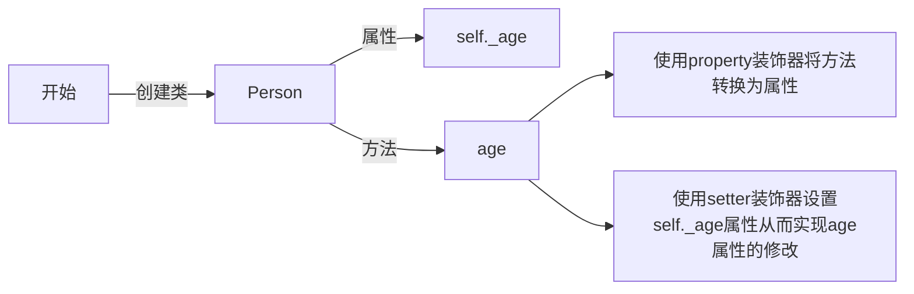

# 1. 装饰器的基本概念

Python的装饰器（Decorator）是一种非常强大的功能，它允许我们在不修改原始函数代码的情况下，增加或修改函数的行为。装饰器本质上是一个函数，它接受一个函数作为参数并返回一个新的函数。这个新的函数通常会包含一些额外的逻辑，然后调用原始函数。

- **函数作为一等公民**：在Python中，函数是一等公民，这意味着函数可以像其他对象一样被传递和返回。这使得装饰器的实现成为可能。
- **高阶函数**：装饰器本身是一个高阶函数，因为它接受一个函数作为参数并返回一个新的函数。

# 2. 装饰器的基本结构

一个简单的装饰器通常包含以下几个部分：

1. **装饰器函数**：这是最外层的函数，它接受一个函数作为参数。
2. **包装函数**：这是装饰器内部定义的一个函数，它包装了原始函数的调用，并可以添加一些额外的逻辑。
3. **返回包装函数**：装饰器返回包装函数，以便在调用时执行包装函数的逻辑。

# 3. 装饰器的应用场景

- **日志记录**：在函数执行前后记录日志信息。
- **性能监控**：记录函数的执行时间，用于性能分析（profile）。
- **权限检查**：在函数执行前检查用户权限。
- **缓存结果**：缓存函数的返回结果，避免重复计算。
- **事务管理**：在数据库操作前后进行事务管理。

# 4. 装饰器的高级用法

- **带参数的装饰器**：可以定义一个装饰器工厂函数，该函数接受参数并返回一个装饰器。
- **类装饰器**：可以使用类来实现装饰器，类的实例方法可以作为包装函数。
- **多层装饰器**：可以将多个装饰器应用于同一个函数，以组合不同的功能。

装饰器是Python中一种非常灵活和强大的工具，它使得代码的复用和扩展变得更加方便和优雅。

# 5 函数示例

## 5.1 最简单的装饰器

```python
import time


def timing_decorator(func):
    def wrapper(*args, **kwargs):
        t1 = time.time()
        results = func(*args, **kwargs)
        t2 = time.time()

        print(f"函数名称: {func.__name__} 耗时: {t2 - t1:.2f}s")
        return results
    
    # 手动设置meta info
    wrapper.__name__ == func.__name__
    wrapper.__doc__ == func.__doc__

    return wrapper

@timing_decorator
def exp_func(n):
    sum = 0
    for i in range(n + 1):
        time.sleep(1)
        sum += i
    return sum


if __name__ == "__main__":
    print(f"{exp_func(2) = }")
```

```
函数名称: exp_func 耗时: 3.00s
exp_func(2) = 3
```

## 5.2 使用from functools import wraps的装饰器

`from functools import wraps`的`wraps` 函数的主要作用是帮助装饰器保留被装饰函数的元数据，例如函数名、文档字符串等。这在使用装饰器时非常重要，因为装饰器通常会用一个包装函数来替代原始函数，如果不使用 `wraps`，原始函数的元数据可能会丢失。`wraps`装饰器的主要作用为：

- **保留函数名**：`wraps` 会将被装饰函数的 `__name__` 属性复制到包装函数上，这样包装函数的名称就会与原始函数相同。
- **保留文档字符串**：`wraps` 会将被装饰函数的 `__doc__` 属性复制到包装函数上，这样包装函数的文档字符串就会与原始函数相同。
- **保留其他属性**：`wraps` 还可以保留其他一些函数属性，例如 `__module__` 和 `__annotations__`。

下面是一个不使用和使用 `wraps` 的对比示例：

```python
import time
from functools import wraps

def timing_decorator(func):
    def wrapper(*args, **kwargs):
        start_time = time.time()
        result = func(*args, **kwargs)
        end_time = time.time()
        print(f"Function {func.__name__} took {end_time - start_time:.4f} seconds to run.")
        return result
    return wrapper

def timing_decorator_with_wraps(func):
    @wraps(func)
    def wrapper(*args, **kwargs):
        start_time = time.time()
        result = func(*args, **kwargs)
        end_time = time.time()
        print(f"Function {func.__name__} took {end_time - start_time:.4f} seconds to run.")
        return result
    return wrapper

@timing_decorator
def example_function(n):
    """Function to demonstrate the decorator."""
    sum = 0
    for i in range(n):
        sum += i
    return sum

@timing_decorator_with_wraps
def example_function_with_wraps(n):
    """Function to demonstrate the decorator with wraps."""
    sum = 0
    for i in range(n):
        sum = sum + i
    return sum

print("Without wraps:")
print(f"\t{example_function.__name__ = }")  # 输出: wrapper
print(f"\t{example_function.__doc__ = }")   # 输出: None

print("\nWith wraps:")
print(f"\t{example_function_with_wraps.__name__ = }")  # 输出: example_function_with_wraps
print(f"\t{example_function_with_wraps.__doc__ = }")   # 输出: Function to demonstrate the decorator with wraps.
```

```
Without wraps:
        example_function.__name__ = 'wrapper'
        example_function.__doc__ = None

With wraps:
        example_function_with_wraps.__name__ = 'example_function_with_wraps'
        example_function_with_wraps.__doc__ = 'Function to demonstrate the decorator with wraps.'
```

通过使用 `wraps`，我们能够确保装饰器不会破坏原始函数的元数据，从而使代码更加清晰和易于维护。

## 5.3 可以使用()调用的装饰器

一个可以被 `()` 调用的装饰器，通常是指创建一个装饰器工厂函数。这个工厂函数可以接受一些参数，并返回一个真正的装饰器函数。这种方式允许我们在使用装饰器时传递参数，从而增加装饰器的灵活性。

下面是一个示例，展示如何创建一个可以接受参数的装饰器工厂函数：

```python
from functools import wraps


def repeat(times: int = 3):
    """
    装饰器工厂函数，可以让被装饰函数重复调用times次。

    Args:
        times (int, optional): 函数需要被重复调用的次数. Defaults to 3.
    """
    try:
        times: int = int(times)
    except Exception as e:
        raise e
    
    def decorator(func):
        @wraps(func)
        def wrapper(*args, **kwargs):
            results: list = []
            for _ in range(times):
                results.append(func(*args, **kwargs))
            return results
        return wrapper
    return decorator


@repeat(2)
def say_hello(name: str = 'Le0v1n') -> None:
    s = f"😊 Hello, {name}!"
    print(s)
    return s


if __name__ == '__main__':
    result = say_hello()
    print(f"{result = }")
```

```
😊 Hello, Le0v1n!
😊 Hello, Le0v1n!
result = ['😊 Hello, Le0v1n!', '😊 Hello, Le0v1n!']
```

## 5.4 可以用于上下文管理器的装饰器

要使用 `contextlib` 模块的 `contextmanager` 装饰器将一个函数转换为上下文管理器，我们需要定义一个生成器函数，并在该函数中使用 `yield` 语句。`yield` 语句之前的代码会在进入上下文时执行（相当于 `__enter__` 方法），而 `yield` 语句之后的代码会在退出上下文时执行（相当于 `__exit__` 方法）.

下面是一个示例，展示如何使用 `contextmanager` 装饰器将一个函数转换为上下文管理器：

```python
from contextlib import contextmanager

@contextmanager
def managed_resource(resource_name):
    print(f"[上下文管理器] [进入] {resource_name}")

    # 这里可以添加获取资源的代码
    resource = f"{resource_name}_temp"

    try:
        yield resource
    finally:
        print(f"[上下文管理器] [退出] {resource_name}")
        
        # 这里可以添加释放资源的代码
        del resource


if __name__ == '__main__':
    # 使用上下文管理器
    with managed_resource("example_resource") as resource:
        print(f"[被管理的代码块] 使用资源: {resource}")
```

```
[上下文管理器] [进入] example_resource
[被管理的代码块] 使用资源: example_resource_temp
[上下文管理器] [退出] example_resource
```

**解释**：
- **`@contextmanager` 装饰器**：将 `managed_resource` 函数转换为上下文管理器。这意味着我们可以使用 `with` 语句来管理资源的获取和释放。
- **生成器函数**：
  - `managed_resource` 是一个生成器函数，它在 `yield` 语句之前执行获取资源的代码，在 `yield` 语句之后执行释放资源的代码。
- **`yield` 语句**：
  - `yield` 语句用于暂停函数的执行，并将 `resource` 返回给 `with` 语句块中的变量（如果有 `as` 子句的话）。
  - 在 `with` 语句块执行完毕后，函数会从 `yield` 语句处继续执行，执行释放资源的代码。
- **异常处理**：使用 `try`-`finally` 结构可以确保即使在 `with` 语句块中发生异常，资源也能被正确释放。

**使用场景**：
- **资源管理**：适用于需要管理资源获取和释放的场景，如文件操作、数据库连接、网络连接等。
- **代码块执行前后逻辑**：适用于需要在代码块执行前后执行一些特定逻辑的场景，如日志记录、性能监控等。

通过使用 `contextmanager` 装饰器，我们可以轻松地将函数转换为上下文管理器，而不需要定义一个完整的类来实现 `__enter__` 和 `__exit__` 方法.这种方式使得代码更加简洁和灵活。

# 6. 类class示例

## 6.1 @classmethod

在Python中，`@classmethod` 是一个内置的装饰器，用于将一个方法定义为类方法。类方法与普通实例方法的主要区别在于<font color='red'><b>它们的第一个参数是类本身，而不是类的实例</b></font>（即 `self`）。


```python
class ExampleClass:
    # 定义一些类属性
    attribute_1 = 'abc'
    attribute_2 = 123

    # 定义一些普通实例方法
    def normal_instance_method_1(self, param1, param2):
        print(f"Instance method 1 called with {param1} and {param2}")

    def normal_instance_method_2(self, param1, param2):
        print(f"Instance method 2 called with {param1} and {param2}")

    # 定义类方法
    @classmethod
    def class_method(cls):
        p1 = cls.attribute_1
        p2 = cls.attribute_2
        
        # 🚨注意：这里不能直接调用实例方法，因为实例方法需要实例对象
        # 我们需要先创建一个实例对象，然后调用实例方法
        instance = cls()  # 创建一个实例对象
        return instance.normal_instance_method_1(
            param1=p1, 
            param2=p2
        )
```

使用 `@classmethod` 装饰器的主要作用包括：

### 6.1.1 访问类属性和类方法

类方法可以访问类属性和类方法，而不需要创建类的实例。这对于那些需要操作类级别的数据或行为的方法非常有用。例如：

```python
class MyClass:
    class_attribute = "Hello"

    @classmethod
    def print_class_attribute(cls):
        print(cls.class_attribute)

MyClass.print_class_attribute()  # 输出: Hello
```

在这个例子中，`print_class_attribute` 是一个类方法，可以直接通过类名调用，而不需要创建类的实例。

### 6.1.2 作为构造函数的替代

类方法常用于定义替代构造函数。我们可以使用类方法来创建类的实例，特别是当我们需要根据不同的参数或条件来创建实例时。例如：

```python
class Person:
    def __init__(self, name, age):
        self.name = name
        self.age = age

    @classmethod
    def from_birth_year(cls, name, birth_year):
        age = 2025 - birth_year

        # 这里的cls()则是创建了一个新的实例
        return cls(name, age)

person = Person.from_birth_year("Le0v1n", 1996)
print(person.age)  # 输出: 25
```

在这个例子中，`from_birth_year` 是一个类方法，它根据出生年份计算年龄，并创建一个 `Person` 实例。

### 6.1.3 实现多态

在继承体系中，类方法可以被子类覆盖，从而实现多态。这意味着子类可以提供自己的类方法实现，而父类的调用者可以调用这些方法，而不需要知道具体的子类类型。例如：

```python
class Animal:
    @classmethod
    def make_sound(cls):
        print("Some sound")

class Dog(Animal):
    @classmethod
    def make_sound(cls):
        print("Bark")

Animal.make_sound()  # 输出: Some sound
Dog.make_sound()     # 输出: Bark
```

在这个例子中，`Dog` 类覆盖了 `Animal` 类的 `make_sound` 类方法，实现了多态。

---

使用 `@classmethod` 装饰器的主要好处是能够以类为单位进行操作，而不是依赖于实例。这使得代码更加灵活和可维护，尤其是在需要处理类级别的数据或行为时。

## 6.2 @staticmethod

在Python中，`@staticmethod` 是一个内置的装饰器，用于将一个方法定义为静态方法。**静态方法与类方法和实例方法的主要区别在于它们不接受 `self` 或 `cls` 作为第一个参数**。使用 `@staticmethod` 装饰器的主要作用包括：

1. **不依赖于类或实例状态**：静态方法不依赖于类或实例的任何状态（属性）。它们通常用于实现与类相关的功能，但不需要访问类或实例的属性。

2. **代码组织和命名空间管理**：静态方法可以用于将相关功能组织在同一个类中，而不是将它们定义为独立的函数。**这有助于代码的组织和管理，特别是在大型项目中**。

	> 例如，我们可以将与某个类相关的辅助函数定义为静态方法，而不是将它们散落在不同的模块中。

3. **不需要实例化**：由于静态方法不依赖于类或实例的状态，因此可以在不创建类实例的情况下直接调用它们。这使得静态方法在某些情况下比实例方法更高效，因为不需要实例化对象。

4. **继承和多态**：静态方法通常不用于实现多态逻辑。

```python
class Utils:
    @staticmethod
    def add(*args):
        return sum(args)

    @staticmethod
    def average(*args):
        return Utils.add(*args) / len(args)


if __name__ == '__main__':
    res1 = Utils.add(1, 2, 3, 4, 5)
    res2 = Utils.average(1, 2, 3, 4, 5)

    print(f"{res1 = }")
    print(f"{res2 = }")
```

```
res1 = 15
res2 = 3.0
```

使用 `@staticmethod` 装饰器的主要好处是能够将与类相关的功能组织在一起，而不依赖于类或实例的状态。这使得代码更加清晰、易于维护，并且可以在不实例化对象的情况下直接调用相关方法。

## 6.3 @property

在Python中，`@property` 是一个内置的装饰器，用于将类中的方法转换为属性（属性访问器）。使用 `@property` 装饰器的主要作用是提供一种安全、可控的方式来访问和修改类的私有属性。以下是 `@property` 装饰器的一些关键作用和优点：

### 6.3.1 提供属性访问控制

通过使用 `@property`，我们可以将方法转换为属性，从而在访问和修改属性时添加自定义的逻辑。这使得我们可以控制属性的读取和设置过程，确保属性值的合法性和一致性。例如：

```python
class Person:
    def __init__(self, age):
        self._age = age

    @property
    def age(self):
        return self._age

    @age.setter
    def age(self, value):
        if value < 0:
            raise ValueError("Age cannot be negative")
        self._age = value


if __name__ == "__main__":
    person = Person(age=-1)
    print(f"[创建Person对象] {person.age = }")

    person.age = 29
    print(f"[正确修改age属性] {person.age = }")

    try:
        person.age = -1
    except ValueError as e:
        print(f"ERROR ❌ {e}")
    finally:
        print(f"[错误修改age属性] {person.age = }")
```

```
[创建Person对象] person.age = -1
[正确修改age属性] person.age = 29
ERROR ❌ Age cannot be negative
[错误修改age属性] person.age = 29
```

在这个例子中，`age` 属性通过 `@property` 装饰器实现。访问 `age` 属性时，会调用 `age` 方法；设置 `age` 属性时，会调用 `age.setter` 方法，并在设置值之前进行合法性检查。



### 6.3.2 保持代码的简洁性和一致性

使用 `@property` 可以使代码更加简洁和一致。我们不需要显式地调用方法来获取或设置属性值，而是可以直接使用属性访问语法。这使得代码更加直观和易于理解。例如：

```python
person = Person(25)
print(person.age)  # 直接访问属性，而不是调用方法
person.age = 30    # 直接设置属性，而不是调用方法
```

### 6.3.3 提供属性的只读或只写能力

通过定义只包含 `@property` 的属性访问器，我们可以创建只读属性。这意味着属性只能被读取，不能被设置。例如：

```python
class Circle:
    def __init__(self, radius):
        self._radius = radius

    @property
    def radius(self):  # 半径
        return self._radius

    @property
    def diameter(self):  # 直径
        return 2 * self._radius
    

if __name__ == '__main__':
    circle = Circle(radius=2)

    print(f"半径: {circle.radius}")
    print(f"直径: {circle.diameter}")
    
    try:
        circle.radius = 4
    except Exception as e:
        print(f"ERROR ❌ {e}")
```

```
半径: 2
直径: 4
ERROR ❌ can't set attribute 'radius'
```

### 6.3.4 支持属性的计算和缓存

`@property` 装饰器可以用于计算属性的值，或者实现属性值的缓存逻辑。例如，我们可以定义一个计算属性来计算某个值，而不必每次都重新计算，从而提高性能：

```python
class Rectangle:
    def __init__(self, width, height):
        self._width = width
        self._height = height

    @property
    def area(self):
        return self._width * self._height
    

if __name__ == '__main__':
    rectangle = Rectangle(width=1920, height=1080)
    print(f"The area is {rectangle.area}")
```

在这个例子中，`area` 是一个计算属性，每次访问时都会计算矩形的面积。

### 6.3.5 @property和deleter、getter、setter结合使用

在Python中，`@property` 装饰器用于创建属性访问器，而 `@<property>.getter`、`@<property>.setter` 和 `@<property>.deleter` 装饰器用于定义属性的获取、设置和删除逻辑。这些装饰器结合使用，可以提供对类属性的精细控制。下面是一个完整的示例，展示如何将它们结合使用：

```python
class Person:
    def __init__(self, name: str):
        self._name = name

    @property
    def name(self):
        """获取名字的属性访问器"""
        return self._name

    @name.setter
    def name(self, value):
        """设置名字的属性设置器"""
        if not isinstance(value, str):
            raise ValueError(f"Name must be a string not {type(value).__name__}")
        self._name = value

    @name.deleter
    def name(self):
        """删除名字的属性删除器"""
        print(f"Deleting {self._name}...")
        del self._name
        print(f"Delete done!")
    

if __name__ == '__main__':
    person = Person('Le0v1n')
    print(f"[初始化] {person.name = }")

    person.name = 'Tom'
    print(f"[修改name] {person.name = }")

    del person.name
    try:
        print(f"[删除name] {person.name = }")
    except Exception as e:
        print(f"ERROR ❌ {e}")
```

```
[初始化] person.name = 'Le0v1n'
[修改name] person.name = 'Tom'
Deleting Tom...
Delete done!
ERROR ❌ 'Person' object has no attribute '_name'
```

**💡注意事项：**

- **`@property`**：用于定义属性的获取方法。例如，`@property` 装饰的 `name` 方法允许我们通过 `person.name` 来获取 `self._name` 的值。
- **`@<property>.getter`**：这是 `@property` 的别名，通常不需要显式使用。直接使用 `@property` 就可以定义获取方法。
- **`@<property>.setter`**：用于定义属性的设置方法。例如，`@name.setter` 装饰的 `name` 方法允许我们通过 `person.name = "Le0v1n"` 来设置 `self._name` 的值，并在设置之前进行合法性检查。
- **`@<property>.deleter`**：用于定义属性的删除方法。例如，`@age.deleter` 装饰的 `age` 方法允许我们通过 `del person.age` 来删除 `self._age` 属性，并在删除之前执行一些清理操作。

通过这种方式，我们可以灵活地控制属性的访问、设置和删除逻辑，确保属性值的合法性和一致性.

---

使用 `@property` 装饰器的主要好处是提供了一种灵活、安全的方式来访问和修改类的属性。它使代码更加简洁、一致，并且可以实现属性访问控制、只读/只写属性、计算属性等功能，从而提高代码的可维护性和可读性.

### 6.3.6 可以用于上下文管理器的装饰器

要实现一个既可以作为装饰器使用，也可以作为上下文管理器使用的功能，可以定义一个类，该类同时实现了装饰器和上下文管理器所需的接口。下面是一个示例：

```python
from functools import wraps


class ResourceManager:
    def __init__(self, resource):
        self.resource = resource
        print("[装饰器] 初始化完成")

    def __call__(self, func):
        print("[装饰器] [__call__] [开始]")
        
        @wraps(func)
        def wrapper(*args, **kwargs):
            # 将 self 作为一个上下文管理器来使用
            # 🚨这要求这个类必须有__enter__和__exit__方法
            with self:
                print("[装饰器] [被装饰的函数] [开始]")
                return func(*args, **kwargs)
        
        print("[装饰器] [__call__] [结束]")
        return wrapper

    def __enter__(self):
        """上下文管理器协议：进入"""
        print(f"[装饰器] [上下文管理器] [进入] {self.resource}")

        # 这里可以添加获取资源的代码
        self.temp_resource = "Temp Resource"
        self.results = "Results"

        return self

    def __exit__(self, exc_type, exc_val, exc_tb):
        """上下文管理器协议：退出

        Args:
            exc_type (type): 异常类型，如果在上下文块中没有异常发生，则为 None
            exc_val (Exception): 异常实例，如果在上下文块中没有异常发生，则为 None
            exc_tb (traceback): 异常的追踪信息，如果在上下文块中没有异常发生，则为 None

        Returns:
            bool: 如果返回 True，则表示异常已被处理，不会向外传播；
                如果返回 False 或其他值，则异常会继续向外传播
        """
        print(f"[装饰器] [上下文管理器] [退出] {self.resource}")

        # 这里可以添加释放资源的代码
        del self.temp_resource

        # 如果有异常发生，可以选择如何处理
        if exc_type is not None:
            print(f"Exception occurred: {exc_type.__name__}, {exc_val}")
            # 可以在这里进行异常处理或记录
            # 如果要让异常继续向外传播，返回 False
            return False

        # 如果没有异常发生，返回 None 或其他值，表示正常退出
        return None


# 使用装饰器方式
@ResourceManager("database")
def use_resource():
    print("[使用装饰器方式] Using the resource")


if __name__ == '__main__':
    use_resource()
    print()

    # 使用上下文管理器方式
    with ResourceManager("file") as manager:
        print("[使用上下文管理器方式] Using the resource")
```

```
[装饰器] 初始化完成
[装饰器] [__call__] [开始]
[装饰器] [__call__] [结束]
[装饰器] [上下文管理器] [进入] database
[装饰器] [被装饰的函数] [开始]
[使用装饰器方式] Using the resource
[装饰器] [上下文管理器] [退出] database

[装饰器] 初始化完成
[装饰器] [上下文管理器] [进入] file
[使用上下文管理器方式] Using the resource
[装饰器] [上下文管理器] [退出] file
```

解释如下：

- **类定义**：
  - `ResourceManager` 类接受一个 `resource` 参数，用于标识资源。
  - `__call__` 方法使得该类的实例可以作为装饰器使用。它返回一个包装函数 `wrapper`，该函数在调用被装饰的函数之前和之后使用 `with` 语句来管理资源。
  - `__enter__` 和 `__exit__` 方法实现了上下文管理器的接口。`__enter__` 在进入上下文时被调用，`__exit__` 在退出上下文时被调用。

- **使用装饰器方式**：
  - 使用 `@ResourceManager("database")` 装饰 `use_resource` 函数。当调用 `use_resource()` 时，会自动管理资源的获取和释放。

- **使用上下文管理器方式**：
  - 使用 `with ResourceManager("file") as manager:` 语句来创建一个上下文。在这个上下文中，资源会被获取和释放。

这种方式使得 `ResourceManager` 类既可以作为装饰器使用，也可以作为上下文管理器使用，提供了灵活的资源管理方式。


# 参考

1. [https://github.com/ultralytics/ultralytics](https://github.com/ultralytics/ultralytics)
2. [https://kimi.moonshot.cn/chat](https://kimi.moonshot.cn/chat)
3. [https://zhuanlan.zhihu.com/p/651228715](https://zhuanlan.zhihu.com/p/651228715)