> ⚠️ <font color='red'><b>有些网站的mermaid可能不完整，因此下面教程中可能有些语法是无效的。</b></font>
>
> 😊亲测Typora软件均可以显示。

# 1. 介绍

Mermaid是一个基于JavaScript的图表绘制工具，它使用类似Markdown的语法来创建和修改各种类型的图表。以下是关于Mermaid的详细介绍：

## 1. 核心功能

- **文本驱动的图表生成**：Mermaid允许用户通过简单的文本语法来创建流程图、序列图、甘特图、类图、状态图、实体关系图等多种类型的图表。
- **动态修改**：图表可以通过修改其描述来重新渲染和修改，这使得它在文档编写和项目管理中非常灵活。

## 2. 支持的图表类型

- **流程图（Flowcharts）**：用于表示流程或过程中的步骤。支持各种节点和连线风格。
- **序列图（Sequence Diagrams）**：用于表示对象之间的交互，展示消息的发送和接收过程。
- **类图（Class Diagrams）**：用于表示类及其关系，支持类的属性和方法定义。
- **状态图（State Diagrams）**：用于描述系统状态及其转换，适用于复杂的状态机建模。
- **甘特图（Gantt Charts）**：用于项目管理和时间规划，展示任务的开始和结束时间。
- **饼图（Pie Charts）**：用于展示数据的比例关系。
- **实体关系图（Entity Relationship Diagrams, ERDs）**：用于表示数据库的实体及其关系。

## 3. 使用方法

- **在线编辑器**：可以使用在线编辑器来创建和预览图表，这对于大多数用户来说已经足够。
- **集成到 Markdown 编辑器**：许多Markdown编辑器（如Typora）支持Mermaid 语法，可以直接在文档中嵌入图表代码。
- **JavaScript API**：可以通过调用Mermaid的JavaScript API在网页中动态生成图表。
- **命令行工具**：Mermaid也可以作为独立的命令行工具使用，生成SVG或PNG格式的图形。

## 4. 语法示例

- **流程图**：
  
  ```
  graph LR;
      A[任务A] --> B{条件判断};
      B -->|是| C[任务C];
      B -->|否| D[任务D];
  ```
  
  
  
  ```mermaid
  graph LR;
      A[任务A] --> B{条件判断};
      B -->|是| C[任务C];
      B -->|否| D[任务D];
  ```
  
- **序列图**：
  
  ```
  sequenceDiagram
      participant A as 用户
      participant B as 系统
      A->>B: 登录请求
      B-->>A: 登录成功
  ```
  
  
  
  ```mermaid
  sequenceDiagram
      participant A as 用户
      participant B as 系统
      A->>B: 登录请求
      B-->>A: 登录成功
  ```
  
- **甘特图**：
  
  ```
  gantt
      dateFormat  YYYY-MM-DD
      title 添加甘特图来表示时间表
      section 研发
      任务1 :done,    des1, 2024-01-01,2024-01-02
      任务2 :active,  des2, 2024-01-03, 3d
      任务3 :         des3, after des2, 5d
  ```
  
  
  
  ```mermaid
  gantt
      dateFormat  YYYY-MM-DD
      title 添加甘特图来表示时间表
      section 研发
      任务1 :done,    des1, 2024-01-01,2024-01-02
      任务2 :active,  des2, 2024-01-03, 3d
      任务3 :         des3, after des2, 5d
  ```
  
- **状态图**：
  
  ```
    stateDiagram-v2
    [*] --> Still
    Still --> [*]
    Still --> Moving
    Moving --> Still
    Moving --> Crash
    Crash --> [*]
  ```
  
  
  
  ```mermaid
    stateDiagram-v2
    [*] --> Still
    Still --> [*]
    Still --> Moving
    Moving --> Still
    Moving --> Crash
    Crash --> [*]
  ```
  
- **饼图**：

  ```
    pie
        title 为什么总是宅在家里？
        "喜欢宅" : 15
        "天气太热或太冷" : 20
        "穷" : 500
  ```

  

  ```mermaid
    pie
        title 为什么总是宅在家里？
        "喜欢宅" : 15
        "天气太热或太冷" : 20
        "穷" : 500
  ```


## 5. 优势

- **简洁的语法**：Mermaid使用类似Markdown的语法，易于学习和使用。
- **跨平台兼容**：可以在任何支持JavaScript的环境中运行，包括网页、Markdown 编辑器、笔记应用等。
- **多种图表支持**：支持多种图表类型，满足不同场景的需求。
- **开源与社区支持**：作为开源项目，Mermaid拥有活跃的社区，持续更新和改进。

## 6. 应用场景

- **技术文档**：在技术文档中插入流程图和序列图，帮助读者更好地理解复杂的系统和流程。
- **项目管理**：使用甘特图来规划和管理项目进度。
- **教学培训**：在教学材料中使用图表来增强可读性和理解。
- **数据分析**：使用饼图和甘特图来展示数据的比例和时间安排。

# 2. 流程图（Flowcharts）

流程图（Flowcharts）是一种图形表示方法，用于描述一个过程或系统的步骤和逻辑。它通过使用各种形状的符号和箭头来表示操作、决策和流程的方向，帮助人们直观地理解和分析复杂的流程。

## 1. 流程图的主要用途

1. **业务流程分析**：帮助企业和组织理解其业务流程，识别流程中的瓶颈、冗余和改进点。
2. **项目管理**：规划和管理项目，明确项目的各个阶段和任务，确保项目按计划进行。
3. **软件开发**：设计和文档化软件系统的逻辑流程，帮助开发人员理解程序的结构和功能。
4. **质量控制**：确保流程符合质量标准，通过流程图可以轻松地发现潜在的质量问题。
5. **培训和教育**：向新员工或学生展示复杂的流程，帮助他们快速理解和掌握操作步骤。
6. **决策支持**：通过流程图中的决策节点，帮助决策者理解不同选择的后果，支持决策过程。

## 2. 流程图的应用场景

1. **企业内部流程**：
   - **订单处理**：从订单接收、审核、发货到客户反馈的整个流程。
   - **客户服务**：客户咨询、问题处理、解决方案提供和客户满意度调查的流程。
   - **人力资源管理**：招聘流程、员工入职、培训、绩效评估和离职流程。
2. **软件开发**：
   - **需求分析**：通过流程图展示用户需求和系统功能的逻辑关系。
   - **系统设计**：设计软件模块的交互流程，包括数据流和控制流。
   - **测试计划**：制定测试用例，通过流程图表示测试步骤和预期结果。
3. **项目管理**：
   - **项目规划**：明确项目的各个阶段、任务和里程碑。
   - **资源分配**：展示资源在不同任务中的分配情况，优化资源利用。
   - **风险管理**：通过流程图识别项目中的风险点，制定应对策略。
6. **供应链管理**：
   - **采购流程**：从需求分析、供应商选择、采购订单生成到货物验收的流程。
   - **物流配送**：货物的运输、仓储和配送流程。
   - **库存管理**：库存的入库、出库、盘点和补货流程。

以下是一个简单的订单处理流程图示例：

```
graph LR;
    A[开始] --> B[接收订单]
    B --> C{订单有效?}
    C -->|是| D[处理订单]
    C -->|否| E[拒绝订单]
    D --> F[发货]
    F --> G[结束]
    E --> G
```


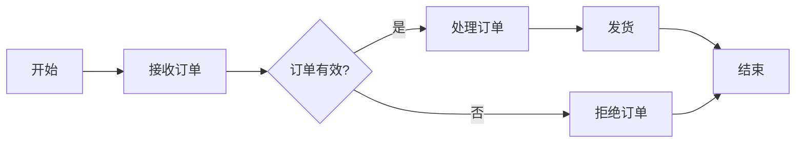

## 3. 语法

```
graph <方向>

开始绘制流程图
```

### 1. 方向

用于开头，声明流程图的方向。

| 方向  |   说明   |    备注    |
| :---: | :------: | :--------: |
|  TB   | 从上到下 | Top-Bottom |
|  BT   | 从下到上 | Bottom-Top |
|  LR   | 从左到右 | Left-Right |
|  RL   | 从右到左 | Right-Left |

> 🔔如果不指`<方向>`，那么默认是`TB`

### 2. 节点

Mermaid 的流程图中的节点是通过各种几何形状来表示流程中的不同元素。

- **无名字的节点**：直接写内容，此时节点边框为矩形，且<font color='red'><b>🚨节点内容不能有空格</b></font>。
- **有名字的节点**：节点名后书写内容，内容左右有特定符号，节点边框由符号决定，<font color='green'><b>节点内容可以有空格</b></font>。

下面是Mermaid流程图中常见的节点类型及其用途：

|    节点名称    |       语法       | 用途                   |
| :------------: | :--------------: | :--------------------- |
|  矩形（默认）  |   `id[ 文字 ]`   | 表示普通步骤或操作     |
|    圆角矩形    |   `id( 文字 )`   | 表示特定步骤或操作     |
|    体育场形    |  `id([ 文字 ])`  | 表示特殊步骤或操作     |
|    子程序形    |  `id[[ 文字 ]]`  | 表示子程序或子流程     |
|     圆柱形     |  `id[( 文字 )]`  | 表示数据存储或数据库   |
|      圆形      |  `id(( 文字 ))`  | 表示开始或结束点       |
|      菱形      |   `id{ 文字 }`   | 表示决策点             |
|     六边形     |  `id{{ 文字 }}`  | 表示特定事件或过程     |
|   平行四边形   |  `id[/ 文字 /]`  | 表示输入操作           |
| 反向平行四边形 |  `id[\ 文字 \]`  | 表示输出操作           |
|      梯形      |  `id[/ 文字 \]`  | 表示具有顺序的步骤     |
|    反向梯形    |  `id[\ 文字 /]`  | 表示具有顺序的反向步骤 |
|   不对称矩形   |   `id> 文字 ]`   | 表示条件或筛选步骤     |
|    双圈节点    | `id((( 文字 )))` | 表示重要的步骤或状态   |

```
graph LR

id1[ 矩形 ]
id2( 圆角矩形 )
id3([ 体育场形 ])
id4[[ 子程序形 ]]
id5[( 圆柱形 )]
id6(( 圆形 ))
id7{ 菱形 }
id8{{ 六边形 }}
id9[/ 平行四边形 /]
id10[\ 反向平行四边形 \]
id11[/ 梯形 \]
id12[\ 反向梯形 /]
id13> 不对称矩形 ]
id14((( 双圈节点 )))

id1 --- id2 --- id3 --- id4 --- id5 --- id6 --- id7
id8 --- id9 --- id10 --- id11 --- id12 --- id13 --- id14
```


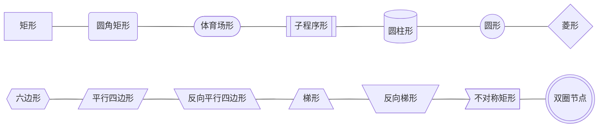

> 😂有一说一，全是颜文字

在 Mermaid 流程图中，节点通过连线（箭头或线）连接，表示流程的顺序和逻辑关系。节点的形状和内容可以根据流程的具体需求进行选择和设计，以清晰地展示流程的每个步骤和决策点。

### 3. 连线样式

Mermaid 流程图中的连线样式用于表示流程中步骤之间的关系和逻辑顺序。以下是 Mermaid 流程图的连线样式及其特点：

|        样式名称        |         语法          | 用途                                           |
| :--------------------: | :-------------------: | :--------------------------------------------- |
|          实线          |       `A --> B`       | 表示步骤之间的直接顺序关系，箭头指向下一个步骤 |
|         粗实线         |       `A ==> B`       | 表示强调的顺序关系或重要的步骤连接             |
|          虚线          |      `A -.-> B`       | 表示步骤之间的可选关系或条件分支               |
|        无箭头线        |       `A --- B`       | 表示步骤之间的连接，但不强调方向性             |
|       双向箭头线       |      `A <--> B`       | 表示步骤之间的双向关系或循环                   |
|    实线（带有文字）    | `A --> |线上文字| B`  | 表示带有说明文字的直接顺序关系                 |
|   粗实线（带有文字）   | `A ==> |线上文字| B`  | 表示带有说明文字的强调顺序关系                 |
|    虚线（带有文字）    | `A -.-> |线上文字| B` | 表示带有说明文字的可选关系或条件分支           |
|  无箭头线（带有文字）  | `A --- |线上文字| B`  | 表示带有说明文字的连接，但不强调方向性         |
| 双向箭头线（带有文字） | `A <--> |线上文字| B` | 表示带有说明文字的双向关系或循环               |

```
graph LR
实线 --- A --> B --> |线上文字| C

粗实线 --- D ==> E ==> |线上文字| F

虚线 --- G -.-> H -.-> |线上文字| I

无箭头线 --- J --- |线上文字| K

双向箭头线 --- L <--> M <--> |线上文字| N
```

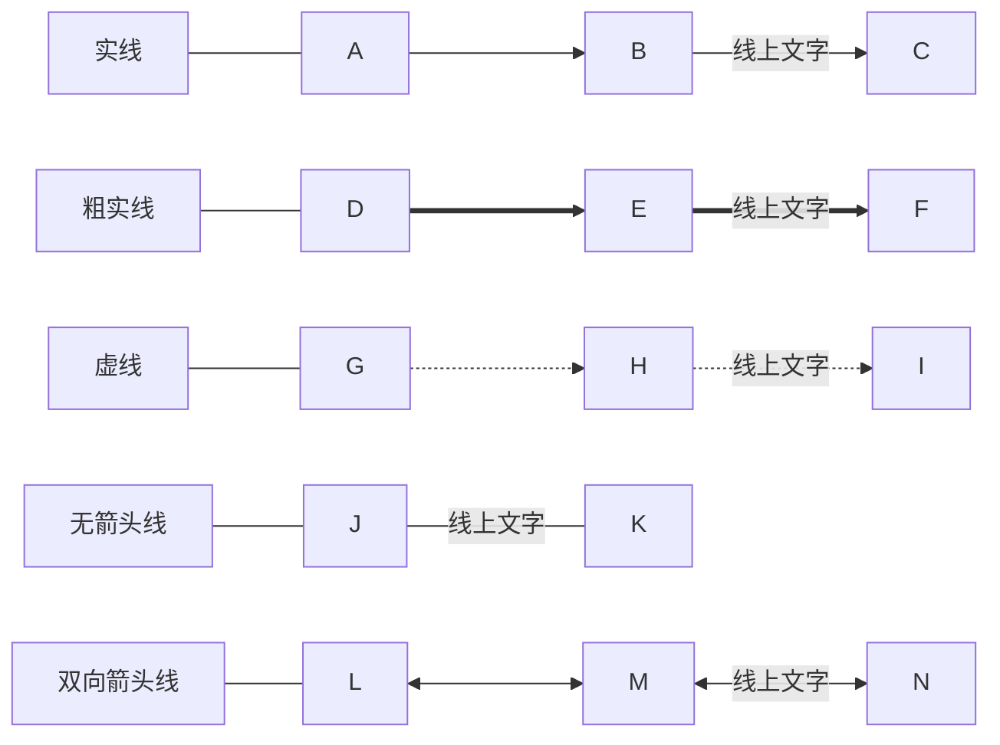

### 4. 选择多个节点

在 Mermaid 流程图中，`&` 符号用于表示节点之间的并行关系。具体来说，它用于将多个节点连接到同一个后续节点，表示这些节点可以同时进行，然后在某个点汇合。

- **用途**
  - **并行处理**：在流程中表示多个步骤可以同时进行，而不是按顺序执行。这在需要同时处理多个任务或操作时非常有用。
  - **汇合点**：用于将多个并行步骤的结果汇总到一个后续步骤中，继续后续流程。

- **示例**：以下是一个简单的 Mermaid 流程图示例，展示了如何使用 `&` 符号表示并行关系：

```
graph LR;

A[开始] --> B[步骤1];
A --> C[步骤2];
B & C --> D[汇合点];
D --> E[结束];
```


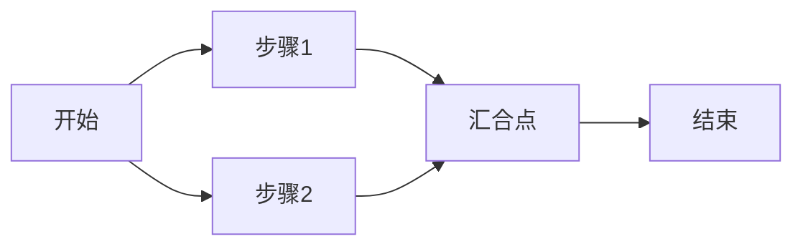

### 5. 子图

在 Mermaid 中，子图（Subgraphs）用于将相关的节点和连线组织在一起，使复杂的流程图更加清晰和易于理解。子图可以嵌套，也可以相互连接。

#### 1. 语法

```
subgraph 子图名称[子图标题]
    direction <方向>
    节点和连线定义
end
```

#### 2. 属性

1. 可以自定义方向
2. 可以嵌套
3. 子图间可以相互连接
4. 🔔与其他节点一样，如果子图名称包含空格或其他特殊字符，可能会导致错误。解决方法是使用中括号 `[ ]` 包裹子图名称

#### 3. 示例

```
graph LR;
    subgraph 一级子图
        direction TB
        subgraph 二级子图1
            direction RL
            i1 --> f1
        end
        subgraph 二级子图2
            direction BT
            i2 --> f2
        end
    end
    A --> 一级子图 --> B
    二级子图1 --> 二级子图2
```


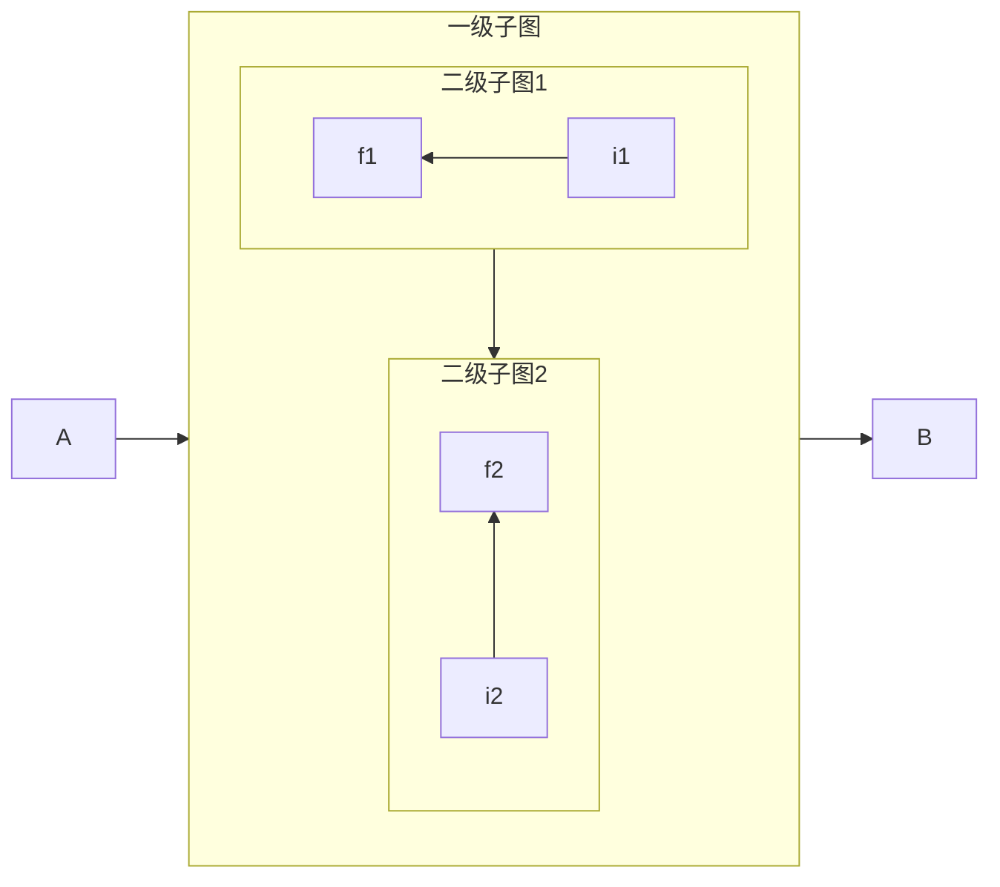


# 3. 时序图（Sequence Diagrams）

## 1. 主要用途

时序图（Sequence Diagrams）是一种用于展示系统中对象之间如何交互的 UML 图。它们主要用于**展现对象之间交互的顺序，这些交互以时间顺序排列**，通常用于系统分析和设计阶段来捕捉系统的动态行为。时序图描述了参与交互的对象集合以及它们之间消息传递的时间顺序，非常直观地表示了各个组件或对象在整个流程中的作用和活动。

> 🤔 𝑸𝒖𝒆𝒔𝒕𝒊𝒐𝒏：UML图是什么？
>
> 🥳 𝑨𝒏𝒔𝒘𝒆𝒓：UML（Unified Modeling Language，统一建模语言）图是一种用于软件工程和系统设计的标准化图形表示方法。它提供了一套丰富的图形符号和规则，用于描述系统的结构和行为。UML 图广泛应用于软件开发、系统分析、设计和文档化过程中，帮助开发团队更好地理解和沟通系统的各个方面。UML 图的主要用途为：
>
> 1. **系统建模**：UML 图用于创建系统的模型，帮助开发团队理解系统的结构和行为。
> 2. **需求分析**：通过 UML 图，可以更清晰地表达和分析系统的需求。
> 3. **设计和架构**：UML 图用于设计系统的架构，包括类、对象、组件和部署等。
> 4. **文档化**：UML 图作为系统文档的一部分，帮助维护和理解系统的结构和行为。
> 5. **沟通和协作**：UML 图提供了一种通用的语言，便于开发团队成员之间的沟通和协作。
>

## 2. 应用场景

1. **系统分析和设计**：帮助开发者和系统分析师理解系统运行的具体细节，便于发现系统设计中的问题，并且为代码实现提供参考。例如，在一个在线购物系统中，时序图可以用来表示用户、购物车、库存管理以及支付服务之间的交互过程。
2. **文档编写**：在技术文档中嵌入时序图，帮助读者更好地理解系统的交互逻辑。
4. **项目管理**：在项目管理中，时序图可以用于描述系统组件之间的交互，帮助团队成员理解项目的动态行为。

## 3 语法

### 1. 基本语法

时序图使用 `sequenceDiagram` 关键字定义。以下是一个简单的示例：

```
sequenceDiagram

Alice ->> Le0v1n: 发起对话
Le0v1n -->> Alice: 回复

Alice -) Le0v1n: 发起对话（不需要回复）
```

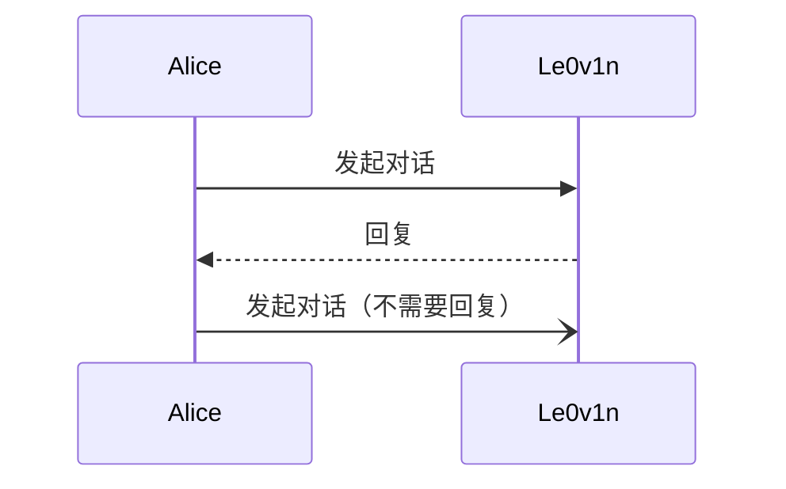

在这个示例中：
- `Alice` 和 `Le0v1n` 是参与者（participants）。
- `->>` 表示从一个参与者发送同步消息到另一个参与者。
- `-->>` 表示从一个参与者发送异步消息到另一个参与者。
- `-)` 表示从一个参与者发送异步消息到另一个参与者，但不等待回应。

### 2. 参与者（Participants）

参与者可以使用 `participant` 或 `actor` 关键字定义：

- `participant` ：一个普通的参与者
-  `actor` ：一个角色（通常是一个人）

```
sequenceDiagram
    participant Alice
    actor Le0v1n
    Alice->>Le0v1n: 发起对话
    Le0v1n-->>Alice: 对话回应
```


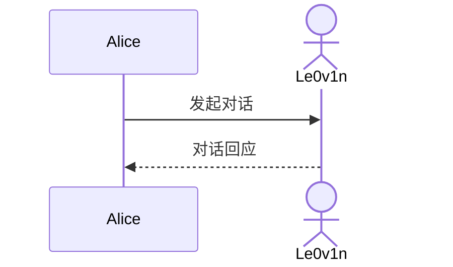

### 3. 消息（Messages）

消息是参与者之间传递的信息。消息可以是同步的（`->>`）或异步的（`-->>`）。

> 🤔 𝑸𝒖𝒆𝒔𝒕𝒊𝒐𝒏：在编程中，同步表示需要对方回应，异步表示不需要对方回应吗？
>
> 🥳 𝑨𝒏𝒔𝒘𝒆𝒓：在编程中，同步和异步的概念确实涉及到是否需要等待对方回应，但它们的含义和用途要更广泛和具体。以下是对同步和异步的详细解释：
>
> - 同步操作是指调用方（发起者）在发起一个操作后，必须等待该操作完成并得到结果后，才能继续执行后续代码。换句话说，调用方会被阻塞，直到操作完成。
>
> - 异步操作是指调用方在发起一个操作后，不需要等待该操作完成，可以立即继续执行后续代码。操作的结果通常通过回调函数、事件、Promise 或其他机制返回。
>

```
sequenceDiagram

    Alice ->> Le0v1n:询问?
    Le0v1n -->> Alice: 回复
```

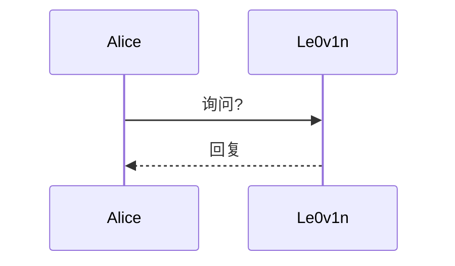

### 4. 激活期（Activations）

激活期表示参与者在一段时间内处于活跃状态。可以使用 `activate` 和 `deactivate` 关键字手动控制激活期，也可以使用 `+` 和 `-` 快捷表示法。

```
sequenceDiagram

    Alice ->> +Le0v1n: 询问（开始Le0v1n的激活状态）？
    Le0v1n -->> -Alice:回复（结束Le0v1n的激活状态）。
```

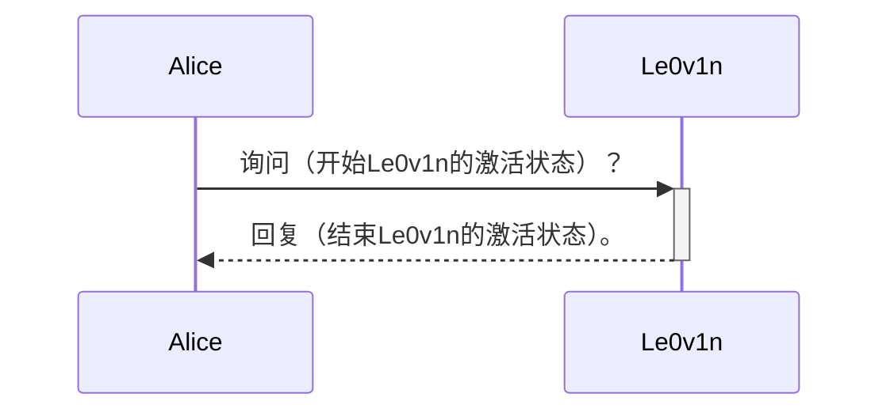

### 5. 循环（Loops）

循环用于表示重复的消息传递。可以使用 `loop` 和 `end` 关键字定义循环。

```
sequenceDiagram
    Alice ->> Le0v1n: 发起对话，之后开启循环
    
    loop 循环体名称（表明里面的行为是可以循环的）
        Alice ->> Le0v1n: Alice对Le0v1n的动作
        Le0v1n->>Le0v1n: Le0v1n对自己的动作
        Le0v1n ->> Alice: Le0v1n对Alice的动作
        Alice ->> Alice: Alice自己对自己的动作
    end
    
    Le0v1n-->>Alice: 结束对话!
```

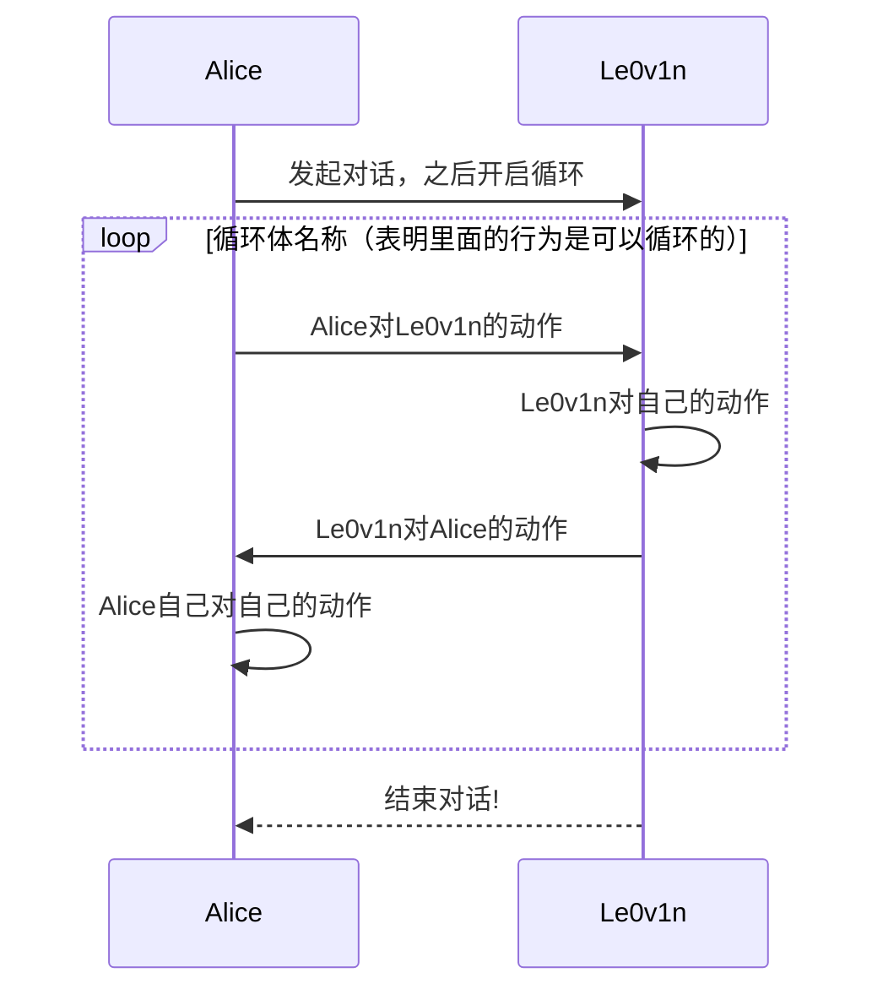

这个 Mermaid 时序图描述了 Alice 和 Le0v1n 之间的一段对话，其中包含一个循环体。下面是对这个时序图的详细解释：

- **时序图结构**
	1. **参与者**：
	   - **Alice**：一个参与者，发起对话并进行一系列动作。
	   - **Le0v1n**：另一个参与者，与 Alice 进行交互。

	2. **消息传递**：`Alice ->> Le0v1n: 发起对话，之后开启循环`：Alice 向 Le0v1n 发起对话，这个消息标志着对话的开始，并且之后进入一个循环体。
	3. **循环体**：`loop 循环体名称（表明里面的行为是可以循环的）`：定义一个循环体，表示里面的行为是可以重复执行的。
		- **循环体内的消息传递**：
			- `Alice ->> Le0v1n: Alice对Le0v1n的动作`：Alice 向 Le0v1n 发送一个消息，表示 Alice 对 Le0v1n 的某个动作。
			- `Le0v1n->>Le0v1n: Le0v1n对自己的动作`：Le0v1n 对自己执行一个动作，这通常表示内部处理或自反馈。
			- `Le0v1n ->> Alice: Le0v1n对Alice的动作`：Le0v1n 向 Alice 发送一个消息，表示 Le0v1n 对 Alice 的某个动作。
			- `Alice ->> Alice: Alice自己对自己的动作`：Alice 对自己执行一个动作，这同样表示内部处理或自反馈。
		- `end`：结束循环体的定义。
	4. **结束对话**：`Le0v1n-->>Alice: 结束对话!`：Le0v1n 向 Alice 发送一个消息，表示对话结束。

- **详细解释**

	- **发起对话**：Alice 向 Le0v1n 发起对话，这个消息标志着对话的开始。
		- **循环体**：
		  - **Alice 对 Le0v1n 的动作**：Alice 向 Le0v1n 发送一个消息，表示 Alice 对 Le0v1n 的某个具体动作。这可以是任何类型的交互，例如提问、请求、命令等。
		  - **Le0v1n 对自己的动作**：Le0v1n 对自己执行一个动作，这通常表示 Le0v1n 进行内部处理或自反馈。例如，Le0v1n 可能需要处理 Alice 的请求，进行一些计算或状态更新。
		  - **Le0v1n 对 Alice 的动作**：Le0v1n 向 Alice 发送一个消息，表示 Le0v1n 对 Alice 的某个具体动作。这可以是回答、响应、反馈等。
		  - **Alice 对自己的动作**：Alice 对自己执行一个动作，这同样表示 Alice 进行内部处理或自反馈。例如，Alice 可能需要处理 Le0v1n 的响应，进行一些计算或状态更新。


	- **结束对话**：Le0v1n 向 Alice 发送一个消息，表示对话结束。这个消息标志着整个交互过程的结束。


- **示例场景**：假设 Alice 和 Le0v1n 是两个正在聊天的用户，这个时序图可以描述他们的对话过程：
	1. **Alice 发起对话**：Alice 说：“你好，Le0v1n，我们开始聊天吧！”
	2. **循环体**：
	   - **Alice 对 Le0v1n 的动作**：Alice 问：“你今天过得怎么样？”
	   - **Le0v1n 对自己的动作**：Le0v1n 思考了一下。
	   - **Le0v1n 对 Alice 的动作**：Le0v1n 回答：“我今天过得不错，谢谢！”
	   - **Alice 对自己的动作**：Alice 听了 Le0v1n 的回答后，思考了一下。
	3. **结束对话**：Le0v1n 说：“好的，我们下次再聊吧！”
	4. **Alice 结束对话**：Alice 说：“好的，再见！”


通过这个时序图，可以清晰地看到 Alice 和 Le0v1n 之间的交互过程，包括发起对话、循环体内的多次交互以及结束对话。

### 6. 并发（Parallel）

并发用于表示多个操作可以同时发生。可以使用 `par` 和 `end` 关键字定义并发块。

```
sequenceDiagram
    participant User
    participant ServiceA
    participant ServiceB

    User->>ServiceA: 发起请求A
    par 并行处理
        ServiceA->>ServiceB: 请求数据B
        ServiceA->>ServiceA: 处理本地数据A
    end
    ServiceB-->>ServiceA: 数据响应B
    ServiceA-->>User: 最终响应
```

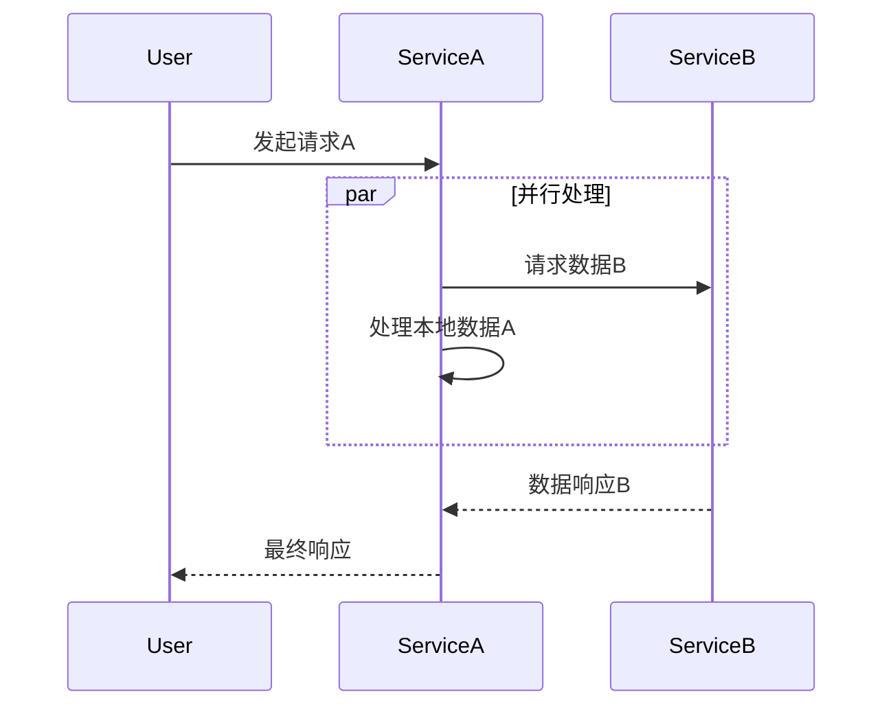

这个 Mermaid 时序图描述了一个用户（User）与两个服务（ServiceA 和 ServiceB）之间的交互过程，其中包含了一个并行处理的步骤。下面是对这个时序图的详细解释：

- **时序图结构**：

	1. **参与者**：

	   - **User**：用户，发起初始请求。
	   - **ServiceA**：第一个服务，处理用户的请求并与其他服务交互。
	   - **ServiceB**：第二个服务，提供数据支持。

	2. **消息传递**：

		- `User->>ServiceA: 发起请求A`：用户向 ServiceA 发起一个请求，请求的内容是 A。

		- `par 并行处理`：开始一个并行处理块，表示接下来的步骤可以同时进行。
		- `ServiceA->>ServiceB: 请求数据B`：ServiceA 向 ServiceB 发起一个请求，请求的内容是 B。
		- `ServiceA->>ServiceA: 处理本地数据A`：ServiceA 同时处理本地的数据 A。
		- `end`：结束并行处理块。
		- `ServiceB-->>ServiceA: 数据响应B`：ServiceB 向 ServiceA 返回请求 B 的响应。
		- `ServiceA-->>User: 最终响应`：ServiceA 向用户返回最终的响应。


- **详细解释**：
	1. **用户发起请求**：
	   - 用户向 ServiceA 发起一个请求，请求的内容是 A。这标志着整个交互过程的开始。

	2. **并行处理**：
	   - **并行处理块**：`par 并行处理` 表示接下来的步骤可以同时进行。这意味着 ServiceA 可以同时执行多个操作，而不需要等待每个操作依次完成。
	   - **请求数据 B**：ServiceA 向 ServiceB 发起一个请求，请求的内容是 B。这表示 ServiceA 需要从 ServiceB 获取一些数据。
	   - **处理本地数据 A**：ServiceA 同时处理本地的数据 A。这表示 ServiceA 在等待 ServiceB 的响应的同时，可以处理一些本地的数据，提高效率。
	3. **数据响应**：
		- **数据响应 B**：ServiceB 向 ServiceA 返回请求 B 的响应。这表示 ServiceB 已经处理完请求 B，并将结果返回给 ServiceA。
		- **最终响应**：ServiceA 向用户返回最终的响应。这表示 ServiceA 已经处理完所有必要的步骤，并将最终结果返回给用户。


- **示例场景**：假设这是一个在线购物系统，用户（User）发起一个购买请求，涉及多个服务的交互：
	1. **用户发起请求**：
	   - 用户在网站上点击“购买”按钮，向 ServiceA 发起一个购买请求。

	2. **并行处理**：
	   - **请求数据 B**：ServiceA 向 ServiceB 发起一个请求，请求库存数据（B）。
	   - **处理本地数据 A**：ServiceA 同时处理用户的订单信息（A），例如验证用户的支付信息、计算总价等。
	3. **数据响应**：
		- **数据响应 B**：ServiceB 返回库存数据，确认商品是否有足够的库存。
		- **最终响应**：ServiceA 根据库存数据和订单信息，生成最终的购买确认信息，并返回给用户。


通过这个时序图，可以清晰地看到用户与多个服务之间的交互过程，特别是并行处理部分，提高了系统的效率和响应性。

### 7. 注释（Notes）

注释用于在时序图中添加说明文字。可以使用 `Note` 关键字定义注释。

```
sequenceDiagram
    Alice ->> +Le0v1n: 询问？
    Note left of Alice: Alice开始询问
    Note right of Le0v1n: Le0v1n被激活
    Le0v1n -->> -Alice:回复
    Note right of Le0v1n: Le0v1n退出激活
    Note left of Alice: Alice没有动作了
```

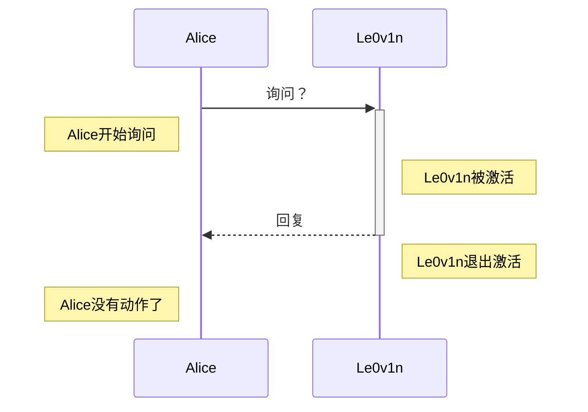

### 8. 序列号（Sequence Numbers）

可以为每个消息添加序列号，以帮助理解消息的顺序。可以使用 `autonumber` 关键字启用自动编号功能。

```
sequenceDiagram
	% 声明自动编号
	autonumber
	Alice -->> Le0v1n: 饭否？
	Le0v1n -->> Alice: 饭！
	Le0v1n -->> Tera: 一起吃饭不？
	Tera -->> Le0v1n: 吃！
	Tera -->> Alice: Okay！
```

> 🔔我这里全部使用了`-->>`，因为带有箭头直观上好理解一些。

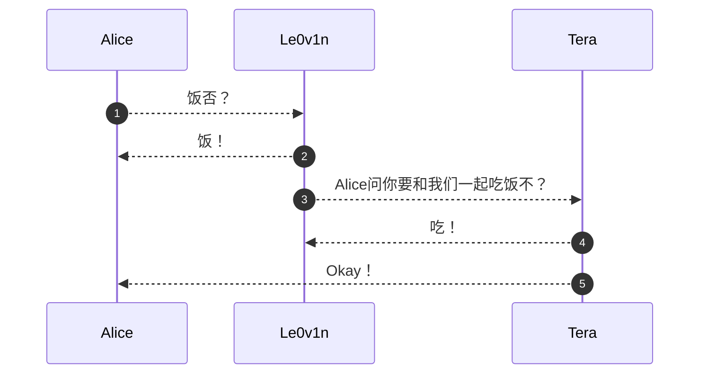

### 9. 角色菜单（Actor Menus）

Mermaid 序列图的 Actor Menus 功能是一项较新的互动性增强特性，它允许在序列图中为参与者（actors）添加上下文菜单。这些菜单可以包含一系列的操作或链接，当点击参与者时会显示出来。

> 🚨只能添加URL元素，不能添加其他元素。

```
sequenceDiagram
	autonumber
	participant Alice
	participant Le0v1n
	links Le0v1n: {"博客地址": "https://blog.csdn.net/weixin_44878336", "GitHub": "https://github.com/Le0v1n"}
	
	Alice -->> Le0v1n: 你有个人网站吗？
	Le0v1n -->> Alice: 当然有了。
	Alice -->> Le0v1n: 在哪里呢？
	Le0v1n -->> Alice: 鼠标在我第一行的元素块就有下拉菜单了
```

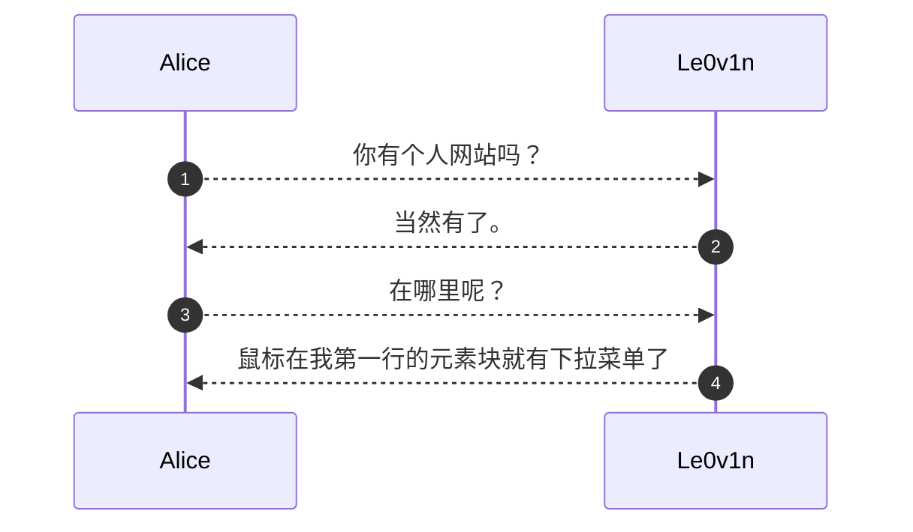

# 4. 甘特图（Gantt Charts）

## 1. 主要用途

甘特图主要用于**项目管理和时间规划**，它通过图形化的方式展示项目的时间线，帮助团队清晰地看到每个任务的开始和结束时间，以及任务之间的依赖关系。甘特图的主要用途包括：
- **项目规划**：在项目开始前，规划各个任务的时间安排，确保项目按时完成。
- **进度跟踪**：在项目执行过程中，跟踪任务的完成情况，及时调整计划。
- **资源分配**：合理分配资源，确保关键任务得到足够的资源支持。
- **沟通协调**：向团队成员和利益相关者清晰地展示项目进度，促进沟通和协调。

## 2. 应用场景

甘特图适用于多种需要细致规划和时间管理的场景，包括但不限于：
- **软件开发**：规划软件项目的各个阶段，如需求分析、设计、开发、测试和上线。
- **建筑工程**：管理建筑项目的各个施工阶段，确保工程按时交付。
- **活动策划**：安排活动的筹备和执行阶段，确保活动顺利进行。
- **产品开发**：规划产品的设计、开发、测试和发布流程，确保产品按时上市。

## 3. 语法

### 1. 任务格式

- `<状态标记>, <任务id>, <开始时间>, <结束时间/时间长度>`
- `<状态标记>, <任务id>, <开始时间>, after <其他任务的id>`

任务的元数据格式如下表所示：

| 元数据语法                                             | 开始日期                             | 结束日期                           | ID       |
| ------------------------------------------------------ | ------------------------------------ | ---------------------------------- | -------- |
| `<状态标记>, <taskID>, <startDate>, <endDate>`         | 使用 `dateFormat` 解释的 `startDate` | 使用 `dateFormat` 解释的 `endDate` | `taskID` |
| `<状态标记>, <taskID>, <startDate>, <length>`          | 使用 `dateFormat` 解释的 `startDate` | 开始日期 + `length`                | `taskID` |
| `<状态标记>, <taskID>, after <otherTaskId>, <endDate>` | 先前指定任务的结束日期 `otherTaskID` | 使用 `dateFormat` 解释的 `endDate` | `taskID` |
| `<状态标记>, <taskID>, after <otherTaskId>, <length>`  | 先前指定任务的结束日期 `otherTaskID` | 开始日期 + `length`                | `taskID` |

> 💡持续时间可以使用具体的日期，也可以使用：
>
> - `d`表示天数
> - `w`表示周数
> - `y`表示年数

### 2. 状态标记

- `active`：表示任务正在进行中。
- `done`：表示任务已完成。
- `crit`：表示任务是关键路径上的任务。
- `milestone`：里程碑通常表示项目中的关键事件，使用类似任务的语法，但持续时间通常是1天。

### 3. 日期格式

- `dateFormat`：定义日期格式，例如 `YYYY-MM-DD`。
- `axisFormat`：定义坐标轴的日期格式，例如 `%Y-%m-%d`。

### 4. 排除日期

`excludes` 属性可以排除以下几种类型的日期：

1. **具体日期**：以 `YYYY-MM-DD` 格式指定的特定日期。例如，`excludes 2024-02-23` 可以排除 2024 年 2 月 23 日。
2. **星期几**：一周中的某一天，如 `"sunday"`。例如，`excludes sunday` 可以排除所有的周日。
3. **周末**：使用 `"weekends"` 可以排除所有的周末（默认是周六和周日）。

> ⚠️需要注意的是，`excludes` 不接受 `"weekdays"` 这个词。

### 5. 示例

```
gantt
	dateFormat YY-MM-DD
	axisFormat %y.%m.%d
	excludes weekends
	title XXX项目开发计划

	% 定义第一个section
	section 预研
	技术预研: done, preface1, 25-01-01, 1w
	方案预研: done, preface2, 25-01-01, 1w
	内部讨论: crit, done, preface3, after preface2, 2d
	
	section 研发
	前端: done, dev1, after preface3, 15d
	后端: done, dev2, after preface3, 30d
	前后端联调: active, co-dev, after b2, 7d
	
	section 测试
	功能测试: test1, after co-dev, 7d
	性能测试: test2, after co-dev, 14d
	打包: test3, after test2, 3d
	
	section 发布
	预发布: release1, after c3, 2025-03-31
	正式发布: release2, after release1, 2d
	功能上线: milestone, release3, after release2, 0d
```

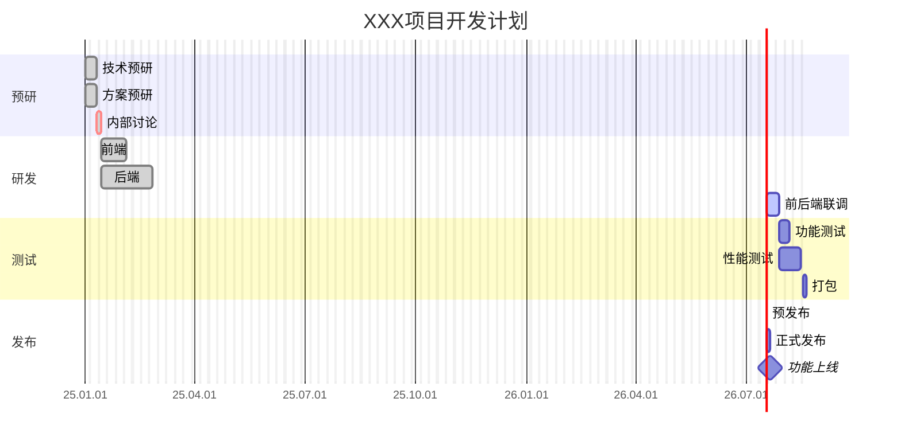

# 5. 饼图（Pie Charts）

饼图（Pie Charts）是一种用于展示数据比例关系的图表，通过将圆饼分割成几个扇区来显示每一部分的大小与整体的比例关系。

## 1. 主要用途

- **数据可视化**：直观地展示各部分占整体的比例，帮助用户快速理解数据的分布情况。例如，在统计学中，可以用来展示不同类别数据的占比。
- **报告与分析**：在报告中嵌入饼图，使数据更加直观易懂，便于读者快速把握关键信息。比如在市场调研报告中，展示不同产品的市场份额。
- **教学与演示**：在教学或演示过程中，用饼图清晰地呈现数据关系，增强教学效果，帮助学生或观众更好地理解概念。

## 2. 应用场景

- **商业领域**：用于展示市场份额、销售数据、客户分布等信息。例如，企业可以使用饼图来分析不同产品的销售额占总销售额的比例，从而了解哪些产品是主要的收入来源。
- **教育领域**：在统计学、数学等课程中，教师可以利用饼图来讲解数据比例、概率等概念，使抽象的理论知识更加形象化。
- **技术文档**：在技术文档中，开发者可以使用饼图来展示系统资源的占用情况、不同模块的代码量占比等，帮助其他开发者快速了解系统的结构。
- **个人项目**：个人在进行数据分析、项目规划等时，也可以使用饼图来整理和展示数据，便于自己分析和决策。

## 3. 语法

在Mermaid中，饼图使用`pie`关键字来声明，后续跟随的是一系列的键值对，用以描述各个扇区的标签和数值。以下是详细的语法介绍：

### 1. 基本结构

```
pie
    [title] [titlevalue] (可选)
    "[datakey1]" : [dataValue1]
    "[datakey2]" : [dataValue2]
    "[datakey3]" : [dataValue3]
    ...
```

### 2. 关键字说明

- `pie`：开始绘制饼图的标记。
- `title`：为饼图添加标题，后面跟随的文本是饼图的标题，它会显示在饼图的上方或中心，这也是可选的。
- **扇区定义**：每一行定义了一个扇区，其中包括扇区的名称和数值，例如`"Key lime pie" : 42.96`表示一个名为“Key lime pie”的扇区，它在饼图中占的比例为42.96%（相对比例，计算整体之和再分散比例），支持最多两位小数。

### 3. 数值要求

数值只支持`int`和`float`，并最多支持两位的小数。而且，这些数值不需要加起来等于100，Mermaid会自动计算总和并按比例分配各个扇区的大小。

> ⚠️不支持使用百分数，如$30\%$。

### 4. 示例

```
pie
    title 2025年1月开销占比
    "生活开销" : 2000
    "娱乐开销" : 1000
    "其他开销" : 800
```

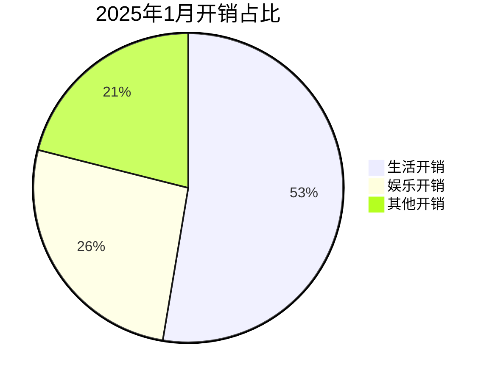

# 6. 用户旅行图（User Journey diagram）

Mermaid 中的用户旅行图（User Journey diagram）是一种用于描述用户在系统、应用程序或网站中完成特定任务所采取的步骤的图表。以下是关于用户旅行图的主要用途、应用场景和语法的详细介绍：

## 1. 主要用途

- **理解用户行为**：用户旅行图详细展示了用户在完成任务过程中的每一步操作，帮助团队更好地理解用户的实际行为和体验流程。例如，通过绘制用户在电商平台上的购物旅程，可以清晰地看到用户从浏览商品到下单支付的每一个环节。
- **发现改进点**：该图表能够揭示当前用户工作流程中存在的问题和改进空间，为产品优化和用户体验提升提供依据。比如发现用户在某个环节的满意度较低，就可以针对性地进行改进。

## 2. 应用场景

- **产品设计与优化**：在产品设计阶段，通过用户旅行图来规划和设计用户与产品的交互流程，确保产品功能符合用户需求；在产品优化时，根据用户反馈和旅行图分析，找出需要改进的地方，提升产品易用性和用户满意度。例如，软件开发团队可以利用用户旅行图来优化软件的操作流程，减少用户在使用过程中的困惑和挫折。
- **服务流程改进**：适用于各种服务行业，如酒店、餐饮、零售等，通过绘制用户与服务接触的全过程，发现服务流程中的瓶颈和不足，从而优化服务流程，提高服务质量。比如酒店可以绘制客人从预订到离店的整个旅程图，改善客人在入住和退房等环节的体验。
- **用户体验研究**：作为用户体验研究的工具之一，用户旅行图可以帮助研究人员收集和整理用户在使用产品或服务过程中的反馈信息，包括用户的情感体验、遇到的问题等，为深入研究用户体验提供可视化依据。

## 3. 语法

用户旅行图的语法相对简单，主要由标题、阶段（section）和任务（task）组成，具体如下：

### 1. 标题

使用 `title` 关键字后跟图表的标题，用于简要说明整个用户旅行图的主题或目的。例如 `title My working day`。

### 2. 阶段（section）

使用 `section` 关键字定义用户旅行的不同阶段或部分，每个阶段代表用户完成任务的一个主要环节。例如 `section Go to work` 表示上班阶段。

### 3. 任务（task）

在每个阶段下，使用 `任务名称: 评分: 参与者` 的格式来描述具体的任务。其中，任务名称是用户执行的操作或步骤；评分是一个0到5之间的数字，用于表示该任务的满意度或重要性等；参与者是执行该任务的用户或角色，多个参与者用逗号分隔。例如 `Make tea: 5: Me` 表示“我”在上班阶段“泡茶”这个任务的满意度为5。

### 4. 示例

以下是一个完整的用户旅行图示例：

```
journey
    title 在线购物网站使用旅程
    section 浏览商品
      登录网站 : 4 : 用户
      浏览商品分类 : 5 : 用户
      查看商品详情 : 4 : 用户
    section 加入购物车
      选择商品规格 : 5 : 用户
      点击加入购物车 : 5 : 用户
    section 结算支付
      点击去结算 : 2 : 用户
      选择收货地址 : 5 : 用户
      选择支付方式并支付 : 3 : 用户
    section 查看订单
      查看订单详情 : 4 : 用户
      确认收货 : 5 : 用户
```

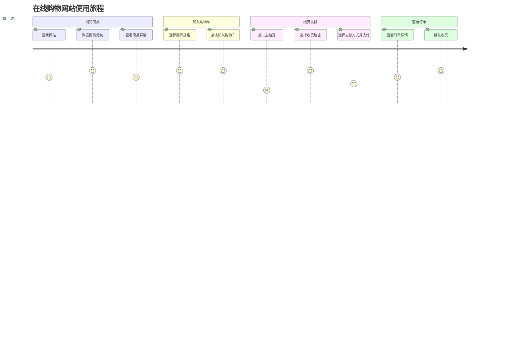

每个任务都详细描述了用户在该阶段的具体操作，如“登录网站”“选择商品规格”等，评分反映了用户对这些任务的满意度，参与者均为“用户”，因为在这个过程中主要是用户在操作。

# 7. 类图（Class Diagrams）

### 1. 主要用途

类图是面向对象建模中用于描述系统结构的核心工具。它主要用于以下几个方面：
- **概念建模**：用于对应用结构进行概念建模，帮助理解系统中的类及其关系。
- **代码生成**：将概念模型翻译成具体的程序代码，辅助软件开发。
- **数据建模**：用于描述数据结构及其关系，适用于数据库设计等场景。

### 2. 应用场景

- **软件设计**：在软件开发的早期阶段，类图可以帮助开发团队**理解系统的结构和组件之间的关系，从而设计出更合理的系统架构**。
- **文档编写**：在项目文档中使用类图，可以清晰地展示系统的类结构，便于新成员快速理解和上手。
- **教学和培训**：在教育领域，类图是教授面向对象编程和设计模式的重要工具，帮助学生理解复杂的概念。
- **系统分析**：在系统分析阶段，类图可以用来识别系统中的关键类和它们之间的关系，从而优化系统设计。

### 3. 语法

Mermaid 的类图语法简洁明了，以下是一些基本的语法示例：

#### 1. 定义类

可以使用两种方式定义类及其成员：
1. **单行定义**：

   ```
   classDiagram
       class BankAccount {
           +String owner
           +BigDecimal balance
           +deposit(amount)
           +withdraw(amount)
       }
   ```

   

   ```mermaid
   classDiagram
       class BankAccount {
           +String owner
           +BigDecimal balance
           +deposit(amount)
           +withdraw(amount)
       }
   ```

2. **多行定义**：

   ```
   classDiagram
       class BankAccount {
           +String owner
           +BigDecimal balance
           +deposit(amount)
           +withdraw(amount)
       }
   ```

   

   ```mermaid
   classDiagram
       class BankAccount {
           +String owner
           +BigDecimal balance
           +deposit(amount)
           +withdraw(amount)
       }
   ```

#### 2. 定义类成员

- **属性**：使用 `+` 表示公共属性，`-` 表示私有属性，`#` 表示保护属性，`~` 表示包内属性，`$` 表示静态属性。
- **方法**：方法定义与属性类似，但需要在方法名后加上参数列表和返回类型。

| 类型 |   语法   | 说明                                                         |
| :--: | :------: | ------------------------------------------------------------ |
| `+`  | 公共属性 | 表示该属性是公共的，可以在类的外部被访问和修改。             |
| `-`  | 私有属性 | 表示该属性是私有的，只能在类的内部被访问和修改，类的外部无法直接访问。 |
| `#`  | 保护属性 | 表示该属性是受保护的，可以在类的内部以及子类中被访问和修改，但不能在类的外部被访问。 |
| `~`  | 包内属性 | 表示该属性是包内的，只能在同一个包内的类中被访问和修改。     |
| `$`  | 静态属性 | 表示该属性是静态的，属于类本身而不是类的某个特定实例，可以通过类名直接访问，而不需要创建类的实例。 |

#### 3. 泛型类型

泛型类型使用 `~` 表示，例如：

```
classDiagram
    class Square~Shape~ {
        int id
        List~int~ position
        setPoints(List~int~ points)
        getPoints() List~int~
    }
```


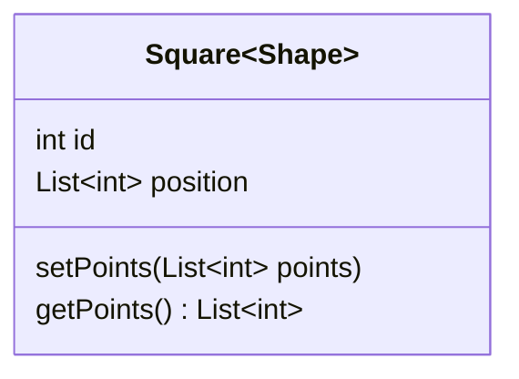

#### 4. 定义关系

类图中可以定义多种关系，包括继承、实现、关联、依赖、聚合和组合：
- **继承**：`<|--` 或 `--|>`

  ```
  classDiagram
      Animal <|-- Dog
  ```

  

  ```mermaid
  classDiagram
      Animal <|-- Dog
  ```

- **实现**：`<|..` 或 `..|`
  
  ```
  classDiagram
      Animal <|.. IDomestic
  ```
  
  
  
  ```mermaid
  classDiagram
      Animal <|.. IDomestic
  ```
  
- **关联**：`--`
  
  ```
  classDiagram
      classA -- classB
  ```
  
  
  
  ```mermaid
  classDiagram
      classA -- classB
  ```
  
- **依赖**：`..>`
  
  ```
  classDiagram
      classA ..> classB
  ```
  
  
  
  ```mermaid
  classDiagram
      classA ..> classB
  ```
  
- **聚合**：`o--`
  
  ```
  classDiagram
      classA o-- classB
  ```
  
  
  
  ```mermaid
  classDiagram
      classA o-- classB
  ```
  
- **组合**：`*--`
  
  ```
  classDiagram
      classA *-- classB
  ```
  
  
  
  ```mermaid
  classDiagram
      classA *-- classB
  ```

#### 5. 特殊标记

可以使用特殊标记来表示接口、抽象类等：
- **接口**：`<<interface>>`

  ```
  classDiagram
      class ICourse {
          +String name
          +select() Boolean
      }
      <<interface>> ICourse
  ```

  

  ```mermaid
  classDiagram
      class ICourse {
          +String name
          +select() Boolean
      }
      <<interface>> ICourse
  ```

- **抽象类**：`<<abstract>>`
  
  ```
  classDiagram
      class Animal {
          <<abstract>>
          +String name
          +eat(food: string): void
      }
  ```
  
  
  
  ```mermaid
  classDiagram
      class Animal {
          <<abstract>>
          +String name
          +eat(food: string): void
      }
  ```

#### 6. 注释

可以使用 `%%` 添加注释，解析器会自动忽略这些行：

```
classDiagram
    %% 这是一个注释，解析器自动忽略
    class Student
```


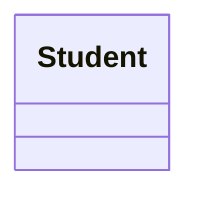

# 参考

1. [mermaid](https://github.com/mermaid-js/mermaid)
2. [KIMI](https://kimi.moonshot.cn/)
